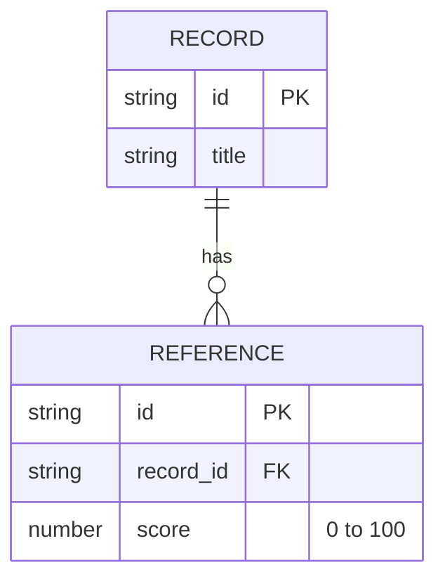

# Mermaid ERD syntax

Use a type and attribute name, followed by an optional key marker and quoted comment. `PK`, `FK` and `UK` are valid separate key markers. Existing figures also use names such as `id_PK`; these render as attribute names, without the separate key annotation. Keep pinned source/render pairs unchanged unless the figure itself is being revised. Use underscores inside multiword identifiers, and quoted comments for explanatory text or ranges.

See the [Mermaid ERD syntax reference](https://mermaid.js.org/syntax/entityRelationshipDiagram.html#attribute-keys-and-comments). Validate with the repository's pinned renderer, then inspect the SVG and its labels. Shared figures use canonical `.mmd`/`.svg` pairs as described in [documentation authoring](../DEVELOPMENT/Documentation.md#mermaid-diagrams).
