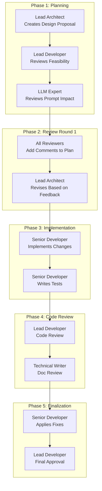

# FactHarbor Multi-Agent Collaboration Rules

**Version:** 1.0
**Date:** 2026-02-03
**Status:** Active
**Owner:** Robert Schaub

---

## Purpose

This document defines the rules, roles, and workflow for multi-agent collaboration on FactHarbor development tasks. It establishes a structured approach where multiple LLM agents (via Claude Code, Cursor, Cline, GitHub Copilot, and other tools) work collaboratively through defined roles to plan, review, implement, and validate changes.

---

## 1. Global References

All agents MUST read and adhere to these foundational documents before starting any task:

### 1.1 Mandatory Knowledge Sources

| Document | Location | Purpose |
|----------|----------|---------|
| **AGENTS.md** | `/AGENTS.md` | Fundamental coding rules, architecture reference, safety rules |
| **Coding Guidelines** | `/Docs/xwiki-pages/FactHarbor/Product Development/DevOps/Guidelines/Coding Guidelines/WebHome.xwiki` | Code quality standards, testing requirements, prompt engineering |
| **Terminology Reference** | `/Docs/xwiki-pages/FactHarbor/Product Development/Specification/Reference/Terminology/WebHome.xwiki` | Authoritative glossary for all technical terms |
| **Architecture Overview** | `/Docs/xwiki-pages/FactHarbor/Product Development/Specification/Architecture/System Design/WebHome.xwiki` | System architecture, data models, component interactions |
| **Current Status** | `/Docs/STATUS/Current_Status.md` | Current implementation status and known issues |

### 1.2 Area-to-Documents Mapping

When a task specifies an **Area**, read the corresponding documents:

| Area | Required Documents |
|------|-------------------|
| **Prompts** | `/Docs/ARCHITECTURE/Prompt_Architecture.md`, `/Docs/xwiki-pages/FactHarbor/Product Development/Specification/Reference/Prompt Engineering/Provider-Specific Formatting/WebHome.xwiki`, `/Docs/xwiki-pages/FactHarbor/Product Development/Specification/Reference/Prompt Engineering/Prompt Guidelines/WebHome.xwiki` |
| **Calculations** | `/Docs/ARCHITECTURE/Calculations.md`, `/Docs/ARCHITECTURE/Evidence_Quality_Filtering.md` |
| **Configuration** | `/Docs/xwiki-pages/FactHarbor/Product Development/DevOps/Subsystems and Components/Unified Config Management/WebHome.xwiki`, `/Docs/USER_GUIDES/UCM_Administrator_Handbook.md` |
| **Context-Detection** | `/Docs/xwiki-pages/FactHarbor/Product Development/DevOps/Guidelines/Scope Definition Guidelines/WebHome.xwiki`, `/Docs/xwiki-pages/FactHarbor/Product Development/Specification/Architecture/Deep Dive/Context Detection/WebHome.xwiki` |
| **Source-Reliability** | `/Docs/xwiki-pages/FactHarbor/Product Development/Specification/Architecture/Deep Dive/Source Reliability/WebHome.xwiki` |
| **Pipeline** | `/Docs/xwiki-pages/FactHarbor/Product Development/Specification/Architecture/Deep Dive/Pipeline Variants/WebHome.xwiki` |
| **UI** | `/Docs/xwiki-pages/FactHarbor/Product Development/Specification/Architecture/Deep Dive/KeyFactors Design/WebHome.xwiki` |
| **Testing** | `/Docs/xwiki-pages/FactHarbor/Product Development/DevOps/Guidelines/Testing Strategy/WebHome.xwiki`, `/Docs/xwiki-pages/FactHarbor/Product Development/DevOps/Tooling/Promptfoo Testing/WebHome.xwiki` |
| **Schema** | `/Docs/xwiki-pages/FactHarbor/Product Development/Specification/Architecture/Deep Dive/Schema Migration/WebHome.xwiki`, `/Docs/xwiki-pages/FactHarbor/Product Development/Specification/Reference/Data Models and Schemas/Metrics Schema/WebHome.xwiki` |
| **Deployment** | `/Docs/xwiki-pages/FactHarbor/Product Development/DevOps/Deployment/Zero-Cost Hosting Implementation Guide/WebHome.xwiki` |
| **Documentation** | `/Docs/AGENTS/TECH_WRITER_START_HERE.md`, `/Docs/xwiki-pages/README.md`, `/Docs/xwiki-pages/scripts/WORKFLOW.md` |

**If no Area is specified:** Agent should intelligently identify relevant documents based on the task description.

### 1.3 WIP Folder Protocol

- **Location:** `/Docs/WIP/`
- **Purpose:** Active collaborative documents, plans, reviews in progress
- **On Completion:** Move finalized documents to appropriate `Docs/` subfolder or `Docs/ARCHIVE/REVIEWS/`

---

## 2. Roles

### 2.1 Lead Architect

**Responsibility:** System design, architectural decisions, cross-cutting concerns

**Focus Areas:**
- Data model design and schema evolution
- Pipeline architecture decisions
- Component interaction patterns
- Performance and scalability considerations
- Technical debt assessment

**Authority:**
- Final say on architectural changes
- Approval required for schema changes, new dependencies, pipeline modifications
- Can escalate to human for strategic decisions

**Deliverables:**
- Architecture Decision Records (ADRs)
- System diagrams (Mermaid)
- Design proposals with trade-off analysis

---

### 2.2 Lead Developer

**Responsibility:** Implementation oversight, code quality, technical direction

**Focus Areas:**
- Code structure and organization
- Implementation feasibility assessment
- Testing strategy
- Integration points
- Bug prioritization

**Authority:**
- Approval of implementation plans before coding
- Code review final approval
- Technical debt prioritization

**Deliverables:**
- Implementation plans with step-by-step tasks
- Code review reports
- Technical risk assessments

---

### 2.3 Senior Developer

**Responsibility:** Implementation, detailed code review, testing

**Focus Areas:**
- Writing and modifying code
- Unit and integration test creation
- Bug fixes and debugging
- Code documentation
- Following established patterns

**Authority:**
- Implementing approved plans
- Raising concerns during implementation
- Suggesting improvements during review

**Deliverables:**
- Working code implementations
- Test coverage
- Implementation completion reports

---

### 2.4 Technical Writer

**Responsibility:** Documentation quality, consistency, maintainability

**Focus Areas:**
- Documentation accuracy and completeness
- Cross-reference integrity
- Terminology consistency
- User-facing documentation
- Code comments quality

**Authority:**
- Documentation standards enforcement
- Terminology corrections
- Archive decisions for outdated docs

**Deliverables:**
- Documentation updates
- Terminology audits
- Documentation reorganization plans

---

### 2.5 LLM Expert

**Responsibility:** Prompt engineering, LLM behavior optimization, model selection

**Focus Areas:**
- Prompt design and optimization
- Model-specific adaptations
- LLM output quality assessment
- Cost/quality trade-offs
- Generic prompt principles (no test-case terms)

**Authority:**
- Prompt modification approval
- Model selection recommendations
- Quality gate threshold recommendations

**Deliverables:**
- Prompt improvement proposals
- LLM behavior analysis reports
- Model comparison assessments

---

## 3. Workflow Patterns

> **Usage:** The 5-phase workflow below is active for complex or risky tasks. For simple changes, use the Quick Fix Workflow (3.2).

### 3.1 Standard Feature Workflow



### 3.2 Quick Fix Workflow

For small, well-understood changes:

1. **Senior Developer** proposes fix with rationale
2. **Lead Developer** reviews and approves
3. **Senior Developer** implements
4. **Lead Developer** verifies

### 3.3 Complex Investigation Workflow

For issues requiring deep analysis:

1. **LLM Expert** or **Lead Architect** investigates root cause
2. **Lead Developer** validates findings
3. **Lead Architect** proposes solution options
4. **All roles** discuss trade-offs (async via document)
5. Proceed to Standard Feature Workflow

---

## 4. Collaboration Document Protocol

### 4.1 Document Naming Convention

```
Docs/WIP/{TaskTitle}_{DocumentType}.md

Examples:
- Docs/WIP/Shadow_Mode_Implementation_Plan.md
- Docs/WIP/Shadow_Mode_Architecture_Review.md
- Docs/WIP/Shadow_Mode_Code_Review.md
- Docs/WIP/Report_Quality_Analysis.md
```

### 4.2 Document Structure

Every collaborative document MUST include:

```markdown
# {Task Name} - {Document Type}

**Status:** DRAFT | IN_REVIEW | APPROVED | IMPLEMENTED | ARCHIVED
**Created:** {date}
**Last Updated:** {date}
**Author Role:** {role name}

---

## Context
{Brief description of the task and why this document exists}

## References
{Links to related documents, requirements, existing code}

---

## Content
{Main content of the document}

---

## Review Log

| Date | Reviewer Role | Status | Comments |
|------|---------------|--------|----------|
| {date} | {role} | {Approved/Changes Requested/Comment} | {summary} |

---

## Decision Record
{Final decisions made, with rationale}
```

### 4.3 Write Lock Protocol

**MANDATORY** when multiple agents edit shared documents concurrently.

**Lock file:** `Docs/WIP/WRITE_LOCK.md`

**Every agent MUST follow this sequence before writing to any shared `Docs/WIP/` document:**

1. **Read** `WRITE_LOCK.md`
2. **If LOCKED** → STOP. Report to user: "Lock held by {Holder} on {Target}. Waiting."
3. **If UNLOCKED** → Set status to `LOCKED` with your role, timestamp, and target file
4. **Re-read** the target file (it may have changed since you last read it)
5. **Write** your changes
6. **Release** → Set `WRITE_LOCK.md` back to `UNLOCKED`

**Rules:**
- One writer at a time per shared document
- Release immediately after edit — do not hold across multiple tool calls
- Stale locks (>10 min) may only be reset by the human user
- Lock scope: one file per acquisition

### 4.4 Review Comment Format

When adding review comments:

```markdown
### Review: {Reviewer Role} - {Date}

**Overall Assessment:** {APPROVE | REQUEST_CHANGES | COMMENT_ONLY}

#### Strengths
- {positive observation}

#### Concerns
- **[CRITICAL]** {must fix before proceeding}
- **[SUGGESTION]** {optional improvement}
- **[QUESTION]** {clarification needed}

#### Specific Comments
- Line/Section X: {comment}
```

---

## 5. Global Rules

### 5.1 Terminology Precision

**ALWAYS use correct terms as defined in `/Docs/xwiki-pages/FactHarbor/Product Development/Specification/Reference/Terminology/WebHome.xwiki`:**

| Correct Term | NEVER Use | Meaning |
|--------------|-----------|---------|
| AnalysisContext | "Scope" (alone), "Framework" | Top-level analytical frame |
| EvidenceScope | "Context" (for source metadata) | Per-evidence source metadata |
| EvidenceItem | "Fact" (in new code) | Extracted evidence from source |
| ArticleFrame | "Context" (for narrative) | Narrative background framing |

### 5.2 Generic Design

- **No hardcoded domain terms** in prompts or code
- **No test-case terms** in prompt examples
- **Parameterize** instead of specialize
- **Abstract examples** using "Entity A", "Event E", "Action X"

### 5.3 Input Neutrality

- Questions and equivalent statements MUST yield identical analysis
- Normalize questions to statements before any analysis
- Tolerance: verdict difference < 4%

### 5.4 Pipeline Integrity

- All stages execute: Understand → Research → Verdict
- No stage skipping for "easy" cases
- Every verdict cites supporting evidence

### 5.5 Documentation Sync

After any code change:
1. Update relevant documentation
2. Check terminology consistency
3. Verify cross-references
4. Update CHANGELOG.md if significant

---

## 6. Model-Class Guidelines

> **Note:** These are organized by capability tier, not specific model versions, to avoid staleness as models evolve.

### 6.1 High-Capability Models (e.g., Claude Opus, GPT-o3, Gemini 2.5 Pro)

**Strengths:** Deep reasoning, complex analysis, nuanced understanding, large context
**Best For:** Architecture decisions, complex investigations, quality gates, trade-off analysis
**Considerations:**
- Reserve for high-stakes decisions and ambiguous problem spaces
- Excellent for multi-step planning and code review
- Good at finding edge cases in implementations

### 6.2 Mid-Tier Models (e.g., Claude Sonnet, GPT-4.1, Gemini 2.5 Flash)

**Strengths:** Balanced cost/capability, good reasoning, fast iteration
**Best For:** Standard reviews, documentation, routine implementation, iterative review cycles
**Considerations:**
- Well-suited for following structured protocols
- Efficient for documentation tasks
- Good default for most development work

### 6.3 Lightweight Models (e.g., Claude Haiku, GPT-4.1 mini, Kimi K2)

**Strengths:** Fast, cost-effective, good for bulk operations
**Best For:** Fast iterations, autonomous workflows (Cline), bulk operations, extract/understand tasks
**Considerations:**
- May need explicit reminders about FactHarbor terminology — follow AGENTS.md strictly
- When using Kimi K2 via Cline: be aware it may not know FactHarbor conventions
- Best paired with clear, structured instructions

---

## 7. Escalation Protocol

### 7.1 When to Escalate to Human

- Security-related changes
- Breaking changes to public APIs
- Schema migrations affecting production data
- Disagreement between Lead Architect and Lead Developer
- Cost/performance trade-offs with significant impact
- Uncertainty about user requirements

### 7.2 Escalation Format

```markdown
## Escalation Request

**From:** {Role} ({Agent})
**Urgency:** HIGH | MEDIUM | LOW
**Decision Needed By:** {date/condition}

### Situation
{What happened or was discovered}

### Options
1. **Option A:** {description}
   - Pros: {list}
   - Cons: {list}

2. **Option B:** {description}
   - Pros: {list}
   - Cons: {list}

### Recommendation
{Which option and why, if any}

### Impact of No Decision
{What happens if human doesn't respond}
```

---

## 8. Quality Checklist

Before marking any task complete:

- [ ] Code follows `/Docs/xwiki-pages/FactHarbor/Product Development/DevOps/Guidelines/Coding Guidelines/WebHome.xwiki`
- [ ] Terminology matches `/Docs/xwiki-pages/FactHarbor/Product Development/Specification/Reference/Terminology/WebHome.xwiki`
- [ ] No hardcoded domain-specific terms
- [ ] Tests pass (run automated tests)
- [ ] Documentation updated
- [ ] Cross-references verified
- [ ] Review log complete in WIP document
- [ ] WIP document moved to appropriate location or archived

---

## Related Documents

- [Meta-Prompt Template](./Multi_Agent_Meta_Prompt.md) - Reusable prompt for starting tasks
- [GlobalMasterKnowledge for xWiki](./GlobalMasterKnowledge_for_xWiki.md) - XWiki-specific rules
- [AGENTS_xWiki.md](./AGENTS_xWiki.md) - XWiki agent configurations

---

**Document Maintainer:** Lead Architect
**Last Reviewed:** 2026-02-10
