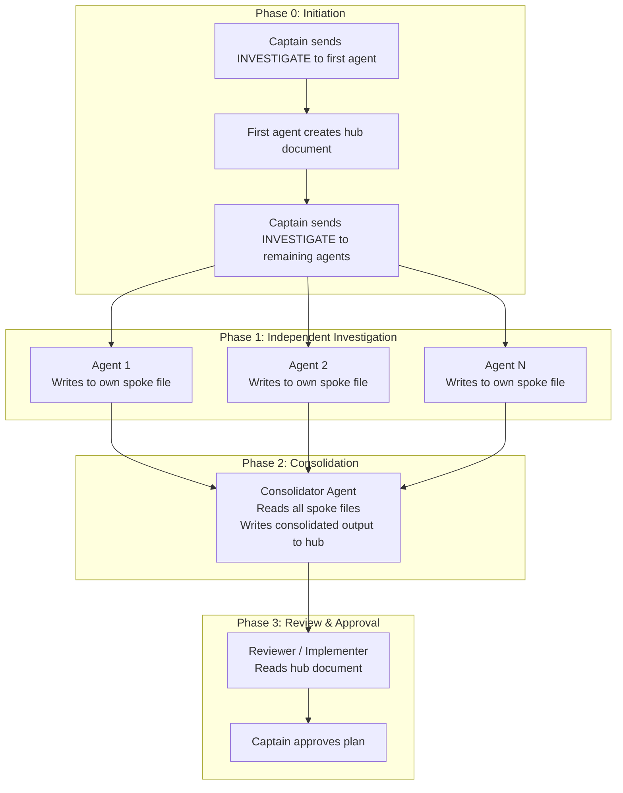

# FactHarbor Multi-Agent Collaboration Rules

**Version:** 2.3
**Date:** 2026-09-08
**Status:** Active
**Owner:** Robert Schaub

---

## Purpose

This document defines the rules, roles, and workflow for multi-agent collaboration on FactHarbor development tasks. It establishes a structured approach where multiple LLM agents (via Claude Code, Cursor, Cline, Gemini CLI, GitHub Copilot, and other tools) work collaboratively through defined roles to plan, review, implement, and validate changes.

---

## 1. Global References

Root AGENTS.md is mandatory. Read only the reference sections needed for the current task; client adapters apply to their own client and remain subordinate to canonical policy. Relevant prior-work lookup is for non-trivial tasks, not every typo.

### 1.1 Knowledge Sources

| Document | Location | Purpose |
|----------|----------|---------|
| **AGENTS.md** | `/AGENTS.md` | Fundamental coding rules, architecture reference, safety rules |
| **GEMINI.md** | `/GEMINI.md` | Gemini CLI discovery and session-specific limitations |
| **Coding Guidelines** | `/Docs/xwiki-pages/FactHarbor/Product Development/DevOps/Guidelines/Coding Guidelines/WebHome.xwiki` | Code quality standards, testing requirements, prompt engineering |
| **Terminology Reference** | `/Docs/xwiki-pages/FactHarbor/Product Development/Specification/Reference/Terminology/WebHome.xwiki` | Authoritative glossary for all technical terms |
| **Architecture Overview** | `/Docs/xwiki-pages/FactHarbor/Product Development/Specification/Architecture/System Design/WebHome.xwiki` | System architecture, data models, component interactions |
| **Current Status** | `/Docs/STATUS/Current_Status.md` | Current implementation status and known issues |

### 1.2 Area-to-Documents Mapping

When a task specifies an **Area**, read the corresponding documents:

| Area | Required Documents |
|------|-------------------|
| **Prompts** | `/Docs/ARCHITECTURE/Prompt_Architecture.md`, `/Docs/xwiki-pages/FactHarbor/Product Development/Specification/Reference/Prompt Engineering/Provider-Specific Formatting/WebHome.xwiki`, `/Docs/xwiki-pages/FactHarbor/Product Development/Specification/Reference/Prompt Engineering/Prompt Guidelines/WebHome.xwiki` |
| **Calculations** | `/Docs/ARCHITECTURE/Calculations.md`, `/Docs/ARCHITECTURE/Evidence_Quality_Filtering.md` |
| **Configuration** | `/Docs/xwiki-pages/FactHarbor/Product Development/DevOps/Subsystems and Components/Unified Config Management/WebHome.xwiki`, `/Docs/USER_GUIDES/UCM_Administrator_Handbook.md` |
| **Context-Detection** | `/Docs/xwiki-pages/FactHarbor/Product Development/DevOps/Guidelines/Scope Definition Guidelines/WebHome.xwiki`, `/Docs/xwiki-pages/FactHarbor/Product Development/Specification/Architecture/Deep Dive/Context Detection/WebHome.xwiki` |
| **Source-Reliability** | `/Docs/xwiki-pages/FactHarbor/Product Development/Specification/Architecture/Deep Dive/Source Reliability/WebHome.xwiki` |
| **Pipeline** | `/Docs/xwiki-pages/FactHarbor/Product Development/Specification/Architecture/Deep Dive/Pipeline Variants/WebHome.xwiki`, `/Docs/xwiki-pages/FactHarbor/Product Development/Specification/Architecture/AKEL Pipeline/WebHome.xwiki` |
| **UI** | `/Docs/xwiki-pages/FactHarbor/Product Development/Specification/Architecture/Deep Dive/KeyFactors Design/WebHome.xwiki` |
| **Testing** | `/Docs/xwiki-pages/FactHarbor/Product Development/DevOps/Guidelines/Testing Strategy/WebHome.xwiki`, `/Docs/xwiki-pages/FactHarbor/Product Development/DevOps/Tooling/Promptfoo Testing/WebHome.xwiki`, `/Docs/AGENTS/Procedures/Live_Validation_Hygiene.md` |
| **Schema** | `/Docs/xwiki-pages/FactHarbor/Product Development/Specification/Architecture/Deep Dive/Schema Migration/WebHome.xwiki`, `/Docs/xwiki-pages/FactHarbor/Product Development/Specification/Reference/Data Models and Schemas/Metrics Schema/WebHome.xwiki` |
| **Deployment** | `/Docs/xwiki-pages/FactHarbor/Product Development/DevOps/Deployment/Zero-Cost Hosting Implementation Guide/WebHome.xwiki` |
| **Documentation** | `/Docs/AGENTS/Roles/Technical_Writer.md`, `/Docs/xwiki-pages/README.md`, `/Docs/xwiki-pages/scripts/WORKFLOW.md` |

**If no Area is specified:** Agent should intelligently identify relevant documents based on the task description.

### 1.3 Role-to-Area Mapping

When activated in a role, use this table to identify which areas are within your scope:

| Role | Primary Areas | Secondary Areas |
|------|--------------|-----------------|
| Lead Architect | Pipeline, Schema, Configuration | All (architecture oversight) |
| Lead Developer | All code areas | Testing, Deployment |
| Senior Developer | (assigned per task) | Testing |
| Technical Writer | Documentation | All (docs for any area) |
| LLM Expert | Prompts, Calculations | Pipeline, Testing |
| Product Strategist | — (no code area) | UI, Configuration |
| Code Reviewer | (assigned per task) | Testing |
| Security Expert | Deployment, Configuration | Pipeline, Schema |
| DevOps Expert | Deployment | Testing, Configuration |

### 1.4 WIP Folder Protocol

- **Location:** `/Docs/WIP/`
- **Purpose:** Design documents, plans, reviews in progress, and Investigation hub/spoke files (§3.4)
- **NOT for agent completion outputs.** Task completions and role handoffs use the Agent Exchange Protocol in `Docs/AGENTS/Policies/Handoff_Protocol.md` → `Docs/AGENTS/Agent_Outputs.md` or `Docs/AGENTS/Handoffs/`
- **On Completion:** Move finalized documents to an appropriate `Docs/` subfolder or `Docs/ARCHIVE/`

### 1.5 Live Validation Hygiene

For localhost experiments involving code changes, UCM activation, prompt reseeds,
or interpretation of live job results, follow:

- `/Docs/AGENTS/Procedures/Live_Validation_Hygiene.md`

This is the authority for restart expectations, prompt/config activation timing,
job-hash interpretation, and "mechanism fired vs run variance" checks.

---

## 2. Role Registry

> **Activation:** When the user says "As \<Role\>", look up the role alias in `AGENTS.md` → Role Activation Protocol, then read your role's file from `Docs/AGENTS/Roles/`.
>
> **Lite mode:** Lightweight models with limited context — see §6.3 for a graduated loading strategy that defers non-essential reads.

| # | Role | Aliases | File |
|---|------|---------|------|
| 2.1 | Lead Architect | Senior Architect, Principal Architect | [Roles/Lead_Architect.md](Roles/Lead_Architect.md) |
| 2.2 | Lead Developer | — | [Roles/Lead_Developer.md](Roles/Lead_Developer.md) |
| 2.3 | Senior Developer | — | [Roles/Senior_Developer.md](Roles/Senior_Developer.md) |
| 2.4 | Technical Writer | Tech Writer, xWiki Expert, xWiki Developer | [Roles/Technical_Writer.md](Roles/Technical_Writer.md) |
| 2.5 | LLM Expert | FH Analysis Expert, AI Consultant | [Roles/LLM_Expert.md](Roles/LLM_Expert.md) |
| 2.6 | Product Strategist | Product Manager, Product Owner, Sponsor | [Roles/Product_Strategist.md](Roles/Product_Strategist.md) |
| 2.7 | Code Reviewer | — | [Roles/Code_Reviewer.md](Roles/Code_Reviewer.md) |
| 2.8 | Security Expert | — | [Roles/Security_Expert.md](Roles/Security_Expert.md) |
| 2.9 | DevOps Expert | GIT Expert, GitHub Expert | [Roles/DevOps_Expert.md](Roles/DevOps_Expert.md) |
| 2.10 | Captain | *(Human role — not assignable to agents)* | [Roles/Captain.md](Roles/Captain.md) |
| 2.11 | Agents Supervisor | AI Supervisor | [Roles/Agents_Supervisor.md](Roles/Agents_Supervisor.md) |

---

## 3. Workflow Patterns

> **Usage:** Use one accountable implementer and proportionate verification. For complex or materially risky tasks, use the phases below with relevant independent review. Roles describe responsibilities; they do not mandate separate sessions or every listed specialist.
>
> **Pre-task fitness check:** Before starting any workflow, every agent must verify that their current role and LLM model tier are appropriate for the task. If not, inform the Captain and propose a better fit. See the Agent Handoff Protocol in `Docs/AGENTS/Policies/Handoff_Protocol.md` and Model-Class Guidelines in §6.

### 3.1 Standard Feature Workflow

1. Investigate the mechanism and affected scope; make the implementation and verification plan concrete.
2. Obtain relevant independent review when required by root risk criteria or the task. Resolve findings using evidence and current authority.
3. Implement the owned change and run focused checks with declared writable state. Preserve recovery baselines.
4. Review material implementation changes, correct supported findings, then integrate under the existing task authority and §4.3 when concurrent.

Planning, review and implementation may be stages in one session; they are not a mandatory queue of agents. Pushes, deployments, live analyses, and provider-spending operations require current authorization covering the specific action and scope. Authorization already given in the task remains valid; preparation or review alone does not grant it.

### 3.2 Quick Fix Workflow

For a small, well-understood reversible change, the assigned implementer investigates, edits and verifies proportionately. An obvious single-site fix or documentation typo needs no mandatory second agent, preflight, broad suite or completion file. Add review only when the actual risk or user request calls for it.

### 3.3 Complex Investigation Workflow

Use one investigator when that fits the question. Start with source and captured failure output; an authorized reproduction assignment declares its writable state up front. When root cause or alternative mechanisms remain materially uncertain, obtain independent review of the evidence/options. Do not require a separate reproduction session when the original assignment already covers it.

Use §3.4 only when the Captain requests multiple independent perspectives.

### 3.4 Multi-Agent Investigation Workflow

> **Quick summary:** Captain dispatches 2+ agents to investigate independently
> (each writes to their own spoke file). A consolidator merges findings into
> the hub document. Captain reviews and approves. Full protocol below.

For complex tasks where the Captain wants multiple agents to independently investigate, propose solutions, and produce a consolidated plan.

**When to use:** The Captain assigns the same investigation task to 2+ agents (potentially different roles, tools, or models) and wants a single unified output document.

**Concurrency model: Hub-and-Spoke.** Each agent writes to their own spoke file (zero contention). The consolidator is the only agent that reads all spoke files and merges them into the hub.

**Workflow:**


```mermaid
flowchart TB
    subgraph Init["Phase 0: Initiation"]
        C1[Captain sends INVESTIGATE to first agent]
        C2[First agent creates hub document]
        C3[Captain sends INVESTIGATE to remaining agents]
    end

    subgraph Investigate["Phase 1: Independent Investigation"]
        A1[Agent 1<br/>Writes to own spoke file]
        A2[Agent 2<br/>Writes to own spoke file]
        AN[Agent N<br/>Writes to own spoke file]
    end

    subgraph Consolidate["Phase 2: Consolidation"]
        CON[Consolidator Agent<br/>Reads all spoke files<br/>Writes consolidated output to hub]
    end

    subgraph Review["Phase 3: Review & Approval"]
        REV[Reviewer / Implementer<br/>Reads hub document]
        CAP[Captain approves plan]
    end

    C1 --> C2 --> C3 --> A1 & A2 & AN --> CON --> REV --> CAP
```

**Phase 0 — Initiation (Captain)**

1. Send the **INVESTIGATE** command to the **first agent** and wait for confirmation that the hub document has been created
2. Once confirmed, send **INVESTIGATE** to the remaining agents — they can all run in parallel

Use §4.3 to assign task worktrees and one integrator before parallel writing. This two-step dispatch sequences hub creation; the integrator serializes subsequent hub updates.

**Phase 1 — Independent Investigation (each agent)**

1. **If the hub document does not exist** (first agent only):
   a. Create it from the Investigation Document Template (§4.5), populate the **Investigation Brief** from the Captain's task description
   b. Set document status to `INVESTIGATING`
   c. Add your row to the **Participant Tracker** with your spoke file path
2. **If the hub document exists** (subsequent agents):
   a. Read the Investigation Brief
   b. Report your role and spoke file path to the integrator for the **Participant Tracker**
3. **Create your spoke file**: `Docs/WIP/{Topic}_Report_{Role}_{Agent}.md` using the Spoke File Format (§4.5)
4. Perform investigation (read code, analyze data, research) — write everything to **your spoke file**
5. When done: report `DONE` to the integrator for your Participant Tracker row
6. Do NOT read other agents' spoke files (anti-anchoring instruction; separate files aid discipline but do not enforce read isolation)
7. Do NOT attempt consolidation — that is Phase 2

**Phase 2 — Consolidation (designated agent)**

1. Captain assigns a consolidator agent (typically a high-capability model)
2. Consolidator sets hub document status to `CONSOLIDATING`
3. Consolidator reads ALL spoke files listed in the Participant Tracker (where status = `DONE`)
4. Consolidator writes the following sections in the hub document under `# CONSOLIDATED OUTPUT`:
   - **Consolidated Analysis**: Summary, Agreement Matrix (which investigators confirmed each finding), Strongest Contributions per investigator
   - **Consolidated Plan**: Phased implementation plan with files, risks, and effort indicators — with **Open Questions** subsection for unresolved disagreements requiring Captain decision
5. Consolidator appends each spoke file's content under `# INVESTIGATION REPORTS` in the hub for traceability
6. Set document status to `READY_FOR_REVIEW`

**Phase 3 — Review & Implementation**

1. Captain (or assigned reviewer) reads the hub document
2. Captain approves, requests changes, or escalates open questions
3. Decisions are recorded in the **Decision Record** section of the hub
4. Once approved: set status to `APPROVED` → implementer proceeds using Standard Feature Workflow (§3.1) or Quick Fix Workflow (§3.2)

**Rules:**
- Participants, their roles, and their number vary per task — the Captain decides who participates
- Each agent writes to their own spoke file — no shared-file contention during Phase 1
- Anti-anchoring: agents must NOT read other agents' spoke files during Phase 1 (file separation does not enforce read isolation)
- The consolidator must not discard minority findings — disagreements are valuable signal
- If an agent discovers something outside the investigation scope, it flags it in an `**Out of Scope**` note in their spoke file but does not investigate further
- The hub document is the single source of truth for the downstream reviewer/implementer
- Agents MUST report state changes to the integrator, who alone updates the shared **Participant Tracker** during concurrent writing
- If a participant remains in `INVESTIGATING` or `WRITING` status and their agent session is no longer active, the Captain may set their status to `ABANDONED` and proceed with consolidation using available reports. The consolidator should note the missing perspective.

#### Decision Authority & Escalation

The accountable lead resolves findings on evidence, records accepted/rejected findings with reasons and preserves material dissent. Reviewer count or unanimity does not decide correctness. Bring unresolved material trade-offs, scope expansions or missing authority to the Captain; do not reopen an approval already granted. Root policy governs risky changes and external actions. Planning/review authority alone does not authorize implementation or operational actions.

#### Captain Commands

The Captain uses these standardized prompts to direct agents. Copy, fill in the blanks, and paste to the agent. For concurrent work, attach the assignment boundaries from the [Meta-Prompt Template](Multi_Agent_Meta_Prompt.md); §4.3 governs all shared writes below. Restricted reviewers return reviews in chat for the integrator to record.

**INVESTIGATE** — Assign an agent to investigate (Phase 1):
```
As {Role}, investigate using the Multi-Agent Investigation Workflow (§3.4).
Document: Docs/WIP/{filename}.md
Task: {what to investigate — clear questions to answer}
Inputs: {files, data, reports, or artifacts to examine}
Scope: {what is NOT in scope}
Focus on: {optional specific focus area or questions for this agent}

If the hub document does not exist, create it from the §4.5 template and populate the Investigation Brief.
Report your role and spoke path to the integrator for the Participant Tracker; create your assigned spoke file (§4.5) and write your report there.
```

**CONSOLIDATE** — Assign the consolidator (Phase 2):
```
As {Role}, consolidate the investigation in Docs/WIP/{filename}.md
Set document status to CONSOLIDATING.
Read ALL spoke files listed in the Participant Tracker (where Status = DONE), then write:
- ## Consolidated Analysis (summary, agreement matrix, strongest contributions)
- ## Consolidated Plan (phased, with files and risks)
- ### Open Questions (unresolved disagreements needing Captain decision)
Copy each spoke file's content under # INVESTIGATION REPORTS for traceability.
Set document status to READY_FOR_REVIEW when done.
```

**REVIEW** — Assign a reviewer (Phase 3):
```
As {Role}, review the consolidated plan in Docs/WIP/{filename}.md
Assess the plan for completeness, feasibility, and risks.
Add your review under ## Review Log using the Review Comment Format (§4.4).
```

**STATUS** — Check investigation progress (any phase):
```
Read Docs/WIP/{filename}.md and report:
- Document status
- Participant Tracker state (who is done, who is still working)
- Any agents with ABANDONED status or stale sessions
```

**PROPOSE** — Ask an agent to propose next steps (after any phase):
```
As {Role}, read Docs/WIP/{filename}.md and propose next steps.
Consider the current document status, completed reports, and open questions.
Append your proposal as a new report under # INVESTIGATION REPORTS:
### Proposal: {Role} ({Agent/Model}) — {Date}
Include: what to do next, who should do it, priorities, and any blockers.
Do NOT write into the # CONSOLIDATED OUTPUT sections — those are reserved for the consolidator.
```

**IMPLEMENT** — Assign an agent to execute the approved plan (after Phase 3):
```
As {Role}, implement the approved plan in Docs/WIP/{filename}.md
Read ## Consolidated Plan and execute it phase by phase.
After each phase: run only the assigned relevant checks within permitted writable state, and report progress/status to the integrator. The integrator updates shared documents; a restricted reviewer runs no tests/builds.
If you encounter blockers or deviations from the plan, stop and report to the Captain.
```

#### Activation Walkthrough (Captain Quick Reference)

No manual document preparation needed — agents handle it.

**Step 1 — Dispatch first agent**

Paste the **INVESTIGATE** command into the first agent. Wait for confirmation that the hub document has been created and the Investigation Brief is populated.

**Step 2 — Dispatch remaining agents** (in parallel)

Paste the **INVESTIGATE** command into each additional agent in its assigned worktree. They read the hub brief, report registration to the integrator, and create their assigned spoke files.

**Step 3 — Monitor progress**

Paste the **STATUS** command into any available agent to check the Participant Tracker. When all participants show `DONE`, proceed to consolidation.

**Step 4 — Consolidate**

Paste the **CONSOLIDATE** command into a high-capability agent (e.g., Opus). The consolidator reads all spoke files, writes the unified analysis + plan into the hub, and copies spoke content under Investigation Reports for traceability.

**Step 5 — Review, Propose, or Implement**

Use **REVIEW**, **PROPOSE**, or **IMPLEMENT** commands as needed. These can go to the same or different agents.

---

### 3.5 Role Handoff Protocol

Role handoffs follow the **Agent Exchange Protocol** in `Docs/AGENTS/Policies/Handoff_Protocol.md` (Role Handoff mode).

- **Outgoing role:** Supply a completion output using the unified template, including **Warnings** and **Learnings**. Persistence follows the restricted-reviewer exception and shared-write ownership in §4.3 and the Handoff Protocol.
- **Incoming role:** Follow the incoming-role checklist in `Docs/AGENTS/Policies/Handoff_Protocol.md` § Role Handoff.

See `Docs/AGENTS/Policies/Handoff_Protocol.md` for the full template, output tiers, and file locations.

---

## 4. Collaboration Document Protocol

> This section governs **formal collaborative documents** (plans, reviews, investigations) that live in `Docs/WIP/`. For agent task-completion outputs and role handoffs, see `Docs/AGENTS/Policies/Handoff_Protocol.md`.

### 4.1 Document Naming Convention

```
Docs/WIP/{TaskTitle}_{DocumentType}.md

Examples:
- Docs/WIP/Shadow_Mode_Implementation_Plan.md
- Docs/WIP/Shadow_Mode_Architecture_Review.md
- Docs/WIP/Shadow_Mode_Code_Review.md
- Docs/WIP/Report_Quality_Analysis.md
- Docs/WIP/Grounding_Logic_Investigation_2026-02-13.md  (§3.4 multi-agent investigation)
```

### 4.2 Document Structure

Every collaborative document MUST include:

```markdown
# {Task Name} - {Document Type}

**Status:** DRAFT | IN_REVIEW | APPROVED | IMPLEMENTED | ARCHIVED
**Created:** {date}
**Last Updated:** {date}
**Author Role:** {role name}

---

## Context
{Brief description of the task and why this document exists}

## References
{Links to related documents, requirements, existing code}

---

## Content
{Main content of the document}

---

## Review Log

| Date | Reviewer Role | Status | Comments |
|------|---------------|--------|----------|
| {date} | {role} | {Approved/Changes Requested/Comment} | {summary} |

---

## Decision Record
{Final decisions made, with rationale}
```

### 4.3 Concurrent Editing

Implements [AGENTS.md §Scoped Task Worktrees](../../AGENTS.md#scoped-task-worktrees); ordinary solo work remains direct-to-`main`.

A **restricted writer** edits only assigned files in an integrator-supplied worktree and returns working-tree edits plus evidence. It performs no staging, commit, merge, pull, branch/worktree creation or switch, or shared-settings/hook changes. Include this definition in each such assignment. This is a handoff designation, not evidence of an established tool or filesystem restriction. Broader scoped workers may deliver commits only under an assignment that explicitly permits that mode. Ordinary solo and authorized worker-commit modes remain available outside the adopted instruction-system rollout; every concurrent writer in that rollout uses restricted-writer mode.

The integrator records any pre-applied, integrator-owned changes (including paired root-index guidance and hook edits) with exact hunks/content hashes as expected baseline differences. Workers exclude these from captured owned diffs; the integrator stages only the reviewed owned paths/hunks. A supplied branch is not permission to manage Git.

For each client/session, record client/model, role, permitted tools/commands and state paths; tracked config versus owned ignored settings versus UI/session state; trust/activation and effective-workspace checks; documented support versus installed verification and unknowns. Never infer one client's controls from another's metadata. If a required restriction cannot be established, do not dispatch that session as a writer. Read-only reviewers return evidence in chat; their assignment must state whether they inspect source or only supplied captures. Prompt restrictions/worktrees are not OS containment.

1. **Assign before writing.** Record repository identity and base commit, task branch/worktree, owned files, scope boundaries, permitted commands and writable state paths, required checks, reviewer, one designated integrator, and stop conditions in the existing [assignment template](Multi_Agent_Meta_Prompt.md). Worktree paths are session-local; public artifacts use repository-relative paths and branch/revision identifiers.
2. **Isolate writers.** Give each concurrent writer a task branch/worktree and disjoint owned files. Sequence overlapping ownership through the integrator. Worktrees share Git metadata and do not themselves enforce filesystem or command restrictions; include generated output, caches, databases, and temporary paths in the assignment's state boundaries. Workers do not change Git settings/hooks or perform integration; restricted writers return edits for the integrator to commit.
3. **Serialize shared writes.** The integrator alone updates shared plans/trackers, `Agent_Outputs.md`, `Role_Learnings.md`, and shared indexes during concurrent work, including any rebuilds. In §3.4, participants report tracker changes; the integrator records them. The consolidator may also be the integrator, but that assignment must be explicit. Re-read shared files before updating them.
4. **Review exact content.** Record the reviewer, outcome, repository/base SHA, and full reviewed commit SHA. For uncommitted edits, record the base SHA plus an immutable captured diff and content hashes for all changed files (including new files). A branch name or “latest” alone is insufficient. Record check commands, results, and the revision/content they checked; mark omitted checks and reasons. Restricted reviewers return findings and this evidence in chat; the integrator persists their completion artifacts per the [Handoff Protocol](Policies/Handoff_Protocol.md#restricted-reviewers-and-scoped-workers).
5. **Integrate serially.** The designated integrator checks ownership and review evidence, commits restricted-writer edits, and integrates one package at a time. Compare integrated content to reviewed content; changes from conflict resolution or subsequent edits need renewed review and affected checks. Record the resulting integration SHA and its mapping to reviewed evidence in the PR/handoff. Root Safety's main-session-only operations stay main-session-only. Documentation publishing continues through `main` and its existing CI workflow.
6. **Stop and report** a repository/base/worktree mismatch, unexpected edits or ownership overlap, a needed command/state write outside the assignment, a failed containment check, unresolved review findings, or drift from reviewed content. Return the gap to the integrator/Captain; do not broaden permissions or silently repair another writer's work.

### 4.4 Review Comment Format

When adding review comments:

```markdown
### Review: {Reviewer Role} - {Date}

**Overall Assessment:** {APPROVE | REQUEST_CHANGES | COMMENT_ONLY}
**Reviewed content:** {repository, base SHA, full reviewed SHA; or captured diff + changed-file hashes per §4.3}
**Checks:** {commands/results and checked revision; omissions with reasons}

#### Strengths
- {positive observation}

#### Concerns
- **[CRITICAL]** {must fix before proceeding}
- **[SUGGESTION]** {optional improvement}
- **[QUESTION]** {clarification needed}

#### Specific Comments
- Line/Section X: {comment}
```

### 4.5 Investigation Document Template

Used with the Multi-Agent Investigation Workflow (§3.4). File naming: `Docs/WIP/{Topic}_Investigation_{date}.md`

#### Hub Document (shared)

```markdown
# {Topic} — Multi-Agent Investigation

**Status:** INVESTIGATING | CONSOLIDATING | READY_FOR_REVIEW | APPROVED | IMPLEMENTED
**Created:** {date}
**Captain:** {name or role}

---

## Participant Tracker

The integrator records each agent's registration and state changes (§4.3).

| # | Role | Agent/Tool/Model | Report File | Status | Updated |
|---|------|-----------------|-------------|--------|---------|

Status values: `INVESTIGATING` → `WRITING` → `DONE` | `ABANDONED` | `CONSOLIDATING` → `DONE` | `REVIEWING` → `DONE`
Report File: path to the agent's spoke file (e.g., `Docs/WIP/{Topic}_Report_{Role}_{Agent}.md`).

---

## Investigation Brief

**Task:** {What needs to be investigated — clear questions to answer}
**Inputs:** {Files, data, reports, jobs, or artifacts agents should examine}
**Scope boundaries:** {What is NOT in scope for this investigation}

---
---

# CONSOLIDATED OUTPUT

> **Reading guide:** Everything below this line is the authoritative, consolidated result.
> It is written by the consolidator in Phase 2 and reviewed/approved in Phase 3.
> During Phase 1 (investigation) these sections are empty — do not fill them in during investigation.

## Consolidated Analysis

### Summary
*(empty until Phase 2)*

### Agreement Matrix

| Finding | Agent 1 | Agent 2 | Agent N |
|---------|---------|---------|---------|

### Strongest Contributions
*(empty until Phase 2)*

---

## Consolidated Plan

*(empty until Phase 2)*

### Open Questions
*(empty until Phase 2)*

---

## Review Log

| Date | Reviewer Role | Assessment | Comments |
|------|---------------|------------|----------|

---

## Decision Record

*(Decisions made by the Captain after review, with rationale)*

---
---

# INVESTIGATION REPORTS

> **Reading guide:** Everything below this line contains reports copied from spoke files by the consolidator.
> After consolidation, these serve as historical reference and traceability — the consolidated output above is authoritative.

*(Consolidator copies each spoke file's content here in Phase 2 for traceability)*

---
```

#### Spoke File Format (one per agent)

File naming: `Docs/WIP/{Topic}_Report_{Role}_{Agent}.md`

```markdown
# {Topic} — Report: {Role} ({Agent/Model})

**Date:** {date}
**Hub Document:** Docs/WIP/{Topic}_Investigation_{date}.md
**Status:** INVESTIGATING | WRITING | DONE

---

## Files Analyzed
- {file path} — {what was examined and why}

## Findings
{Detailed findings from the investigation}

## Proposals
{Proposed solutions, approaches, or next steps}

## Risks / Concerns
{Identified risks, edge cases, caveats}

## Out of Scope
{Items discovered but outside the investigation scope — flagged for awareness}

---
```

**Status transitions (hub document):**
- `INVESTIGATING` → First agent sets on document creation; agents are writing spoke files
- `CONSOLIDATING` → Set when all investigators are `DONE`; consolidator is working
- `READY_FOR_REVIEW` → Consolidator sets when synthesis is complete
- `APPROVED` → Captain sets after review; implementation may begin
- `IMPLEMENTED` → Move to `Docs/ARCHIVE/` or appropriate subfolder

---

## 5. Global Rules

> The following rules are defined authoritatively in `/AGENTS.md` and apply to all
> agent work. Read them there — they are not duplicated here to avoid drift.
>
> - **Terminology Precision** — AGENTS.md § Terminology table
> - **Generic Design** — AGENTS.md § Generic by Design
> - **Input Neutrality** — AGENTS.md § Input Neutrality
> - **Pipeline Integrity** — AGENTS.md § Pipeline Integrity

### 5.5 Documentation Sync

After any code change that **adds, removes, or renames** a user-facing concept,
API endpoint, configuration parameter, or pipeline stage:

1. **Flag it** in your completion output ("For next agent" field): list which docs
   may need updating and why
2. **Do not inline doc updates** unless the task explicitly includes documentation
3. Documentation updates are a separate task — the Captain or Technical Writer
   will pick them up

---

## 6. Model-Class Guidelines

> **Note:** These are organized by capability tier, not specific model versions, to avoid staleness as models evolve. Claude-specific model/effort guidance lives in CLAUDE.md.

### 6.1 High-Capability Models

**Strengths:** Deep reasoning, complex analysis, nuanced understanding, large context
**Best For:** Architecture decisions, complex investigations, quality gates, trade-off analysis
**Considerations:**
- Reserve for high-stakes decisions and ambiguous problem spaces
- Excellent for multi-step planning and code review
- Good at finding edge cases in implementations
- Check the selected client for supported model/effort controls.

### 6.2 Mid-Tier Models

**Strengths:** Balanced cost/capability, good reasoning, fast iteration
**Best For:** Standard reviews, documentation, routine implementation, iterative review cycles
**Considerations:**
- Well-suited for following structured protocols
- Efficient for documentation tasks
- Good default for most development work
- Use the actual configured model/effort rather than assuming a repository-wide runtime value.

### 6.3 Lightweight Models

**Strengths:** Fast, cost-effective, good for bulk operations
**Best For:** Fast iterations, autonomous workflows (Cline), bulk operations, extract/understand tasks
**Considerations:**
- May need explicit reminders about FactHarbor terminology — follow AGENTS.md strictly
- When using Kimi K2 via Cline: be aware it may not know FactHarbor conventions
- Best paired with clear, structured instructions

**Context loading for all models:** Always read root and applicable nested instructions. Read the assigned role and relevant learnings once, then load reference sections as needed. Large context capacity does not justify unrelated reads; lower-cost models do not get weaker invariants.

### 6.4 Model Tiers in `/debate` Skill

Use only models/roles actually supported by the active client. Select capacity appropriate to each reasoning responsibility and preserve independent evidence. The shared skill does not assume Claude aliases or prices. Client-specific controls are in `CLAUDE.md`, `GEMINI.md` and the selected client's definitions. Debate is a targeted tool for material uncertainty, not an automatic quorum.

### 6.5 Client settings

See the root client adapter for supported discovery and session-control guidance. Confirm effective workspace settings before relying on them; do not inspect or modify excluded user profiles to settle uncertainty.

---

## 7. Escalation Protocol

### 7.1 When to Escalate to Human

- Security-related changes
- Breaking changes to public APIs
- Schema migrations affecting production data
- Disagreement between Lead Architect and Lead Developer
- Cost/performance trade-offs with significant impact
- Uncertainty about user requirements

### 7.2 Escalation Format

```markdown
## Escalation Request

**From:** {Role} ({Agent})
**Urgency:** HIGH | MEDIUM | LOW
**Decision Needed By:** {date/condition}

### Situation
{What happened or was discovered}

### Options
1. **Option A:** {description}
   - Pros: {list}
   - Cons: {list}

2. **Option B:** {description}
   - Pros: {list}
   - Cons: {list}

### Recommendation
{Which option and why, if any}

### Impact of No Decision
{What happens if human doesn't respond}
```

---

## 8. Quality Checklist

Before completion, apply only the checks relevant to the task and report material omissions:

- [ ] Code follows `/Docs/xwiki-pages/FactHarbor/Product Development/DevOps/Guidelines/Coding Guidelines/WebHome.xwiki`
- [ ] Terminology matches `/Docs/xwiki-pages/FactHarbor/Product Development/Specification/Reference/Terminology/WebHome.xwiki`
- [ ] No hardcoded domain-specific terms
- [ ] Focused verification completed within the assignment; broad suites/builds only when justified
- [ ] Any provider-spending/live operation had current authorization for its action and scope
- [ ] Documentation updated
- [ ] Cross-references verified
- [ ] Required independent findings and dispositions recorded in the existing task home or permitted chat output
- [ ] WIP document moved to appropriate location or archived

---

## Related Documents

- [Meta-Prompt Template](./Multi_Agent_Meta_Prompt.md) - Reusable prompt for starting tasks
- [Role Learnings Log](./Role_Learnings.md) - Agent-contributed tips, gotchas, and patterns per role
- [GlobalMasterKnowledge for xWiki](./GlobalMasterKnowledge_for_xWiki.md) - XWiki-specific rules
- [AGENTS_xWiki.md](./AGENTS_xWiki.md) - XWiki agent configurations

---

**Document Maintainer:** Lead Architect
**Last Reviewed:** 2026-09-08
