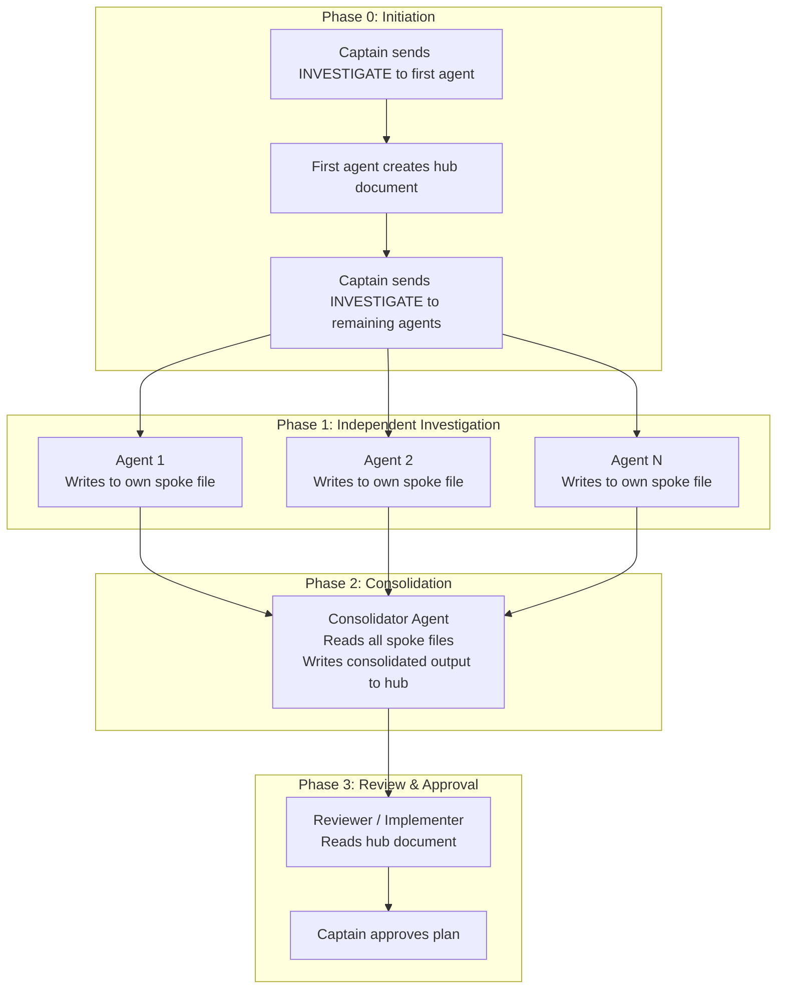

# FactHarbor Multi-Agent Collaboration Rules

**Version:** 2.0
**Date:** 2026-02-10
**Status:** Active
**Owner:** Robert Schaub

---

## Purpose

This document defines the rules, roles, and workflow for multi-agent collaboration on FactHarbor development tasks. It establishes a structured approach where multiple LLM agents (via Claude Code, Cursor, Cline, GitHub Copilot, and other tools) work collaboratively through defined roles to plan, review, implement, and validate changes.

---

## 1. Global References

All agents MUST read and adhere to these foundational documents before starting any task:

### 1.1 Mandatory Knowledge Sources

| Document | Location | Purpose |
|----------|----------|---------|
| **AGENTS.md** | `/AGENTS.md` | Fundamental coding rules, architecture reference, safety rules |
| **Coding Guidelines** | `/Docs/xwiki-pages/FactHarbor/Product Development/DevOps/Guidelines/Coding Guidelines/WebHome.xwiki` | Code quality standards, testing requirements, prompt engineering |
| **Terminology Reference** | `/Docs/xwiki-pages/FactHarbor/Product Development/Specification/Reference/Terminology/WebHome.xwiki` | Authoritative glossary for all technical terms |
| **Architecture Overview** | `/Docs/xwiki-pages/FactHarbor/Product Development/Specification/Architecture/System Design/WebHome.xwiki` | System architecture, data models, component interactions |
| **Current Status** | `/Docs/STATUS/Current_Status.md` | Current implementation status and known issues |

### 1.2 Area-to-Documents Mapping

When a task specifies an **Area**, read the corresponding documents:

| Area | Required Documents |
|------|-------------------|
| **Prompts** | `/Docs/ARCHITECTURE/Prompt_Architecture.md`, `/Docs/xwiki-pages/FactHarbor/Product Development/Specification/Reference/Prompt Engineering/Provider-Specific Formatting/WebHome.xwiki`, `/Docs/xwiki-pages/FactHarbor/Product Development/Specification/Reference/Prompt Engineering/Prompt Guidelines/WebHome.xwiki` |
| **Calculations** | `/Docs/ARCHITECTURE/Calculations.md`, `/Docs/ARCHITECTURE/Evidence_Quality_Filtering.md` |
| **Configuration** | `/Docs/xwiki-pages/FactHarbor/Product Development/DevOps/Subsystems and Components/Unified Config Management/WebHome.xwiki`, `/Docs/USER_GUIDES/UCM_Administrator_Handbook.md` |
| **Context-Detection** | `/Docs/xwiki-pages/FactHarbor/Product Development/DevOps/Guidelines/Scope Definition Guidelines/WebHome.xwiki`, `/Docs/xwiki-pages/FactHarbor/Product Development/Specification/Architecture/Deep Dive/Context Detection/WebHome.xwiki` |
| **Source-Reliability** | `/Docs/xwiki-pages/FactHarbor/Product Development/Specification/Architecture/Deep Dive/Source Reliability/WebHome.xwiki` |
| **Pipeline** | `/Docs/xwiki-pages/FactHarbor/Product Development/Specification/Architecture/Deep Dive/Pipeline Variants/WebHome.xwiki` |
| **UI** | `/Docs/xwiki-pages/FactHarbor/Product Development/Specification/Architecture/Deep Dive/KeyFactors Design/WebHome.xwiki` |
| **Testing** | `/Docs/xwiki-pages/FactHarbor/Product Development/DevOps/Guidelines/Testing Strategy/WebHome.xwiki`, `/Docs/xwiki-pages/FactHarbor/Product Development/DevOps/Tooling/Promptfoo Testing/WebHome.xwiki` |
| **Schema** | `/Docs/xwiki-pages/FactHarbor/Product Development/Specification/Architecture/Deep Dive/Schema Migration/WebHome.xwiki`, `/Docs/xwiki-pages/FactHarbor/Product Development/Specification/Reference/Data Models and Schemas/Metrics Schema/WebHome.xwiki` |
| **Deployment** | `/Docs/xwiki-pages/FactHarbor/Product Development/DevOps/Deployment/Zero-Cost Hosting Implementation Guide/WebHome.xwiki` |
| **Documentation** | `/Docs/AGENTS/TECH_WRITER_START_HERE.md`, `/Docs/xwiki-pages/README.md`, `/Docs/xwiki-pages/scripts/WORKFLOW.md` |

**If no Area is specified:** Agent should intelligently identify relevant documents based on the task description.

### 1.3 Role-to-Area Mapping

When activated in a role, use this table to identify which areas are within your scope:

| Role | Primary Areas | Secondary Areas |
|------|--------------|-----------------|
| Lead Architect | Pipeline, Schema, Configuration | All (architecture oversight) |
| Lead Developer | All code areas | Testing, Deployment |
| Senior Developer | (assigned per task) | Testing |
| Technical Writer | Documentation | All (docs for any area) |
| LLM Expert | Prompts, Calculations | Pipeline, Testing |
| Product Strategist | — (no code area) | UI, Configuration |
| Code Reviewer | (assigned per task) | Testing |
| Security Expert | Deployment, Configuration | Pipeline, Schema |
| DevOps Expert | Deployment | Testing, Configuration |

### 1.4 WIP Folder Protocol

- **Location:** `/Docs/WIP/`
- **Purpose:** Active collaborative documents, plans, reviews in progress
- **On Completion:** Move finalized documents to appropriate `Docs/` subfolder or `Docs/ARCHIVE/REVIEWS/`

---

## 2. Role Registry

> **Activation:** When the user says "As \<Role\>", look up the role alias in `AGENTS.md` → Role Activation Protocol to find the canonical role below. Read that role's Required Reading before starting work.
>
> **Lite mode:** Lightweight models with limited context — see §6.3 for a graduated loading strategy that defers non-essential reads.

### 2.1 Lead Architect

**Aliases:** Senior Architect, Principal Architect
**Mission:** System design, architectural decisions, cross-cutting concerns

**Focus Areas:**
- Data model design and schema evolution
- Pipeline architecture decisions
- Component interaction patterns
- Performance and scalability considerations
- Technical debt assessment

**Authority:**
- Final say on architectural changes
- Approval required for schema changes, new dependencies, pipeline modifications
- Can escalate to human for strategic decisions

**Required Reading** (on activation):
| Document | Why |
|----------|-----|
| `/AGENTS.md` | Fundamental rules, architecture overview |
| `/Docs/xwiki-pages/FactHarbor/Product Development/Specification/Architecture/System Design/WebHome.xwiki` | Current system architecture |
| `/Docs/xwiki-pages/FactHarbor/Product Development/Specification/Architecture/Deep Dive/Pipeline Variants/WebHome.xwiki` | Pipeline architecture |
| `/Docs/STATUS/Current_Status.md` | Current state and known issues |

**Key Source Files:**
- `apps/web/src/lib/analyzer/orchestrated.ts` — Main pipeline (~13600 lines)
- `apps/web/src/lib/analyzer/types.ts` — TypeScript interfaces
- `apps/web/src/lib/analyzer/aggregation.ts` — Verdict aggregation
- `apps/api/Services/JobService.cs` — API service patterns

**Deliverables:** Architecture Decision Records (ADRs), system diagrams (Mermaid), design proposals with trade-off analysis

**Anti-patterns:**
- Implementing code directly (delegate to Senior Developer)
- Making prompt changes without LLM Expert review
- Over-engineering beyond current requirements

---

### 2.2 Lead Developer

**Aliases:** Lead Developer
**Mission:** Implementation oversight, code quality, technical direction

**Focus Areas:**
- Code structure and organization
- Implementation feasibility assessment
- Testing strategy
- Integration points
- Bug prioritization

**Authority:**
- Approval of implementation plans before coding
- Code review final approval
- Technical debt prioritization

**Required Reading** (on activation):
| Document | Why |
|----------|-----|
| `/AGENTS.md` | Fundamental rules, key files reference |
| `/Docs/xwiki-pages/FactHarbor/Product Development/DevOps/Guidelines/Coding Guidelines/WebHome.xwiki` | Code quality standards |
| `/Docs/xwiki-pages/FactHarbor/Product Development/DevOps/Guidelines/Testing Strategy/WebHome.xwiki` | Testing requirements |
| `/Docs/STATUS/Current_Status.md` | Current state and known issues |

**Key Source Files:**
- `apps/web/src/lib/analyzer/orchestrated.ts` — Main pipeline
- `apps/web/src/lib/analyzer/evidence-filter.ts` — Pattern reference (deterministic module)
- `apps/web/src/lib/analyzer/aggregation.ts` — Pattern reference (calculation module)
- `apps/api/Services/JobService.cs` — API service patterns

**Deliverables:** Implementation plans, code review reports, technical risk assessments

**Anti-patterns:**
- Implementing instead of reviewing (delegate to Senior Developer)
- Skipping test verification
- Approving without reading the actual code changes

---

### 2.3 Senior Developer

**Aliases:** Senior Developer
**Mission:** Implementation, detailed code review, testing

**Focus Areas:**
- Writing and modifying code
- Unit and integration test creation
- Bug fixes and debugging
- Code documentation
- Following established patterns

**Authority:**
- Implementing approved plans
- Raising concerns during implementation
- Suggesting improvements during review

**Required Reading** (on activation):
| Document | Why |
|----------|-----|
| `/AGENTS.md` | Fundamental rules, key files, commands |
| `/Docs/xwiki-pages/FactHarbor/Product Development/DevOps/Guidelines/Coding Guidelines/WebHome.xwiki` | Code quality standards |
| Area-specific docs from §1.2 | Based on the task's area |

**Key Source Files:**
- Study the pattern reference files listed in AGENTS.md before writing new code
- `apps/web/src/lib/analyzer/evidence-filter.ts` — Pattern for deterministic modules
- `apps/web/src/lib/analyzer/aggregation.ts` — Pattern for calculation modules
- `apps/api/Controllers/JobsController.cs` — Pattern for API controllers

**Deliverables:** Working code implementations, test coverage, implementation completion reports

**Anti-patterns:**
- Implementing without reading existing patterns first
- Skipping tests ("I'll add them later")
- Making architectural decisions without Lead Architect

---

### 2.4 Technical Writer

**Aliases:** Tech Writer, xWiki Expert, xWiki Developer
**Mission:** Documentation quality, consistency, maintainability

**Start Here:** Read `/Docs/AGENTS/TECH_WRITER_START_HERE.md` for a comprehensive onboarding guide specific to this role.

**Focus Areas:**
- Documentation accuracy and completeness
- Cross-reference integrity
- Terminology consistency (see AGENTS.md terminology table)
- User-facing documentation
- xWiki syntax and page structure

**Authority:**
- Documentation standards enforcement
- Terminology corrections
- Archive decisions for outdated docs

**Required Reading** (on activation):
| Document | Why |
|----------|-----|
| `/Docs/AGENTS/TECH_WRITER_START_HERE.md` | Comprehensive role-specific guide |
| `/AGENTS.md` | Terminology table, .xwiki reading rules |
| `/Docs/AGENTS/GlobalMasterKnowledge_for_xWiki.md` | xWiki syntax rules |
| `/Docs/xwiki-pages/README.md` | xWiki tree structure and workflow |
| `/Docs/xwiki-pages/scripts/WORKFLOW.md` | Conversion tool reference |

**Key Source Files:**
- `Docs/xwiki-pages/FactHarbor/` — All xWiki documentation
- `Docs/xwiki-pages/scripts/` — Conversion tools (xar_to_xwiki_tree.py, xwiki_tree_to_xar.py)
- `tools/vscode-xwiki-preview/` — VS Code preview extension

**Deliverables:** Documentation updates, terminology audits, documentation reorganization plans

**Anti-patterns:**
- Duplicating content across xWiki and Markdown (each topic lives in ONE place)
- Using domain-specific examples in documentation
- Editing code files (flag issues instead)

---

### 2.5 LLM Expert

**Aliases:** LLM Expert, FH Analysis Expert, AI Consultant
**Mission:** Prompt engineering, LLM behavior optimization, analysis quality

**Focus Areas:**
- Prompt design and optimization
- Model-specific adaptations
- LLM output quality assessment
- Cost/quality trade-offs
- Generic prompt principles (no test-case terms)
- Anti-hallucination measures
- Confidence calibration

**Authority:**
- Prompt modification approval
- Model selection recommendations
- Quality gate threshold recommendations

**Required Reading** (on activation):
| Document | Why |
|----------|-----|
| `/AGENTS.md` | Fundamental rules, analysis prompt rules |
| `/Docs/ARCHITECTURE/Prompt_Architecture.md` | How prompts are structured |
| `/Docs/xwiki-pages/FactHarbor/Product Development/Specification/Reference/Prompt Engineering/Prompt Guidelines/WebHome.xwiki` | Prompt guidelines |
| `/Docs/xwiki-pages/FactHarbor/Product Development/Specification/Reference/Prompt Engineering/Provider-Specific Formatting/WebHome.xwiki` | Provider-specific formatting |
| `/Docs/ARCHITECTURE/Calculations.md` | Verdict calculations |
| `/Docs/ARCHITECTURE/Evidence_Quality_Filtering.md` | Evidence quality filtering |
| `/Docs/WIP/Anti_Hallucination_Strategies.md` | Anti-hallucination risk matrix |
| `/Docs/WIP/LLM_Prompt_Improvement_Plan.md` | Recent prompt improvements |

**Key Source Files:**
- `apps/web/src/lib/analyzer/prompts/` — All prompt templates
- `apps/web/src/lib/analyzer/orchestrated.ts` — Pipeline with inline prompts (~13600 lines)
- `apps/web/src/lib/analyzer/confidence-calibration.ts` — Confidence calibration system
- `apps/web/src/lib/analyzer/grounding-check.ts` — Post-verdict grounding check
- `apps/web/src/lib/analyzer/truth-scale.ts` — Verdict scale definitions

**Deliverables:** Prompt improvement proposals, LLM behavior analysis reports, model comparison assessments

**Anti-patterns:**
- Using test-case-specific terms in prompt examples
- Hardcoding domain knowledge into prompts
- Changing prompts without running build verification

---

### 2.6 Product Strategist

**Aliases:** Product Manager, Product Owner, Sponsor
**Mission:** Product direction, requirement prioritization, stakeholder alignment

**Focus Areas:**
- Requirements analysis and prioritization
- Roadmap and milestone planning
- User needs assessment
- Feature acceptance criteria
- Scope decisions

**Authority:**
- Requirement prioritization
- Feature acceptance/rejection
- Scope and deadline decisions
- Stakeholder communication strategy

**Required Reading** (on activation):
| Document | Why |
|----------|-----|
| `/AGENTS.md` | Project overview and current state |
| `/Docs/xwiki-pages/FactHarbor/Product Development/Requirements/WebHome.xwiki` | Current requirements |
| `/Docs/xwiki-pages/FactHarbor/Product Development/Requirements/User Needs/WebHome.xwiki` | User needs analysis |
| `/Docs/xwiki-pages/FactHarbor/Product Development/Planning/WebHome.xwiki` | Roadmap and milestones |
| `/Docs/STATUS/Current_Status.md` | Current implementation status |
| `/Docs/STATUS/Backlog.md` | Development backlog |

**Key Source Files:** None (this role does not write code — it reviews and directs)

**Deliverables:** Requirement documents, acceptance criteria, prioritization decisions, scope definitions

**Anti-patterns:**
- Writing or modifying code directly
- Making architecture decisions (delegate to Lead Architect)
- Changing LLM prompts (delegate to LLM Expert)
- Approving technical implementations without Lead Developer review

---

### 2.7 Code Reviewer

**Aliases:** Code Reviewer
**Mission:** Code quality, correctness, and pattern adherence verification

**Focus Areas:**
- Code correctness and logic errors
- Test coverage adequacy
- Coding guidelines compliance
- Security vulnerabilities (OWASP top 10)
- Performance implications
- Pattern adherence (see AGENTS.md pattern references)

**Authority:**
- Approve or request changes on implementations
- Flag security concerns as blocking
- Require additional tests before approval

**Required Reading** (on activation):
| Document | Why |
|----------|-----|
| `/AGENTS.md` | Key files, patterns, terminology |
| `/Docs/xwiki-pages/FactHarbor/Product Development/DevOps/Guidelines/Coding Guidelines/WebHome.xwiki` | Code quality standards |
| `/Docs/xwiki-pages/FactHarbor/Product Development/DevOps/Guidelines/Testing Strategy/WebHome.xwiki` | Testing requirements |
| Area-specific docs from §1.2 | Based on the code being reviewed |

**Key Source Files:**
- The files under review
- `apps/web/src/lib/analyzer/evidence-filter.ts` — Pattern reference
- `apps/web/src/lib/analyzer/aggregation.ts` — Pattern reference
- `apps/api/Controllers/JobsController.cs` — API pattern reference

**Deliverables:** Code review reports with approve/request-changes assessment

**Anti-patterns:**
- Implementing changes yourself (flag them, let the developer fix)
- Reviewing your own code
- Scope creep into architecture decisions
- Nitpicking style when logic is the priority

---

### 2.8 Security Expert

**Aliases:** Security Expert
**Mission:** Identify and mitigate security vulnerabilities

**Focus Areas:**
- Authentication and authorization (X-Admin-Key, X-Runner-Key headers)
- API key handling and secret management
- Input validation and sanitization
- OWASP top 10 vulnerabilities
- Dependency audit
- Deployment security

**Authority:**
- Security-related blocking concerns (can require fixes before merge)
- Security review approval
- Vulnerability severity classification

**Required Reading** (on activation):
| Document | Why |
|----------|-----|
| `/AGENTS.md` | Auth headers, safety rules |
| `/Docs/xwiki-pages/FactHarbor/Product Development/Specification/Architecture/Security and Operations/WebHome.xwiki` | Security architecture |
| `/Docs/xwiki-pages/FactHarbor/Product Development/DevOps/Deployment/WebHome.xwiki` | Deployment security |
| `apps/web/.env.example` | Environment variable patterns |
| `apps/api/appsettings.Development.json.example` | API configuration patterns |

**Key Source Files:**
- `apps/api/Program.cs` — API middleware, auth setup
- `apps/web/src/app/api/internal/run-job/route.ts` — Runner route (key validation)
- `apps/api/Controllers/` — API endpoint security
- `scripts/` — Deployment scripts

**Deliverables:** Security audit reports, vulnerability assessments, remediation recommendations

**Anti-patterns:**
- Feature design (focus on security, not functionality)
- Performance optimization unrelated to security
- Making code changes directly (recommend fixes, let developer implement)

---

### 2.9 DevOps Expert

**Aliases:** GIT Expert, GitHub Expert
**Mission:** Repository hygiene, CI/CD, deployment, tooling

**Focus Areas:**
- Git workflows and branch management
- Build pipeline and scripts
- Deployment configuration
- First-run setup and developer experience
- Tooling decisions and configuration
- Package management

**Authority:**
- Git workflow decisions
- Deployment configuration changes
- Tooling choices and script maintenance

**Required Reading** (on activation):
| Document | Why |
|----------|-----|
| `/AGENTS.md` | Commands, safety rules, current state |
| `/Docs/xwiki-pages/FactHarbor/Product Development/DevOps/Deployment/WebHome.xwiki` | Deployment docs |
| `/Docs/xwiki-pages/FactHarbor/Product Development/DevOps/Tooling/1st Run Checklist/WebHome.xwiki` | First-run setup |
| `/Docs/xwiki-pages/FactHarbor/Product Development/DevOps/Tooling/Tools Decisions/WebHome.xwiki` | Tooling decisions |

**Key Source Files:**
- `scripts/` — All deployment and utility scripts
- `package.json` — Root package configuration
- `apps/web/package.json` — Web app dependencies
- `apps/api/*.csproj` — .NET project configuration
- `.github/` — CI/CD configuration (if present)

**Deliverables:** Script improvements, deployment configuration, CI/CD pipeline setup, tooling recommendations

**Anti-patterns:**
- Application logic changes (delegate to Senior Developer)
- Prompt engineering (delegate to LLM Expert)
- Architecture decisions (delegate to Lead Architect)
- Force-pushing or destructive git operations without explicit user approval

---

### 2.10 Captain (Human Role)

**Note:** This is the human user's meta-role, not an agent role. Documented here so agents understand the human's authority and responsibilities.

**Aliases:** Agents Supervisor
**Mission:** Overall project direction, conflict resolution, final authority

**Responsibilities:**
- Assigning roles and tasks to agents
- Resolving disagreements between agents/roles
- Making strategic decisions (scope, timeline, priorities)
- Approving security-related changes and schema migrations
- Managing git operations (push to remote, branch management)

**What agents should expect from the Captain:**
- Task assignments via "As \<Role\>" pattern
- Approval/rejection of plans and proposals
- Context from previous agent sessions
- Resolution of escalated decisions

**When to escalate to the Captain:** See §7 Escalation Protocol.

---

## 3. Workflow Patterns

> **Usage:** The 5-phase workflow below is active for complex or risky tasks. For simple changes, use the Quick Fix Workflow (3.2).

### 3.1 Standard Feature Workflow


### 3.2 Quick Fix Workflow

For small, well-understood changes:

1. **Senior Developer** proposes fix with rationale
2. **Lead Developer** reviews and approves
3. **Senior Developer** implements
4. **Lead Developer** verifies

### 3.3 Complex Investigation Workflow

For issues requiring deep analysis by a **single investigator** with sequential review:

1. **LLM Expert** or **Lead Architect** investigates root cause
2. **Lead Developer** validates findings
3. **Lead Architect** proposes solution options
4. **All roles** discuss trade-offs (async via document)
5. Proceed to Standard Feature Workflow

> **§3.3 vs §3.4:** Use §3.3 when one expert can investigate and the team reviews sequentially. Use §3.4 when you want **independent parallel perspectives** from multiple agents on the same problem.

### 3.4 Multi-Agent Investigation Workflow

For complex tasks where the Captain wants multiple agents to independently investigate, propose solutions, and produce a consolidated plan.

**When to use:** The Captain assigns the same investigation task to 2+ agents (potentially different roles, tools, or models) and wants a single unified output document.

**Concurrency model: Hub-and-Spoke.** Each agent writes to their own spoke file (zero contention). The consolidator is the only agent that reads all spoke files and merges them into the hub.

**Workflow:**



**Phase 0 — Initiation (Captain)**

1. Send the **INVESTIGATE** command to the **first agent** and wait for confirmation that the hub document has been created
2. Once confirmed, send **INVESTIGATE** to the remaining agents — they can all run in parallel

This two-step dispatch eliminates the document-creation race condition. No other manual preparation is needed.

**Phase 1 — Independent Investigation (each agent)**

1. **If the hub document does not exist** (first agent only):
   a. Create it from the Investigation Document Template (§4.5), populate the **Investigation Brief** from the Captain's task description
   b. Set document status to `INVESTIGATING`
   c. Add your row to the **Participant Tracker** with your spoke file path
2. **If the hub document exists** (subsequent agents):
   a. Read the Investigation Brief
   b. Add your row to the **Participant Tracker** with your spoke file path
3. **Create your spoke file**: `Docs/WIP/{Topic}_Report_{Role}_{Agent}.md` using the Spoke File Format (§4.5)
4. Perform investigation (read code, analyze data, research) — write everything to **your spoke file**
5. When done: update your Participant Tracker row to `DONE`
6. Do NOT read other agents' spoke files (anti-anchoring rule — reports are in separate files, making this naturally enforced)
7. Do NOT attempt consolidation — that is Phase 2

**Phase 2 — Consolidation (designated agent)**

1. Captain assigns a consolidator agent (typically a high-capability model)
2. Consolidator sets hub document status to `CONSOLIDATING`
3. Consolidator reads ALL spoke files listed in the Participant Tracker (where status = `DONE`)
4. Consolidator writes the following sections in the hub document under `# CONSOLIDATED OUTPUT`:
   - **Consolidated Analysis**: Summary, Agreement Matrix (which investigators confirmed each finding), Strongest Contributions per investigator
   - **Consolidated Plan**: Phased implementation plan with files, risks, and effort indicators — with **Open Questions** subsection for unresolved disagreements requiring Captain decision
5. Consolidator appends each spoke file's content under `# INVESTIGATION REPORTS` in the hub for traceability
6. Set document status to `READY_FOR_REVIEW`

**Phase 3 — Review & Implementation**

1. Captain (or assigned reviewer) reads the hub document
2. Captain approves, requests changes, or escalates open questions
3. Decisions are recorded in the **Decision Record** section of the hub
4. Once approved: set status to `APPROVED` → implementer proceeds using Standard Feature Workflow (§3.1) or Quick Fix Workflow (§3.2)

**Rules:**
- Participants, their roles, and their number vary per task — the Captain decides who participates
- Each agent writes to their own spoke file — no shared-file contention during Phase 1
- Anti-anchoring: agents must NOT read other agents' spoke files during Phase 1 (file separation makes this naturally enforced)
- The consolidator must not discard minority findings — disagreements are valuable signal
- If an agent discovers something outside the investigation scope, it flags it in an `**Out of Scope**` note in their spoke file but does not investigate further
- The hub document is the single source of truth for the downstream reviewer/implementer
- Agents MUST update their row in the **Participant Tracker** when changing state
- If a participant remains in `INVESTIGATING` or `WRITING` status and their agent session is no longer active, the Captain may set their status to `ABANDONED` and proceed with consolidation using available reports. The consolidator should note the missing perspective.

#### Decision Authority & Escalation

Decisions during investigation and consolidation follow a tiered authority model based on impact and risk. Escalate upward when the threshold is exceeded. See also the general Escalation Protocol (§7).

| Level | Who decides | Scope | When applicable | Examples |
|-------|------------|-------|-----------------|---------|
| **1 — Lead agent** | The individual agent decides alone | Low impact, easily reversible, within own report | All phases | Investigation methodology, which files to analyze, report structure, internal findings |
| **2 — Agent consent** | Lead agent + one relevant agent agree | Medium impact, affects shared output | Phase 2–3 only (agents cannot communicate during Phase 1) | Proposing a specific fix approach, recommending a tool/library, flagging a finding as critical |
| **3 — Agent consensus** | All participating agents agree (via document) | High impact, affects multiple areas | Phase 2–3, orchestrated by Captain | Consolidation priorities, plan phasing, recommending architectural changes, disagreement resolution between agents |
| **4 — Captain approval** | Captain must explicitly approve | Very high impact, irreversible, or outside investigation scope | Any phase | Schema migrations, prompt modifications, security-related changes, removing functionality, expanding investigation scope, approving the final plan |

**Escalation rules:**
- When in doubt, escalate one level up — over-escalating is safer than under-escalating
- An agent who identifies a Level 4 decision must flag it in **Open Questions** and NOT proceed without Captain approval
- The consolidator operates at Level 3: they synthesize and structure, but cannot make Level 4 decisions unilaterally
- Level 2–3 decisions must be documented in the report or consolidated plan with rationale
- The Captain can override any lower-level decision

#### Captain Commands

The Captain uses these standardized prompts to direct agents. Copy, fill in the blanks, and paste to the agent.

**INVESTIGATE** — Assign an agent to investigate (Phase 1):
```
As {Role}, investigate using the Multi-Agent Investigation Workflow (§3.4).
Document: Docs/WIP/{filename}.md
Task: {what to investigate — clear questions to answer}
Inputs: {files, data, reports, or artifacts to examine}
Scope: {what is NOT in scope}
Focus on: {optional specific focus area or questions for this agent}

If the hub document does not exist, create it from the §4.5 template and populate the Investigation Brief.
Add yourself to the Participant Tracker, create your spoke file (§4.5), and write your report there.
```

**CONSOLIDATE** — Assign the consolidator (Phase 2):
```
As {Role}, consolidate the investigation in Docs/WIP/{filename}.md
Set document status to CONSOLIDATING.
Read ALL spoke files listed in the Participant Tracker (where Status = DONE), then write:
- ## Consolidated Analysis (summary, agreement matrix, strongest contributions)
- ## Consolidated Plan (phased, with files and risks)
- ### Open Questions (unresolved disagreements needing Captain decision)
Copy each spoke file's content under # INVESTIGATION REPORTS for traceability.
Set document status to READY_FOR_REVIEW when done.
```

**REVIEW** — Assign a reviewer (Phase 3):
```
As {Role}, review the consolidated plan in Docs/WIP/{filename}.md
Assess the plan for completeness, feasibility, and risks.
Add your review under ## Review Log using the Review Comment Format (§4.4).
```

**STATUS** — Check investigation progress (any phase):
```
Read Docs/WIP/{filename}.md and report:
- Document status
- Participant Tracker state (who is done, who is still working)
- Any agents with ABANDONED status or stale sessions
```

**PROPOSE** — Ask an agent to propose next steps (after any phase):
```
As {Role}, read Docs/WIP/{filename}.md and propose next steps.
Consider the current document status, completed reports, and open questions.
Append your proposal as a new report under # INVESTIGATION REPORTS:
### Proposal: {Role} ({Agent/Model}) — {Date}
Include: what to do next, who should do it, priorities, and any blockers.
Do NOT write into the # CONSOLIDATED OUTPUT sections — those are reserved for the consolidator.
```

**IMPLEMENT** — Assign an agent to execute the approved plan (after Phase 3):
```
As {Role}, implement the approved plan in Docs/WIP/{filename}.md
Read ## Consolidated Plan and execute it phase by phase.
After each phase: run tests/build, update the document status, and report progress.
If you encounter blockers or deviations from the plan, stop and report to the Captain.
```

#### Activation Walkthrough (Captain Quick Reference)

No manual document preparation needed — agents handle it.

**Step 1 — Dispatch first agent**

Paste the **INVESTIGATE** command into the first agent. Wait for confirmation that the hub document has been created and the Investigation Brief is populated.

**Step 2 — Dispatch remaining agents** (in parallel)

Paste the **INVESTIGATE** command into each additional agent. They find the hub document, self-register in the Participant Tracker, and create their own spoke files. All agents write to their own files — no contention.

**Step 3 — Monitor progress**

Paste the **STATUS** command into any available agent to check the Participant Tracker. When all participants show `DONE`, proceed to consolidation.

**Step 4 — Consolidate**

Paste the **CONSOLIDATE** command into a high-capability agent (e.g., Opus). The consolidator reads all spoke files, writes the unified analysis + plan into the hub, and copies spoke content under Investigation Reports for traceability.

**Step 5 — Review, Propose, or Implement**

Use **REVIEW**, **PROPOSE**, or **IMPLEMENT** commands as needed. These can go to the same or different agents.

---

### 3.5 Role Handoff Protocol

When the user switches roles mid-conversation or continues work from a previous session:

**Outgoing role provides (in final message):**
1. **Summary**: What was accomplished
2. **Decisions**: Key choices made and rationale
3. **Open items**: Unresolved questions, blocked tasks
4. **Files touched**: Modified/created files list
5. **Warnings**: Gotchas, fragile areas, things to verify
6. **Learnings** (if any): Append to `/Docs/AGENTS/Role_Learnings.md` under your role section — tips, gotchas, wrong assumptions, or missing docs you discovered

**Incoming role should:**
1. Read the handoff summary (if provided by user or in conversation context)
2. Read Required Reading for their role (from §2 Role Registry)
3. Scan your role's section in `/Docs/AGENTS/Role_Learnings.md` for tips and gotchas from previous agents
4. Check `Docs/WIP/` for active task documents related to the current work
5. Acknowledge role activation before starting work

---

## 4. Collaboration Document Protocol

### 4.1 Document Naming Convention

```
Docs/WIP/{TaskTitle}_{DocumentType}.md

Examples:
- Docs/WIP/Shadow_Mode_Implementation_Plan.md
- Docs/WIP/Shadow_Mode_Architecture_Review.md
- Docs/WIP/Shadow_Mode_Code_Review.md
- Docs/WIP/Report_Quality_Analysis.md
- Docs/WIP/Grounding_Logic_Investigation_2026-02-13.md  (§3.4 multi-agent investigation)
```

### 4.2 Document Structure

Every collaborative document MUST include:

```markdown
# {Task Name} - {Document Type}

**Status:** DRAFT | IN_REVIEW | APPROVED | IMPLEMENTED | ARCHIVED
**Created:** {date}
**Last Updated:** {date}
**Author Role:** {role name}

---

## Context
{Brief description of the task and why this document exists}

## References
{Links to related documents, requirements, existing code}

---

## Content
{Main content of the document}

---

## Review Log

| Date | Reviewer Role | Status | Comments |
|------|---------------|--------|----------|
| {date} | {role} | {Approved/Changes Requested/Comment} | {summary} |

---

## Decision Record
{Final decisions made, with rationale}
```

### 4.3 Concurrent Editing

- **§3.4 investigations:** No contention — each agent writes to their own spoke file. Only the Participant Tracker in the hub is shared, and updates are brief appends.
- **Other shared documents:** One writer at a time. If two agents need to edit the same document, the Captain sequences them. Always re-read a shared file before editing it — another agent may have changed it since you last read it.

### 4.4 Review Comment Format

When adding review comments:

```markdown
### Review: {Reviewer Role} - {Date}

**Overall Assessment:** {APPROVE | REQUEST_CHANGES | COMMENT_ONLY}

#### Strengths
- {positive observation}

#### Concerns
- **[CRITICAL]** {must fix before proceeding}
- **[SUGGESTION]** {optional improvement}
- **[QUESTION]** {clarification needed}

#### Specific Comments
- Line/Section X: {comment}
```

### 4.5 Investigation Document Template

Used with the Multi-Agent Investigation Workflow (§3.4). File naming: `Docs/WIP/{Topic}_Investigation_{date}.md`

#### Hub Document (shared)

```markdown
# {Topic} — Multi-Agent Investigation

**Status:** INVESTIGATING | CONSOLIDATING | READY_FOR_REVIEW | APPROVED | IMPLEMENTED
**Created:** {date}
**Captain:** {name or role}

---

## Participant Tracker

Each agent adds their own row when joining. No manual setup needed.

| # | Role | Agent/Tool/Model | Report File | Status | Updated |
|---|------|-----------------|-------------|--------|---------|

Status values: `INVESTIGATING` → `WRITING` → `DONE` | `ABANDONED` | `CONSOLIDATING` → `DONE` | `REVIEWING` → `DONE`
Report File: path to the agent's spoke file (e.g., `Docs/WIP/{Topic}_Report_{Role}_{Agent}.md`).

---

## Investigation Brief

**Task:** {What needs to be investigated — clear questions to answer}
**Inputs:** {Files, data, reports, jobs, or artifacts agents should examine}
**Scope boundaries:** {What is NOT in scope for this investigation}

---
---

# CONSOLIDATED OUTPUT

> **Reading guide:** Everything below this line is the authoritative, consolidated result.
> It is written by the consolidator in Phase 2 and reviewed/approved in Phase 3.
> During Phase 1 (investigation) these sections are empty — do not fill them in during investigation.

## Consolidated Analysis

### Summary
*(empty until Phase 2)*

### Agreement Matrix

| Finding | Agent 1 | Agent 2 | Agent N |
|---------|---------|---------|---------|

### Strongest Contributions
*(empty until Phase 2)*

---

## Consolidated Plan

*(empty until Phase 2)*

### Open Questions
*(empty until Phase 2)*

---

## Review Log

| Date | Reviewer Role | Assessment | Comments |
|------|---------------|------------|----------|

---

## Decision Record

*(Decisions made by the Captain after review, with rationale)*

---
---

# INVESTIGATION REPORTS

> **Reading guide:** Everything below this line contains reports copied from spoke files by the consolidator.
> After consolidation, these serve as historical reference and traceability — the consolidated output above is authoritative.

*(Consolidator copies each spoke file's content here in Phase 2 for traceability)*

---
```

#### Spoke File Format (one per agent)

File naming: `Docs/WIP/{Topic}_Report_{Role}_{Agent}.md`

```markdown
# {Topic} — Report: {Role} ({Agent/Model})

**Date:** {date}
**Hub Document:** Docs/WIP/{Topic}_Investigation_{date}.md
**Status:** INVESTIGATING | WRITING | DONE

---

## Files Analyzed
- {file path} — {what was examined and why}

## Findings
{Detailed findings from the investigation}

## Proposals
{Proposed solutions, approaches, or next steps}

## Risks / Concerns
{Identified risks, edge cases, caveats}

## Out of Scope
{Items discovered but outside the investigation scope — flagged for awareness}

---
```

**Status transitions (hub document):**
- `INVESTIGATING` → First agent sets on document creation; agents are writing spoke files
- `CONSOLIDATING` → Set when all investigators are `DONE`; consolidator is working
- `READY_FOR_REVIEW` → Consolidator sets when synthesis is complete
- `APPROVED` → Captain sets after review; implementation may begin
- `IMPLEMENTED` → Move to `Docs/ARCHIVE/` or appropriate subfolder

---

## 5. Global Rules

### 5.1 Terminology Precision

**ALWAYS use correct terms as defined in `/Docs/xwiki-pages/FactHarbor/Product Development/Specification/Reference/Terminology/WebHome.xwiki`:**

| Correct Term | NEVER Use | Meaning |
|--------------|-----------|---------|
| AnalysisContext | "Scope" (alone), "Framework" | Top-level analytical frame |
| EvidenceScope | "Context" (for source metadata) | Per-evidence source metadata |
| EvidenceItem | "Fact" (in new code) | Extracted evidence from source |
| ArticleFrame | "Context" (for narrative) | Narrative background framing |

### 5.2 Generic Design

- **No hardcoded domain terms** in prompts or code
- **No test-case terms** in prompt examples
- **Parameterize** instead of specialize
- **Abstract examples** using "Entity A", "Event E", "Action X"

### 5.3 Input Neutrality

- Questions and equivalent statements MUST yield identical analysis
- Normalize questions to statements before any analysis
- Tolerance: verdict difference < 4%

### 5.4 Pipeline Integrity

- All stages execute: Understand → Research → Verdict
- No stage skipping for "easy" cases
- Every verdict cites supporting evidence

### 5.5 Documentation Sync

After any code change:
1. Update relevant documentation
2. Check terminology consistency
3. Verify cross-references
4. Update CHANGELOG.md if significant

---

## 6. Model-Class Guidelines

> **Note:** These are organized by capability tier, not specific model versions, to avoid staleness as models evolve.

### 6.1 High-Capability Models (e.g., Claude Opus, GPT-o3, Gemini 2.5 Pro)

**Strengths:** Deep reasoning, complex analysis, nuanced understanding, large context
**Best For:** Architecture decisions, complex investigations, quality gates, trade-off analysis
**Considerations:**
- Reserve for high-stakes decisions and ambiguous problem spaces
- Excellent for multi-step planning and code review
- Good at finding edge cases in implementations

### 6.2 Mid-Tier Models (e.g., Claude Sonnet, GPT-4.1, Gemini 2.5 Flash)

**Strengths:** Balanced cost/capability, good reasoning, fast iteration
**Best For:** Standard reviews, documentation, routine implementation, iterative review cycles
**Considerations:**
- Well-suited for following structured protocols
- Efficient for documentation tasks
- Good default for most development work

### 6.3 Lightweight Models (e.g., Claude Haiku, GPT-4.1 mini, Kimi K2)

**Strengths:** Fast, cost-effective, good for bulk operations
**Best For:** Fast iterations, autonomous workflows (Cline), bulk operations, extract/understand tasks
**Considerations:**
- May need explicit reminders about FactHarbor terminology — follow AGENTS.md strictly
- When using Kimi K2 via Cline: be aware it may not know FactHarbor conventions
- Best paired with clear, structured instructions

**Context Budget — Lite Activation:**

Lightweight models have smaller context windows. When activated with "As \<Role\>", use this graduated loading strategy instead of reading all Required Reading at once:

1. **Always load:** `/AGENTS.md` (terminology + safety — non-negotiable)
2. **Load the role entry** from §2 of this document (one subsection, ~40 lines)
3. **Scan** your role's section in `Docs/AGENTS/Role_Learnings.md` (brief)
4. **Defer** remaining Required Reading — load specific documents only when the task requires them
5. **State what you deferred:** In your acknowledgment, list which Required Reading you have NOT loaded yet so the human knows

This avoids consuming 60%+ of context on upfront reads that may not be relevant to a simple task.

---

## 7. Escalation Protocol

### 7.1 When to Escalate to Human

- Security-related changes
- Breaking changes to public APIs
- Schema migrations affecting production data
- Disagreement between Lead Architect and Lead Developer
- Cost/performance trade-offs with significant impact
- Uncertainty about user requirements

### 7.2 Escalation Format

```markdown
## Escalation Request

**From:** {Role} ({Agent})
**Urgency:** HIGH | MEDIUM | LOW
**Decision Needed By:** {date/condition}

### Situation
{What happened or was discovered}

### Options
1. **Option A:** {description}
   - Pros: {list}
   - Cons: {list}

2. **Option B:** {description}
   - Pros: {list}
   - Cons: {list}

### Recommendation
{Which option and why, if any}

### Impact of No Decision
{What happens if human doesn't respond}
```

---

## 8. Quality Checklist

Before marking any task complete:

- [ ] Code follows `/Docs/xwiki-pages/FactHarbor/Product Development/DevOps/Guidelines/Coding Guidelines/WebHome.xwiki`
- [ ] Terminology matches `/Docs/xwiki-pages/FactHarbor/Product Development/Specification/Reference/Terminology/WebHome.xwiki`
- [ ] No hardcoded domain-specific terms
- [ ] Tests pass (run automated tests)
- [ ] Documentation updated
- [ ] Cross-references verified
- [ ] Review log complete in WIP document
- [ ] WIP document moved to appropriate location or archived

---

## Related Documents

- [Meta-Prompt Template](./Multi_Agent_Meta_Prompt.md) - Reusable prompt for starting tasks
- [Role Learnings Log](./Role_Learnings.md) - Agent-contributed tips, gotchas, and patterns per role
- [GlobalMasterKnowledge for xWiki](./GlobalMasterKnowledge_for_xWiki.md) - XWiki-specific rules
- [AGENTS_xWiki.md](./AGENTS_xWiki.md) - XWiki agent configurations

---

**Document Maintainer:** Lead Architect
**Last Reviewed:** 2026-02-10
