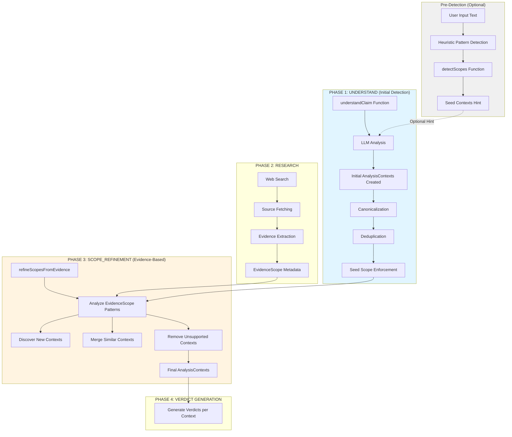

# When Are AnalysisContexts Created?

**Version**: 2.6.41  
**Status**: Living Documentation  
**Date**: February 2026  
**Audience**: Developers, Architects, AI Coding Agents

---

## Executive Summary

**AnalysisContexts** (top-level analytical frames) are created through a **multi-stage detection and refinement process** during the analysis pipeline. This document explains WHEN, WHERE, and HOW they are created.

**Quick Answer**: AnalysisContexts are primarily created in **TWO phases**:

1. **UNDERSTAND Phase** (Initial Detection) - Line ~3374-4520 in `orchestrated.ts`
2. **SCOPE_REFINEMENT Phase** (Evidence-Based Refinement) - Line ~240-590 in `orchestrated.ts`

---

## Table of Contents

1. [What is an AnalysisContext?](#what-is-an-analysiscontext)
2. [The Multi-Stage Detection Process](#the-multi-stage-detection-process)
3. [Phase 1: Initial Context Detection (UNDERSTAND)](#phase-1-initial-context-detection-understand)
4. [Phase 2: Evidence-Based Refinement (SCOPE_REFINEMENT)](#phase-2-evidence-based-refinement-scope_refinement)
5. [Context Creation Triggers](#context-creation-triggers)
6. [Code References](#code-references)
7. [Examples](#examples)
8. [Related Documentation](#related-documentation)

---

## What is an AnalysisContext?

An **AnalysisContext** is a bounded analytical frame that requires separate analysis and produces its own verdict.

### Key Characteristics
- **Top-level frame**: Not just a different viewpoint, but a fundamentally different thing to analyze
- **Gets its own verdict**: Each context produces a separate assessment
- **Requires different evidence**: Contexts need different facts to evaluate
- **Cannot be directly compared**: Like comparing apples to oranges

### Type Definition
```typescript
export interface AnalysisContext {
  id: string;                    // e.g., "CTX_TSE", "CTX_WTW"
  name: string;                  // e.g., "Electoral proceeding (TSE)"
  shortName: string;             // e.g., "TSE Electoral"
  subject: string;               // What's being analyzed
  temporal: string;              // Time period
  status: "concluded" | "ongoing" | "pending" | "unknown";
  outcome: string;               // Result/conclusion
  assessedStatement?: string;    // What is being assessed
  metadata: {                    // Domain-specific details
    institution?: string;
    methodology?: string;
    boundaries?: string;
    geographic?: string;
    [key: string]: any;
  };
}
```

### Examples of AnalysisContexts
- **Legal**: Different court cases (TSE Electoral vs STF Criminal)
- **Scientific**: Different methodologies (Well-to-Wheel vs Tank-to-Wheel)
- **Regulatory**: Different jurisdictions (US EPA vs EU REACH)
- **Temporal**: Different time periods as distinct subjects (2000s reform vs 1970s policy)

**See**: [Context_vs_Scope.md](Context_vs_Scope.md) for detailed comparison with EvidenceScope

---

## The Multi-Stage Detection Process

AnalysisContext creation happens through multiple stages with increasing refinement:



**Key Insight**: Context detection is **iterative and evidence-driven**. Initial detection provides candidates, which are refined based on actual evidence found during research.

---

## Phase 1: Initial Context Detection (UNDERSTAND)

### When
During the **UNDERSTAND Phase** of the analysis pipeline, invoked at the very beginning.

### Where
- **Function**: `understandClaim()` in `apps/web/src/lib/analyzer/orchestrated.ts` (lines ~3374-4520)
- **Called from**: `runFactHarborAnalysis()` at line ~9501

### How

#### Step 1: Pre-Detection (Optional Heuristics)
**Location**: Lines 3451-3457 in `orchestrated.ts`

```typescript
// Heuristic scope pre-detection
const preDetectedScopes = detectScopes(analysisInput);
const scopeHint = formatDetectedScopesHint(preDetectedScopes, true);
```

**Function**: `detectScopes()` in `apps/web/src/lib/analyzer/scopes.ts` (lines 53-113)

Detects potential contexts using **generic patterns** (NOT domain-specific keywords):
- Comparison claims (efficiency, performance comparisons)
- Legal/trial fairness claims
- International/foreign references

**Output**: Array of `DetectedScope` objects or `null`

#### Step 2: LLM Analysis with Context Instructions
**Location**: Lines 4038-4098 in `orchestrated.ts`

The LLM is instructed to detect contexts via structured prompts:

```typescript
const systemPrompt = `${basePrompt}

CRITICAL: MULTI-CONTEXT DETECTION
- Detect whether the input mixes multiple distinct contexts
- If there are 2+ distinct contexts, put them in analysisContexts
- If there is only 1 context, analysisContexts may contain 0 or 1 item
- Set requiresSeparateAnalysis=true when multiple contexts exist

If the input is a comparative efficiency/performance claim:
- analysisContexts MUST contain **at least 2** items
- requiresSeparateAnalysis MUST be true
`;
```

**Key Prompt Sections**:
- Multi-context detection instructions
- Comparative claim enforcement (must split)
- Validation against claim assignments

**See**: `apps/web/src/lib/analyzer/prompts/base/understand-base.ts` for full prompt template

#### Step 3: Schema Parsing and Validation
**Location**: Lines 4250-4420 in `orchestrated.ts`

The LLM returns structured output containing:
```typescript
{
  analysisContexts: AnalysisContext[],  // Detected contexts
  requiresSeparateAnalysis: boolean,     // Multi-context flag
  subClaims: SubClaim[],                 // Sub-claims
  // ... other fields
}
```

#### Step 4: Canonicalization
**Location**: Lines 4413-4426 in `orchestrated.ts`

```typescript
parsed = canonicalizeScopes(analysisInput, parsed);
```

**Function**: `canonicalizeScopes()` in `apps/web/src/lib/analyzer/scopes.ts`

**Purpose**: 
- Generate stable, consistent IDs for contexts (e.g., "CTX_TSE", "CTX_WTW")
- Normalize context names and metadata
- Ensure context structure consistency

#### Step 5: Deterministic Seed Scope Enforcement
**Location**: Lines 4441-4476 in `orchestrated.ts`

**When**: Enabled in deterministic mode (`FH_DETERMINISTIC=true`) for comparative claims

```typescript
const shouldForceSeedScopes =
  CONFIG.deterministic === true &&
  isComparativeInput &&
  preDetectedScopes.length >= 2 &&
  (parsed.analysisContexts?.length ?? 0) <= 1;

if (shouldForceSeedScopes) {
  // Force LLM-detected scopes to match heuristic pre-detection
  parsed.analysisContexts = seedContexts;
  parsed.requiresSeparateAnalysis = true;
}
```

**Purpose**: Prevent LLM under-splitting of comparative claims in deterministic mode

#### Step 6: Supplemental Scope Detection (Retry)
**Location**: Lines 4487-4515 in `orchestrated.ts`

**When**: If deterministic mode AND only 0-1 contexts detected

A **second LLM call** specifically focused on scope detection may be triggered to correct under-splitting.

### Output After UNDERSTAND Phase
```typescript
state.understanding = {
  analysisContexts: AnalysisContext[],      // Initial contexts (0-N)
  requiresSeparateAnalysis: boolean,        // true if multiple contexts
  subClaims: SubClaim[],                    // Claims with contextId assignments
  // ... other fields
}
```

**Key Point**: At this stage, contexts are **preliminary candidates** based on input text analysis.

---

## Phase 2: Evidence-Based Refinement (SCOPE_REFINEMENT)

### When
After the **RESEARCH Phase** completes and evidence has been extracted.

### Where
- **Function**: `refineScopesFromEvidence()` in `apps/web/src/lib/analyzer/orchestrated.ts` (lines ~240-590)
- **Called from**: `runFactHarborAnalysis()` at line ~10005

### How

#### Step 1: Evidence Analysis
**Location**: Lines 245-280 in `orchestrated.ts`

The LLM receives:
- **Initial contexts** from UNDERSTAND phase
- **Extracted evidence** with EvidenceScope metadata
- **Fact-to-context assignments** (which facts belong to which contexts)

```typescript
const sp = await generateText({
  model,
  system: scopeRefinementPrompt,
  prompt: `Refine contexts based on evidence...`,
  // Includes facts with evidenceScope metadata
});
```

**See**: `apps/web/src/lib/analyzer/prompts/base/scope-refinement-base.ts` for prompt template

#### Step 2: EvidenceScope Pattern Analysis
**Location**: Scope refinement prompt (lines 345-356 in `Context_Detection_via_EvidenceScope.md`)

The LLM analyzes EvidenceScope metadata to discover contexts:

```typescript
interface EvidenceScope {
  name: string;         // "WTW", "TTW", "EU REACH"
  methodology?: string; // "ISO 14040", "EU RED II"
  boundaries?: string;  // "primary energy to wheel"
  geographic?: string;  // "European Union"
  temporal?: string;    // "2020-2025"
}
```

**Detection Question**: "Do the incompatible boundaries represent genuinely different analytical frames that need separate verdicts?"

**Create separate contexts when**:
- EvidenceScope patterns show evidence answering DIFFERENT QUESTIONS
- Combining conclusions would be MISLEADING
- Different methodologies (Well-to-Wheel vs Tank-to-Wheel)
- Different institutions (Supreme Court vs Electoral Court)
- Different temporal periods as distinct subjects (2000s policy vs 1970s policy)

#### Step 3: Context Operations

**A. Context Discovery** (Lines 280-330)
- Detect NEW contexts from EvidenceScope patterns
- Create AnalysisContext objects with proper metadata

**B. Context Deduplication** (Lines 325-343)
```typescript
const dedup = await deduplicateScopes(
  state.understanding!.analysisContexts || [],
  threshold
);
state.understanding!.analysisContexts = dedup.scopes;
```

**Purpose**: Merge similar contexts to avoid over-splitting

**C. Context Restoration** (Lines 406-464)
```typescript
// Restore contexts that have supporting facts
// Remove contexts with no supporting facts
```

**Purpose**: Ensure every context has evidence backing it

**D. Context Name Alignment** (Lines 491-499)
```typescript
state.understanding!.analysisContexts = validateAndFixScopeNameAlignment(
  state.understanding!.analysisContexts || [],
  state.facts || [],
  threshold
);
```

**Purpose**: Align context names with EvidenceScope names from actual evidence

#### Step 4: Validation
**Location**: Lines 345-360, 580-590 in `orchestrated.ts`

**Validation checks**:
- Every context has at least one supporting fact
- All fact/claim assignments reference existing contexts
- Orphaned assignments are cleared
- Ensures at least one context exists (creates fallback if needed)

### Output After SCOPE_REFINEMENT Phase
```typescript
state.understanding = {
  analysisContexts: AnalysisContext[],      // FINAL refined contexts
  requiresSeparateAnalysis: boolean,        // Updated flag
  subClaims: SubClaim[],                    // Updated with valid contextId
  // ... other fields
}
```

**Key Point**: These are the **final, evidence-backed contexts** used for verdict generation.

---

## Context Creation Triggers

### Automatic Creation Scenarios

| Scenario | Phase | Trigger | Example |
|----------|-------|---------|---------|
| **Comparative claim** | UNDERSTAND | Input contains comparison | "A vs B efficiency" → 2 contexts |
| **Multiple institutions** | UNDERSTAND/REFINE | Evidence cites different bodies | "TSE ruled... STF determined..." → 2 contexts |
| **Different methodologies** | REFINE | EvidenceScope shows incompatible boundaries | "WTW analysis... TTW measurement..." → 2 contexts |
| **Temporal distinction** | UNDERSTAND/REFINE | Distinct time periods as subjects | "2000s reform vs 1970s policy" → 2 contexts |
| **Geographic distinction** | REFINE | Evidence covers incompatible jurisdictions | "US regulations vs EU directives" → 2 contexts |

### Creation Prevention (No Split)

| Scenario | Reason | Example |
|----------|--------|---------|
| **Different viewpoints** | Same event, different perspectives | "Pro vs Con on policy X" → 1 context |
| **Evidence type variation** | Same subject, different evidence types | "Quotes + Statistics on X" → 1 context |
| **Incidental mentions** | Not the primary analytical frame | "Study mentions EU but analyzes US" → 1 context |
| **Opinion differences** | Same factual question | "Expert A vs Expert B on claim" → 1 context |

---

## Code References

### Primary Functions

| Function | File | Lines | Purpose |
|----------|------|-------|---------|
| `understandClaim()` | `orchestrated.ts` | 3374-4520 | Initial context detection via LLM |
| `detectScopes()` | `scopes.ts` | 53-113 | Heuristic pre-detection |
| `canonicalizeScopes()` | `scopes.ts` | Exported | ID normalization and consistency |
| `refineScopesFromEvidence()` | `orchestrated.ts` | 240-590 | Evidence-based refinement |
| `deduplicateScopes()` | `orchestrated.ts` | Called at 328 | Merge similar contexts |
| `ensureAtLeastOneScope()` | `scopes.ts` | Called at 581 | Fallback context creation |

### Key State Variables

```typescript
// In runFactHarborAnalysis() state object:
state.understanding = {
  analysisContexts: AnalysisContext[],      // The contexts!
  requiresSeparateAnalysis: boolean,        // Multi-context flag
  subClaims: SubClaim[],                    // With contextId
  // ...
}

state.facts = EvidenceItem[];                // With evidenceScope
```

### Configuration Flags

| Flag | Default | Effect on Context Creation |
|------|---------|----------------------------|
| `FH_DETERMINISTIC` | `true` | Enables seed scope enforcement |
| `FH_SCOPE_DEDUP_THRESHOLD` | `0.85` | Similarity threshold for merging |
| `FH_ENABLE_SCOPE_NAME_ALIGNMENT` | `true` | Aligns context names with evidence |
| `FH_SCOPE_NAME_ALIGNMENT_THRESHOLD` | `0.3` | Threshold for name alignment |

---

## Examples

### Example 1: Comparative Efficiency Claim

**Input**: "Is electric vehicle A more efficient than gasoline vehicle B?"

**UNDERSTAND Phase**:
```typescript
// Pre-detection (heuristic)
detectScopes() → [
  { id: "SCOPE_PRODUCTION", name: "Production Phase" },
  { id: "SCOPE_USAGE", name: "Usage Phase" }
]

// LLM Analysis
understandClaim() → {
  analysisContexts: [
    { id: "CTX_WTW", name: "Well-to-Wheel Analysis", ... },
    { id: "CTX_TTW", name: "Tank-to-Wheel Analysis", ... }
  ],
  requiresSeparateAnalysis: true
}
```

**RESEARCH Phase**:
- Fetches studies on vehicle efficiency
- Extracts evidence with EvidenceScope:
  ```typescript
  {
    evidenceScope: {
      methodology: "ISO 14040",
      boundaries: "Primary energy to wheel"
    }
  }
  ```

**SCOPE_REFINEMENT Phase**:
```typescript
refineScopesFromEvidence() →
  // Validates contexts have evidence
  // Possibly renames to match evidence: "WTW" → "Well-to-Wheel (ISO 14040)"
  // Final: 2 contexts confirmed
```

### Example 2: Legal Proceeding Claim

**Input**: "Was the trial of Politician X fair?"

**UNDERSTAND Phase**:
```typescript
// LLM may detect single context initially
understandClaim() → {
  analysisContexts: [
    { id: "CTX_GENERAL", name: "General Analysis", ... }
  ],
  requiresSeparateAnalysis: false
}
```

**RESEARCH Phase**:
- Fetches court documents, news articles
- Evidence mentions:
  - "Supreme Court ruling..."
  - "Electoral Court determined..."

**SCOPE_REFINEMENT Phase**:
```typescript
refineScopesFromEvidence() →
  // Discovers institutional distinction in EvidenceScope
  // Creates NEW contexts:
  {
    analysisContexts: [
      { id: "CTX_SUPREME", name: "Supreme Court Proceedings", ... },
      { id: "CTX_ELECTORAL", name: "Electoral Court Proceedings", ... }
    ],
    requiresSeparateAnalysis: true
  }
```

### Example 3: Simple Fact Check

**Input**: "Did event X happen on date Y?"

**UNDERSTAND Phase**:
```typescript
understandClaim() → {
  analysisContexts: [],  // Or single general context
  requiresSeparateAnalysis: false
}
```

**RESEARCH Phase**:
- Fetches news articles, fact-checks
- All evidence has compatible EvidenceScope (same event)

**SCOPE_REFINEMENT Phase**:
```typescript
refineScopesFromEvidence() →
  // No distinct patterns found
  // Ensures at least one context exists:
  {
    analysisContexts: [
      { id: "CTX_GENERAL", name: "General Analysis", ... }
    ],
    requiresSeparateAnalysis: false
  }
```

---

## Summary: When Are AnalysisContexts Created?

### Answer in One Sentence
**AnalysisContexts are created in the UNDERSTAND phase based on input text analysis, then refined/expanded in the SCOPE_REFINEMENT phase based on EvidenceScope patterns found in actual evidence.**

### Lifecycle Summary

1. **Pre-Detection** (Optional): Heuristic patterns hint at potential contexts
2. **UNDERSTAND Phase**: LLM creates initial context candidates from input text
3. **Canonicalization**: IDs and names are normalized
4. **Deduplication**: Similar contexts are merged
5. **Enforcement** (Deterministic mode): Seed scopes may override LLM under-splitting
6. **RESEARCH Phase**: Evidence is fetched with EvidenceScope metadata
7. **SCOPE_REFINEMENT Phase**: Contexts are validated, discovered, merged, or removed based on evidence
8. **Validation**: Final check ensures all contexts have supporting facts
9. **VERDICT Phase**: Each final context gets its own verdict

### Key Principles

- **Evidence-driven**: Final contexts must have supporting evidence
- **Generic by design**: No hardcoded domain-specific terms
- **Iterative refinement**: Multiple passes allow correction and discovery
- **Fail-safe**: Always ensures at least one context exists
- **Reproducible**: Deterministic mode provides consistency

---

## Related Documentation

### Core Documentation
- **[Context_vs_Scope.md](Context_vs_Scope.md)** - Critical distinction between AnalysisContext and EvidenceScope
- **[Context_Detection_via_EvidenceScope.md](Context_Detection_via_EvidenceScope.md)** - Evidence-based context discovery
- **[Pipeline_TriplePath_Architecture.md](Pipeline_TriplePath_Architecture.md)** - Overall pipeline architecture

### Implementation Files
- **`apps/web/src/lib/analyzer/orchestrated.ts`** - Main pipeline with context creation logic
- **`apps/web/src/lib/analyzer/scopes.ts`** - Scope detection and canonicalization utilities
- **`apps/web/src/lib/analyzer/types.ts`** - AnalysisContext type definition (lines 145-179)
- **`apps/web/src/lib/analyzer/prompts/base/understand-base.ts`** - UNDERSTAND phase prompt
- **`apps/web/src/lib/analyzer/prompts/base/scope-refinement-base.ts`** - SCOPE_REFINEMENT prompt

### Configuration
- **`AGENTS.md`** - Fundamental rules including context terminology
- **`.env.example`** - Configuration flags affecting context creation

---

**Last Updated**: February 1, 2026  
**Version**: 2.6.41  
**Author**: FactHarbor Documentation Team  
**Reviewers**: AI Coding Agent Analysis

---

## Appendix: Quick Reference Card

```
┌─────────────────────────────────────────────────────────────┐
│  WHEN ARE ANALYSISCONTEXTS CREATED? - QUICK REFERENCE       │
├─────────────────────────────────────────────────────────────┤
│                                                              │
│  Phase 1: UNDERSTAND (understandClaim)                      │
│  ├─ When: Beginning of analysis                             │
│  ├─ Input: User input text                                  │
│  ├─ Method: LLM analysis with heuristic hints               │
│  └─ Output: Initial context candidates (0-N)                │
│                                                              │
│  Phase 2: SCOPE_REFINEMENT (refineScopesFromEvidence)       │
│  ├─ When: After evidence extraction                         │
│  ├─ Input: Initial contexts + Evidence with EvidenceScope   │
│  ├─ Method: Pattern analysis + validation                   │
│  └─ Output: Final evidence-backed contexts (1-N)            │
│                                                              │
│  Key Files:                                                  │
│  • orchestrated.ts (lines 3374-4520, 240-590)               │
│  • scopes.ts (detectScopes, canonicalizeScopes)             │
│  • types.ts (AnalysisContext interface, lines 145-179)      │
│                                                              │
│  Configuration:                                              │
│  • FH_DETERMINISTIC=true (enables enforcement)              │
│  • FH_SCOPE_DEDUP_THRESHOLD=0.85 (merge threshold)          │
│                                                              │
└─────────────────────────────────────────────────────────────┘
```
