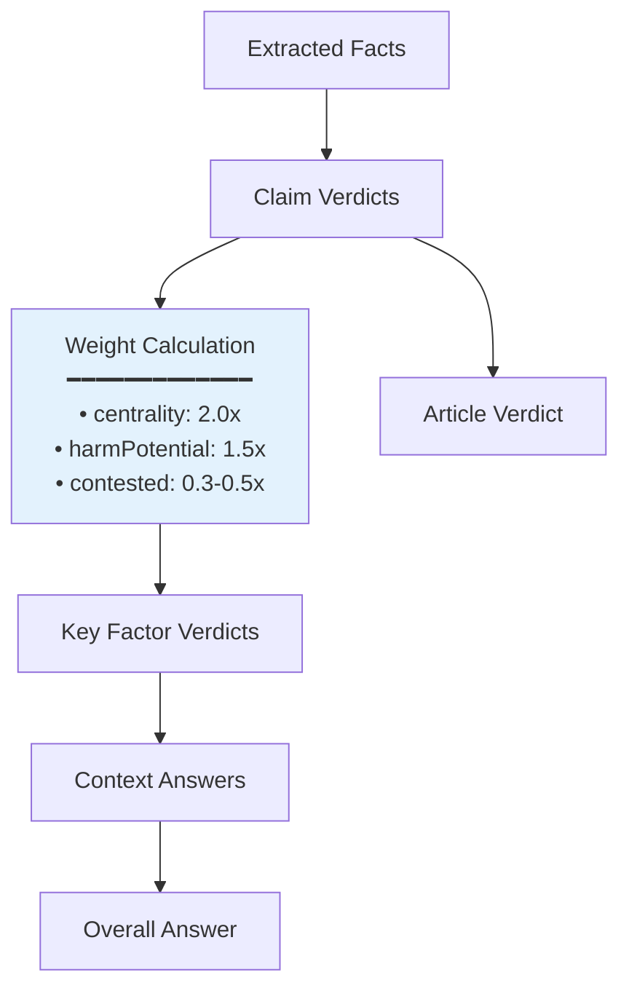

# FactHarbor Calculations Documentation

**Version**: 2.6.33  
**Last Updated**: 2026-01-20

## Overview

This document explains how FactHarbor calculates verdicts, handles counter-evidence, aggregates results across different levels, and manages confidence scores.

## 1. Verdict Scale (7-Point System with MIXED/UNVERIFIED Distinction)

FactHarbor uses a symmetric 7-point scale with truth percentages from 0-100%. The 43-57% range distinguishes between **MIXED** (high confidence, evidence on both sides) and **UNVERIFIED** (low confidence, insufficient evidence):

| Verdict | Range | Confidence | Description |
|---------|-------|------------|-------------|
| **TRUE** | 86-100% | - | Strong support, no credible counter-evidence |
| **MOSTLY-TRUE** | 72-85% | - | Mostly supported, minor gaps |
| **LEANING-TRUE** | 58-71% | - | Mixed evidence, leans positive |
| **MIXED** | 43-57% | >= 60% | Evidence on both sides, roughly equal |
| **UNVERIFIED** | 43-57% | < 60% | Insufficient evidence to judge |
| **LEANING-FALSE** | 29-42% | - | More counter-evidence than support |
| **MOSTLY-FALSE** | 15-28% | - | Strong counter-evidence |
| **FALSE** | 0-14% | - | Direct contradiction |

### MIXED vs UNVERIFIED

- **MIXED** (blue in UI): We have substantial evidence, but it's roughly equal on both sides. High confidence in the mixed state.
- **UNVERIFIED** (orange in UI): We don't have enough evidence to make any judgment. Low confidence due to insufficient information.

### Implementation

**File**: `apps/web/src/lib/analyzer.ts`

**Function**: `percentageToClaimVerdict` (line ~1544)
```typescript
// Confidence threshold to distinguish MIXED from UNVERIFIED
const MIXED_CONFIDENCE_THRESHOLD = 60;

function percentageToClaimVerdict(truthPercentage: number, confidence?: number): ClaimVerdict7Point {
  if (truthPercentage >= 86) return "TRUE";
  if (truthPercentage >= 72) return "MOSTLY-TRUE";
  if (truthPercentage >= 58) return "LEANING-TRUE";
  if (truthPercentage >= 43) {
    // Distinguish MIXED (high confidence, evidence on both sides) 
    // from UNVERIFIED (low confidence, insufficient evidence)
    const conf = confidence !== undefined ? normalizePercentage(confidence) : 0;
    return conf >= MIXED_CONFIDENCE_THRESHOLD ? "MIXED" : "UNVERIFIED";
  }
  if (truthPercentage >= 29) return "LEANING-FALSE";
  if (truthPercentage >= 15) return "MOSTLY-FALSE";
  return "FALSE";
}
```

### Truth Bands

The `truthFromBand` function (line ~1471) converts confidence-adjusted bands to percentages:

```typescript
function truthFromBand(band: "strong" | "partial" | "uncertain" | "refuted", confidence: number): number {
  const conf = normalizePercentage(confidence) / 100;
  switch (band) {
    case "strong":    return Math.round(72 + 28 * conf);  // 72-100%
    case "partial":   return Math.round(50 + 35 * conf);  // 50-85%
    case "uncertain": return Math.round(35 + 30 * conf);  // 35-65%
    case "refuted":   return Math.round(28 * (1 - conf)); // 0-28%
  }
}
```

## 2. AnalysisContext (Bounded Analytical Frame)

A **AnalysisContext** is a bounded analytical frame that should be analyzed separately. It replaces the previous terminology of "proceeding".

Note: **EvidenceScope** is the *per-fact* source methodology/boundaries (`ExtractedFact.evidenceScope`). This section’s AnalysisContext refers to the *top-level* bounded analytical frame.

### Definition

An AnalysisContext is defined by:
- **Boundaries**: What's included/excluded (e.g., "vehicle-only", "full lifecycle")
- **Methodology**: Standards used (e.g., "ISO 14040", "WTW analysis")
- **Temporal**: Time period (e.g., "2020-2025", "January 2023")
- **Subject**: What's being analyzed (e.g., "TSE case", "efficiency comparison")
- **Institution**: Court, agency, or organization (optional)
- **Jurisdiction**: Geographic/legal jurisdiction (optional)

### AnalysisContext Types

| Type | Examples |
|------|----------|
| **Legal** | TSE electoral case, STF criminal proceeding |
| **Methodological** | WTW, TTW, LCA analysis |
| **Regulatory** | EU regulations, US EPA standards |
| **Temporal** | 2023 rollout vs 2024 review |

### Multi-Context Detection

The system detects multiple analysis contexts when an input requires separate analyses:

```typescript
interface AnalysisContext {
  id: string;              // e.g., "CTX_TSE", "CTX_WTW"
  name: string;            // Human-readable name
  shortName: string;       // Abbreviation
  institution?: string;    // Court, agency, organization
  methodology?: string;    // Standard/method used
  boundaries?: string;     // What's included/excluded
  temporal?: string;       // Time period
  subject: string;         // What's being analyzed
  criteria?: string[];     // Evaluation criteria
  outcome?: string;        // Result if known
  status: "concluded" | "ongoing" | "pending" | "unknown";
  decisionMakers?: DecisionMaker[];
}
```

### AnalysisContext Sources

Analysis contexts are determined from:
1. **Input analysis** (understandClaim phase): Explicit or implied analysis contexts in user query
2. **Evidence extraction** (extractFacts phase): Sources may define their own EvidenceScope via `evidenceScope`
3. **Claim decomposition**: Claims tagged with `contextId` (legacy: `relatedProceedingId`)

### EvidenceScope vs AnalysisContext

When evidence defines an EvidenceScope that differs from the AnalysisContext (e.g., WTW data applied to TTW analysis), this is flagged in verdict reasoning.

### Design Decision: evidenceScope Kept Separate

The `evidenceScope` field on facts is intentionally kept separate from top-level analysis contexts. This enables:
- **Provenance tracking**: Distinguishes analysis context detected from input vs EvidenceScope defined by evidence
- **Mismatch detection**: Identifies when EvidenceScope differs from the analysis context
- **Verdict enrichment**: Notes EvidenceScope metadata without modifying detected analysis contexts

## 3. Counter-Evidence Handling

Counter-evidence is distinguished from mere contestation and influences verdict calculations.

### Doubted vs Contested (v2.8)


**Key Distinction:**
- **DOUBTED** = Political criticism, rhetoric, accusations WITHOUT documented evidence → Full weight (claim remains credible)
- **CONTESTED** = Has actual documented counter-evidence → Reduced weight (genuine uncertainty)

**Implementation (v2.8):**
- `validateContestation()` in `aggregation.ts`: KeyFactor-level validation (orchestrated pipeline)
- `detectClaimContestation()` in `aggregation.ts`: Claim-level heuristic (canonical pipeline)

### Fact Categorization

**File**: `apps/web/src/lib/analyzer.ts` (ExtractedFact interface, line ~1800)

Facts are categorized during extraction:
- `category: "evidence"` - Supporting evidence
- `category: "criticism"` - Counter-evidence or opposing views
- `category: "expert_quote"` - Expert testimony
- `category: "statistic"` - Numerical data
- `category: "legal_provision"` - Legal framework
- `category: "event"` - Factual events

### Contestation Fields

```typescript
interface ExtractedFact {
  category: "legal_provision" | "evidence" | "expert_quote" | "statistic" | "event" | "criticism";
  isContestedClaim?: boolean;  // True if this fact contests a claim
  claimSource?: string;         // Who makes the contested claim
}
```

### Gate 4 Scoping

**Function**: `applyGate4ToVerdicts` (line ~1018)

Counter-evidence is scoped to relevant analysis contexts:

```typescript
// Count contradicting facts (criticism category)
// Only count criticism facts that are:
// 1. In the same context as the verdict, OR
// 2. Not scoped to any specific context (general criticism)
const contradictingFactCount = facts.filter(f =>
  !verdict.supportingFactIds.includes(f.id) &&
  f.category === "criticism" &&
  (!f.contextId || f.contextId === verdict.contextId)
).length;
```

This prevents criticism of one analysis context from penalizing claims about a different analysis context.

### Evidence-Based Contestation

**File**: `apps/web/src/lib/analyzer.ts` (line ~5478)

Contestation with documented evidence reduces verdict scores:

```typescript
const evidenceBasedContestation =
  cv.isContested &&
  (cv.factualBasis === "established" || cv.factualBasis === "disputed");

if (evidenceBasedContestation) {
  const penalty = cv.factualBasis === "established" ? 12 : 8;
  truthPct = Math.max(0, truthPct - penalty);
}
```

- **"established"** counter-evidence: -12 points
- **"disputed"** counter-evidence: -8 points
- **"opinion"** contestation: No penalty (just rhetoric)

## 4. Aggregation Hierarchy



### Weight Calculation (v2.8)

**Function**: `getClaimWeight()` in `aggregation.ts`

```typescript
function getClaimWeight(claim: WeightedClaim): number {
  let weight = 1.0;
  
  // Centrality boost
  if (claim.centrality === "central") weight *= 2.0;
  
  // Harm potential boost
  if (claim.harmPotential === "high") weight *= 1.5;
  
  // Contestation reduction (only for documented counter-evidence)
  if (claim.isContested) {
    if (claim.factualBasis === "established") weight *= 0.3;
    else if (claim.factualBasis === "disputed") weight *= 0.5;
    // "opinion"/"alleged"/"unknown" = full weight (just doubted)
  }
  
  return weight;
}
```

### Level 1: Claim Verdicts

**Source**: LLM verdict generation + evidence weighting

**Function**: `applyEvidenceWeighting` (line ~2014)

```typescript
// Adjust truth based on source track record scores
const avg = scores.reduce((sum, score) => sum + score, 0) / scores.length;
const adjustedTruth = Math.round(50 + (verdict.truthPercentage - 50) * avg);
const adjustedConfidence = Math.round(verdict.confidence * (0.5 + avg / 2));
```

- High-reliability sources (score > 0.8): Boost verdict
- Low-reliability sources (score < 0.4): Reduce verdict
- Unknown reliability: No adjustment

### Level 2: Key Factor Verdicts

**File**: `apps/web/src/lib/analyzer.ts` (line ~5543)

Key factors aggregate claims mapped to them:

```typescript
const factorClaims = weightedClaimVerdicts.filter(v => v.keyFactorId === factor.id);
const factorAvgTruthPct = dedupeWeightedAverageTruth(factorClaims);

// Determine support based on average
if (factorAvgTruthPct >= 72) supports = "yes";
else if (factorAvgTruthPct < 43) supports = "no";
else supports = "neutral";
```

### Level 3: Context Answers

**File**: `apps/web/src/lib/analyzer.ts` (line ~4700)

Analysis contexts aggregate key factors with contestation correction:

```typescript
// Calculate effective negatives (contested negatives are down-weighted)
const effectiveNegatives = negativeFactors - (contestedNegatives * 0.7);

// If positive factors > effective negatives, boost verdict
if (answerTruthPct >= 72 && positiveFactors > effectiveNegatives) {
  // Already positive, no change needed
} else if (answerTruthPct < 72 && positiveFactors > effectiveNegatives) {
  correctedConfidence = Math.min(correctedConfidence, 78);
  answerTruthPct = truthFromBand("strong", correctedConfidence);
}
```

### Level 4: Overall Answer

**File**: `apps/web/src/lib/analyzer.ts` (line ~4796)

Overall answer averages analysis-context answers (de-duplicated):

```typescript
const avgTruthPct = Math.round(
  correctedContextAnswers.reduce((sum, pa) => sum + pa.truthPercentage, 0) /
    correctedContextAnswers.length
);
```

## 5. Confidence Usage

### LLM Confidence (0-100%)

The LLM provides a confidence score for each verdict, representing its certainty in the assessment.

### Gate 4 Confidence Tiers

**Function**: `validateVerdictGate4` (line ~900)

```typescript
// HIGH: 3+ sources, 5+ facts, reasoning >100 chars
if (sourceCount >= 3 && factCount >= 5 && reasoning.length >= 100) {
  confidenceTier = "HIGH";
}
// MEDIUM: 2+ sources, 3+ facts, reasoning >50 chars
else if (sourceCount >= 2 && factCount >= 3 && reasoning.length >= 50) {
  confidenceTier = "MEDIUM";
}
// LOW: 1+ sources, 1+ facts
else if (sourceCount >= 1 && factCount >= 1) {
  confidenceTier = "LOW";
}
// INSUFFICIENT: Doesn't meet minimum criteria
else {
  confidenceTier = "INSUFFICIENT";
}
```

### Confidence Affects Truth Percentage

Via `truthFromBand`, confidence modulates the final percentage within each band:

- **High confidence** (90%): Verdict near top of band
- **Medium confidence** (60%): Verdict in middle of band
- **Low confidence** (30%): Verdict near bottom of band

Example for "strong" band:
- 90% confidence → 72 + 28×0.9 = 97% (TRUE)
- 60% confidence → 72 + 28×0.6 = 89% (TRUE)
- 30% confidence → 72 + 28×0.3 = 80% (MOSTLY-TRUE)

### Confidence Clamping

**Function**: `clampConfidence` (line ~1450)

```typescript
function clampConfidence(value: number): number {
  if (!Number.isFinite(value)) return 0.5;
  return Math.max(0.0, Math.min(1.0, value));
}
```

Ensures confidence stays in valid range [0.0, 1.0].

## 6. Near-Duplicate Claim Handling

### Problem

If the LLM generates multiple claims expressing the same idea:
- "The Venezuelan takeover of oil assets constituted theft of American property"
- "The Venezuelan oil asset seizure was one of the largest thefts of American property in US history"

Both would influence the overall verdict, effectively double-counting the same evidence.

### Solution: De-Duplication Weighting

**Function**: `dedupeWeightedAverageTruth` (line ~2014)

**Algorithm**:

1. **Tokenize** each claim text (lowercase, remove punctuation, filter short words)
2. **Calculate Jaccard similarity** between token sets
3. **Cluster** claims with similarity ≥ 0.6
4. **Weight** each cluster:
   - Primary claim (highest truth%): weight = 1.0
   - Duplicate claims: share weight = 0.5 / (n-1)
5. **Average** using cluster weights

**Example**:

```
Cluster 1: [Claim A (85%), Claim B (82%), Claim C (80%)]
  - Claim A: 85% × 1.0 = 85.0
  - Claim B: 82% × 0.25 = 20.5
  - Claim C: 80% × 0.25 = 20.0
  - Total weight: 1.5
  - Contribution: 125.5 / 1.5 = 83.7%

Cluster 2: [Claim D (90%)]
  - Claim D: 90% × 1.0 = 90.0
  - Total weight: 1.0
  - Contribution: 90.0 / 1.0 = 90.0%

Overall: (83.7 + 90.0) / 2 = 86.9%
```

### Application

De-duplication is applied at multiple levels:

- **Claims average** (line ~4769, ~5096, ~5478)
- **Key factor aggregation** (line ~5543)

### UI Impact

**All claims are still displayed** in the UI. De-duplication only affects aggregation calculations, not visibility.

## 7. Dependency Handling

**File**: `apps/web/src/lib/analyzer.ts` (line ~5512)

Claims can depend on other claims (e.g., "timing" depends on "attribution"):

```typescript
// Check if any dependency is false (truthPercentage < 43%)
const failedDeps = dependencies.filter((depId: string) => {
  const depVerdict = verdictMap.get(depId);
  return depVerdict && depVerdict.truthPercentage < 43;
});

if (failedDeps.length > 0) {
  verdict.dependencyFailed = true;
  verdict.failedDependencies = failedDeps;
}
```

**Independent verdicts** (line ~5550): Claims with failed dependencies are excluded from aggregation to avoid double-counting the false prerequisite.

## 8. Pseudoscience Escalation

**File**: `apps/web/src/lib/analyzer.ts` (line ~1108)

Claims matching pseudoscience patterns (water memory, homeopathy, etc.) are automatically escalated:

```typescript
if (claimPseudo.isPseudoscience) {
  const escalation = escalatePseudoscienceVerdict(truthPct, finalConfidence, claimPseudo);
  truthPct = escalation.truthPercentage;  // Usually capped at 28% (FALSE)
  finalConfidence = escalation.confidence;
}
```

## 9. Benchmark Guard (Proportionality Claims)

**File**: `apps/web/src/lib/analyzer.ts` (line ~4879)

Claims about proportionality/appropriateness without comparative evidence are forced to "uncertain":

```typescript
const isEvaluativeOutcome = hasNumber && EVALUATIVE_OUTCOME_RE.test(claimText);
const hasBenchmarkEvidence = hasComparativeBenchmarkEvidenceFromFacts(factsById, cv.supportingFactIds);

if (isEvaluativeOutcome && !hasBenchmarkEvidence) {
  truthPct = 50;  // Uncertain
  cv.confidence = Math.min(cv.confidence, 55);
  cv.reasoning += " (Insufficient comparative evidence to assess proportionality; treating as uncertain.)";
}
```

This prevents unsupported judgments like "27-year sentence was proportionate" without benchmark data.

## Summary

FactHarbor's calculation system:

1. **Scales verdicts** using a symmetric 7-point system (0-100%)
2. **Distinguishes counter-evidence** from contestation and applies penalties
3. **Aggregates hierarchically** from facts → claims → factors → analysis contexts → overall
4. **Modulates by confidence** using truth bands
5. **De-duplicates near-identical claims** to prevent double-counting
6. **Handles dependencies** to avoid cascading false prerequisites
7. **Applies quality gates** (Gate 1, Gate 4) for evidence sufficiency
8. **Guards against unsupported judgments** (pseudoscience, proportionality without benchmarks)

All calculations are designed to be **transparent**, **traceable**, and **deterministic** (when `FH_DETERMINISTIC=true`).
