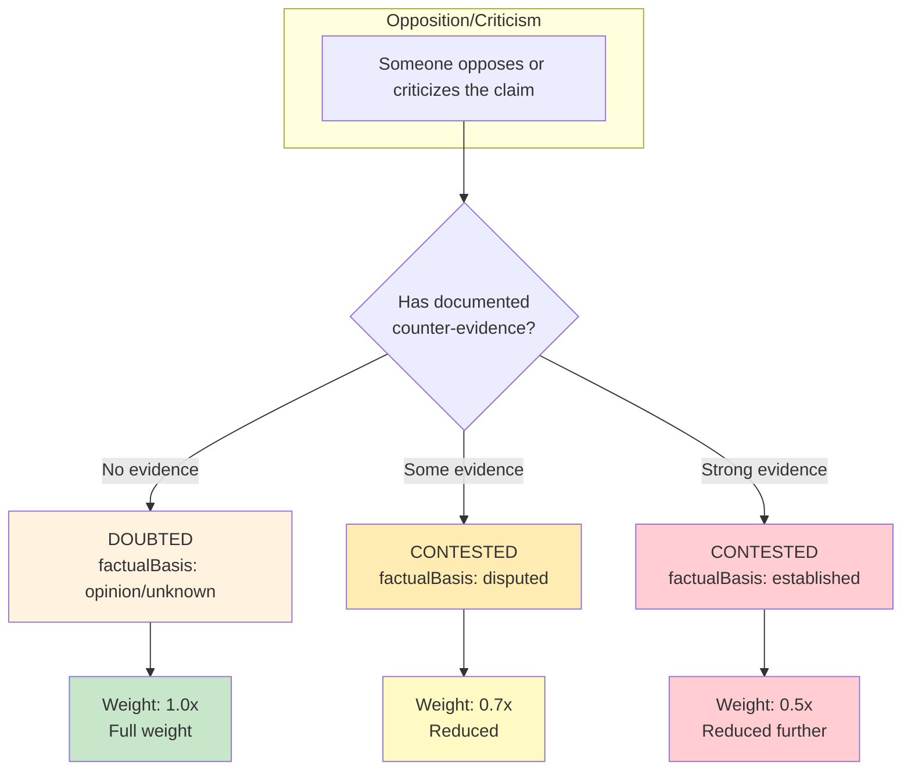
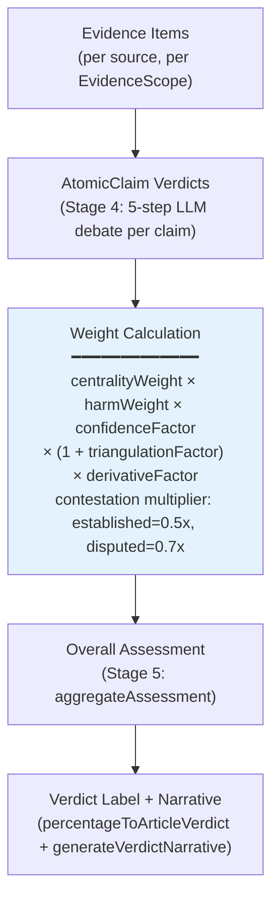

# FactHarbor Calculations Documentation

**Version**: 2.11.0
**Last Updated**: 2026-02-19

> **Pipeline note**: This document describes the **ClaimAssessmentBoundary (CB) pipeline** — the current default production pipeline since v2.11.0. The **Monolithic Dynamic** pipeline is an alternative. The **Orchestrated pipeline was removed in v2.11.0**; any references to it here are legacy and should be ignored. Authoritative implementations: `aggregation.ts`, `truth-scale.ts`, `verdict-stage.ts`, `claimboundary-pipeline.ts`.

---

## 1. Verdict Scale (7-Point System with MIXED/UNVERIFIED Distinction)

FactHarbor uses a symmetric 7-point scale with truth percentages from 0–100%. The 43–57% range distinguishes between **MIXED** (high confidence, evidence on both sides) and **UNVERIFIED** (low confidence, insufficient evidence):

| Verdict | Range | Confidence | Description |
|---------|-------|------------|-------------|
| **TRUE** | 86–100% | — | Strong support, no credible counter-evidence |
| **MOSTLY-TRUE** | 72–85% | — | Mostly supported, minor gaps |
| **LEANING-TRUE** | 58–71% | — | Mixed evidence, leans positive |
| **MIXED** | 43–57% | >= 40% | Evidence on both sides, roughly equal |
| **UNVERIFIED** | 43–57% | < 40% | Insufficient evidence to judge |
| **LEANING-FALSE** | 29–42% | — | More counter-evidence than support |
| **MOSTLY-FALSE** | 15–28% | — | Strong counter-evidence |
| **FALSE** | 0–14% | — | Direct contradiction |

### MIXED vs UNVERIFIED

- **MIXED** (blue in UI): Substantial evidence exists but is roughly equal on both sides. High confidence in the mixed state.
- **UNVERIFIED** (orange in UI): Not enough evidence to make any judgment. Low confidence due to insufficient information.

The threshold is 40% confidence (UCM-configurable via `CalcConfig.mixedConfidenceThreshold`). The stale code comments in `truth-scale.ts` and `types.ts` incorrectly say 60% — the actual `DEFAULT_MIXED_CONFIDENCE_THRESHOLD` constant and production behavior use 40%.

### Implementation

**File**: `apps/web/src/lib/analyzer/truth-scale.ts`

**Function**: `percentageToClaimVerdict`

```typescript
// Confidence threshold to distinguish MIXED from UNVERIFIED (UCM-configurable)
const DEFAULT_MIXED_CONFIDENCE_THRESHOLD = 40;

export function percentageToClaimVerdict(
  truthPercentage: number,
  confidence?: number,
  bands?: VerdictBandConfig,
  mixedConfidenceThreshold?: number,
): ClaimVerdict7Point {
  const b = bands ?? DEFAULT_BANDS;
  const mct = mixedConfidenceThreshold ?? DEFAULT_MIXED_CONFIDENCE_THRESHOLD;
  if (truthPercentage >= b.TRUE) return "TRUE";
  if (truthPercentage >= b.MOSTLY_TRUE) return "MOSTLY-TRUE";
  if (truthPercentage >= b.LEANING_TRUE) return "LEANING-TRUE";
  if (truthPercentage >= b.MIXED) {
    // Distinguish MIXED (high confidence, evidence on both sides)
    // from UNVERIFIED (low confidence, insufficient evidence)
    const conf = confidence !== undefined ? normalizePercentage(confidence) : 0;
    return conf >= mct ? "MIXED" : "UNVERIFIED";
  }
  if (truthPercentage >= b.LEANING_FALSE) return "LEANING-FALSE";
  if (truthPercentage >= b.MOSTLY_FALSE) return "MOSTLY-FALSE";
  return "FALSE";
}
```

Band thresholds are UCM-configurable (`CalcConfig.verdictBands`); defaults match the 7-point scale in Section 1.

---

## 2. Primary Entity: ClaimAssessmentBoundary

A **ClaimAssessmentBoundary** (CB) is a group of compatible EvidenceScopes that define a coherent analytical lens. It is created **after** evidence research by clustering EvidenceScopes — it is **not** pre-defined. This replaced the `AnalysisContext` entity from the Orchestrated pipeline (removed in v2.11.0).

**File**: `apps/web/src/lib/analyzer/types.ts`

```typescript
/**
 * ClaimAssessmentBoundary: A group of compatible EvidenceScopes that define
 * a coherent analytical lens. Created AFTER research by clustering
 * EvidenceScopes — NOT pre-created.
 */
export interface ClaimAssessmentBoundary {
  id: string;                    // "CB_01", "CB_02", ...
  name: string;                  // Human-readable: "Well-to-Wheel Analyses"
  shortName: string;             // Short label: "WTW"
  description: string;           // What this boundary represents

  // Derived from constituent EvidenceScopes
  methodology?: string;          // Dominant methodology
  boundaries?: string;           // Scope boundaries
  geographic?: string;           // Geographic scope
  temporal?: string;             // Temporal scope

  // Clustering metadata
  constituentScopes: EvidenceScope[]; // The scopes that compose this boundary
  internalCoherence: number;     // 0-1: how consistent evidence within is
  evidenceCount: number;         // Number of evidence items in this boundary
}
```

### AtomicClaim: The Analytical Unit

```typescript
export interface AtomicClaim {
  id: string;                    // "AC_01", "AC_02", ...
  statement: string;             // The verifiable assertion
  category: "factual" | "evaluative" | "procedural";
  centrality: "high" | "medium"; // Only central claims survive extraction
  harmPotential: "critical" | "high" | "medium" | "low";
  isCentral: true;               // Always true (filtered by Gate 1)
  claimDirection: "supports_thesis" | "contradicts_thesis" | "contextual";
  keyEntities: string[];
  checkWorthiness: "high" | "medium";
  specificityScore: number;      // 0-1, LLM-assessed. >= 0.6 required by Gate 1.
  groundingQuality: "strong" | "moderate" | "weak" | "none";
  expectedEvidenceProfile: {
    methodologies: string[];
    expectedMetrics: string[];
    expectedSourceTypes: SourceType[];
  };
}
```

### CBClaimVerdict: Per-Claim Verdict Output

```typescript
export interface CBClaimVerdict {
  id: string;
  claimId: string;               // FK to AtomicClaim
  truthPercentage: number;       // 0–100
  verdict: ClaimVerdict7Point;   // 7-point scale label
  confidence: number;            // 0–100 (adjusted by self-consistency spread)
  reasoning: string;             // LLM-generated explanation
  harmPotential: "critical" | "high" | "medium" | "low";
  isContested: boolean;
  supportingEvidenceIds: string[];
  contradictingEvidenceIds: string[];
  boundaryFindings: BoundaryFinding[]; // Per-boundary quantitative signals
  consistencyResult: ConsistencyResult;
  challengeResponses: ChallengeResponse[];
  triangulationScore: TriangulationScore;
}
```

### EvidenceScope vs ClaimAssessmentBoundary

- **EvidenceScope**: Per-evidence source metadata (methodology, temporal bounds, geographic scope). Attached to individual `EvidenceItem` objects as `evidenceItem.evidenceScope`. Describes how the *source* computed its data.
- **ClaimAssessmentBoundary**: Top-level cluster of compatible EvidenceScopes. Emerges from evidence, not from input analysis.

Do **not** confuse these. Never call either one "context".

---

## 3. Contestation Weight Model

Counter-evidence is distinguished from mere contestation. The CB pipeline uses **weight multipliers**, not point deductions. This approach avoids double-penalizing contested claims whose `truthPercentage` already reflects counter-evidence.

### Doubted vs Contested



**Key Distinction:**
- **DOUBTED** = Political criticism, rhetoric, accusations WITHOUT documented evidence → Full weight (1.0x)
- **CONTESTED** = Actual documented counter-evidence → Reduced weight (0.7x or 0.5x)

### Implementation

**File**: `apps/web/src/lib/analyzer/aggregation.ts`

**Function**: `getClaimWeight()`

```typescript
export function getClaimWeight(claim: {
  centrality?: "high" | "medium" | "low";
  confidence?: number;
  thesisRelevance?: "direct" | "tangential" | "irrelevant";
  harmPotential?: "high" | "medium" | "low";
  isContested?: boolean;
  factualBasis?: "established" | "disputed" | "opinion" | "unknown";
}, weights?: AggregationWeights): number {
  // Only direct claims contribute to the verdict
  if (claim.thesisRelevance && claim.thesisRelevance !== "direct") return 0;

  // ... centrality and harm multipliers applied first ...

  // Contestation weight reduction (v2.9.0 — multipliers, not point deductions)
  if (claim.isContested) {
    const ctw = weights?.contestationWeights ?? { established: 0.5, disputed: 0.7, opinion: 1.0 };
    const basis = claim.factualBasis || "unknown";
    if (basis === "established") {
      weight *= ctw.established; // default 0.5x
    } else if (basis === "disputed") {
      weight *= ctw.disputed;    // default 0.7x
    }
    // "opinion", "unknown" = just "doubted", no real evidence → full weight (1.0x)
  }

  return weight;
}
```

| factualBasis | Weight Multiplier | Rationale |
|---|---|---|
| `"established"` | 0.5x (default) | Strong documented counter-evidence reduces influence |
| `"disputed"` | 0.7x (default) | Some documented counter-evidence moderately reduces influence |
| `"opinion"` | 1.0x | Rhetoric only, no documented evidence — full weight |
| `"unknown"` | 1.0x | No evidence of contestation — full weight |

All multipliers are UCM-configurable via `CalcConfig.aggregation.contestationWeights`.

> **Note**: The old model (point deductions: `-12`/`-8` applied as `truthPct -= penalty`) does **not exist** in the CB pipeline. It was part of the removed Orchestrated pipeline. The CB pipeline uses **only** weight multipliers.

---

## 4. Aggregation: 3-Level Hierarchy

The CB pipeline aggregates verdicts through 3 levels — there is no KeyFactor intermediate layer and no AnalysisContext averaging layer from the Orchestrated pipeline.



### Level 1: Evidence Items (per AtomicClaim, per ClaimAssessmentBoundary)

Evidence items are extracted and assigned to claims and boundaries during Stages 2–3. Each `EvidenceItem` carries provenance: `statement`, `category`, `claimDirection`, `evidenceScope`, `probativeValue`, `sourceType`.

Source reliability scores are applied at this level via `getTrackRecordScore()` (from the prefetched map). See Section 7.

### Level 2: AtomicClaim Verdicts

Each `AtomicClaim` gets one `CBClaimVerdict` produced by the 5-step LLM debate in `verdict-stage.ts`:

1. **Advocate Verdict** (Sonnet) — initial verdict for all claims
2. **Self-Consistency Check** (Sonnet x2, parallel) — stability measurement
3. **Adversarial Challenge** (Sonnet, parallel) — argue against emerging verdicts
4. **Reconciliation** (Sonnet) — final verdict incorporating challenges
5. **Verdict Validation** (Haiku x2) — grounding + direction checks

### Level 3: Weighted Average → Overall Assessment

**File**: `apps/web/src/lib/analyzer/claimboundary-pipeline.ts`

**Function**: `aggregateAssessment()`

The full weight formula from the source (Stage 5, §8.5.4):

```
finalWeight = centralityWeight × harmWeight × confidenceFactor × (1 + triangulationFactor) × derivativeFactor
```

Where:
- `centralityWeight`: from `CalcConfig.aggregation.centralityWeights` — defaults high=3.0, medium=2.0, low=1.0
- `harmWeight`: from `CalcConfig.aggregation.harmPotentialMultipliers` — defaults critical/high=1.5, medium/low=1.0
- `confidenceFactor`: `verdict.confidence / 100` (e.g., 80% confidence → 0.8)
- `triangulationFactor`: cross-boundary agreement signal (see Section 8)
- `derivativeFactor`: 0.5x–1.0x based on proportion of derivative evidence (§8.5.3)

The contestation weight reduction (`established=0.5x`, `disputed=0.7x`) is applied by `getClaimWeight()` **in addition** to the above formula when processing claims that pass through the counter-claim inversion logic.

**Actual code from `aggregateAssessment()`**:

```typescript
// Final weight (§8.5.4): centrality × harm × confidence × (1 + triangulation) × derivative
const finalWeight =
  centralityWeight *
  harmWeight *
  confidenceFactor *
  (1 + triangulationFactor) *
  derivativeFactor;
```

**Counter-claim inversion**: Counter-claims (`claimDirection: "contradicts_thesis"`) have their truth percentage inverted before aggregation — if a counter-claim scores 85%, it contributes 15% to the overall verdict:

```typescript
// In calculateWeightedVerdictAverage (aggregation.ts):
const effectiveTruthPct = claim.isCounterClaim
  ? 100 - claim.truthPercentage
  : claim.truthPercentage;
```

**Weighted sum**:

```typescript
const totalWeight = weightsData.reduce((sum, item) => sum + item.weight, 0);
const weightedTruthPercentage =
  totalWeight > 0
    ? weightsData.reduce((sum, item) => sum + item.truthPercentage * item.weight, 0) / totalWeight
    : 50;
const weightedConfidence =
  totalWeight > 0
    ? weightsData.reduce((sum, item) => sum + item.confidence * item.weight, 0) / totalWeight
    : 50;
```

### Concrete Example

Given three claims with these properties:

| Claim | truthPct | confidence | centrality | harmPotential | triangulationFactor | derivativeFactor |
|-------|----------|------------|------------|---------------|---------------------|------------------|
| AC_01 | 80% | 70% | high | medium | 0.05 | 1.0 |
| AC_02 | 45% | 55% | medium | high | 0.0 | 1.0 |
| AC_03 | 90% | 85% | high | medium | 0.15 | 0.8 |

Weights:
- AC_01: 3.0 × 1.0 × 0.70 × (1 + 0.05) × 1.0 = **2.205**
- AC_02: 2.0 × 1.5 × 0.55 × (1 + 0.00) × 1.0 = **1.650**
- AC_03: 3.0 × 1.0 × 0.85 × (1 + 0.15) × 0.8 = **2.346**

Weighted truth:
```
(80 × 2.205 + 45 × 1.650 + 90 × 2.346) / (2.205 + 1.650 + 2.346)
= (176.4 + 74.25 + 211.14) / 6.201
= 461.79 / 6.201
= 74.5% → MOSTLY-TRUE (confidence 71.8%)
```

### Tangential Claim Pruning

Tangential/irrelevant claims (`thesisRelevance !== "direct"`) receive weight = 0 in aggregation. Baseless tangential claims (insufficient supporting evidence) are dropped entirely by `pruneTangentialBaselessClaims()` in `aggregation.ts`.

---

## 5. Quality Gates

### Gate 1: Claim Validation

**File**: `apps/web/src/lib/analyzer/claimboundary-pipeline.ts` — `validateClaims()` function

Gate 1 is the LLM-powered claim fidelity filter at the end of Stage 1. Each claim is evaluated against three dimensions:

- `passedOpinion`: Is the claim factual (not pure opinion or prediction)?
- `passedSpecificity`: Is the claim specific enough to be verifiable (specificityScore >= 0.6)?
- `passedFidelity`: Does the claim accurately represent the input? (New field, replaces `contextId`-based scoping)

Claims failing both `passedOpinion` AND `passedSpecificity` are filtered out. Claims failing `passedFidelity` only are also filtered. Direct high-centrality claims are never fully eliminated — the **safety net** rescues the highest-centrality claim if filtering would result in zero claims:

```typescript
// Safety net: if all claims would be filtered, rescue the highest-centrality
// claim that passed fidelity (or the first claim if none passed fidelity)
if (keptClaims.length === 0 && claims.length > 0) {
  const fidelityPassIds = new Set(
    validated.validatedClaims.filter((v) => v.passedFidelity).map((v) => v.claimId),
  );
  // ... sort by centrality, prefer fidelity-passing claims, rescue first
}
```

Gate 1 statistics are exposed in `CBClaimUnderstanding.gate1Stats`:

```typescript
gate1Stats: {
  totalClaims: number;
  passedOpinion: number;
  passedSpecificity: number;
  passedFidelity?: number;
  filteredCount: number;
  overallPass: boolean;
}
```

> **Removed field**: `contextId` was deleted during Phase 4 cleanup as part of the Orchestrated pipeline removal. All previous references to `f.contextId` or `verdict.contextId` in Gate 1 scoping no longer exist.

### Gate 4: Verdict Confidence Classification

**File**: `apps/web/src/lib/analyzer/verdict-stage.ts` — `classifyConfidence()` function

Gate 4 in the CB pipeline uses the LLM-derived `confidence` score already computed through the 5-step debate pattern. Unlike the old Orchestrated Gate 4 (which used `sourceCount`/`factCount` thresholds), the CB pipeline's confidence is:

1. Set by the LLM during Step 1 (Advocate Verdict)
2. Adjusted downward when the self-consistency spread is high (Steps 2–4)
3. Enforced against a floor for high-harm claims (Step 5b — `enforceHarmConfidenceFloor`)

The `classifyConfidence()` function is a structural pass-through — verdicts are returned unchanged because confidence classification is informational only:

```typescript
/**
 * Gate 4: Classify each verdict's confidence tier.
 * Tiers: HIGH (>=75), MEDIUM (>=50), LOW (>=25), INSUFFICIENT (<25)
 *
 * Returns verdicts unchanged — classification is informational.
 */
export function classifyConfidence(verdicts: CBClaimVerdict[]): CBClaimVerdict[] {
  // Confidence is already a 0-100 number on each verdict,
  // adjusted by self-consistency spread in reconciliation.
  return verdicts;
}
```

**High-harm confidence floor** (`enforceHarmConfidenceFloor`): Claims with `harmPotential` "critical" or "high" are downgraded to UNVERIFIED if confidence is below `highHarmMinConfidence` (UCM, default 50). This prevents misleadingly definitive verdicts on potentially harmful topics with weak evidentiary backing.

```typescript
// If high-harm claim has confidence < threshold, downgrade to UNVERIFIED
const isHighHarm = floorLevels.includes(v.harmPotential);
if (isHighHarm && v.confidence < threshold) {
  return { ...v, verdict: "UNVERIFIED" };
}
```

> **Removed logic**: The old Gate 4 code referencing `sourceCount >= 3`, `factCount >= 5`, and `reasoning.length >= 100` thresholds does **not exist** in the CB pipeline. That was Orchestrated-era logic.

---

## 6. Source Reliability Integration

**Version**: v2.11.0+
**Files**: `apps/web/src/lib/analyzer/source-reliability.ts`, `apps/web/src/lib/analyzer/claimboundary-pipeline.ts`

The CB pipeline uses a **prefetch → sync lookup** pattern for source reliability — not `applyEvidenceWeighting()` in `verdict-stage.ts` (that was the old integration path).

### How It Works

**Step 1: Prefetch (async, before evidence research)**

Called once in `claimboundary-pipeline.ts` after all sources are collected, before verdict generation:

```typescript
// claimboundary-pipeline.ts — called at ~58% pipeline progress
const allSourceUrls = state.sources.map((s) => s.url);
if (allSourceUrls.length > 0) {
  await prefetchSourceReliability(allSourceUrls);
}
```

`prefetchSourceReliability()` from `source-reliability.ts`:
1. Extracts unique domains from URLs
2. Batch-checks the SQLite cache (`FH_SR_CACHE_PATH`)
3. For cache misses on "important" sources, calls `evaluateSourceInternal()` — an LLM-powered evaluation
4. Populates an in-memory map: `domain → { score, confidence, consensusAchieved }`
5. Evaluations are parallelized (concurrency = 3)

**Step 2: Sync lookup (during evidence processing)**

```typescript
// claimboundary-pipeline.ts — called per FetchedSource
const fetchedSource: FetchedSource = {
  trackRecordScore: getTrackRecordScore(result.source.url),
  // ...
};
```

`getTrackRecordScore(url)` from `source-reliability.ts`: returns a `number | null` (0.0–1.0 float) from the prefetched in-memory map. Returns `null` if SR is disabled or domain is not found.

### Score Scale

| Score Range | Credibility Band | Impact on Verdict |
|-------------|-----------------|-------------------|
| 0.86–1.00 | Highly Reliable | Verdict fully preserved (~95–100% weight) |
| 0.72–0.85 | Reliable | Verdict mostly preserved (~75–90% weight) |
| 0.58–0.71 | Leaning Reliable | Moderate preservation (~60–75% weight) |
| 0.43–0.57 | Mixed | Appropriate skepticism (~40–60% weight) |
| 0.29–0.42 | Leaning Unreliable | Pulls toward neutral (~30–45% weight) |
| 0.15–0.28 | Unreliable | Strong pull toward neutral (~15–30% weight) |
| 0.00–0.14 | Highly Unreliable | Maximum skepticism (~0–15% weight) |

Unknown/unevaluated sources receive `defaultScore = 0.5` (neutral center), applying appropriate skepticism without discounting evidence entirely.

### Verdict Adjustment Formula

```typescript
// Score IS the weight — no transformation
function calculateEffectiveWeight(data: SourceReliabilityData): number {
  return data.score;
}

// Pull verdict toward neutral (50) based on reliability
adjustedTruth = Math.round(50 + (originalTruth - 50) * avgEffectiveWeight);
// Scale confidence by reliability
adjustedConfidence = Math.round(originalConfidence * (0.5 + avgEffectiveWeight / 2));
```

**Impact examples:**

| Source | Score | Original Verdict | Adjusted Verdict |
|--------|-------|-----------------|-----------------|
| Reuters (95% score) | 0.95 | 85% (MOSTLY-TRUE) | 83% (MOSTLY-TRUE) |
| Unknown source (50% score) | 0.50 | 85% (MOSTLY-TRUE) | 68% (LEANING-TRUE) |
| Low credibility (27% score) | 0.27 | 85% (MOSTLY-TRUE) | 60% (LEANING-TRUE) |

**Multi-source averaging**: When a verdict draws from multiple sources, their scores are averaged before applying the adjustment formula.

---

## 7. Triangulation Scoring

Cross-boundary agreement/disagreement is measured for each claim verdict and expressed as a `triangulationFactor` that feeds directly into the weight formula.

**File**: `apps/web/src/lib/analyzer/claimboundary-pipeline.ts`

**Function**: `computeTriangulationScore()`

**Interface** (from `types.ts`):

```typescript
export interface TriangulationScore {
  boundaryCount: number;  // Boundaries with evidence for this claim
  supporting: number;     // Boundaries with "supports" evidence direction
  contradicting: number;  // Boundaries with "contradicts" evidence direction
  level: "strong" | "moderate" | "weak" | "conflicted";
  factor: number;         // Multiplicative adjustment (feeds into weight formula)
}
```

**Factor values** (UCM-configurable via `CalcConfig.aggregation.triangulation`):

| Condition | Level | Factor |
|-----------|-------|--------|
| Only 1 boundary | `weak` | −0.10 (default) |
| 3+ supporting boundaries | `strong` | +0.15 (default) |
| 2+ supporting, ≤1 contradicting | `moderate` | +0.05 (default) |
| Supporting and contradicting roughly equal | `conflicted` | 0 |
| More supporting than contradicting | `moderate` | +0.05 (default) |
| Other | `weak` | −0.10 (default) |

The triangulation factor is used in the weight formula as `(1 + triangulationFactor)`, meaning:
- Multi-boundary agreement boosts weight (up to 1.15×)
- Single-boundary evidence reduces weight (down to 0.90×)

---

## 8. Deduplication

In the CB pipeline, near-duplicate claim deduplication is handled **upstream** by the LLM during `CLAIM_EXTRACTION_PASS2` (Stage 1). The LLM consolidates semantically equivalent claims before they enter the aggregation stage.

> **Removed function**: `dedupeWeightedAverageTruth()` does **not exist** in the CB pipeline. It was a Jaccard-similarity clustering function from the Orchestrated pipeline (removed in v2.11.0). Any references to it in older documentation are stale.

If semantically similar claims survive extraction, the confidence-based weighted average in `aggregateAssessment()` (Stage 5) naturally dilutes their combined influence.

**UI behavior**: All claims are displayed in the UI regardless of semantic overlap. Deduplication only affects aggregation calculations.

---

## 9. Dependency Handling

**File**: `apps/web/src/lib/analyzer/verdict-stage.ts`

Claims can depend on other claims (e.g., "timing" depends on "attribution"). If a prerequisite claim is false, the dependent claim is excluded from aggregation:

```typescript
const failedDeps = dependencies.filter((depId: string) => {
  const depVerdict = verdictMap.get(depId);
  return depVerdict && depVerdict.truthPercentage < 43;
});

if (failedDeps.length > 0) {
  verdict.dependencyFailed = true;
  verdict.failedDependencies = failedDeps;
}
```

Claims with `dependencyFailed = true` are excluded from the weighted average in Stage 5 (independent verdicts only). Threshold: `truthPercentage < 43%` (below the LEANING-FALSE/UNVERIFIED boundary).

---

## 10. Special-Case Guards (Legacy — Orchestrated Only)

These features were implemented in `orchestrated.ts` which was **removed in v2.11.0**. They are **not implemented** in the ClaimAssessmentBoundary pipeline.

### Pseudoscience Escalation (Removed)

The `escalatePseudoscienceVerdict()` function and associated keyword-pattern logic existed in `orchestrated.ts`. In the CB pipeline, pseudoscience claims are handled through LLM reasoning in the Advocate/Challenger/Reconciliation debate (Stage 4). The Challenger role naturally drives pseudoscience claims toward low truth percentages without hardcoded patterns.

### Benchmark Guard / Proportionality Claims (Removed)

The `hasBenchmarkEvidence` heuristic and `EVALUATIVE_OUTCOME_RE` regex existed in `orchestrated.ts`. In the CB pipeline, the `VERDICT_RECONCILIATION` prompt instructs the model to flag insufficient comparative evidence via the `confidence` score, generalizing across languages and domains.

---

## Summary

FactHarbor's CB pipeline calculation system:

1. **Scales verdicts** using a symmetric 7-band scale (0–100%). MIXED vs UNVERIFIED distinguished by confidence >= 40%.
2. **Distinguishes counter-evidence** (weight multipliers: 0.5x/0.7x for contested claims) from mere contestation (1.0x for doubted claims). No point deductions.
3. **Aggregates in 3 levels**: Evidence Items → AtomicClaim Verdicts (5-step LLM debate) → Weighted Average (Stage 5 `aggregateAssessment()`).
4. **Weight formula**: `centralityWeight × harmWeight × confidenceFactor × (1 + triangulationFactor) × derivativeFactor`.
5. **Deduplicates upstream** via LLM in Stage 1 Pass 2 (not `dedupeWeightedAverageTruth` — that function does not exist in the CB pipeline).
6. **Applies quality gates**: Gate 1 (`passedFidelity` field, LLM-evaluated) and Gate 4 (LLM confidence score, self-consistency adjusted, high-harm floor enforced).
7. **Integrates source reliability** via `prefetchSourceReliability()` / `getTrackRecordScore()` in `claimboundary-pipeline.ts` (not `applyEvidenceWeighting()` in `verdict-stage.ts`).

All calculations are designed to be **transparent**, **traceable**, and **LLM-intelligence-driven** (no deterministic text-analysis logic making semantic decisions).

---

*See also:*
- *[Quality Gates Reference](../xwiki-pages/FactHarbor/Product%20Development/Specification/Architecture/Deep%20Dive/Quality%20Gates/WebHome.xwiki) for full quality gates documentation*
- *[Source Reliability System](../xwiki-pages/FactHarbor/Product%20Development/Specification/Architecture/Deep%20Dive/Source%20Reliability/WebHome.xwiki) for full Source Reliability system documentation*
- *[Calculations and Verdicts (xWiki)](../xwiki-pages/FactHarbor/Product%20Development/Specification/Architecture/Deep%20Dive/Calculations%20and%20Verdicts/WebHome.xwiki) — xWiki counterpart (structural reference)*
- *[Pipeline Variants](../xwiki-pages/FactHarbor/Product%20Development/Specification/Architecture/Deep%20Dive/Pipeline%20Variants/WebHome.xwiki) — CB pipeline vs Monolithic Dynamic*
