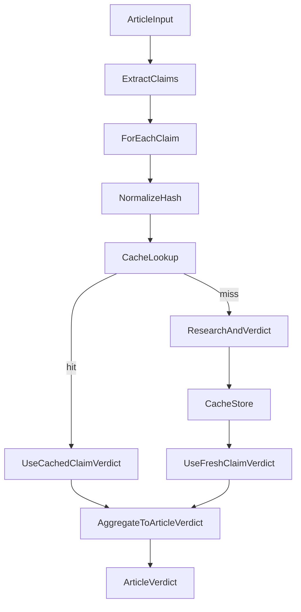

# Claim Caching Overview (Planned)

**Status:** Planned — **NOT implemented in the current codebase**  
**Last Updated:** 2026-01-12

This document explains the **proposed** claim-level caching architecture (“separating” claim verdict generation from article verdict synthesis) and how it differs from FactHarbor’s **current** separated services architecture.

---

## What this is (and what it is not)

- **This is**: a planned design to cache **claim verdicts** across analyses to reduce LLM/search cost and latency.
- **This is not**: a deployment guide.
- **This is not**: describing current behavior. Today, each job recomputes claim research/verdicts per run.

For current architecture, see `Docs/ARCHITECTURE/Overview.md`.

---

## Why claim caching

Many analyses repeat semantically identical or near-identical claims (especially across popular topics). Without caching, FactHarbor pays the full cost repeatedly:

- Search calls
- Source fetching/parsing
- LLM extraction/verdict calls

Claim caching aims to reduce repeated work while preserving correctness: **article verdicts remain dynamic** because context and framing can change.

---

## Proposed separation boundary

### Cached layer (claim verdicts)

**Cacheable** (candidate): a stable, evidence-backed verdict for a normalized claim text, including:
- truth percentage and confidence
- supporting facts and source URLs/excerpts
- model/provider + schema/prompt version metadata
- timestamps + TTL

### Non-cached layer (article verdict)

**Never cached**: the article-level verdict/synthesis, because it can depend on:
- selection and omission of claims
- rhetorical framing / misleading presentation
- dependencies and narrative structure
- scopes and context specific to the article

---

## High-level data flow (planned)

---

## Cache keying (planned)

The cache key should be derived from a **normalized claim** (and potentially other dimensions), such as:
- normalized claim text (lowercase, punctuation/whitespace normalized)
- analysis schema version (to prevent mixing incompatible outputs)
- model/provider version (optional but recommended)
- “knowledge allowed” toggle (if it affects verdict behavior)

This prevents unsafe reuse across incompatible configurations.

---

## Expiration & invalidation (planned)

Recommended initial approach:
- **TTL-based expiration** (e.g., 7 days)
- Optional shorter TTL for recency-sensitive claims
- Optional invalidation by source retraction/updates (requires source linkage persistence)

---

## Current implementation status (as of 2026-01-12)

**Not implemented** in current code:
- No claim verdict cache tables (`ClaimVerdict`, etc.)
- No cache service interface in `apps/web` or `apps/api`
- No Redis/Upstash usage for claim caching
- No cross-job reuse of claim verdicts

The only “claim-level” logic currently present is about **research recency checks** and **claim verdict aggregation**, not caching.

---

## Related docs

- `Docs/ARCHITECTURE/Overview.md` (current system architecture)
- `Docs/ARCHITECTURE/Separated_Architecture_Guide.md` (detailed planned implementation guide)

