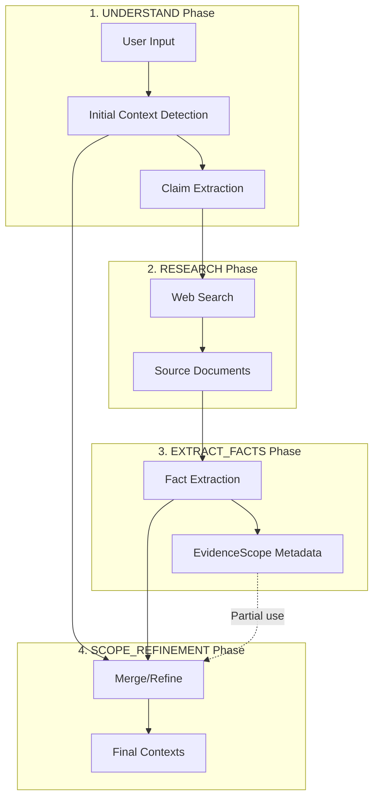

# Context Detection via EvidenceScope

**Version**: 2.6.40  
**Status**: Proposal and Analysis  
**Date**: January 26, 2026

---

## Executive Summary

This document analyzes the proposal to improve AnalysisContext detection by leveraging EvidenceScope metadata from evidence documentation. The analysis confirms this approach is valid, partially implemented, and can be enhanced with targeted prompt improvements.

---

## Problem Statement

Currently, important distinct AnalysisContexts are sometimes missed during initial detection. Examples:

1. **Legal domain**: Two separate legal cases (e.g., electoral court case vs supreme court case) should be detected as distinct contexts
2. **Scientific domain**: Different analytical methodologies (e.g., "Well-to-Tank" vs "Tank-to-Wheel" for efficiency analysis) should be detected as distinct contexts

The challenge: **How do we improve context detection without using test-case-specific terms** (like "jurisdiction", "TSE", "WTW") that would violate the "generic by design" principle?

---

## Current Architecture

### Pipeline Flow



### Current EvidenceScope Capture

The EXTRACT_FACTS phase captures EvidenceScope metadata per-fact:

```typescript
interface EvidenceScope {
  name: string;         // "WTW", "TTW", "EU REACH"
  methodology: string;  // "ISO 14040", "EU RED II"
  boundaries: string;   // "primary energy to wheel"
  geographic: string;   // "European Union"
  temporal: string;     // "2020-2025"
}
```

### Current Context Detection Points

| Phase | Context Detection | Uses Evidence? |
|-------|------------------|----------------|
| UNDERSTAND | Initial detection from input text | No |
| SCOPE_REFINEMENT | Refinement based on facts | Yes (partial) |

**Gap Identified**: The SCOPE_REFINEMENT phase uses facts for validation but doesn't explicitly look for EvidenceScope patterns that might indicate new AnalysisContexts.

---

## Analysis: Does This Approach Make Sense?

### Yes - Strong Rationale

1. **EvidenceScope reveals analytical boundaries**: Evidence documentation often contains explicit methodology markers, institutional identifiers, and temporal bounds that directly indicate distinct analytical frames

2. **Evidence-first is more reliable**: Initial context detection works from input text alone, which may be vague. Evidence sources often have explicit scope declarations

3. **Already partially implemented**: The SCOPE_REFINEMENT phase already receives facts with EvidenceScope metadata - it just needs better instructions for extracting context candidates from these patterns

4. **Generic by design**: Instead of hardcoding terms like "jurisdiction" or "WTW", we instruct the LLM to look for ANY methodology/institutional/temporal markers in EvidenceScope

### Validation Examples

**Example 1: Legal Domain**
- Input: "Was the trial fair?"
- Evidence Source 1: "The Supreme Court ruled on..."
- Evidence Source 2: "The Electoral Court determined..."
- EvidenceScope metadata reveals: different institutions → distinct contexts

**Example 2: Scientific Domain**
- Input: "Is hydrogen more efficient than electric?"
- Evidence Source 1: "Using Well-to-Tank analysis..."
- Evidence Source 2: "The Tank-to-Wheel efficiency..."
- EvidenceScope metadata reveals: different methodologies → distinct contexts

---

## Implementation Proposal

### 1. Enhance SCOPE_REFINEMENT Prompt

Add explicit guidance to extract AnalysisContext candidates from EvidenceScope patterns:

**Current instruction** (implicit):
```
Identify which ANALYSISCONTEXTS are ACTUALLY PRESENT in the provided evidence.
```

**Proposed enhancement**:
```
## CONTEXT DISCOVERY FROM EVIDENCE

**Step 1: Scan EvidenceScope metadata for boundary markers**

Look for patterns in fact.evidenceScope that suggest distinct analytical frames:

- **Methodology markers**: Different standards, frameworks, or analytical approaches
  - If facts cite "Framework A" and others cite "Framework B" → potential distinct contexts
  - Example: efficiency studies with different system boundaries (full chain vs partial)

- **Institutional markers**: Different formal bodies or processes
  - If facts reference different institutions/bodies → potential distinct contexts
  - Example: different agencies, courts, or regulatory bodies

- **Temporal markers**: Different time periods AS PRIMARY SUBJECT
  - If facts cluster around distinct historical events (not just dates within one event)
  - Example: "2000s reform" vs "1970s policy" as separate subjects to analyze

**Step 2: Validate potential contexts**

For each potential context discovered:
- Does it have supporting facts (>=1)?
- Is it directly relevant to the thesis?
- Would it require different evidence to evaluate?
- Is it truly distinct, not just a different perspective?

**Step 3: Create or merge**

- If validated: Create AnalysisContext with metadata from EvidenceScope
- If overlaps with existing: Merge into existing context
```

### 2. Propagate EvidenceScope to Context Detection

Update SCOPE_REFINEMENT to explicitly receive and process EvidenceScope metadata:

**Current fact format passed to refinement**:
```json
{
  "factId": "F1",
  "text": "The court ruled...",
  "contextId": "CTX1",
  "sourceUrl": "..."
}
```

**Enhanced format**:
```json
{
  "factId": "F1",
  "text": "The court ruled...",
  "contextId": "CTX1",
  "sourceUrl": "...",
  "evidenceScope": {
    "name": "Supreme Court",
    "institution": "Supreme Federal Court",
    "temporal": "2026"
  }
}
```

### 3. Add Context Discovery Heuristics to Prompt

Without hardcoding specific terms, add pattern-based guidance:

```
## EVIDENCE-BASED CONTEXT PATTERNS

Look for these patterns in the evidence that often indicate distinct contexts:

**Comparative claims** (input asks "A vs B"):
- Evidence likely has data for A and data for B
- These may use different methodologies/boundaries
- Check if A's scope differs from B's scope → if yes, separate contexts

**Multi-process subjects** (input mentions institutions/proceedings):
- Evidence may reference multiple formal processes
- Different processes = different analytical frames
- Check if institutional references cluster → if yes, separate contexts

**Historical comparisons** (input asks about change over time):
- Evidence may cover different time periods
- Distinct events (not just dates) = distinct contexts
- Check if temporal references form distinct clusters → if yes, separate contexts
```

---

## Implementation Plan

### Phase 1: Prompt Enhancement (Immediate)

**File**: `apps/web/src/lib/analyzer/prompts/base/scope-refinement-base.ts`

**Changes**:
1. Add "CONTEXT DISCOVERY FROM EVIDENCE" section with the EvidenceScope scanning guidance
2. Add validation checklist for potential contexts
3. Add pattern-based heuristics (comparative, multi-process, historical)

**Effort**: Small (prompt text changes only)

### Phase 2: Data Propagation (If Needed)

**File**: `apps/web/src/lib/analyzer/orchestrated.ts`

**Changes**:
1. Ensure EvidenceScope metadata is included when passing facts to SCOPE_REFINEMENT
2. Format EvidenceScope data in a way that's easy for LLM to scan

**Effort**: Medium (code changes)

### Phase 3: Validation (Testing)

**Test Cases**:
1. Venezuela oil nationalization (2000s vs 1970s temporal distinction)
2. Hydrogen vs electric efficiency (WTW vs TTW methodology distinction)
3. Legal proceeding fairness (multiple court/institution distinction)

**Success Criteria**:
- Distinct contexts detected from EvidenceScope patterns
- No over-splitting (same event with different dates = one context)
- No domain-specific hardcoding in prompts

---

## Risk Assessment

### Risks of This Approach

| Risk | Mitigation |
|------|------------|
| Over-splitting from minor EvidenceScope differences | Validation step requires "would need different evidence" |
| LLM ignoring EvidenceScope patterns | Explicit scanning instruction with examples |
| Inconsistent behavior across providers | Provider-specific guidance if needed |

### Risks of NOT Implementing

| Risk | Impact |
|------|--------|
| Missed important contexts | Incomplete analysis, potentially misleading verdicts |
| Methodology conflation | Comparing incomparable data (e.g., WTW vs TTW) |
| Institutional conflation | Mixing conclusions from different formal processes |

---

## Alternatives Considered

### Alternative 1: Heuristic Pre-Detection (Rejected)

Add algorithmic pattern detection before LLM analysis.

**Pros**: Fast, predictable  
**Cons**: Would require domain-specific patterns (violates generic principle)

### Alternative 2: Additional LLM Call (Rejected)

Add a dedicated "context discovery" LLM call after fact extraction.

**Pros**: Most thorough  
**Cons**: Additional latency and cost; user explicitly requested "without additional LLM call"

### Alternative 3: Prompt Enhancement Only (Selected)

Improve SCOPE_REFINEMENT prompt to better leverage existing EvidenceScope data.

**Pros**: No additional calls, generic by design, builds on existing architecture  
**Cons**: Depends on LLM following instructions correctly

---

## Conclusion

The user's idea to leverage EvidenceScope metadata for AnalysisContext detection is **valid and implementable**. The current architecture already captures EvidenceScope and passes facts to SCOPE_REFINEMENT - it just needs more explicit prompting to extract context candidates from these patterns.

**Recommended approach**: Phase 1 (prompt enhancement) provides the best balance of effectiveness and simplicity. If testing shows gaps, Phase 2 can ensure EvidenceScope data is more prominently passed to the refinement phase.

---

## Related Documentation

- [Calculations.md](Calculations.md) - Verdict calculation methodology
- [Pipeline_TriplePath_Architecture.md](Pipeline_TriplePath_Architecture.md) - Pipeline architecture
- [TERMINOLOGY.md](../REFERENCE/TERMINOLOGY.md) - AnalysisContext vs EvidenceScope definitions
- [Changelog_v2.6.38_to_v2.6.40.md](../STATUS/Changelog_v2.6.38_to_v2.6.40.md) - Recent terminology fixes
