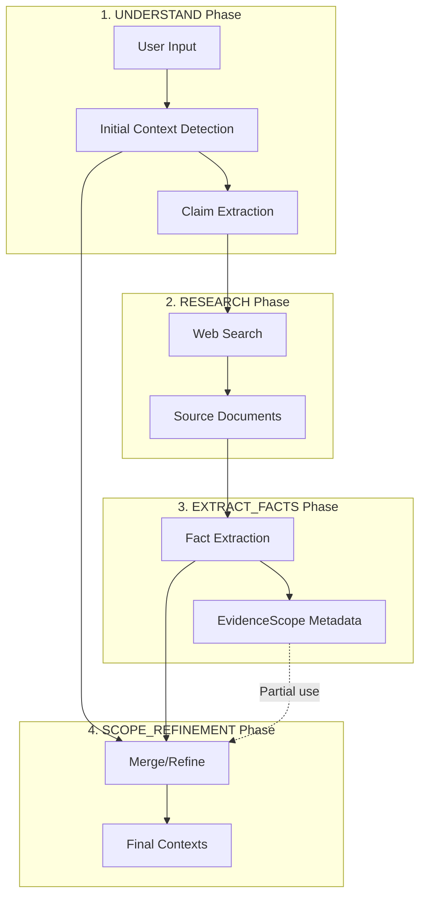

# Context Detection via EvidenceScope

**Version**: 2.6.41  
**Status**: Implemented  
**Date**: January 26, 2026

---

## Executive Summary

This document describes how FactHarbor uses EvidenceScope metadata to detect when distinct AnalysisContexts are needed. The approach uses a **principle-based incompatibility test** rather than listing specific terms or categories.

---

## Terminology (CRITICAL)

**FactHarbor Entities** (use in prompts):
- **Evidence**: Information extracted from sources (studies, fact-check reports, documentation)
- **Verdict**: Conclusions/assessments produced by analysis
- **AnalysisContext**: Top-level bounded analytical frame requiring separate analysis
- **EvidenceScope**: Per-Evidence source methodology metadata (boundaries)

**Avoid in prompts**:
- ~~fact/facts~~ → Use "Evidence" / "Evidence items"

---

## Problem Statement

Important distinct AnalysisContexts are sometimes missed during initial detection because:
1. Initial detection works from input text alone (no evidence yet)
2. Evidence sources often contain explicit boundary declarations that reveal distinct analytical frames

The challenge: **How do we improve context detection without using test-case-specific terms** that would violate the "generic by design" principle?

---

## Solution: Principle-Based EvidenceScope Detection

Instead of listing specific terms or categories, we use **ONE universal test**:

> "Would combining findings from this source with other sources be MISLEADING 
> because they measure or analyze fundamentally different things?"

### Key Principles

1. **Selective extraction**: Most analyses have 0-1 significant EvidenceScope patterns, max 2-3
2. **Explicit statements only**: Don't invent boundaries the source didn't state
3. **Incompatibility focus**: Only flag boundaries that would cause apples-to-oranges comparisons
4. **Synonym recognition**: Sources use various terms (scope, delimitations, limitations, inclusion criteria) - recognize all as boundary documentation

---

## Current Architecture

### Pipeline Flow



### Current EvidenceScope Capture

The EXTRACT_FACTS phase captures EvidenceScope metadata per-evidence:

```typescript
interface EvidenceScope {
  name: string;         // "WTW", "TTW", "EU REACH"
  methodology: string;  // "ISO 14040", "EU RED II"
  boundaries: string;   // "primary energy to wheel"
  geographic: string;   // "European Union"
  temporal: string;     // "2020-2025"
}
```

### Current Context Detection Points

| Phase | Context Detection | Uses Evidence? |
|-------|------------------|----------------|
| UNDERSTAND | Initial detection from input text | No |
| SCOPE_REFINEMENT | Refinement based on facts | Yes (partial) |

**Gap Identified**: The SCOPE_REFINEMENT phase uses facts for validation but doesn't explicitly look for EvidenceScope patterns that might indicate new AnalysisContexts.

---

## Analysis: Does This Approach Make Sense?

### Yes - Strong Rationale

1. **EvidenceScope reveals analytical boundaries**: Evidence documentation often contains explicit methodology markers, institutional identifiers, and temporal bounds that directly indicate distinct analytical frames

2. **Evidence-first is more reliable**: Initial context detection works from input text alone, which may be vague. Evidence sources often have explicit scope declarations

3. **Already partially implemented**: The SCOPE_REFINEMENT phase already receives facts with EvidenceScope metadata - it just needs better instructions for extracting context candidates from these patterns

4. **Generic by design**: Instead of hardcoding terms like "jurisdiction" or "WTW", we instruct the LLM to look for ANY methodology/institutional/temporal markers in EvidenceScope

### Validation Examples

**Example 1: Legal Domain**
- Input: "Was the trial fair?"
- Evidence Source 1: "The Supreme Court ruled on..."
- Evidence Source 2: "The Electoral Court determined..."
- EvidenceScope metadata reveals: different institutions → distinct contexts

**Example 2: Scientific Domain**
- Input: "Is hydrogen more efficient than electric?"
- Evidence Source 1: "Using Well-to-Tank analysis..."
- Evidence Source 2: "The Tank-to-Wheel efficiency..."
- EvidenceScope metadata reveals: different methodologies → distinct contexts

---

## Implementation Proposal

### 1. Enhance SCOPE_REFINEMENT Prompt

Add explicit guidance to extract AnalysisContext candidates from EvidenceScope patterns:

**Current instruction** (implicit):
```
Identify which ANALYSISCONTEXTS are ACTUALLY PRESENT in the provided evidence.
```

**Proposed enhancement**:
```
## CONTEXT DISCOVERY FROM EVIDENCE

**Step 1: Scan EvidenceScope metadata for boundary markers**

Look for patterns in fact.evidenceScope that suggest distinct analytical frames:

- **Methodology markers**: Different standards, frameworks, or analytical approaches
  - If facts cite "Framework A" and others cite "Framework B" → potential distinct contexts
  - Example: efficiency studies with different system boundaries (full chain vs partial)

- **Institutional markers**: Different formal bodies or processes
  - If facts reference different institutions/bodies → potential distinct contexts
  - Example: different agencies, courts, or regulatory bodies

- **Temporal markers**: Different time periods AS PRIMARY SUBJECT
  - If facts cluster around distinct historical events (not just dates within one event)
  - Example: "2000s reform" vs "1970s policy" as separate subjects to analyze

**Step 2: Validate potential contexts**

For each potential context discovered:
- Does it have supporting facts (>=1)?
- Is it directly relevant to the thesis?
- Would it require different evidence to evaluate?
- Is it truly distinct, not just a different perspective?

**Step 3: Create or merge**

- If validated: Create AnalysisContext with metadata from EvidenceScope
- If overlaps with existing: Merge into existing context
```

### 2. Propagate EvidenceScope to Context Detection

Update SCOPE_REFINEMENT to explicitly receive and process EvidenceScope metadata:

**Current fact format passed to refinement**:
```json
{
  "factId": "F1",
  "text": "The court ruled...",
  "contextId": "CTX1",
  "sourceUrl": "..."
}
```

**Enhanced format**:
```json
{
  "factId": "F1",
  "text": "The court ruled...",
  "contextId": "CTX1",
  "sourceUrl": "...",
  "evidenceScope": {
    "name": "Supreme Court",
    "institution": "Supreme Federal Court",
    "temporal": "2026"
  }
}
```

### 3. Add Context Discovery Heuristics to Prompt

Without hardcoding specific terms, add pattern-based guidance:

```
## EVIDENCE-BASED CONTEXT PATTERNS

Look for these patterns in the evidence that often indicate distinct contexts:

**Comparative claims** (input asks "A vs B"):
- Evidence likely has data for A and data for B
- These may use different methodologies/boundaries
- Check if A's scope differs from B's scope → if yes, separate contexts

**Multi-process subjects** (input mentions institutions/proceedings):
- Evidence may reference multiple formal processes
- Different processes = different analytical frames
- Check if institutional references cluster → if yes, separate contexts

**Historical comparisons** (input asks about change over time):
- Evidence may cover different time periods
- Distinct events (not just dates) = distinct contexts
- Check if temporal references form distinct clusters → if yes, separate contexts
```

---

## Implementation Plan

### Phase 1: Prompt Enhancement (Immediate)

**File**: `apps/web/src/lib/analyzer/prompts/base/scope-refinement-base.ts`

**Changes**:
1. Add "CONTEXT DISCOVERY FROM EVIDENCE" section with the EvidenceScope scanning guidance
2. Add validation checklist for potential contexts
3. Add pattern-based heuristics (comparative, multi-process, historical)

**Effort**: Small (prompt text changes only)

### Phase 2: Data Propagation (If Needed)

**File**: `apps/web/src/lib/analyzer/orchestrated.ts`

**Changes**:
1. Ensure EvidenceScope metadata is included when passing facts to SCOPE_REFINEMENT
2. Format EvidenceScope data in a way that's easy for LLM to scan

**Effort**: Medium (code changes)

### Phase 3: Validation (Testing)

**Test Cases**:
1. Venezuela oil nationalization (2000s vs 1970s temporal distinction)
2. Hydrogen vs electric efficiency (WTW vs TTW methodology distinction)
3. Legal proceeding fairness (multiple court/institution distinction)

**Success Criteria**:
- Distinct contexts detected from EvidenceScope patterns
- No over-splitting (same event with different dates = one context)
- No domain-specific hardcoding in prompts

---

## Risk Assessment

### Risks of This Approach

| Risk | Mitigation |
|------|------------|
| Over-splitting from minor EvidenceScope differences | Validation step requires "would need different evidence" |
| LLM ignoring EvidenceScope patterns | Explicit scanning instruction with examples |
| Inconsistent behavior across providers | Provider-specific guidance if needed |

### Risks of NOT Implementing

| Risk | Impact |
|------|--------|
| Missed important contexts | Incomplete analysis, potentially misleading verdicts |
| Methodology conflation | Comparing incomparable data (e.g., WTW vs TTW) |
| Institutional conflation | Mixing conclusions from different formal processes |

---

## Alternatives Considered

### Alternative 1: Heuristic Pre-Detection (Rejected)

Add algorithmic pattern detection before LLM analysis.

**Pros**: Fast, predictable  
**Cons**: Would require domain-specific patterns (violates generic principle)

### Alternative 2: Additional LLM Call (Rejected)

Add a dedicated "context discovery" LLM call after fact extraction.

**Pros**: Most thorough  
**Cons**: Additional latency and cost; user explicitly requested "without additional LLM call"

### Alternative 3: Prompt Enhancement Only (Selected)

Improve SCOPE_REFINEMENT prompt to better leverage existing EvidenceScope data.

**Pros**: No additional calls, generic by design, builds on existing architecture  
**Cons**: Depends on LLM following instructions correctly

---

## Implementation (v2.6.41)

### EXTRACT_FACTS Phase

The prompt now includes principle-based EvidenceScope detection:

```
## EVIDENCESCOPE: INCOMPATIBLE ANALYTICAL BOUNDARIES (SELECTIVE)

**THE SINGLE TEST**: Ask yourself:
"If I combined or averaged findings from this source with findings from other sources, 
would the result be MISLEADING because they measure or analyze fundamentally different things?"

- YES → Extract EvidenceScope (document what makes it incompatible)
- NO → Don't extract (the boundaries are compatible enough)

**CONSTRAINTS**:
- Most analyses: 0-1 significant boundary patterns
- Complex comparisons: 2-3 patterns maximum
- If source doesn't explicitly state boundaries: Don't invent them
```

### SCOPE_REFINEMENT Phase

The prompt now includes context discovery from EvidenceScope patterns:

```
## CONTEXT DISCOVERY FROM EVIDENCESCOPE PATTERNS

**The Core Question**: Do the incompatible boundaries found represent genuinely 
different analytical frames that need separate verdicts?

**Create separate AnalysisContexts when**:
- EvidenceScope patterns show Evidence answering DIFFERENT QUESTIONS
- Combining conclusions from them would be MISLEADING
- They would require different evidence to evaluate
```

---

## Conclusion

The principle-based approach to EvidenceScope detection is **implemented** in:
- `apps/web/src/lib/analyzer/prompts/base/extract-facts-base.ts`
- `apps/web/src/lib/analyzer/prompts/base/scope-refinement-base.ts`

Key benefits:
- **Generic by design**: No hardcoded terms or categories
- **Selective**: 0-3 patterns, not dozens
- **Context-dependent**: LLM decides significance based on analysis needs

---

## Related Documentation

- [When_Are_AnalysisContexts_Defined.md](When_Are_AnalysisContexts_Defined.md) - Timeline and phases of context detection
- [Calculations.md](Calculations.md) - Verdict calculation methodology
- [Pipeline_TriplePath_Architecture.md](Pipeline_TriplePath_Architecture.md) - Pipeline architecture
- [TERMINOLOGY.md](../REFERENCE/TERMINOLOGY.md) - AnalysisContext vs EvidenceScope definitions
- [Changelog_v2.6.38_to_v2.6.40.md](../STATUS/Changelog_v2.6.38_to_v2.6.40.md) - Recent terminology fixes
