> **MOVED TO xWiki** (2026-02-06)
> 
> This document has been consolidated into the xWiki documentation system.
> The xWiki version is now the authoritative source.
> 
> **xWiki file**: `Docs/xwiki-pages/FactHarbor_Spec_and_Impl/FactHarbor/Specification/Implementation/Pipeline Architecture/Context and EvidenceScope Detection/WebHome.xwiki`
> 
> This .md file is kept for reference only. Do not edit - edit the .xwiki file instead.

---


# Context and EvidenceScope Detection Guide

**Version**: 1.0
**Status**: Consolidated Reference
**Date**: February 3, 2026

---

## 1. Overview and Purpose

This guide consolidates all information about FactHarbor's context detection system into a single reference. It explains:

- **What** contexts and evidence scopes are (definitions)
- **When** to use AnalysisContext vs EvidenceScope (decision tree)
- **How** contexts are detected across pipeline phases (flow)
- **Why** the system uses principle-based detection (approach)
- **Where** the implementation lives (code references)

**Target Audience**: Developers working on context detection, prompt engineers, and technical reviewers.

**Replaces scattered documentation in**:
- Context_Detection_via_EvidenceScope.md (principle-based approach)
- Overview.md Section 1.1 (architecture overview)
- Calculations.md Section 2 (AnalysisContext definition)
- Pipeline_TriplePath_Architecture.md (context routing)

---

## 2. Terminology (CRITICAL)

### 2.1 Core Definitions

**AnalysisContext** (Top-Level Bounded Analytical Frame):
- A distinct analytical frame requiring separate analysis
- **Scope**: Top-level question or thesis being analyzed
- **Example**: "Legal proceeding A fairness" vs "Legal proceeding B fairness" are distinct contexts
- **Storage**: `article.distinctContexts` array, `claim.relatedContextId`, `verdict.relatedContextId`

**EvidenceScope** (Per-Evidence Source Methodology):
- Metadata about a single evidence item's boundaries and methodology
- **Scope**: Per-fact source constraints (methodology, boundaries, temporal, geographic)
- **Example**: "Study used Framework A with full system boundary"
- **Storage**: `fact.evidenceScope` object

**Key Distinction**: AnalysisContext = "What question am I answering?" vs EvidenceScope = "What boundaries did this evidence source use?"

### 2.2 Terminology Usage Rules

**FactHarbor Entities** (use in prompts and code):
- **Evidence**: Information extracted from sources
- **Verdict**: Conclusions/assessments produced by analysis
- **AnalysisContext**: Top-level bounded analytical frame
- **EvidenceScope**: Per-Evidence source methodology metadata

**Avoid in prompts**:
- ~~fact/facts~~ → Use "Evidence" / "Evidence items"
- ~~scope~~ (ambiguous) → Use "AnalysisContext" or "EvidenceScope" explicitly

---

## 3. AnalysisContext vs EvidenceScope Decision Tree

```mermaid
flowchart TD
    START{What am I describing?}

    START -->|Top-level question/thesis| Q1{Does it require<br/>separate analysis?}
    START -->|Evidence source metadata| SCOPE[Use EvidenceScope]

    Q1 -->|Yes - different questions| CTX[Use AnalysisContext]
    Q1 -->|No - same question,<br/>different perspectives| NOCTX[Single AnalysisContext]

    CTX --> EX1["Example: 'Proceeding A fairness'<br/>vs 'Proceeding B fairness'<br/>→ 2 AnalysisContexts"]

    NOCTX --> EX2["Example: 'Is claim X true?'<br/>with sources from different orgs<br/>→ 1 AnalysisContext"]

    SCOPE --> EX3["Example: Evidence fact has<br/>evidenceScope: {<br/>  methodology: 'Framework A',<br/>  boundaries: 'Full system'<br/>}"]

    style CTX fill:#c8e6c9
    style SCOPE fill:#fff9c4
    style NOCTX fill:#e3f2fd
```



### 3.1 When to Create Multiple AnalysisContexts

Create separate AnalysisContexts when:
1. **Different Questions**: Evidence answers fundamentally different questions
   - "Was Proceeding A fair?" vs "Was Proceeding B fair?"
   - "Is Method X effective?" vs "Is Method Y effective?"

2. **Incompatible Methodologies**: Combining conclusions would be misleading
   - "Efficiency using Framework A boundary" vs "Efficiency using Framework B boundary"
   - "Legal proceeding in Court A" vs "Legal proceeding in Court B"

3. **Distinct Temporal Subjects**: Time periods are the primary subject (not incidental)
   - "Policy effectiveness in Period 1" vs "Policy effectiveness in Period 2"
   - NOT: "Study conducted in 2023" (incidental date mention)

### 3.2 When to Use EvidenceScope (Not AnalysisContext)

Use EvidenceScope metadata when:
1. **Source Methodology Markers**: Evidence states its analytical boundaries
   - "This study uses ISO 14040 methodology"
   - "Analysis limited to vehicle operation only"

2. **Provenance Tracking**: Distinguishing evidence source constraints
   - Helps identify methodology mismatches
   - Enables evidence quality assessment

3. **Verdict Enrichment**: Noting source boundaries without splitting contexts
   - "Evidence from WTW study applied to TTW analysis" (mismatch flag)

---

## 4. Detection Pipeline Flow

### 4.1 Multi-Phase Context Detection

```mermaid
flowchart TB
    subgraph UNDERSTAND["Phase 1: UNDERSTAND"]
        Input[User Input] --> InitialDetection[Initial Context Detection<br/>━━━━━━━━━━━━━<br/>From input text alone<br/>No evidence yet]
        InitialDetection --> Claims[Claim Extraction<br/>━━━━━━━━━━━━━<br/>Claims tagged with contextId]
    end

    subgraph RESEARCH["Phase 2: RESEARCH"]
        Claims --> Search[Web Search]
        Search --> Sources[Source Documents]
    end

    subgraph EXTRACT["Phase 3: EXTRACT_FACTS"]
        Sources --> Facts[Fact Extraction]
        Facts --> ES[EvidenceScope Metadata<br/>━━━━━━━━━━━━━<br/>Per-fact boundaries captured]
    end

    subgraph REFINE["Phase 4: CONTEXT_REFINEMENT"]
        InitialDetection --> Merge[Merge/Refine Contexts<br/>━━━━━━━━━━━━━<br/>Evidence-based discovery<br/>Overlap detection<br/>LLM-driven merge]
        Facts --> Merge
        ES -.->|Informs context<br/>discovery| Merge
        Merge --> FinalContexts[Final Contexts<br/>━━━━━━━━━━━━━<br/>Max 5 contexts<br/>Warnings if 4-5]
    end

    style InitialDetection fill:#fff3e0
    style ES fill:#fff9c4
    style Merge fill:#c8e6c9
    style FinalContexts fill:#e3f2fd
```



### 4.2 Context Detection Points

| Phase | Context Detection | Uses Evidence? | Source |
|-------|------------------|----------------|--------|
| **UNDERSTAND** | Initial detection from input text | No | Input analysis |
| **EXTRACT_FACTS** | EvidenceScope metadata capture | Yes | Source documents |
| **CONTEXT_REFINEMENT** | Evidence-based discovery & merge | Yes | EvidenceScope patterns |

### 4.3 Data Flow

**Phase 1: Initial Context Detection**
```typescript
// Input: User query
// Output: Initial AnalysisContext candidates
interface AnalysisContext {
  id: string;              // e.g., "CTX_INST_A", "CTX_METHOD_X"
  name: string;            // Human-readable name
  shortName: string;       // Abbreviation
  institution?: string;    // Court, agency, organization
  methodology?: string;    // Standard/method used
  boundaries?: string;     // What's included/excluded
  temporal?: string;       // Time period
  subject: string;         // What's being analyzed
  status: "concluded" | "ongoing" | "pending" | "unknown";
}
```

**Phase 3: EvidenceScope Capture**
```typescript
// Input: Source document
// Output: Per-fact EvidenceScope metadata
interface EvidenceScope {
  name: string;         // "Framework A", "Court B"
  methodology: string;  // "Standard X", "Full system boundary"
  boundaries: string;   // "Full system", "Subsystem only"
  geographic: string;   // "Region A"
  temporal: string;     // "Period 1"
}
```

**Phase 4: Context Refinement**
```typescript
// Input: Initial contexts + extracted facts with EvidenceScope
// Process: Scan EvidenceScope patterns → validate → merge/create
// Output: Final AnalysisContext list (max 5)
```

---

## 5. Principle-Based Detection Rules

### 5.1 The Single Incompatibility Test

Instead of hardcoding specific terms or categories, FactHarbor uses **ONE universal test**:

> **"Would combining findings from this source with other sources be MISLEADING
> because they measure or analyze fundamentally different things?"**

- **YES** → Extract EvidenceScope (document what makes it incompatible)
- **NO** → Don't extract (boundaries are compatible enough)

### 5.2 Key Principles

1. **Selective extraction**: Most analyses have 0-1 significant EvidenceScope patterns, max 2-3
2. **Explicit statements only**: Don't invent boundaries the source didn't state
3. **Incompatibility focus**: Only flag boundaries that would cause apples-to-oranges comparisons
4. **Synonym recognition**: Sources use various terms (scope, delimitations, limitations, inclusion criteria)

### 5.3 EvidenceScope Detection Guidance (EXTRACT_FACTS Phase)

**From**: `apps/web/src/lib/analyzer/prompts/base/extract-facts-base.ts`

```markdown
## EVIDENCESCOPE: INCOMPATIBLE ANALYTICAL BOUNDARIES (SELECTIVE)

**THE SINGLE TEST**: Ask yourself:
"If I combined or averaged findings from this source with findings from other sources,
would the result be MISLEADING because they measure or analyze fundamentally different things?"

- YES → Extract EvidenceScope (document what makes it incompatible)
- NO → Don't extract (the boundaries are compatible enough)

**CONSTRAINTS**:
- Most analyses: 0-1 significant boundary patterns
- Complex comparisons: 2-3 patterns maximum
- If source doesn't explicitly state boundaries: Don't invent them
```

### 5.4 Context Discovery from EvidenceScope (CONTEXT_REFINEMENT Phase)

**From**: `apps/web/src/lib/analyzer/prompts/base/scope-refinement-base.ts`

```markdown
## CONTEXT DISCOVERY FROM EVIDENCESCOPE PATTERNS

**The Core Question**: Do the incompatible boundaries found represent genuinely
different analytical frames that need separate verdicts?

**Create separate AnalysisContexts when**:
- EvidenceScope patterns show Evidence answering DIFFERENT QUESTIONS
- Combining conclusions from them would be MISLEADING
- They would require different evidence to evaluate
```

### 5.5 Pattern-Based Heuristics

**Comparative claims** (input asks "A vs B"):
- Evidence likely has data for A and data for B
- Check if A's scope differs from B's scope
- If yes, separate contexts

**Multi-process subjects** (input mentions institutions/proceedings):
- Evidence may reference multiple formal processes
- Different processes = different analytical frames
- Check if institutional references cluster

**Historical comparisons** (input asks about change over time):
- Evidence may cover different time periods
- Distinct events (not just dates) = distinct contexts
- Check if temporal references form distinct clusters

---

## 6. Overlap Detection and Merge Heuristics

### 6.1 Context Overlap Problem

**Problem**: Over-splitting contexts leads to:
- High context counts (4-5+)
- Redundant analyses
- Confusing verdicts

**Solution**: LLM-driven merge heuristics with explicit guidance

### 6.2 Merge Criteria

**Merge contexts when**:
1. **Subject Overlap**: Both contexts address the same core question
   - "Institution A handling of Issue X" + "Institution A process for Issue X" → Merge

2. **Temporal Continuity**: Time periods are parts of a continuous event
   - "Policy Phase 1 (2020)" + "Policy Phase 2 (2021)" → Merge if phases are related
   - "2000s reform" + "1970s reform" → Keep separate (distinct historical events)

3. **Methodological Compatibility**: Boundaries/standards are compatible
   - "Study using Framework A, full boundary" + "Study using Framework A, subsystem" → Keep separate
   - "Study using Framework A" + "Study using Framework A variant" → Merge if compatible

### 6.3 Merge Validation

**From**: `apps/web/src/lib/analyzer/prompts/base/scope-refinement-base.ts`

For each potential merge:
- Does merging preserve analytical integrity?
- Would merged contexts answer a coherent question?
- Is evidence from both contexts compatible?

### 6.4 Temporal Guidance

**Temporal markers create contexts when**:
- Time period is the PRIMARY SUBJECT (e.g., "Compare 2000s vs 1970s")
- NOT when it's incidental (e.g., "Study conducted in 2023")

**Example**:
- ❌ Split: "Decision made in 2020" + "Decision made in 2021" (incidental dates)
- ✅ Split: "2020 reform analysis" + "2021 reform analysis" (distinct reform periods as subjects)

---

## 7. Context Count and User Guidance

### 7.1 How Context Count Appears

**1. Progress Messages** (during analysis):
```
Detected: CLAIM with 5 claims | 3 CONTEXTS
```

**2. Report Title** (final report):
```
Analyzed Content (3 contexts)
```

**3. Reasoning Section** (verdict explanation):
```
Covers 3 contexts: INST_A, INST_B, SCOPE_GENERAL
```

### 7.2 Thresholds and Limits

| Context Count | Status | Meaning |
|---------------|--------|---------|
| **1-3** | ✅ Healthy | Typical for most analyses |
| **4-5** | ⚠️ High | Complex analytical frame with multiple incompatible boundaries |
| **5+** | 🚫 Limit | System enforces max via `contextDetectionMaxContexts` config |

### 7.3 User Guidance for High Context Counts

**When you see 4-5 contexts**:

1. **Review Context Names**
   - Are these genuinely distinct analytical frames?
   - Or did the system over-split based on minor differences?

2. **Examine Individual Context Verdicts**
   - Each context gets separate analysis and verdict
   - Look for meaningful differences in the evidence base per context

3. **Consider Refining Your Input**
   - Provide more explicit guidance about the intended analytical frame
   - Use temporal/methodological qualifiers to signal boundaries
   - Example: Instead of "Is Policy X effective?", use "Is Policy X effective in achieving Goal Y using Metric Z?"

4. **Trust the Overall Verdict (with caveats)**
   - Overall verdict = simple average of context verdicts
   - Check `articleVerdictReliability` field:
     - `"high"`: Contexts answer related questions, average is meaningful
     - `"low"`: Contexts answer different questions, focus on individual verdicts
   - When reliability is low, de-emphasize overall average and highlight individual context verdicts

### 7.4 Multi-Context Average Reliability

**Single Context (Most Common)**:
- Average = context verdict (identical)
- Overall verdict fully represents the analysis

**Multiple Contexts (Distinct Frames)**:
- Average may not be meaningful if contexts answer different questions
- Example: "Legal trial fairness (85%)" + "Scientific validity (30%)" = 57.5% average
- The 57.5% doesn't represent either question well

**Architecture Decision (v2.6.38)**:
- Simple averaging chosen over complex weighting schemes
- Transparency via `articleVerdictReliability` flag and explicit messaging
- Individual context verdicts always preserved and displayed
- Future enhancement: Primary context detection

### 7.5 Context Count Warnings

**Current Status**: ⚠️ Planned but not yet implemented

**Future Behavior**:
- Warnings when context count exceeds recommended thresholds
- Suggestions for input refinement or manual context review
- UI indicators for over-split contexts

---

## 8. Implementation Reference

### 8.1 Core Files

**Context Detection Logic**:
- `apps/web/src/lib/analyzer/scopes.ts` - Heuristic pre-detection, `detectScopes()`
- `apps/web/src/lib/analyzer/orchestrated.ts` - Orchestrated pipeline (primary)
- `apps/web/src/lib/analyzer/monolithic-canonical.ts` - Canonical monolithic pipeline
- `apps/web/src/lib/analyzer/monolithic-dynamic.ts` - Dynamic monolithic pipeline

**Prompt Templates**:
- `apps/web/src/lib/analyzer/prompts/base/extract-facts-base.ts` - EvidenceScope detection guidance
- `apps/web/src/lib/analyzer/prompts/base/scope-refinement-base.ts` - Context discovery and merge guidance

**Shared Modules**:
- `apps/web/src/lib/analyzer/aggregation.ts` - Context verdict aggregation
- `apps/web/src/lib/analyzer/claim-decomposition.ts` - Claim-to-context mapping

### 8.2 Key Functions

**Context Detection**:
```typescript
// Heuristic pre-detection (optional)
detectScopes(inputText: string): DetectedScope[]

// Format detected scopes for LLM hint
formatDetectedScopesHint(scopes: DetectedScope[]): string
```

**Context Refinement**:
```typescript
// LLM-driven context refinement with evidence
// Phase: CONTEXT_REFINEMENT
// Input: Initial contexts + extracted facts with EvidenceScope
// Output: Final AnalysisContext list
```

**Context Aggregation**:
```typescript
// Calculate context answer from key factors
// File: aggregation.ts
calculateWeightedVerdictAverage(verdicts: ClaimVerdict[]): number
```

### 8.3 Data Structures

**AnalysisContext Interface**:
```typescript
interface AnalysisContext {
  id: string;              // e.g., "CTX_TSE", "CTX_WTW"
  name: string;            // Human-readable name
  shortName: string;       // Abbreviation
  institution?: string;    // Court, agency, organization
  methodology?: string;    // Standard/method used
  boundaries?: string;     // What's included/excluded
  temporal?: string;       // Time period
  subject: string;         // What's being analyzed
  criteria?: string[];     // Evaluation criteria
  outcome?: string;        // Result if known
  status: "concluded" | "ongoing" | "pending" | "unknown";
  decisionMakers?: DecisionMaker[];
}
```

**EvidenceScope Interface**:
```typescript
interface EvidenceScope {
  name: string;         // "Framework A", "Framework B"
  methodology: string;  // "Standard X", "Standard Y"
  boundaries: string;   // "Full system boundary", "Subsystem boundary"
  geographic: string;   // "Region A"
  temporal: string;     // "Period 1"
}
```

### 8.4 Configuration

**Context Detection Settings** (UCM Pipeline Config):
```json
{
  "contextDetectionMaxContexts": 5,      // Maximum contexts allowed
  "contextDetectionMergeThreshold": 0.7  // Similarity threshold for merging
}
```

---

## 9. Examples

### 9.1 Example 1: Institutional Boundary Indicates Distinct Contexts

**Input**: "Is Decision X justified?"

**Evidence**:
- Source A excerpt: "Institution A applies Standard A for Decision X..."
- Source B excerpt: "Institution B applies Standard B for Decision X..."

**EvidenceScope**:
- Source A: `{ institution: "Institution A", methodology: "Standard A" }`
- Source B: `{ institution: "Institution B", methodology: "Standard B" }`

**Result**: 2 AnalysisContexts
- CTX_INST_A: "Decision X justification (Institution A, Standard A)"
- CTX_INST_B: "Decision X justification (Institution B, Standard B)"

**Rationale**: Different formal bodies/standards → likely distinct AnalysisContexts

---

### 9.2 Example 2: Methodology Boundary Indicates Distinct Contexts

**Input**: "Is Method X more effective than Method Y?"

**Evidence**:
- Source A excerpt: "Using Framework A, we evaluate the full system boundary..."
- Source B excerpt: "Using Framework B, we evaluate only a subsystem boundary..."

**EvidenceScope**:
- Source A: `{ methodology: "Framework A", boundaries: "Full system" }`
- Source B: `{ methodology: "Framework B", boundaries: "Subsystem only" }`

**Result**: 2 AnalysisContexts
- CTX_FRAMEWORK_A: "Method effectiveness (Framework A, Full system)"
- CTX_FRAMEWORK_B: "Method effectiveness (Framework B, Subsystem)"

**Rationale**: Incompatible methodological boundaries → distinct AnalysisContexts

---

### 9.3 Example 3: Temporal Mention vs Temporal Subject

**Input**: "Did Policy Z have the intended outcome?"

**Evidence**:
- Source A excerpt: "We analyze outcomes during Period 1 (incidental date mention)."
- Source B excerpt: "This paper compares Period 1 vs Period 2 as the primary subject."

**EvidenceScope**:
- Source A: `{ temporal: "Period 1" }` (incidental)
- Source B: `{ temporal: "Period 1 vs Period 2" }` (primary subject)

**Result**: 2 AnalysisContexts only if temporal is primary subject
- If Source B makes time periods the primary subject: Split
- If Source A just mentions dates incidentally: Single context

**Rationale**: If time periods are the primary subject (not incidental), split contexts

---

### 9.4 Example 4: Overlap Indicates Merge

**Input**: "Is Claim Q supported?"

**Evidence**:
- Source A and B both declare the same boundary and methodology in EvidenceScope
- Same standard, same population, same time window

**EvidenceScope**:
- Source A: `{ methodology: "Standard X", boundaries: "Full system", temporal: "2020-2025" }`
- Source B: `{ methodology: "Standard X", boundaries: "Full system", temporal: "2020-2025" }`

**Result**: 1 AnalysisContext
- CTX_GENERAL: "Claim Q support (Standard X, Full system, 2020-2025)"

**Rationale**: Strong overlap → merge into a single AnalysisContext

---

## 10. Validation Examples (Generic-by-Design)

All examples use placeholders (no domain-specific entities).

### 10.1 Legal Proceeding Fairness

**Input**: "Was Proceeding X conducted fairly?"

**Detected Contexts**:
- CTX_PROC_X: "Proceeding X fairness (Court A)"

**Evidence**:
- Fact 1: "Court A ruled in favor of Party A" (contextId: CTX_PROC_X)
- Fact 2: "Party B appealed to Court B" (creates new context)

**Refined Contexts**:
- CTX_PROC_X_COURT_A: "Proceeding X in Court A"
- CTX_PROC_X_COURT_B: "Proceeding X appeal in Court B"

**Verdict**: 2 separate verdicts (one per court)

---

### 10.2 Efficiency Comparison with Methodology Mismatch

**Input**: "Is Technology X more efficient than Technology Y?"

**Detected Contexts**:
- CTX_EFFICIENCY: "Technology X vs Y efficiency"

**Evidence**:
- Fact 1: "Study A uses Framework A, full system boundary" (evidenceScope: Framework A)
- Fact 2: "Study B uses Framework B, subsystem only" (evidenceScope: Framework B)

**Refined Contexts**:
- CTX_FRAMEWORK_A: "Efficiency (Framework A, Full system)"
- CTX_FRAMEWORK_B: "Efficiency (Framework B, Subsystem)"

**Verdict**: 2 separate verdicts (one per methodology), with warning about methodology mismatch

---

### 10.3 Historical Event with Temporal Continuity

**Input**: "Did Policy W achieve its goals?"

**Detected Contexts**:
- CTX_POLICY_W: "Policy W effectiveness"

**Evidence**:
- Fact 1: "Policy W Phase 1 (2020): Implemented action A" (temporal: 2020)
- Fact 2: "Policy W Phase 2 (2021): Expanded to action B" (temporal: 2021)

**Refined Contexts**:
- CTX_POLICY_W: "Policy W effectiveness (2020-2021)" (merged - continuous event)

**Verdict**: 1 verdict covering both phases (temporal continuity, not distinct events)

---

## 11. Related Documentation

- [Calculations.md](Calculations.md) - Verdict calculation methodology, AnalysisContext aggregation
- [Quality_Gates_Reference.md](Quality_Gates_Reference.md) - Quality gates reference (Gate 1, Gate 4)
- [Pipeline_TriplePath_Architecture.md](Pipeline_TriplePath_Architecture.md) - Pipeline architecture and context routing
- [TERMINOLOGY.md](../REFERENCE/TERMINOLOGY.md) - AnalysisContext vs EvidenceScope definitions
- [Evidence_Quality_Filtering.md](Evidence_Quality_Filtering.md) - Evidence filtering and classification
- [Changelog_v2.6.38_to_v2.6.40.md](../ARCHIVE/STATUS/Changelog_v2.6.38_to_v2.6.40.md) - Recent terminology fixes

---

## 12. Conclusion

FactHarbor's context detection system balances:
- **Precision**: Detecting genuinely distinct analytical frames
- **Generality**: No domain-specific hardcoding
- **Transparency**: Clear reasoning for splits and merges
- **User Control**: Guidance for refining inputs when needed

**Key Takeaways**:
1. Use **principle-based detection** (incompatibility test), not keyword matching
2. **Selective extraction** (0-3 EvidenceScope patterns max)
3. **Merge by default** (split only when necessary)
4. **Trust individual context verdicts** when overall average reliability is low

---

**Last Updated**: February 3, 2026
**Document Status**: Consolidated reference - combines 4 source documents
