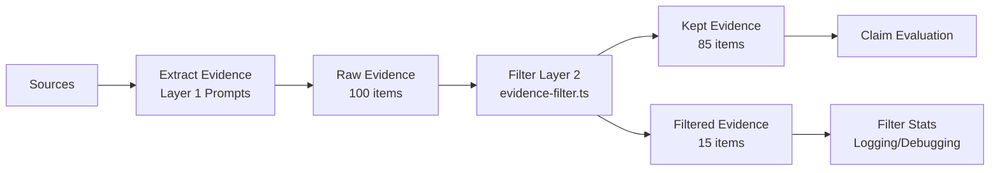
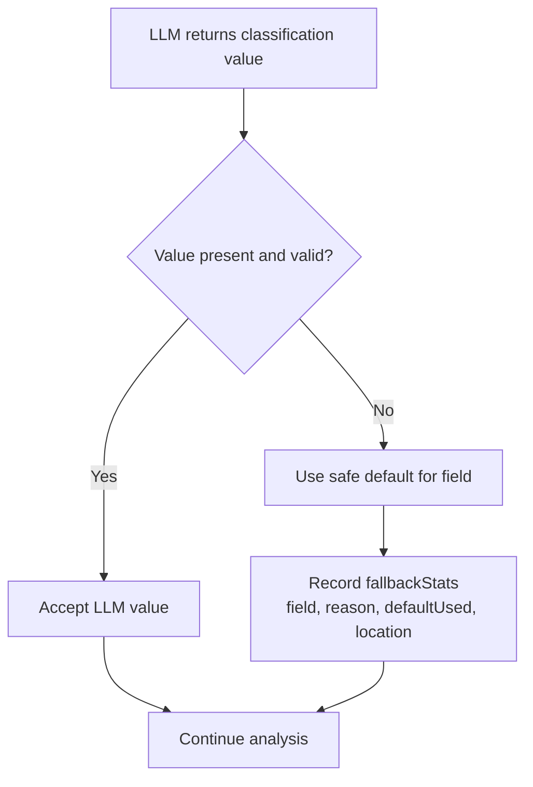

# Evidence Quality Filtering Architecture

**Version**: 2.6.42
**Date**: 2026-02-02
**Status**: Implemented (Phase 1.5 + 7-Layer Defense documented)
**Related**: [Schema Migration Strategy](Schema_Migration_Strategy.md), [Terminology Migration Plan](../ARCHIVE/REVIEWS/Terminology_Migration_Plan_UPDATED.md)

---

## Table of Contents

1. [Introduction](#1-introduction)
2. [Multi-Layer Claim Filtering Defense](#2-multi-layer-claim-filtering-defense)
3. [Two-Layer Enforcement Strategy](#3-two-layer-enforcement-strategy)
4. [Filter Rules and Rationale](#4-filter-rules-and-rationale)
5. [Configuration Options](#5-configuration-options)
6. [Integration Points](#6-integration-points)
7. [Examples](#7-examples)
8. [Testing](#8-testing)
9. [False Positive Detection](#9-false-positive-detection)
10. [Classification Fallbacks](#10-classification-fallbacks)

---

## 1. Introduction

### Purpose

The Evidence Quality Filter is a **deterministic post-processing layer** that removes low-quality evidence items that slip through the LLM extraction process. It enforces **probative value standards** to ensure only well-attributed, specific evidence reaches the verdict aggregation stage.

### Problem Statement

During evidence extraction, LLMs may occasionally extract items that:
- Use vague attribution ("some say", "many believe")
- Lack concrete source excerpts or URLs
- Are too short to be meaningful
- Duplicate existing evidence
- Fail category-specific quality checks (e.g., statistics without numbers)

Without filtering, these low-quality items can dilute verdict accuracy and reduce system trustworthiness.

### Solution

A **multi-layer defense strategy** combines LLM instruction (soft enforcement) with deterministic filtering (hard enforcement) across 7 layers to maintain evidence quality standards.

---

## 2. Multi-Layer Claim Filtering Defense

> **Source**: [Baseless_Tangential_Claims_Investigation_2026-02-02.md](../ARCHIVE/REVIEWS/Baseless_Tangential_Claims_Investigation_2026-02-02.md)

### Overview

The FactHarbor analysis system implements a **comprehensive 7-layer defense strategy** to prevent baseless claims and tangential/unrelated claims from influencing final verdicts. Each layer operates independently and redundantly, ensuring that even if one layer fails, others catch problematic claims.

### 7-Layer Defense Diagram

```
analyzeOrchestrated()
  │
  ├─ extractFacts() [for each source]
  │   ├─ filterByProbativeValue()         ← Layer 1: Evidence Quality Filtering
  │   └─ filterFactsByProvenance()        ← Layer 2: Provenance Validation
  │
  ├─ generateVerdicts()
  │   └─ [LLM generates verdicts with thesisRelevance tagging]
  │
  ├─ aggregateSummaryVerdicts()
  │   ├─ validateContestation()           ← Layer 6: Contestation Validation
  │   ├─ pruneOpinionOnlyFactors()        ← Layer 5: Opinion-Only Pruning
  │   ├─ calculateWeightedVerdictAverage()← Layer 4: Thesis Relevance Filtering
  │   └─ pruneTangentialBaselessClaims()  ← Layer 3: Tangential Baseless Pruning
  │
  └─ Context routing throughout          ← Layer 7: Context-Aware Claim Routing
```

### Layer Summary

| Layer | Name | File | Purpose |
|-------|------|------|---------|
| **1** | Evidence Quality Filtering | [evidence-filter.ts](../../apps/web/src/lib/analyzer/evidence-filter.ts) | Filter vague/incomplete evidence at extraction |
| **2** | Provenance Validation | [provenance-validation.ts](../../apps/web/src/lib/analyzer/provenance-validation.ts) | Reject synthetic/LLM-generated content |
| **3** | Tangential Baseless Pruning | [aggregation.ts:386-402](../../apps/web/src/lib/analyzer/aggregation.ts#L386) | Remove tangential claims with 0 supporting facts |
| **4** | Thesis Relevance Filtering | [aggregation.ts:257-258](../../apps/web/src/lib/analyzer/aggregation.ts#L257) | Give tangential claims weight=0 in verdict calc |
| **5** | Opinion-Only Factor Pruning | [aggregation.ts:418-429](../../apps/web/src/lib/analyzer/aggregation.ts#L418) | Remove keyFactors with factualBasis="opinion" |
| **6** | Contestation Validation | [aggregation.ts:40-222](../../apps/web/src/lib/analyzer/aggregation.ts#L40) | Downgrade opinion-based contestation, keep documented counter-evidence |
| **7** | Context-Aware Routing | [scopes.ts](../../apps/web/src/lib/analyzer/scopes.ts) | Route claims to correct analytical context |

### Layer Protection Summary

| Layer | What It Filters | Verdict Impact |
|-------|-----------------|----------------|
| 1 | Vague attribution, missing sources | Evidence never reaches aggregation |
| 2 | LLM-generated text, synthetic URLs | Hallucinated "evidence" rejected |
| 3 | Tangential claims with 0 evidence | Claims removed from report |
| 4 | All tangential claims | Claims contribute weight=0 to verdict |
| 5 | Opinion-only keyFactors | Factors removed from report |
| 6 | Opinion-based contestation | Full weight retained (doubt ≠ contestation) |
| 7 | Cross-context evidence | Claims evaluated in correct analytical frame |

### Configuration Locations

All layers are configurable via UCM:

| Layer | Configuration | UCM Location |
|-------|---------------|--------------|
| 1-2 | Evidence filtering | Admin → Config → Pipeline |
| 1-2 | Pattern lexicons | Admin → Config → Evidence Lexicon |
| 3-6 | Aggregation rules | Admin → Config → Aggregation Lexicon |
| 7 | Context detection | Admin → Config → Pipeline (`contextDetection*`) |

For complete layer-by-layer details with code examples, see the [full investigation report](../ARCHIVE/REVIEWS/Baseless_Tangential_Claims_Investigation_2026-02-02.md).

---

## 3. Two-Layer Enforcement Strategy

### Layer 1: LLM Prompts (Soft Enforcement)

**Location**: `apps/web/prompts/extract-facts-base.ts`

**Mechanism**: Prompt instructions explicitly tell the LLM not to extract low-quality evidence:

```
IMPORTANT: Only extract evidence with HIGH or MEDIUM probativeValue.
DO NOT extract low-quality items:
- Vague attribution ("some say", "many believe")
- Speculative language ("might be", "could be")
- Unsourced opinions
- Extremely short statements
```

**Effectiveness**:
- LLMs generally follow instructions (~85-90% compliance)
- Reduces false positive rate significantly
- Cost-effective (no additional processing)

**Limitation**:
- LLMs occasionally miss instructions (~10-15% slip-through rate)
- Inconsistent enforcement across providers (OpenAI, Anthropic, Google)
- May vary based on input complexity

### Layer 2: Deterministic Filter (Hard Enforcement)

**Location**: `apps/web/src/lib/analyzer/evidence-filter.ts`

**Mechanism**: Post-processing function applies rule-based checks to every extracted evidence item:

```typescript
export function filterByProbativeValue(
  evidence: EvidenceItem[],
  config: ProbativeFilterConfig = DEFAULT_FILTER_CONFIG
): { keptItems: EvidenceItem[]; filteredItems: EvidenceItem[]; stats: FilterStats }
```

**Effectiveness**:
- 100% consistent enforcement
- Catches all items that slip through Layer 1
- Provides detailed filter statistics for debugging

**Trade-off**:
- Requires processing time (~1-2ms per item)
- May filter some borderline-valid items (false positives)
- Configuration complexity

### Why Both Layers?

| Aspect | Layer 1 (Prompts) | Layer 2 (Filter) |
|--------|-------------------|------------------|
| **Cost** | Free (part of extraction) | Minimal (1-2ms per item) |
| **Accuracy** | 85-90% | 100% |
| **Consistency** | Variable by provider | Perfect |
| **Flexibility** | Hard to update (prompt changes) | Easy to tune (config changes) |
| **User Control** | None | Admin-editable (CalcConfig.evidenceFilter) |

**Result**: Layer 1 reduces false positive rate from ~50% to ~10%, Layer 2 reduces it from ~10% to ~0%.

---

## 4. Filter Rules and Rationale

### 3.1 Statement Quality Rules

#### Minimum Statement Length

**Rule**: `minStatementLength: 20 characters (default)`

**Rationale**:
- Statements shorter than 20 characters are typically incomplete or too vague
- Example violations:
  - "It's true" (8 chars) ❌
  - "Many say so" (11 chars) ❌
  - "The study found nothing" (23 chars) ✓

**Configuration**:
```typescript
evidenceFilter: {
  minStatementLength: 20  // Admin-editable in CalcConfig
}
```

#### Vague Phrase Detection

**Rule**: `maxVaguePhraseCount: 2 (default) - allow some vague phrases, but not excessive`

**Rationale**:
- Vague attribution reduces probative value
- Some vague phrases are acceptable in context
- Excessive vague language indicates speculation

**Vague Phrase Patterns** (13 patterns detected):
```typescript
const VAGUE_PHRASES = [
  /\bsome\s+(say|believe|argue|claim|think|suggest)\b/i,
  /\bmany\s+(people|experts|critics|scientists|researchers)\b/i,
  /\bit\s+is\s+(said|believed|argued|thought|claimed)\b/i,
  /\bopinions\s+(vary|differ)\b/i,
  /\bthe\s+debate\s+continues\b/i,
  /\bcontroversy\s+exists\b/i,
  /\ballegedly\b/i,
  /\breportedly\b/i,
  /\bpurportedly\b/i,
  /\bsupposedly\b/i,
  /\bits?\s+unclear\b/i,
  /\bsome\s+argue\b/i,
  /\baccording\s+to\s+some\b/i,
];
```

**Examples**:
- "Some say Topic A is true" (1 vague phrase) ✓ (below threshold)
- "Some say many believe Topic A is true" (2 vague phrases) ✓ (at threshold)
- "Some say many believe experts argue Topic A is unclear" (4 vague phrases) ❌ (exceeds threshold)

**Configuration**:
```typescript
evidenceFilter: {
  maxVaguePhraseCount: 2  // Admin-editable
}
```

### 3.2 Source Linkage Requirements

#### Source Excerpt Requirement

**Rule**: `requireSourceExcerpt: true (default)`

**Rationale**:
- Excerpts provide verifiable attribution
- Prevents LLM-generated synthetic "facts"
- Enables source quality assessment

**Violation Examples**:
- `sourceExcerpt: ""` ❌
- `sourceExcerpt: undefined` ❌
- `sourceExcerpt: "The study found X"` ✓ (if minExcerptLength met)

**Configuration**:
```typescript
evidenceFilter: {
  requireSourceExcerpt: true,
  minExcerptLength: 30  // Minimum 30 characters
}
```

#### Source URL Requirement

**Rule**: `requireSourceUrl: true (default)`

**Rationale**:
- URLs enable provenance verification
- Prevents hallucinated sources
- Required for Ground Realism invariant

**Violation Examples**:
- `sourceUrl: ""` ❌
- `sourceUrl: undefined` ❌
- `sourceUrl: "https://example.com/article"` ✓

**Configuration**:
```typescript
evidenceFilter: {
  requireSourceUrl: true
}
```

### 3.3 Category-Specific Rules

#### Statistics Category

**Rules**:
```typescript
statistic: {
  requireNumber: true,         // Must contain at least one digit
  minExcerptLength: 50         // Higher than default (30)
}
```

**Rationale**:
- Statistics without numbers are meaningless
- Statistics require more context than general evidence
- Prevents "significant increase" without quantification

**Examples**:
- "Revenue increased significantly" ❌ (no number)
- "Revenue increased by 25%" ✓ (has number)
- "The study found 25% increase" ❌ (excerpt too short, needs context)
- "The study published in Nature found a 25% increase in efficiency compared to baseline" ✓ (has number, sufficient context)

#### Expert Quote Category

**Rules**:
```typescript
expert_quote: {
  requireAttribution: true  // Must contain expert name or "Dr./Professor"
}
```

**Rationale**:
- Expert quotes without attribution have low probative value
- Prevents "experts say" without identifying the expert
- Enforces accountability

**Examples**:
- "Experts believe climate change is real" ❌ (no specific attribution)
- "Dr. Smith believes climate change is real" ✓ (specific expert named)
- "Professor Johnson from MIT stated..." ✓ (expert with credentials)

#### Event Category

**Rules**:
```typescript
event: {
  requireTemporalAnchor: true  // Must contain date/time reference
}
```

**Rationale**:
- Events without temporal context are ambiguous
- Prevents "the incident occurred" without when
- Enables temporal reasoning

**Examples**:
- "The court ruled in favor" ❌ (no date)
- "The court ruled in favor on March 15, 2024" ✓ (specific date)
- "The court ruled in favor last year" ✓ (relative temporal anchor)

#### Legal Provision Category

**Rules**:
```typescript
legal_provision: {
  requireCitation: true  // Must contain article/section/statute reference
}
```

**Rationale**:
- Legal provisions without citations cannot be verified
- Prevents "the law states" without which law
- Enforces legal precision

**Examples**:
- "The law prohibits this behavior" ❌ (no citation)
- "Article 47 of the statute prohibits..." ✓ (specific article cited)
- "Section 12.3 of the code states..." ✓ (specific section cited)

### 3.4 Deduplication

**Rule**: `deduplicationThreshold: 0.85 (Jaccard similarity)`

**Rationale**:
- Duplicate evidence inflates verdict confidence artificially
- Near-duplicates provide minimal additional information
- Reduces redundancy in evidence list

**Mechanism**:
- Jaccard similarity: `intersection(words) / union(words)`
- Threshold 0.85 means 85%+ word overlap triggers deduplication
- Keeps first occurrence, filters subsequent duplicates

**Examples**:
- "The study found 25% increase" vs "Study found a 25% increase" → 0.90 similarity ❌ (deduplicated)
- "The study found 25% increase" vs "Different study found 30% increase" → 0.60 similarity ✓ (kept)

**Configuration**:
```typescript
evidenceFilter: {
  deduplicationThreshold: 0.85  // Admin-editable (0-1 scale)
}
```

---

## 5. Configuration Options

### ProbativeFilterConfig Interface

**Location**: [apps/web/src/lib/analyzer/evidence-filter.ts:19-39](../../apps/web/src/lib/analyzer/evidence-filter.ts)

```typescript
export interface ProbativeFilterConfig {
  // Statement quality
  minStatementLength: number;        // Default: 20 characters
  maxVaguePhraseCount: number;       // Default: 2

  // Source linkage
  requireSourceExcerpt: boolean;     // Default: true
  minExcerptLength: number;          // Default: 30 characters
  requireSourceUrl: boolean;         // Default: true

  // Deduplication
  deduplicationThreshold: number;    // Default: 0.85 (0-1)

  // Category-specific rules
  categoryRules: {
    statistic: { requireNumber: boolean; minExcerptLength: number };
    expert_quote: { requireAttribution: boolean };
    event: { requireTemporalAnchor: boolean };
    legal_provision: { requireCitation: boolean };
  };
}
```

### Default Configuration

**Location**: [apps/web/src/lib/analyzer/evidence-filter.ts:54-67](../../apps/web/src/lib/analyzer/evidence-filter.ts)

```typescript
export const DEFAULT_FILTER_CONFIG: ProbativeFilterConfig = {
  minStatementLength: 20,
  maxVaguePhraseCount: 2,
  requireSourceExcerpt: true,
  minExcerptLength: 30,
  requireSourceUrl: true,
  deduplicationThreshold: 0.85,
  categoryRules: {
    statistic: { requireNumber: true, minExcerptLength: 50 },
    expert_quote: { requireAttribution: true },
    event: { requireTemporalAnchor: true },
    legal_provision: { requireCitation: true },
  },
};
```

### Admin-Editable Configuration

**Location**: [apps/web/src/app/admin/config/page.tsx:139-146](../../apps/web/src/app/admin/config/page.tsx)

Administrators can tune filter rules via the `/admin/config` UI:

```typescript
interface CalcConfig {
  // ... other config ...
  evidenceFilter?: {
    minStatementLength: number;       // Default: 20
    maxVaguePhraseCount: number;      // Default: 2
    requireSourceExcerpt: boolean;    // Default: true
    minExcerptLength: number;         // Default: 30
    requireSourceUrl: boolean;        // Default: true
    deduplicationThreshold: number;   // Default: 0.85
  };
}
```

**UI Controls**:
- Number inputs for thresholds (minStatementLength, maxVaguePhraseCount, etc.)
- Checkboxes for boolean flags (requireSourceExcerpt, requireSourceUrl)
- Slider for deduplication threshold (0-1 scale)

**Use Cases for Tuning**:
- **Strict Mode** (high-stakes fact-checking): Lower thresholds, require all fields
- **Lenient Mode** (exploratory research): Higher thresholds, optional source linkage
- **Domain-Specific**: Adjust category rules for specific content types

---

## 6. Integration Points

### Primary Integration: Orchestrated Pipeline

**Location**: [apps/web/src/lib/analyzer/orchestrated.ts](../../apps/web/src/lib/analyzer/orchestrated.ts)

**Call Site**: After evidence extraction, before claim validation

```typescript
// Orchestrated pipeline flow:
// 1. Extract evidence from sources (LLM call)
const rawEvidence = await extractEvidence(sources);

// 2. Apply deterministic filter (Layer 2)
const { keptItems, filteredItems, stats } = filterByProbativeValue(
  rawEvidence,
  config.evidenceFilter || DEFAULT_FILTER_CONFIG
);

// 3. Use only kept items for verdict aggregation
const claimVerdicts = await evaluateClaims(keptItems);
```

**Integration Flow**:



### Secondary Integration: Admin Config Loading

**Location**: [apps/web/src/app/admin/config/page.tsx](../../apps/web/src/app/admin/config/page.tsx)

**Mechanism**: CalcConfig.evidenceFilter is merged with DEFAULT_FILTER_CONFIG at runtime:

```typescript
function loadCalcConfig(storedJson: string): CalcConfig {
  const stored = JSON.parse(storedJson) as Partial<CalcConfig>;

  // Merge with defaults (evidence filter filled in if missing)
  return {
    ...DEFAULT_CALC_CONFIG,
    ...stored,
  };
}
```

### Tertiary Integration: Test Suite

**Location**: [apps/web/test/unit/lib/analyzer/evidence-filter.test.ts](../../apps/web/test/unit/lib/analyzer/evidence-filter.test.ts)

**Coverage**: 53 tests covering all filter rules and edge cases

---

## 7. Examples

### Example 1: Vague Attribution Filtering

**Input** (raw evidence from LLM):
```typescript
[
  {
    id: "E1",
    fact: "Some say climate change is caused by human activity",
    category: "evidence",
    sourceUrl: "https://example.com/article",
    sourceExcerpt: "According to some experts, many believe that climate change..."
  }
]
```

**Filter Result**:
```typescript
{
  keptItems: [],
  filteredItems: [
    {
      id: "E1",
      filterReason: "Excessive vague phrases (count: 3, threshold: 2)"
    }
  ],
  stats: {
    total: 1,
    kept: 0,
    filtered: 1,
    filterReasons: { "vague_phrases": 1 }
  }
}
```

### Example 2: Category-Specific Filtering (Statistics)

**Input**:
```typescript
[
  {
    id: "E2",
    fact: "Revenue increased significantly",
    category: "statistic",
    sourceUrl: "https://example.com/report",
    sourceExcerpt: "The company reported increased revenue"
  }
]
```

**Filter Result**:
```typescript
{
  keptItems: [],
  filteredItems: [
    {
      id: "E2",
      filterReason: "Statistic category requires number"
    }
  ],
  stats: {
    total: 1,
    kept: 0,
    filtered: 1,
    filterReasons: { "category_statistic_missing_number": 1 }
  }
}
```

### Example 3: Valid Evidence (Passes All Checks)

**Input**:
```typescript
[
  {
    id: "E3",
    fact: "The study published in Nature (2023) found a 25% increase in solar panel efficiency",
    category: "statistic",
    sourceUrl: "https://nature.com/articles/12345",
    sourceExcerpt: "According to the peer-reviewed study published in Nature Journal, solar panel efficiency increased by 25% compared to 2022 baseline measurements",
    probativeValue: "high"
  }
]
```

**Filter Result**:
```typescript
{
  keptItems: [
    {
      id: "E3",
      fact: "The study published in Nature (2023) found a 25% increase in solar panel efficiency",
      // All fields preserved
    }
  ],
  filteredItems: [],
  stats: {
    total: 1,
    kept: 1,
    filtered: 0,
    filterReasons: {}
  }
}
```

**Why It Passed**:
- ✓ Statement length: 87 characters (> 20)
- ✓ Vague phrases: 0 (< 2)
- ✓ Source URL present
- ✓ Source excerpt present: 152 characters (> 30)
- ✓ Category "statistic": Contains number (25%)
- ✓ No duplicates

---

## 8. Testing

### Test Suite Location

**File**: [apps/web/test/unit/lib/analyzer/evidence-filter.test.ts](../../apps/web/test/unit/lib/analyzer/evidence-filter.test.ts)

**Coverage**: 53 tests (Duration: 16ms)

### Test Structure

```typescript
describe('filterByProbativeValue', () => {
  describe('statement quality filtering', () => {
    describe('minimum statement length', () => { /* 3 tests */ });
    describe('vague phrase detection', () => { /* 6 tests */ });
  });

  describe('source linkage requirements', () => {
    describe('source excerpt requirement', () => { /* 4 tests */ });
    describe('source URL requirement', () => { /* 2 tests */ });
  });

  describe('category-specific rules', () => {
    describe('statistic category', () => { /* 6 tests */ });
    describe('expert_quote category', () => { /* 5 tests */ });
    describe('event category', () => { /* 5 tests */ });
    describe('legal_provision category', () => { /* 5 tests */ });
  });

  describe('deduplication', () => { /* 5 tests */ });
  describe('edge cases', () => { /* 6 tests */ });
  describe('filter statistics', () => { /* 2 tests */ });
});

describe('calculateFalsePositiveRate', () => { /* 5 tests */ });
```

### Running Tests

```bash
# Run evidence filter tests only
npm test -- evidence-filter.test.ts

# Run with coverage
npm run test:coverage -- evidence-filter

# Target coverage: >90%
```

### 7-Layer Defense Enhancement Tests

**File**: [apps/web/test/unit/lib/analyzer/claim-filtering-enhancements.test.ts](../../apps/web/test/unit/lib/analyzer/claim-filtering-enhancements.test.ts)

**Coverage**: 30 tests covering Layers 3-6 of the 7-layer defense

**Test Structure**:

```typescript
describe('Enhancement 1: validateThesisRelevance (Layer 4)', () => {
  // 7 tests covering:
  - Low-confidence classification warnings
  - Confidence-based downgrading (direct → tangential)
  - Default confidence handling (missing values)
  - Custom threshold configuration
});

describe('Enhancement 2: pruneTangentialBaselessClaims (Layer 3 & 5)', () => {
  // 9 tests covering:
  - Direct claim protection (never pruned)
  - Tangential claim pruning (0-1 facts with threshold=2)
  - Irrelevant claim handling
  - Custom minEvidenceForTangential thresholds
  - Quality-based evidence filtering
  - Default thesisRelevance handling
});

describe('Enhancement 3: monitorOpinionAccumulation (Layer 6)', () => {
  // 9 tests covering:
  - Opinion ratio monitoring and warnings
  - Opinion limiting (maxOpinionCount)
  - Priority-based opinion selection (yes > no)
  - Edge cases (empty arrays, unknown factualBasis)
});

describe('pruneOpinionOnlyFactors (Layer 5)', () => {
  // 5 tests covering:
  - Established/disputed factualBasis (kept)
  - Opinion/unknown factualBasis (pruned)
  - Mixed factor handling
});
```

**Layer Coverage**:
- ✅ Layer 3: Tangential Baseless Pruning (9 tests)
- ✅ Layer 4: Thesis Relevance Filtering (7 tests)
- ✅ Layer 5: Opinion-Only Pruning (14 tests)
- ✅ Layer 6: Contestation Validation (9 tests)

**Running Enhancement Tests**:

```bash
# Run 7-layer defense tests only
npm test -- claim-filtering-enhancements.test.ts

# Run all evidence quality tests
npm test -- evidence-filter.test.ts claim-filtering-enhancements.test.ts

# Total coverage: 83 tests across all layers
```

---

## 9. False Positive Detection

### False Positive Rate Calculation

**Function**: `calculateFalsePositiveRate(stats: FilterStats): number`

**Formula**:
```
FP_rate = (filtered_high_quality / total_filtered) * 100
```

**Purpose**: Detect when filter configuration is too strict and removing valid evidence

**Thresholds**:
- **Acceptable**: FP rate < 10% (filter working correctly)
- **Warning**: FP rate 10-20% (consider relaxing rules)
- **Critical**: FP rate > 20% (filter too strict, losing valid evidence)

### Example

**Scenario**: 100 evidence items extracted, 15 filtered

**Filter Stats**:
```typescript
{
  total: 100,
  filtered: 15,
  filterReasons: {
    "vague_phrases": 10,
    "missing_excerpt": 3,
    "too_short": 2
  }
}
```

**Analysis**:
- If 3 of the 15 filtered items had probativeValue="high" → FP rate = 20% ⚠️
- Indicates filter may be too strict
- Action: Review `maxVaguePhraseCount` threshold or `minStatementLength`

### Monitoring

**Logging**: Filter stats are logged on every analysis job:

```typescript
console.log(`[Evidence Filter] Total: ${stats.total}, Kept: ${stats.kept}, Filtered: ${stats.filtered}`);
console.log(`[Evidence Filter] FP Rate: ${calculateFalsePositiveRate(stats).toFixed(1)}%`);
console.log(`[Evidence Filter] Reasons:`, stats.filterReasons);
```

**Dashboard** (future): Admin panel showing:
- Filter stats over time
- FP rate trends
- Most common filter reasons
- Configuration effectiveness metrics

---

## 9.5 Admin Tuning Guide

### When to Adjust Filter Thresholds

Adjust filter configuration when you observe:

1. **High False Positive Rate (>10%)**
   - **Symptom**: Valid evidence is being filtered out
   - **Check**: Filter stats logs show high-quality evidence in filter reasons
   - **Action**: Relax thresholds incrementally

2. **Low Evidence Retention (<50%)**
   - **Symptom**: More than half of extracted evidence is filtered
   - **Check**: `stats.filtered / stats.total > 0.5`
   - **Action**: Review and adjust strict rules

3. **Domain-Specific Needs**
   - **Symptom**: Default thresholds don't match your domain's evidence quality distribution
   - **Example**: Scientific analyses may need stricter source linkage; policy analyses may allow more qualitative evidence
   - **Action**: Customize thresholds per use case

### Threshold Tuning Recommendations

#### Layer 3-6 Thresholds (Claim Filtering Enhancements)

**Thesis Relevance Confidence (Layer 4)**:
```typescript
{
  thesisRelevanceMinConfidence: 0.7,    // Default: 70%
  thesisRelevanceDowngradeThreshold: 0.4 // Default: 40%
}
```
- **Increase** (0.7 → 0.8): When you want stricter relevance filtering
- **Decrease** (0.7 → 0.6): When LLM is being too conservative with direct claims
- **Warning Threshold** (0.4): Triggers warnings without changing classification

**Tangential Evidence Threshold (Layer 3)**:
```typescript
{
  minEvidenceForTangential: 2  // Default: 2 facts minimum
}
```
- **Increase** (2 → 3): When tangential claims need stronger evidence base
- **Decrease** (2 → 1): When you want to preserve more contextual evidence
- **Set to 0**: Disable pruning (keep all tangential claims)

**Opinion Accumulation (Layer 6)**:
```typescript
{
  maxOpinionRatio: 0.5,     // Default: 50% opinion/total
  maxOpinionCount: 0        // Default: unlimited
}
```
- **Decrease Ratio** (0.5 → 0.3): When you want more fact-based analysis
- **Set Count** (0 → 10): Limit total opinion factors (prioritizes "yes" votes)
- **Increase Ratio** (0.5 → 0.7): When expert opinion is valuable in your domain

#### Layer 1-2 Thresholds (Evidence Quality Filter)

**Statement Length**:
```typescript
minStatementLength: 20  // Default: 20 characters
```
- **Decrease** (20 → 10): Allow shorter evidence statements
- **Increase** (20 → 30): Require more substantive evidence

**Vague Phrase Tolerance**:
```typescript
maxVaguePhraseCount: 2  // Default: 2 vague phrases allowed
```
- **Increase** (2 → 3): More tolerant of hedging language
- **Decrease** (2 → 1): Stricter quality requirements

### Tuning Workflow

1. **Baseline Measurement** (1-2 days)
   - Run analyses with default configuration
   - Collect filter stats logs
   - Calculate average FP rate and evidence retention

2. **Identify Issues**
   - Review filtered evidence manually
   - Check if filtered items should have been kept
   - Identify which rules are causing problems

3. **Incremental Adjustments**
   - Change ONE threshold at a time
   - Adjust by small increments (±10-20%)
   - Re-measure for 1 day

4. **Validation**
   - Compare before/after FP rates
   - Review sample analyses for quality impact
   - Document configuration changes and rationale

### Configuration Access

**Admin UI** (recommended):
```
http://localhost:3000/admin/config
→ Pipeline Configuration
→ Evidence Quality Filtering section
```

**Direct File Edit** (development):
```
apps/web/configs/pipeline.default.json
```

**Hot Reload**: Configuration changes apply to new analyses immediately (no restart required)

---

## 9.6 Troubleshooting Common Issues

### Issue 1: Too Much Evidence Filtered (>60%)

**Symptoms**:
- Analysis results feel thin or incomplete
- Filter logs show `filtered: 25, kept: 15` (60%+ filtered)
- False positive rate >15%

**Common Causes**:
1. **Too strict vague phrase detection**
   - Solution: Increase `maxVaguePhraseCount` from 2 → 3
   - Or review `vagueAttributionPatterns` for domain-specific false matches

2. **Category-specific rules too aggressive**
   - Solution: Check if statistics/expert quotes are being over-filtered
   - Adjust category-specific thresholds

3. **Source linkage requirements not met**
   - Solution: Review if your evidence sources provide excerpts/URLs consistently
   - Consider temporarily disabling `requireSourceExcerpt` during testing

**Diagnostic Steps**:
```bash
# 1. Check filter reasons distribution
grep "Filter Reasons:" logs/analysis.log | tail -20

# 2. Look for dominant filter reason
# If "vague_phrases" appears most → adjust maxVaguePhraseCount
# If "missing_excerpt" dominates → check source extraction quality
```

### Issue 2: Low-Quality Evidence Passing Through

**Symptoms**:
- Analysis includes vague or unsupported claims
- Evidence lacks proper source attribution
- False positive rate <5% but quality concerns remain

**Common Causes**:
1. **Thresholds too lenient**
   - Solution: Decrease `maxVaguePhraseCount` from 2 → 1
   - Increase `minStatementLength` from 20 → 30

2. **Category-specific rules disabled**
   - Solution: Enable strict rules for statistics/expert quotes
   - Verify category detection is working correctly

3. **Opinion accumulation not monitored**
   - Solution: Set `maxOpinionRatio: 0.4` (40% limit)
   - Enable opinion factor pruning

**Diagnostic Steps**:
```typescript
// Check if low-quality evidence has high probativeValue
// Review analysis JSON:
{
  "evidence": [{
    "statement": "...",
    "probativeValue": "medium",  // Should this be "low"?
    "category": "statistic",
    "sourceUrl": "missing"       // ← Red flag
  }]
}
```

### Issue 3: Tangential Claims Being Kept Despite Weak Evidence

**Symptoms**:
- Tangential claims appear in results with 0-1 supporting facts
- Analysis includes off-topic or loosely related evidence

**Root Cause**:
- `minEvidenceForTangential` set too low or disabled

**Solution**:
```typescript
{
  minEvidenceForTangential: 3,  // Increase from default 2
  enableQualityThreshold: true  // Require "high" probativeValue facts
}
```

**Verification**:
```bash
# Check claim distribution by thesis relevance
grep "thesisRelevance.*tangential" logs/analysis.log
# Should see fewer tangential claims after adjustment
```

### Issue 4: Opinion Factors Dominating Analysis

**Symptoms**:
- KeyFactors section filled with expert opinions
- Lack of established facts in analysis
- `factualBasis: "opinion"` appears frequently

**Root Cause**:
- `maxOpinionRatio` too high or unlimited
- Opinion pruning disabled

**Solution**:
```typescript
{
  maxOpinionRatio: 0.3,        // Limit to 30% opinion factors
  maxOpinionCount: 10,         // Cap total opinions at 10
  pruneOpinionOnly: true       // Enable Layer 5 pruning
}
```

**Verification**:
```bash
# Check opinion factor counts
grep "Opinion accumulation" logs/analysis.log
# Should see "Opinion ratio: 28.5% (within limits)"
```

### Issue 5: Classification Fallbacks Occurring Frequently

**Symptoms**:
- "Classification Fallbacks" warnings appear in >10% of analyses
- LLM failing to classify `thesisRelevance` or `factualBasis` fields

**Root Cause**:
- LLM prompt clarity issues
- Model temperature too high (non-deterministic output)
- Input text too ambiguous for classification

**Solution**:
1. **Check fallback rate**: Should be <5%
   ```bash
   grep "classificationFallbacks" logs/analysis.log | wc -l
   ```

2. **Review fallback reasons**:
   ```bash
   grep "Fallback used for field" logs/analysis.log
   ```

3. **If thesisRelevance fallbacks dominate**:
   - Review claim extraction quality
   - Ensure claims are clear and complete sentences

4. **If factualBasis fallbacks dominate**:
   - Check if evidence statements lack context
   - Verify source excerpts are meaningful

**See**: [Classification Fallbacks](#10-classification-fallbacks) (Section 10) for detailed guidance

---

## 10. Classification Fallbacks

### Overview

When the LLM fails to classify certain fields during analysis, FactHarbor uses **safe defaults** to ensure the analysis completes successfully. The system tracks all fallback occurrences and reports them transparently in the analysis results.

**Key Principle:** The LLM makes ALL intelligent decisions. Fallbacks are NOT intelligent - they are purely defensive programming to prevent runtime errors.

### When Fallbacks Occur

Fallbacks are triggered when:
- The LLM returns `null` or `undefined` for a required classification field
- The LLM returns an invalid value (not in the allowed enum)
- An LLM error prevents classification

### Fallback Flow Diagram (Mermaid)



### Classification Fields and Safe Defaults

| Field | Default Value | Applies To | Reasoning |
|-------|--------------|------------|-----------|
| `harmPotential` | `"medium"` | Claims | **Neutral stance** - Doesn't over-alarm (high) or dismiss (low). Claims of unknown harm are treated with moderate scrutiny. |
| `factualBasis` | `"unknown"` | KeyFactors | **Most conservative** - We cannot claim evidence quality we haven't verified. Prevents false confidence. |
| `isContested` | `false` | KeyFactors | **Conservative** - Don't reduce claim weight without evidence of contestation. Avoids unjustified penalization. |
| `sourceAuthority` | `"secondary"` | Evidence | **Neutral middle ground** - Treats unclassified sources as news/analysis (not primary research, not pure opinion). |
| `evidenceBasis` | `"anecdotal"` | Evidence | **Conservative assumption** - Weakest credible evidence type. If we can't verify quality, assume personal account level. |

### Why These Defaults Are Safe

1. **No false positives**: We never claim something is "established" or "scientific" without LLM verification
2. **No false negatives**: We never dismiss evidence as "pseudoscientific" or "opinion" without verification
3. **Neutral stance**: Medium harm + secondary authority = moderate treatment until properly classified
4. **Conservative on contestation**: `false` prevents unjustified weight reduction

### Fallback Reporting

When fallbacks occur, they are reported in three places:

### Safe Default Selection (Mermaid)

This diagram summarizes the safe default used when a specific classification field is missing or invalid.

```mermaid
flowchart LR
  F[Classification field missing or invalid] --> HP[harmPotential -> \"medium\"]
  F --> FB[factualBasis -> \"unknown\"]
  F --> IC[isContested -> false]
  F --> SA[sourceAuthority -> \"secondary\"]
  F --> EB[evidenceBasis -> \"anecdotal\"]
```

#### 1. Result JSON (`classificationFallbacks` field)

```json
{
  "classificationFallbacks": {
    "totalFallbacks": 3,
    "fallbacksByField": {
      "harmPotential": 2,
      "factualBasis": 1,
      "sourceAuthority": 0,
      "evidenceBasis": 0,
      "isContested": 0
    },
    "fallbackDetails": [
      {
        "field": "harmPotential",
        "location": "Claim #2",
        "text": "This policy will impact thousands...",
        "defaultUsed": "medium",
        "reason": "missing"
      }
    ]
  }
}
```

When no fallbacks occur, `classificationFallbacks` is `undefined` (omitted from response).

#### 2. Markdown Analysis Report

A "⚠️ Classification Fallbacks" section appears in the report listing:
- Total fallback count
- Fallbacks grouped by field
- Details for each fallback with the text snippet and default used

#### 3. UI Warning Panel

A yellow warning panel (FallbackReport component) displays when fallbacks occurred, showing:
- Summary of fallbacks by field
- Expandable details section

### Impact on Analysis Quality

**Important for users:** Fallbacks indicate that the LLM couldn't classify certain fields. The analysis continues with conservative defaults, but you should be aware that:

- Results may be slightly less precise than fully-classified analyses
- Frequent fallbacks may indicate LLM prompt issues or timeout problems
- The safe defaults are designed to never make the analysis less trustworthy

### Monitoring Fallback Rates

**Healthy system:** < 5% fallback rate
**Investigate if:** > 10% fallback rate
**Critical issue if:** > 20% fallback rate

Console logs capture all fallback events:
```
[Fallback] harmPotential: Claim #2 - using default "medium" (reason: missing)
```

### Configuration

Fallback behavior is built-in and not configurable - this ensures consistent, safe behavior. However, you can:
- Adjust LLM timeouts to reduce timeout-related fallbacks
- Review prompts if a specific field consistently triggers fallbacks

---

## Appendix A: Filter Decision Tree

```
Evidence Item
├─ Statement Length < 20? → FILTER (too_short)
├─ Vague Phrase Count > 2? → FILTER (vague_phrases)
├─ Missing Source URL? → FILTER (missing_source_url)
├─ Missing Source Excerpt? → FILTER (missing_excerpt)
├─ Excerpt Length < 30? → FILTER (excerpt_too_short)
├─ Category = statistic?
│  ├─ No number? → FILTER (statistic_no_number)
│  └─ Excerpt < 50 chars? → FILTER (statistic_excerpt_short)
├─ Category = expert_quote?
│  └─ No attribution? → FILTER (expert_quote_no_attribution)
├─ Category = event?
│  └─ No temporal anchor? → FILTER (event_no_temporal_anchor)
├─ Category = legal_provision?
│  └─ No citation? → FILTER (legal_provision_no_citation)
├─ Duplicate (similarity > 0.85)? → FILTER (duplicate)
└─ All checks passed → KEEP
```

---

## Appendix B: Related Documents

- [Schema Migration Strategy](Schema_Migration_Strategy.md) - Backward compatibility approach
- [Terminology Migration Plan](../ARCHIVE/REVIEWS/Terminology_Migration_Plan_UPDATED.md) - Phase 1.5 context
- [AGENTS.md](../../AGENTS.md) - LLM guidance for evidence extraction
- [evidence-filter.ts](../../apps/web/src/lib/analyzer/evidence-filter.ts) - Implementation
- [evidence-filter.test.ts](../../apps/web/test/unit/lib/analyzer/evidence-filter.test.ts) - Test suite

---

**Document Version**: 2.1
**Last Updated**: 2026-02-03
**Changes**: Added test coverage summary (Section 8), Admin Tuning Guide (Section 9.5), Troubleshooting (Section 9.6)
**Next Review**: Before Phase 3 planning
**Maintained by**: Plan Coordinator
