# FactHarbor POC1 Architecture Overview

**Version:** 2.8.2
**Schema Version:** 2.7.0
**Last Updated:** January 30, 2026

This document provides a comprehensive technical overview of FactHarbor's POC1 architecture, including system flows, data models, component interactions, and current implementation status.

---

## Table of Contents

- [Architecture Summary](#architecture-summary)
- [AKEL Pipeline Flow](#akel-pipeline-flow)
- [Data Models](#data-models)
- [System Components](#system-components)
- [Implementation Status](#implementation-status)
- [Quality & Optimization](#quality--optimization)

---

## Architecture Summary

### Component Overview

**FactHarbor POC1** uses a **separated services architecture** with two main components:

1. **.NET API (apps/api)** - Job persistence, status tracking, SSE events
   - Technology: ASP.NET Core 8.0
   - Database: SQLite (POC/local). PostgreSQL is planned but not enabled in the current scaffold.
   - Responsibilities: Job CRUD, status updates, event streaming

2. **Next.js Web App (apps/web)** - UI and analysis engine
   - Technology: Next.js 14+ (TypeScript, React, CSS Modules)
   - Core: Modular analyzer in `src/lib/analyzer/` (orchestrated.ts, monolithic-canonical.ts, etc.)
   - Responsibilities: User interface, analysis execution, report generation

> Note on terminology: FactHarbor also has a **planned** “separation” for **claim caching** (caching claim verdict generation while keeping article verdict synthesis dynamic). This is **planned but not implemented** in the current codebase.

### Internal Security Model

**Shared Analyzer Modules:**

The analyzer pipeline uses shared modules to ensure consistency across pipelines:

```mermaid
flowchart LR
    subgraph Shared["📦 Shared Modules"]
        SCOPES[scopes.ts]
        AGG[aggregation.ts]
        CLAIM[claim-decomposition.ts]
    end

    subgraph Pipelines["🔄 Pipelines"]
        ORCH[Orchestrated]
        CANON[Canonical]
    end

    SCOPES --> ORCH
    SCOPES --> CANON
    AGG --> ORCH
    AGG --> CANON
    CLAIM --> ORCH
    CLAIM --> CANON
```



| Module | Key Exports | Purpose |
|--------|-------------|---------|
| `scopes.ts` | `detectScopes()`, `formatDetectedScopesHint()` | Heuristic scope pre-detection |
| `aggregation.ts` | `validateContestation()`, `detectClaimContestation()`, `detectHarmPotential()` | Verdict weighting and contestation |
| `claim-decomposition.ts` | `normalizeClaimText()`, `deriveCandidateClaimTexts()` | Claim text parsing |
| `text-analysis-service.ts` | `getTextAnalysisService()`, `isLLMEnabled()` | LLM/Heuristic hybrid text analysis |
| `text-analysis-hybrid.ts` | `HybridTextAnalysisService` | Automatic fallback from LLM to heuristics |

See `Docs/REFERENCE/TERMINOLOGY.md` for "Doubted vs Contested" distinction.

**Text Analysis Service (v2.8):**

The Text Analysis Service provides LLM-powered analysis with automatic heuristic fallback:


| Analysis Point | Feature Flag | Pipeline Phase |
|----------------|--------------|----------------|
| Input Classification | `FH_LLM_INPUT_CLASSIFICATION` | Understand |
| Evidence Quality | `FH_LLM_EVIDENCE_QUALITY` | Research |
| Scope Similarity | `FH_LLM_SCOPE_SIMILARITY` | Organize |
| Verdict Validation | `FH_LLM_VERDICT_VALIDATION` | Aggregate |

See [LLM Text Analysis Pipeline Deep Analysis](../REVIEWS/LLM_Text_Analysis_Pipeline_Deep_Analysis.md) for full specification.

**Runner Route Protection:**
- Runner route `/api/internal/run-job` requires `x-runner-key` when `FH_INTERNAL_RUNNER_KEY` is set (and is required in production)
- Must match `FH_INTERNAL_RUNNER_KEY` environment variable

**API Internal Endpoints:**
- Internal update endpoints require `X-Admin-Key` header
- Must match `Admin:Key` in `appsettings.json`

**Production Hardening Needed:**
- SSRF protections for URL fetching
- Rate limiting and quota enforcement
- Authentication and authorization
- CORS tightening

---

## AKEL Pipeline Flow

### High-Level Flow

```mermaid
flowchart TB
    subgraph Input["📥 Input Layer"]
        URL[URL Input]
        TEXT[Text Input]
    end

    subgraph Retrieval["🔍 Content Retrieval"]
        FETCH[extractTextFromUrl]
        PDF[PDF Parser<br/>pdf2json]
        HTML[HTML Parser<br/>cheerio]
    end

    subgraph AKEL["🧠 AKEL Pipeline"]
        direction TB

        subgraph Step1["Step 1: Understand"]
            UNDERSTAND[understandClaim<br/>━━━━━━━━━━━━━<br/>• Detect input type<br/>• Extract claims<br/>• Identify dependencies<br/>• Assign risk tiers]
            LLM1[("🤖 LLM Call #1<br/>Claude/GPT/Gemini")]
        end

        subgraph Step2["Step 2: Research (Iterative)"]
            DECIDE[decideNextResearch<br/>━━━━━━━━━━━━━<br/>• Generate queries<br/>• Focus areas]

            SEARCH[("🌐 Web Search<br/>Google CSE / SerpAPI")]

            FETCHSRC[fetchSourceContent<br/>━━━━━━━━━━━━━<br/>• Parallel fetching<br/>• Timeout handling]

            EXTRACT[extractFacts<br/>━━━━━━━━━━━━━<br/>• Parse sources<br/>• Extract facts]
            LLM2[("🤖 LLM Call #2-N<br/>Per source")]
        end

        subgraph Step3["Step 3: Verdict Generation"]
            VERDICT[generateVerdicts<br/>━━━━━━━━━━━━━<br/>• Claim verdicts<br/>• Article verdict<br/>• Dependency propagation]
            LLM3[("🤖 LLM Call #N+1<br/>Final synthesis")]
        end

        subgraph Step4["Step 4: Summary"]
            SUMMARY[generateTwoPanelSummary<br/>━━━━━━━━━━━━━<br/>• Format results<br/>• Build two-panel summary]
        end

        subgraph Step5["Step 5: Report"]
            REPORT[generateReport<br/>━━━━━━━━━━━━━<br/>• Generate markdown]
        end
    end

    subgraph Output["📤 Output"]
        RESULT[AnalysisResult JSON]
        MARKDOWN[Report Markdown]
    end

    %% Flow connections
    URL --> FETCH
    TEXT --> UNDERSTAND
    FETCH --> PDF
    FETCH --> HTML
    PDF --> UNDERSTAND
    HTML --> UNDERSTAND

    UNDERSTAND --> LLM1
    LLM1 --> DECIDE

    DECIDE --> SEARCH
    SEARCH --> FETCHSRC
    FETCHSRC --> EXTRACT
    EXTRACT --> LLM2
    LLM2 --> DECIDE

    DECIDE -->|"Research Complete"| VERDICT
    VERDICT --> LLM3
    LLM3 --> SUMMARY
    SUMMARY --> REPORT

    REPORT --> RESULT
    REPORT --> MARKDOWN
```



### Pipeline Steps Detail

**Step 1: Understand (understandClaim)**
- Detects input type: question | statement | article
- Extracts claims with dependencies
- Assigns risk tiers (A/B/C)
- Detects scope(s) and temporal boundaries
- Discovers KeyFactors (optional decomposition questions)
- Applies Gate 1: Claim Validation

**Step 2: Research (decideNextResearch + extractFacts)**
- Iterative research cycle (typically 2-3 rounds)
- Generates search queries targeting gaps
- Fetches and parses sources (HTML, PDF)
- Extracts facts from each source
- Continues until research is complete or max rounds reached

**Step 3: Verdict Generation (generateVerdicts)**
- Generates verdicts for each claim
- Aggregates claim verdicts into KeyFactor verdicts
- Aggregates KeyFactor verdicts into scope answers
- Generates overall article verdict
- Applies Gate 4: Verdict Confidence Assessment

**Step 4: Summary (generateTwoPanelSummary)**
- Builds two-panel summary (Overview + Key Findings)
- Formats verdict data for display

**Step 5: Report (generateReport)**
- Generates markdown report
- Includes all sections: Summary, Claims, Sources, Verdict

---

## Data Models

### Analysis Result Structure


### Job Lifecycle Data


---

## System Components

### Component Interaction

```mermaid
flowchart TB
    subgraph Client["🖥️ Client Layer"]
        BROWSER[Web Browser]
        ANALYZE_PAGE["/analyze page (React)"]
        JOBS_PAGE["/jobs page<br/>Job history & status"]
    end

    subgraph NextJS["⚡ Next.js Web App (apps/web)"]
        direction TB

        subgraph API_Routes["API Routes"]
            ANALYZE_API["/api/fh/analyze<br/>━━━━━━━━━━━━━<br/>POST: Create job"]
            JOBS_API["/api/fh/jobs<br/>━━━━━━━━━━━━━<br/>GET: List jobs<br/>POST: Create job"]
            JOB_API["/api/fh/jobs/[id]<br/>━━━━━━━━━━━━━<br/>GET: Job status"]
            EVENTS_API["/api/fh/jobs/[id]/events<br/>━━━━━━━━━━━━━<br/>GET: Job events (SSE)"]
            RUN_JOB["/api/internal/run-job<br/>━━━━━━━━━━━━━<br/>POST: Execute analysis"]
        end

        subgraph Lib["Core Libraries"]
            ANALYZER["analyzer.ts<br/>━━━━━━━━━━━━━<br/>AKEL Pipeline<br/>~6700 lines"]
            RETRIEVAL["retrieval.ts<br/>━━━━━━━━━━━━━<br/>URL content extraction"]
            WEBSEARCH["web-search.ts<br/>━━━━━━━━━━━━━<br/>Search abstraction"]
            MBFC["source-reliability.ts<br/>━━━━━━━━━━━━━<br/>Source reliability"]
        end
    end

    subgraph DotNet["🔧 .NET API (apps/api)"]
        DOTNET_API["FactHarbor.Api<br/>ASP.NET Core"]

        subgraph Controllers["Controllers"]
            ANALYZE_CTRL["AnalyzeController"]
            JOBS_CTRL["JobsController"]
            INTERNAL_CTRL["InternalJobsController"]
            HEALTH_CTRL["HealthController"]
        end

        subgraph Services["Services"]
            JOB_SVC["JobService"]
            RUNNER_CLIENT["RunnerClient"]
        end

        DB[(SQLite Database<br/>factharbor.db)]
    end

    subgraph External["🌐 External Services"]
        LLM["LLM Providers<br/>Anthropic / OpenAI / Google / Mistral"]
        SEARCH["Search Providers<br/>Google CSE / SerpAPI"]
    end

    %% Client connections
    BROWSER --> ANALYZE_PAGE
    BROWSER --> JOBS_PAGE
    ANALYZE_PAGE --> ANALYZE_API
    JOBS_PAGE --> JOBS_API
    JOBS_PAGE --> JOB_API
    JOBS_PAGE --> EVENTS_API

    %% Next.js internal
    ANALYZE_API --> JOBS_CTRL
    JOBS_API --> JOBS_CTRL
    JOB_API --> JOBS_CTRL
    EVENTS_API --> JOBS_CTRL
    RUN_JOB --> ANALYZER

    ANALYZER --> RETRIEVAL
    ANALYZER --> WEBSEARCH
    ANALYZER --> MBFC

    %% .NET internal
    ANALYZE_CTRL --> JOB_SVC
    JOBS_CTRL --> JOB_SVC
    INTERNAL_CTRL --> JOB_SVC
    ANALYZE_CTRL --> RUNNER_CLIENT

    JOB_SVC --> DB
    RUNNER_CLIENT --> RUN_JOB

    %% External connections
    ANALYZER --> LLM
    WEBSEARCH --> SEARCH
    RETRIEVAL --> External
```



### Key Files

| File | Purpose | Size |
|------|---------|------|
| `apps/web/src/lib/analyzer.ts` | Core analysis engine (AKEL pipeline) | ~6700 lines |
| `apps/web/src/lib/retrieval.ts` | URL/PDF content extraction | ~500 lines |
| `apps/web/src/lib/web-search.ts` | Search provider abstraction | ~300 lines |
| `apps/web/src/lib/source-reliability.ts` | Source reliability scoring | ~200 lines |
| `apps/web/src/app/jobs/[id]/page.tsx` | Job results UI | ~800 lines |
| `apps/api/Controllers/JobsController.cs` | Job CRUD API | ~200 lines |
| `apps/api/Data/FhDbContext.cs` | Database context | ~100 lines |
| `apps/api/Services/RunnerClient.cs` | Runner invocation with retry logic | ~150 lines |

---

## Implementation Status

### Specification Alignment

| Area | Status | Notes |
|------|--------|-------|
| **Job orchestration** | ✅ Implemented | API stores job + events in SQLite; Web runner updates via internal endpoints; SSE endpoint for live events |
| **Quality Gates (POC)** | ⚠️ Partially implemented | Analyzer applies Gate 1 (claim validation) and Gate 4 (verdict confidence); gate stats included in result JSON; display of per-item gate reasons still missing in UI/report |
| **Source reliability** | ⚠️ Partial | Static Source Reliability Bundle loaded; sources store trackRecordScore/category; no historical track record or provenance chain yet |
| **Evidence model** | ⚠️ Partial | Claims + extracted facts + verdicts exist in result JSON; KeyFactors implemented; Scenario object is not yet explicit/persisted |
| **KeyFactors** | ✅ Implemented | Discovered in Understanding, emergent and optional, claim-to-factor mapping via `keyFactorId`, aggregated from claim verdicts, displayed in reports (aggregation fixed 2026-01-06) |
| **AuthN/AuthZ & rate limiting** | ❌ Missing | Public UI and endpoints are open; admin test endpoints are unauthenticated; CORS is permissive in API |
| **Persistence (normalized)** | ❌ Missing | API persists job metadata + JSON/markdown results; no normalized tables for claims/evidence/sources/verdicts |
| **Caching & separated architecture** | ❌ Missing | Docs propose claim cache; current pipeline recomputes per job |
| **Testing** | ⚠️ Partial | Web has unit/integration tests for analyzer; API has no tests; CI only builds |

### Working Features (v2.6.38)

**Core Analysis:**
- ✅ Multi-scope detection and display
- ✅ Context overlap detection with LLM-driven merge heuristics (v2.6.38)
- ✅ Defensive validation: context count warnings, claim assignment validation (v2.6.38)
- ✅ Input neutrality (question ≈ statement within ±5%)
- ✅ Scope/context extraction from sources
- ✅ Temporal reasoning (current date awareness)
- ✅ Claim deduplication for fair aggregation
- ✅ KeyFactors aggregation
- ✅ Dependency tracking and propagation
- ✅ Pseudoscience detection and escalation
- ✅ 7-point verdict scale (TRUE to FALSE)
- ✅ MIXED vs UNVERIFIED distinction (confidence-based)
- ✅ UI reliability signals for multi-context verdicts (v2.6.38)

**Infrastructure:**
- ✅ Job lifecycle management (QUEUED → RUNNING → SUCCEEDED/FAILED)
- ✅ Real-time progress updates via SSE
- ✅ Exponential backoff retry with jitter in RunnerClient
- ✅ PDF and HTML content extraction
- ✅ Multi-provider LLM support (Anthropic, OpenAI, Google, Mistral)
- ✅ Multi-provider search support (Google CSE, SerpAPI)

### Known Gaps and Issues

**High Priority:**
1. **SSRF Protection**: URL fetching needs IP range blocking, size limits, redirect caps
2. **Admin Endpoint Security**: `/admin/test-config` is publicly accessible and can trigger paid LLM calls
3. **Rate Limiting**: No per-IP or per-user rate limits
4. **Quality Gate Display**: Gate stats exist but not shown in UI with per-item reasons

**Medium Priority:**
5. **Metrics Tracking**: LLM token usage, search API calls, cost estimation not persisted
6. **Error Pattern Tracking**: No database schema for error patterns
7. **Model Knowledge Toggle**: `FH_ALLOW_MODEL_KNOWLEDGE=false` not fully respected
8. **Provider-Specific Optimization**: Same prompts used for all LLM providers

**Low Priority:**
9. **URL Analyses**: URL string highlighted in reports as "claim"
10. **LLM Fallback**: Config documented but not implemented
11. **Rich Report Mode**: `FH_REPORT_STYLE=rich` documented but not implemented

### Recent Fixes (January 2026)

**v2.6.25:**
- Question-to-statement handling improvements
- ArticleSummary data generation logic
- UI layout improvements for summary page

**v2.6.24:**
- Fixed critical `isValidImpliedClaim` bug
- Rating direction instructions strengthened
- Centrality over-marking reduced
- Question label misapplication fixed

**v2.6.23:**
- Input neutrality divergence fixed (4% → 1%)
- Canonicalization scope detection corrected
- Generic recency detection enhanced

**v2.6.18-v2.6.22:**
- Runner resilience with exponential backoff
- Job lifecycle tests added
- Analyzer modularization started
- KeyFactors aggregation fixed
- PDF fetch error handling improved

---

## Quality & Optimization

### Quality Gates

**Gate 1: Claim Validation**
- Filters out opinions, predictions, low-specificity claims
- Keeps central claims regardless of specificity
- Tracks excluded claims with reasons
- Stats included in `qualityGates.gate1Stats`

**Gate 4: Verdict Confidence Assessment**
- Requires minimum number of sources
- Source quality threshold
- Agreement threshold between sources
- Central claims remain publishable even if low confidence
- Stats included in `qualityGates.gate4Stats`

**Implementation Location:**
- Gate 1: Applied in `understandClaim()` during claim extraction
- Gate 4: Applied in `generateVerdicts()` during verdict generation

### Verdict Calculation

See `Docs/ARCHITECTURE/Calculations.md` for detailed verdict calculation methodology, including:
- 7-point scale mapping
- MIXED vs UNVERIFIED distinction
- Counter-evidence handling
- Aggregation hierarchy (Facts → Claims → KeyFactors → Scopes → Overall)
- Dependency handling
- Pseudoscience escalation
- Benchmark guard

### Cost Optimization Opportunities

**Multi-Tier Model Strategy** (not yet implemented):
- Use cheaper models (Claude Haiku) for extraction tasks
- Use premium models (Claude Sonnet) for reasoning tasks
- Estimated savings: 50-70% on LLM costs

**Claim Caching** (not yet implemented):
- Cache normalized claim verdicts
- Reuse verdicts across analyses
- Estimated savings: 30-50% on repeat claims

**Search Optimization:**
- Limit sources by using `FH_ANALYSIS_MODE=quick` (default) vs `FH_ANALYSIS_MODE=deep` (more sources/iterations). Limits live in `apps/web/src/lib/analyzer/config.ts`.
- Use domain whitelist to improve relevance
- Use date restriction for recent topics (`FH_SEARCH_DATE_RESTRICT`)

### Performance Characteristics

**Typical Analysis Time:**
- Short text (1-2 claims): 30-60 seconds
- Medium article (5-10 claims): 2-5 minutes
- Long article (20+ claims): 5-15 minutes

**LLM Calls:**
- Understanding: 1 call
- Research: 2-6 calls (per source)
- Verdict: 1-3 calls (depending on claim count)
- Total: Typically 10-20 calls per analysis

**Search Queries:**
- Typically 3-6 queries per analysis
- Fetches 4-8 sources total
- Parallel source fetching with 5-second timeout per source

---

## Future Enhancements

### Planned Improvements

**Security (Pre-Release):**
- SSRF protection implementation
- Authentication and authorization system
- Rate limiting and quota enforcement
- CORS tightening for production

**Performance:**
- Tiered LLM model routing
- Claim-level caching and separated architecture
- Parallel verdict generation
- Optimized prompt templates per provider

**Features:**
- Quality gate visualization in UI
- Metrics dashboard with cost tracking
- Error pattern analysis
- Historical track record for sources
- Multi-language support

**Data Model:**
- Normalized database tables for claims/evidence/sources/verdicts
- Provenance chain tracking
- Explicit Scenario object persistence

---

## Testing Infrastructure

### Promptfoo Test Coverage (v2.8.2)


### Test Summary

| Config | Description | Test Cases | Prompts Covered |
|--------|-------------|------------|-----------------|
| `source-reliability` | Source reliability evaluation | 7 | 1 |
| `verdict` | Verdict generation accuracy | 5 | 1 |
| `text-analysis` | LLM text analysis pipeline | 26 | 4 |
| **Total** | | **38** | **6** |

### Running Tests

```bash
# Run all tests
npm run promptfoo:all

# Run specific test suite
npm run promptfoo:sr              # Source reliability
npm run promptfoo:verdict         # Verdict generation
npm run promptfoo:text-analysis   # Text analysis pipeline

# View results
npm run promptfoo:view
```

See: [Promptfoo Testing Guide](../USER_GUIDES/Promptfoo_Testing.md)

---

## References

### Related Documentation

- **Calculations**: `Docs/ARCHITECTURE/Calculations.md` - Verdict calculation methodology
- **KeyFactors Design**: `Docs/ARCHITECTURE/KeyFactors_Design.md` - KeyFactors implementation details
- **Source Reliability**: `Docs/ARCHITECTURE/Source_Reliability.md` - Source scoring system
- **Prompt Architecture**: `Docs/ARCHITECTURE/Prompt_Architecture.md` - Modular prompt composition system
- **Promptfoo Testing**: `Docs/USER_GUIDES/Promptfoo_Testing.md` - Prompt testing guide
- **Pipeline Architecture**: `Docs/ARCHITECTURE/Pipeline_TriplePath_Architecture.md` - Triple-path pipeline design
- **Getting Started**: `Docs/USER_GUIDES/Getting_Started.md` - Setup and installation
- **LLM Configuration**: `Docs/USER_GUIDES/LLM_Configuration.md` - Provider configuration

### Key Environment Variables

| Variable | Default | Purpose |
|----------|---------|---------|
| `LLM_PROVIDER` | `anthropic` | LLM provider selection |
| `FH_DETERMINISTIC` | `true` | Zero temperature for reproducibility |
| `FH_RUNNER_MAX_CONCURRENCY` | `3` | Max parallel analysis jobs |
| `FH_SEARCH_ENABLED` | `true` | Enable web search |
| `FH_ALLOW_MODEL_KNOWLEDGE` | `false` | Require evidence-based analysis only |
| `FH_ADMIN_KEY` | - | Admin endpoints authentication |
| `FH_INTERNAL_RUNNER_KEY` | - | Internal job execution authentication |

---

## Recent Updates

### v2.6.38 (January 26, 2026)
- **Context Overlap Detection**: LLM-driven merge heuristics with temporal guidance clarification
- **Defensive Validation**: Context count warnings (5+ threshold) and claim assignment validation
- **UI Reliability Signals**: `articleVerdictReliability` field added to signal when overall average is meaningful
- **Transparency**: De-emphasize unreliable averages, emphasize individual context verdicts in UI

---

**Last Updated**: January 26, 2026  
**Document Status**: Living document - updated as architecture evolves
