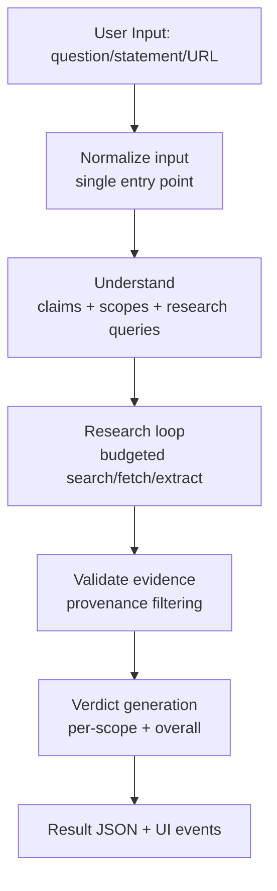

# FactHarbor Pipeline — Current Architecture & Design (Post Redesign)

**Last Updated**: 2026-01-17  
**Purpose**: Describe the pipeline as it exists today: stages, key modules, data contracts, configuration, guarantees, and known limitations.  
**History / decisions**: `Docs/DEVELOPMENT/Pipeline_Redesign_History.md`

---

## 1) High-level architecture

FactHarbor’s core analysis pipeline runs in the Next.js app (`apps/web`) and is orchestrated in TypeScript.

### Architecture overview (diagram)

---

## 2) Stage breakdown (Understand → Research → Verdict)

### 2.1 Understand
**Goal**: Convert input into a stable analysis plan:
- claim understanding (thesis + sub-claims)
- scope detection (distinct proceedings/scopes)
- research queries and priorities

**Primary file**: `apps/web/src/lib/analyzer.ts`

**Key design points**:
- Input normalization is performed once at the analysis entry point for neutrality.
- Multi-scope detection is preserved; scopes are canonicalized.
- Gate1-lite is applied as a minimal **budget-protection** pre-filter (protects central claims; should not remove claims just because they are evaluative/opinion-like).

### 2.2 Research
**Goal**: Gather evidence under strict budgets with deterministic fallbacks.

**Primary files**:
- `apps/web/src/lib/analyzer.ts` (research loop + orchestration)
- `apps/web/src/lib/web-search.ts` (external search providers)
- `apps/web/src/lib/search-gemini-grounded.ts` (grounded-mode URL candidate discovery)
- `apps/web/src/lib/retrieval.ts` (fetch and parse, including PDFs)

**Budgeting**:
- Budget config/tracker: `apps/web/src/lib/analyzer/budgets.ts`
- Global iteration cap is enforced to prevent runaway research.
- Token accounting exists but may be partial depending on call site coverage.

**Search modes**:
- `FH_SEARCH_MODE=standard`: standard external provider search
- `FH_SEARCH_MODE=grounded`: attempts grounded search (only proceeds when grounding metadata + URLs exist; otherwise falls back)

### 2.3 Validate (Ground Realism)
**Goal**: Prevent synthetic evidence from entering verdicting.

**Primary file**: `apps/web/src/lib/analyzer/provenance-validation.ts`

**Rules** (high-level):
- facts must have a real HTTP(S) `sourceUrl`
- facts must have a non-trivial `sourceExcerpt`
- facts that look synthetic are rejected (fail-closed)

### 2.4 Verdict
**Goal**: Produce per-claim and per-scope verdicts, plus an overall verdict, using only validated evidence.

**Primary file**: `apps/web/src/lib/analyzer.ts`

**Key governance**:
- `CTX_UNSCOPED` is display-only and excluded from verdict calculations.
- Truth percentages are clamped to [0, 100] defensively.

---

## 3) Core data contracts (conceptual)

- **Scope / Proceeding**: a bounded analytical frame (“Scope” is the unified terminology).
- **Claim**: an assertion with role/centrality, thesis relevance, and (optionally) related scope.
- **ExtractedFact**: a structured evidence atom with provenance fields linking to a fetched source.
- **FetchedSource**: a retrieved document with URL, title, text, and reliability signals.

These structures must remain provider-agnostic and topic-agnostic (“generic by design”).

---

## 4) Configuration (selected environment variables)

This list is intentionally derived from code (`process.env`) usage, not planning documents.

### Search / research
- `FH_SEARCH_ENABLED` (default true)
- `FH_SEARCH_MODE` (`standard` | `grounded`)
- `FH_SEARCH_PROVIDER` (`auto` or explicit provider)
- `FH_SEARCH_DATE_RESTRICT` (optional recency restriction)
- `FH_SEARCH_DOMAIN_WHITELIST` (optional)

### Determinism and modes
- `FH_DETERMINISTIC` (default true)
- `FH_ANALYSIS_MODE` (`quick` | `deep`)
- `FH_REPORT_STYLE` (`standard`, etc.)
- `FH_ALLOW_MODEL_KNOWLEDGE` (default false)

### Budgets (p95 hardening)
- `FH_MAX_ITERATIONS_PER_SCOPE`
- `FH_MAX_TOTAL_ITERATIONS`
- `FH_MAX_TOTAL_TOKENS`
- `FH_MAX_TOKENS_PER_CALL`
- `FH_ENFORCE_BUDGETS`

### Provenance validation
- `FH_PROVENANCE_VALIDATION_ENABLED` (default true)

---

## 5) Testing and regression gates

Key regression tests live in `apps/web/src/lib`:
- `input-neutrality.test.ts` (Q/S divergence target ≤ 4 points avg absolute)
- `analyzer/scope-preservation.test.ts` (scope retention)
- `analyzer/adversarial-scope-leak.test.ts` (scope isolation; ambiguous evidence handling)
- `analyzer/budgets.test.ts` (budget semantics)

---

## 6) Known limitations and roadmap (design-level)

- **True provider grounding**: Some providers/SDKs may not expose grounding metadata reliably. Grounded mode must remain fail-closed.
- **Token accounting**: iteration budgeting is enforced; token caps may require additional instrumentation for complete governance.
- **Operational kill-switches**: if additional “force fallback” flags are desired, they must be implemented in code and tested (docs should not lead).

