# FactHarbor Analysis — Triple-Path Pipeline Architecture (Desired)

**Last Updated**: 2026-01-20  
**Version**: 2.6.33  
**Audience**: Senior Architects, Lead Developers, Reviewers  
**Purpose**: Define the **desired end-state architecture** supporting **three user-selectable analysis variants** with maximum reuse of stable primitives and minimal added complexity/risk to the current path.

---

## 1) Scope and non-negotiable invariants

This architecture must preserve repo governance (see `AGENTS.md`):
- **Pipeline integrity**: Understand → Research → Verdict (no stage skipping)
- **Input neutrality**: question vs statement divergence target **≤ 4 points** (avg absolute)
- **Scope detection**: multi-scope detection with unified “Scope” terminology
- **Quality gates**: Gate 1 and Gate 4 are mandatory
- **Generic by design**: no domain-specific hardcoding/keyword lists

Ground Realism invariants:
- **No synthetic evidence**: verdict evidence must be attributable to fetched sources with real URLs + excerpts
- **Fail closed**: if provenance is missing/invalid, the pipeline must degrade confidence or fall back (never hallucinate)

---

## 2) The three selectable variants (desired behavior)

### 2.1 `OrchestratedPipeline` (default)
- Current TypeScript-orchestrated staged pipeline.
- Produces the **canonical result schema** used by the existing jobs UI.

### 2.2 `MonolithicToolLoop_CanonicalSchema`
- A monolithic “tool-loop” (the LLM can decide when to call search/fetch tools).
- **Must** still produce the **canonical result schema** and use the existing jobs UI.
- **Must** run with strict budgets (max steps, max sources, max tokens) and **fail closed**:
  - On schema/semantic validation failure → fall back to `OrchestratedPipeline` for the job (or mark failed; see policy in migration plan).
  - On provenance violations → either drop evidence / reduce confidence, or fail closed (never accept synthetic evidence).

### 2.3 `MonolithicToolLoop_DynamicSchema`
- A monolithic tool-loop that may produce a **dynamic, LLM-defined structure**.
- UI must render a **separate “dynamic result viewer”** (not the canonical result renderer).
- Must still meet a **minimum dynamic safety contract** (see §4).

---

## 3) Balanced architecture: reuse without side effects

### 3.1 Guiding principle
Share only **stable infrastructure primitives** across pipelines; keep orchestration logic isolated to prevent regressions in the current path.

### 3.2 Shared primitives (allowed to unify)
All three variants reuse:
- **Normalization**: one canonical normalization contract at entry
- **Budgets/Caps**: common budget model for:
  - tool-loop steps (for monolithic)
  - research iterations/sources (for orchestrated)
  - total tokens (where available)
- **Search + fetch adapters**: provider-agnostic search and a fetch/parse layer
- **Provenance validation**: shared provenance requirements and filtering
- **Result envelope metadata**: uniform metadata captured for auditability and evaluation

### 3.3 Shared Analyzer Modules (v2.8)

```mermaid
flowchart TD
    subgraph SharedModules["📦 Shared Modules (apps/web/src/lib/analyzer/)"]
        SCOPES[scopes.ts<br/>â”â”â”â”â”â”â”â”â”â”â”â”â”<br/>• detectScopes<br/>• formatDetectedScopesHint<br/>• canonicalizeScopes]
        AGG[aggregation.ts<br/>â”â”â”â”â”â”â”â”â”â”â”â”â”<br/>• calculateWeightedVerdictAverage<br/>• validateContestation<br/>• detectClaimContestation<br/>• detectHarmPotential]
        CLAIM[claim-decomposition.ts<br/>â”â”â”â”â”â”â”â”â”â”â”â”â”<br/>• normalizeClaimText<br/>• deriveCandidateClaimTexts]
    end

    subgraph Pipelines["🔄 Pipeline Implementations"]
        ORCH[orchestrated.ts]
        CANON[monolithic-canonical.ts]
        DYN[monolithic-dynamic.ts]
    end

    SCOPES --> ORCH
    SCOPES --> CANON
    AGG --> ORCH
    AGG --> CANON
    CLAIM --> ORCH
    CLAIM --> CANON
```

**Module Responsibilities:**

| Module | Canonical | Orchestrated | Purpose |
|--------|-----------|--------------|---------|
| `scopes.ts` | ✅ | ✅ | Heuristic scope pre-detection before LLM |
| `aggregation.ts` | ✅ | ✅ | Verdict weighting, contestation validation |
| `claim-decomposition.ts` | ✅ | ✅ | Claim text parsing and normalization |

### 3.4 Isolated components (do not unify)
Keep separate to avoid coupling:
- Orchestrated pipeline orchestration logic (existing `apps/web/src/lib/analyzer.ts`)
- Monolithic tool-loop orchestration logic (new module)
- Canonical result UI (existing jobs page) vs dynamic viewer (new section)

---

## 4) Result model: one envelope, two payload types

### 4.1 Result envelope (common)
Every job result must include an envelope (even if the inner payload differs):
- `pipelineVariant`: `"orchestrated" | "monolithic_canonical" | "monolithic_dynamic"`
- `pipelineVersion`: string (schema version / build info)
- `budgets`: configured caps (iterations, maxSteps, maxSources, tokens)
- `budgetStats`: observed usage (iterations, steps, sources fetched, tokens if available)
- `warnings`: list of warnings (e.g., fallback happened, provenance rejections)
- `providerInfo`: model/provider identifiers used

### 4.2 Canonical payload (existing UI)
For `orchestrated` and `monolithic_canonical`, the payload must match the canonical entity model that the existing jobs UI expects (claim verdicts, verdict summary, proceeding answers, etc).

### 4.3 Dynamic payload (minimum safety contract)
For `monolithic_dynamic`, allow flexible structure but require:
- `rawJson`: the model’s full JSON output (required)
- `citations`: array (required) with at least:
  - `url` (HTTP(S) only)
  - `excerpt` (non-trivial)
  - `title` (optional but recommended)
- `narrativeMarkdown`: optional human-readable explanation
- `toolTrace`: optional tool-call trace (queries, fetched URLs, timestamps)

This contract is intentionally minimal, but it anchors Ground Realism and enables auditing.

---

## 5) Variant selection model (UI + persistence)

### 5.1 Per-job selection is mandatory
**The selected variant must be persisted on the job at creation time**, so results are reproducible and not affected by later config changes.

### 5.2 Global default (optional)
A global default variant may be stored (e.g., in `apps/api`) to prefill the UI. But the runner must always prefer `job.pipelineVariant`.

---

## 6) System architecture overview (diagram)

---

## 7) Risks and mitigations (architecture-level)

### 7.1 Complexity creep
- **Risk**: three variants can explode configuration and branching.
- **Mitigation**: single dispatcher + strict shared-primitive boundary; no cross-calls between orchestration implementations.

### 7.2 Current-path regressions
- **Risk**: refactoring shared primitives can inadvertently change orchestrated behavior.
- **Mitigation**: phase unifications behind thin wrappers; add contract tests; keep orchestrated pipeline logic untouched unless low-risk.

### 7.3 Dynamic output safety
- **Risk**: dynamic payload could omit evidence or mislead users.
- **Mitigation**: enforce minimum dynamic safety contract; UI labels as experimental; show citations prominently.

### 7.4 Cost/latency tail risk for monolithic tool-loop
- **Risk**: uncontrolled tool loops cause runaway cost and p95 blowups.
- **Mitigation**: maxSteps + maxSources + timeouts + budget exceeded behavior; record budget stats in envelope.

### 7.5 Security/abuse risk (user-selectable variants)
- **Risk**: users can pick experimental path and consume higher resources.
- **Mitigation**: enforce budgets; optionally gate variants later (not in scope now).

