# FactHarbor Analysis — Triple-Path Pipeline Architecture (Implemented)

**Last Updated**: 2026-02-03
**Version**: 2.6.41
**Status**: Implemented (v2.6.38)
**Audience**: Senior Architects, Lead Developers, Reviewers
**Purpose**: Documents the **implemented architecture** supporting **three user-selectable analysis variants** with maximum reuse of stable primitives and minimal added complexity/risk to the current path.

---

## 1) Context and non-negotiable invariants

This architecture must preserve repo governance (see `AGENTS.md`):
- **Pipeline integrity**: Understand → Research → Verdict (no stage skipping)
- **Input neutrality**: question vs statement divergence target **≤ 4 points** (avg absolute)
- **Context detection**: multi-context detection with unified "Context" terminology (see [Context Detection Guide](Context_and_EvidenceScope_Detection_Guide.md))
- **Quality gates**: Gate 1 and Gate 4 are mandatory (see [Quality Gates Reference](Quality_Gates_Reference.md))
- **Generic by design**: no domain-specific hardcoding/keyword lists

Ground Realism invariants:
- **No synthetic evidence**: verdict evidence must be attributable to fetched sources with real URLs + excerpts
- **Fail closed**: if provenance is missing/invalid, the pipeline must degrade confidence or fall back (never hallucinate)

---

## 2) The three selectable variants (implemented)

### 2.1 `OrchestratedPipeline` (default)
- Current TypeScript-orchestrated staged pipeline.
- Produces the **canonical result schema** used by the existing jobs UI.

### 2.2 `MonolithicToolLoop_CanonicalSchema`
- A monolithic “tool-loop” (the LLM can decide when to call search/fetch tools).
- **Must** still produce the **canonical result schema** and use the existing jobs UI.
- **Must** run with strict budgets (max steps, max sources, max tokens) and **fail closed**:
  - On schema/semantic validation failure → fall back to `OrchestratedPipeline` for the job (or mark failed; see policy in migration plan).
  - On provenance violations → either drop evidence / reduce confidence, or fail closed (never accept synthetic evidence).

### 2.3 `MonolithicToolLoop_DynamicSchema`
- A monolithic tool-loop that may produce a **dynamic, LLM-defined structure**.
- UI must render a **separate “dynamic result viewer”** (not the canonical result renderer).
- Must still meet a **minimum dynamic safety contract** (see §4).

---

## 3) Pipeline Selection Decision Guide

### 3.1 Overview

This section helps you choose the appropriate pipeline variant for your use case.

**Default Recommendation**: Start with `OrchestratedPipeline` (the default). It provides the most reliable results with full quality gate enforcement and comprehensive result schema.

### 3.2 Decision Tree

```mermaid
flowchart TD
    START{What is your goal?}

    START -->|Production fact-checking| PROD
    START -->|Experimentation/Research| EXP

    PROD{Need canonical<br/>result schema?}
    PROD -->|Yes - UI compatibility| ORCH[Use OrchestratedPipeline<br/>✅ Default choice]
    PROD -->|Flexible structure OK| CANON[Consider Monolithic Canonical<br/>⚠️ Experimental]

    EXP{Want LLM-driven<br/>result structure?}
    EXP -->|Yes - custom format| DYN[Use Monolithic Dynamic<br/>⚠️ Highly experimental]
    EXP -->|No - standard format| CANON

    style ORCH fill:#c8e6c9
    style CANON fill:#fff9c4
    style DYN fill:#ffcdd2
```



### 3.3 Variant Comparison

| Criterion | Orchestrated | Monolithic Canonical | Monolithic Dynamic |
|-----------|-------------|---------------------|-------------------|
| **Maturity** | ✅ Production-ready | ⚠️ Experimental | ⚠️ Highly experimental |
| **Result Schema** | Canonical (stable) | Canonical (stable) | Dynamic (flexible) |
| **UI Compatibility** | ✅ Full support | ✅ Full support | ⚠️ Separate viewer needed |
| **Quality Gates** | ✅ Gate 1 + Gate 4 | ✅ Gate 1 + Gate 4 | ⚠️ Minimum safety contract |
| **Pipeline Stages** | Fixed (AKEL) | Tool-loop | Tool-loop |
| **Provenance** | ✅ Strict | ✅ Strict | ⚠️ Minimum requirements |
| **Budget Control** | ✅ Iterations/sources | ✅ maxSteps/sources | ✅ maxSteps/sources |
| **Cost Predictability** | ✅ High | ⚠️ Medium | ⚠️ Low |
| **Latency** | ~2-5 min | ~1-4 min | ~1-4 min |
| **Use Case** | Production | Research | Experimentation |

### 3.4 When to Use Each Variant

#### 3.4.1 OrchestratedPipeline (Default)

**Use when**:
- Running production fact-checking workloads
- Need reproducible, auditable results
- Want full UI feature support (claims, contexts, verdicts)
- Require strict quality gate enforcement
- Budget predictability is important

**Characteristics**:
- Fixed AKEL pipeline (Understand → Research → Verdict)
- TypeScript-orchestrated staged execution
- Produces canonical result schema
- All existing UI features work

**Example Use Cases**:
- Public-facing fact-checking service
- Regulatory compliance verification
- Editorial fact-checking workflows
- Long-term result archiving

#### 3.4.2 MonolithicToolLoop_CanonicalSchema

**Use when**:
- Researching LLM-driven analysis patterns
- Comparing monolithic vs orchestrated approaches
- Still need canonical result schema for UI compatibility
- Willing to accept experimental status

**Characteristics**:
- LLM decides when to call search/fetch tools
- Must produce canonical result schema
- Strict budgets (maxSteps, maxSources, tokens)
- Fail-closed on validation errors

**Example Use Cases**:
- A/B testing pipeline approaches
- Prompt engineering research
- Performance optimization experiments
- Evaluating agentic patterns

#### 3.4.3 MonolithicToolLoop_DynamicSchema

**Use when**:
- Exploring novel result structures
- LLM-defined analysis formats
- Research projects without UI constraints
- Maximum flexibility needed

**Characteristics**:
- LLM can define custom result structure
- Minimum safety contract (citations required)
- Separate dynamic result viewer needed
- Highly experimental

**Example Use Cases**:
- Novel analysis format research
- Custom report generation experiments
- Non-standard fact-checking workflows
- Prototype development

### 3.5 Migration Path

**Starting Out**:
1. Use `OrchestratedPipeline` for all production work
2. Configure via UCM (Admin → Config → Pipeline)
3. Monitor results and costs

**Experimenting**:
1. Create test jobs with `MonolithicToolLoop_CanonicalSchema`
2. Compare results with orchestrated baseline
3. Evaluate cost, latency, and quality trade-offs

**Advanced Research**:
1. Use `MonolithicToolLoop_DynamicSchema` for format experimentation
2. Build custom result viewers for dynamic payload
3. Document findings and propose improvements

### 3.6 Configuration

**Pipeline Selection** (UCM Pipeline Config):
```json
{
  "defaultPipelineVariant": "orchestrated",  // Global default
  "allowedVariants": [
    "orchestrated",
    "monolithic_canonical",
    "monolithic_dynamic"
  ]
}
```

**Per-Job Selection** (API):
```json
POST /api/fh/jobs
{
  "inputType": "text",
  "inputValue": "...",
  "pipelineVariant": "orchestrated"  // Overrides default
}
```

**Note**: Per-job selection is persisted with the job, ensuring reproducibility even if defaults change later.

### 3.7 Fallback Behavior

**MonolithicToolLoop_CanonicalSchema Fallback**:
- On schema/semantic validation failure → Fall back to `OrchestratedPipeline`
- On provenance violations → Drop evidence or fail closed
- On budget exceeded → Mark job as failed with budget stats

**MonolithicToolLoop_DynamicSchema Fallback**:
- On citation missing → Reject result, require minimum contract
- On budget exceeded → Mark job as failed with budget stats
- On timeout → Return partial results with warning

### 3.8 Performance Characteristics

**Typical Analysis Time** (5-10 claim article):

| Variant | p50 | p95 | Cost (est.) |
|---------|-----|-----|-------------|
| **Orchestrated** | 2-3 min | 5-7 min | $0.15-0.30 |
| **Monolithic Canonical** | 1.5-2.5 min | 4-8 min | $0.12-0.40 |
| **Monolithic Dynamic** | 1-2 min | 3-10 min | $0.10-0.50 |

**Notes**:
- Orchestrated has predictable costs due to fixed pipeline structure
- Monolithic variants have higher p95 due to tool-loop variability
- Budget limits prevent runaway costs in monolithic variants

---

## 4) Balanced architecture: reuse without side effects

### 3.1 Guiding principle
Share only **stable infrastructure primitives** across pipelines; keep orchestration logic isolated to prevent regressions in the current path.

### 3.2 Shared primitives (allowed to unify)
All three variants reuse:
- **Normalization**: one canonical normalization contract at entry
- **Budgets/Caps**: common budget model for:
  - tool-loop steps (for monolithic)
  - research iterations/sources (for orchestrated)
  - total tokens (where available)
- **Search + fetch adapters**: provider-agnostic search and a fetch/parse layer
- **Provenance validation**: shared provenance requirements and filtering
- **Result envelope metadata**: uniform metadata captured for auditability and evaluation

### 3.3 Shared Analyzer Modules (v2.8)

```mermaid
flowchart TD
    subgraph SharedModules["📦 Shared Modules (apps/web/src/lib/analyzer/)"]
        SCOPES[scopes.ts<br/>━━━━━━━━━━━━━<br/>• detectScopes<br/>• formatDetectedScopesHint<br/>• canonicalizeScopes]
        AGG[aggregation.ts<br/>━━━━━━━━━━━━━<br/>• calculateWeightedVerdictAverage<br/>• validateContestation<br/>• detectClaimContestation<br/>• detectHarmPotential]
        CLAIM[claim-decomposition.ts<br/>━━━━━━━━━━━━━<br/>• normalizeClaimText<br/>• deriveCandidateClaimTexts]
    end

    subgraph Pipelines["🔄 Pipeline Implementations"]
        ORCH[orchestrated.ts]
        CANON[monolithic-canonical.ts]
        DYN[monolithic-dynamic.ts]
    end

    SCOPES --> ORCH
    SCOPES --> CANON
    AGG --> ORCH
    AGG --> CANON
    CLAIM --> ORCH
    CLAIM --> CANON
```



**Module Responsibilities:**
### 3.4 Text Analysis Service (v2.9+)

LLM-only text analysis (no heuristic fallback). See [LLM Text Analysis Pipeline Deep Analysis](../ARCHIVE/REVIEWS/LLM_Text_Analysis_Pipeline_Deep_Analysis.md) for full specification.

```mermaid
flowchart TD
    subgraph TextAnalysisService["🧠 Text Analysis Service (apps/web/src/lib/analyzer/")]
        TYPES[text-analysis-types.ts<br/>━━━━━━━━━━━━━<br/>• ITextAnalysisService<br/>• InputClassificationResult<br/>• EvidenceQualityResult<br/>• ContextSimilarityResult (legacy: ScopeSimilarityResult)<br/>• VerdictValidationResult]

        SERVICE[text-analysis-service.ts<br/>━━━━━━━━━━━━━<br/>• getTextAnalysisService<br/>• recordMetrics]

        LLM[text-analysis-llm.ts<br/>━━━━━━━━━━━━━<br/>• LLMTextAnalysisService<br/>• Zod schema validation<br/>• JSON repair<br/>• Retry logic]
    end

    TYPES --> SERVICE
    TYPES --> LLM
    SERVICE --> LLM

    subgraph Pipelines["🔄 All Pipelines"]
        ORCH2[orchestrated.ts]
        CANON2[monolithic-canonical.ts]
        DYN2[monolithic-dynamic.ts]
    end

    LLM --> ORCH2
    LLM --> CANON2
    LLM --> DYN2
```

**Analysis Points:**

| Analysis Point | Pipeline Phase | Purpose |
|----------------|----------------|---------|
| Input Classification | Understand | Decompose claims, detect comparative/compound |
| Evidence Quality | Research | Filter low-quality evidence, assess probative value |
| Context Similarity | Organize | Merge similar contexts, infer phase buckets |
| Verdict Validation | Aggregate | Detect inversions, harm potential, contestation |

### 3.5 Isolated components (do not unify)
Keep separate to avoid coupling:
- Orchestrated pipeline orchestration logic (existing `apps/web/src/lib/analyzer.ts`)
- Monolithic tool-loop orchestration logic (new module)
- Canonical result UI (existing jobs page) vs dynamic viewer (new section)

---

## 5) Result model: one envelope, two payload types

### 5.1 Result envelope (common)
Every job result must include an envelope (even if the inner payload differs):
- `pipelineVariant`: `"orchestrated" | "monolithic_canonical" | "monolithic_dynamic"`
- `pipelineVersion`: string (schema version / build info)
- `budgets`: configured caps (iterations, maxSteps, maxSources, tokens)
- `budgetStats`: observed usage (iterations, steps, sources fetched, tokens if available)
- `warnings`: list of warnings (e.g., fallback happened, provenance rejections)
- `providerInfo`: model/provider identifiers used

### 5.2 Canonical payload (existing UI)
For `orchestrated` and `monolithic_canonical`, the payload must match the canonical entity model that the existing jobs UI expects (claim verdicts, verdict summary, proceeding answers, etc).

### 5.3 Dynamic payload (minimum safety contract)
For `monolithic_dynamic`, allow flexible structure but require:
- `rawJson`: the model’s full JSON output (required)
- `citations`: array (required) with at least:
  - `url` (HTTP(S) only)
  - `excerpt` (non-trivial)
  - `title` (optional but recommended)
- `narrativeMarkdown`: optional human-readable explanation
- `toolTrace`: optional tool-call trace (queries, fetched URLs, timestamps)

This contract is intentionally minimal, but it anchors Ground Realism and enables auditing.

---

## 6) Variant selection model (UI + persistence)

### 6.1 Per-job selection is mandatory
**The selected variant must be persisted on the job at creation time**, so results are reproducible and not affected by later config changes.

### 6.2 Global default (optional)
A global default variant may be stored (e.g., in `apps/api`) to prefill the UI. But the runner must always prefer `job.pipelineVariant`.

---

## 7) System architecture overview (diagram)


---

## 8) Risks and mitigations (architecture-level)

### 8.1 Complexity creep
- **Risk**: three variants can explode configuration and branching.
- **Mitigation**: single dispatcher + strict shared-primitive boundary; no cross-calls between orchestration implementations.

### 8.2 Current-path regressions
- **Risk**: refactoring shared primitives can inadvertently change orchestrated behavior.
- **Mitigation**: phase unifications behind thin wrappers; add contract tests; keep orchestrated pipeline logic untouched unless low-risk.

### 8.3 Dynamic output safety
- **Risk**: dynamic payload could omit evidence or mislead users.
- **Mitigation**: enforce minimum dynamic safety contract; UI labels as experimental; show citations prominently.

### 8.4 Cost/latency tail risk for monolithic tool-loop
- **Risk**: uncontrolled tool loops cause runaway cost and p95 blowups.
- **Mitigation**: maxSteps + maxSources + timeouts + budget exceeded behavior; record budget stats in envelope.

### 8.5 Security/abuse risk (user-selectable variants)
- **Risk**: users can pick experimental path and consume higher resources.
- **Mitigation**: enforce budgets; optionally gate variants later (not in context now).

---

## 9) Search Provider Requirements

### 9.1 All pipelines require search credentials for web search

All three pipelines (Orchestrated, Monolithic Canonical, Monolithic Dynamic) use the same `searchWebWithProvider()` function from `apps/web/src/lib/web-search.ts`. This function requires at least one of:

| Provider | Environment Variables | Notes |
|----------|----------------------|-------|
| **SerpAPI** | `SERPAPI_API_KEY` | Pay-per-use (~$0.002/search) |
| **Google CSE** | `GOOGLE_CSE_API_KEY` + `GOOGLE_CSE_ID` | Free tier: 100 queries/day |

### 9.2 Behavior without search credentials

When no search provider is configured:
1. Pipeline generates search queries (correctly)
2. Search loop executes but returns empty results
3. Analysis continues **without external sources**
4. LLM uses only internal knowledge (if `FH_ALLOW_MODEL_KNOWLEDGE=true`)

**Symptom**: Job completes successfully but shows "No sources were fetched."

### 9.3 Verification

Check server logs for:
```
# Success:
[Search] Available providers: Google CSE=true, SerpAPI=true
[Search] Google CSE returned 4 results, total now: 4

# Failure:
[Search] ❌ NO SEARCH PROVIDERS CONFIGURED! Set SERPAPI_API_KEY or GOOGLE_CSE_API_KEY+GOOGLE_CSE_ID
```

### 9.4 Configuration

See [LLM Configuration Guide](../USER_GUIDES/LLM_Configuration.md#search-provider-configuration) for detailed setup instructions.


