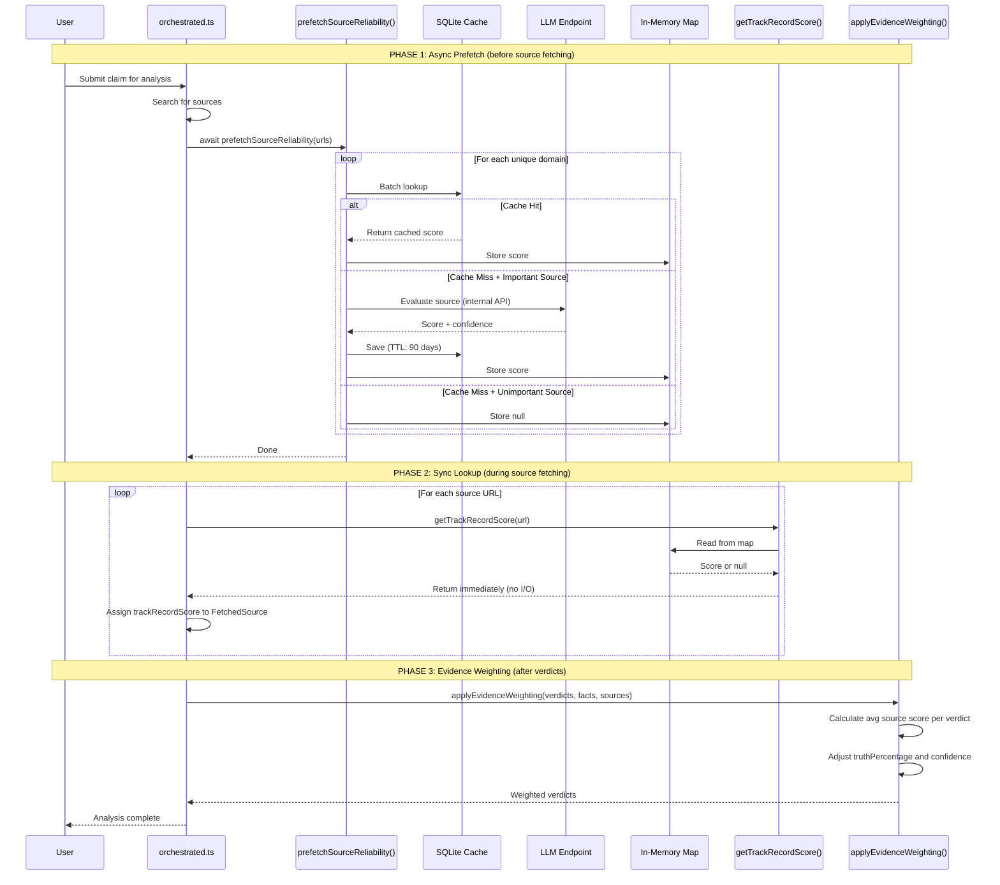

# FactHarbor Source Reliability

**Version**: 1.0 (Implemented)  
**Status**: Operational  
**Last Updated**: 2026-01-21

---

## Table of Contents

- [Overview](#overview)
- [Quick Start](#quick-start)
- [Architecture](#architecture)
- [How It Affects Verdicts](#how-it-affects-verdicts)
- [Configuration](#configuration)
- [Score Interpretation](#score-interpretation)
- [Admin Interface](#admin-interface)
- [Design Principles](#design-principles)
- [Implementation Details](#implementation-details)
- [Cost & Performance](#cost--performance)
- [Troubleshooting](#troubleshooting)
- [Test Coverage](#test-coverage)

---

## Overview

FactHarbor evaluates source reliability dynamically using LLM-powered assessment with multi-model consensus. Sources are evaluated on-demand and cached for 90 days.

| Aspect | Implementation |
|--------|----------------|
| **Evaluation** | Multi-model LLM consensus (Claude + GPT-4) |
| **Storage** | SQLite cache (`source-reliability.db`) |
| **Integration** | Batch prefetch + sync lookup |
| **Cost Control** | Importance filter + rate limiting |
| **Verdict Impact** | Evidence weighting adjusts truth percentages |

---

## Quick Start

### Prerequisites

```powershell
# In apps/web/.env.local
ANTHROPIC_API_KEY=sk-ant-...
OPENAI_API_KEY=sk-...
FH_INTERNAL_RUNNER_KEY=your-secret-key-here
```

### That's It

The service is **enabled by default**. It will automatically:
- Prefetch source reliability before analyzing sources
- Use multi-model consensus (Claude + GPT-4)
- Cache results for 90 days
- Skip blog platforms and spam TLDs
- Apply evidence weighting to verdicts

### Verify It's Working

Run an analysis and check the logs for:
```
[SR] Prefetching 5 unique domains
[SR] Cache hits: 0/5
[SR] Evaluated reuters.com: score=0.95, confidence=0.92
```

---

## Architecture

### System Overview

```mermaid
flowchart TB
    subgraph analysis [FactHarbor Analysis Pipeline]
        AN[orchestrated.ts<br/>Analyzer]
        PF[prefetchSourceReliability<br/>Batch Prefetch]
        SR[source-reliability.ts<br/>Sync Lookup + Weighting]
    end
    
    subgraph cache [Source Reliability Cache]
        SQLITE[(SQLite<br/>source-reliability.db)]
        MAP[In-Memory Map<br/>prefetchedScores]
    end
    
    subgraph evaluation [LLM Evaluation - Internal Only]
        EVAL[/api/internal/evaluate-source]
        LLM1[Claude<br/>claude-3-haiku]
        LLM2[GPT-4<br/>gpt-4o-mini]
        CONS{Consensus<br/>Check}
    end
    
    AN -->|1. Extract URLs| PF
    PF -->|2. Batch lookup| SQLITE
    SQLITE -->|3. Cache hits| MAP
    PF -->|4. Cache miss| EVAL
    EVAL --> LLM1
    EVAL --> LLM2
    LLM1 --> CONS
    LLM2 --> CONS
    CONS -->|5. Store score| SQLITE
    CONS -->|6. Populate| MAP
    AN -->|7. Sync lookup| SR
    SR -->|8. Read from| MAP
    SR -->|9. Apply to| VERDICTS[Verdict Weighting]
```

### Integration Pattern: Batch Prefetch + Sync Lookup

The Source Reliability system uses a **two-phase pattern** to avoid async operations in the analyzer's hot path.

#### The Problem

The FactHarbor analyzer (`orchestrated.ts`) is a complex synchronous pipeline. Adding `await` calls mid-pipeline for source reliability lookups would:
- Require major refactoring (ripple async throughout call chain)
- Complicate error handling and control flow
- Risk introducing race conditions

#### The Solution: Two-Phase Pattern

Separate the async work (cache lookup, LLM calls) from the sync analysis:

| Phase | When | Nature | What It Does |
|-------|------|--------|--------------|
| **Phase 1: Prefetch** | Before analysis starts | Async | Batch lookup all source URLs, populate in-memory map |
| **Phase 2: Lookup** | During analysis | Sync | Read from pre-populated map (instant, no I/O) |
| **Phase 3: Weighting** | After verdicts generated | Sync | Adjust truth percentages based on source scores |



### Phase 1 Detail: Prefetch Flow


### Why This Pattern Works

| Concern | How Pattern Addresses It |
|---------|-------------------------|
| **No async ripple** | Only ONE `await` at pipeline boundary, rest stays sync |
| **Batch efficiency** | Single batch cache lookup instead of N individual calls |
| **LLM cost control** | Filter + rate limit applied during prefetch |
| **Graceful degradation** | Unknown sources get `null`, analysis continues |
| **No blocking** | Sync lookups are instant map reads |

---

## How It Affects Verdicts

Source reliability scores directly influence verdict calculations through **evidence weighting**.

### Formula

```
adjustedTruth = 50 + (originalTruth - 50) × avgSourceScore
adjustedConfidence = confidence × (0.5 + avgSourceScore / 2)
```

### Effect on Verdicts

| Source Reliability | Effect on Verdict |
|-------------------|-------------------|
| **High (0.9)** | Truth stays close to original (±5%) |
| **Medium (0.7)** | Truth pulled toward neutral (±15%) |
| **Low (0.3)** | Truth pulled strongly toward neutral (±35%) |
| **Unknown (null)** | Verdict unchanged |

### Example

```
Original verdict: 80% (Strong True)
Source reliability: 0.5 (Mixed)

Adjusted = 50 + (80 - 50) × 0.5
         = 50 + 30 × 0.5
         = 50 + 15
         = 65% (Leaning True)
```

### Multi-Source Averaging

When a verdict has evidence from multiple sources:

```
Verdict with facts from:
  - reuters.com (score: 0.95)
  - bbc.com (score: 0.88)
  
Average score = (0.95 + 0.88) / 2 = 0.915
```

---

## Configuration

All configuration is via environment variables (`apps/web/.env.local`):

### Core Settings

| Variable | Default | Description |
|----------|---------|-------------|
| `FH_SR_ENABLED` | `true` | Enable/disable source reliability |
| `FH_SR_MULTI_MODEL` | `true` | Use multi-model consensus |
| `FH_SR_CONFIDENCE_THRESHOLD` | `0.8` | Min LLM confidence to accept score |
| `FH_SR_CONSENSUS_THRESHOLD` | `0.15` | Max score difference between models |

### Cache Settings

| Variable | Default | Description |
|----------|---------|-------------|
| `FH_SR_CACHE_PATH` | `./source-reliability.db` | SQLite database location |
| `FH_SR_CACHE_TTL_DAYS` | `90` | Cache expiration in days |

### Rate Limiting

| Variable | Default | Description |
|----------|---------|-------------|
| `FH_SR_RATE_LIMIT_PER_IP` | `10` | Max evaluations per minute per IP |
| `FH_SR_RATE_LIMIT_DOMAIN_COOLDOWN` | `60` | Seconds between same-domain evals |

### Importance Filter

| Variable | Default | Description |
|----------|---------|-------------|
| `FH_SR_FILTER_ENABLED` | `true` | Enable importance filter |
| `FH_SR_SKIP_PLATFORMS` | *(see below)* | Platforms to skip (comma-separated) |
| `FH_SR_SKIP_TLDS` | *(see below)* | TLDs to skip (comma-separated) |

**Default skip platforms**: `blogspot.,wordpress.com,medium.com,substack.com,tumblr.com,wix.com,weebly.com,squarespace.com,ghost.io,blogger.com,sites.google.com,github.io,netlify.app,vercel.app,herokuapp.com`

**Default skip TLDs**: `xyz,top,club,icu,buzz,tk,ml,ga,cf,gq,work,click,link,win,download,stream`

### Example Configurations

```bash
# Disable multi-model (faster, cheaper)
FH_SR_MULTI_MODEL=false

# Lower confidence threshold
FH_SR_CONFIDENCE_THRESHOLD=0.7

# Evaluate ALL sources (disable filter)
FH_SR_FILTER_ENABLED=false

# Add custom platforms to skip
FH_SR_SKIP_PLATFORMS=blogspot.,wordpress.com,medium.com,custom-blog.com
```

---

## Score Interpretation

| Score | Rating | Examples |
|-------|--------|----------|
| 0.90-0.99 | Very High | Reuters, AP, FactCheck.org |
| 0.80-0.89 | High | BBC, NPR, Economist |
| 0.70-0.79 | Mostly Factual | Generally reliable with occasional issues |
| 0.50-0.69 | Mixed | Verify claims independently |
| 0.30-0.49 | Low | Frequently misleading |
| 0.05-0.29 | Very Low | Conspiracy, fake news |

---

## Admin Interface

Access the Source Reliability admin page at: `/admin/source-reliability`

### Features

- **Cache Statistics**: Total entries, average scores, expired count
- **Paginated Table**: View all cached scores with sorting
- **Cleanup**: Remove expired entries
- **Authentication**: Requires `FH_ADMIN_KEY` in production

### Admin Tasks (~15 min/week)

| Task | Time | Frequency |
|------|------|-----------|
| Check LLM cost dashboard | 5 min | Weekly |
| Spot-check 2-3 recent scores | 8 min | Weekly |
| Review any flagged issues | 2 min | Weekly |

---

## Design Principles

### Evidence Over Authority

Source credibility is **supplementary**, not primary:

- Only evidence and counter-evidence matter - not who says it
- Authority does NOT automatically give weight
- A low-credibility source with documented evidence should be considered
- A high-credibility source making unsupported claims should be questioned

### No Pre-seeded Data

All sources are evaluated identically by LLM:
- No hardcoded scores or external rating databases
- No manipulation concerns from third-party data
- Full transparency - every score comes from LLM evaluation

### No Categorical Bias

Per review feedback, the system avoids categorical assumptions:
- Domain type (.gov, .edu, .org) does NOT imply quality
- Scores derived from demonstrated track record, not institutional prestige
- Editorial independence matters - state control is a negative factor

### Dynamic Assessment

- Sources can gain or lose credibility over time
- Cache expires after 90 days (configurable)
- Re-evaluation happens automatically on cache miss

### Score Scale Contract

**Canonical scale: 0.0-1.0 everywhere**

- All stored scores use decimal 0.0-1.0
- API responses use 0.0-1.0
- In-memory caches use 0.0-1.0
- Defensive normalization handles 0-100 scale inputs

---

## Implementation Details

### Key Files

| File | Purpose |
|------|---------|
| `apps/web/src/lib/analyzer/source-reliability.ts` | Prefetch, sync lookup, evidence weighting |
| `apps/web/src/lib/source-reliability-cache.ts` | SQLite cache operations |
| `apps/web/src/app/api/internal/evaluate-source/route.ts` | LLM evaluation endpoint |
| `apps/web/src/app/admin/source-reliability/page.tsx` | Admin UI for cache management |
| `apps/web/src/app/api/admin/source-reliability/route.ts` | Admin API endpoint |

### Key Functions

```typescript
// Phase 1: Call ONCE before analysis (async)
export async function prefetchSourceReliability(urls: string[]): Promise<void>;

// Phase 2: Call MANY times during analysis (sync, instant)
export function getTrackRecordScore(url: string): number | null;

// Phase 3: Apply to verdicts (sync)
export function applyEvidenceWeighting(
  claimVerdicts: ClaimVerdict[],
  facts: ExtractedFact[],
  sources: FetchedSource[]
): ClaimVerdict[];

// Utilities
export function extractDomain(url: string): string | null;
export function isImportantSource(domain: string): boolean;
export function normalizeTrackRecordScore(score: number): number;
export function clampTruthPercentage(value: number): number;
export function clearPrefetchedScores(): void;
```

### Integration Points in Orchestrated Pipeline

```typescript
// In orchestrated.ts - runFactHarborAnalysis()

// 1. Clear at start of analysis
clearPrefetchedScores();

// 2. After search, before fetching sources
const urlsToFetch = searchResults.map(r => r.url);
await prefetchSourceReliability(urlsToFetch);

// 3. During fetchSource() - sync lookup
const trackRecord = getTrackRecordScore(url);
const source: FetchedSource = {
  // ...
  trackRecordScore: trackRecord,
};

// 4. After generating verdicts
const weightedVerdicts = applyEvidenceWeighting(
  claimVerdicts,
  state.facts,
  state.sources
);
```

### Multi-Model Consensus

When `FH_SR_MULTI_MODEL=true` (default):

1. Both Claude and GPT-4 evaluate the source in parallel
2. Both must return confidence ≥ threshold
3. Score difference must be ≤ `FH_SR_CONSENSUS_THRESHOLD` (0.15)
4. Final score = average of both models
5. If consensus fails → return `null` (unknown reliability)

```typescript
// Simplified consensus logic
const [claude, gpt] = await Promise.all([
  evaluateWithModel(domain, 'anthropic'),
  evaluateWithModel(domain, 'openai'),
]);

if (!claude || !gpt) return null;

const scoreDiff = Math.abs(claude.score - gpt.score);
if (scoreDiff > consensusThreshold) return null;

return {
  score: (claude.score + gpt.score) / 2,
  confidence: Math.min(claude.confidence, gpt.confidence),
};
```

---

## Cost & Performance

### Cost Estimates

| Mode | Monthly Cost |
|------|--------------|
| Multi-model (default) | $40-60 |
| Single-model | $20-30 |

The importance filter saves ~60% of LLM costs by skipping blog platforms and spam domains.

### Success Metrics

| Metric | Target |
|--------|--------|
| Cache hit rate (warm) | > 80% |
| Blog skip rate | > 90% |
| Confidence pass rate | > 85% |
| Consensus rate | > 90% |

### Rollback Options

| Issue | Action |
|-------|--------|
| LLM costs too high | Set `FH_SR_MULTI_MODEL=false` |
| Still too expensive | Set `FH_SR_ENABLED=false` |
| Too many hallucinations | Raise `FH_SR_CONFIDENCE_THRESHOLD` to 0.9 |
| Low consensus rate | Lower `FH_SR_CONSENSUS_THRESHOLD` to 0.20 |

---

## Troubleshooting

| Issue | Solution |
|-------|----------|
| "Unauthorized" from evaluate endpoint | Set `FH_INTERNAL_RUNNER_KEY` in `.env.local` |
| No scores appearing | Verify `FH_SR_ENABLED=true` (default) |
| All sources returning null | Check API keys, lower `FH_SR_CONFIDENCE_THRESHOLD` |
| High LLM costs | Enable filter, use single model (`FH_SR_MULTI_MODEL=false`) |
| Consensus failures | Lower `FH_SR_CONSENSUS_THRESHOLD` (default 0.15) |
| Score not affecting verdict | Check `applyEvidenceWeighting` is called, verify `trackRecordScore` on sources |
| Admin page shows 401 | Enter admin key in the auth form, or set `FH_ADMIN_KEY` in env |

---

## Test Coverage

The Source Reliability system has comprehensive test coverage:

| Test File | Tests | Coverage |
|-----------|-------|----------|
| `source-reliability.test.ts` | 42 | Domain extraction, importance filter, evidence weighting |
| `source-reliability-cache.test.ts` | 16 | SQLite operations, pagination, expiration |
| `source-reliability.integration.test.ts` | 13 | End-to-end pipeline flow |
| `evaluate-source.test.ts` | 19 | Rate limiting, consensus calculation |
| **Total** | **90** | |

Run tests:
```bash
cd apps/web && npm test -- src/lib/analyzer/source-reliability.test.ts
cd apps/web && npm test -- src/lib/source-reliability-cache.test.ts
cd apps/web && npm test -- src/lib/analyzer/source-reliability.integration.test.ts
cd apps/web && npm test -- src/app/api/internal/evaluate-source/evaluate-source.test.ts
```

---

## Historical Documentation

For the original architecture proposal and review history, see:
- [Source_Reliability_Service_Proposal.md](../ARCHIVE/Source_Reliability_Service_Proposal.md) (archived)
- [Review documents](../ARCHIVE/) (archived)
