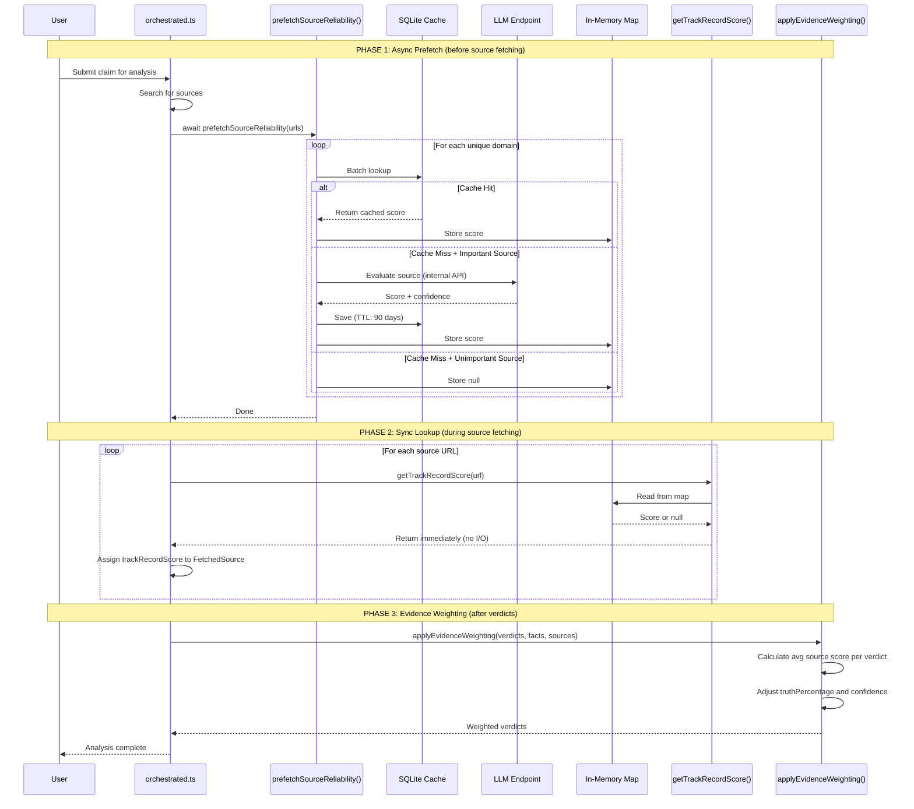
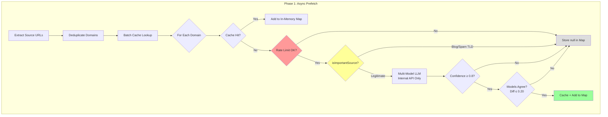

> **MOVED TO xWiki** (2026-02-06)
> 
> This document has been consolidated into the xWiki documentation system.
> The xWiki version is now the authoritative source.
> 
> **xWiki file**: `Docs/xwiki-pages/FactHarbor_Spec_and_Impl/FactHarbor/Specification/Implementation/Source Reliability System/WebHome.xwiki`
> 
> This .md file is kept for reference only. Do not edit - edit the .xwiki file instead.

---


# FactHarbor Source Reliability

**Version**: 1.4 (Multi-Language Support)  
**Status**: Operational  
**Last Updated**: 2026-02-03 (v2.6.41)

---

## Table of Contents

- [Overview](#overview)
- [Quick Start](#quick-start)
- [Architecture](#architecture)
- [How It Affects Verdicts](#how-it-affects-verdicts)
- [Configuration](#configuration)
- [Score Interpretation](#score-interpretation)
- [v1.3 Sequential Refinement](#v13-sequential-refinement-january-2026)
- [v1.4 Multi-Language Support](#v14-multi-language-support-january-2026)
- [Admin Interface](#admin-interface)
- [Design Principles](#design-principles)
- [Implementation Details](#implementation-details)
- [Cost & Performance](#cost--performance)
- [Troubleshooting](#troubleshooting)
- [Test Coverage](#test-coverage)

---

## Overview

FactHarbor evaluates source reliability dynamically using LLM-powered assessment with **sequential refinement** and **multi-language support**. The primary model (Claude) performs initial evaluation, then a secondary OpenAI model (default: `gpt-4o-mini`) cross-checks and refines the result. For non-English sources, the system detects the publication language and searches for regional fact-checker assessments. Sources are evaluated on-demand and cached for 90 days.

| Aspect | Implementation |
|--------|----------------|
| **Evaluation** | Sequential LLM refinement (Claude → OpenAI mini model cross-check) |
| **Storage** | SQLite cache (`source-reliability.db`) |
| **Integration** | Batch prefetch + sync lookup (all 3 pipelines) |
| **Pipelines** | Orchestrated ✅, Canonical ✅, Dynamic ✅ |
| **Cost Control** | Importance filter + rate limiting |
| **Verdict Impact** | Evidence weighting adjusts truth percentages |

---

## Quick Start

### Prerequisites

```powershell
# In apps/web/.env.local
ANTHROPIC_API_KEY=sk-ant-...
OPENAI_API_KEY=sk-...
FH_INTERNAL_RUNNER_KEY=your-secret-key-here
```

### That's It

The service is **enabled by default**. It will automatically:
- Prefetch source reliability before analyzing sources
- Use multi-model refinement (Claude + OpenAI mini model, default `gpt-4o-mini`)
- Cache results for 90 days
- Skip blog platforms and spam TLDs
- Apply evidence weighting to verdicts

### Verify It's Working

Run an analysis and check the logs for:
```
[SR] Prefetching 5 unique domains
[SR] Cache hits: 0/5
[SR] Evaluated reuters.com: score=0.95, confidence=0.92
```

---

## Architecture

### System Overview

```mermaid
flowchart TB
    subgraph analysis [FactHarbor Analysis Pipeline]
        AN[orchestrated.ts<br/>Analyzer]
        PF[prefetchSourceReliability<br/>Batch Prefetch]
        SR[source-reliability.ts<br/>Sync Lookup + Weighting]
    end
    
    subgraph cache [Source Reliability Cache]
        SQLITE[(SQLite<br/>source-reliability.db)]
        MAP[In-Memory Map<br/>prefetchedScores]
    end
    
    subgraph evaluation [LLM Evaluation - Sequential Refinement]
        EVAL[/api/internal/evaluate-source]
        LLM1[Claude<br/>Initial Evaluation]
    LLM2[OpenAI mini model<br/>Cross-check and Refine]
        FINAL[Final Result]
    end
    
    AN -->|1. Extract URLs| PF
    PF -->|2. Batch lookup| SQLITE
    SQLITE -->|3. Cache hits| MAP
    PF -->|4. Cache miss| EVAL
    EVAL --> LLM1
    LLM1 -->|Initial result| LLM2
    LLM2 -->|Refined result| FINAL
    FINAL -->|5. Store score| SQLITE
    FINAL -->|6. Populate| MAP
    AN -->|7. Sync lookup| SR
    SR -->|8. Read from| MAP
    SR -->|9. Apply to| VERDICTS[Verdict Weighting]
```

### Integration Pattern: Batch Prefetch + Sync Lookup

The Source Reliability system uses a **two-phase pattern** to avoid async operations in the analyzer's hot path.

#### The Problem

The FactHarbor analyzer (`orchestrated.ts`) is a complex synchronous pipeline. Adding `await` calls mid-pipeline for source reliability lookups would:
- Require major refactoring (ripple async throughout call chain)
- Complicate error handling and control flow
- Risk introducing race conditions

#### The Solution: Two-Phase Pattern

Separate the async work (cache lookup, LLM calls) from the sync analysis:

| Phase | When | Nature | What It Does |
|-------|------|--------|--------------|
| **Phase 1: Prefetch** | Before analysis starts | Async | Batch lookup all source URLs, populate in-memory map |
| **Phase 2: Lookup** | During analysis | Sync | Read from pre-populated map (instant, no I/O) |
| **Phase 3: Weighting** | After verdicts generated | Sync | Adjust truth percentages based on source scores |



### Phase 1 Detail: Prefetch Flow



### Why This Pattern Works

| Concern | How Pattern Addresses It |
|---------|-------------------------|
| **No async ripple** | Only ONE `await` at pipeline boundary, rest stays sync |
| **Batch efficiency** | Single batch cache lookup instead of N individual calls |
| **LLM cost control** | Filter + rate limit applied during prefetch |
| **Graceful degradation** | Unknown sources get `null`, analysis continues |
| **No blocking** | Sync lookups are instant map reads |

---

## How It Affects Verdicts

Source reliability scores directly influence verdict calculations through **evidence weighting**.

### Formula

```
adjustedTruth = 50 + (originalTruth - 50) × avgSourceScore
adjustedConfidence = confidence × (0.5 + avgSourceScore / 2)
```

### Effect on Verdicts (7-Band Scale)

| Source Credibility Band | Score (Weight) | Effect on Verdict |
|------------------------|------------------|-------------------|
| **Highly Reliable (0.86+)** | ~95-100% | Verdict fully preserved |
| **Reliable (0.72-0.86)** | ~75-90% | Verdict mostly preserved |
| **Leaning Reliable (0.58-0.72)** | ~60-75% | Moderate preservation |
| **Mixed (0.43-0.57)** | ~40-60% | Variable track record (neutral center) |
| **Leaning Unreliable (0.29-0.43)** | ~30-45% | Pulls toward neutral |
| **Unreliable (0.15-0.29)** | ~15-30% | Strong pull toward neutral |
| **Highly Unreliable (0.00-0.15)** | ~0-15% | Maximum skepticism |
| **Unknown (null)** | 50% | Uses default score (neutral) |

### Example

```
Original verdict: 80% (Strong True)
Source credibility: 0.5 (Mixed - variable track record)

Adjusted = 50 + (80 - 50) × 0.5
         = 50 + 30 × 0.5
         = 50 + 15
         = 65% (Leaning True)
```

### Multi-Source Averaging

When a verdict has evidence from multiple sources:

```
Verdict with facts from:
  - reuters.com (score: 0.95)
  - bbc.com (score: 0.88)
  
Average score = (0.95 + 0.88) / 2 = 0.915
```

---

## Configuration

Source Reliability is configured via UCM as a **separate SR config type** (schemaVersion `3.0.0`). Edit it in
**Admin → Config → Source Reliability**. This SR config is owned by the SR service and is separate
from the main pipeline/search/calculation configs.

### SR Config Independence

While SR config is stored in UCM alongside pipeline/search configs, it maintains
operational independence:

- **Schema versioning:** `3.0.0` for SR (independent of pipeline config versioning)
- **Hot reload:** SR config changes apply to new evaluations only
- **No cascading invalidation:** SR updates don't trigger pipeline/search config reloads
- **Separate domain:** SR uses `getConfig("sr")` and `setSourceReliabilityConfig()`

This separation preserves modularity between orthogonal concerns.

### Core Settings (UCM)

| Field | Default | Description |
|-------|---------|-------------|
| `enabled` | `true` | Enable/disable source reliability |
| `multiModel` | `true` | Use multi-model consensus |
| `openaiModel` | `gpt-4o-mini` | Secondary model for consensus |
| `confidenceThreshold` | `0.8` | Min LLM confidence to accept score |
| `consensusThreshold` | `0.20` | Max score difference between models |
| `defaultScore` | `0.5` | Default score for unknown sources (neutral center) |

### Cache & Filtering (UCM)

| Field | Default | Description |
|-------|---------|-------------|
| `cacheTtlDays` | `90` | Cache expiration in days |
| `filterEnabled` | `true` | Enable importance filter |
| `skipPlatforms` | *(defaults in config)* | Platform domains to skip |
| `skipTlds` | *(defaults in config)* | TLDs to skip |

### Rate Limiting (UCM)

| Field | Default | Description |
|-------|---------|-------------|
| `rateLimitPerIp` | `10` | Max evaluations per minute per IP |
| `domainCooldownSec` | `60` | Seconds between same-domain evals |

### Evaluator Evidence Grounding (UCM SR Config)

These settings affect the internal evaluation endpoint (`/api/internal/evaluate-source`) and are configured in the SR UCM config (Admin → Config → Source Reliability):

| Field | Default | Description |
|-------|---------|-------------|
| `evalUseSearch` | `true` | Build an evidence pack from web search |
| `evalSearchMaxResultsPerQuery` | `3` | Max search results per query for the evidence pack |
| `evalMaxEvidenceItems` | `12` | Max evidence-pack items to include |
| `evalSearchDateRestrict` | `null` | Optional: `y` \| `m` \| `w` (falls back to SearchConfig `dateRestrict`) |

**Note:** These SR evaluation settings (`evalUseSearch`, `evalSearchMaxResultsPerQuery`, etc.) are part of the SR UCM config domain and managed independently from the main pipeline/search configs.

### Environment Variables (infra only)

| Variable | Default | Description |
|----------|---------|-------------|
| `FH_SR_CACHE_PATH` | `./source-reliability.db` | SQLite database location |

### Example SR Config (JSON)

```json
{
  "enabled": true,
  "multiModel": true,
  "openaiModel": "gpt-4o-mini",
  "confidenceThreshold": 0.8,
  "consensusThreshold": 0.2,
  "defaultScore": 0.5,
  "cacheTtlDays": 90,
  "filterEnabled": true,
  "evalUseSearch": true
}
```

---

## Score Interpretation

**7-band credibility scale (centered at 0.5)**

| Score | Rating | Key Criteria |
|-------|--------|--------------|
| 0.86-1.00 | Highly Reliable | Verified accuracy, recognized standards body, rigorous corrections |
| 0.72-0.85 | Reliable | Consistent accuracy, professional standards, rarely faulted |
| 0.58-0.71 | Leaning Reliable | Often accurate, occasional errors, corrects when notified |
| 0.43-0.57 | Mixed | Variable accuracy OR inconsistent quality by topic/author |
| 0.29-0.42 | Leaning Unreliable | Often inaccurate OR bias significantly affects reporting |
| 0.15-0.28 | Unreliable | Pattern of false claims OR ignores corrections |
| 0.00-0.14 | Highly Unreliable | Fabricates content OR documented disinformation source |

**Calibration:**
- Default assumption is 0.5 (mixed). Adjust up or down based on evidence.
- Do not inflate scores based on brand recognition or reputation alone.
- "No negative findings" ≠ reliable. Absence of evidence lowers confidence; truly unknown sources should use insufficient_data.

**Negative-side calibration (POC intent):**
- **platform_ugc**: if a domain is primarily an open UGC platform without centralized editorial verification, it should generally land **below the mixed band** unless evidence shows consistent domain-level verification and corrections.
- **state_controlled_media**: if evidence indicates editorial coordination/control, default below mixed unless evidence shows meaningful editorial independence and correction practices.
- **propaganda_outlet / known_disinformation**: if evidence indicates repeated independent debunks / multiple independent assessors flagging systemic misinformation, score should land in **0.00–0.20** even if occasional factual content exists.

**Weighting Rules (applied during evaluation):**
1. **Recency Priority**: Last 24 months matter most. Historical reputation does not excuse recent failures.
2. **Verification**: Fact-checker findings are strong reliability signals.
3. **Visibility Cap**: Score capped by worst high-visibility failures.
4. **Opinion Counts**: Misinformation in opinion/editorial degrades entire source score.
5. **Bias Impact**: Bias affecting accuracy lowers score. Bias without factual issues is noted, not penalized.

**Bias Assessment:**
- Political spectrum: far_left | left | center_left | center | center_right | right | far_right
- Other bias types: pro_government | anti_government | corporate_interest | sensationalist | ideological_other

**Insufficient Data:**
- Sources with no independent assessments return `score: null` with `factualRating: insufficient_data`

**Impact on verdicts:**
- Score >= 0.58: Preserves original verdict (credible source)
- Score 0.43-0.57: Moderate pull toward neutral (mixed track record)
- Score < 0.43: Strong pull toward neutral (skepticism)

---

## v1.1 Prompt Improvements (January 2026)

**Date**: 2026-01-24
**Focus**: Prompt structure, quantification, and consistency across models

Version 1.1 improved the LLM evaluation prompt for source reliability assessments to increase stability, consistency, and effectiveness across different models.

### Key Improvements

| # | Improvement | Impact | Description |
|---|-------------|--------|-------------|
| 1 | Restructured Prompt Hierarchy | High | Moved critical rules to top with ⚠️ visual indicator, ensuring LLMs see most important constraints first |
| 2 | Quantified "Insufficient Data" Thresholds | High | Added specific numeric thresholds (e.g., "Zero fact-checker assessments AND ≤1 weak mention") to reduce inter-model disagreement |
| 3 | Mechanistic Confidence Scoring Formula | High | Created step-by-step calculation formula with base (0.40) + additive factors, making confidence reproducible across models |
| 4 | Numeric Negative Evidence Caps | Medium-High | Made caps explicit with numbers (e.g., "3+ failures → score ≤ 0.42") to prevent lenient scoring |
| 5 | Quantified Recency Weighting | Medium | Converted subjective terms to multipliers (0-12mo: 1.0×, 12-24mo: 0.8×, 2-5yr: 0.5×, >5yr: 0.2×) |
| 6 | Evidence Quality Hierarchy | Medium | Created three-tier hierarchy (HIGH/MEDIUM/LOW weight) to prevent single weak sources from dominating |
| 7 | Enhanced Calibration Examples | Medium | Added confidence calculations and reasoning to examples, showing models exactly how to apply formulas |
| 8 | Improved Source Type Positioning | Low-Medium | Renamed section to "SOURCE TYPE CLASSIFICATION (classify FIRST, then evaluate within category)" |
| 9 | Enhanced System Message | Low-Medium | Made system message tactical with specific responsibilities (evidence-only, caps, formula) |
| 10 | Expanded Validation Checklist | Low-Medium | Added checklist items for all critical rules to help models catch errors before responding |

### Mechanistic Confidence Formula

**Base**: 0.40

**ADD**:
- +0.15 per independent fact-checker assessment (max +0.45 for 3+)
- +0.10 if most evidence is within last 12 months
- +0.10 if evidence shows consistent pattern (3+ sources agree)
- +0.05 per additional corroborating source beyond first (max +0.15)

**SUBTRACT**:
- -0.15 if evidence is contradictory/mixed signals
- -0.10 if evidence is mostly >2 years old

**Final confidence**: clamp result to [0.0, 1.0]

**THRESHOLD**: If calculated confidence < 0.50, strongly consider outputting `score=null` and `factualRating="insufficient_data"`

### Negative Evidence Caps (v1.1)

| Evidence Type | Score Cap | Rating Cap |
|---------------|-----------|------------|
| Evidence of fabricated stories/disinformation | ≤ 0.14 | highly_unreliable |
| 3+ documented fact-checker failures | ≤ 0.42 | leaning_unreliable |
| 1-2 documented failures from reputable fact-checkers | ≤ 0.57 | mixed |
| Political/ideological bias WITHOUT documented failures | No cap | Note in bias field only |

### Evidence Quality Hierarchy

**HIGH WEIGHT** (can establish verdict alone):
- Explicit fact-checker assessments (MBFC, Snopes, PolitiFact, etc.)
- Documented corrections/retractions by the source
- Journalism reviews from reputable organizations

**MEDIUM WEIGHT** (support but don't establish alone):
- Newsroom analyses of editorial standards
- Academic studies on source reliability
- Awards/recognition from journalism organizations

**LOW WEIGHT** (context only, cannot trigger caps):
- Single blog posts or forum discussions
- Passing mentions without substantive analysis
- Generic references without reliability details

### Expected Improvements

| Aspect | Before | After | Expected Gain |
|--------|--------|-------|---------------|
| Insufficient data detection | ~60% consistent | ~85% consistent | +25% |
| Confidence scoring variance | ±0.20 typical | ±0.10 typical | 50% reduction |
| Negative evidence cap application | ~70% correct | ~90% correct | +20% |
| Inter-model agreement | 75% within ±0.15 | 85% within ±0.10 | +10% tighter |
| Evidence grounding | Already high (~95%) | Maintained | Stable |

### Backward Compatibility

✅ **Fully backward compatible**:
- Output schema unchanged
- Rating scale unchanged
- All existing validation logic still applies
- Cache compatibility maintained

---

## v1.2 Hardening (January 2026)

Version 1.2 introduces significant improvements to scoring accuracy, especially for propaganda and misinformation sources.

### Key Changes

| Feature | Description |
|---------|-------------|
| **Entity-Level Evaluation** | Prioritize organization reputation over domain-only metrics when the domain is a primary outlet for an established organization. |
| **SOURCE TYPE SCORE CAPS** | Deterministic ceiling enforcement: `propaganda_outlet`/`known_disinformation` → ≤14%, `state_controlled_media`/`platform_ugc` → ≤42% |
| **Adaptive Evidence Queries** | Negative-signal queries (`propaganda`, `disinformation`, `false claims`) added when initial results are sparse |
| **Brand Variant Matching** | Improved relevance filtering: handles `anti-spiegel` ↔ `antispiegel` ↔ `anti spiegel`, suffix stripping (`foxnews` → `fox news`) |
| **Mechanistic Confidence** | Formula-based confidence scoring: base 0.40 + factors (fact-checkers, recency, corroboration) |
| **Asymmetric Confidence Gating** | High scores require higher confidence (skeptical default) |
| **Unified Thresholds** | Admin + pipeline + evaluator use same defaults (confidence: 0.8) |
| **AGENTS.md Compliant** | Abstract examples only (no real domain names in prompts) |

### Source Type Caps (Enforced Deterministically)

```
propaganda_outlet       → score ≤ 0.14 (highly_unreliable)
known_disinformation    → score ≤ 0.14 (highly_unreliable)
state_controlled_media  → score ≤ 0.42 (leaning_unreliable)
platform_ugc            → score ≤ 0.42 (leaning_unreliable)
```

These caps are enforced in post-processing after LLM evaluation, ensuring deterministic behavior regardless of LLM variance.

### Asymmetric Confidence Requirements

High reliability scores require stronger evidence (skeptical default):

| Rating | Min Confidence |
|--------|---------------|
| highly_reliable | 0.85 |
| reliable | 0.75 |
| leaning_reliable | 0.65 |
| mixed | 0.55 |
| leaning_unreliable | 0.50 |
| unreliable | 0.45 |
| highly_unreliable | 0.40 |

### Shared Configuration

All components now use `apps/web/src/lib/source-reliability-config.ts` for unified defaults:

```typescript
import { getSRConfig, scoreToFactualRating, SOURCE_TYPE_EXPECTED_CAPS } from "@/lib/source-reliability-config";

const config = getSRConfig();
// config.confidenceThreshold = 0.8 (unified)
// config.consensusThreshold = 0.20
```

---

## v1.3 Sequential Refinement (January 2026)

Version 1.3 replaces the parallel consensus model with **sequential refinement** for more accurate entity-level evaluation and better handling of established organizations like public broadcasters.

### Architecture Change

**Previous (v1.2) - Parallel Consensus:**
```
Evidence Pack → Claude (evaluate) → Result 1
Evidence Pack → OpenAI model (evaluate) → Result 2
Compare Results → Consensus or Fallback → Final
```

**Problem**: Both models evaluated independently with the same prompt, often both missing entity-level context (e.g., a domain belonging to a major public broadcaster).

**New (v1.3) - Sequential Refinement:**
```
Evidence Pack → Claude (Initial Evaluation) → Initial Result
                         ↓
Evidence Pack + Initial Result → OpenAI mini model (Cross-check & Refine) → Final Result
```

**Benefits**:
- LLM2 can catch what LLM1 missed (especially entity recognition)
- Explicit cross-checking of entity identification
- Baseline score adjustments for known organization types (public broadcasters, wire services)
- Better reasoning transparency (shows refinement logic)

### Refinement Process

The secondary OpenAI model (default: `gpt-4o-mini`) receives:
1. The original evidence pack
2. The complete initial evaluation from Claude
3. Instructions to cross-check, sharpen entity identification, and refine the score

The refinement prompt includes guidance for:
- **Entity identification**: Recognizing when a domain belongs to an established organization
- **Organization type context**: Public broadcasters, wire services, legacy media characteristics
- **Positive signals**: Academic citations, institutional use, professional reliance
- **Established org handling**: Absence of explicit fact-checker ratings does NOT penalize established organizations (fact-checkers focus on problematic sources)

### Shared Prompt Sections

Both LLM1 (initial evaluation) and LLM2 (refinement) use **shared prompt constants** for consistency:

| Section | Purpose |
|---------|---------|
| Rating Scale | Score → rating mapping (0.86+ = highly_reliable, etc.) |
| Evidence Signals | Positive/neutral signal definitions |
| Bias Values | Political and other bias enum values |
| Source Types | Classification definitions and triggers |
| Score Caps | Hard limits for severe source types |

This ensures both models interpret evidence identically.

### Score Caps (Hard Limits)

Source type caps are **strictly enforced with no exceptions**:

| Source Type | Maximum Score | Rating |
|-------------|---------------|--------|
| `propaganda_outlet` | 0.14 | highly_unreliable |
| `known_disinformation` | 0.14 | highly_unreliable |
| `state_controlled_media` | 0.42 | leaning_unreliable |
| `platform_ugc` | 0.42 | leaning_unreliable |

If evidence suggests a source has reformed, the correct action is to **reclassify the sourceType**, not exceed the cap.

### Refinement Adjustment Rules

The refinement stage follows strict adjustment criteria:

- **UPWARD adjustment** requires positive signals PRESENT in evidence:
  - Academic citations of the source as reference material
  - Professional/institutional use documented
  - Independent mentions treating it as authoritative
- **DOWNWARD adjustment** if negative signals were missed or underweighted
- **NO adjustment** if evidence is simply sparse (sparse ≠ positive)
- Absence of negative evidence alone does NOT justify upward adjustment

---

## v1.4 Multi-Language Support (January 2026)

Version 1.4 adds automatic language detection and multi-language search queries to find regional fact-checker assessments.

### Problem Solved

English-only searches miss critical evidence from regional fact-checkers:

| Domain | Issue with English-only |
|--------|------------------------|
| `reitschuster.de` | CORRECTIV assessments not found |
| `anti-spiegel.ru` | German-language propaganda site, German fact-checkers cover it |
| `weltwoche.ch` | German/Swiss fact-checker coverage missed |

### Language Detection

The system detects the **actual publication language** (not TLD) by:

1. Fetching the homepage (5s timeout)
2. Checking `<html lang="...">` attribute
3. Checking `<meta http-equiv="content-language">`
4. Checking `<meta property="og:locale">`
5. If all fail: LLM analyzes content sample

Results are cached per domain.

### Multi-Language Queries

When a non-English language is detected:

1. **LLM translates** key fact-checking terms (cached per language)
2. **Dual-language searches** are performed:
   - English queries (always, for international coverage)
   - Translated queries (for regional fact-checkers)

### Supported Languages

German, French, Spanish, Portuguese, Italian, Dutch, Polish, Russian, Swedish, Norwegian, Danish, Finnish, Czech, Hungarian, Turkish, Japanese, Chinese, Korean, Arabic.

### Regional Fact-Checkers (Tier 1)

| Language | Fact-Checkers |
|----------|---------------|
| German | CORRECTIV, Mimikama, dpa-Faktencheck, Faktenfinder (ARD) |
| French | AFP Factuel, Les Décodeurs (Le Monde), Libération CheckNews |
| Spanish | Maldita.es, Newtral, EFE Verifica |
| Portuguese | Aos Fatos, Lupa, Polígrafo |
| Italian | Pagella Politica, ANSA Fact-checking |
| Dutch | Nu.nl Factcheck, Nieuwscheckers |

These regional fact-checkers have the same authority as IFCN signatories.

### Cost Impact

| Component | Cost per Evaluation |
|-----------|---------------------|
| Language detection (page fetch) | Free |
| Translation (LLM, cached) | ~$0.001 per new language |
| Additional searches | ~2-4 extra queries |

### Response Fields

The API response now includes refinement tracking:

| Field | Type | Description |
|-------|------|-------------|
| `refinementApplied` | boolean | Whether the score was adjusted by cross-check |
| `refinementNotes` | string | Summary of cross-check findings |
| `originalScore` | number | Score before refinement (if changed) |

### Example: Public Broadcaster Evaluation

**Before (v1.2 - Parallel Consensus)**:
- Both models evaluated the source independently at ~60% (leaning_reliable)
- Consensus achieved, but score may be too conservative for an established organization

**After (v1.3 - Sequential Refinement)**:
- Claude initial evaluation: 60% (leaning_reliable)
- OpenAI mini-model cross-check: Identifies the source as an established public broadcaster, notes academic citations and institutional use in evidence, no negative evidence found
- Final result: Score refined upward with `refinementApplied: true` and detailed `refinementNotes`

---

## Admin Interface

Access the Source Reliability admin page at: `/admin/source-reliability`

### Features

- **Cache Statistics**: Total entries, average scores, expired count
- **Paginated Table**: View all cached scores with sorting
- **Cleanup**: Remove expired entries
- **Authentication**: Requires `FH_ADMIN_KEY` in production

### Admin Tasks (~15 min/week)

| Task | Time | Frequency |
|------|------|-----------|
| Check LLM cost dashboard | 5 min | Weekly |
| Spot-check 2-3 recent scores | 8 min | Weekly |
| Review any flagged issues | 2 min | Weekly |

---

## Design Principles

### Evidence Over Authority

Source credibility is **supplementary**, not primary:

- Only evidence and counter-evidence matter - not who says it
- Authority does NOT automatically give weight
- A low-credibility source with documented evidence should be considered
- A high-credibility source making unsupported claims should be questioned

### No Pre-seeded Data

All sources are evaluated identically by LLM:
- No hardcoded scores or external rating databases
- No manipulation concerns from third-party data
- Full transparency - every score comes from LLM evaluation

### No Categorical Bias

Per review feedback, the system avoids categorical assumptions:
- Domain type (.gov, .edu, .org) does NOT imply quality
- Scores derived from demonstrated track record, not institutional prestige
- Editorial independence matters - state control is a negative factor

### Entity-Level Evaluation

When a domain is the primary digital outlet for a larger organization (e.g., a TV channel, newspaper, or media group), the evaluation must focus on the reliability of the entire organization.

- **Evaluation focus**: If the domain name or the website's branding closely matches an organization name, the whole organization shall be rated.
- **Legacy Media**: Public broadcasters and established legacy media should be evaluated based on their institutional standards and editorial oversight.
- **Consistency**: This prevents high-quality organizations from being underrated due to narrow domain-focused metrics.

### Dynamic Assessment

- Sources can gain or lose credibility over time
- Cache expires after 90 days (configurable)
- Re-evaluation happens automatically on cache miss

### Score Scale Contract

**Canonical scale: 0.0-1.0, 7-band credibility scale**

| Score Range | Rating | Meaning |
|-------------|--------|---------|
| 0.86-1.00 | highly_reliable | Verified accuracy, recognized standards body |
| 0.72-0.85 | reliable | Consistent accuracy, professional standards |
| 0.58-0.71 | leaning_reliable | Often accurate, occasional errors |
| 0.43-0.57 | mixed | Variable accuracy, inconsistent quality |
| 0.29-0.42 | leaning_unreliable | Often inaccurate, bias affects reporting |
| 0.15-0.28 | unreliable | Pattern of false claims, ignores corrections |
| 0.00-0.14 | highly_unreliable | Fabricates content, documented disinformation |

**Key properties:**
- **7 bands** for source credibility assessment
- **0.5 = exact center** of the mixed band (0.43-0.57)
- Above 0.58 = positive boost to verdict preservation
- 0.43-0.57 = neutral zone (known sources with variable track record)
- Below 0.43 = pulls verdict toward neutral (skepticism)
- All stored scores use decimal 0.0-1.0
- Defensive normalization handles 0-100 scale inputs

---

## Implementation Details

### Key Files

| File | Purpose |
|------|---------|
| `apps/web/src/lib/analyzer/source-reliability.ts` | Prefetch, sync lookup, evidence weighting |
| `apps/web/src/lib/source-reliability-cache.ts` | SQLite cache operations |
| `apps/web/src/app/api/internal/evaluate-source/route.ts` | LLM evaluation endpoint |
| `apps/web/src/app/admin/source-reliability/page.tsx` | Admin UI for cache management |
| `apps/web/src/app/api/admin/source-reliability/route.ts` | Admin API endpoint |

### Key Functions

```typescript
// Phase 1: Call ONCE before analysis (async)
export async function prefetchSourceReliability(urls: string[]): Promise<PrefetchResult>;
interface PrefetchResult {
  prefetched: number;
  alreadyPrefetched: number;
  cacheHits: number;
  evaluated: number;
  skipped: number;
}

// Phase 2: Call MANY times during analysis (sync, instant)
export function getTrackRecordScore(url: string): number | null;
export function getTrackRecordData(url: string): CachedReliabilityData | null;
interface CachedReliabilityData {
  score: number;
  confidence: number;
  consensusAchieved: boolean;
  identifiedEntity?: string;
}

// Phase 3: Apply to verdicts (sync)
export function applyEvidenceWeighting(
  claimVerdicts: ClaimVerdict[],
  facts: ExtractedFact[],
  sources: FetchedSource[]
): ClaimVerdict[];

// Effective weight calculation (used by monolithic pipelines)
export function calculateEffectiveWeight(data: SourceReliabilityData): number;
interface SourceReliabilityData {
  score: number;
  confidence: number;
  consensusAchieved: boolean;
}

// Utilities
export function extractDomain(url: string): string | null;
export function isImportantSource(domain: string): boolean;
export function normalizeTrackRecordScore(score: number): number;
export function clampTruthPercentage(value: number): number;
export function clearPrefetchedScores(): void;

// Configuration
export const DEFAULT_UNKNOWN_SOURCE_SCORE: number; // 0.5 by default (neutral center)
export const SR_CONFIG: SourceReliabilityConfig;
```

### Temporal Awareness (v2.6.35+)

The LLM evaluation prompt includes the current date and temporal guidance to ensure assessments reflect **recent** source performance:

```typescript
CURRENT DATE: ${currentDate}

TEMPORAL AWARENESS (IMPORTANT):
- Source reliability can change over time due to ownership changes, editorial shifts, or political transitions
- Government sites (e.g., whitehouse.gov, state departments) may vary in reliability across administrations  
- News organizations can improve or decline in quality over time
- Base your assessment on the source's RECENT track record (last 1-2 years when possible)
- If a source has undergone recent changes, factor that into your assessment
```

**Why This Matters**:
- **Government sources** vary by administration (e.g., transparency changes across presidencies)
- **Media outlets** can shift with ownership or editorial changes
- **Historical reputation** may not reflect current performance
- **Time-sensitive evaluations** prevent outdated assessments

**Cache TTL enforces freshness**: 90-day default means scores are re-evaluated quarterly, capturing significant changes in source reliability over time.

### Pipeline Integration

Source Reliability is integrated into all three FactHarbor analysis pipelines:

| Pipeline | File | Status | Implementation |
|----------|------|--------|----------------|
| **Orchestrated** | `orchestrated.ts` | ✅ Full | Prefetch + lookup + evidence weighting |
| **Monolithic Canonical** | `monolithic-canonical.ts` | ✅ Full | Prefetch + lookup + verdict adjustment |
| **Monolithic Dynamic** | `monolithic-dynamic.ts` | ✅ Full | Prefetch + lookup + verdict adjustment |

All pipelines follow the same pattern:
1. **Clear** prefetched scores at analysis start
2. **Prefetch** source reliability before fetching URLs
3. **Lookup** scores synchronously when creating sources
4. **Apply** weighting to verdicts

### Integration Points: Orchestrated Pipeline

```typescript
// In orchestrated.ts - runFactHarborAnalysis()

// 1. Clear at start of analysis
clearPrefetchedScores();

// 2. After search, before fetching sources
const urlsToFetch = searchResults.map(r => r.url);
await prefetchSourceReliability(urlsToFetch);

// 3. During fetchSource() - sync lookup
const trackRecord = getTrackRecordScore(url);
const source: FetchedSource = {
  // ...
  trackRecordScore: trackRecord,
};

// 4. After generating verdicts
const weightedVerdicts = applyEvidenceWeighting(
  claimVerdicts,
  state.facts,
  state.sources
);
```

### Integration Points: Monolithic Pipelines

Both `monolithic-canonical.ts` and `monolithic-dynamic.ts` use the same integration pattern with slight differences:

```typescript
// In monolithic-canonical.ts / monolithic-dynamic.ts

// 1. Clear at start of analysis
clearPrefetchedScores();

// 2. Before each fetch batch, prefetch reliability
if (SR_CONFIG.enabled && urlsToFetch.length > 0) {
  await prefetchSourceReliability(urlsToFetch.map(r => r.url));
}

// 3. When creating source objects, include reliability data
const reliabilityData = getTrackRecordData(result.url);
sources.push({
  // ...
  trackRecordScore: reliabilityData?.score ?? null,
  trackRecordConfidence: reliabilityData?.confidence ?? null,
  trackRecordConsensus: reliabilityData?.consensusAchieved ?? null,
});

// 4. Apply score as weight to verdicts
const avgSourceScore = sources.reduce((sum, s) => sum + s.trackRecordScore, 0) / sources.length;
const adjustedVerdict = Math.round(50 + (v.verdict - 50) * avgSourceScore);
const adjustedConfidence = Math.round(v.confidence * (0.5 + avgSourceScore / 2));
```

### Score = Weight

With the 7-band scale, the LLM score directly represents reliability and is used as-is:

```typescript
function calculateEffectiveWeight(data: SourceReliabilityData): number {
  // Simple: score IS the weight
  // Confidence already filtered out low-quality evaluations (threshold gate)
  return data.score;
}
```

| Component | Purpose |
|-----------|---------|
| **Score** | LLM-evaluated reliability (7-band scale) - used directly as weight |
| **Confidence** | Quality gate (threshold: `sr.confidenceThreshold`, default 0.8) - scores below are rejected |
| **Consensus** | Multi-model agreement (diff ≤ `sr.consensusThreshold`, default 0.20) |

**Key Design Decisions**:
- **Score = Weight** - No transformation, what LLM says is what we use
- **Confidence is a gate, not a modifier** - If evaluation passes threshold, we trust it
- **Transparency** - A 70% score means 70% weight, no hidden calculations

**Examples:**
- Highly reliable source (95% score): 95% weight
- Mixed reliability source (67% score): 67% weight
- Unreliable source (27% score): 27% weight
- Unknown source (50% default): 50% weight (neutral)

### Unknown Source Handling

Sources not in the cache are assigned a default score:

| Field | Default | Purpose |
|-------|---------|---------|
| `defaultScore` | `0.5` | Score assigned to unknown sources (neutral center, SR UCM config) |

This results in 50% weight (neutral), applying appropriate skepticism to unverified sources while not completely discounting their evidence.

### Multi-Model Consensus

When `sr.multiModel` is enabled (default):

1. Build an optional **evidence pack** (web search results) if `sr.evalUseSearch=true` and a search provider is configured
2. Both Claude and the secondary OpenAI model evaluate the source using the same evidence pack
3. Primary must return confidence ≥ `sr.confidenceThreshold`; secondary must return a non-null score (if secondary fails, fallback to primary with reduced confidence)
4. Score difference must be ≤ `sr.consensusThreshold` (default 0.20)
5. Final score = **“better founded”** model output (more grounded citations/recency to the evidence pack); tie-breaker = **lower score** (skeptical default)
6. If consensus fails → return `null` (unknown reliability)

```typescript
// Simplified consensus logic (POC)
const evidencePack = await buildEvidencePack(domain);
const claude = await evaluateWithModel(domain, "anthropic", evidencePack);
const gpt = await evaluateWithModel(domain, "openai", evidencePack);

if (!claude || !gpt) return null;

const scoreDiff = Math.abs(claude.score - gpt.score);
if (scoreDiff > consensusThreshold) return null;

// Choose "better founded" output; tie-breaker lower score
const chosen =
  gpt.foundedness > claude.foundedness ? gpt :
  claude.foundedness > gpt.foundedness ? claude :
  (Math.min(claude.score, gpt.score) === claude.score ? claude : gpt);

return { score: chosen.score, confidence: (claude.confidence + gpt.confidence) / 2 };
```

---

## Cost & Performance

### Cost Estimates

| Mode | Monthly Cost |
|------|--------------|
| Multi-model (default) | $40-60 |
| Single-model | $20-30 |

The importance filter saves ~60% of LLM costs by skipping blog platforms and spam domains.

### Success Metrics

| Metric | Target |
|--------|--------|
| Cache hit rate (warm) | > 80% |
| Blog skip rate | > 90% |
| Confidence pass rate | > 85% |
| Consensus rate | > 90% |

### Rollback Options

| Issue | Action |
|-------|--------|
| LLM costs too high | Set `sr.multiModel=false` in UCM (Admin → Config → Source Reliability) |
| Still too expensive | Set `sr.enabled=false` in UCM |
| Too many hallucinations | Raise `sr.confidenceThreshold` to 0.9 |
| Low consensus rate | Lower `sr.consensusThreshold` (default 0.20) |

---

## Troubleshooting

| Issue | Solution |
|-------|----------|
| "Unauthorized" from evaluate endpoint | Set `FH_INTERNAL_RUNNER_KEY` in `.env.local` |
| No scores appearing | Verify `sr.enabled=true` in UCM (Admin → Config → Source Reliability) |
| Low-confidence evaluations (shown as score N/A) | Ensure a search provider is configured so the evidence pack is populated; otherwise evaluations may return `insufficient_data` |
| High LLM costs | Enable filter and use single model (`sr.multiModel=false`) |
| Consensus failures | Lower `sr.consensusThreshold` (default 0.20) |
| Score not affecting verdict | Check `applyEvidenceWeighting` is called, verify `trackRecordScore` on sources |
| Admin page shows 401 | Enter admin key in the auth form, or set `FH_ADMIN_KEY` in env |

---

## Test Coverage

The Source Reliability system has comprehensive test coverage:

| Test File | Tests | Coverage |
|-----------|-------|----------|
| `source-reliability.test.ts` | 42 | Domain extraction, importance filter, evidence weighting |
| `source-reliability-cache.test.ts` | 16 | SQLite operations, pagination, expiration |
| `source-reliability.integration.test.ts` | 13 | End-to-end pipeline flow |
| `evaluate-source.test.ts` | 19 | Rate limiting, consensus calculation |
| **Total** | **90** | |

Run tests:
```bash
cd apps/web && npm test -- src/lib/analyzer/source-reliability.test.ts
cd apps/web && npm test -- src/lib/source-reliability-cache.test.ts
cd apps/web && npm test -- src/lib/analyzer/source-reliability.integration.test.ts
cd apps/web && npm test -- src/app/api/internal/evaluate-source/evaluate-source.test.ts
```

---

## Historical Documentation

For the original architecture proposal and review history, see:
- [Source_Reliability_Service_Proposal.md](../ARCHIVE/Source_Reliability_Service_Proposal.md) (archived)
- [Review documents](../ARCHIVE/) (archived)

## Related Documentation

- [Source_Reliability_Prompt_Improvements.md](./Source_Reliability_Prompt_Improvements.md) - Detailed changelog of LLM prompt improvements (2026-01-24)
