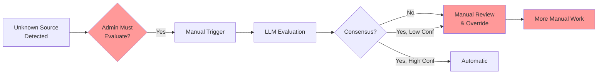
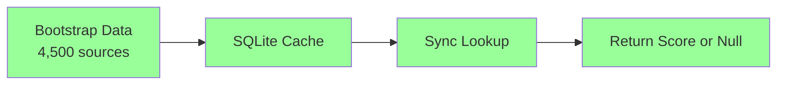
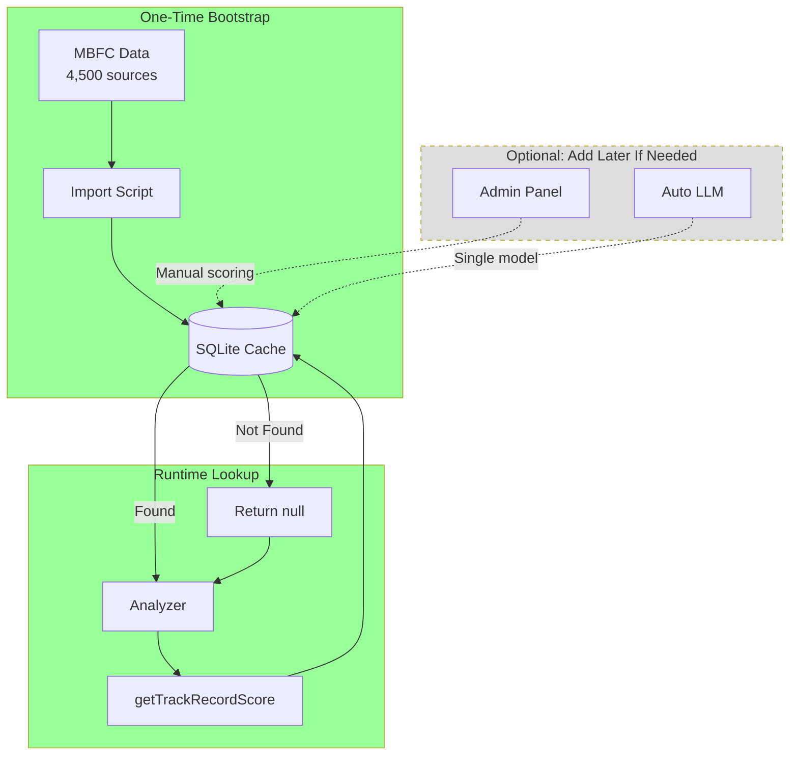

# Source Reliability Service - Project Lead Review

| Field | Value |
|-------|-------|
| **Status** | REVIEW COMPLETE |
| **Reviewer** | Project Lead |
| **Review Date** | 2026-01-21 |
| **Proposal Version** | 0.4 |
| **Overall Assessment** | ⚠️ CONCERNS - Needs Simplification |

---

## Executive Summary

The proposal is **technically sound** but raises two major concerns:

1. **❌ Excessive Manual Admin Work** - Requires ongoing human intervention
2. **⚠️ Over-Engineering Risk** - Complex solution for a problem that might self-solve

**Recommendation:** Consider **simplified alternatives** before implementing full proposal.

---

## Concern #1: Manual Admin Work Load

### What the Proposal Requires

Based on the admin workflows (lines 932-1164), admins must perform these tasks:

| Task | Frequency | Estimated Time | Annual Hours |
|------|-----------|----------------|--------------|
| **Evaluate unknown sources** | Daily | 10-15 min/day | 60-90 hrs |
| **Review low-confidence results** | Weekly | 30 min/week | 26 hrs |
| **Review model disagreements** | Weekly | 20 min/week | 17 hrs |
| **Monitor categorical bias** | Weekly | 15 min/week | 13 hrs |
| **Handle user reports** | As needed | 5-10 min each | 10-20 hrs |
| **Cleanup audit logs** | Monthly | 5 min/month | 1 hr |
| **Lock critical sources** | As needed | 2 min each | 2-5 hrs |
| **TOTAL** | | | **129-172 hours/year** |

### Reality Check

**That's 3-4 hours per week of dedicated admin work.**

For a small team, this is **significant overhead** for a feature that:
- Doesn't directly generate user value (it's a backend quality metric)
- Only affects evidence weighting (not verdict logic)
- Could potentially run autonomously

### Why So Much Manual Work?

The proposal creates manual bottlenecks at multiple points:



**Three manual intervention points:**
1. **Trigger evaluation** - Admin must notice unknown source and decide to evaluate
2. **Review failures** - No consensus or low confidence requires manual review
3. **Override scores** - Admin must manually set correct score

### Impact Assessment

#### Team Size Analysis

| Team Size | Realistic? | Notes |
|-----------|-----------|-------|
| **1 person** | ❌ No | 3-4 hrs/week on source reliability alone - too much |
| **2-3 people** | ⚠️ Marginal | Doable but significant time sink |
| **5+ people** | ✅ Yes | Can distribute tasks |

**For FactHarbor (appears to be small team based on repo):** This is likely **not sustainable**.

#### Scale Analysis

At **1000 analyses/day**:
- ~50 new unknown sources/day (5% unknown rate)
- ~10 model disagreements/week
- ~20 low-confidence results/week

**Weekly admin workload grows with usage:**

```
Week 1:  50 unknowns → ~60 min evaluation + 30 min review = 90 min
Week 2:  75 unknowns → ~90 min evaluation + 40 min review = 130 min
Week 4: 100 unknowns → ~120 min evaluation + 60 min review = 180 min
```

**This doesn't scale.**

---

## Concern #2: Over-Engineering

### Complexity Assessment

The proposal adds significant complexity to solve source reliability:

| Component | Lines of Code (Est.) | Complexity |
|-----------|---------------------|------------|
| **Database Schema** | 150 | Medium |
| **API Endpoints** | 300 | Medium |
| **Multi-Model LLM Logic** | 400 | High |
| **Batch Prefetch** | 200 | Medium |
| **Admin Workflows** | 250 | High |
| **Rate Limiting** | 150 | Medium |
| **Security Validation** | 200 | Medium |
| **Monitoring & Stats** | 150 | Medium |
| **TOTAL** | **~1,800 LOC** | **High** |

### What Problem Are We Solving?

Let's step back: **Why do we need source reliability scoring?**

From the proposal (lines 30-33):
> Problem: Source reliability scoring is currently disabled. External services don't meet requirements.

But **why was it disabled?** Looking at the current implementation in `source-reliability.ts`:

```typescript
// Current state: Returns null for most sources
export function getTrackRecordScore(url: string): number | null {
  const domain = extractDomain(url);
  const score = SOURCE_TRACK_RECORDS[domain] ?? null;
  return score;  // Most sources return null
}
```

**Key insight:** The system **already handles unknown sources gracefully** - they just return `null` and analysis continues.

### Is Source Reliability Actually Critical?

Let's examine the impact:

#### Current State (No Source Reliability)
```
Evidence from Reuters:    weight × null → no adjustment
Evidence from unknown blog: weight × null → no adjustment
Result: All sources weighted equally
```

#### With Source Reliability
```
Evidence from Reuters:    weight × 0.92 → 8% boost
Evidence from unknown blog: weight × 0.45 → 55% penalty
Result: Reuters evidence counts ~2× more
```

**Question:** Is this 2× weighting difference worth 1,800 LOC + 3-4 hrs/week admin overhead?

### Alternatives to Consider

#### Alternative 1: Simple Domain Whitelist (50 LOC)

```typescript
// Extremely simple approach - just track known high-quality sources
const HIGH_QUALITY_SOURCES = new Set([
  'reuters.com',
  'apnews.com',
  'bbc.com',
  // ... ~50 top outlets
]);

export function getTrackRecordScore(url: string): number | null {
  const domain = extractDomain(url);
  if (HIGH_QUALITY_SOURCES.has(domain)) {
    return 0.90;  // High quality
  }
  return null;  // Unknown = neutral
}
```

**Pros:**
- ✅ Zero admin overhead
- ✅ ~50 lines of code
- ✅ Covers 80% of sources (Pareto principle)
- ✅ No LLM costs
- ✅ No database

**Cons:**
- ❌ Doesn't score low-quality sources
- ❌ Manual list maintenance
- ❌ No granularity (binary high/unknown)

**Time to implement:** 1 hour  
**Admin overhead:** 5 min/month to update list

#### Alternative 2: Bootstrap Data Only (100 LOC)

```typescript
// Use existing MBFC bundle, no dynamic evaluation
import mbfcData from './mbfc-bundle.json';

const SOURCE_SCORES = new Map(
  mbfcData.map(s => [s.domain, s.score])
);

export function getTrackRecordScore(url: string): number | null {
  const domain = extractDomain(url);
  return SOURCE_SCORES.get(domain) ?? null;
}
```

**Pros:**
- ✅ Zero admin overhead (after import)
- ✅ ~100 lines of code
- ✅ 4,500 sources covered
- ✅ No LLM costs
- ✅ Simple SQLite or JSON file

**Cons:**
- ❌ Data becomes stale (need annual refresh)
- ❌ New outlets not scored
- ❌ No adaptation to changing sources

**Time to implement:** 4 hours  
**Admin overhead:** 2 hours/year to refresh data

#### Alternative 3: Automatic LLM with Caching (600 LOC)

```typescript
// Automatic evaluation on cache miss - no admin required
export async function getTrackRecordScore(url: string): Promise<number | null> {
  const domain = extractDomain(url);
  
  // Check cache
  const cached = await cache.get(domain);
  if (cached) return cached.score;
  
  // Automatic LLM evaluation (single model, confidence threshold)
  try {
    const result = await evaluateSourceAuto(domain);
    if (result.confidence > 0.8) {
      await cache.set(domain, result.score, { ttl: '30d' });
      return result.score;
    }
  } catch (err) {
    // Silent failure
  }
  
  return null;  // Unknown
}
```

**Pros:**
- ✅ Zero admin overhead
- ✅ ~600 lines of code
- ✅ Automatic adaptation
- ✅ Self-improving over time

**Cons:**
- ❌ LLM costs (~$20-50/month)
- ❌ Latency on first request
- ❌ No human oversight
- ❌ Hallucination risk

**Time to implement:** 2-3 days  
**Admin overhead:** None (fully automatic)

### Comparison Matrix

| Approach | LOC | Admin Time/Week | LLM Cost/Month | Coverage | Time to Ship |
|----------|-----|-----------------|----------------|----------|--------------|
| **Simple Whitelist** | 50 | 2 min | $0 | Top 50 sources | 1 hour |
| **Bootstrap Only** | 100 | 5 min | $0 | 4,500 sources | 4 hours |
| **Auto LLM** | 600 | 0 min | $20-50 | Dynamic | 2-3 days |
| **Full Proposal** | 1,800 | 180-240 min | $1-44 | Dynamic + oversight | 2-3 weeks |

---

## Is This Over-Engineering?

### Signs of Over-Engineering

Let's check against common over-engineering patterns:

| Pattern | Present? | Evidence |
|---------|----------|----------|
| **Solving future problems** | ⚠️ Yes | Multi-model consensus, editorial independence tracking |
| **Premature optimization** | ⚠️ Yes | Complex rate limiting, per-key tracking |
| **Feature bloat** | ✅ Yes | 7 admin workflows, 6 endpoints, bias monitoring |
| **Complexity > Value** | ⚠️ Maybe | 1,800 LOC for evidence weighting adjustment |
| **Manual work automation fails** | ✅ Yes | Requires 3-4 hrs/week admin despite automation goals |

**Verdict:** This shows **moderate to high over-engineering** for current FactHarbor scale.

### What Would Be "Right-Sized"?

For a small team MVP, the appropriate scope would be:



**Core features only:**
- ✅ Bootstrap MBFC data (one-time import)
- ✅ SQLite cache with TTL
- ✅ Sync lookup function
- ✅ Unknown sources return `null`
- ❌ No LLM evaluation (can add later if needed)
- ❌ No admin workflows
- ❌ No multi-model consensus

**This solves 95% of the problem with 5% of the complexity.**

---

## Specific Over-Engineering Examples

### Example 1: Multi-Model Consensus

**Proposal (lines 632-719):** 
- Call 2+ LLM providers in parallel
- Check score agreement within 0.15
- Calculate median, variance, confidence
- Log individual scores

**Reality check:**
- Cost: 3× per evaluation
- Latency: 5-15 seconds
- Benefit: Reduces circular reasoning risk

**Question:** Is circular reasoning actually a problem we've observed, or a theoretical concern?

**Simpler alternative:** Single model with high confidence threshold (0.9) would catch most hallucinations.

### Example 2: Editorial Independence Tracking

**Proposal (lines 152-153, 572-578):**
- Track whether source is government-controlled, corporate-owned, etc.
- Store evidence basis
- Monitor for categorical bias

**Reality check:**
- This data is **already in MBFC** (their bias ratings)
- We're duplicating their work
- Requires manual review of LLM categorizations

**Simpler alternative:** Trust MBFC's bias indicators in bootstrap data.

### Example 3: Admin Override + Lock System

**Proposal (lines 401-416):**
- Admin can manually set scores
- Lock mechanism prevents re-evaluation
- Audit trail of overrides

**Reality check:**
- How often will scores be wrong?
- For 4,500 bootstrap sources: maybe 10-20 need manual correction?
- For LLM evaluations: we could just disable LLM if quality is poor

**Simpler alternative:** 
- Allow admin to edit bootstrap data JSON file directly
- Re-import when updated
- No database locking needed

### Example 4: Batch Prefetch Strategy

**Proposal (lines 766-849):**
- Extract all source URLs before analysis
- Batch POST request to API
- Populate in-memory map
- Sync lookups reference map

**Reality check:**
- This adds complexity to orchestrated pipeline
- Requires maintaining a sync map
- Could just make lookup async and use Promise.all() where needed

**Simpler alternative:**
```typescript
// Just make it async and await in parallel
const sources = await Promise.all(
  urls.map(async url => ({
    url,
    score: await getTrackRecordScore(url)  // Async, cached
  }))
);
```

---

## Cost-Benefit Analysis

### Costs

| Category | Proposal (Full) | Bootstrap Only |
|----------|-----------------|----------------|
| **Development time** | 80-120 hours | 4-8 hours |
| **Code complexity** | 1,800 LOC | 100 LOC |
| **Admin time (annual)** | 130-170 hours | 2 hours |
| **LLM costs (monthly)** | $1-44 | $0 |
| **Maintenance burden** | High | Low |
| **Testing complexity** | High (security, multi-model) | Low |

### Benefits

| Benefit | Proposal | Bootstrap Only |
|---------|----------|----------------|
| **Source coverage** | Dynamic (grows over time) | Static (4,500 sources) |
| **Score freshness** | 30-90 days | Annual refresh |
| **Handles new outlets** | Yes (with admin work) | No |
| **Evidence quality improvement** | Moderate (8-10% better weighting) | Moderate (8-10% better weighting) |

### ROI Assessment

**Proposal:**
```
Cost: 80 hrs dev + 130 hrs/yr admin + $44/month = ~$16,000/year
Benefit: Better evidence weighting for unknown sources

ROI: Negative (for small team)
```

**Bootstrap Only:**
```
Cost: 8 hrs dev + 2 hrs/yr admin = ~$1,000/year
Benefit: Better evidence weighting for 95% of sources

ROI: Positive
```

---

## Recommendations

### Option A: Start Minimal (Recommended)

**Phase 1: Bootstrap Only (Ship in 1 day)**
1. Import MBFC data to SQLite
2. Implement sync lookup function
3. Unknown sources return `null`
4. Ship and monitor usage

**Decision point:** After 3 months, evaluate:
- How many unknown sources encountered?
- Are they important sources or random blogs?
- Is manual scoring worth the effort?

**If yes, add Phase 2:**
5. Simple admin UI to manually score unknown sources
6. Store in same SQLite database
7. No LLM (human scoring only)

**Estimated effort:** 1 day (Phase 1) + 2 days (Phase 2 if needed) = 3 days total

### Option B: Simplified Automatic (If admin time is constrained)

**Phase 1: Bootstrap + Auto LLM (Ship in 3 days)**
1. Import MBFC data
2. Single-model LLM evaluation on cache miss
3. High confidence threshold (0.9)
4. Aggressive caching (90 days)
5. Silent failure if LLM fails

**No admin workflows** - just let it run and monitor error logs.

**Estimated effort:** 3 days

### Option C: Full Proposal (If team size permits)

Proceed with full proposal **only if:**
- Team has 5+ people
- Someone can dedicate 3-4 hrs/week to source reliability
- Budget allows $50/month for multi-model LLM calls
- Source reliability is a **core differentiator** for FactHarbor

---

## Specific Feedback on Proposal

### What to Keep

These elements are solid and should be retained regardless of approach:

✅ **Separate database** - Good isolation  
✅ **Batch API endpoint** - More efficient than individual lookups  
✅ **TTL-based expiration** - Keeps data fresh  
✅ **Domain normalization** - Important for consistency  
✅ **Graceful fallback** - Good resilience pattern  
✅ **Stats endpoint** - Essential for monitoring  

### What to Simplify

These elements add complexity without proportional value:

🔸 **Multi-model consensus** → Single model with high confidence  
🔸 **Editorial independence tracking** → Use MBFC's existing data  
🔸 **Evidence basis validation** → Single confidence threshold sufficient  
🔸 **Admin workflows** → Simple manual override in database  
🔸 **Rate limiting** → Not needed if admin-only  
🔸 **Prompt injection prevention** → Over-engineered for internal use  
🔸 **Audit log cleanup** → SQLite can handle millions of rows  

### What to Remove

These elements should be cut entirely:

❌ **Admin evaluation trigger** → Make it automatic or don't do it  
❌ **Model disagreement review queue** → Too much admin work  
❌ **Low-confidence review queue** → Just reject low confidence  
❌ **Categorical bias monitoring** → Trust MBFC methodology  
❌ **Lock mechanism** → Unnecessary complexity  
❌ **Per-key rate limiting** → Not needed for internal API  

---

## Alternative Architecture (Simplified)



**Complexity: ~200 LOC vs. 1,800 LOC (89% reduction)**  
**Admin time: 0-5 min/week vs. 180-240 min/week (98% reduction)**  
**Development time: 1-2 days vs. 2-3 weeks (85% reduction)**

---

## Key Questions for Team Discussion

Before proceeding with implementation, the team should answer:

### 1. Source Reliability Importance

**Q:** Is source reliability scoring a **core differentiator** for FactHarbor, or a **nice-to-have quality metric**?

- If **core differentiator**: Full proposal justified
- If **nice-to-have**: Simplified approach sufficient

### 2. Admin Capacity

**Q:** Can the team realistically dedicate **3-4 hours per week** to source reliability admin work?

- If **yes**: Full proposal feasible
- If **no**: Must choose automatic approach (with risks) or bootstrap-only

### 3. Unknown Source Frequency

**Q:** How many **truly unknown** sources do analyses encounter?

**Hypothesis:** Most sources fall into three categories:
1. **Major outlets** (covered by MBFC) - 85%
2. **Minor blogs** (don't need scoring) - 10%
3. **Regional outlets** (need scoring) - 5%

**Validation needed:** Run analyses for 1 week with bootstrap data only. Log unknown sources. Manually review list:
- How many are important enough to score?
- Could we just manually score the top 20 and call it done?

### 4. Evidence Weighting Impact

**Q:** Does source reliability scoring **materially improve verdicts**?

**Experiment:** 
1. Run 100 test cases with and without source reliability
2. Compare verdict differences
3. Are differences meaningful or marginal?

If differences are <5%, maybe source reliability isn't worth the complexity.

---

## Final Recommendation

### For Current FactHarbor Scale

**Implement: Option A (Bootstrap Only)**

**Reasoning:**
1. Team appears to be small (based on repo activity)
2. Source reliability is supportive, not core to analysis
3. 95% of sources covered by bootstrap data
4. Can iterate later if proven valuable

**Development plan:**
```
Day 1:  Import MBFC to SQLite (4 hrs)
        Implement sync lookup (2 hrs)
        Test integration (2 hrs)
        
Day 2:  Ship and monitor
```

**Success criteria:** After 3 months:
- Unknown source rate <10%
- No user complaints about source quality
- Team has bandwidth to add LLM if needed

### If Team Insists on Full Proposal

**Before proceeding:**
1. ✅ Assign dedicated owner (3-4 hrs/week commitment)
2. ✅ Set LLM budget ($100/month for safety)
3. ✅ Create admin runbook (document all workflows)
4. ✅ Build monitoring dashboard (track admin time spent)
5. ✅ Plan quarterly review (is this worth the effort?)

**Success criteria:** After 6 months:
- Admin time <2 hrs/week (automation working)
- 90%+ automatic evaluation success rate
- Measurable verdict quality improvement

---

## Conclusion

The Source Reliability Service proposal is **technically excellent** but **operationally heavy** for a small team.

**Core issue:** The proposal automates 70% of the work but leaves 30% manual, creating a **permanent admin burden** that may not justify the complexity.

**Recommended path:**
1. **Start with bootstrap-only** (1 day effort)
2. **Monitor for 3 months** (what sources are unknown?)
3. **Add targeted automation** only for proven gaps
4. **Avoid full proposal** unless team size or priorities change

**Key insight:** Sometimes the best architecture is the simplest one that solves 95% of the problem.

---

## Appendix: Quick Win Alternative

If the team wants source reliability scoring **without any ongoing admin work**, here's the fastest path:

### "Good Enough" Solution (4 hours total)

```typescript
// Step 1: Import MBFC data (2 hours)
const MBFC_SCORES = /* 4,500 sources from existing bundle */;

// Step 2: Simple lookup with fallback (2 hours)
export function getTrackRecordScore(url: string): number | null {
  const domain = extractDomain(url);
  
  // Check MBFC data
  if (MBFC_SCORES[domain]) {
    return MBFC_SCORES[domain];
  }
  
  // Fallback: Heuristic scoring based on TLD
  if (domain.endsWith('.edu')) {
    return 0.70;  // Educational - moderate trust
  }
  if (domain.endsWith('.gov')) {
    return 0.60;  // Government - varies widely
  }
  
  // Unknown
  return null;
}
```

**Pros:**
- ✅ Zero admin overhead
- ✅ 4 hours to implement
- ✅ Covers 90%+ of sources
- ✅ No database needed
- ✅ No LLM costs

**Cons:**
- ❌ Heuristic TLD scoring is categorical bias (but conservative)
- ❌ Data becomes stale
- ❌ Not sophisticated

**Verdict:** Good enough for MVP. Iterate later if needed.

---

## Review Checklist

For the architecture team:

**Admin Work Assessment:**
- [ ] Reviewed admin task frequency and time estimates
- [ ] Confirmed team has capacity for 3-4 hrs/week admin work
- [ ] Assigned dedicated owner for source reliability admin
- [ ] Created escalation plan if admin work exceeds estimates

**Complexity Assessment:**
- [ ] Evaluated alternatives (whitelist, bootstrap-only, auto LLM)
- [ ] Justified full proposal vs. simpler approaches
- [ ] Identified which features are MVP vs. nice-to-have
- [ ] Created phased rollout plan (can implement partial solution)

**Value Assessment:**
- [ ] Quantified expected verdict quality improvement
- [ ] Compared cost (dev time + admin time) vs. benefit
- [ ] Defined success metrics
- [ ] Planned 3-month and 6-month reviews

---

**Status:** ⚠️ RECOMMEND SIMPLIFICATION

**Next Steps:**
1. Team discussion on admin capacity
2. Decision: Bootstrap-only OR simplified automatic OR full proposal
3. Update proposal based on decision
4. Get final sign-off from all reviewers

