# Source Reliability Service - Architecture Proposal

| Field | Value |
|-------|-------|
| **Status** | READY FOR TEAM DECISION |
| **Author** | Architecture Team |
| **Created** | 2026-01-21 |
| **Version** | 1.8 |
| **Related** | [Source_Reliability.md](Source_Reliability.md) |

---

## Review Status

- [x] Lead Developer Review - 2026-01-21
- [x] Senior Architect Review - 2026-01-21
- [x] Security Review - 2026-01-21 ([Full Review](Source_Reliability_Service_Security_Review.md))
- [x] Project Lead Review - 2026-01-21 ([Full Review](Source_Reliability_Service_Project_Lead_Review.md))
- [x] Security Advisor Final Review - 2026-01-21 (**Conditional Approval**)
- [ ] Team Confirmation - Pending

### Review Summary

| Reviewer | Status | Key Feedback |
|----------|--------|--------------|
| Lead Developer | Approved with Revisions | Avoid sync→async ripple, use batch prefetch, stricter auth |
| Senior Architect | Approved with Revisions | Remove categorical bias, add editorial independence, multi-model consensus |
| Security Advisor | **Conditional Approval** | See conditions below |
| Project Lead | **Recommends Option A** | Admin workload concern resolved; Option A balances coverage, cost, simplicity |

### Security Advisor Conditions for Option A Approval

The Security Advisor has given **conditional approval** to implement Option A with these requirements:

| # | Condition | Status |
|---|-----------|--------|
| 1 | **Evaluation must be internal-only** or strictly rate-limited | ✅ Addressed: Internal API + rate limiting |
| 2 | **Batch prefetch + sync lookup** (no async in hot paths) | ✅ Addressed: Two-phase architecture |
| 3 | **Importance filter must be configurable** (not hardcoded) | ✅ Addressed: `FH_SR_SKIP_PLATFORMS`, `FH_SR_SKIP_TLDS` env vars |
| 4 | **Score scale locked to 0.0-1.0** with defensive normalization | ✅ Already documented |

**Reservations addressed:**
- Rate limiting is now included in Option A (was incorrectly "Option C only")
- Skip lists are now configurable via environment variables
- Sync/async pattern clarified as batch prefetch + sync lookup
- Multi-model consensus is explicitly part of Option A (not "Option C only")

---

## Executive Summary

**Problem**: Source reliability scoring is currently disabled. External rating services don't meet our quality/neutrality requirements.

### Project Leader's Preferred Choice: Option A (Pure LLM + Cache)

After reviewing all options, the **Project Leader recommends Option A: Pure LLM + Cache** - no pre-seeded data, all sources evaluated identically by LLM.

| Option | Complexity | Admin Time/Week | Time to Ship | Status |
|--------|------------|-----------------|--------------|--------|
| **Option A: Pure LLM** | 250 LOC | 15 min | 2 days | **⭐ RECOMMENDED** (multi-model consensus) |
| Option B: Zero Admin | 150 LOC | 0 min | 2 days | If zero-admin is mandatory |
| Option C: Full Proposal | 1,800 LOC | 180-240 min | 2-3 weeks | Deferred (enterprise scale) |

**Team Decision Required**: Confirm Option A or select alternative before implementation begins.

### Full Proposal Features (Option C)

If the team decides to implement the full proposal, it combines:

1. LLM-powered evaluation with **multi-model consensus**
2. Persistent SQLite cache with TTL-based expiration
3. Human override capability for corrections
4. **Editorial independence tracking** to prevent categorical bias

**Full Proposal Trade-offs**:
- Pro: Dynamic, auditable, controllable
- Con: Requires 3-4 hrs/week dedicated admin time
- Con: 1,800 LOC complexity

---

## Option A: Detailed Implementation Plan (Project Leader's Choice)

This section provides the detailed, actionable plan for Option A: Pure LLM + Cache. If the team confirms this choice, implementation can begin immediately.

### Why Option A? (Pure LLM + Cache)

| Benefit | Explanation |
|---------|-------------|
| **Zero controversy** | No pre-seeded data - all sources evaluated equally by LLM |
| **No imported bias** | No external methodology or curated list |
| **Fully defensible** | "We evaluate every source the same way" |
| **Nothing to maintain** | No whitelist to curate or justify |
| **Minimal admin** | 15 min/week spot-checking cached evaluations |
| **Quick to ship** | 2 days - even simpler than before |

### Why No Bootstrap/Whitelist?

We considered and rejected all bootstrap approaches:

| Approach | Problem |
|----------|---------|
| **External ratings (MBFC, etc.)** | Conflate political bias with reliability |
| **Wikipedia RS (~500 sources)** | Complex, context-dependent, "no consensus" for many sources |
| **Minimal Whitelist (~30 sources)** | **Still requires justifying where scores come from** |
| **NewsGuard** | $100-500/month cost |

**The fundamental problem**: Any pre-seeded score requires attribution. Even "Reuters = 0.90" invites the question "says who?"

### Our Approach: Pure LLM + Cache

**Every source** goes through the same evaluation pipeline:

1. **Cache check** - Return cached score if available (90-day TTL)
2. **Importance filter** - Skip blog platforms to save costs
3. **LLM evaluation** - Single-model evaluation with confidence threshold
4. **Cache result** - Store high-confidence results for 90 days

**Benefits:**
- **Consistency**: Reuters, CNN, Fox News, Breitbart - all evaluated identically
- **Transparency**: LLM provides reasoning for each evaluation
- **No attribution needed**: Scores come from LLM analysis, not external sources
- **Defensible**: "We don't pre-judge any source"

**Cost mitigation:**
- Blog platform filter saves 50-70% of LLM calls
- 90-day cache means each source evaluated at most 4x/year
- Haiku model: ~$0.002 per evaluation

### Configuration

| Environment Variable | Default | Description |
|---------------------|---------|-------------|
| `FH_SR_ENABLED` | `true` | Enable/disable source reliability scoring |
| `FH_SR_CONFIDENCE_THRESHOLD` | `0.8` | Minimum LLM confidence to cache result (0.5-0.95) |
| `FH_SR_CACHE_TTL_DAYS` | `90` | Days to cache LLM evaluations |
| `FH_SR_MULTI_MODEL` | `true` | Use 2-model consensus (recommended) |
| `FH_SR_CONSENSUS_THRESHOLD` | `0.15` | Max score difference for consensus |
| `FH_SR_FILTER_ENABLED` | `true` | Enable importance filter (saves ~60% LLM cost) |
| `FH_SR_SKIP_PLATFORMS` | *(see below)* | Comma-separated list of platforms to skip |
| `FH_SR_SKIP_TLDS` | *(see below)* | Comma-separated list of TLDs to skip |
| `FH_SR_RATE_LIMIT_PER_IP` | `10` | Max evaluations per IP per minute |
| `FH_SR_RATE_LIMIT_DOMAIN_COOLDOWN` | `60` | Seconds cooldown per domain |

**Importance filter (configurable, not hardcoded):**

The filter is a **cost control heuristic**, not a truth claim. All lists are configurable via environment variables:

```bash
# Default skip platforms (user-content sites)
FH_SR_SKIP_PLATFORMS=blogspot.,wordpress.com,medium.com,substack.com,tumblr.com,wix.com,weebly.com,squarespace.com,ghost.io,blogger.com,sites.google.com,github.io,netlify.app,vercel.app,herokuapp.com

# Default skip TLDs (spam-associated)
FH_SR_SKIP_TLDS=xyz,top,club,icu,buzz,tk,ml,ga,cf,gq,work,click,link,win,download,stream
```

**Rate limiting (required for Option A):**

Per Security Advisor review, Option A MUST include rate limiting to prevent cost runaway:
- **Per-IP limit**: 10 evaluations/minute (configurable)
- **Per-domain cooldown**: 60 seconds between re-evaluations of same domain
- **Hard failure**: Return `null` when limits hit (no evaluation triggered)

**Multi-model consensus:**
- Uses two different LLM providers (Claude + GPT-4)
- Requires both models to agree within `FH_SR_CONSENSUS_THRESHOLD` (default 0.15)
- Reduces hallucination and circular reasoning risk
- Cost: ~$0.006 per evaluation (vs $0.002 single-model)

### Architecture (Option A: Pure LLM + Cache)

**Integration Pattern: Batch Prefetch + Sync Lookup** (per Security Advisor)

To avoid async in the analyzer hot path, Option A uses a two-phase approach:

1. **Prefetch Phase** (async, before analysis): Batch lookup all source URLs, trigger LLM evaluations for cache misses
2. **Lookup Phase** (sync, during analysis): Read from in-memory map populated by prefetch

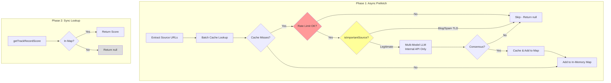

**Security Requirements** (per Security Advisor):
- LLM evaluation endpoint is **internal-only** (requires `FH_INTERNAL_RUNNER_KEY`)
- Rate limiting enforced even for authenticated callers
- Hard failure to `null` when rate limits hit (no unbounded spend)

### File Changes (Option A)

| File | Change | Lines |
|------|--------|-------|
| `apps/web/src/lib/analyzer/source-reliability.ts` | Lookup + filter + multi-model consensus | ~120 |
| `apps/web/src/app/api/internal/evaluate-source/route.ts` | New: LLM evaluation endpoint | ~80 |
| `apps/web/src/lib/source-reliability-cache.ts` | New: Simple SQLite cache | ~50 |
| **Total** | | **~250 LOC** |

### Implementation Timeline (Option A)

```
┌─────────────────────────────────────────────────────────────────────────────┐
│ DAY 1: Cache + Filter Foundation (8 hrs)                                    │
├─────────────────────────────────────────────────────────────────────────────┤
│ Morning (4 hrs)                                                             │
│ ☐ Create source-reliability-cache.ts with SQLite setup                      │
│ ☐ Add domain normalization (lowercase, strip www)                           │
│ ☐ Implement cache get/set with 90-day TTL                                   │
│                                                                             │
│ Afternoon (4 hrs)                                                           │
│ ☐ Implement isImportantSource() filter with documented heuristics           │
│ ☐ Write unit tests for filter (blog detection, TLD checking)                │
│ ☐ Verify cache operations work correctly                                    │
├─────────────────────────────────────────────────────────────────────────────┤
│ DAY 2: LLM Integration (8 hrs)                                              │
├─────────────────────────────────────────────────────────────────────────────┤
│ Morning (4 hrs)                                                             │
│ ☐ Create /api/internal/evaluate-source endpoint                             │
│ ☐ Implement single-model LLM call with structured output                    │
│ ☐ Add 0.9 confidence threshold                                              │
│                                                                             │
│ Afternoon (4 hrs)                                                           │
│ ☐ Wire up cache miss → filter → LLM flow                                    │
│ ☐ Add 90-day TTL for LLM results                                            │
│ ☐ Implement silent failure (return null on error)                           │
├─────────────────────────────────────────────────────────────────────────────┤
│ DAY 3: Integration & Testing (4-8 hrs, can be partial day)                  │
├─────────────────────────────────────────────────────────────────────────────┤
│ ☐ Integrate with orchestrated.ts pipeline                                   │
│ ☐ Test with real unknown sources (verify blogs are skipped)                 │
│ ☐ Add basic logging for LLM calls (cost tracking)                           │
│ ☐ Document "important source" heuristics                                    │
│ ☐ Deploy to development environment                                         │
└─────────────────────────────────────────────────────────────────────────────┘
```

### Key Code (Option A)

#### 1. Source Importance Filter (Configurable - per Security Advisor)

```typescript
// apps/web/src/lib/analyzer/source-reliability.ts

// CONFIGURABLE via environment variables (not hardcoded)
const DEFAULT_SKIP_PLATFORMS = 'blogspot.,wordpress.com,medium.com,substack.com,tumblr.com,wix.com,weebly.com,squarespace.com,ghost.io,blogger.com,sites.google.com,github.io,netlify.app,vercel.app,herokuapp.com';
const DEFAULT_SKIP_TLDS = 'xyz,top,club,icu,buzz,tk,ml,ga,cf,gq,work,click,link,win,download,stream';

const SKIP_PLATFORMS = (process.env.FH_SR_SKIP_PLATFORMS || DEFAULT_SKIP_PLATFORMS).split(',');
const SKIP_TLDS = (process.env.FH_SR_SKIP_TLDS || DEFAULT_SKIP_TLDS).split(',');

export function isImportantSource(domain: string): boolean {
  if (!SR_CONFIG.filterEnabled) return true;  // Filter can be disabled entirely
  
  // 1. Skip user-content platforms (configurable list)
  if (SKIP_PLATFORMS.some(p => domain.includes(p))) {
    return false;
  }
  
  // 2. Skip domains that look like personal/generated sites
  const subdomain = domain.split('.')[0];
  if (/\d{4,}/.test(subdomain)) return false;
  if (subdomain.length > 30) return false;
  
  // 3. Skip exotic/spam-associated TLDs (configurable list)
  const tld = domain.split('.').pop()?.toLowerCase() || '';
  if (SKIP_TLDS.includes(tld)) {
    return false;
  }
  
  // 4. Default: evaluate it (blacklist approach, not whitelist)
  return true;
}
```

**Filter is a cost control heuristic** (per Security Advisor):
- Lists are **configurable** via environment variables, not hardcoded
- Treated as an **ops tuning knob**, not a truth claim about source quality
- Can be disabled entirely with `FH_SR_FILTER_ENABLED=false`
- **Skip exotic TLDs**: `.xyz`, `.tk`, etc. are associated with spam/low-quality sites
- **Skip suspicious patterns**: Domains with many numbers or very long subdomains

#### 2. Configuration

```typescript
// apps/web/src/lib/analyzer/source-reliability.ts

const SR_CONFIG = {
  enabled: process.env.FH_SR_ENABLED !== 'false',
  confidenceThreshold: parseFloat(process.env.FH_SR_CONFIDENCE_THRESHOLD || '0.8'),
  cacheTtlDays: parseInt(process.env.FH_SR_CACHE_TTL_DAYS || '90', 10),
  multiModel: process.env.FH_SR_MULTI_MODEL !== 'false',
  consensusThreshold: parseFloat(process.env.FH_SR_CONSENSUS_THRESHOLD || '0.15'),
  filterEnabled: process.env.FH_SR_FILTER_ENABLED !== 'false',
  rateLimitPerIp: parseInt(process.env.FH_SR_RATE_LIMIT_PER_IP || '10', 10),
  domainCooldownSec: parseInt(process.env.FH_SR_RATE_LIMIT_DOMAIN_COOLDOWN || '60', 10),
};
```

#### 3. Batch Prefetch (Async - before analysis)

```typescript
// apps/web/src/lib/analyzer/source-reliability.ts

// In-memory map populated by prefetch, used for sync lookups
let prefetchedScores: Map<string, number | null> = new Map();

/**
 * Prefetch scores for all source URLs before analysis begins.
 * This is the ONLY async call - keeps analyzer hot path synchronous.
 */
export async function prefetchSourceReliability(urls: string[]): Promise<void> {
  if (!SR_CONFIG.enabled) return;
  
  const domains = urls.map(extractDomain).filter(Boolean) as string[];
  const uniqueDomains = [...new Set(domains)];
  
  // Batch cache lookup
  const cached = await cache.batchGet(uniqueDomains);
  
  for (const domain of uniqueDomains) {
    if (cached.has(domain)) {
      prefetchedScores.set(domain, cached.get(domain)!);
      continue;
    }
    
    // Cache miss - evaluate if important and rate limit allows
    if (!isImportantSource(domain)) {
      prefetchedScores.set(domain, null);
      continue;
    }
    
    if (!checkRateLimit(domain)) {
      prefetchedScores.set(domain, null);  // Hard fail - no evaluation
      continue;
    }
    
    // LLM evaluation (internal API only)
    const result = await evaluateSourceInternal(domain);
    prefetchedScores.set(domain, result?.score ?? null);
  }
}
```

#### 4. Sync Lookup (During analysis - no async)

```typescript
/**
 * Synchronous lookup from prefetched map.
 * MUST call prefetchSourceReliability() before analysis.
 */
export function getTrackRecordScore(url: string): number | null {
  if (!SR_CONFIG.enabled) return null;
  
  const domain = extractDomain(url);
  if (!domain) return null;
  
  // Sync lookup from prefetched map only
  return prefetchedScores.get(domain) ?? null;
}
```

#### 4. Multi-Model Consensus

```typescript
// apps/web/src/lib/analyzer/source-reliability.ts

async function evaluateWithConsensus(domain: string): Promise<EvaluationResult | null> {
  // Run both models in parallel
  const [claude, gpt] = await Promise.all([
    evaluateWithModel(domain, 'anthropic', 'claude-3-haiku-20240307'),
    evaluateWithModel(domain, 'openai', 'gpt-4o-mini'),
  ]);
  
  // Both must succeed
  if (!claude || !gpt) {
    console.warn(`[SourceReliability] Model failed for ${domain}`);
    return null;
  }
  
  // Check consensus: scores must be within threshold
  const scoreDiff = Math.abs(claude.score - gpt.score);
  if (scoreDiff > SR_CONFIG.consensusThreshold) {
    console.warn(`[SourceReliability] No consensus for ${domain}: Claude=${claude.score}, GPT=${gpt.score}`);
    return null;  // Models disagree too much
  }
  
  // Consensus reached - use average score, minimum confidence
  return {
    score: (claude.score + gpt.score) / 2,
    confidence: Math.min(claude.confidence, gpt.confidence),
    reasoning: `Consensus: Claude=${claude.score.toFixed(2)}, GPT=${gpt.score.toFixed(2)}`,
  };
}
```

#### 4. LLM Evaluation Endpoint

```typescript
// apps/web/src/app/api/internal/evaluate-source/route.ts

import { generateObject } from 'ai';
import { anthropic } from '@ai-sdk/anthropic';
import { z } from 'zod';

const EvaluationSchema = z.object({
  score: z.number().min(0.1).max(0.95),
  confidence: z.number().min(0.1).max(0.95),
  reasoning: z.string().max(300),
});

export async function POST(request: Request) {
  const { domain } = await request.json();
  
  const { object } = await generateObject({
    model: anthropic('claude-3-haiku-20240307'),  // Cost-effective
    schema: EvaluationSchema,
    prompt: `Evaluate the reliability of ${domain} as a news source.
             Score 0.1-0.95 based on factual accuracy and journalistic standards.
             Be conservative - if unsure, use low confidence.`,
  });
  
  return Response.json(object);
}
```

### Weekly Admin Tasks (15 min)

| Task | Time | Frequency |
|------|------|-----------|
| Check LLM cost dashboard | 5 min | Weekly |
| Spot-check 2-3 recent LLM scores | 8 min | Weekly |
| Review any flagged issues | 2 min | Weekly |

### Success Metrics (Option A: Pure LLM + Cache)

| Metric | Target | How to Measure |
|--------|--------|----------------|
| Cache hit rate (warm) | > 80% | After first week of operation |
| LLM evaluation rate | ~40-50% | Legitimate outlets only (blogs skipped) |
| LLM cost | < $60/month | Multi-model is ~3x single-model |
| Blog skip rate | > 90% | Log analysis: `skipped / total_requests` |
| Confidence pass rate | > 85% | At default threshold 0.8 |
| Consensus rate | > 90% | Models should agree most of the time |

**Cost projection (with multi-model consensus):**
- Week 1: ~$50-70 (cold cache, many LLM calls, 2 models)
- Week 2+: ~$15-20/week (cache warming)
- Steady state: ~$40-60/month (mostly cache hits)

**Why multi-model consensus is worth the extra cost:**
1. **Reduces hallucination** - One model can hallucinate, two agreeing is more reliable
2. **Reduces circular reasoning** - Different training data = different biases
3. **Higher confidence** - When models agree, the score is more trustworthy
4. **Flags edge cases** - Disagreement means "return null" not "guess"

### Rollback Plan

If Option A doesn't work out:

| Issue | Action |
|-------|--------|
| LLM costs too high | Set `FH_SR_MULTI_MODEL=false` (single-model, ~50% cost reduction) |
| Still too expensive | Reduce `isImportantSource()` scope, or set `FH_SR_ENABLED=false` |
| Too many hallucinations | Raise `FH_SR_CONFIDENCE_THRESHOLD` to 0.9 |
| Low consensus rate | Lower `FH_SR_CONSENSUS_THRESHOLD` to 0.20 (allow more disagreement) |
| Admin time exceeds 30 min/week | Consider Option B (full auto) or Option A (no LLM) |

---

## Implementation Options (All Options Reference)

> **Note**: Option A is the Project Leader's recommended choice. The sections below document all options for reference and future consideration.

The Project Lead review raised concerns about admin workload and over-engineering. Three implementation options are available:

### Option A: Pure LLM + Cache - **RECOMMENDED**

See [Detailed Implementation Plan](#option-a-detailed-implementation-plan-project-leaders-choice) above for full details.

**Summary**: Multi-model LLM evaluation with importance filter (skips blogs/spam). No pre-seeded data.

---

### Option B: Simplified Automatic (Zero Admin)

**Scope**: Single-model LLM evaluation on cache miss, fully automatic, no importance filter.

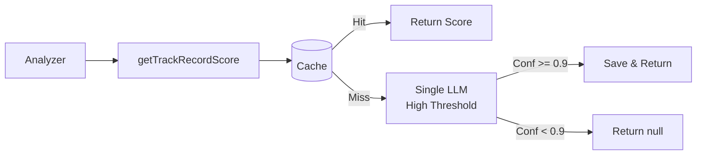

**Implementation**:

```typescript
// ~150 lines of code total (simpler than Option A - no filter, single model)
export async function getTrackRecordScore(url: string): Promise<number | null> {
  const domain = extractDomain(url);
  
  // Check cache first
  const cached = await cache.get(domain);
  if (cached) return cached.score;
  
  // Automatic LLM evaluation (single model, high threshold)
  try {
    const result = await evaluateSourceAuto(domain);
    if (result.confidence >= 0.9) {
      await cache.set(domain, result.score, { ttl: '90d' });
      return result.score;
    }
  } catch (err) {
    // Silent failure - return unknown
  }
  
  return null;
}
```

| Metric | Value |
|--------|-------|
| **Lines of Code** | ~150 |
| **Time to Ship** | 2 days |
| **Admin Time/Week** | 0 min |
| **LLM Cost/Month** | $20-50 (higher - no filter) |
| **Source Coverage** | Full dynamic (evaluates everything) |

**When to Choose**:
- Admin time is constrained (zero tolerance for manual work)
- Accept some hallucination risk
- Budget allows $20-50/month LLM costs

**Trade-offs**:
- Pro: Zero ongoing admin work
- Con: No human oversight of LLM evaluations
- Con: Hallucination risk (mitigated by 0.9 confidence threshold)

---

### Option A: Pure LLM + Cache - **RECOMMENDED**

**See [Detailed Implementation Plan](#option-a-detailed-implementation-plan-project-leaders-choice) above for full architecture, code, and configuration.**

| Metric | Value |
|--------|-------|
| **Lines of Code** | ~250 |
| **Time to Ship** | 2 days |
| **Admin Time/Week** | ~15 min |
| **LLM Cost/Month** | $40-60 |

**Key Features**: Multi-model consensus, importance filter (skips blogs/spam), configurable thresholds.
- Balance between automation and neutrality

**Trade-offs**:
- Pro: Lower LLM costs than Option B (skips junk sources)
- Pro: More coverage than Option A (fills important gaps)
- Pro: Simple "importance" heuristics are transparent
- Con: Needs definition of "important source" (but transparent)
- Con: Some admin oversight recommended (but minimal)

**"Important Source" Heuristics** (customizable):

| Rule | Rationale |
|------|-----------|
| Skip `blogspot.*`, `wordpress.com` | Personal blogs rarely need scoring |
| Skip `medium.com`, `substack.com` | Individual authors, not outlets |
| Skip exotic TLDs (`.xyz`, `.blog`) | Unlikely to be major news sources |
| Allow `.com`, `.org`, `.net`, `.edu`, `.gov` | Standard news outlet TLDs |
| Allow country TLDs (`.uk`, `.de`, `.fr`) | International news outlets |

---

### Option C: Full Proposal (Detailed Below)

**Scope**: Complete implementation with multi-model consensus, admin workflows, monitoring.

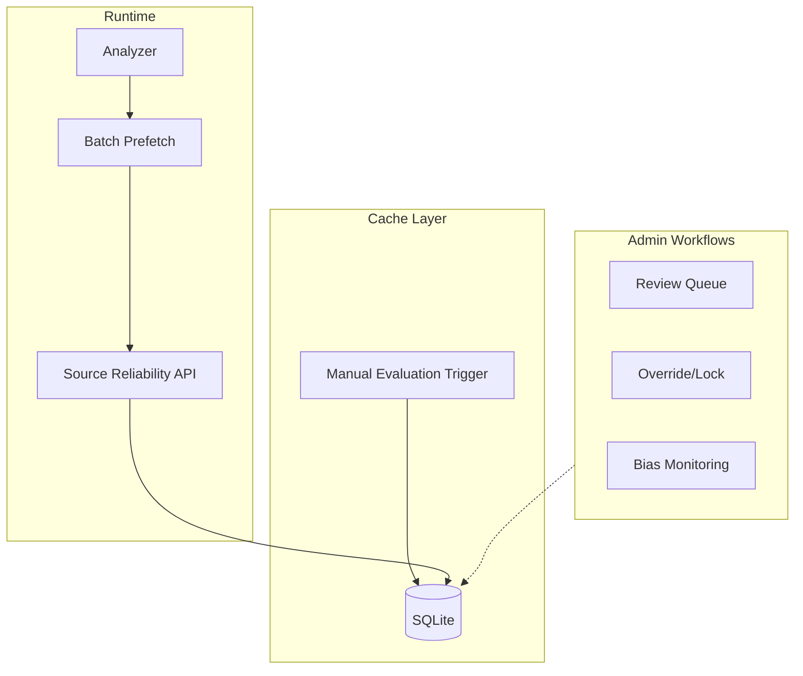

| Metric | Value |
|--------|-------|
| **Lines of Code** | ~1,800 |
| **Time to Ship** | 2-3 weeks |
| **Admin Time/Week** | 180-240 min |
| **LLM Cost/Month** | $1-44 |
| **Source Coverage** | Dynamic + human oversight |

**When to Choose**:
- Team has 5+ people
- Can dedicate 3-4 hrs/week to source reliability admin
- Source reliability is core differentiator
- Regulatory/compliance requires audit trail

**Prerequisites** (per Project Lead):
- [ ] Assign dedicated owner (3-4 hrs/week commitment)
- [ ] Set LLM budget ($100/month safety limit)
- [ ] Create admin runbook
- [ ] Plan quarterly review (is this worth the effort?)

---

### Comparison Matrix

| Aspect | Option A (Pure LLM) | Option B (Zero Admin) | Option C (Full) |
|--------|---------------------|----------------------|-----------------|
| **Complexity** | ~250 LOC | ~150 LOC | ~1,800 LOC |
| **Admin Burden** | 15 min/week | None | 3-4 hrs/week |
| **Coverage** | Selective dynamic | Full dynamic | Dynamic + oversight |
| **Hallucination Risk** | Low (multi-model) | Medium (single-model) | Low (multi-model + review) |
| **Cost (Monthly)** | $40-60 | $20-50 | $40-60 |
| **Audit Trail** | Basic | Basic | Comprehensive |
| **Recommended For** | **Small teams** | Zero-admin | Enterprise |

### Decision Framework

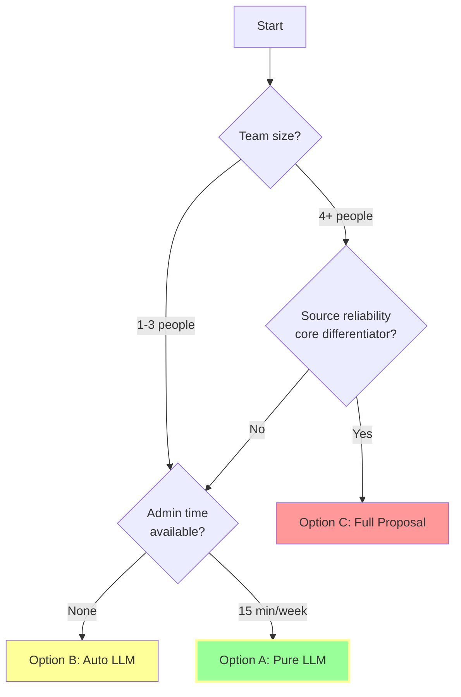

**Recommendation**: For most teams, **Option A (Pure LLM + Cache)** offers the best balance of neutrality, coverage, and cost.

---

## Design Principles (Per Review Feedback)

### Source Reliability Principles

These principles align with AGENTS.md "Generic by Design" requirements:

1. **No Categorical Bias**: Domain type (.gov, .edu, .org) does NOT imply quality
2. **Evidence-Based Only**: Scores derived from demonstrated track record, not institutional prestige
3. **Editorial Independence Matters**: State control/capture is a negative reliability factor
4. **Multi-Model Consensus**: LLM evaluations require 2+ model agreement (score range < 0.15)
5. **Hallucination Prevention**: LLMs must cite specific evidence, not pattern-match domain names

### Score Scale Contract

**Canonical scale: 0.0-1.0 everywhere**

- All stored scores use decimal 0.0-1.0
- LLM evaluations stored as 0.0-1.0
- API responses use 0.0-1.0
- In-memory caches use 0.0-1.0
- Rounding: 3 decimal places (e.g., 0.825)

### Security Principles (Per Security Review)

1. **HTTPS Required**: All endpoints must be served over HTTPS (admin keys in headers)
2. **Defense in Depth**: Multiple layers of validation (admin key + rate limiting + domain sanitization)
3. **Least Privilege**: Public endpoints are lookup-only, evaluation requires admin key
4. **Input Validation**: All domain inputs validated with regex, reject injection patterns
5. **Audit Everything**: All evaluations logged with truncated prompts (no sensitive data)

---

## Architecture Overview

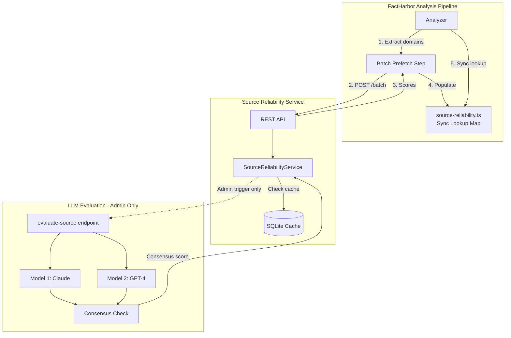

### Key Architecture Decisions (Per Review)

| Decision | Choice | Rationale |
|----------|--------|-----------|
| Integration | Same ASP.NET API, separate DB | Simpler ops, adequate for expected load |
| Sync vs Async | **Keep sync lookup**, add batch prefetch | Avoids refactoring orchestrated pipeline |
| LLM Trigger | **Admin/internal only**, never on cache-miss | Prevents cost runaway, abuse |
| Multi-Model | **Required** (2+ models, score range < 0.15) | Reduces circular reasoning risk |
| Confidence Threshold | **0.8** (raised from 0.5) | Only high-confidence scores used |

---

## Data Model

### SourceReliabilityEntity (Primary Cache)

```csharp
public class SourceReliabilityEntity
{
    [Key]
    [MaxLength(255)]
    public string Domain { get; set; }           // Lowercase, no www prefix
    
    public decimal Score { get; set; }           // 0.0-1.0 (3 decimal places)
    public decimal Confidence { get; set; }      // 0.0-1.0
    
    [MaxLength(50)]
    public string Category { get; set; }         // news, academic, government, blog, unknown
    
    // NEW: Per architect review - track editorial independence
    [MaxLength(50)]
    public string? EditorialIndependence { get; set; } // independent, government-controlled, corporate-owned, party-affiliated, unknown
    
    [MaxLength(20)]
    public string? BiasIndicator { get; set; }   // left, center-left, center, center-right, right
    
    [MaxLength(500)]
    public string Reasoning { get; set; }        // LLM explanation
    
    // NEW: Evidence basis for hallucination prevention
    [MaxLength(1000)]
    public string? EvidenceBasis { get; set; }   // JSON: canCiteSpecificArticles, knownControversies, etc.
    
    [MaxLength(50)]
    public string EvaluationSource { get; set; } // LLM_EVALUATION, ADMIN_OVERRIDE
    
    public DateTime EvaluatedAt { get; set; }
    public DateTime ExpiresAt { get; set; }
    public bool IsLocked { get; set; }           // Admin-locked entries skip re-evaluation
    
    public DateTime CreatedAt { get; set; }
    public DateTime UpdatedAt { get; set; }
}
```

### SourceEvaluationLogEntity (Audit Trail)

```csharp
public class SourceEvaluationLogEntity
{
    [Key]
    public Guid Id { get; set; }
    
    [MaxLength(255)]
    public string Domain { get; set; }
    
    public decimal? PreviousScore { get; set; }
    public decimal? NewScore { get; set; }       // Nullable: null if consensus failed
    
    [MaxLength(50)]
    public string EvaluationSource { get; set; }
    
    [MaxLength(100)]
    public string? EvaluationReason { get; set; } // LLM_EVALUATION, MODEL_DISAGREEMENT, LOW_CONFIDENCE, etc.
    
    // Multi-model tracking (per architect review)
    [MaxLength(200)]
    public string? ModelsUsed { get; set; }      // JSON: ["claude-3-opus", "gpt-4"]
    
    public decimal? ScoreRange { get; set; }     // Max - Min across models
    public decimal? ScoreVariance { get; set; }  // Statistical variance
    
    [MaxLength(500)]
    public string? IndividualScores { get; set; } // JSON: {"claude-3-opus": 0.75, "gpt-4": 0.82}
    
    // LLM-specific fields (truncated for storage efficiency per lead dev review)
    [MaxLength(100)]
    public string? LlmModel { get; set; }        // Primary model used
    
    [MaxLength(200)]
    public string? PromptVersion { get; set; }   // Hash or version ID (not full prompt)
    
    public int? TokensUsed { get; set; }
    public int DurationMs { get; set; }
    
    public DateTime CreatedAt { get; set; }
}
```

### Database Indexes

```csharp
modelBuilder.Entity<SourceReliabilityEntity>(e =>
{
    e.HasKey(x => x.Domain);
    e.HasIndex(x => x.ExpiresAt);
    e.HasIndex(x => x.EvaluationSource);
    e.HasIndex(x => x.Confidence);
    e.HasIndex(x => x.EditorialIndependence);    // NEW: For bias monitoring
});

modelBuilder.Entity<SourceEvaluationLogEntity>(e =>
{
    e.HasKey(x => x.Id);
    e.HasIndex(x => x.Domain);
    e.HasIndex(x => x.CreatedAt);
    e.HasIndex(x => x.EvaluationReason);         // NEW: For review queues
});
```

### Domain Normalization Rules (REVISED - With Security Validation)

Per lead developer and security reviews, normalization must include validation:

```csharp
public static string NormalizeDomain(string domain)
{
    // Security: Reject null/empty
    if (string.IsNullOrWhiteSpace(domain))
        throw new ArgumentException("Domain cannot be empty", nameof(domain));
    
    // Security: Reject obvious injection patterns (per security review)
    if (domain.Contains("'") || domain.Contains("--") || domain.Contains(";"))
        throw new ArgumentException("Invalid domain format", nameof(domain));
    
    // Security: Validate domain format with regex
    if (!Regex.IsMatch(domain, @"^[a-zA-Z0-9]([a-zA-Z0-9-]{0,61}[a-zA-Z0-9])?(\.[a-zA-Z0-9]([a-zA-Z0-9-]{0,61}[a-zA-Z0-9])?)*$"))
        throw new ArgumentException("Invalid domain format", nameof(domain));
    
    // 1. Lowercase
    domain = domain.ToLowerInvariant();
    
    // 2. Strip www prefix
    if (domain.StartsWith("www."))
        domain = domain[4..];
    
    // 3. Strip trailing dots
    domain = domain.TrimEnd('.');
    
    // Security: Enforce max length (DNS limit is 253)
    if (domain.Length > 253)
        throw new ArgumentException("Domain too long", nameof(domain));
    
    return domain;
}
```

**Test Cases Required** (per security review):
```csharp
Assert.Throws<ArgumentException>(() => NormalizeDomain("example.com'; DROP TABLE--"));
Assert.Throws<ArgumentException>(() => NormalizeDomain("../../etc/passwd"));
Assert.Throws<ArgumentException>(() => NormalizeDomain("<script>alert(1)</script>"));
```

**Subdomain Policy**: Exact match only. `news.bbc.com` is distinct from `bbc.com`.
- If no exact match, fall back to checking parent domain
- LLM evaluations should consider the specific subdomain

---

## API Design

### Endpoints

#### GET /v1/source-reliability (Public - Lookup Only)

**Lookup only - NEVER triggers evaluation** (per lead dev review)

```
GET /v1/source-reliability?domain=reuters.com
```

**Response (200 OK)**:
```json
{
  "domain": "reuters.com",
  "score": 0.920,
  "confidence": 0.950,
  "category": "news",
  "editorialIndependence": "independent",
  "biasIndicator": "center",
  "reasoning": "Major international news agency with strong editorial standards and fact-checking processes...",
  "source": "LLM_EVALUATION",
  "expiresAt": "2026-04-21T00:00:00Z",
  "isLocked": false
}
```

**Response (200 OK) - Unknown source**:
```json
{
  "domain": "unknown-blog.example",
  "score": null,
  "reason": "UNKNOWN_SOURCE",
  "message": "Source not in database. Admin evaluation required."
}
```

#### POST /v1/source-reliability/batch (Public - Lookup Only)

**Changed to POST** per lead dev review to avoid URL length limits.

```
POST /v1/source-reliability/batch
Content-Type: application/json

{
  "domains": ["reuters.com", "bbc.com", "unknown-blog.example"]
}
```

**Response**:
```json
{
  "results": [
    { "domain": "reuters.com", "score": 0.920, "confidence": 0.950, ... },
    { "domain": "bbc.com", "score": 0.880, "confidence": 0.900, ... }
  ],
  "unknowns": [
    { "domain": "unknown-blog.example", "reason": "UNKNOWN_SOURCE" }
  ]
}
```

#### POST /v1/source-reliability/evaluate (Internal/Admin Only)

**Protected by X-Admin-Key** - the ONLY way to trigger LLM evaluation.

```
POST /v1/source-reliability/evaluate
X-Admin-Key: <admin_key>
Content-Type: application/json

{
  "domain": "example.com",
  "force": false,
  "priority": "standard"
}
```

**Response**:
```json
{
  "domain": "example.com",
  "status": "evaluated",
  "score": 0.720,
  "confidence": 0.850,
  "consensusReached": true,
  "modelsUsed": ["claude-3-opus", "gpt-4"],
  "scoreRange": 0.08,
  "evaluationId": "a1b2c3d4-..."
}
```

**Response - Consensus Failed**:
```json
{
  "domain": "controversial-outlet.com",
  "status": "no_consensus",
  "score": null,
  "consensusReached": false,
  "modelsUsed": ["claude-3-opus", "gpt-4"],
  "scoreRange": 0.22,
  "individualScores": { "claude-3-opus": 0.65, "gpt-4": 0.87 },
  "evaluationId": "a1b2c3d4-...",
  "message": "Model disagreement too high. Flagged for human review."
}
```

#### PUT /v1/source-reliability/override (Admin Only)

```
PUT /v1/source-reliability/override
X-Admin-Key: <admin_key>
Content-Type: application/json

{
  "domain": "example.com",
  "score": 0.75,
  "confidence": 1.0,
  "editorialIndependence": "independent",
  "reasoning": "Manual review determined moderate reliability",
  "lock": true
}
```

#### POST /v1/source-reliability/admin/cleanup-logs (Admin Only)

**NEW - Per security review**: Audit log cleanup endpoint.

```
POST /v1/source-reliability/admin/cleanup-logs
X-Admin-Key: <admin_key>
Content-Type: application/json

{
  "cutoffDate": "2025-10-21T00:00:00Z"
}
```

**Response**:
```json
{
  "deletedCount": 1250,
  "cutoffDate": "2025-10-21T00:00:00Z"
}
```

#### GET /v1/source-reliability/stats

**Enhanced per architect review** with bias monitoring:

```json
{
  "totalSources": 4832,
  "bySource": {
    "LLM_EVALUATION": 812,
    "ADMIN_OVERRIDE": 20
  },
  "lowConfidenceCount": 45,
  "expiredCount": 12,
  "hitRate": 0.94,
  
  "evaluationQuality": {
    "modelDisagreementRate": 0.08,
    "modelDisagreementCount": 25,
    "lowConfidenceRate": 0.12,
    "adminOverrideRate": 0.04,
    
    "avgScoreByCategory": {
      "government": 0.58,
      "academic": 0.79,
      "news": 0.73,
      "corporate": 0.61,
      "blog": 0.48
    },
    
    "editorialIndependence": {
      "independent": 3200,
      "government-controlled": 180,
      "corporate-owned": 950,
      "party-affiliated": 45,
      "unknown": 457
    }
  }
}
```

---

## LLM Evaluation Design

### Prompt Template (REVISED - No Categorical Bias)

Per architect review, removed all domain-type scoring guidelines:

```typescript
const EVALUATE_SOURCE_PROMPT = `
You are evaluating this source's demonstrated reliability. Score based ONLY on evidence of behavior.

## Source to Evaluate
- Domain: {domain}
- Full URL (if available): {url}

## Evaluation Criteria (Evidence-Based Only)

1. **Factual Accuracy Track Record**
   - Documented history of accurate vs. inaccurate reporting
   - Frequency of corrections needed
   - Third-party fact-check results

2. **Source Attribution Quality**
   - Does it cite primary sources?
   - Are claims verifiable?
   - Links to original documents/data?

3. **Editorial Independence**
   - Is it government-controlled or politically directed?
   - Financial conflicts of interest?
   - Transparent ownership structure?

4. **Correction Practices**
   - Does it transparently correct errors?
   - Retraction policies documented?
   - Accountability mechanisms?

5. **Verification Methodology**
   - Multi-source verification?
   - Fact-checking process disclosed?
   - Editorial review standards?

## CRITICAL: What NOT to Do

DO NOT give bonus points for domain type (.gov, .edu, .org)
DO NOT assume government = reliable
DO NOT assume academic affiliation = rigorous
DO NOT use institutional prestige as proxy for accuracy

INSTEAD: Assess this specific outlet's demonstrated behaviors
Consider independence from political/commercial pressure
Evaluate transparency and accountability

## Examples of Correct Reasoning

BAD: "This is a .gov site, so score 0.80"
GOOD: "This agency has a documented track record of transparent data publication with frequent corrections when errors are found. Score 0.82 based on demonstrated practices."

BAD: "This is from a university, so score 0.90"
GOOD: "This is a student blog hosted on university servers, not peer-reviewed research. Score 0.55 based on lack of editorial oversight."

BAD: "Government health ministry, score 0.85"
GOOD: "This health ministry has documented cases of suppressing unfavorable research and lacks editorial independence. Score 0.35 based on demonstrated political interference."

## Response Requirements

You MUST provide specific evidence for your assessment. If you cannot cite specific examples or track record, set knownSource=false.

Respond with JSON only:
`;
```

### Response Schema (REVISED - With Evidence Basis)

```typescript
const EVALUATION_SCHEMA = z.object({
  score: z.number().min(0.05).max(0.95),
  confidence: z.number().min(0.1).max(0.95),
  
  category: z.enum([
    "news", 
    "academic", 
    "government", 
    "corporate", 
    "blog", 
    "social_media", 
    "unknown"
  ]),
  
  // NEW: Track editorial independence explicitly
  editorialIndependence: z.enum([
    "independent",
    "government-controlled",
    "corporate-owned",
    "party-affiliated",
    "unknown"
  ]),
  
  // NEW: Require evidence basis (per architect review)
  evidenceBasis: z.object({
    hasTrainingDataKnowledge: z.boolean(),
    canCiteSpecificArticles: z.boolean(),
    specificExamples: z.array(z.string()).max(2),
    knownControversies: z.array(z.string()).max(3),
    knownHistory: z.string().max(200),
  }),
  
  biasIndicator: z.enum([
    "left", 
    "center-left", 
    "center", 
    "center-right", 
    "right"
  ]).nullable(),
  
  reasoning: z.string().max(500),
  knownSource: z.boolean(),
});
```

### Prompt Injection Prevention (NEW - Per Security Review)

Sanitize domain and URL inputs before inserting into LLM prompts:

```typescript
function sanitizeDomainForPrompt(domain: string): string {
    // Remove potential prompt injection patterns
    return domain
        .replace(/\n/g, ' ')                    // Remove newlines
        .replace(/IGNORE|SYSTEM|ADMIN/gi, '')   // Remove trigger words
        .replace(/[^\w\.-]/g, '')               // Allow only domain-safe chars
        .substring(0, 253);                     // Enforce max length
}

function sanitizeUrlForPrompt(url: string): string {
    try {
        const parsed = new URL(url);
        // Only include scheme, host, and path (no query params - may contain injection)
        return `${parsed.protocol}//${parsed.host}${parsed.pathname}`;
    } catch {
        return '[Invalid URL]';
    }
}
```

**Additional Defense**: The use of `generateObject()` with Zod schema (structured output) provides strong defense - injection attempts that try to return plaintext will fail validation.

### Multi-Model Consensus (NEW - Per Architect Review)

```typescript
const EVALUATION_MODELS = [
  { provider: 'anthropic', model: 'claude-3-opus-20240229', name: 'claude-3-opus' },
  { provider: 'openai', model: 'gpt-4-0125-preview', name: 'gpt-4' },
];

async function evaluateWithConsensus(domain: string): Promise<EvaluationResult> {
  // Sanitize input before prompt (per security review)
  const safeDomain = sanitizeDomainForPrompt(domain);
  
  // Run evaluations in parallel
  const evaluations = await Promise.all(
    EVALUATION_MODELS.map(async ({ provider, model, name }) => {
      try {
        const result = await generateObject({
          model: provider(model),
          schema: EVALUATION_SCHEMA,
          prompt: EVALUATE_SOURCE_PROMPT(domain),
          temperature: 0.3,
        });
        return { name, ...result.object };
      } catch (error) {
        console.error(`[${name}] Evaluation failed:`, error);
        return null;
      }
    })
  );
  
  const validEvaluations = evaluations.filter(e => e !== null);
  
  // Require at least 2 successful model responses
  if (validEvaluations.length < 2) {
    return { 
      score: null, 
      stored: true,
      reason: "INSUFFICIENT_MODEL_RESPONSES",
      modelsAttempted: EVALUATION_MODELS.length,
      modelsSucceeded: validEvaluations.length
    };
  }
  
  // Check for consensus (score range must be < 0.15)
  const scores = validEvaluations.map(e => e.score);
  const scoreRange = Math.max(...scores) - Math.min(...scores);
  
  if (scoreRange > 0.15) {
    return {
      score: null,
      stored: true,
      reason: "MODEL_DISAGREEMENT",
      scoreRange,
      individualScores: Object.fromEntries(
        validEvaluations.map(e => [e.name, e.score])
      ),
      message: "Flagged for human review"
    };
  }
  
  // Consensus reached - use median score
  const medianScore = calculateMedian(scores);
  const consensusConfidence = Math.min(...validEvaluations.map(e => e.confidence));
  
  // Apply enhanced gating
  const gatingResult = applyEnhancedGating(
    validEvaluations[0],
    medianScore,
    consensusConfidence
  );
  
  if (!gatingResult.passed) {
    return {
      score: null,
      stored: true,
      reason: gatingResult.reason,
      confidence: consensusConfidence
    };
  }
  
  return {
    score: medianScore,
    confidence: consensusConfidence,
    stored: true,
    reason: "MULTI_MODEL_CONSENSUS",
    modelsUsed: validEvaluations.map(e => e.name),
    scoreRange,
    ...validEvaluations[0]  // Use first evaluation's metadata
  };
}
```

### Enhanced Gating Logic (REVISED - Per Both Reviews)

```typescript
function applyEnhancedGating(
  evaluation: any,
  score: number,
  confidence: number
): { passed: boolean; reason?: string } {
  
  // Gate 1: Must have specific evidence (per architect review)
  if (!evaluation.evidenceBasis?.canCiteSpecificArticles) {
    return { passed: false, reason: "INSUFFICIENT_EVIDENCE" };
  }
  
  // Gate 2: High score without controversies = hallucination risk
  if (score > 0.75 && 
      (evaluation.evidenceBasis?.knownControversies?.length || 0) === 0) {
    return { passed: false, reason: "SUSPICIOUSLY_HIGH_SCORE_WITHOUT_EVIDENCE" };
  }
  
  // Gate 3: Confidence threshold RAISED to 0.8 (per lead dev review)
  if (confidence < 0.8) {
    return { passed: false, reason: "LOW_CONFIDENCE_LLM_EVALUATION" };
  }
  
  // Gate 4: Unknown source flag
  if (!evaluation.knownSource) {
    return { passed: false, reason: "LLM_UNKNOWN_SOURCE" };
  }
  
  // Gate 5: Penalize inferred knowledge
  if (!evaluation.evidenceBasis?.hasTrainingDataKnowledge) {
    return { passed: false, reason: "INFERRED_KNOWLEDGE_ONLY" };
  }
  
  return { passed: true };
}
```

---

## Integration Strategy (REVISED - Batch Prefetch)

Per lead developer review: **Keep `getTrackRecordScore()` synchronous**, add batch prefetch step.

### Batch Prefetch Function (NEW)

```typescript
// apps/web/src/lib/analyzer/source-reliability.ts

const SR_SERVICE_URL = process.env.FH_SR_SERVICE_URL || 'http://localhost:5000';

// In-memory lookup map (populated by prefetch, used by sync lookup)
let sourceScoreMap: Map<string, number | null> = new Map();

/**
 * Prefetch source reliability scores for a batch of URLs.
 * Call this ONCE early in analysis, before any sync lookups.
 */
export async function prefetchSourceScores(urls: string[]): Promise<void> {
  const domains = [...new Set(
    urls.map(extractDomain).filter((d): d is string => d !== null)
  )];
  
  if (domains.length === 0) return;
  
  try {
    const response = await fetch(
      `${SR_SERVICE_URL}/v1/source-reliability/batch`,
      {
        method: 'POST',
        headers: { 'Content-Type': 'application/json' },
        body: JSON.stringify({ domains }),
        signal: AbortSignal.timeout(10000),
      }
    );
    
    if (response.ok) {
      const data = await response.json();
      
      // Populate lookup map with results
      for (const result of data.results) {
        sourceScoreMap.set(result.domain, result.score);
      }
      
      // Mark unknowns explicitly
      for (const unknown of data.unknowns) {
        sourceScoreMap.set(unknown.domain, null);
      }
      
      console.log(`[SourceReliability] Prefetched ${data.results.length} scores, ${data.unknowns.length} unknowns`);
    }
  } catch (err) {
    console.warn(`[SourceReliability] Batch prefetch failed, falling back to local bundle:`, err);
  }
}

/**
 * Get track record score for a URL.
 * SYNCHRONOUS - uses prefetched data or falls back to local bundle.
 */
export function getTrackRecordScore(url: string): number | null {
  const domain = extractDomain(url);
  if (!domain) return null;
  
  // 1. Check prefetched scores
  if (sourceScoreMap.has(domain)) {
    return sourceScoreMap.get(domain) ?? null;
  }
  
  // 2. Fallback to local bundle (graceful degradation)
  return SOURCE_TRACK_RECORDS[domain] ?? null;
}

/**
 * Clear prefetched scores (call between analysis runs)
 */
export function clearSourceScoreCache(): void {
  sourceScoreMap.clear();
}

function extractDomain(url: string): string | null {
  try {
    return new URL(url).hostname.replace(/^www\./, '').toLowerCase();
  } catch {
    return null;
  }
}
```

### Integration Point in Orchestrated Pipeline

```typescript
// In orchestrated.ts - early in analysis run

// Step: Prefetch source reliability scores
const sourceUrls = searchResults.map(r => r.url);
await prefetchSourceScores(sourceUrls);

// ... later, during source fetching (sync lookup works as before)
const fetchedSource: FetchedSource = {
  id: sourceId,
  url: source.url,
  trackRecordScore: getTrackRecordScore(source.url),  // Still sync!
  // ...
};
```

---

## Operational Flows

### Flow 1: Unknown Source Request (Analysis Pipeline)

When FactHarbor encounters a source that's **not in the database**, the system follows a **graceful degradation** approach - it does NOT trigger LLM evaluation automatically (to prevent cost runaway and abuse).

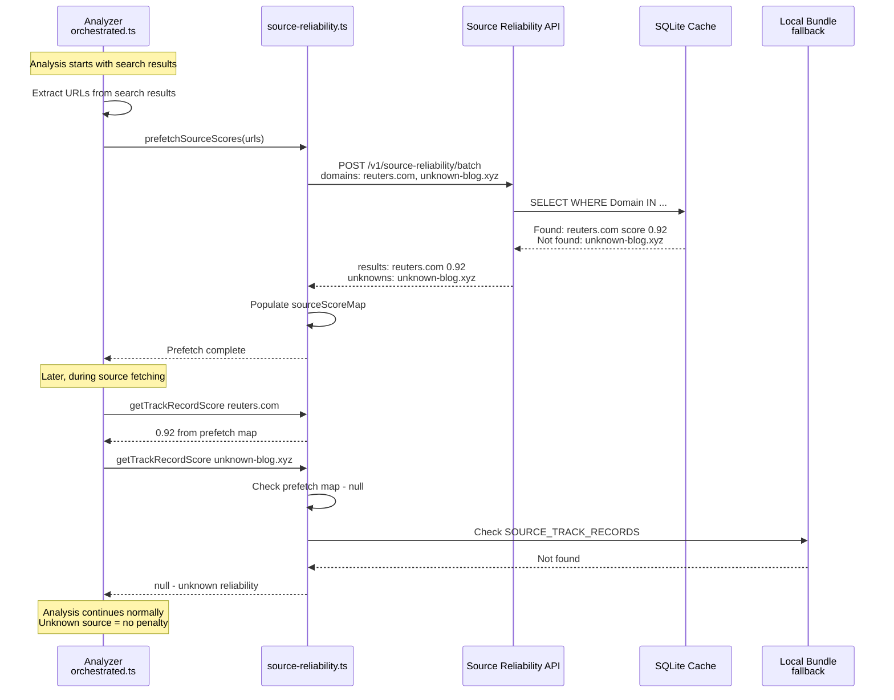

#### Key Behaviors

| Aspect | Behavior |
|--------|----------|
| **Unknown Source** | Returns `null`, NOT an error |
| **LLM Evaluation** | **Never triggered automatically** - admin only |
| **Analysis Impact** | Continues normally; unknown = neutral (no penalty) |
| **Cost** | Zero - no LLM calls for lookups |
| **Fallback** | If API down, falls back to local bundle |

#### Why This Design?

1. **Cost Control**: Automatic LLM calls could be exploited (submit garbage URLs → trigger expensive calls)
2. **Latency**: LLM evaluation takes 5-15 seconds - would block analysis
3. **Security**: Public endpoints should never trigger costly operations
4. **Predictability**: Analysis always completes in bounded time

---

## Admin Use Cases

Admins have several responsibilities in the Source Reliability Service. LLM evaluation can ONLY be triggered by admin action.

### Admin Workflow Overview

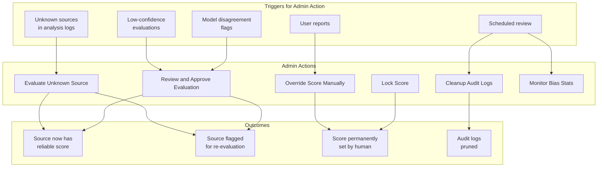

### Use Case 1: Evaluate Unknown Source

Admin notices unknown sources in analysis reports and triggers LLM evaluation.

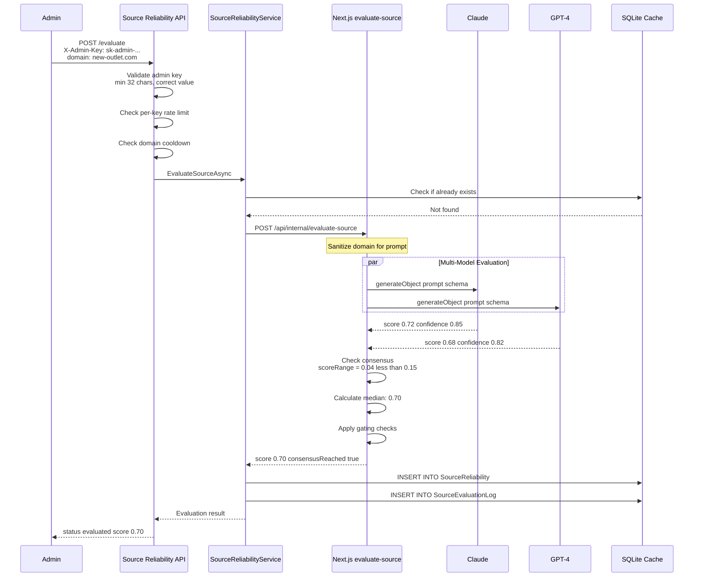

### Use Case 2: Review Low-Confidence / Model Disagreement

Admin reviews evaluations that didn't pass automatic thresholds.

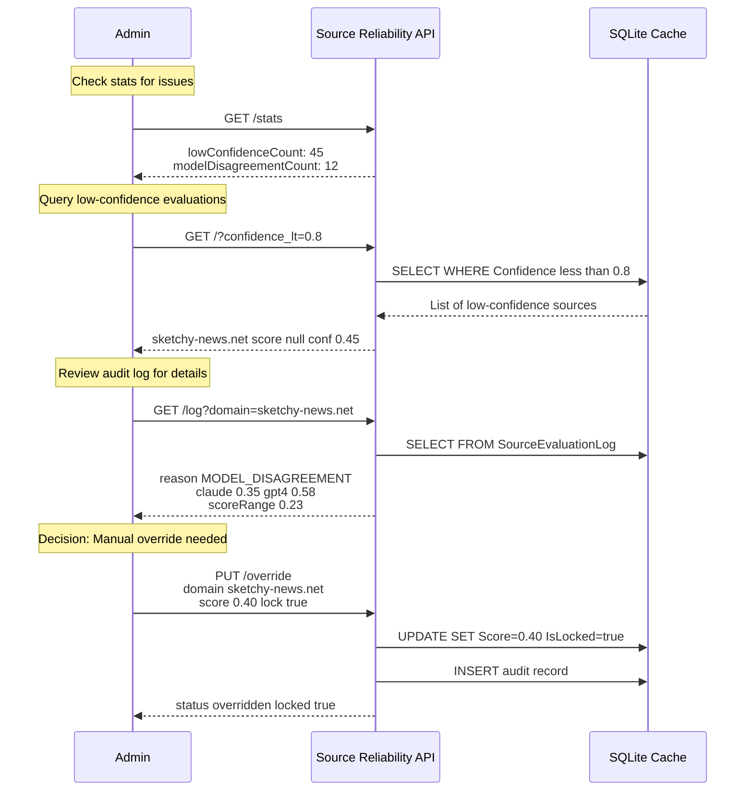

### Use Case 3: Monitor Categorical Bias

Admin checks for systematic bias in scoring (e.g., all .gov sites scored too high).

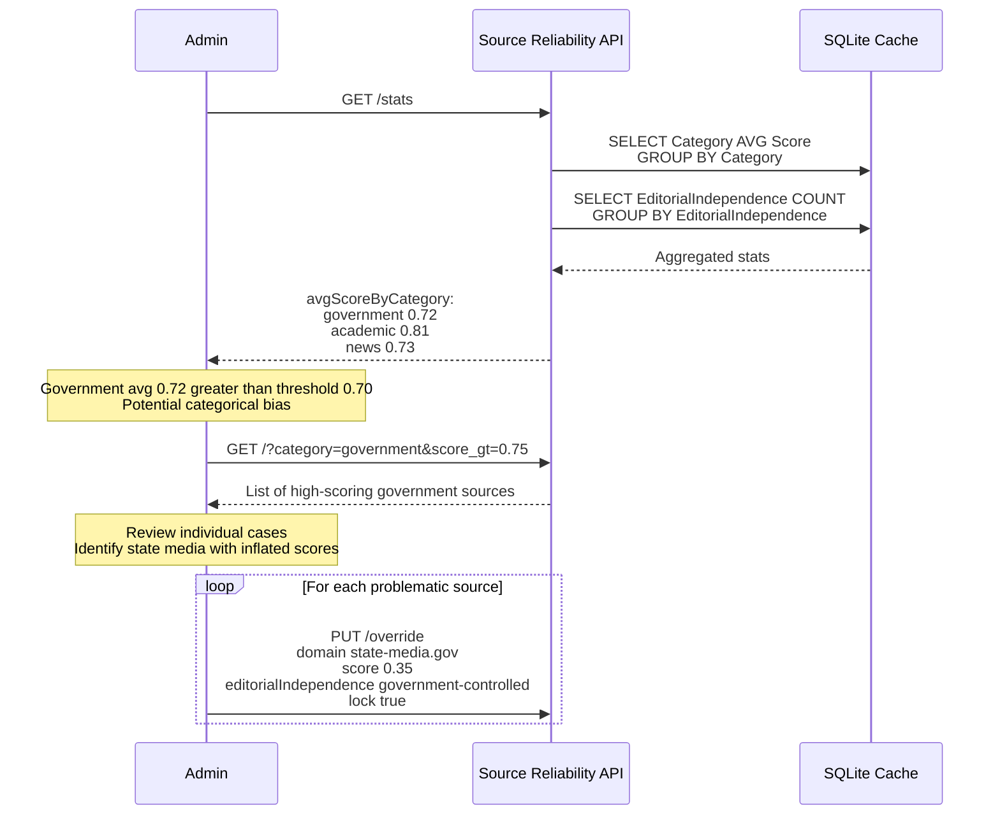

### Use Case 4: Audit Log Cleanup

Admin performs periodic maintenance to manage database size.

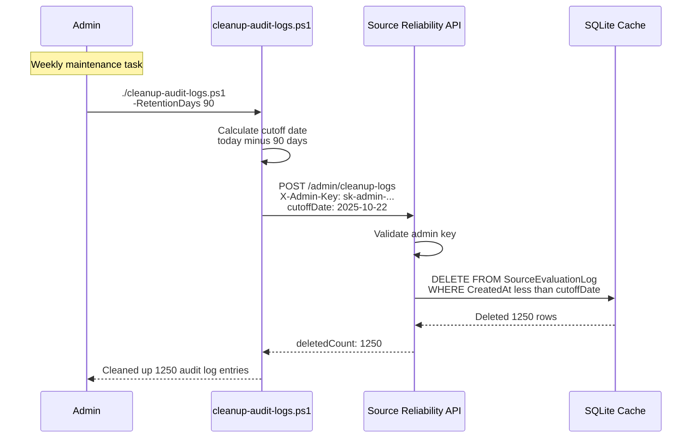

### Admin Responsibilities Summary

| Task | Frequency | Trigger | Endpoint |
|------|-----------|---------|----------|
| **Evaluate unknown sources** | As needed | Unknown sources in analysis | `POST /evaluate` |
| **Review low-confidence** | Weekly | Stats show high count | `GET /stats`, `PUT /override` |
| **Review model disagreements** | Weekly | Stats show disagreements | Query logs, `PUT /override` |
| **Monitor categorical bias** | Weekly | Scheduled review | `GET /stats` |
| **Override incorrect scores** | As needed | User reports, audits | `PUT /override` |
| **Lock critical sources** | As needed | High-profile sources | `PUT /override` with `lock: true` |
| **Cleanup audit logs** | Weekly/Monthly | Scheduled maintenance | `POST /admin/cleanup-logs` |

### Admin Decision Tree

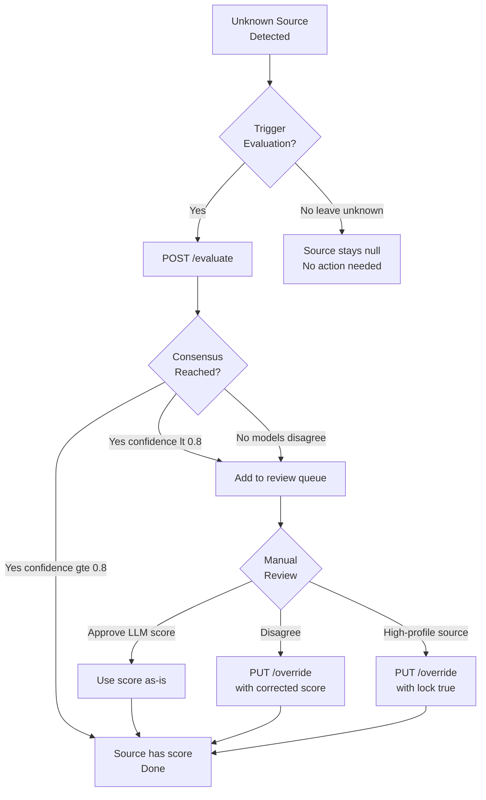

---

## Cache Strategy

### TTL Configuration

| Evaluation Source | Default TTL | Rationale |
|-------------------|-------------|-----------|
| LLM_EVALUATION (high confidence) | 90 days | Multi-model consensus, stable |
| LLM_EVALUATION (confidence >= 0.8) | 30 days | High-confidence multi-model consensus |
| LLM_EVALUATION (confidence 0.5-0.8) | 7 days | Moderate confidence, stored but not used |
| ADMIN_OVERRIDE | Never (unless unlocked) | Human-verified |

### Environment Variables

```bash
# Service Configuration
FH_SR_SERVICE_URL=https://localhost:5001   # HTTPS required (per security review)
FH_SR_DB_PATH=./source-reliability.db      # Separate SQLite database

# Cache Configuration  
FH_SR_CACHE_TTL_DAYS=30                    # Default TTL
FH_SR_MEMORY_CACHE_SIZE=1000               # In-memory cache entries

# LLM Configuration
FH_SR_LLM_ENABLED=true                     # Enable LLM evaluation
FH_SR_LLM_TIMEOUT_MS=30000                 # Evaluation timeout
FH_SR_LLM_CONFIDENCE_THRESHOLD=0.8         # RAISED from 0.5 per review
FH_SR_LLM_CONSENSUS_THRESHOLD=0.15         # Max score range for consensus

# Rate Limiting - Per Key (per security review)
FH_SR_RATE_LIMIT_PER_KEY_PER_HOUR=100      # Per admin-key limit
FH_SR_RATE_LIMIT_PER_KEY_PER_DAY=500       # Per admin-key daily limit

# Rate Limiting - Per IP (per security review)
FH_SR_RATE_LIMIT_PER_IP_PER_MINUTE=30      # Per-IP limit for /batch
FH_SR_RATE_LIMIT_PER_IP_PER_HOUR=500       # Per-IP hourly limit

# Rate Limiting - Per Domain
FH_SR_RATE_LIMIT_COOLDOWN_SECONDS=60       # Per-domain cooldown

# Security (per security review)
FH_ADMIN_KEY_MIN_LENGTH=32                 # Minimum admin key length
FH_SR_AUDIT_LOG_RETENTION_DAYS=90          # Audit log retention

# Cache
FH_SR_CACHE_PATH=./data/source-reliability.db  # SQLite cache file
```

---

## File Structure

```
apps/
├── api/
│   ├── Controllers/
│   │   └── SourceReliabilityController.cs    # New REST endpoints
│   ├── Data/
│   │   ├── FhDbContext.cs                    # Existing (unchanged)
│   │   ├── SourceReliabilityDbContext.cs     # New: Separate DbContext
│   │   └── SourceReliabilityEntities.cs      # New: Entity definitions
│   ├── Services/
│   │   ├── JobService.cs                     # Existing (unchanged)
│   │   └── SourceReliabilityService.cs       # New: Business logic
│   ├── factharbor.db                         # Existing jobs database
│   └── source-reliability.db                 # New: Source cache database
│
├── web/
│   └── src/
│       ├── app/api/internal/
│       │   └── evaluate-source/
│       │       └── route.ts                  # New: Multi-model LLM evaluation
│       └── lib/
│           └── analyzer/
│               └── source-reliability.ts     # Modified: Batch prefetch + sync lookup
│
scripts/
├── validate-llm-evaluations.ps1              # Spot-check LLM evaluation quality
├── cache-stats.ps1                           # Cache hit rates and coverage
├── generate-admin-key.ps1                    # Generate secure admin key (per security review)
└── cleanup-audit-logs.ps1                    # Automated audit log cleanup
```

---

## Risk Assessment (REVISED)

| Risk | Likelihood | Impact | Mitigation |
|------|------------|--------|------------|
| **LLM Hallucination** | Medium | High | Multi-model consensus, evidence basis requirements, stricter gating (0.8 confidence) |
| **Circular Reasoning** | **Medium** | **High** | Multi-model consensus required, different providers, periodic audit |
| **Categorical Bias** | Medium | High | No domain-type bonuses in prompt, monitoring dashboards, validation scripts |
| **Cost Runaway** | Low | Medium | Admin-only evaluation, rate limiting, aggressive caching |
| **Service Unavailability** | Low | Low | Graceful fallback to local bundle |
| **Latency Impact** | Low | Low | Batch prefetch (not per-request), async evaluation |

---

## Implementation Plans by Option

### ~~Option A Implementation~~ (REMOVED)

**Timeline**: 1-2 days

**Day 1**:
```
Morning (4 hrs):
- [ ] Set up SQLite cache schema
- [ ] Create simple getTrackRecordScore() function
- [ ] Add domain normalization (per security review)

Afternoon (4 hrs):
- [ ] Test integration with orchestrated pipeline
- [ ] Verify fallback to null for unknown sources
- [ ] Ship to development environment
```

**Day 2**:
```
- [ ] Monitor unknown source rate
- [ ] Document known limitations
- [ ] Plan 3-month review
```

**Success Criteria** (3-month checkpoint):
- [ ] Unknown source rate < 10%
- [ ] No user complaints about source quality
- [ ] Team has data to decide if LLM evaluation is needed

---

### Option A Implementation: Pure LLM (RECOMMENDED)

**Timeline**: 2 days

**Day 1**: Cache + Filter + Multi-Model foundation
```
Morning (4 hrs):
- [ ] Set up SQLite cache with schema
- [ ] Create getTrackRecordScore() with cache check
- [ ] Add domain normalization

Afternoon (4 hrs):
- [ ] Implement isImportantSource() filter (blacklist approach)
- [ ] Add multi-model LLM evaluation (Claude + GPT-4)
- [ ] Implement consensus checking logic
```

**Day 2**: Integration + Testing
```
Morning (4 hrs):
- [ ] Wire up LLM call on cache miss (important sources only)
- [ ] Add 90-day cache TTL for high-confidence results
- [ ] Implement configurable thresholds (default 0.8)

Afternoon (4 hrs):
- [ ] Test with sample unknown sources
- [ ] Verify blog platforms and spam TLDs are skipped
- [ ] Test multi-model consensus and disagreement handling
```

**Day 3** (optional): Polish
```
- [ ] Add simple logging for LLM evaluations
- [ ] Set up cost monitoring (track API calls)
- [ ] Document "important source" heuristics
- [ ] Ship to development environment
```

**Key Implementation Details**:

```typescript
// Important source filter - blacklist approach (see detailed code in Option A section)
// Skips: blog platforms, exotic TLDs, suspicious patterns
// Default: accept and evaluate
```

**Success Criteria** (3-month checkpoint):
- [ ] Unknown source rate < 10%
- [ ] LLM cost < $60/month
- [ ] >90% of LLM evaluations are for legitimate outlets (not blogs)
- [ ] No hallucination complaints

**Weekly Admin Tasks** (~15 min):
- [ ] Check LLM cost dashboard
- [ ] Review any flagged low-confidence evaluations
- [ ] Spot-check 2-3 recent LLM scores for accuracy

---

### Option B Implementation: Zero Admin

**Timeline**: 2 days

**Day 1**: Cache + Single-model LLM
**Day 2**: Integration and testing

**Key Differences from Option A**:
- Single LLM model (not multi-model consensus)
- No importance filter (evaluates all sources)
- Confidence threshold 0.9 (higher = fewer false positives)
- Zero admin oversight
- Silent failure (returns null on error)

---

### Option C Implementation: Full Proposal (Detailed Phases)

**Timeline**: 2-3 weeks

**Prerequisites** (per Project Lead review):
- [ ] Assign dedicated owner (3-4 hrs/week commitment)
- [ ] Set LLM budget ($100/month safety limit)
- [ ] Create admin runbook (document all workflows)
- [ ] Plan quarterly review (is this worth the effort?)

#### Pre-Implementation Checklist

Per architect and security reviews, complete BEFORE Phase 1:

**Architecture Setup**:
- [ ] Update AGENTS.md with Source Reliability Principles
- [ ] Create `validate-llm-evaluations.ps1` script
- [ ] Remove any categorical bias from existing code
- [ ] Verify score scale is 0.0-1.0 throughout codebase

**Security Setup** (per security review):
- [ ] Generate strong admin key (32+ chars) using `generate-admin-key.ps1`
- [ ] Configure HTTPS certificate (even for local dev)
- [ ] Verify `.gitignore` excludes `.env`, `.env.local`, `*.key`
- [ ] Set up LLM API keys with spending limits ($100/month for POC)

#### Phase 1: Database and API (Foundation)

**Scope**:
- Create `source-reliability.db` SQLite database with enhanced schema
- Implement `SourceReliabilityDbContext` with entities (including `EditorialIndependence`, `EvidenceBasis`)
- Create `SourceReliabilityController` with GET and POST /batch endpoints (lookup only)
- Set up SQLite cache for LLM evaluations
- Run validation script on imported data
- Implement stats endpoint with bias monitoring
- **Implement domain validation with regex** (per security review)
- **Add per-IP rate limiting on /batch** (per security review)

**Key Changes from Original**:
- POST for batch (not GET)
- Editorial independence field
- Evidence basis field
- Bias monitoring in stats
- Domain validation rejects injection patterns

### Phase 2: LLM Evaluation (Core Feature)

**Scope**:
- Implement `/api/internal/evaluate-source` with multi-model consensus
- Create structured prompt (no categorical bias)
- Add evidence basis validation
- Implement consensus checking logic (score range < 0.15)
- Add enhanced gating (0.8 confidence threshold)
- Implement audit logging with multi-model tracking
- Add rate limiting and per-domain cooldown
- Protect endpoint with X-Admin-Key
- **Implement domain/URL sanitization before prompt** (per security review)
- **Add per-admin-key rate limiting** (per security review)
- **Validate admin key format (min 32 chars)** (per security review)
- **Log failed auth attempts with IP** (per security review)

**Key Changes from Original**:
- Multi-model consensus (2+ models)
- Stricter confidence threshold (0.8)
- Evidence basis requirements
- Admin-only access (no cache-miss trigger)
- Prompt injection prevention

### Phase 3: Pipeline Integration

**Scope**:
- Add `prefetchSourceScores()` batch function
- Modify orchestrated pipeline to call prefetch early
- Keep `getTrackRecordScore()` synchronous
- Add graceful fallback to local bundle
- Remove duplicate track-record logic in orchestrated.ts
- Update environment variable documentation

**Key Changes from Original**:
- Batch prefetch instead of async per-lookup
- No sync→async changes to existing code

### Phase 4: Admin Tools (Optional)

**Scope**:
- Admin override API (PUT endpoint)
- Low-confidence review dashboard
- Model disagreement review queue
- Categorical bias monitoring UI
- Bulk import capability
- **Audit log cleanup endpoint and script** (per security review)
- **Security monitoring dashboard** (per security review)

---

## Resolved Open Questions

| Question | Decision | Rationale |
|----------|----------|-----------|
| **Implementation Option?** | **PENDING TEAM DECISION** | Options A, B, or C - see comparison matrix |
| **Separate Service vs. Integrated?** | Integrated (Phase 1-3), reconsider if >1000 evals/day | Simpler ops, adequate for expected load |
| **LLM Provider for Evaluations?** | Multiple providers (Claude + GPT-4) for consensus (Option C only) | Reduces circular reasoning risk |
| **Web Search Grounding?** | No for MVP, optional Phase 4 for admin | Cost ($0.25/search) vs. benefit |
| **Bootstrap Data Source?** | None (Pure LLM) | External ratings have bias issues; LLM evaluates all sources equally |
| **Rate Limiting?** | 10/min, 100/hour, 60s per-domain cooldown (Option C only) | Prevents abuse while allowing legitimate use |
| **Evaluation Trigger?** | Admin-only (Option C), automatic (Options A, B) | Per-option trade-offs |

---

## Acceptance Criteria

### All Options: Core Requirements

- [ ] Scores are consistently 0.0-1.0 everywhere
- [ ] Unknown sources do not degrade analysis (return `null`, not penalty)
- [ ] Domain normalization is consistent (lowercase, no www)
- [ ] `.env` and secrets excluded from git

### Option A: Pure LLM + Cache (RECOMMENDED)

- [ ] SQLite cache operational
- [ ] `isImportantSource()` filter implemented and documented
- [ ] Blog platforms and spam TLDs correctly skipped
- [ ] Multi-model LLM consensus for important sources
- [ ] Configurable confidence threshold (default 0.8)
- [ ] LLM cost < $60/month (verify filter is working)
- [ ] Weekly spot-check process documented

### Option B: Auto LLM

- [ ] All Option A criteria met
- [ ] Single-model LLM evaluation on cache miss
- [ ] Confidence threshold 0.9 enforced
- [ ] Silent failure returns null (no blocking)
- [ ] LLM cost tracking implemented

### Option C: Full Proposal

Per lead developer, architect, and security reviews:

**Correctness**:
- [ ] LLM low-confidence results do not influence evidence weighting
- [ ] No categorical bias in scoring (validated by script)
- [ ] Multi-model consensus required for LLM scores

**Operational Safety**:
- [ ] Evaluation is not publicly triggerable
- [ ] Rate limiting prevents cost runaway
- [ ] Audit log has size controls (truncated prompts)
- [ ] Admin time tracking implemented

**Failure Behavior**:
- [ ] API down → analysis runs with `null` reliability (fallback to bundle)
- [ ] Evaluation endpoint down → cache-miss returns unknown, logs warning
- [ ] Model disagreement → score = null, flagged for review

**Security (per security review)**:
- [ ] HTTPS enabled on all endpoints
- [ ] Admin key validation (minimum 32 characters)
- [ ] Domain sanitization before LLM evaluation
- [ ] Per-admin-key rate limiting on `/evaluate`
- [ ] Per-IP rate limiting on `/batch` endpoint
- [ ] Security test cases added

---

## Success Metrics (Per Project Lead Review)

### 3-Month Review Criteria

| Metric | Option A (Pure LLM) | Option B (Zero Admin) | Option C (Full) |
|--------|---------------------|----------------------|-----------------|
| Unknown source rate | < 10% | < 5% | < 5% |
| User complaints | 0 | 0 | 0 |
| Admin time/week | < 15 min | 0 min | < 3 hrs |
| LLM cost/month | < $60 | < $50 | < $60 |
| Verdict quality improvement | +5% | +5% | +10% |
| Blog platform skip rate | > 90% | N/A | N/A |

### 6-Month Review Criteria (Option C Only)

| Metric | Target |
|--------|--------|
| Admin time/week | < 2 hrs (automation working) |
| Automatic evaluation success rate | > 90% |
| Model disagreement rate | < 10% |
| Override/correction rate | < 5% |

### When to Upgrade

**Upgrade from Option A to B if:**
- Admin time feels burdensome (even 15 min/week)
- Want fully hands-off operation
- LLM costs are acceptable at $20-50/month

**Upgrade from Option A or B to C if:**
- LLM hallucination rate > 5%
- Regulatory/compliance requires audit trail
- Team grows to 5+ people
- Source reliability becomes core differentiator

---

## Revision History

| Version | Date | Author | Changes |
|---------|------|--------|---------|
| 0.1 | 2026-01-21 | Architecture Team | Initial draft |
| 0.2 | 2026-01-21 | Architecture Team | Addressed Lead Developer and Senior Architect review feedback: removed categorical bias, added editorial independence, multi-model consensus, batch prefetch, stricter confidence threshold (0.8), admin-only evaluation |
| 0.3 | 2026-01-21 | Architecture Team | Addressed Security Advisor review: HTTPS required, domain validation with regex (reject injection patterns), prompt injection prevention, per-key and per-IP rate limiting, audit log cleanup endpoint, security acceptance criteria |
| 0.4 | 2026-01-21 | Architecture Team | Added Operational Flows section with sequence diagrams for unknown source handling, Admin Use Cases with 4 detailed workflows (evaluate, review, monitor bias, cleanup), admin responsibilities summary table, and decision tree |
| 0.5 | 2026-01-21 | Architecture Team | Addressed Project Lead review: Added Implementation Options (A: Bootstrap Only, B: Auto LLM, C: Full Proposal), comparison matrix, decision framework, option-specific implementation plans, success metrics, upgrade criteria. Full proposal renamed to Option C with explicit prerequisites. |
| 0.6 | 2026-01-21 | Architecture Team | Added Option A+B (Hybrid): Selective auto-fill that combines bootstrap data with LLM evaluation only for "important" sources (skips blogs/exotic TLDs). Updated comparison matrix, decision framework, implementation plan, acceptance criteria, and success metrics. Recommended as balanced choice for small teams. |
| 0.7 | 2026-01-21 | Architecture Team | **Project Leader's Choice: Option A+B**. Added detailed implementation plan with day-by-day timeline, key code snippets, file changes, success metrics, and rollback plan. Status changed to READY FOR TEAM DECISION. |
| 0.8 | 2026-01-21 | Architecture Team | Replaced MBFC with Wikipedia RS as bootstrap data source. MBFC conflates political bias with factual reliability; Wikipedia RS is community-vetted. |
| 0.9 | 2026-01-21 | Architecture Team | Replaced Wikipedia RS with Minimal Curated Whitelist (~30 sources). Wikipedia RS proved too complex. |
| 1.0 | 2026-01-21 | Architecture Team | **Dropped whitelist entirely - Pure LLM + Cache**. All sources evaluated by LLM with same methodology. Cache prevents repeated evaluations. Blog filter saves ~60% of LLM costs. |
| 1.1 | 2026-01-21 | Architecture Team | Made confidence threshold configurable via `FH_SR_CONFIDENCE_THRESHOLD` (default 0.8). Added `FH_SR_CACHE_TTL_DAYS` and `FH_SR_ENABLED`. |
| 1.2 | 2026-01-21 | Architecture Team | Re-added multi-model consensus (Claude + GPT-4). Configurable via `FH_SR_MULTI_MODEL` and `FH_SR_CONSENSUS_THRESHOLD`. |
| 1.3 | 2026-01-21 | Architecture Team | Improved `isImportantSource` filter: blacklist approach, skip user-content platforms and exotic TLDs. Added `FH_SR_FILTER_ENABLED`. |
| 1.4 | 2026-01-21 | Architecture Team | Removed MBFC terminology throughout document. |
| 1.5 | 2026-01-21 | Architecture Team | Removed Bootstrap Only option entirely due to manipulation concerns. |
| 1.6 | 2026-01-21 | Architecture Team | Renamed Option A+B to Option A. Now: Option A (Pure LLM), Option B (Zero Admin), Option C (Full Proposal). |
| 1.7 | 2026-01-21 | Architecture Team | Consistency cleanup: Fixed comparison matrix, LOC counts, metrics tables, implementation timelines. |
| 1.8 | 2026-01-21 | Architecture Team | **Security Advisor conditional approval**: (1) Added rate limiting to Option A (`FH_SR_RATE_LIMIT_PER_IP`, `FH_SR_RATE_LIMIT_DOMAIN_COOLDOWN`). (2) Made skip lists configurable via env vars (`FH_SR_SKIP_PLATFORMS`, `FH_SR_SKIP_TLDS`). (3) Clarified batch prefetch + sync lookup pattern to avoid async in analyzer hot paths. (4) Updated architecture diagram to show two-phase approach. (5) Added Security Advisor conditions checklist to Review Status. |
