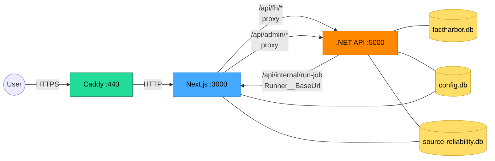
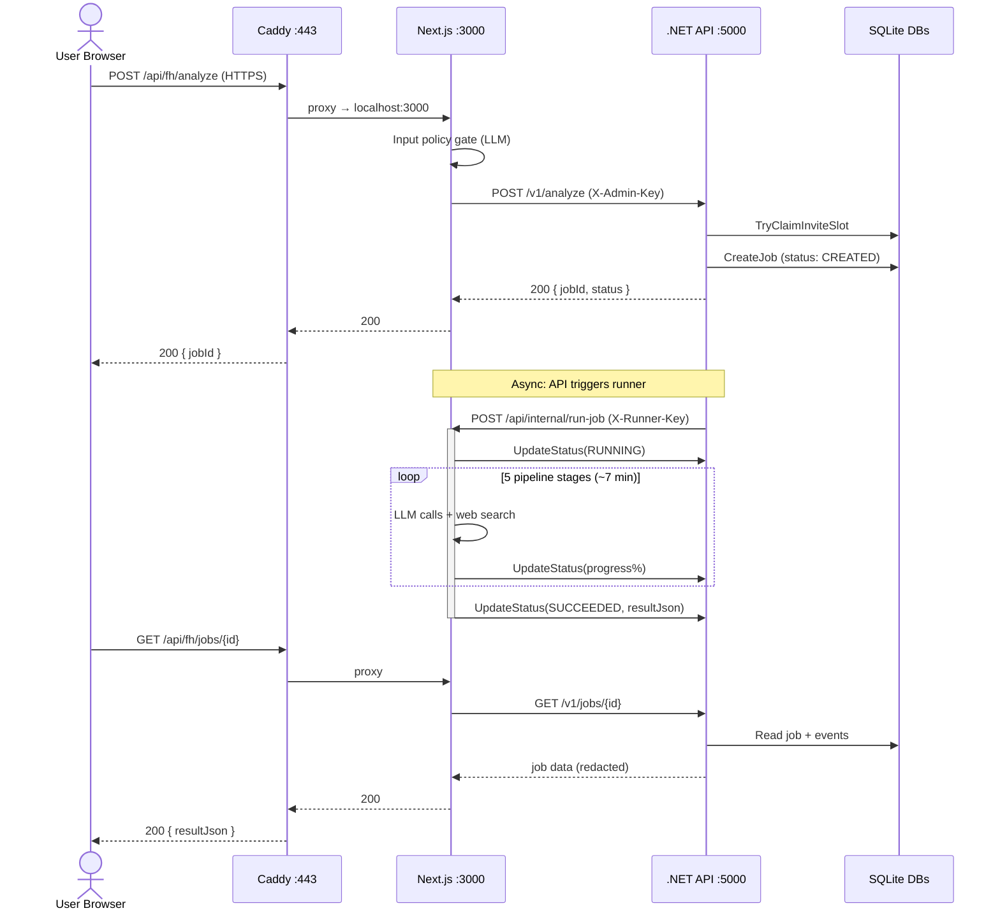
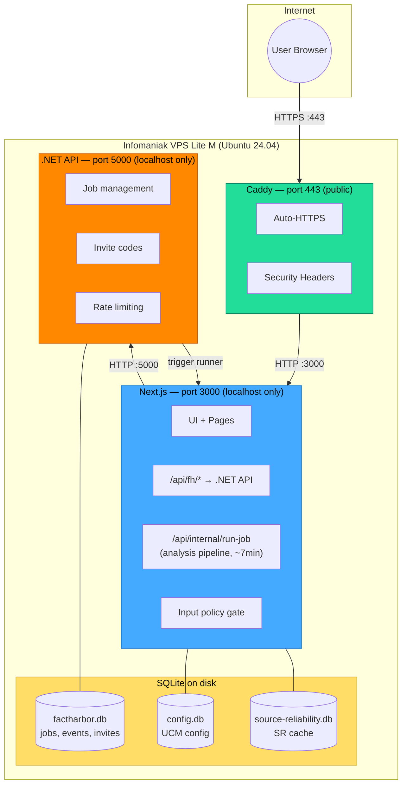
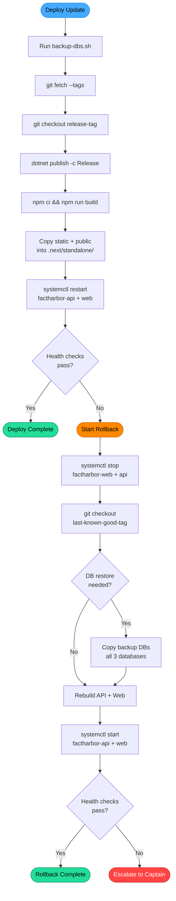
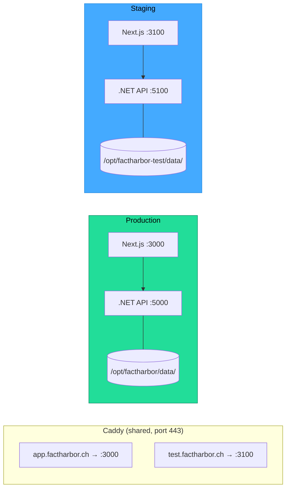

# Deployment Strategy — Limited Public Pre-Release

**Filed by:** Deputy Captain (Claude Code, Opus 4.6)
**Date:** 2026-03-02
**Status:** REVISED — Lead Architect review incorporated (1 BLOCKER, 2 HIGH, 3 MEDIUM, 1 LOW addressed)
**Depends on:** `Docs/WIP/2026-03-01_Limited_Public_PreRelease_Readiness_Plan.md` (Steps 0-12 complete)
**Reviewed by:** Lead Architect (2026-03-02) — all findings addressed below

---

## Executive Summary

**Goal:** Deploy FactHarbor for limited public pre-release (~10-50 invited users).

**Decision:** Single VPS (Infomaniak VPS Lite M, ~€9.90/mo) running Caddy + Next.js standalone + .NET 8 API + SQLite. Domain: `app.factharbor.ch`. Provider consolidation: same provider as `.ch` domain — single invoice, Swiss data sovereignty.

**Why not Vercel?** Two independent blockers: (1) stateful in-memory architecture (runner queue, UCM cache, SR cache) is incompatible with serverless, and (2) function timeout (300s Pro max vs ~7min typical analysis). Not fixable without major re-architecture.

**Key components:**
- **Caddy** — reverse proxy, auto-HTTPS, security headers, sensitive header redaction in logs
- **Next.js standalone** — systemd service, prompt/config paths via `FH_PROMPT_DIR` / `FH_CONFIG_DEFAULTS_DIR` env vars
- **.NET 8 API** — published binary, systemd service, `ForwardedHeaders` middleware for real client IP
- **SQLite** — 3 databases on disk, backed up daily via `sqlite3 .backup` (consistency-safe)

**Pre-deployment code changes:** ~~Both completed by Lead Developer (2026-03-02).~~
1. ~~`apps/web/next.config.js` — add `output: "standalone"` (BLOCKER)~~ ✅
2. ~~`apps/api/Program.cs` — add `ForwardedHeaders` middleware (HIGH)~~ ✅

**Staging instance:** `test.factharbor.ch` — second instance on same VPS (€0 extra), separate ports/data/keys. Deploy here first, smoke test, then promote to production.

**Cost:** ~€13-26/mo (VPS + LLM/search API usage).

**Captain decisions applied:** D-1 Infomaniak VPS Lite M (Swiss DC, same provider as domain), D-2 `app.factharbor.ch` subdomain, D-3 git clone + pinned tags, D-4 SQLite-safe backups, D-5 security headers now. Lead Architect review: all 7 findings (1B/2H/3M/1L) resolved — see §13.

---

## 1. Problem Statement

All 12 implementation steps of the pre-release readiness plan are complete. Security hardening is done. But **there is no deployment mechanism** — everything assumes the dev machine is the server.

### What exists

| Asset | Purpose | Production-ready? |
|-------|---------|-------------------|
| `scripts/restart-clean.ps1` | Start API (`dotnet watch run`) + Web (`npm run dev`) in PowerShell windows | **No** — dev servers only |
| `scripts/health.ps1` | Hit `localhost:5000/health` + `localhost:3000/api/health` | Partially — logic is right, needs remote URL support |
| `scripts/stop-services.ps1` | Kill local PowerShell windows running services | **No** — local only |
| `scripts/build-and-restart.ps1` | Build + restart locally | **No** — local only |
| `scripts/validate-config.ps1` | Check env vars before startup | Yes — reusable |
| `appsettings.Production.json` | Kestrel bound to `127.0.0.1:5000` | Yes — correct for production |
| Zero-Cost Hosting Guide (xWiki) | Fly.io + Cloudflare Pages + PostgreSQL + Redis plan | **Outdated** — see §2 |
| Security Checklist | Pre-deployment verification items | Partially outdated — many items now done |

### What's missing

1. **No production process management** — dev servers (`dotnet watch run`, `npm run dev`) are not production-grade
2. **No reverse proxy / HTTPS** — no nginx, Caddy, or IIS config
3. **No Dockerfiles** — Zero-Cost guide has generic templates but nothing FactHarbor-specific
4. **No target platform selected** — no VPS, no Vercel account, no Fly.io app
5. **No production Next.js build** — `next.config.js` lacks `output: "standalone"` for self-hosted deployment
6. **No CI/CD for app deployment** — GitHub Actions only deploys docs (gh-pages)

---

## 2. Existing Documentation Review

### Zero-Cost Hosting Guide (xWiki) — Assessment

**Location:** `Docs/xwiki-pages/FactHarbor/Product Development/DevOps/Deployment/Zero-Cost Hosting Implementation Guide/WebHome.xwiki`
**Written:** 2026-01-02 (2 months ago, before most hardening)
**Status:** Approved but **architecturally outdated**

| Guide assumption | Current reality | Impact |
|-----------------|-----------------|--------|
| Cloudflare Pages for static SPA frontend | Next.js SSR with server components, API routes, proxy routes | **Breaking** — can't use Cloudflare Pages for SSR |
| Separate frontend/backend containers | Next.js is sole public surface; .NET API on localhost only (Step 11) | Architecture mismatch |
| PostgreSQL database | SQLite (3 databases: factharbor.db, config.db, source-reliability.db) | Different DB technology |
| Upstash Redis for caching | SQLite-based caching (config-storage.ts, SR cache) | Different caching technology |
| JWT auth for beta users | Invite code system (no JWT, no sessions) | Different auth model |
| Generic Dockerfile templates | No actual Dockerfiles exist in repo | Not implemented |

**Salvageable content:** Fly.io account setup, secrets management pattern, cost control philosophy, monitoring metrics, scaling strategy. The alternative section mentions Vercel.

### Vercel References in Codebase

The codebase already has Vercel awareness:
- `apps/web/src/lib/analyzer/debug.ts:60` — checks `process.env.VERCEL` to disable debug logging
- `apps/web/src/app/api/version/route.ts:13` — reads `VERCEL_GIT_COMMIT_SHA` for version info
- Workshop Report (archived) proposed "Deploy frontend on Vercel (free tier)"
- Tools Decisions xWiki: "Next.js → Vercel"
- Zero-Cost Guide §Alternative: "Vercel (free, better DX than Cloudflare)"

### Deployment Topology Diagram (xWiki)

**Location:** `Docs/xwiki-pages/FactHarbor/Product Development/Diagrams/Deployment Topology/WebHome.xwiki`

Current (POC): Single host with Next.js:3000 + .NET:5000 + SQLite.
Target (Production): Load balancer + multiple API servers + PostgreSQL + Redis + monitoring.

**For pre-release:** We're between these two. Single host, but remote and publicly accessible.

---

## 3. Architecture Constraint Analysis

### The FactHarbor deployment topology



**Legend:** Green = public entry point (Caddy auto-TLS). Blue = Next.js (sole public surface). Orange = .NET API (localhost only). Yellow = SQLite databases.

**Key constraints:**
1. Next.js is the sole public surface (Step 11: API on localhost only)
2. The runner route (`/api/internal/run-job`) is long-running (30s–5min per analysis)
3. SQLite databases must be on local disk with write access
4. Three processes communicate: Next.js server, .NET API, and the runner (which is a Next.js API route calling back into itself)
5. `FH_API_BASE_URL` connects Next.js → .NET API (currently `http://localhost:5000`)
6. `Runner__BaseUrl` connects .NET API → Next.js runner (currently `http://localhost:3000`)

### Analysis job request flow



### Platform evaluation

| Platform | Next.js SSR | .NET API | SQLite | Long-running (7min) | Stateful (in-memory) | Cost | Complexity |
|----------|-------------|----------|--------|---------------------|---------------------|------|------------|
| **Vercel (free)** | ✅ Native | ❌ No .NET | ❌ No disk | ❌ 60s timeout | ❌ Serverless | $0 | Low (Next.js only) |
| **Vercel Pro** | ✅ Native | ❌ No .NET | ❌ No disk | ❌ 300s < 420s | ❌ Serverless | $20/mo | Low (Next.js only) |
| **Vercel + VPS** | ✅ Native | ✅ On VPS | ✅ On VPS | ❌ Vercel timeout | ❌ Serverless | $5-25/mo | High — split infra |
| **Single VPS + Caddy** | ✅ Standalone | ✅ Bare-metal | ✅ Local disk | ✅ No timeout | ✅ Persistent | €4.50-10/mo | Medium |
| **Fly.io (2 containers)** | ✅ Docker | ✅ Docker | ⚠️ Volume needed | ✅ No timeout | ✅ Persistent | $0-5/mo | High — Docker + volumes |
| **Home server + Cloudflare Tunnel** | ✅ Standalone | ✅ Bare-metal | ✅ Local disk | ✅ No timeout | ✅ Persistent | $0 | Medium — availability |

### Why Vercel is unsuitable (two independent blockers)

#### Blocker 1: Stateful in-memory architecture

The Next.js server maintains **in-memory state** that Vercel's serverless model cannot support:

- **Runner concurrency queue** (`FH_RUNNER_MAX_CONCURRENCY`) — limits parallel analysis jobs via an in-memory counter. In serverless, each function invocation is isolated — no shared memory, no concurrency control.
- **UCM config cache** (`config-storage.ts`) — caches active configuration in-process. Serverless cold starts would re-read from SQLite on every invocation (which itself requires persistent disk — unavailable on Vercel).
- **Source reliability cache** — in-memory + SQLite hybrid. Same issue.

This is a **fundamental architecture mismatch**, not a workaround-away timeout issue. Even if timeouts were unlimited, the stateless serverless model breaks job orchestration.

#### Blocker 2: Function timeout

Analysis jobs trigger `/api/internal/run-job` which runs the full ClaimAssessmentBoundary pipeline (5 stages, multiple LLM calls, web searches). Typical runtime: **~7 minutes (420s)**.

- Vercel Free: **60-second function timeout** → analyses would fail
- Vercel Pro ($20/mo): **300-second timeout** → still insufficient (300s < 420s typical)
- Any VPS: **no timeout** → all jobs complete

**Workaround possibility:** Restructure so the .NET API triggers the runner on the VPS directly (bypassing Vercel). But this requires:
- Moving runner logic out of Next.js API routes, or
- Having the VPS run a second Next.js instance for the runner, or
- The .NET API calling a VPS-hosted runner URL instead of Vercel

This adds significant complexity for pre-release and doesn't solve Blocker 1.

---

## 4. Recommendation: Single VPS + Caddy

### What this means in plain terms

A **VPS** (Virtual Private Server) is a remote Linux machine you rent from a hosting provider. It works exactly like having your own computer in a data center — you SSH in, install software, and run your applications. Unlike serverless platforms (Vercel, AWS Lambda), everything stays running and keeps its state in memory, which is exactly what FactHarbor needs.

**Caddy** is a modern web server that acts as the front door. It does three things we'd otherwise need to configure manually:

1. **HTTPS certificates** — Caddy automatically obtains and renews TLS certificates from Let's Encrypt. No manual `certbot` setup, no cron renewal, no expired-cert alerts. You just point your domain at the server and Caddy handles the rest.
2. **Reverse proxy** — Users connect to `https://app.factharbor.ch` (port 443). Caddy forwards those requests internally to Next.js on port 3000. Neither Next.js nor the .NET API are directly exposed to the internet.
3. **Security headers + logging** — Caddy injects HTTP security headers (HSTS, X-Frame-Options, etc.) and logs access — with sensitive headers redacted.

**systemd** is the Linux service manager (built into Ubuntu). It ensures both the Next.js and .NET API processes start on boot, restart if they crash, and can be managed with simple commands (`systemctl start/stop/restart`). This replaces the dev-mode `npm run dev` and `dotnet watch run` with production-grade process management.

### How it fits together



**What the user sees:** `https://app.factharbor.ch` — a normal website with HTTPS.
**What happens behind the scenes:** Caddy terminates TLS, forwards to Next.js, which handles the UI and proxies API calls to .NET. The .NET API manages jobs and triggers Next.js to run analyses. All three services run on the same machine, communicating over localhost.

### Why this approach (comparison)

| Factor | VPS + Caddy | Vercel + VPS | Fly.io |
|--------|-------------|--------------|--------|
| No timeout issues | ✅ | ❌ Requires workaround | ✅ |
| Deployment simplicity | ✅ One box | ❌ Split infra | ❌ Docker + volumes |
| SQLite on local disk | ✅ | ❌ Split (API on VPS, web on Vercel) | ⚠️ Volume mount |
| HTTPS (automatic) | ✅ Caddy auto-TLS | ✅ Vercel auto-TLS | ✅ Fly.io auto-TLS |
| Cost | ~€10-20/mo | $5-25/mo | $0-5/mo |
| Ops burden | Low (systemd + Caddy) | Medium (two platforms) | Medium (Docker + Fly CLI) |
| Migration path | Easy — move to Vercel/Fly later | Already on Vercel | Already on Fly |
| Stateful in-memory | ✅ Persistent process | ❌ Serverless = no state | ✅ Persistent container |
| Bare-metal (Captain preference) | ✅ | Partial | ❌ Docker required |

### Why Infomaniak VPS Lite M

**Updated recommendation:** The Captain's domain is registered at Infomaniak.ch. Using their VPS consolidates domain + hosting under one Swiss provider.

| | Infomaniak VPS Lite M | Hetzner CX22 |
|---|---|---|
| **Price** | ~€9.90/mo | €4.51/mo |
| **vCPU / RAM** | 2 vCPU / 4 GB | 2 vCPU / 4 GB |
| **SSD storage** | 80 GB | 40 GB |
| **Data center** | 🇨🇭 Geneva + Zurich (Switzerland) | 🇩🇪 Germany / 🇫🇮 Finland (EU) |
| **Data sovereignty** | Swiss law (FADP) | EU law (GDPR) |
| **Domain consolidation** | ✅ Same provider → one invoice | Separate provider |
| **IPv4 + IPv6** | ✅ Included | ✅ Included |
| **Bandwidth** | Unlimited (500 Mbit/s) | 20 TB/mo |
| **CPU** | AMD EPYC | Shared Intel/AMD |
| **Backup** | Paid add-on | +€0.96/mo (20%) |
| **SLA** | No formal SLA on Lite tier | 99.9% |
| **Upgrade path** | VPS Lite L: 4 vCPU, 8 GB, 160 GB (~€19.90/mo) | CX32: 8 GB RAM (€8.49/mo) |

**Why Infomaniak wins for FactHarbor:**
1. **Provider consolidation** — domain (`factharbor.ch`) and hosting on one account, one invoice
2. **Swiss data sovereignty** — `.ch` domain hosted under Swiss data protection law (FADP), not EU GDPR. Stronger privacy guarantees.
3. **2x storage** — 80 GB vs 40 GB. Useful as SQLite databases and logs grow.
4. **AMD EPYC processors** — strong single-thread performance, relevant for Node.js
5. **Unlimited bandwidth** — no traffic caps, important if usage grows beyond initial 50 users

**Trade-offs to accept:**
- ~€5.40/mo more than Hetzner (~€65/year)
- No formal SLA on Lite tier (acceptable for pre-release)
- Backups are a paid add-on (we use our own `sqlite3 .backup` script anyway)
- Hetzner has slightly better disk I/O in benchmarks (both adequate for SQLite workloads)

**Verdict:** The €5.40/mo premium is negligible for a pre-release product. Swiss hosting + provider consolidation + double storage make Infomaniak the better fit.

Alternative providers if needed: Hetzner CX22 (€4.51/mo), DigitalOcean ($6/mo), Vultr ($6/mo), OVH (€3.50/mo). Any Linux VPS with 2+ vCPU and 4 GB+ RAM works.

---

## 5. Implementation Plan — Step 9 Revised

```mermaid
gantt
    title Deployment Implementation Phases
    dateFormat HH:mm
    axisFormat %H:%M

    section Phase 1: VPS Setup
    Provision VPS + DNS           :p1a, 00:00, 30min
    Install runtimes              :p1b, after p1a, 20min
    Deploy application code       :p1c, after p1b, 40min

    section Phase 2: Configure
    Environment variables         :p2a, after p1c, 15min
    Caddy + TLS                   :p2b, after p2a, 15min
    Systemd services              :p2c, after p2b, 30min

    section Phase 3: Verify
    Health checks                 :p3a, after p2c, 10min
    Smoke tests (11-point)        :p3b, after p3a, 20min
    Seed invite codes             :p3c, after p3b, 5min

    section Phase 4: Ops Setup
    Backup script + cron          :p4a, after p3c, 10min
    Monitoring (UptimeRobot)      :p4b, after p4a, 10min
    Operational hardening (9n)    :p4c, after p4b, 15min
    Staging instance (9o)         :p4d, after p4c, 20min
```



### Phase 1: VPS Setup (~1-2 hours)

#### 9a. Provision VPS

1. Provision Infomaniak VPS Lite M (Ubuntu 24.04 LTS) via Infomaniak Manager
2. Add SSH key, disable password auth
3. Configure UFW firewall: allow SSH (22), HTTP (80), HTTPS (443) only
4. Set hostname: `factharbor` or similar
5. Point DNS: `app.factharbor.ch` A record → VPS IP (and AAAA for IPv6)

#### 9b. Install runtimes

```bash
# .NET 8 runtime (not SDK — production only needs runtime)
wget https://dot.net/v1/dotnet-install.sh -O dotnet-install.sh
chmod +x dotnet-install.sh
./dotnet-install.sh --runtime aspnetcore --version 8.0 --install-dir /usr/share/dotnet
ln -s /usr/share/dotnet/dotnet /usr/local/bin/dotnet

# Node.js 20 LTS
curl -fsSL https://deb.nodesource.com/setup_20.x | sudo -E bash -
sudo apt install -y nodejs

# Caddy (reverse proxy)
sudo apt install -y debian-keyring debian-archive-keyring apt-transport-https
curl -1sLf 'https://dl.cloudsmith.io/public/caddy/stable/gpg.key' | sudo gpg --dearmor -o /usr/share/keyrings/caddy-stable-archive-keyring.gpg
curl -1sLf 'https://dl.cloudsmith.io/public/caddy/stable/debian.deb.txt' | sudo tee /etc/apt/sources.list.d/caddy-stable.list
sudo apt update && sudo apt install caddy
```

#### 9c. Deploy application code

```bash
# Create app directory
sudo mkdir -p /opt/factharbor
sudo chown $USER:$USER /opt/factharbor

# D-3: git clone + pinned tags for reproducible deployments
cd /opt/factharbor
git clone https://github.com/<org>/FactHarbor.git .
git checkout <release-tag>  # e.g., v1.0.0-pre.1

# Build .NET API (published, release mode)
cd /opt/factharbor/apps/api
dotnet publish -c Release -o /opt/factharbor/deploy/api

# Build Next.js (standalone mode — requires next.config.js change)
cd /opt/factharbor/apps/web
npm ci
npm run build
# Copy static assets into standalone directory (required for standalone mode)
cp -r .next/static .next/standalone/.next/static
cp -r public .next/standalone/public
```

**Required code change:** Add `output: "standalone"` to `next.config.js` for self-hosted deployment:

```js
/** @type {import('next').NextConfig} */
const nextConfig = {
  reactStrictMode: true,
  output: "standalone"
};
module.exports = nextConfig;
```

This makes Next.js produce a self-contained `server.js` that doesn't need `node_modules` at runtime.

### Phase 2: Configure Services (~1 hour)

#### 9d. Environment variables

Create `/opt/factharbor/deploy/.env.production`:

```bash
# API connection (both on localhost)
FH_API_BASE_URL=http://localhost:5000
ASPNETCORE_ENVIRONMENT=Production

# Security keys (GENERATE NEW — do not reuse dev values)
FH_ADMIN_KEY=<generate: openssl rand -hex 32>
FH_INTERNAL_RUNNER_KEY=<generate: openssl rand -hex 32>

# LLM providers
ANTHROPIC_API_KEY=sk-ant-...
OPENAI_API_KEY=sk-...

# Search providers (as configured in UCM)
GOOGLE_CSE_API_KEY=...
GOOGLE_CSE_CX=...
BRAVE_API_KEY=...

# CORS (must match the public domain)
FH_CORS_ORIGIN=https://app.factharbor.ch

# Runner
FH_RUNNER_MAX_CONCURRENCY=3

# Paths (use absolute paths on the VPS)
FH_CONFIG_DB_PATH=/opt/factharbor/data/config.db
FH_SR_CACHE_PATH=/opt/factharbor/data/source-reliability.db

# CRITICAL: Prompt & config file resolution (BLOCKER fix)
# Next.js standalone server runs from .next/standalone/ — process.cwd() won't
# find prompts/ or configs/ unless we set explicit paths.
FH_PROMPT_DIR=/opt/factharbor/apps/web/prompts
FH_CONFIG_DEFAULTS_DIR=/opt/factharbor/apps/web/configs

# Node
NODE_ENV=production
PORT=3000
```

Create `/opt/factharbor/data/` directory for SQLite databases:

```bash
mkdir -p /opt/factharbor/data
# factharbor.db will be created by EF migrations on first run
# config.db will be created by config-storage.ts on first run
```

#### 9e. Caddy configuration

Create `/etc/caddy/Caddyfile`:

```
app.factharbor.ch {
    reverse_proxy localhost:3000

    # Security headers (Step 10a — D-5: include basic headers now)
    header {
        X-Content-Type-Options nosniff
        X-Frame-Options DENY
        Referrer-Policy strict-origin-when-cross-origin
        Strict-Transport-Security "max-age=31536000; includeSubDomains"
        X-XSS-Protection "1; mode=block"
        # CSP can be added later (Step 10a — deferred)
    }

    # Access logging (LOW fix: redact sensitive headers)
    log {
        output file /var/log/caddy/access.log {
            roll_size 50mb
            roll_keep 7
            roll_keep_for 30d
        }
        format filter {
            wrap json
            fields {
                request>headers>X-Admin-Key delete
                request>headers>X-Invite-Code delete
                request>headers>X-Runner-Key delete
                request>headers>Authorization delete
            }
        }
    }
}
```

Caddy automatically obtains and renews Let's Encrypt TLS certificates. It also sets `X-Forwarded-For` headers automatically when used as a reverse proxy, which Next.js can read for client IP identification.

#### 9f. Systemd services

Create `/etc/systemd/system/factharbor-api.service`:

```ini
[Unit]
Description=FactHarbor .NET API
After=network.target

[Service]
Type=simple
User=factharbor
WorkingDirectory=/opt/factharbor/deploy/api
ExecStart=/usr/local/bin/dotnet /opt/factharbor/deploy/api/FactHarbor.Api.dll
EnvironmentFile=/opt/factharbor/deploy/.env.production
Environment=ASPNETCORE_ENVIRONMENT=Production
Environment=ConnectionStrings__FhDbSqlite=Data Source=/opt/factharbor/data/factharbor.db
Environment=Runner__BaseUrl=http://localhost:3000
Restart=on-failure
RestartSec=5

[Install]
WantedBy=multi-user.target
```

Create `/etc/systemd/system/factharbor-web.service`:

```ini
[Unit]
Description=FactHarbor Next.js Web
After=network.target factharbor-api.service
Wants=factharbor-api.service

[Service]
Type=simple
User=factharbor
# BLOCKER fix: WorkingDirectory must be .next/standalone (where server.js lives).
# Prompt/config paths are resolved via FH_PROMPT_DIR and FH_CONFIG_DEFAULTS_DIR
# env vars (set in .env.production), NOT process.cwd().
WorkingDirectory=/opt/factharbor/apps/web/.next/standalone
ExecStart=/usr/bin/node server.js
EnvironmentFile=/opt/factharbor/deploy/.env.production
Restart=on-failure
RestartSec=5

[Install]
WantedBy=multi-user.target
```

**BLOCKER resolution:** Next.js standalone `server.js` runs from `.next/standalone/`. Without explicit paths, `process.cwd()` resolves to this directory — `prompts/` and `configs/` would not be found. The fix: `.env.production` sets `FH_PROMPT_DIR` and `FH_CONFIG_DEFAULTS_DIR` to absolute paths pointing to the source directories. The codebase already supports these env vars (see `prompt-loader.ts:118`, `config-storage.ts:90-109`).

Enable and start:

```bash
sudo useradd -r -s /bin/false factharbor
sudo chown -R factharbor:factharbor /opt/factharbor/data

sudo systemctl daemon-reload
sudo systemctl enable factharbor-api factharbor-web caddy
sudo systemctl start factharbor-api
sudo systemctl start factharbor-web
sudo systemctl restart caddy
```

### Phase 3: Verify (~30 min)

#### 9g. Health checks

```bash
# API health (internal)
curl http://localhost:5000/health

# Web health (internal)
curl http://localhost:3000/api/health

# Public HTTPS
curl https://app.factharbor.ch/api/health

# Verify Swagger is NOT exposed
curl -o /dev/null -s -w "%{http_code}" https://app.factharbor.ch/swagger
# Expected: 404 (Swagger disabled in Production)

# Verify .NET API is NOT reachable externally
# (from a different machine)
curl http://<vps-ip>:5000/health
# Expected: connection refused (firewall blocks, Kestrel on localhost only)
```

#### 9h. Run Step 8b smoke checks against production

Run the 11-point smoke checklist from Step 8b against `https://app.factharbor.ch` instead of `localhost:3000`.

#### 9i. Seed initial data

```bash
# Create invite code(s) via admin API
curl -X POST https://app.factharbor.ch/api/fh/admin/invite-codes \
  -H "Content-Type: application/json" \
  -H "X-Admin-Key: <production-admin-key>" \
  -d '{"code":"BETA-2026-PREVIEW","dailyLimit":10,"lifetimeLimit":50,"isActive":true}'
```

### Phase 4: Operational Procedures

#### Deploy / Rollback flowchart



#### 9j. Deployment procedure (for updates, D-3: pinned tags)

```bash
# 1. SSH into VPS
ssh user@app.factharbor.ch

# 2. Run backup BEFORE deploying (safety net)
/opt/factharbor/scripts/backup-dbs.sh

# 3. Pull latest code (D-3: use pinned tags for traceability)
cd /opt/factharbor
git fetch --tags
git checkout <release-tag>  # e.g., v1.0.0-pre.3

# 4. Build API
cd apps/api
dotnet publish -c Release -o /opt/factharbor/deploy/api

# 5. Build Web (includes standalone asset copy)
cd ../web
npm ci
npm run build
cp -r .next/static .next/standalone/.next/static
cp -r public .next/standalone/public

# 6. Restart services
sudo systemctl restart factharbor-api
sudo systemctl restart factharbor-web

# 7. Verify
curl https://app.factharbor.ch/api/health
curl https://app.factharbor.ch/api/version
```

#### 9k. Rollback procedure

```bash
# 1. Stop services
sudo systemctl stop factharbor-web factharbor-api

# 2. Revert code to last known good version (D-3: pinned tags)
cd /opt/factharbor
git fetch --tags
git checkout <last-known-good-tag>  # e.g., v1.0.0-pre.2

# 3. Restore DB backups if needed (specify explicit date, restore ALL databases)
BACKUP_DATE=20260302  # <-- set to the actual backup date to restore
cp /opt/factharbor/backups/factharbor_${BACKUP_DATE}.db /opt/factharbor/data/factharbor.db
cp /opt/factharbor/backups/config_${BACKUP_DATE}.db /opt/factharbor/data/config.db
cp /opt/factharbor/backups/source-reliability_${BACKUP_DATE}.db /opt/factharbor/data/source-reliability.db

# 4. Rebuild and restart
cd apps/api && dotnet publish -c Release -o /opt/factharbor/deploy/api
cd ../web && npm ci && npm run build
cp -r .next/static .next/standalone/.next/static
cp -r public .next/standalone/public
sudo systemctl start factharbor-api factharbor-web

# 5. Verify
curl https://app.factharbor.ch/api/health
curl https://app.factharbor.ch/api/version
```

**Notes:**
- Always specify an explicit `BACKUP_DATE` — never rely on "today's" backup implicitly.
- All 3 databases must be restored together to maintain consistency (e.g., config.db references may point to jobs in factharbor.db).
- After restore, verify invite code counts and job statuses are consistent.

#### 9l. Backup schedule (D-4: SQLite-safe method)

**Important:** Raw `cp` of a live SQLite database can produce an inconsistent backup if a write is in progress. Use `sqlite3 .backup` which holds a read lock during the copy, guaranteeing consistency.

```bash
# Create backup script: /opt/factharbor/scripts/backup-dbs.sh
#!/bin/bash
set -euo pipefail
BACKUP_DIR="/opt/factharbor/backups"
DATE=$(date +%Y%m%d)
mkdir -p "$BACKUP_DIR"

# SQLite-safe backup (holds read lock during copy)
sqlite3 /opt/factharbor/data/factharbor.db ".backup '$BACKUP_DIR/factharbor_${DATE}.db'"
sqlite3 /opt/factharbor/data/config.db ".backup '$BACKUP_DIR/config_${DATE}.db'"
sqlite3 /opt/factharbor/data/source-reliability.db ".backup '$BACKUP_DIR/source-reliability_${DATE}.db'"

# Retain 14 days
find "$BACKUP_DIR" -name "*.db" -mtime +14 -delete

echo "[$(date -Is)] Backup completed: factharbor, config, source-reliability" >> /var/log/factharbor-backup.log
```

```bash
# Add to crontab (daily at 03:00 UTC)
0 3 * * * /opt/factharbor/scripts/backup-dbs.sh
```

**Prerequisite:** Install `sqlite3` on VPS: `sudo apt install -y sqlite3`

#### 9m. Monitoring

- **Service health:** `systemctl status factharbor-api factharbor-web caddy`
- **Logs:** `journalctl -u factharbor-api -f` / `journalctl -u factharbor-web -f`
- **Caddy access log:** `/var/log/caddy/access.log`
- **Disk usage:** SQLite databases grow ~1-5MB per analysis job
- **Uptime:** External ping via UptimeRobot (free) or similar on `https://app.factharbor.ch/api/health`

#### 9n. Operational readiness (MEDIUM-3: review finding)

**SSH hardening (VPS setup):**
```bash
# Disable password auth (SSH key only — already done in 9a step 2)
sudo sed -i 's/#PasswordAuthentication yes/PasswordAuthentication no/' /etc/ssh/sshd_config
sudo sed -i 's/PasswordAuthentication yes/PasswordAuthentication no/' /etc/ssh/sshd_config
sudo systemctl restart sshd

# Optional: change SSH port from default 22
# sudo sed -i 's/#Port 22/Port 2222/' /etc/ssh/sshd_config
# Update UFW: sudo ufw allow 2222/tcp && sudo ufw delete allow ssh
```

**OS automatic security updates:**
```bash
# Enable unattended-upgrades for security patches
sudo apt install -y unattended-upgrades
sudo dpkg-reconfigure -plow unattended-upgrades
# Verify: cat /etc/apt/apt.conf.d/20auto-upgrades
```

**Log retention:**
- Caddy access logs: rotated at 50MB, kept for 30 days (configured in Caddyfile above)
- Systemd journal: default retention is system-dependent; set explicit limit:
```bash
# /etc/systemd/journald.conf
[Journal]
SystemMaxUse=500M
MaxRetentionSec=30day
```
```bash
sudo systemctl restart systemd-journald
```

**Secret rotation schedule:**
- `FH_ADMIN_KEY` and `FH_INTERNAL_RUNNER_KEY`: rotate every 90 days or on suspected compromise
- LLM API keys (`ANTHROPIC_API_KEY`, `OPENAI_API_KEY`): rotate per provider policy
- Procedure: update `.env.production`, restart both services (`sudo systemctl restart factharbor-api factharbor-web`)

**Firewall verification:**
```bash
# Confirm only SSH, HTTP, HTTPS are open
sudo ufw status verbose
# Expected: 22/tcp ALLOW, 80/tcp ALLOW, 443/tcp ALLOW — nothing else
```

#### 9o. Staging/test instance (same VPS)

A second instance on the same VPS allows testing deployments, prompt changes, and config edits in a real server environment before they hit production. Cost: €0 extra (shares the VPS).



**Port allocation:**

| | Production | Staging |
|---|---|---|
| Domain | `app.factharbor.ch` | `test.factharbor.ch` |
| Next.js | `:3000` | `:3100` |
| .NET API | `:5000` | `:5100` |
| App directory | `/opt/factharbor/` | `/opt/factharbor-test/` |
| SQLite DBs | `/opt/factharbor/data/` | `/opt/factharbor-test/data/` |
| Env file | `.env.production` | `.env.staging` |
| Systemd services | `factharbor-api`, `factharbor-web` | `factharbor-test-api`, `factharbor-test-web` |

**Setup (after production is running):**

1. **DNS:** Add A record for `test.factharbor.ch` → same VPS IP.

2. **Caddy:** Add a second block to the Caddyfile:
```
test.factharbor.ch {
    reverse_proxy localhost:3100
    # Same security headers as production
    header {
        X-Content-Type-Options nosniff
        X-Frame-Options DENY
        Referrer-Policy strict-origin-when-cross-origin
        Strict-Transport-Security "max-age=31536000; includeSubDomains"
    }
    log {
        output file /var/log/caddy/access-test.log {
            roll_size 50mb
            roll_keep 3
        }
        format filter {
            wrap json
            fields {
                request>headers>X-Admin-Key delete
                request>headers>X-Invite-Code delete
                request>headers>X-Runner-Key delete
                request>headers>Authorization delete
            }
        }
    }
}
```

3. **Clone app directory:**
```bash
sudo mkdir -p /opt/factharbor-test
sudo chown factharbor:factharbor /opt/factharbor-test
cd /opt/factharbor-test
git clone https://github.com/<org>/FactHarbor.git .
# Staging can track main branch directly (no pinned tags needed)
```

4. **Env file** (`/opt/factharbor-test/deploy/.env.staging`) — same as production but with different ports, paths, keys, and CORS origin:
```bash
FH_API_BASE_URL=http://localhost:5100
PORT=3100
FH_CORS_ORIGIN=https://test.factharbor.ch
FH_CONFIG_DB_PATH=/opt/factharbor-test/data/config.db
FH_SR_CACHE_PATH=/opt/factharbor-test/data/source-reliability.db
FH_PROMPT_DIR=/opt/factharbor-test/apps/web/prompts
FH_CONFIG_DEFAULTS_DIR=/opt/factharbor-test/apps/web/configs
# Use DIFFERENT keys from production
FH_ADMIN_KEY=<generate: openssl rand -hex 32>
FH_INTERNAL_RUNNER_KEY=<generate: openssl rand -hex 32>
# Can share LLM/search API keys (staging usage is minimal)
ANTHROPIC_API_KEY=sk-ant-...
# ... rest same as production
```

5. **Systemd services:** Copy production units, changing names, ports, and paths:
```bash
# factharbor-test-api.service: WorkingDirectory=/opt/factharbor-test/deploy/api
#   Environment=ASPNETCORE_URLS=http://localhost:5100
#   Environment=Runner__BaseUrl=http://localhost:3100
#   EnvironmentFile=/opt/factharbor-test/deploy/.env.staging

# factharbor-test-web.service: WorkingDirectory=/opt/factharbor-test/apps/web/.next/standalone
#   EnvironmentFile=/opt/factharbor-test/deploy/.env.staging
```

6. **Build, enable, start** — same steps as production, just in `/opt/factharbor-test/`.

**Resource usage:** ~200MB extra RAM when both idle. The Lite M's 4GB is sufficient. During an active analysis (~7min), a staging job would consume CPU/memory alongside production — avoid running both concurrently under heavy load.

**Workflow:** Deploy to staging first → smoke test → if OK → deploy same tag to production.

---

## 6. Required Code Changes

| File | Change | Why | Severity | Status |
|------|--------|-----|----------|--------|
| `apps/web/next.config.js` | Add `output: "standalone"` | Required for self-hosted Next.js (produces standalone `server.js`) | **BLOCKER** | ✅ Done |
| `apps/web/.env.example` | Add `FH_PROMPT_DIR`, `FH_CONFIG_DEFAULTS_DIR`, `FH_CORS_ORIGIN` | Document all production env vars needed for standalone deployment | BLOCKER | Pending |
| `apps/api/Program.cs` | Configure `ForwardedHeaders` middleware + trust proxy | Rate limiting uses `RemoteIpAddress` which collapses to `127.0.0.1` behind Next.js proxy — must read `X-Forwarded-For` | **HIGH** | ✅ Done |

### BLOCKER: Standalone asset copy

`output: "standalone"` changes the build output. The `.next/standalone/` directory contains a self-contained Node.js server. Static assets must be copied separately:

```bash
# After npm run build:
cp -r .next/static .next/standalone/.next/static
cp -r public .next/standalone/public
```

This is standard Next.js standalone deployment procedure. The deploy script (§5, Phase 4: 9j) includes this step.

### HIGH: Rate Limiting IP Collapse (Review finding)

Behind Caddy → Next.js → .NET API, all requests to the .NET API arrive from `127.0.0.1`. The `AnalyzePerIp` rate limiter uses `HttpContext.Connection.RemoteIpAddress`, which sees only localhost — effectively creating a **global rate limit** instead of per-user.

**Fix:** Configure ASP.NET Core `ForwardedHeaders` middleware to trust `X-Forwarded-For` from the proxy chain:

```csharp
// In Program.cs, before app.UseRateLimiter():
app.UseForwardedHeaders(new ForwardedHeadersOptions
{
    ForwardedHeaders = ForwardedHeaders.XForwardedFor | ForwardedHeaders.XForwardedProto,
    KnownProxies = { IPAddress.Loopback, IPAddress.IPv6Loopback }
});
```

Caddy sets `X-Forwarded-For` automatically. The .NET API reads it via `ForwardedHeaders` middleware, and `RemoteIpAddress` then reflects the real client IP.

**Pre-deployment verification:** After configuring, test that rate limiting triggers per-client-IP, not globally.

---

## 7. Cost Estimate

| Item | Monthly | Notes |
|------|---------|-------|
| VPS (Infomaniak Lite M) | ~€9.90 | 2 vCPU, 4GB RAM, 80GB SSD, Swiss DC |
| Automatic backups | — | Using own `sqlite3 .backup` script (§5 Phase 4) |
| Domain (app.factharbor.ch) | ~€1.00 | Already owned |
| LLM API calls | $2-10 | Depends on usage volume |
| Search API calls | $0-5 | Google CSE free tier: 100/day |
| **Total** | **~€13-26/mo** | |

---

## 8. Future Migration Path

When traffic or requirements grow beyond pre-release:

1. **PostgreSQL migration** — Trigger: >50 concurrent users OR multi-instance deployment needed. The .NET side (`factharbor.db`) is a clean EF Core provider swap (`Npgsql.EntityFrameworkCore.PostgreSQL`). The TypeScript side is harder: `config.db` and `source-reliability.db` use raw `better-sqlite3` directly (not an ORM) — these need manual migration to a PostgreSQL client (`pg` or `postgres` npm package). Estimate: 1-2 days for EF Core swap, 3-5 days for TypeScript databases. Can run PostgreSQL on the same VPS (self-hosted) or use a managed DB (Supabase free tier, etc.).
2. **Vercel Pro ($20/mo)** for Next.js — better DX, automatic preview deployments, analytics. Requires two major changes: (a) decouple the runner from Next.js API routes to a standalone service (current jobs take ~7min, exceeding Pro's 300s limit), and (b) eliminate in-memory stateful architecture (concurrency queue, config cache) or move state to an external store (Redis). Significant refactor.
3. **Docker + Fly.io** for both services — enables auto-scaling, zero-downtime deploys. Prerequisite: PostgreSQL migration (SQLite on Fly volumes has durability concerns).
4. **Full CI/CD** — GitHub Actions: build → test → deploy to VPS via SSH/rsync.

---

## 9. Alternatives Considered

### Vercel (free or Pro) + VPS for .NET API

**Rejected because (two independent blockers):**
1. **Stateful architecture mismatch** (primary): Next.js server uses in-memory runner concurrency queue, UCM config cache, and SR cache. Vercel's serverless model provides no shared memory between invocations — job orchestration breaks fundamentally, not just at the edges.
2. **Function timeout**: Free = 60s, Pro = 300s — both insufficient for ~7-minute (420s) typical analyses.
3. Split infrastructure: Next.js on Vercel, .NET on VPS, networking complexity.
4. SQLite must be on VPS, but runner runs on Vercel → can't access DB directly.
5. Even with timeout resolved, Blocker 1 (stateful architecture) remains — the runner cannot function in a serverless model without significant re-architecture.

### Fly.io (2 containers)

**Deferred because:**
- Requires Dockerfiles (don't exist yet)
- SQLite on Fly volumes has known durability concerns
- Captain preference: bare-metal
- Can revisit if containerization becomes needed

### Home server + Cloudflare Tunnel

**Not recommended because:**
- Depends on home machine uptime and internet stability
- Not suitable for "limited public" audience
- But viable as a staging/testing environment

---

## 10. Architecture Assumptions: SPA and PostgreSQL

The Zero-Cost Hosting Guide assumed SPA frontend + PostgreSQL. This section documents why neither switch is warranted for pre-release.

### SPA: Not applicable — SSR is load-bearing

The Next.js server-side is not just rendering pages. It runs critical infrastructure:

| Server-side component | What it does | SPA impact if removed |
|-----------------------|-------------|----------------------|
| `/api/fh/*` proxy routes | Enforces data redaction (Step 11), admin gating, hides .NET API from internet | Would need to expose .NET API publicly — breaks Step 11 architecture |
| `/api/internal/run-job` | Orchestrates the full 5-stage ClaimAssessmentBoundary pipeline (~7min LLM + search) | Would need to move all analysis orchestration + Vercel AI SDK to .NET or a separate service |
| `/api/fh/analyze/route.ts` | Runs the LLM semantic input policy gate (Step 6) | Would need to reimplement gate in .NET |
| `config-storage.ts` | Manages UCM configuration via SQLite (`config.db`) | Would need UCM rewrite |
| `/api/admin/*` routes | Admin config, invite management, metrics proxying | Would need separate admin backend |

**Verdict:** Converting to SPA would mean re-architecting the entire backend — months of work with no benefit. The Zero-Cost Guide's SPA assumption was incorrect for FactHarbor's architecture.

### PostgreSQL: Deferred — SQLite is sufficient for pre-release

| Factor | SQLite (current) | PostgreSQL (if switched) |
|--------|-----------------|-------------------------|
| Concurrency | Adequate — invite codes cap at ~10-50 users; Step 4 contention retry handles bursts | Overkill for pre-release load |
| Ops burden | Zero — 3 files on disk, backed up with `sqlite3 .backup` | Extra service to provision, configure, monitor, backup |
| Cost | $0 | €0-7/mo (self-hosted on VPS, or Supabase/Neon free tier) |
| Migration effort | 0 | **Medium-High** — see below |
| Deployment | Files alongside the app | Connection strings, credentials, network access |

**Migration complexity breakdown:**

| Database | Technology | Migration effort |
|----------|-----------|-----------------|
| `factharbor.db` (jobs, events, invites) | EF Core (C#) | **Low** — provider swap to `Npgsql.EntityFrameworkCore.PostgreSQL`, generate new migration, test. ~1-2 days. |
| `config.db` (UCM) | Raw `better-sqlite3` (TypeScript) | **High** — 400+ lines in `config-storage.ts` using direct SQLite API. Manual rewrite to `pg` client. ~2-3 days. |
| `source-reliability.db` (SR cache) | Raw `better-sqlite3` (TypeScript) | **Medium** — simpler schema but same raw SQLite dependency. ~1-2 days. |

**Trigger to switch:** >50 concurrent users, multi-instance deployment, or data exceeding comfortable SQLite size (~1GB).

**Recommendation:** Deploy with SQLite. PostgreSQL is first item on the future migration path (§8).

---

## 11. Captain Decisions (Resolved)

| # | Decision | Captain's Choice | Applied In |
|---|----------|-----------------|------------|
| D-1 | **VPS provider** | ✅ Infomaniak VPS Lite M (~€9.90/mo, Swiss DC) — Captain's domain provider | §4, §7 |
| D-2 | **Domain** | ✅ `app.factharbor.ch` (subdomain, not root) | Throughout document — all URLs updated |
| D-3 | **Code deployment** | ✅ Git clone + pinned tags for reproducibility | §5 Phase 1 (9c), Phase 4 (9j, 9k) |
| D-4 | **Backup method** | ✅ SQLite-safe `sqlite3 .backup` (not `cp`) | §5 Phase 4 (9l) |
| D-5 | **Security headers** | ✅ Include now (HSTS, X-Content-Type-Options, X-Frame-Options, Referrer-Policy, X-XSS-Protection) | §5 Phase 2 (9e Caddyfile) |

---

## 12. Relationship to Existing Docs

| Document | Action Needed |
|----------|---------------|
| Zero-Cost Hosting Guide (xWiki) | Mark as "superseded for pre-release" — still valid as future Fly.io migration reference |
| Deployment Topology (xWiki) | Update to add "Pre-Release" topology between Current and Production |
| Pre-Release Readiness Plan (WIP) | Replace Step 9 content with reference to this document |
| Security Checklist | Update ⏳ items that are now ✅ (SSRF, auth, rate limiting, CORS) |
| KNOWN_ISSUES.md | Update S1 (SSRF → done), S2 (admin auth → done) |

---

## 13. Lead Architect Review — Findings Resolution

Review date: 2026-03-02. All findings addressed in this revision.

| # | Severity | Finding | Resolution | Section |
|---|----------|---------|------------|---------|
| 1 | **BLOCKER** | Standalone Next.js prompt/config path resolution — `process.cwd()` points to `.next/standalone/`, prompts/configs not found | Added `FH_PROMPT_DIR` and `FH_CONFIG_DEFAULTS_DIR` to env file; documented in systemd service comments. Codebase already supports these env vars. | §5 (9d, 9f), §6 |
| 2 | **HIGH** | Rate limiting IP collapse — all API requests from `127.0.0.1` behind proxy, per-IP rate limiting becomes global throttle | Added `ForwardedHeaders` middleware requirement to §6 with code snippet. Caddy sets `X-Forwarded-For` automatically. | §6 |
| 3 | **HIGH** | `cp`-based SQLite backup unsafe for live databases — can produce inconsistent copies during writes | Replaced with `sqlite3 .backup` command in dedicated backup script; added `sqlite3` as VPS prerequisite. | §5 (9l) |
| 4 | **MEDIUM** | Vercel rejection rationale incomplete — stateful in-memory queue is bigger blocker than timeout | Added "Blocker 1: Stateful architecture" as primary rejection reason in §3 and §9. Updated platform table with "Stateful" column. | §3, §9 |
| 5 | **MEDIUM** | Rollback procedure fragile — implicit `$(date -I)` for backup, missing `source-reliability.db` | Rollback now uses explicit `BACKUP_DATE` variable, restores all 3 databases, includes asset copy step. | §5 (9k) |
| 6 | **MEDIUM** | Operational readiness gaps — no OS patches, SSH hardening, log retention, or secret rotation | Added new section 9n covering: SSH hardening, unattended-upgrades, journald retention, Caddy log rotation, secret rotation schedule, firewall verification. | §5 (9n) |
| 7 | **LOW** | Caddy may log sensitive headers (X-Admin-Key, X-Invite-Code) | Added `format filter` block to Caddyfile that deletes sensitive headers from access logs. | §5 (9e) |
