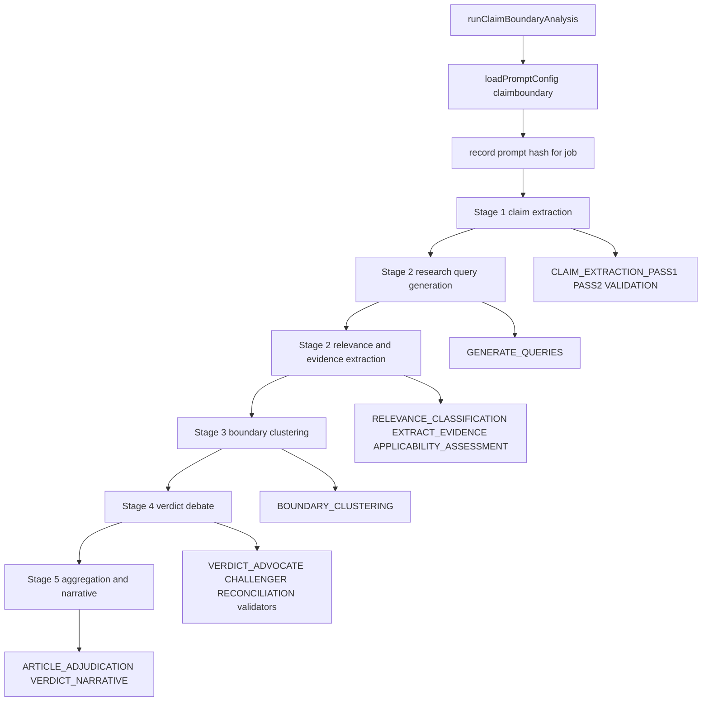
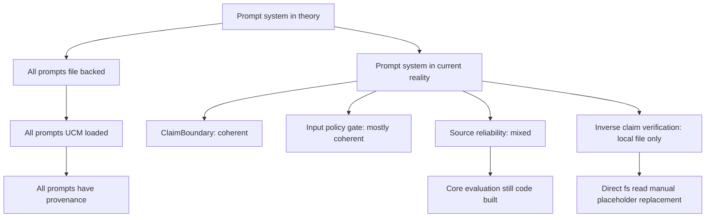

# LLM Prompt System Explanation

**Date:** 2026-04-15  
**Scope:** How the live prompt system works in `apps/web/`, with diagrams and implementation notes

---

## Analogy

Think of the prompt system like a theater production.

- The `.prompt.md` files are the master scripts.
- UCM is the script vault that stores the active version.
- `config-loader.ts` fetches the active script for runtime use.
- `prompt-loader.ts` is the stage manager: it splits the script into scenes, fills in variables, and hands the right scene to the right actor.
- Each analyzer stage is an actor performing one scene at the right moment.

That is the intended architecture. It is fully true for the main ClaimBoundary pipeline, and only partly true for some secondary prompt surfaces.

---

## High-Level Flow

```mermaid
flowchart LR
    A[apps/web/prompts/*.prompt.md] --> B[config-storage.ts seed/refresh]
    B --> C[UCM config_blobs]
    C --> D[config-loader.ts loadPromptConfig]
    D --> E[prompt-loader.ts parse frontmatter and sections]
    E --> F[loadAndRenderSection pipeline section variables]
    F --> G[Analyzer stage sends rendered section as system prompt]
    D --> H[recordConfigUsage jobId contentHash]
    H --> I[/api/fh/jobs/:id/prompts]
    I --> J[PromptViewer UI]
```

### What this means

The file on disk is the editable source file, but the live runtime usually reads the prompt from UCM-backed storage, not directly from disk. The disk file seeds or refreshes the DB copy. That gives the system:

- content-hash provenance
- admin editability
- stable prompt version tracking per job

---

## Main Components

### 1. Prompt files on disk

The primary live analyzer prompt file is:

- [claimboundary.prompt.md](/c:/DEV/FactHarbor/apps/web/prompts/claimboundary.prompt.md:1)

It contains:

- YAML frontmatter
- a `requiredSections` list
- many `## SECTION_NAME` blocks such as:
  - `CLAIM_EXTRACTION_PASS1`
  - `GENERATE_QUERIES`
  - `EXTRACT_EVIDENCE`
  - `BOUNDARY_CLUSTERING`
  - `VERDICT_ADVOCATE`
  - `VERDICT_RECONCILIATION`
  - `VERDICT_NARRATIVE`

The prompt file is treated as a contract, not just free text. There is a test that checks that frontmatter section declarations and real section headings stay aligned:

- [prompt-frontmatter-drift.test.ts](/c:/DEV/FactHarbor/apps/web/test/unit/lib/analyzer/prompt-frontmatter-drift.test.ts:1)

### 2. UCM-backed prompt loading

At runtime, prompt loading is DB-first through:

- [config-loader.ts](/c:/DEV/FactHarbor/apps/web/src/lib/config-loader.ts:442)

`loadPromptConfig()` does four important things:

1. refreshes a system-seeded prompt from disk if the file changed
2. lazily seeds from file if no DB prompt exists yet
3. caches prompt content
4. records prompt usage by job ID and content hash

The seeding and refresh mechanics live in:

- [config-storage.ts](/c:/DEV/FactHarbor/apps/web/src/lib/config-storage.ts:1277)

### 3. Prompt parsing and section rendering

The prompt content is then handled by:

- [prompt-loader.ts](/c:/DEV/FactHarbor/apps/web/src/lib/analyzer/prompt-loader.ts:656)

`prompt-loader.ts` is responsible for:

- parsing frontmatter
- extracting `## SECTION_NAME` blocks
- validating required sections
- rendering `${variable}` placeholders
- caching by content hash

The most important helper is:

- `loadAndRenderSection(pipeline, sectionName, variables)`

That is the main bridge between prompt files and analyzer code.

---

## ClaimBoundary Runtime Flow



### Concrete call sites

The pattern is consistent across the ClaimBoundary pipeline:

- Stage 1 pass 1 loads `CLAIM_EXTRACTION_PASS1`:
  - [claim-extraction-stage.ts](/c:/DEV/FactHarbor/apps/web/src/lib/analyzer/claim-extraction-stage.ts:987)
- Stage 2 query generation loads `GENERATE_QUERIES`:
  - [research-query-stage.ts](/c:/DEV/FactHarbor/apps/web/src/lib/analyzer/research-query-stage.ts:87)
- Stage 2 relevance classification loads `RELEVANCE_CLASSIFICATION`:
  - [research-extraction-stage.ts](/c:/DEV/FactHarbor/apps/web/src/lib/analyzer/research-extraction-stage.ts:113)
- Stage 2 extraction loads `EXTRACT_EVIDENCE`:
  - [research-extraction-stage.ts](/c:/DEV/FactHarbor/apps/web/src/lib/analyzer/research-extraction-stage.ts:261)
- Stage 3 loads `BOUNDARY_CLUSTERING`:
  - [boundary-clustering-stage.ts](/c:/DEV/FactHarbor/apps/web/src/lib/analyzer/boundary-clustering-stage.ts:279)
- Stage 4 dynamically loads verdict sections:
  - [verdict-generation-stage.ts](/c:/DEV/FactHarbor/apps/web/src/lib/analyzer/verdict-generation-stage.ts:397)
- Stage 5 loads `ARTICLE_ADJUDICATION` and `VERDICT_NARRATIVE`:
  - [aggregation-stage.ts](/c:/DEV/FactHarbor/apps/web/src/lib/analyzer/aggregation-stage.ts:634)
  - [aggregation-stage.ts](/c:/DEV/FactHarbor/apps/web/src/lib/analyzer/aggregation-stage.ts:784)

This is the cleanest and most mature prompt architecture in the repo.

---

## Prompt Provenance

One of the strongest parts of the current design is prompt provenance.

At pipeline start, the analyzer records which prompt content hash was used:

- [claimboundary-pipeline.ts](/c:/DEV/FactHarbor/apps/web/src/lib/analyzer/claimboundary-pipeline.ts:381)

That provenance is exposed through:

- [jobs prompts API](/c:/DEV/FactHarbor/apps/web/src/app/api/fh/jobs/[id]/prompts/route.ts:1)
- [PromptViewer UI](/c:/DEV/FactHarbor/apps/web/src/app/jobs/[id]/components/PromptViewer.tsx:1)

So for a ClaimBoundary job, you can inspect:

- which prompt profile was used
- which content hash was active
- optionally the exact prompt content

This is why the DB-first prompt model matters: it makes prompts auditable as part of job history.

---

## Secondary Prompt Surfaces

The repo has other prompt surfaces besides ClaimBoundary.

### Input policy gate

This one follows the same broad UCM idea:

- prompt file:
  - [input-policy-gate.prompt.md](/c:/DEV/FactHarbor/apps/web/prompts/input-policy-gate.prompt.md:1)
- consumer:
  - [input-policy-gate.ts](/c:/DEV/FactHarbor/apps/web/src/lib/input-policy-gate.ts:1)

This path uses `loadPromptConfig()` directly rather than section-based `prompt-loader.ts`, because the prompt file is small and consumed as one whole prompt.

### Source reliability

This one is mixed.

- There is a file-backed/UCM-backed prompt:
  - [source-reliability.prompt.md](/c:/DEV/FactHarbor/apps/web/prompts/source-reliability.prompt.md:1)
- Some enrichment logic loads sections from it:
  - [sr-eval-enrichment.ts](/c:/DEV/FactHarbor/apps/web/src/lib/source-reliability/sr-eval-enrichment.ts:95)
- But the main evaluation/refinement path still uses TypeScript prompt builders:
  - [sr-eval-engine.ts](/c:/DEV/FactHarbor/apps/web/src/lib/source-reliability/sr-eval-engine.ts:247)
  - [sr-eval-prompts.ts](/c:/DEV/FactHarbor/apps/web/src/lib/source-reliability/sr-eval-prompts.ts:1)

So the SR prompt architecture is only partially aligned with the ClaimBoundary model.

---

## Where The Architecture Stops Being Uniform



### The two biggest exceptions

#### 1. Source-reliability core evaluation

The docs describe `source-reliability.prompt.md` as authoritative, but the most important SR prompt path still lives in TypeScript. That means SR currently has two prompt-authority surfaces.

#### 2. Inverse-claim verification helper

This micro-prompt is loaded directly from disk:

- [paired-job-audit.ts](/c:/DEV/FactHarbor/apps/web/src/lib/calibration/paired-job-audit.ts:159)

It does not go through UCM, `prompt-loader.ts`, or prompt usage tracking. It is a small path, but it breaks the otherwise clean prompt-governance story.

---

## Step-By-Step Walkthrough

### Step 1: A prompt starts as a markdown file

Example:

- `apps/web/prompts/claimboundary.prompt.md`

It declares metadata in frontmatter and defines many named sections.

### Step 2: The file is seeded into UCM storage

This happens through the prompt seeding/refresh logic in `config-storage.ts`. The live system then has an active prompt blob with a content hash.

### Step 3: Runtime asks for the active prompt

`loadPromptConfig("claimboundary", jobId)` fetches the active prompt content and records that the job used that content hash.

### Step 4: The analyzer asks for one section

The stage code usually does not want the whole file. It asks for one named section, for example:

- `CLAIM_EXTRACTION_PASS1`
- `GENERATE_QUERIES`
- `VERDICT_ADVOCATE`

### Step 5: Variables are substituted

`prompt-loader.ts` replaces `${currentDate}`, `${analysisInput}`, `${claim}`, and other placeholders with actual runtime values.

### Step 6: The rendered section becomes the system prompt

The stage passes the rendered section into `generateText()` as the system message.

### Step 7: The job keeps prompt provenance

Later, the job details page can show which prompt hash and content were used for that run.

---

## Common Misconception

The most common wrong summary would be:

> “All prompts in FactHarbor are centrally managed through UCM, and the markdown files are the runtime source of truth.”

That is only fully true for the main ClaimBoundary path.

The more accurate summary is:

> ClaimBoundary has a coherent UCM-backed prompt architecture. Other prompt surfaces partly follow it, but source reliability and the inverse-claim helper still contain important exceptions.

---

## Gotchas

### Gotcha 1: File state is not automatically runtime state

Changing a `.prompt.md` file does not by itself prove that runtime is using that exact content. Runtime is DB-first. If the active UCM blob is older or admin-managed, the live job may still use something else.

### Gotcha 2: Prompt docs are ahead of reality in some places

The docs make the prompt system look more uniform than it currently is. That is mostly true for ClaimBoundary, but not yet for all prompt consumers.

### Gotcha 3: `text-analysis` is a stale half-state

The repo still has `text-analysis` prompt-profile references in some shared types and docs, but the current on-disk and seedable prompt structure does not cleanly support a real `text-analysis` profile anymore.

---

## Bottom Line

If you want to understand the prompt system quickly, start with ClaimBoundary:

- [claimboundary.prompt.md](/c:/DEV/FactHarbor/apps/web/prompts/claimboundary.prompt.md:1)
- [config-loader.ts](/c:/DEV/FactHarbor/apps/web/src/lib/config-loader.ts:442)
- [prompt-loader.ts](/c:/DEV/FactHarbor/apps/web/src/lib/analyzer/prompt-loader.ts:656)
- [claimboundary-pipeline.ts](/c:/DEV/FactHarbor/apps/web/src/lib/analyzer/claimboundary-pipeline.ts:381)

That path shows the intended architecture clearly.

If you want to understand why prompt governance still feels uneven, then inspect the exceptions:

- [sr-eval-engine.ts](/c:/DEV/FactHarbor/apps/web/src/lib/source-reliability/sr-eval-engine.ts:247)
- [sr-eval-prompts.ts](/c:/DEV/FactHarbor/apps/web/src/lib/source-reliability/sr-eval-prompts.ts:1)
- [paired-job-audit.ts](/c:/DEV/FactHarbor/apps/web/src/lib/calibration/paired-job-audit.ts:159)
- [2026-04-15_Prompt_System_Architecture_Issues_Report.md](/c:/DEV/FactHarbor/Docs/WIP/2026-04-15_Prompt_System_Architecture_Issues_Report.md:1)
