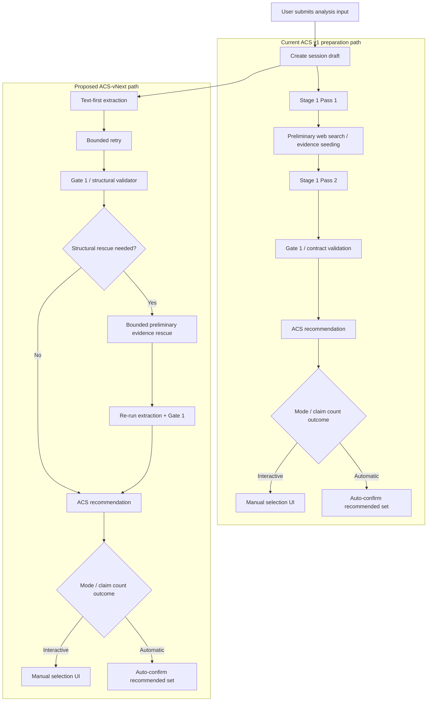

# Session Preparation Text-First Follow-On Proposal

> **Status note (2026-04-23):** This document is retained as a debate artifact, not the current recommended direction. After clarification that preliminary evidence currently influences Stage 1 atomic-claim generation, Captain rejected semantics-changing redesign for this problem. The active recommended direction is now the semantics-preserving async/session UX proposal in [2026-04-23_Session_Preparation_Semantics_Preserving_Async_Proposal.md](/c:/DEV/FactHarbor/Docs/WIP/2026-04-23_Session_Preparation_Semantics_Preserving_Async_Proposal.md).

## 1. Purpose

This document captures a follow-on architecture proposal for session preparation after the current ACS v1 work.

The narrow recommendation is:

- do not reinterpret ACS v1
- keep ACS v1 semantics unchanged
- design a later `ACS-vNext` path that reaches recommendation and selection earlier on healthy inputs
- retain preliminary evidence gathering only as a bounded Stage 1 rescue path

This proposal exists because the live session flow has exposed a mismatch between product expectations and runtime behavior:

- users expect preparation to feel like atomic-claim preparation plus recommendation
- current session preparation performs a full evidence-seeded Stage 1 before recommendation
- heavy preparation cost and pre-recommendation contract failures delay or prevent reaching selection

## 2. Non-Goals

This proposal does not:

- change the current ACS v1 contract
- make recommendation depend on preliminary evidence
- introduce deterministic semantic heuristics
- remove the existing evidence-seeded Stage 1 path outright
- authorize immediate implementation without shadow validation

## 3. Current Problem

Today, session preparation is slower and heavier than the UI framing suggests.

The current path does this:

1. resolve input
2. run Stage 1 claim extraction
3. inside Stage 1, run Pass 1, preliminary search, Pass 2, and Gate 1
4. only after that, run ACS recommendation
5. only then surface selection or auto-continue

That means:

- recommendation is not the cause of the heaviest early delay
- AC selection waits on a mini-research step it does not directly need
- some sessions fail in Stage 1 contract preservation before recommendation ever starts

## 4. Decision Summary

Structured debate result: `MODIFY`.

The recommended direction is:

- pursue a text-first default preparation path
- keep preliminary evidence gathering only as a validator-triggered rescue
- scope this as a post-`ACS-1` architecture track, not an ACS v1 change
- require shadow-mode parity before any rollout

## 5. Current vs Proposed Flow

## 6. Proposal

### 6.1 High-level proposal

Make the default preparation path:

- text-first atomic-claim extraction
- bounded retry
- Gate 1
- recommendation
- selection or auto-continue

Keep preliminary evidence gathering available only when a structural validator proves the text-first path has failed to preserve the Stage 1 contract.

### 6.2 Why this proposal won the debate

- ACS recommendation already operates only on the final candidate claims.
- Recommendation does not require preliminary evidence.
- User pain is currently concentrated before recommendation.
- Current evidence-seeded Stage 1 is expensive and still does not reliably prevent difficult-input failures.
- But there is still no proof that a text-first default is quality-safe enough to replace the current default immediately.

## 7. Target Design

### 7.1 Scope boundary

This design must be framed as `ACS-vNext`.

It is not valid to describe it as “still ACS v1,” because the current ACS v1 spec explicitly preserves current Stage 1 extraction semantics.

### 7.2 Stage 1 split

Introduce two internal preparation paths under one Stage 1 contract:

- `prep_default_text_first`
- `prep_rescue_grounding`

The first is the intended common path.
The second is a bounded recovery path.

### 7.3 Recommendation boundary

Recommendation remains unchanged:

- input: `originalInput`, `impliedClaim`, `articleThesis`, final `atomicClaims`
- position: post-Gate-1
- purpose: rank and recommend already-valid candidate claims

This proposal must not turn recommendation into a rescue or filtering authority for broken Stage 1 outputs.

### 7.4 Rescue triggers

Rescue may only be triggered by structural failure signals, for example:

- contract violation
- preservation failure
- empty viable claim set after bounded retry
- schema-invalid output after bounded retry
- required-field inconsistency

These are examples of acceptable trigger classes, not final implementation wording.

### 7.5 Rescue constraints

The rescue path must remain narrow:

- minimal preliminary evidence gathering
- re-run extraction and Gate 1 with recovered grounding
- no semantic keyword logic
- no language-specific heuristics
- no hidden recommendation behavior inside rescue

### 7.6 Observability requirements

Both paths must emit comparable telemetry:

- preparation latency
- rescue invocation rate
- Gate 1 pass/fail rate
- contract-preservation failures
- under-splitting / over-splitting indicators
- downstream recommendation quality
- downstream report-quality deltas

## 8. Risks

### 8.1 Quality regression risk

Preliminary evidence currently contributes to grounding, specificity handling, and contract preservation.

Removing it from the default path may worsen difficult URL/article/campaign-page cases even if common-path latency improves.

### 8.2 Hidden heuristic risk

A “validator-driven” rescue can still violate AGENTS rules if the validator begins encoding meaning judgments indirectly.

This is the main compliance risk.

### 8.3 False confidence risk

Faster preparation may look like success even if:

- claim fidelity regresses
- recommendation quality degrades
- final reports become weaker

Latency must not be treated as the only success metric.

### 8.4 Governance drift risk

If this is implemented or described as an ACS v1 tweak, the documentation and implementation contract will drift out of sync.

## 9. Rollout Plan

### Phase 1 — Design and Instrumentation

- define the exact Stage 1 success vs rescue-required contract
- define rescue triggers in structural terms only
- identify the UCM/config knobs needed for guarded rollout
- add telemetry for both preparation paths

### Phase 2 — Shadow Evaluation

- run the text-first path in shadow mode only
- use only Captain-approved inputs
- include multilingual and hard article-style cases
- compare Stage 1 quality and downstream report quality against the current path

### Phase 3 — Controlled Rollout

- expose the new path behind a feature/config flag
- promote only if parity is acceptable and time-to-selection improves materially
- keep rollback and rescue fallback available until stable

## 10. Required Validation Before Rollout

Promotion beyond shadow mode should require evidence on:

- candidate-set fidelity
- contract preservation
- under-splitting and over-splitting rates
- recommendation usefulness
- final verdict/report deltas
- multilingual stability
- input neutrality

No universal default rollout should happen before those conditions are met.

## 11. Open Questions

- What exact structural rescue triggers are sufficient without drifting into semantic judgment?
- Which Captain-approved inputs are mandatory in the shadow set for this decision?
- Can any safe rescue happen after user selection, or must all rescue stay before recommendation?
- What parity threshold is strong enough to justify making the text-first path the default?

## 12. Recommendation

Proceed with this as a documented `ACS-vNext` exploration track.

Do not implement it as a quiet ACS v1 refactor.

The current evidence supports design work, instrumentation, and shadow evaluation. It does not yet support default rollout.
