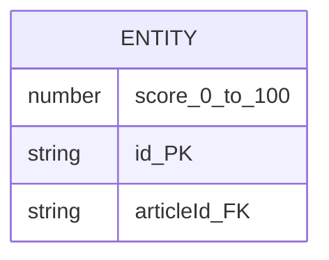

# Mermaid Diagram Fixes - Summary

**Date:** 2026-01-21  
**Issue:** Mermaid ERD diagrams had spaces in property names causing syntax errors  
**Root Cause:** Property definitions like `number score 0_to_100` should be `number score_0_to_100`

## Files Fixed (6 total)

All files are from `FactHarbor_Spec_and_Impl_21.Jan.26.xar`:

1. **FactHarbor.Roadmap.Architecture Analysis 1.Jan.26.WebHome**
   - Fixed multiple ERD property names in both "Data Objects ERD" and "Data Usage ERD"
   - Examples: `string id PK` → `string id_PK`, `string JobId FK` → `string JobId_FK`

2. **FactHarbor.Specification.Diagrams.Audit Trail ERD.WebHome**
   - Fixed property names in both "Current Implementation" and "Target Architecture" ERDs
   - Examples: `int JobId FK` → `int JobId_FK`, `uuid claim_id FK` → `uuid claim_id_FK`

3. **FactHarbor.Specification.Diagrams.Core Data Model ERD.WebHome**
   - Fixed property names in "Current Implementation Data Model" ERD
   - Examples: `string id PK` → `string id_PK`, `string articleId FK` → `string articleId_FK`

4. **FactHarbor.Specification.Diagrams.Evidence and Verdict Workflow.WebHome**
   - Fixed property names in "Evidence and Verdict Data Model" ERD
   - Examples: `string id PK` → `string id_PK`, `string claimId FK` → `string claimId_FK`

5. **FactHarbor.Specification.Diagrams.Monolithic Dynamic Pipeline Internal.WebHome** ⚠️ **Reported Issue**
   - Fixed property names in "Output Schema" ERD
   - Examples: `number score 0_to_100` → `number score_0_to_100`, `number confidence 0_to_100` → `number confidence_0_to_100`
   - Also fixed: `string support strong_moderate_weak_none` → `string support_strong_moderate_weak_none`

6. **FactHarbor.Specification.Diagrams.Technical and System Users.WebHome**
   - Fixed property names in "Target Technical Model" ERD
   - Examples: `string UserID PK` → `string UserID_PK`, `string ServiceID FK` → `string ServiceID_FK`

## Pattern Fixed

**Before:**
```mermaid
erDiagram
    ENTITY {
        number score 0_to_100
        string id PK
        string articleId FK
    }
```

**After:**


## Full Fixed XAR ✅

**Status:** VERIFIED AND COMPLETE

A full fixed XAR file has been created: `FactHarbor_Spec_and_Impl_21.Jan.26_Fixed.xar` (342.57 KB)

This contains ALL pages from the original XAR with the 6 Mermaid diagram fixes applied.

## Import Instructions

1. Open XWiki
2. Go to Administration → Import
3. Upload `FactHarbor_Spec_and_Impl_21.Jan.26_Fixed.xar`
4. Review the pages to be imported
5. Click "Import" (select "Replace" if pages already exist)
6. All Mermaid diagrams will render correctly

## Verification

After import, verify these pages render without "Syntax error in text":
- ✅ FactHarbor.Specification.Diagrams.Monolithic Dynamic Pipeline Internal.WebHome (second diagram)
- ✅ All other ERD diagrams in the Specification.Diagrams space
- ✅ Architecture Analysis 1.Jan.26 ERD diagrams

## Notes

- All fixes preserve the original meaning and structure
- Only property name formatting was changed (spaces → underscores)
- No data or diagram structure was modified
- The fix is compatible with Mermaid version 11.12.2+
