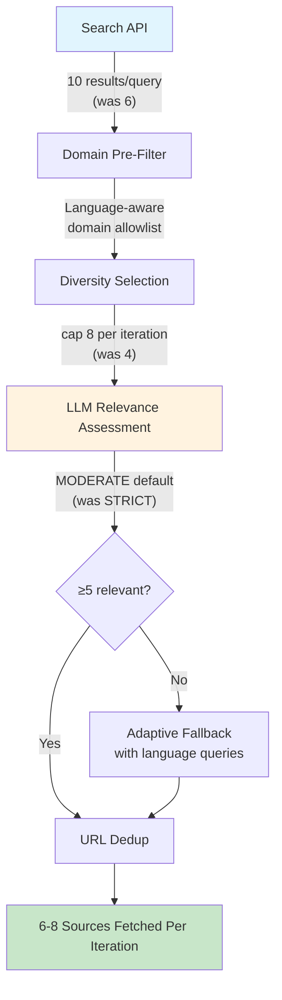
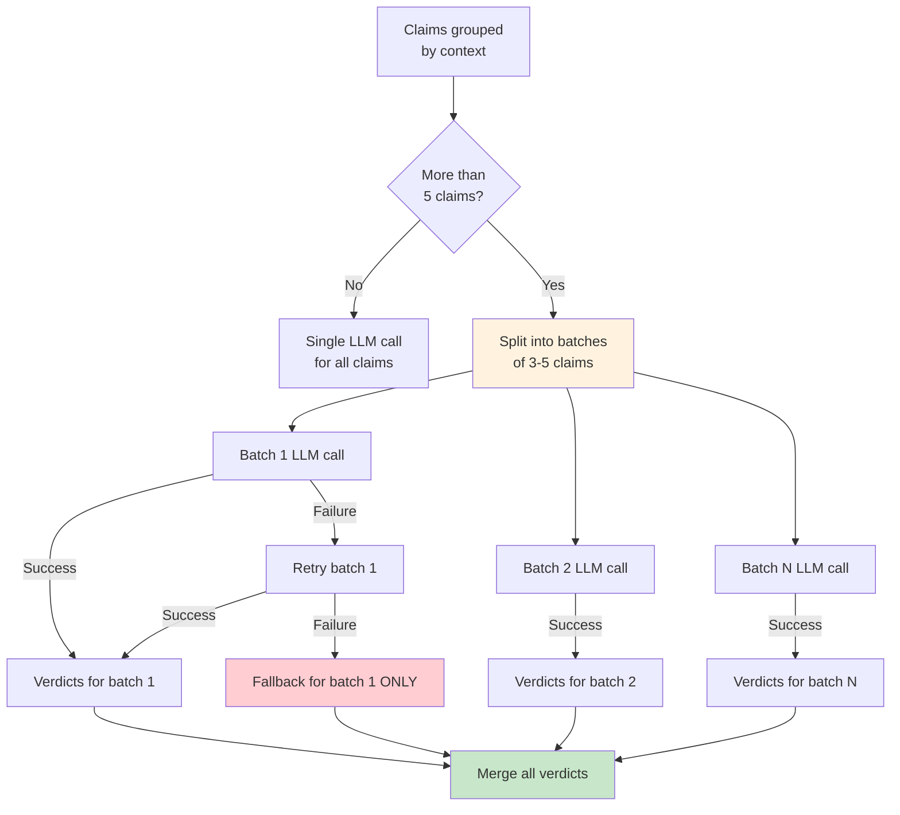
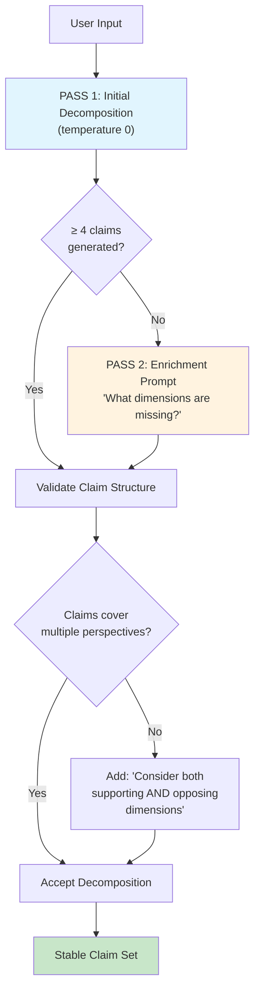
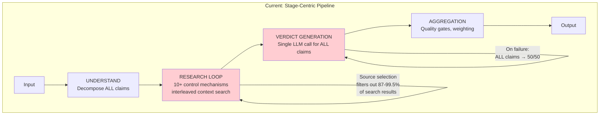
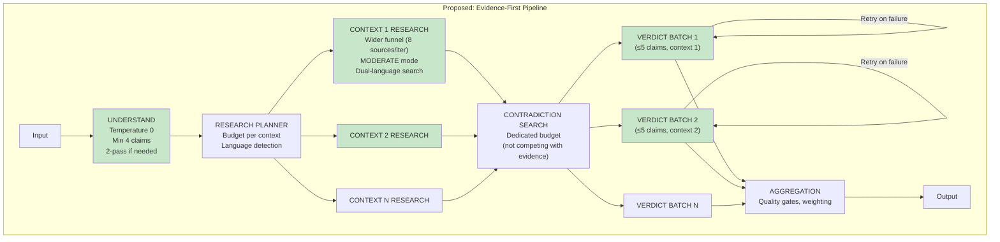
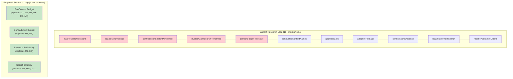
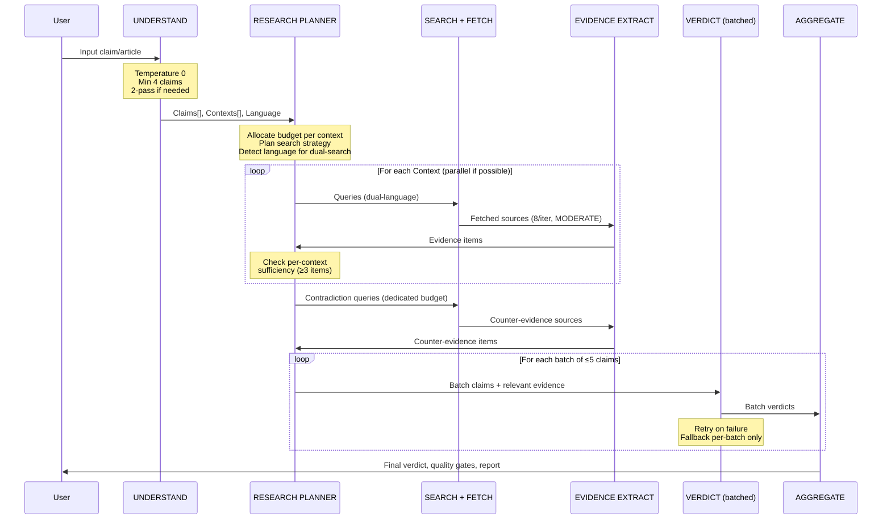

# Phase 8 — Pipeline Redesign Proposal

**Date:** 2026-02-15
**Author:** Claude Opus 4.6 (Lead Architect)
**Status:** Proposal — awaiting Captain approval
**Prerequisite:** Read `Phase8_Systematic_Analysis_2026-02-15.md` first

---

## 1. Design Principles

Before proposing changes, let me state the principles that guide this redesign:

1. **Fix the bottleneck first.** 80% of quality problems stem from evidence famine. Fix source selection before anything else.
2. **Simplify, don't add.** The research loop has 10+ control mechanisms. Remove or consolidate, don't add more.
3. **Fail per-claim, not per-job.** If one claim's verdict fails, others should be unaffected.
4. **Language is not an afterthought.** Multilingual search must be built into the core research loop.
5. **Stability over sophistication.** A consistent 60% result is better than oscillating between 38% and 54%.
6. **Incremental delivery.** Three targeted changes, not a full rewrite. Each independently testable and rollback-safe.

---

## 2. The Three Changes

The redesign consists of three independent structural changes, ordered by impact:

```
CHANGE A: Open the Source Selection Funnel     (fixes evidence famine)
CHANGE B: Batch Verdict Generation             (fixes all-or-nothing failure)
CHANGE C: Stabilize Claim Decomposition        (fixes run-to-run instability)
```

Each change addresses one of the three root causes identified in the analysis. They can be implemented and tested independently.

---

## 3. Change A: Open the Source Selection Funnel

**Problem:** 0.5-13% of search results survive to become fetch candidates.
**Impact:** This single change addresses evidence famine, which causes verdict hedging, quality gate failures, and low confidence.

### 3.1 Current State

```
Search API → 6 results/query → Domain Filter → Diversity Selection (cap 4) →
LLM Relevance (STRICT) → Adaptive Fallback → Dedup → 1-14 sources fetched
```

**What kills results:**
- `maxSourcesPerIteration = 4` — hard cap regardless of how many pass filters
- `maxResults = 6` — only 6 requested from search API
- STRICT relevance mode rejects `secondary_commentary` — but commentary IS evidence for most topics
- Domain pre-filter blocks legitimate platforms for non-English content
- LLM relevance assessment with Haiku on non-English snippets has higher false-rejection rate

### 3.2 Proposed Changes



| Parameter | Current | Proposed | Rationale |
|-----------|---------|----------|-----------|
| `maxResults` | 6 | **10** | More candidates before filtering. Cost: negligible (search API). |
| `maxSourcesPerIteration` | 4 | **8** | Doubles fetch throughput per iteration. Cost: more fetches per iteration. |
| Default relevance mode | STRICT (evidence) | **MODERATE** | Accept `secondary_commentary` as valid evidence source. The evidence extraction LLM already filters quality. |
| Domain filter for non-English | Same as English | **Expanded allowlist** | Add `.de`, `.ch`, `.fr` news domains, accept `wordpress.com` for non-English when domain is country-specific. |
| Search language | English only | **Dual-language** | For non-English input: generate queries in BOTH detected language and English. |

### 3.3 Expected Impact

With these changes, the funnel becomes:

| Scenario | Current | Proposed | Improvement |
|----------|---------|----------|-------------|
| SRG DE: results → fetched | 190 → 1 | 190 → ~6-8 | 6-8x more sources |
| SRG EN: results → fetched | 130 → 11 | 130 → ~12-16 | Moderate improvement |
| Evidence per job (DE) | 2-3 | ~10-15 | 4-5x more evidence |
| Evidence per job (EN) | 14-25 | ~20-35 | 1.5-2x more evidence |

### 3.4 Implementation Details

**File:** `apps/web/src/lib/analyzer/orchestrated.ts`

**Change A.1 — Increase search results and source cap:**
- Update `searchConfig.maxResults` default from 6 to 10 (`config-schemas.ts`)
- Update `searchConfig.maxSourcesPerIteration` default from 4 to 8 (`config-schemas.ts`)
- These are UCM-configurable, so the change is just the default.

**Change A.2 — Default to MODERATE relevance mode:**
- In the mode selection logic (~line 11173-11188), change the default for `evidence` category from STRICT to MODERATE.
- Keep STRICT only for targeted context searches (`!!decision.targetContextId`).
- Keep the `criticism`/`counter_evidence` removal from Consolidated Plan (T2.1).

```typescript
// BEFORE:
const strictInstitutionMatch =
  !!decision.targetContextId ||
  (decision.category === "evidence" && hasInstitutionalContext);

// AFTER:
const strictInstitutionMatch =
  !!decision.targetContextId;  // STRICT only for targeted context
```

**Change A.3 — Dual-language search (per Codex + Cline review: use LLM translation, preserve original):**
- In query generation, detect input language (LLM already does this in the understand step).
- For non-English inputs: generate queries in BOTH detected language and English.
- Translation uses an LLM call (Haiku, cached) with a UCM-managed prompt — NOT a separate translation service.
- The original language queries are always preserved and run first. English translations supplement, they don't replace.
- Translation prompt stored in UCM prompt storage, not hardcoded inline.
- LLM translation results are cached by input hash to avoid repeated translations of identical queries.

```typescript
// In decideNextResearch, after generating queries:
if (understanding.detectedLanguage && understanding.detectedLanguage !== 'en') {
  const englishQueries = await translateQueriesToEnglish(
    queries, understandModelInfo.model, pipelineConfig
  );  // LLM-powered, cached, UCM-managed prompt
  queries = [...queries, ...englishQueries];
}
```

**Change A.4 — Language-aware domain handling (UCM-configured, per Codex review):**
- The existing `skipPlatforms` and `skipTlds` lists are already UCM-configurable in `config-schemas.ts`.
- Add a new UCM parameter: `languageSpecificDomainOverrides` — a map of `{ language: string[] }` pairs that exempt specific domains from the `skipPlatforms` filter when the input is in that language.
- Do NOT hardcode any domain strings in code. All domain lists live in UCM, editable by admin at runtime.
- Example UCM config: `{ "de": [".ch", ".de", ".at"], "fr": [".fr", ".ch", ".be"] }` — these override the global `skipPlatforms` for German/French inputs.

### 3.5 Risk and Mitigation

| Risk | Likelihood | Mitigation |
|------|-----------|------------|
| More sources = more cost (LLM extraction per source) | High | Each source adds ~$0.01 (Haiku extraction). Going from 5→10 sources adds ~$0.05/job. Acceptable. |
| MODERATE mode admits low-quality sources | Medium | Evidence extraction LLM already filters quality. Probative value filter already rejects low-quality evidence. The two existing quality gates remain active. |
| Dual-language search doubles search API calls | Medium | Only for non-English. Each SerpAPI call costs ~$0.005. Going from 30→60 searches adds ~$0.15/job. Acceptable for multilingual correctness. |

---

## 4. Change B: Batch Verdict Generation

**Problem:** Verdict generation uses a single LLM call for ALL claims. If it fails, all claims get 50/50 fallback.
**Impact:** Eliminates blanket fallback failures. Enables per-claim retry.

### 4.1 Current State

```
ALL claims + ALL evidence → ONE LLM call → structured output with ALL verdicts
                                                    ↓ (on failure)
                                          ALL claims → 50/50 fallback
```

The SRG URL job had 18 claims — the LLM couldn't generate structured output for all 18, so ALL received 50/50 defaults and the report was flagged as DAMAGED.

### 4.2 Proposed Change



### 4.3 Design

- Group claims by `contextId` (claims in the same context should be evaluated together for coherence).
- If a context has > `verdict.batchSize` claims (UCM-configurable, default: 5), split into sub-batches.
- Each batch gets its own LLM call with the same prompt + only that batch's relevant evidence.
- On failure: retry the specific batch once with a compact prompt (stored in UCM prompt storage).
- If retry fails: that batch gets 50/50 fallback, but other batches are unaffected.

**Batch size = 5** is the sweet spot:
- Small enough for reliable structured output (< 4K output tokens per batch)
- Large enough for cross-claim coherence within a context
- 18 claims → 4 batches → 4 LLM calls → each independently succeeds/fails

**Evidence scoping per batch (per Codex review):**
Each batch receives only the evidence items relevant to its claims. Relevance is determined by:
1. Evidence with matching `contextId` for claims in that context
2. Evidence explicitly linked to claims in the batch (via `claimId` references from extraction)
3. Contradiction/counter-evidence that targets claims in the batch

**Cross-batch verdict reconciliation:**
Batches within the same context share the same evidence pool and prompt instructions. Since claims in the same context are semantically related, verdicts should be coherent. If two batches from the same context produce contradictory verdicts (e.g., batch 1 says 80% supported, batch 2 says 20%), the existing direction correction mechanism catches this during post-verdict validation. No additional reconciliation logic is needed — the same safeguards that work for single-batch verdicts apply to multi-batch.

### 4.4 Implementation Details

**File:** `apps/web/src/lib/analyzer/orchestrated.ts` (verdict generation functions ~line 7493-9700)

The three verdict generation modes (`generateMultiContextVerdicts`, `generateSingleContextVerdicts`, `generateClaimVerdicts`) all follow the same pattern: build prompt → single LLM call → parse all verdicts. The batching logic wraps around this:

```typescript
async function generateVerdictsInBatches(
  claims: SubClaim[],
  evidence: EvidenceItem[],
  options: VerdictOptions
): Promise<ClaimVerdict[]> {
  const BATCH_SIZE = 5;

  if (claims.length <= BATCH_SIZE) {
    return generateVerdictsSingle(claims, evidence, options);
  }

  // Group by context, then split into batches of ≤ BATCH_SIZE
  const batches = groupAndBatchClaims(claims, BATCH_SIZE);
  const allVerdicts: ClaimVerdict[] = [];

  for (const batch of batches) {
    const batchEvidence = filterEvidenceForClaims(evidence, batch);
    try {
      const verdicts = await generateVerdictsSingle(batch, batchEvidence, options);
      allVerdicts.push(...verdicts);
    } catch (error) {
      // Retry once with compact prompt
      try {
        const verdicts = await generateVerdictsSingle(batch, batchEvidence, { ...options, compact: true });
        allVerdicts.push(...verdicts);
      } catch (retryError) {
        // Fallback only this batch
        const fallbacks = batch.map(c => createFallbackVerdict(c));
        allVerdicts.push(...fallbacks);
        logWarning(`Verdict generation failed for batch of ${batch.length} claims`);
      }
    }
  }

  return allVerdicts;
}
```

### 4.5 Risk and Mitigation

| Risk | Likelihood | Mitigation |
|------|-----------|------------|
| More LLM calls = more cost | Medium | Going from 1 to 3-4 calls adds ~$0.03/job (Sonnet verdict). Negligible vs. value. |
| Cross-claim coherence lost | Low | Claims grouped by context. Within a context, the LLM sees all evidence for coherent assessment. Cross-context coherence was always limited anyway. |
| More complex error handling | Low | The retry + fallback logic is straightforward. Each batch is independent. |

---

## 5. Change C: Stabilize Claim Decomposition

**Problem:** Same input produces wildly different claim structures each run (7 vs 11 claims, 9 vs 7 contexts).
**Impact:** Reduces run-to-run verdict instability from ±20pp to ≤5pp (target).

### 5.1 Current State

The UNDERSTAND step sends the input to an LLM and gets back:
- `subClaims[]` — decomposed claims with roles and metadata
- `analysisContexts[]` — analytical frames for the topic

The LLM has wide latitude in how it decomposes. Results vary significantly across runs.

### 5.2 Proposed Change: Two-Pass Decomposition with Validation



### 5.3 Design

**5.3.1 — Temperature for decomposition (UCM-configurable):**
Add a UCM parameter `understand.temperature` (default: `0`). Temperature 0 makes the decomposition deterministic for the same input, eliminating the primary source of run-to-run variation. Admin can tune to 0.1-0.3 if rigidity is observed.

**5.3.2 — Minimum claim threshold (UCM-configurable):**
Add a UCM parameter `understand.minClaimThreshold` (default: `4`). If the LLM produces fewer than this threshold, trigger a second pass:
- Include the first-pass claims in the prompt
- The enrichment prompt text is stored in UCM prompt storage (not inline in code), per AGENTS.md string usage boundary.
- Merge and deduplicate via LLM similarity (`assessTextSimilarityBatch`), not cosine heuristic.

**5.3.3 — LLM-based decomposition validation (per Codex review — no deterministic semantic checks):**
After decomposition, validate via a lightweight LLM call (Haiku):
- Does at least one claim address the core assertion directly?
- Does at least one claim consider a potential counter-argument or limitation?
- Are any claims near-duplicates? (Use existing `assessTextSimilarityBatch` LLM call, not cosine similarity)
- Does each claim have a clear evaluation criterion?

Per AGENTS.md: this involves understanding and interpreting text meaning, so it MUST be LLM-powered, not deterministic regex/heuristic checks. The LLM call returns a structured assessment with pass/fail per criterion and suggested additions if criteria are unmet.

Cost: ~$0.003 per analysis (one Haiku call). Only runs after initial decomposition.

### 5.4 Implementation Details

**File:** `apps/web/src/lib/analyzer/orchestrated.ts` (understand step, ~line 4745)

```typescript
// In understandClaim(), after the initial LLM call:

// 5.3.1: Set temperature 0
const understandOptions = { ...options, temperature: 0 };

// 5.3.2: Minimum claim threshold
if (understanding.subClaims.length < 4) {
  const enriched = await enrichDecomposition(
    input, understanding, understandModelInfo.model, pipelineConfig
  );
  understanding.subClaims = deduplicateClaims([
    ...understanding.subClaims,
    ...enriched.additionalClaims
  ]);
}

// 5.3.3: Structural validation
validateClaimStructure(understanding.subClaims);
```

### 5.5 Risk and Mitigation

| Risk | Likelihood | Mitigation |
|------|-----------|------------|
| Temperature 0 produces lower-quality decomposition | Low | Temperature 0 chooses the highest-probability response. For structured decomposition, this is usually the most thoughtful one. |
| Enrichment pass adds irrelevant claims | Medium | Deduplication + structural validation filter out noise. The min-4 threshold prevents under-decomposition without forcing over-decomposition. |
| Additional LLM call for enrichment adds cost | Low | Only triggers when < 4 claims (rare for well-formed inputs). Costs ~$0.005. |

---

## 6. Architecture: Before and After

### 6.1 Current Architecture (Simplified)



**Problems visible in the diagram:**
- The research loop is a black box with too many internal mechanisms
- Verdict generation has a single point of failure
- There is no feedback from verdicts back to research

### 6.2 Proposed Architecture



**What changed:**
1. Understand step is stabilized (temperature 0, min claims)
2. Research is per-context with wider funnel and language support
3. Contradiction search has dedicated budget (not competing)
4. Verdicts generated in small batches with per-batch retry
5. No single point of failure for verdicts

### 6.3 Research Loop Simplification

The current research loop has 10+ control mechanisms. The proposed design consolidates them:



**Consolidation:**

| Current (10+) | Proposed (4) | How |
|----------------|-------------|-----|
| maxResearchIterations + contextBudget + exhaustedContextNames + gapResearch + centralClaimEvidence | **Per-Context Budget** | Each context gets `ceil(totalBudget / contextCount)` iterations. No interleaving, no retry starvation, no starvation tracking needed. |
| contradictionSearchPerformed + inverseClaimSearchPerformed | **Contradiction Budget** | Fixed 2 iterations reserved. Runs AFTER all context research. No competition with evidence gathering. |
| scaledMinEvidence + centralClaimEvidence | **Evidence Sufficiency** | Per-context check: `evidenceItems.filter(e => e.contextId === ctx.id).length >= 3`. If not met after budget exhausted, log warning but continue. |
| adaptiveFallback + legalFrameworkSearch + recencySensitiveClaims | **Search Strategy** | Adaptive fallback is built into the wider funnel (MODERATE default). Legal framework and recency are search hints, not separate mechanisms. |

---

## 7. Data Flow Diagram



---

## 8. Implementation Plan

### Phase 8a: Open the Source Selection Funnel (Change A)

**Effort:** 2-3 hours
**Files:** `config-schemas.ts` (defaults), `orchestrated.ts` (relevance mode, dual-language), `source-reliability.ts` (language-aware filter)
**Test:** Re-run SRG DE + SRG EN + H2 + Bolsonaro. Verify: evidence count increases, source fetch rate increases, quality gate pass rate improves.

### Phase 8b: Batch Verdict Generation (Change B)

**Effort:** 3-4 hours
**Files:** `orchestrated.ts` (verdict generation functions)
**Test:** Re-run SRG URL (18 claims). Verify: no blanket 50/50, per-batch verdicts, report not DAMAGED.

### Phase 8c: Stabilize Decomposition (Change C)

**Effort:** 2-3 hours
**Files:** `orchestrated.ts` (understand step)
**Test:** Run same input (Bolsonaro, H2) 3 times each. Verify: claim count ±1, context count ±1, verdict ±5pp across runs.

### Phase 8d: Research Loop Simplification

**Effort:** 4-6 hours (higher risk, requires careful testing)
**Files:** `orchestrated.ts` (research loop, decideNextResearch)
**Precondition:** Phase 8a results validate that wider funnel provides sufficient evidence.
**Test:** Full regression: all test inputs from Phases 6-8. Verify: no quality degradation vs Phase 8a.

### Execution Order

```
Phase 8a (source funnel) → Test → Phase 8b (verdict batching) → Test
                                                                    ↓
Phase 8c (decomposition) → Test → Phase 8d (loop simplification) → Full Regression
```

Each phase is independently valuable and independently testable. If Phase 8d proves too risky, the pipeline still benefits from 8a-8c.

---

## 9. Success Criteria

| Metric | Current (Phase 7) | Target (Phase 8) | How Measured |
|--------|-------------------|-------------------|-------------|
| Quality gate pass rate | 37.5% (3/8) | **≥75%** (6/8) | Re-run all 8 orchestrated inputs |
| SRG DE evidence items | 2-3 | **≥8** | Compare against today's results |
| SRG DE/EN parity (evidence) | 3 vs 16 (5x gap) | **≤2x gap** | Same input both languages |
| Run-to-run verdict stability | ±20pp (Bolsonaro) | **±5pp** | 3 runs of same input |
| SRG URL fallback rate | 18/18 (100%) | **≤2/18** | No more blanket failure |
| Ev/Search ratio (average) | 0.44 | **≥0.80** | Evidence items / search queries |
| Contradiction search fires | 6/8 (75%) | **8/8 (100%)** | Dedicated budget, not competing |

---

## 10. What NOT to Touch

- **Aggregation logic** (`aggregation.ts`): The weighting system (centrality × harm × confidence) is sound. The problem is input quality, not aggregation formula.
- **Evidence filter** (`evidence-filter.ts`): Deterministic quality filtering works. More evidence entering means more evidence surviving.
- **Confidence calibration** (`confidence-calibration.ts`): 4-layer system is correct. Higher evidence counts → higher calibrated confidence automatically.
- **Direction correction**: Working correctly (validated in Phase 7).
- **Quality gates**: Gate 1 and Gate 4 logic is sound. They correctly identify low-quality results. The fix is producing higher-quality results, not changing the gates.

---

## 11. Why This Will Work

Previous phases targeted **symptoms**:
- harmPotential inflation → prompt tuning, decontextualized classifier
- Verdict hedging → anti-hedging prompt instructions
- Research loop starvation → circuit breaker, iteration scaling
- All-50/50 fallback → maxOutputTokens increase

This proposal targets **the three root causes**:

| Root Cause | Change | Mechanism |
|-----------|--------|-----------|
| Evidence famine (0.5-13% source survival) | **A: Open funnel** | 2x sources/iteration, MODERATE mode, dual-language, expanded domains |
| All-or-nothing verdict failure | **B: Batch verdicts** | Per-batch generation with per-batch retry and per-batch fallback |
| Decomposition instability | **C: Stabilize decomposition** | Temperature 0, minimum claims, 2-pass enrichment |

With sufficient evidence (Change A), verdicts will naturally improve:
- More evidence → LLM has more to work with → less hedging
- More evidence → higher confidence calibration → quality gates pass
- More sources → more perspectives → better balance

With stable decomposition (Change C):
- Same claims each run → same evidence targets → same verdicts
- Minimum 4 claims → adequate analytical depth for simple inputs
- Language-independent (temperature 0 produces same structure regardless of phrasing)

With batched verdicts (Change B):
- 18-claim analyses no longer fail wholesale
- Per-claim retry catches transient LLM failures
- Partial success is better than total failure

**These changes are not speculative.** The data shows exactly where evidence is lost (source selection), why verdicts fail (all-or-nothing), and what causes instability (LLM non-determinism). The fixes are directly targeted at these measured bottlenecks.

---

## 12. UCM Configuration Summary (Per Codex + Cline Review)

All new parameters that affect analysis outcomes MUST be UCM-configurable per AGENTS.md Configuration Placement rules. Here is the complete list of new UCM parameters:

| Parameter | Default | Change | Location |
|-----------|---------|--------|----------|
| `search.maxResults` | 6 → **10** | A.1 | Search config |
| `search.maxSourcesPerIteration` | 4 → **8** | A.1 | Search config |
| `search.languageSpecificDomainOverrides` | `{}` | A.4 | SR config |
| `understand.temperature` | **0** | C.1 | Pipeline config |
| `understand.minClaimThreshold` | **4** | C.2 | Pipeline config |
| `verdict.batchSize` | **5** | B | Calc config |
| `research.perContextEvidenceTarget` | **3** | 6.3 simplification | Pipeline config |

**Prompt strings** for enrichment (C.2), compact retry (B), and query translation (A.3) are stored in UCM prompt storage, not inline in code.

**Alignment with Gate 4:** The per-context evidence target (≥3 items) aligns with Gate 4's "insufficient" threshold, which currently requires diverse evidence for publishable status. Making it UCM-configurable allows tuning based on observed Gate 4 pass rates.

---

## 13. Cost Impact

| Change | Per-Job Cost Impact | Justification |
|--------|-------------------|---------------|
| A: More sources | +$0.05-0.10 (more extractions) | 2x more sources → 2x more Haiku extraction calls |
| A: Dual-language search | +$0.15 (non-English only) | 2x search queries for non-English inputs |
| B: Batched verdicts | +$0.03-0.10 (more Sonnet calls) | 3-4 verdict batches vs 1, but smaller each |
| C: Enrichment pass | +$0.005 (rare) | Only when < 4 claims |
| C: Decomposition validation | +$0.003 | One Haiku call |
| **Total per job** | **+$0.10-0.25** | From ~$0.50 to ~$0.60-0.75 per analysis |

**Volume projection (per Cline review):**

| Monthly Volume | Current Cost | Projected Cost | Delta |
|----------------|-------------|---------------|-------|
| 100 jobs | $50 | $60-75 | +$10-25 |
| 1,000 jobs | $500 | $600-750 | +$100-250 |
| 10,000 jobs | $5,000 | $6,000-7,500 | +$1,000-2,500 |

Current jobs run 18-49 LLM calls. These changes add ~5-10 more calls but produce dramatically better results. The cost increase is proportional and bounded.

---

## 14. Phase 8d Deferral (Per Cline Review)

Cline correctly recommends deferring Phase 8d (research loop simplification, consolidating 10+ mechanisms to 4) to a separate Phase 9. Rationale:
- Phases 8a-8c are independently high-value and low-risk.
- 8d touches the core research loop structure with complex interactions.
- Let 8a-8c stabilize and produce baseline data first.
- 8d's consolidation benefits from knowing which mechanisms are still needed after the funnel is opened.

**Phase 8d is moved to future Phase 9, contingent on 8a-8c results.**

---

## 15. Risks

| Risk | Likelihood | Impact | Mitigation |
|------|-----------|--------|------------|
| Wider funnel admits low-quality sources | Medium | Low | Evidence extraction LLM + probative value filter + Gate 4 still active. Quality is maintained by the extraction layer, not the source selection layer. Measure probativeValue distribution after change. |
| Dual-language search misidentifies language | Low | Low | Use LLM's language detection from understand step. Fallback: English only (same as now). |
| Temperature 0 produces rigid decomposition | Low | Medium | UCM-configurable (default 0). Monitor across diverse topics. Admin can tune to 0.1 if needed. |
| Total cost increase | High (it will increase) | Low | $0.10-0.25 per job is acceptable for a quality increase from 37.5% to 75%+ pass rate. See volume projections in §13. |
| Increased fetch/extraction load | Medium | Low | Confirm runner concurrency limits. `maxSourcesPerIteration=8` doubles fetches per iteration but is bounded by iteration budget. |

---

## 16. Author's Response to Review Notes

### Codex GPT-5 Review — All Points Addressed

| Codex Point | Resolution | Where |
|-------------|-----------|-------|
| Language-specific domain lists hardcoded | Changed to UCM-configurable `languageSpecificDomainOverrides` map | §3.4 Change A.4 |
| Structural validation uses deterministic semantic checks | Changed to LLM-based validation via Haiku call | §5.3.3 |
| Batch size, min claims, temperature should be UCM | Added all as UCM parameters | §12 UCM Configuration Summary |
| Inline prompt strings should be in UCM | All prompt strings stored in UCM prompt storage | §5.3.2, §4.3 |
| Measure probativeValue after MODERATE switch | Added to risk mitigation | §15 |
| Confirm concurrency limits | Added as risk item | §15 |
| Use LLM translation with caching | Specified: Haiku, cached by hash, UCM-managed prompt | §3.4 Change A.3 |
| Use `assessTextSimilarityBatch` not cosine | Changed dedup to use existing LLM similarity | §5.3.2, §5.3.3 |
| Evidence sufficiency align with Gate 4, make configurable | Added UCM param + Gate 4 alignment note | §12 |
| Evidence scoping per batch, conflicting verdict reconciliation | Added detailed scoping and reconciliation design | §4.3 |

### Cline (GLM-5) Review — Points Addressed

| Cline Point | Resolution | Where |
|-------------|-----------|-------|
| UCM admin control for all new defaults | Full UCM parameter table added | §12 |
| LLM for query translation | Specified: Haiku, cached, UCM prompt | §3.4 Change A.3 |
| Defer Phase 8d to Phase 9 | Agreed and documented | §14 |
| Verdict accuracy vs ground truth | Valid concern — out of scope for this proposal but flagged for future metric | N/A (deferred) |
| Volume cost projections | Added 100/1K/10K monthly projections | §13 |

### Senior Developer (Claude Opus) Review — All Conditions Addressed

| Senior Dev Condition | Resolution | Where |
|---------------------|-----------|-------|
| C1: Add per-stage counters to source selection | ACCEPTED — prerequisite instrumentation PR before any behavioral changes | Sequencing in §8 of Sr Dev review; to be implemented first |
| C2: Investigate SRG URL extraction anomaly (0.4 ev/source) | ACCEPTED — examine 10 fetched sources before doubling intake | Sequencing: during instrumentation PR phase |
| C3: Specify enrichment-to-context mapping for Change C | ACCEPTED — enriched claims inherit nearest existing context (LLM-determined), do NOT create new contexts | §5.3.2 (to be added) |
| C4: Language-tagged accept/reject logging in relevance assessment | ACCEPTED — bundle with instrumentation PR (condition 1) | Sequencing: same PR as condition 1 |
| C5: Implement batching inside each verdict function (not wrapper) | ACCEPTED — inner-loop batching preserves schema-specific post-processing | §4.4 implementation approach |
| Previous phases framing too harsh (§7) | ACCEPTED — phases 1-3 fixed correctness bugs that had to be resolved first | Will soften in Analysis doc |
| 75% QG target optimistic for 8a alone | ACCEPTED — interim target 62.5% (5/8) after 8a, 75% after 8a+8c | §9 success criteria (to be updated) |
| Partial JSON recovery already exists (line 7984) | ACCEPTED — Analysis doc was incomplete; blanket fallback is last resort | §10 caveat addition |
| "Language-independent" claim for temp 0 too strong | ACCEPTED — softened to "significantly more stable across languages" | §5.3.1 |
| SerpAPI costs should be broken out separately | NOTED — valid for detailed budgeting; not critical for approval | §13 (future refinement) |

**Updated execution sequence (per Senior Dev §6):**
```
Instrumentation PR (C1 + C4)  →  SRG URL investigation (C2)
    ↓
Phase 8a (source funnel)  →  Validate with per-stage counters
    ↓
Phase 8b (verdict batching, inner-loop per C5)  →  Re-run SRG URL
    ↓
Phase 8c (decomposition, enrichment inherits context per C3)  →  3x stability runs
```

---

## Review Notes (Codex GPT-5)

**Reviewer:** Codex GPT-5 (Senior Developer)
**Date:** 2026-02-15
**Status:** Reviewed for feasibility and AGENTS.md compliance

### Strengths
- Clear bottleneck focus and staged rollout (8a-8d).
- Cost impact quantified with a realistic range.
- Testing plan with concrete success criteria and rollback safety.

### AGENTS.md compliance risks
- Language-specific domain allowlists and `skipPlatforms` exceptions use hardcoded domain strings. Per AGENTS, analysis-impacting strings must live in UCM or LLM prompts; avoid hardcoded lists in code.
- "Structural validation" uses semantic checks (core assertion, counter-argument) and cosine similarity. This is deterministic text-analysis and must be replaced with LLM-based evaluation.
- Batch size, minimum claims, temperature, and evidence sufficiency thresholds affect analysis outcomes and should be UCM-configurable, not hardcoded.
- Inline prompt strings (enrichment prompt text, compact retry text) must be stored in UCM prompt storage.

### Engineering and quality risks
- Switching default relevance to MODERATE may admit low-quality sources; measure probativeValue distribution and QG pass rate after change.
- Doubling sources per iteration increases fetch and extraction load; confirm runner concurrency limits and budget headroom.
- Dual-language search should preserve original language and avoid forced translation; use LLM translation with caching and UCM-managed prompts.

### Questions and adjustments
- For language-aware filtering, consider LLM-based source reliability scoring or UCM-configured lists rather than code constants.
- For claim deduplication, use existing LLM similarity (e.g., `assessTextSimilarityBatch`) instead of cosine similarity heuristics.
- For evidence sufficiency per AnalysisContext (>= 3 items), confirm alignment with Gate 4 and make the threshold configurable.
- For batched verdicts, define how evidence is scoped per batch and how conflicting batch verdicts are reconciled.
