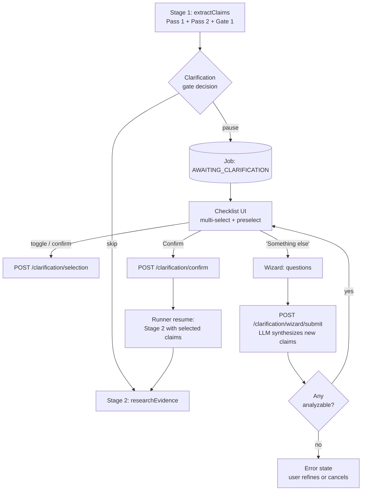

# Claim Clarification Gate — Software Design

## 1. Purpose & scope

Introduce a **user-in-the-loop clarification step** between Stage 1 (claim extraction) and Stage 2 (research) in the ClaimAssessmentBoundary pipeline. When a user's input yields multiple plausible interpretations, or one or more extracted `AtomicClaim`s are too ambiguous to analyze reliably, the pipeline pauses, shows a multi-select checklist of candidates, and optionally launches a neutral clarification wizard. Analysis resumes only for user-confirmed, analyzable claims.

Out of scope: clarification of evidence, verdict, or report — this design only addresses pre-research scope confirmation. No changes to Stages 2–5.

## 2. Guiding principles

| Principle | Where it applies |
|---|---|
| **Generic by design** — no topic, language, or keyword hardcoding | Gate trigger, wizard questions, synthesis |
| **LLM Intelligence mandate** — no deterministic semantic adjudication | Ambiguity judgment, preselection, wizard questions, synthesis |
| **Structural gating only is deterministic** | Gate skip/pause decision reads fields already set by LLM |
| **Multilingual robustness** | Wizard answers in the same language as the user input; no English regex |
| **Skip by default** — do not add a click to clear inputs | Gate activates only when LLM flags ambiguity |
| **No verdict impact = silent** | Routine clarification flows emit no user-visible warning |
| **One shared definition of "analyzable"** | Reused by Gate 1 and wizard synthesis validation |

## 3. Conceptual flow



Two phases live inside one job status (`AWAITING_CLARIFICATION`):

- **Phase: `checklist`** — candidate multi-select
- **Phase: `wizard`** — clarification wizard active

Phase is tracked inside `ClarificationState.phase`, not in job status, to keep the status machine minimal. Back navigation from wizard to checklist is a phase transition, not a status transition, so server-side selection state is preserved automatically.

## 4. When does the gate activate?

The decision is **deterministic structural plumbing** that reads fields the LLM set during Stage 1. No new semantic logic.

### 4.1 Gate skip conditions (ALL must hold)

1. `understanding.clarificationAssessment.recommended === false` *(new LLM field — see §5.1)*
2. `inputClassification !== "ambiguous_single_claim"`
3. Every surviving claim passes the shared `isClaimAnalyzable(claim)` helper:
   - `verifiability ∈ {high, medium}`
   - `specificityScore >= clarificationGate.specificityThreshold`
   - `groundingQuality !== "none"`
4. Gate 1 left at least one claim standing (no rescue path used)
5. Surviving claim count ≤ `clarificationGate.maxCandidates`

If any condition fails → **pause**.

### 4.2 UCM config (`apps/web/configs/pipeline.default.json`)

New section, feature-flagged:

```jsonc
"clarificationGate": {
  "enabled": false,                    // phase 4 turns on
  "specificityThreshold": 0.7,
  "maxCandidates": 8,
  "wizardMaxRounds": 3,
  "wizardMaxQuestions": 5,
  "abandonmentTtlHours": 72            // housekeeping cancels stale clarifications
}
```

Mirrored in `config-schemas.ts` with the config-drift test enforcing parity (per Lead Architect learning: *"JSON is Authoritative for Defaults"*).

### 4.3 Why deterministic skip is acceptable here

Per AGENTS.md: routing / plumbing is allowed; semantic interpretation is not. The gate does not *judge* what the text means — the LLM has already done that in Pass 2 (`clarificationAssessment`) and Gate 1 (`verifiability`, `specificityScore`). The gate merely reads those fields and flips a branch. This is equivalent to existing Gate 1 plumbing.

## 5. Data model changes

### 5.1 Pass 2 schema additions (`Pass2OutputSchema`)

Add a new top-level field produced by the same Pass 2 call — **zero additional LLM round-trips**:

```ts
clarificationAssessment: z.object({
  recommended: z.boolean().catch(false),
  reason: z.enum([
    "single_analyzable",
    "multiple_plausible",
    "materially_ambiguous",
    "bundled_assertions",
  ]).catch("single_analyzable"),
  preselectedClaimIds: z.array(z.string()).catch([]),
  rationale: z.string().catch(""),
}).catch({
  recommended: false,
  reason: "single_analyzable",
  preselectedClaimIds: [],
  rationale: "",
});
```

`.catch()` defaults are safe: on parse failure the gate skips (same as pre-feature behavior). Per LLM Expert learning (*2026-02-19*), `.catch()` is transparent to JSON Schema — the LLM still sees a required field.

### 5.2 AtomicClaim additions

One new optional field on `AtomicClaim` (in `types.ts`):

```ts
origin?: "extracted" | "wizard" | "user_edited";  // defaults to "extracted"
```

Downstream stages treat all origins identically. The field is purely for traceability in the report and for metrics.

### 5.3 `ClarificationState` — server-side persistence

New TypeScript interface (in `types.ts`) and matching DB column:

```ts
export interface ClarificationState {
  phase: "checklist" | "wizard" | "error" | "confirmed";
  candidateClaims: AtomicClaim[];           // post-Stage-1 snapshot
  preselectedClaimIds: string[];            // LLM suggestion
  selectedClaimIds: string[];               // user's live selection
  wizardRounds: Array<{
    roundId: string;
    questions: WizardQuestion[];
    answers: WizardAnswer[];
    synthesizedClaimIds: string[];          // new claims added to candidates
    synthesisOutcome: "ok" | "no_analyzable" | "rejected_by_gate1";
  }>;
  lastError?: {
    code: "wizard_exhausted" | "synthesis_failed" | "gate1_rejected_all";
    message: string;
  };
  assessment: {
    reason: "single_analyzable" | "multiple_plausible" | "materially_ambiguous" | "bundled_assertions";
    rationale: string;
  };
  etag: string;                             // optimistic concurrency
  createdAt: string;
  updatedAt: string;
}
```

### 5.4 API database (`JobEntity`)

Add one nullable column: `ClarificationState TEXT NULL` (JSON-serialized). EF Core migration: `20260411_AddClarificationState`.

**Why a dedicated column and not `ResultJson`:** `ResultJson` is the terminal report artifact. Mixing pending interactive state into it would blur ownership and complicate partial writes. Adding one column is cheap, isolated, and easy to roll back.

### 5.5 Job status enum

Add `"AWAITING_CLARIFICATION"` to `JobService` status strings. Status machine:

```
QUEUED → RUNNING → AWAITING_CLARIFICATION → RUNNING → SUCCEEDED
                 ↘                        ↘ CANCELLED (abandon / TTL)
                  (gate skip)
                 → SUCCEEDED / FAILED / INTERRUPTED
```

`UpdateStatusAsync`'s monotonic progress check stays unchanged; progress is frozen at the Stage 1 watermark (~20%) during `AWAITING_CLARIFICATION` and resumes from the same value on `RUNNING` re-entry.

## 6. Pipeline orchestration changes

### 6.1 `claimboundary-pipeline.ts`

Add an `entryStage` parameter (default `"extract"`, also accepts `"research"`):

```ts
export async function runClaimBoundaryAnalysis(
  jobId: string,
  opts: { entryStage?: "extract" | "research" } = {}
): Promise<AnalysisResult> { ... }
```

Flow:

1. **Cold start** (`entryStage === "extract"`): run Stage 1 as today.
2. After `extractClaims()`:
   ```ts
   const gate = evaluateClarificationGate(understanding, clarificationConfig);
   if (gate.shouldPause) {
     await persistClarificationState(jobId, buildInitialState(understanding, gate));
     await updateJobStatus(jobId, "AWAITING_CLARIFICATION", progress, "Clarification needed");
     return { paused: true };   // pipeline exits cleanly
   }
   ```
3. **Warm resume** (`entryStage === "research"`): loaded by runner when API sets `clarificationConfirmed`. Reconstruct `state.understanding` from persisted `ClarificationState.candidateClaims`, keeping only the subset whose IDs are in `selectedClaimIds`. Jump directly to `researchEvidence(state)`.

`evaluateClarificationGate` lives in a new file `apps/web/src/lib/analyzer/claim-clarification-gate.ts` — pure function, unit-tested in isolation.

### 6.2 Wizard execution path — new module `claim-clarification-wizard.ts`

This module is invoked by the runner from new internal endpoints (not from the main pipeline entry). It owns two LLM-backed functions:

- `generateWizardQuestions(state)` → Haiku call, returns `WizardQuestion[]`
- `synthesizeClaimsFromAnswers(state)` → Sonnet call, returns `AtomicClaim[]` with `origin: "wizard"`

After synthesis, the shared helper `isClaimAnalyzable(claim)` (extracted from Gate 1) is applied. Unanalyzable claims are dropped. If zero analyzable claims remain, the round is marked `no_analyzable` and the UI surfaces the error with a "Retry with more detail" action. After `wizardMaxRounds`, further wizard attempts are blocked and the user can either pick existing candidates or cancel the job.

### 6.3 Shared analyzability helper

Extract the current Gate 1 opinion/specificity/fidelity logic into a pure helper:

```ts
// apps/web/src/lib/analyzer/claim-analyzability.ts
export interface AnalyzabilityVerdict {
  analyzable: boolean;
  failures: Array<"opinion" | "specificity" | "verifiability" | "bundling">;
}
export function isClaimAnalyzable(claim: AtomicClaim, cfg: AnalyzabilityConfig): AnalyzabilityVerdict;
```

Used by:
- Stage 1 Gate 1 (replacing inline logic)
- Clarification wizard synthesis validation

**Single source of truth** prevents definition drift between "analyzable claim that survives Gate 1" and "analyzable claim the wizard can produce." Mitigates one of the most common causes of silent inconsistency in the pipeline.

## 7. API surface

All endpoints on the .NET API (`apps/api/Controllers/ClarificationController.cs`), auth identical to existing job endpoints. LLM-backed operations are forwarded to the runner because credentials live there.

| Method | Path | Purpose |
|---|---|---|
| `GET` | `/v1/jobs/{id}/clarification` | Fetch current `ClarificationState` (UI hydrates on mount / back nav) |
| `POST` | `/v1/jobs/{id}/clarification/selection` | Persist checklist selection draft (no resume) |
| `POST` | `/v1/jobs/{id}/clarification/wizard/start` | Enter wizard phase → forwards to runner `POST /api/internal/clarification/questions` |
| `POST` | `/v1/jobs/{id}/clarification/wizard/submit` | Submit answers → forwards to runner `POST /api/internal/clarification/synthesize` → returns updated state |
| `POST` | `/v1/jobs/{id}/clarification/back` | Return to checklist phase without losing selections |
| `POST` | `/v1/jobs/{id}/clarification/confirm` | Finalize → API transitions status to `RUNNING`, runner invoked with `entryStage=research` |

All mutating endpoints take an `If-Match: <etag>` header; stale writes return `409 Conflict`. Only mutations to `ClarificationState` bump the etag; the runner's resume path does not.

Runner endpoints (`apps/web/src/app/api/internal/clarification/...`) use `X-Runner-Key`, same pattern as `/run-job`.

## 8. UI design

### 8.1 New component: `ClarificationPanel.tsx`

Location: `apps/web/src/app/jobs/[id]/components/ClarificationPanel.tsx`

States map 1:1 to `ClarificationState.phase`. Rendered only when `job.status === "AWAITING_CLARIFICATION"`:

```tsx
{job.status === "AWAITING_CLARIFICATION" && (
  <ClarificationPanel jobId={job.id} />
)}
```

**Checklist phase:**
- Short explanation line ("We found several possible claims in your input — pick the ones you want analyzed.")
- List of candidate claims: statement + subtle badges (category, origin if `wizard`)
- Each item is a checkbox; preselected items pre-checked from server state
- One extra row at the bottom: **"Something else — ask me questions to pin down my intent"** (button, not checkbox)
- Primary action: **Continue analysis** (disabled until ≥1 analyzable claim selected)
- Secondary action: **Cancel job**
- Toggle changes are debounced (300 ms) then POST-ed to `/selection` with etag

**Wizard phase:**
- 1–5 questions rendered as a short form (single-choice / multi-choice / free-text)
- Each question carries its `purpose` tag as a muted hint
- **Back** button returns to checklist (POST `/back`, selections preserved server-side)
- **Submit** button POSTs answers; shows inline spinner during LLM synthesis

**Error phase:**
- Shows `lastError.message` in a neutral tone ("We couldn't pin down an analyzable claim from your answers.")
- If `wizardRounds.length < wizardMaxRounds`: **Try the wizard again** action
- Otherwise: only **Back to checklist** and **Cancel job**

**UX safety rails:**
- Do not display `specificityScore` or `verifiability` as numbers/labels to the user — these are internal signals.
- Do not show the LLM `rationale` verbatim in Phase 1; save that for admin/debug view to avoid a "the machine thinks your input is bad" tone.
- Checklist rows are ordered by preselection first, then original extraction order (stable across re-renders).

### 8.2 Job page integration

`apps/web/src/app/jobs/[id]/page.tsx`:
- Extend polling loop to treat `AWAITING_CLARIFICATION` as an active status (keep polling every 1–2 s — in case another session confirms).
- When polling detects transition `AWAITING_CLARIFICATION → RUNNING`, the panel is unmounted and progress UI resumes as today.
- Status pill color: distinct accent (e.g., attention/blue) — clearly non-error.

## 9. Prompt design (LLM Expert)

Two new prompts in `apps/web/prompts/claimclarification.prompt.md`, registered in the UCM prompt profile. Both follow AGENTS.md rules: abstract-form examples, no test-case terms, multilingual robustness.

### 9.1 `CLARIFICATION_QUESTIONS_USER` (Haiku tier)

**Inputs:**
- `originalInput` — verbatim
- `candidateClaims` — statements + categories only (no internal scores)
- `previousRounds` — prior question/answer pairs (for round 2+)
- `detectedLanguage` — ensures questions are asked in the same language

**Prompt rules (excerpt):**
- "Produce 1–5 neutral questions that would let a careful editor decide exactly which assertion the user wants fact-checked."
- "Each question MUST target one of: subject identity, predicate specificity, scope or time bound, or bundling of unrelated assertions."
- "Questions MUST be phrased in the user's language."
- "Do NOT take a position on whether any candidate claim is true."
- "Do NOT invent facts about the topic."
- "Do NOT copy any candidate claim verbatim as a question."
- "Use abstract placeholders in your reasoning, not domain terms."

**Output schema:**

```ts
z.object({
  questions: z.array(z.object({
    id: z.string(),
    text: z.string(),
    type: z.enum(["single_choice", "multi_choice", "free_text"]),
    options: z.array(z.string()).optional(),
    purpose: z.enum(["subject", "predicate", "scope", "time", "bundling"]),
  })).min(1).max(5),
}).catch({ questions: [] });
```

Cost: ~1 Haiku call (few hundred tokens).

### 9.2 `CLARIFICATION_SYNTHESIS_USER` (Sonnet tier)

**Inputs:**
- `originalInput`
- `candidateClaims` (context for disambiguation)
- Latest round's questions + answers

**Prompt rules (excerpt):**
- "Using ONLY the user's answers and original input, produce up to N new AtomicClaims that represent the user's confirmed intent."
- "Each new claim MUST be a single verifiable assertion with clear subject, predicate, and scope."
- "Do NOT invent details the user did not provide."
- "If the answers do not contain enough detail to produce an analyzable claim, return an empty array — the system will ask the user for more detail."
- "Preserve the user's language."
- "Use the same AtomicClaim schema as extraction." *(reuses `Pass2AtomicClaimSchema`)*

**Output:** `{ atomicClaims: AtomicClaim[] }`, with `origin: "wizard"` stamped server-side after parsing.

Sonnet tier is used because this output becomes load-bearing downstream (these claims drive research). Haiku showed lower specificity in LLM Expert calibration (2026-02-22).

### 9.3 Governance

- Both prompts managed in the UCM prompt store (see `config-storage.ts`), not inline.
- New test suite `apps/web/test/unit/lib/analyzer/claim-clarification-wizard.test.ts`:
  - 5+ non-English inputs (DE/FR/ES/…)
  - Bundled-assertion input ("X did A and also B")
  - Materially ambiguous subject ("He said the thing was wrong")
  - Single-claim sharp input (must NOT pause → regression guard for skip path)
- Calibration baseline: run the `npm run validate:run` 16-family batch with `clarificationGate.enabled=true` before flipping the UCM flag in production.

## 10. Warnings & events (per AGENTS.md severity rules)

Apply the mandatory test: *"Would the verdict be materially different if this event hadn't occurred?"*

| Event | Severity | Notes |
|---|---|---|
| Gate activates, user confirms default selection | *silent* | Routine plumbing; verdict identical to auto-path |
| Gate skipped (input clear) | *silent* | Routine plumbing |
| User changes selection before confirming | *silent* | User intent honored; not a system concern |
| Wizard used; valid analyzable claims synthesized | *silent* | Expected path |
| Wizard exhausted rounds without analyzable claim | `info` | Analytical reality — user input can't be disambiguated |
| User abandons job → TTL transition to `CANCELLED` | *silent* | Status already communicates this |
| Persistence failure writing `ClarificationState` | `error` | System failure, must be surfaced |

**No new warning type codes are needed** for the silent/info cases. The one `error` path reuses `structured_output_failure` family.

## 11. Acceptance criteria trace

| Requirement | Design element |
|---|---|
| Skip when input is clear | §4.1 skip conditions; LLM sets `clarificationAssessment.recommended=false`; `isClaimAnalyzable` all pass |
| Appear before heavy research | §6.1 — pause inserted **after** Stage 1, **before** `researchEvidence()`; job status flips to `AWAITING_CLARIFICATION` |
| Multi-select checklist with preselection | §8.1 — preselected from `clarificationAssessment.preselectedClaimIds` |
| ≥1 analyzable claim required to continue | §8.1 Confirm button disabled; server revalidates via `isClaimAnalyzable` on `/confirm` |
| Unselected claims excluded from downstream | §6.1 warm resume — `state.understanding.atomicClaims` filtered to `selectedClaimIds` before Stage 2 |
| "Something else" launches wizard | §8.1 dedicated action; §6.2 module |
| Wizard questions are neutral, domain-independent | §9.1 prompt rules + AGENTS.md no-test-terms rule |
| Generated claims added and preselected | §6.2 synthesis result merged into `candidateClaims`, IDs appended to `preselectedClaimIds` |
| Wizard fails → ask for refinement, don't proceed silently | §6.2 `no_analyzable` / `wizard_exhausted` → §8.1 error phase |
| Back from wizard preserves selections | §5.3 `selectedClaimIds` persisted server-side; §7 `/back` is a pure phase transition |
| Cancel at any time | Existing `POST /v1/jobs/{id}/cancel` unchanged |

## 12. Risks & trade-offs

| Risk | Mitigation |
|---|---|
| **Base-path latency regression** (every job runs the gate check) | Zero extra LLM calls — `clarificationAssessment` is added to the existing Pass 2 call. Pure-function gate check is ~microseconds. |
| **Partial-restart complexity** in the pipeline | Single new `entryStage` parameter; resume path reads persisted snapshot. Unit-tested in isolation. Existing `INTERRUPTED` safety net handles crashes. |
| **User abandonment** fills the DB | `abandonmentTtlHours` housekeeping task cancels stale `AWAITING_CLARIFICATION` jobs. |
| **Prompt topic-leakage** (wizard asks domain-specific questions) | LLM Expert prompt rules; unit test suite with diverse languages and topics; abstract-form examples only. |
| **Analyzability definition drift** between Gate 1 and wizard | Shared `isClaimAnalyzable` helper; both code paths import the same function. |
| **Wizard cost spiral** (N rounds × large prompts) | `wizardMaxRounds` (default 3); Haiku for questions, Sonnet only for synthesis; prompts kept lean. Max envelope ~6 LLM calls per ambiguous job. |
| **UI race conditions** (two tabs editing the same selection) | Etag-based optimistic concurrency on all mutating endpoints. |
| **Cognitive overload** for users presented with too many candidates | `maxCandidates` cap (default 8); preselection biases the user toward the LLM's best guess so a one-click Confirm is the default path. |
| **LLM refuses on sensitive inputs** (see LLM Expert learning 2026-02-19) | Clarification prompts put their fact-checking framing in the SYSTEM prompt; wizard detects empty output and routes to `no_analyzable` error state rather than ship bad claims. |
| **Silent contract failures** like the 2026-04-10 Pass 2 cascade | Unanalyzable synthesized claims are dropped *and* logged; the `wizardRounds[].synthesisOutcome` field lets us grep for real-world failure patterns. |

## 13. Testing plan

| Layer | Test | Config |
|---|---|---|
| Unit | `claim-clarification-gate.test.ts` — skip vs pause matrix across all field combinations | `npm test` |
| Unit | `isClaimAnalyzable` shared-helper contract (Gate 1 + wizard use identical verdicts) | `npm test` |
| Unit | `claim-clarification-wizard.test.ts` — schema, error paths, multilingual questions (mocked LLM) | `npm test` |
| Contract | `Pass2OutputSchema` backward-compat with pre-feature JSON fixtures | `npm test` |
| Integration | Resume path: fake Stage 1 result → confirm → Stage 2 runs with filtered claims only | `npm test` |
| UI | `ClarificationPanel.test.tsx` — back nav preserves selections, etag 409 handling | `npm test` |
| Calibration | `validate:run` 16-family batch with gate `enabled=true`, compared to baseline | `npm run validate:run` |
| Expensive (gated) | End-to-end with real LLM on a bundled-assertion input | Explicit request only |

Test-cost guardrails per CLAUDE.md: no expensive tests in CI.

## 14. Rollout plan

| Phase | Deliverable | Flag |
|---|---|---|
| **1** | Schema changes (Pass 2 + `AtomicClaim.origin`), `evaluateClarificationGate`, shared `isClaimAnalyzable`, unit tests | `clarificationGate.enabled=false` |
| **2** | API endpoints + `ClarificationState` DB column + migration + etag handling | `enabled=false` |
| **3** | `ClarificationPanel.tsx` + job-page integration + UI tests | `enabled=false` |
| **4** | Wizard module + prompts in UCM + contract tests + calibration baseline | `enabled=false` |
| **5** | Flip flag in staging, run `validate:run`, compare against baseline; abandonment-rate monitoring | `enabled=true` (staging) |
| **6** | Production flip; housekeeping job for TTL | `enabled=true` (prod) |

Feature flag can be flipped OFF without code rollback — the gate decision short-circuits and the pipeline runs end-to-end as today.

## 15. Open questions for Captain / Product Strategist

1. **Default `enabled` in prod config** — start OFF and ramp, or start ON post-calibration? Recommendation: OFF → ON after Phase 5.
2. **Abandonment TTL default** — 72h feels right for individual users but may be too long if we move toward high-throughput enterprise use.
3. **"Cancel job" wording during clarification** — should it be "Cancel" or "Start over"? Affects perceived stickiness.
4. **Preselection conservatism** — when the LLM is uncertain, should we preselect fewer claims (safer, more clicks) or more claims (one-click Confirm, more false positives)? Recommendation: preselect only `centrality === "high"` claims by default, let the LLM override via `preselectedClaimIds`.
5. **Admin-visible diagnostics** — should `rationale` and `wizardRounds` show up in the admin view of completed reports for quality debugging?

## 16. Files to create / modify (for Senior Developer handoff)

**New files:**
- `apps/web/src/lib/analyzer/claim-clarification-gate.ts`
- `apps/web/src/lib/analyzer/claim-clarification-wizard.ts`
- `apps/web/src/lib/analyzer/claim-analyzability.ts`
- `apps/web/prompts/claimclarification.prompt.md`
- `apps/web/src/app/api/internal/clarification/questions/route.ts`
- `apps/web/src/app/api/internal/clarification/synthesize/route.ts`
- `apps/web/src/app/jobs/[id]/components/ClarificationPanel.tsx`
- `apps/api/Controllers/ClarificationController.cs`
- `apps/api/Data/Migrations/20260411_AddClarificationState.cs`
- Unit tests per §13

**Modified files:**
- `apps/web/src/lib/analyzer/claim-extraction-stage.ts` (add `clarificationAssessment` to Pass 2 schema; extract Gate 1 into shared helper)
- `apps/web/src/lib/analyzer/claimboundary-pipeline.ts` (gate branch + `entryStage` parameter)
- `apps/web/src/lib/analyzer/types.ts` (`AtomicClaim.origin`, `ClarificationState`, `WizardQuestion/Answer`)
- `apps/web/configs/pipeline.default.json` + `config-schemas.ts` (clarificationGate block)
- `apps/web/src/app/jobs/[id]/page.tsx` (render panel + polling status whitelist)
- `apps/api/Services/JobService.cs` (accept `AWAITING_CLARIFICATION` in status machine)
- `apps/api/Data/FhDbContext.cs` (new column)
- `apps/api/Services/RunnerClient.cs` (forward clarification resume call)
- `Docs/xwiki-pages/.../AKEL Pipeline/WebHome.xwiki` (document new gate in Stage 1→2 handoff)

## 17. Compliance checklist

- [x] No hardcoded keywords or domain terms (§9 prompt rules)
- [x] LLM Intelligence mandate — every semantic decision is LLM-driven (§4.3, §6.2)
- [x] Multilingual robustness — questions produced in detected language (§9.1)
- [x] String Usage Boundary — no analysis strings outside prompts/search
- [x] Analysis Prompt Rules — abstract-form only, no test-case terms (§9)
- [x] Pipeline Integrity — no stage skipping; clarification runs between, not around, stages (§6.1)
- [x] Configuration Placement — all thresholds in UCM (§4.2)
- [x] Report Quality rules — severity follows verdict-impact test (§10)
- [x] Shared analyzability definition (§6.3)

---

**Next agent:** Lead Developer — review §6 orchestration changes and §16 file list, raise any implementation concerns, produce the Phase 1 implementation plan against the shared analyzability helper and `evaluateClarificationGate`. Do not start code until Captain has resolved §15 open questions.
