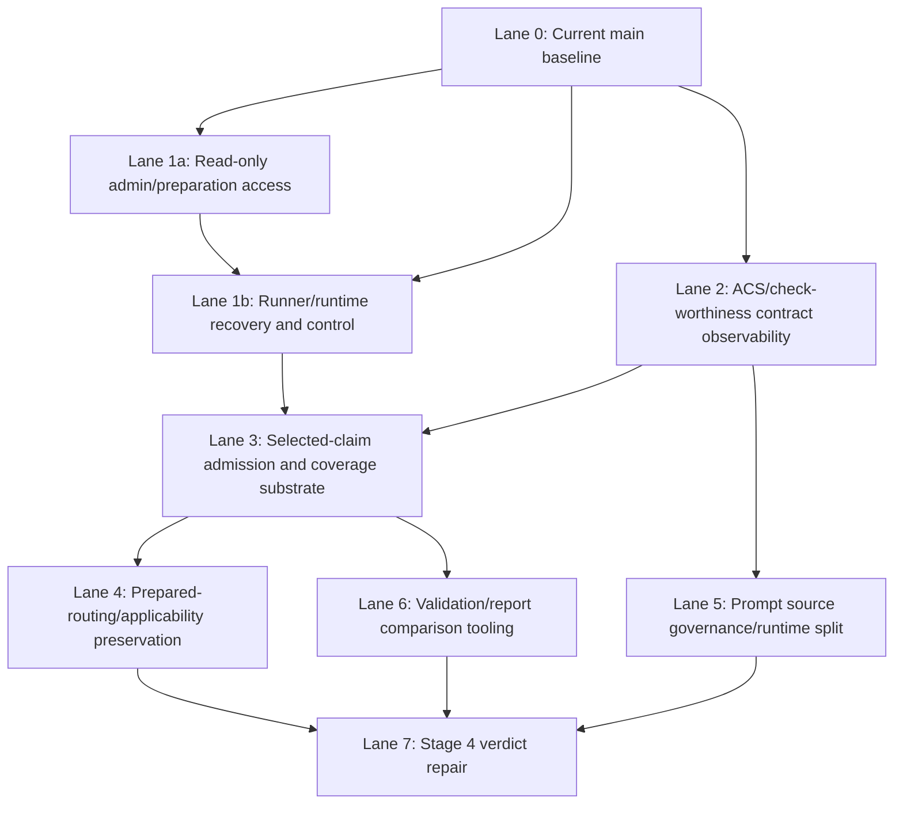

# Main Regression Snapshot Integration Plan

**Date:** 2026-05-01
**Status:** Integration plan; no merge authorized
**Source snapshot:** `codex/main-regression-snapshot-2026-05-01` at `fccd2733`
**Current public main at first plan hardening:** `2b06c61a`
**Base:** `origin/main` at `2a713bcc`

## Decision Frame

The preserved branch `codex/main-regression-snapshot-2026-05-01` is now an integration source, not a rollout branch.

Do **not** merge it wholesale. Do **not** discard it. Use it as a catalog of investigated fixes, docs, tests, and live-run evidence that must be promoted, re-authored, or held lane by lane.

This plan is now commit-explicit: Appendix A assigns every commit in `2a713bcc..codex/main-regression-snapshot-2026-05-01` to exactly one lane and one disposition. The summary matrix is guidance; Appendix A is the exhaustive inventory.

Current `main` already contains the approved clean rollout path:

| Commit | Decision | Notes |
|---|---|---|
| `4dfebd86` | Keep | Public nonprofit readiness text docs restored without private legal PDFs. |
| `152f39ad` | Keep | Public legal working papers moved/internalized; active public links now avoid deleted legal `.md` files. |
| `2ea964b4` | Keep | Manual reimplementation of the safe part of `0482c962`: seeds `lastSelectionInteractionUtc` for interactive waiting drafts. |
| `7f9d1194` | Keep | Handoff and Agent_Outputs record for the idle auto-proceed clean rollout. |
| `2b06c61a` | Keep | First-pass snapshot integration plan. Superseded by this hardened plan for implementation readiness. |

No analysis-code, prompt, ACS budget, warning, UCM, live-job, or verdict-repair changes from `fccd2733` are currently on `main`.

## Dependency Lanes



## Keep / Promote / Re-author / Hold Matrix

| Lane | Snapshot material | Decision | Why |
|---|---|---|---|
| 0. Current clean baseline | `2ea964b4`, `7f9d1194`, legal-doc commits on current `main` | **Promoted / keep** | Already manually re-authored onto clean `main`; verified by targeted tests/build/full safe test before promotion of the idle slice. |
| 1a. Read-only admin/preparation access and audit | See Appendix A rows tagged `1a` | **Re-author first** | Useful operational visibility with lower analytical risk. Keep it separate from runner recovery/control behavior. |
| 1b. Runner/runtime recovery and control semantics | See Appendix A rows tagged `1b` | **Re-author after 1a or as a reviewed companion** | The snapshot includes runner recovery, cancellation blocking, stale preparation recovery, restart-script hardening, and queue behavior. This needs runner queue tests and process cleanup review, not only admin UI checks. |
| 2. ACS/check-worthiness contract observability | `46807bdf`, `59e1c806`, `ba234200`, `78013460`, `423a49fd`, `5e5272ab`, `1ed5744f`, related docs | **Re-author** | Prior reviews were broadly positive, but files now sit amid broader branch drift. Recreate the type/label/provenance/prompt-registry subset with focused tests and docs. |
| 3. Selected-claim admission and coverage substrate | See Appendix A rows tagged `3`, including prerequisites `e1787899` and `7b5b3409` | **Re-author as one designed lane** | This is a real product-quality substrate, but reviewers disagreed on phase coupling. Rebuild as an “Admission & Coverage” lane with explicit API/web boundary, draft config provenance, automatic-submission/config-path handling, UCM defaults, scheduler behavior, terminal not-run reasons, and validation summary semantics. |
| 4. Prepared-routing/applicability preservation | See Appendix A rows tagged `4` | **Hold until Lane 3 exists, then re-author** | Depends on selected/recommended/ranked claim metadata and prepared Stage 1 snapshot contracts. Do not apply before admission/coverage substrate is stable. |
| 5. Prompt source governance/runtime split | `58b1235c`, `0bf5ae49`, `d9635da9`, `6209cdd3`, `09cfbe27`, `55ef87bf`, prompt-surface docs/tests | **Re-author after Lane 2** | Useful architecture, but high prompt/config blast radius. Keep source-layout intent, rebuild with prompt hash/provenance tests. No prompt wording changes without explicit approval. |
| 6. Validation and comparison tooling | `f79544d4`, `5d841c6c`, validation scripts, `captain-approved-families.json`, `compare-batches.js`, `extract-validation-summary.js` | **Re-author selectively** | Good operational value, but must align with current Captain-defined inputs and current result schema. Pull only tooling that can run without changing analysis behavior. |
| 7. Stage 4 verdict repair and report-quality fixes | See Appendix A rows tagged `7`; this includes later prompt/verdict/report repair commits such as `e44fbec8`, `afceee1a`, `852a4fb6`, and `025d1d6d` | **Hold; re-author only after fresh report-review** | Highest quality-risk lane. Contains prompt and repair-chain changes driven by live regressions. Needs fresh `/report-review` on current `main`, minimal root-cause slice, and explicit Captain approval before any prompt or verdict changes. |
| 8. Legal/private documents | Legal PDFs and legal working papers present on snapshot | **Hold off public main** | These belong in `C:\DEV\FactHarbor-internal\Operations\Legal` / `Operations\Finance`, not public repo. Public docs may reference internal locations when useful. |
| 9. Workflow policy changes | `18000277`, AGENTS/report-review/pipeline UNVERIFIED discipline edits | **Re-author only if desired** | Useful review discipline, but broad policy changes affect all agents. Should be separate from analyzer code and reviewed as governance/workflow change. |

## Promote Now

Nothing else should be promoted immediately from `fccd2733`.

The only already-promoted code behavior is the idle auto-proceed timestamp seeding on current `main`.

## Re-author Next

Recommended next integration branch:

`codex/integrate-admin-preparation-access`

Scope:

- admin list/detail of waiting/preparing claim-selection drafts;
- draft event audit exposure;
- no runner recovery changes;
- no cancellation/control semantics;
- no ACS budget changes;
- no prompt changes;
- no Stage 2 scheduling changes;
- no verdict repair.

Rationale:

This lane is mostly operational/admin surface area and has less analytical blast radius than ACS budget, prompt split, or Stage 4 repair. It also supports future investigation without changing report quality behavior.

Verification gate:

- API focused tests for draft service/controller behavior;
- web targeted admin/preparation tests;
- `npm -w apps/web run build`;
- no live jobs unless a runtime-only admin workflow cannot be verified otherwise.

Runner recovery/control follow-up:

- If administrator-on-behalf actions, stale preparation recovery, cancellation blocking, restart-script hardening, or runner queue behavior are included, use a separate `codex/integrate-runner-preparation-recovery` branch or explicitly widen the first branch after review.
- Required verification then includes runner queue tests, stale-preparation recovery tests, script/process cleanup review, and API/web build checks.

## Re-author After Admin Lane

Recommended second branch:

`codex/integrate-acs-observability-contracts`

Scope:

- check-worthiness type/label cleanup;
- ACS research coverage telemetry;
- submission path/provenance labeling;
- prompt-surface registry as inventory only;
- validation-summary fields that are observational only.

Hold out of this branch:

- budget-aware ACS defaults;
- selected-claim admission cap;
- Stage 2 scheduler changes;
- prompt wording changes.

## Re-author As A Combined Correctness Lane

Recommended third branch:

`codex/integrate-selected-claim-admission-coverage`

Scope:

- budget-aware admission contract across automatic, manual, and admin-on-behalf paths;
- selected-claim coverage telemetry;
- zero-targeted selected-claim detection;
- no-search terminal reasons;
- Stage 2 below-floor scheduling behavior;
- validation summary/report visibility for budget and coverage state.

Design constraints:

- No deterministic semantic selector.
- No hidden claim dropping in the final runner.
- No prompt wording change unless a separate prompt review approves it.
- Web/UCM may compute budget feasibility, but final persisted draft/job boundary must structurally enforce the selected count actually admitted.

## Hold Until Fresh Evidence

The Stage 4 verdict repair lane must remain held until there is fresh evidence on current `main`.

Required before re-authoring:

1. Use `/report-review` or equivalent static report review on the exact affected jobs and current expectations.
2. Confirm whether the failure is Stage 1 extraction, Stage 2 acquisition, Stage 3 boundary grouping, Stage 4 adjudication, or report rendering.
3. Prefer source-code repair over prompt changes where the bug is structural.
4. If prompt changes are needed, keep them topic-neutral and explicitly approved.
5. Run focused unit tests first; live jobs only after commit and runtime/config refresh.

## Explicit Non-Actions

- Do not merge `codex/main-regression-snapshot-2026-05-01`.
- Do not cherry-pick the prior 11-commit slice.
- Do not reintroduce private legal PDFs or legal working papers into public `main`.
- Do not apply `05c8c864` as a default-timeout change unless Captain approves the UX default.
- Do not apply `0f696419` / `daa7bc61` without the full admission/coverage lane.
- Do not apply `e45b1515` without prepared-routing/applicability prerequisites.
- Do not apply `b5421841` or adjacent Stage 4 repair commits without a fresh verdict-repair review gate.

## Working Commands

Inspect source snapshot without changing `main`:

```powershell
git log --oneline main..codex/main-regression-snapshot-2026-05-01
git diff --stat main..codex/main-regression-snapshot-2026-05-01
```

Start a re-author branch from current main:

```powershell
cd C:\DEV\FactHarbor
git switch main
git switch -c codex/integrate-admin-preparation-access
```

Use snapshot diffs as reference only:

```powershell
git show <snapshot-commit> -- <path>
git diff main..codex/main-regression-snapshot-2026-05-01 -- <path>
```

## Current Branch Preservation

Keep these refs until all lanes are either promoted or explicitly rejected:

- `codex/main-regression-snapshot-2026-05-01` at `fccd2733`
- `C:\DEV\FactHarbor-main-regression`
- `codex/idle-autoproceed-rollout` at `2cfdfe72` for traceability, even though its code/docs are now represented on `main` as `2ea964b4` / `7f9d1194`

## Appendix A — Exhaustive Snapshot Commit Disposition

Inventory command:

```powershell
git log --reverse --pretty=format:'%h %s' 2a713bcc..codex/main-regression-snapshot-2026-05-01
```

Every commit in that range appears exactly once below. Decision names:

- **Promoted / superseded:** already represented on current `main` by a manual re-author.
- **Re-author:** use the snapshot commit as reference, but rebuild against current `main`.
- **Hold:** preserve for later review; do not implement until dependencies and review gates are satisfied.
- **Do not promote from snapshot:** either already settled elsewhere, regenerated as needed, or belongs outside public `main`.

| Commit | Subject | Lane | Decision | Dependencies | Verification | Notes |
|---|---|---|---|---|---|---|
| `453f9e34` | fix(verdict): repair cited side gaps before rescue | 7 | Hold | Fresh report-review | Targeted verdict tests, then canary | Stage 4 repair chain. |
| `8d9c6d64` | Recover stale draft preparation tasks | 1b | Re-author | 1a if admin UI depends on it | Runner queue and stale recovery tests | Runtime recovery, not read-only admin. |
| `1377969b` | fix(prompt): treat challenge invalid ids as grounding context | 7 | Hold | Fresh report-review, prompt approval | Prompt provenance tests, canary | Prompt change. |
| `164d2b6a` | fix(scripts): clean stale service process trees | 1b | Re-author | Script/process review | Manual script review and service restart dry run | Process cleanup risk. |
| `3c1e88ff` | fix(runner): emit status heartbeat during long jobs | 1b | Re-author | Runner queue substrate | Runner tests and long-job smoke | Runtime behavior. |
| `1c237f78` | fix(prompt): require exact cited id matching | 7 | Hold | Fresh report-review, prompt approval | Prompt/schema tests, canary | Prompt repair. |
| `26b5e6cb` | fix(verdict): suppress resolved grounding id noise | 7 | Hold | Fresh report-review | Verdict repair tests | Stage 4 repair chain. |
| `ea7467f1` | Guard prepared Stage 1 snapshot provenance | 4 | Hold, then re-author | Lane 3 | Prepared-routing tests | Prepared snapshot contract. |
| `dee70865` | Block cancellation during draft preparation | 1b | Re-author | Runner/control branch | API draft tests, runner queue tests | Control semantics. |
| `525d1082` | Add read-only admin preparation list | 1a | Re-author | Current main | API/web admin tests, build | Read-only admin visibility. |
| `26cc2cee` | Add read-only preparation detail view | 1a | Re-author | 1a list contracts | API/web admin tests, build | Read-only admin visibility. |
| `750f9352` | Add claim selection draft audit events | 1a | Re-author | 1a draft DTOs | API service/controller tests | Audit visibility. |
| `9f8eb419` | Add admin preparation actions and audit view | 1b | Re-author | 1a, runner/control review | API/web admin action tests | Admin-on-behalf/control behavior. |
| `785076e2` | Remove inaccessible claim selection resume refs | 1b | Re-author | Runner/session contract review | Web session tests | Runtime/session cleanup. |
| `e0f70130` | Fix draft runner recovery and admin draft controls | 1b | Re-author | 1a, runner/control review | Runner queue and API draft tests | Mixed recovery/control. |
| `854e2b40` | Fix Stage 1 Pass 1 structured output recovery | 7 | Hold | Fresh report-review | Stage 1 extraction tests, canary | Analysis-quality repair. |
| `950cab26` | Guard post-repair verdict rescue citations | 7 | Hold | Fresh report-review | Verdict rescue tests, canary | Stage 4 repair chain. |
| `e4b9d27b` | Harden admin draft controls and restart script | 1b | Re-author | 1a, script/process review | Admin control tests, script review | Mixed control/runtime. |
| `e51f08c9` | Cover runner failure cleanup | 1b | Re-author | Runner/control branch | Runner failure tests | Test/cleanup substrate. |
| `f487e2ad` | Isolate evidence scope clones | 4 | Hold, then re-author | Lane 3 | Stage 2/3 fixture tests | Applicability/scope safety. |
| `3f339127` | Clarify numeric evidence direction prompt | 7 | Hold | Fresh report-review, prompt approval | Prompt tests, canary | Prompt change. |
| `bd401e03` | Block preparing draft cancellation | 1b | Re-author | Runner/control branch | API draft cancellation tests | Control semantics. |
| `6ed5c3b8` | chore: consolidate WIP docs and warning diagnostics | 6 | Re-author selectively | Current docs state | Doc diff check | Docs/tooling only. |
| `18000277` | Enforce suspicious UNVERIFIED handling | 9 | Hold / re-author only if desired | Governance approval | Agent workflow review | Broad policy change. |
| `4025b24a` | Verein Konstituierung | 8 | Do not promote from snapshot | Internal/public docs split | Doc placement review | Legal/private-adjacent docs. |
| `9efd8eda` | Add ACS research waste observability | 2 | Re-author | Current main | Focused Vitest, build | Observability only. |
| `b43f6b53` | Harden ACS research waste metrics | 2 | Re-author | ACS research waste observability re-author | Metrics tests, build | Observability metrics. |
| `15458834` | Document ACS live metrics review | 2 | Re-author selectively | Lane 2 docs | Doc diff check | Historical evidence. |
| `f540ec36` | Document budget-aware ACS Slice 5 design | 3 | Re-author selectively | Lane 3 design | Doc review | Admission design note. |
| `71cc8786` | Add guarded ACS budget metadata plumbing | 3 | Re-author | Lane 2 | ACS budget tests, build | Budget substrate. |
| `1fa82a90` | Gate ACS budget-aware prompt behavior | 3 | Re-author | ACS budget metadata plumbing, prompt approval if wording changes | Config/prompt provenance tests | Budget-aware prompt path. |
| `e1787899` | Fix ACS draft config provenance | 3 | Re-author | Lane 2, draft contracts | Draft config provenance tests | Required Lane 3 prerequisite. |
| `0cfaee91` | Tighten Stage 2 abort handling | 3 | Re-author | Lane 3 scheduler plan | Stage 2 scheduler tests | Coverage/budget behavior. |
| `c1c6e62a` | Preserve contradiction research budget within iterations | 3 | Re-author | Lane 3 scheduler plan | Stage 2 budget tests | Budget correctness. |
| `d59d18f3` | Continue research after zero-yield claims | 3 | Re-author | Lane 3 scheduler plan | Zero-yield scheduler tests | Coverage correctness. |
| `22b1caa2` | Prioritize first research pass per claim | 3 | Re-author | Lane 3 scheduler plan | Below-floor selected-claim tests | Coverage correctness. |
| `58b1235c` | Add prompt runtime telemetry slice | 5 | Re-author | Lane 2 | Prompt telemetry tests, build | Prompt governance. |
| `0bf5ae49` | Add prompt split manifest source layer | 5 | Re-author | Prompt runtime telemetry slice | Manifest tests, build | Prompt governance. |
| `d9635da9` | Separate Stage 2 evidence prompt payload | 5 | Re-author | Prompt approval | Prompt hash/provenance tests | Prompt source split. |
| `6209cdd3` | Split contract validation prompt payload | 5 | Re-author | Prompt approval | Prompt hash/provenance tests | Prompt source split. |
| `09cfbe27` | Split Stage 4 verdict prompt payloads | 5 | Re-author | Prompt approval, fresh report-review before behavior use | Prompt hash/provenance tests | Prompt source split. |
| `55ef87bf` | Split claimboundary prompt source layout | 5 | Re-author | Lane 5 manifest | Prompt registry/hash tests | Prompt source split. |
| `945de236` | Plan prompt hygiene follow-up | 5 | Re-author selectively | Lane 5 | Doc review | Follow-up planning. |
| `4b6780fe` | Clarify runner concurrency settings | 1b | Re-author | Runner config review | Runner config tests/docs review | Runtime configuration. |
| `7b5b3409` | Fix automatic claim selection submissions | 3 | Re-author | ACS draft config provenance, Lane 3 admission contracts | Automatic/manual submission tests | Required Lane 3 prerequisite. |
| `f79544d4` | Unify ACS validation tooling | 6 | Re-author selectively | Current schema | Tool fixture tests | Tooling only if behavior-neutral. |
| `19431f54` | Stabilize runner queue tests | 1b | Re-author | Runner/control branch | Runner queue tests | Test substrate. |
| `5d841c6c` | Add ACS historical validation references | 6 | Re-author selectively | Current benchmark docs | Doc/tool review | Historical references. |
| `20210747` | Undone mistaken archiving | 8 | Do not promote from snapshot | Current docs state | Doc placement review | Re-evaluate from current main only. |
| `2146d2d9` | Update NPO Formation Checklist | 8 | Do not promote from snapshot | Internal/public docs split | Doc placement review | Already settled via public/internal split. |
| `819e9e4d` | Address ACS historical reference review comments | 6 | Re-author selectively | Current validation docs | Doc review | Historical references. |
| `2251d710` | Document interactive UCM switch | 6 | Re-author selectively | Current UCM state | Doc review | Operational note. |
| `bb21136b` | Document ACS implementation in xWiki | 2 | Re-author selectively | Lane 2 | xWiki/doc review | ACS documentation. |
| `49773c9b` | docs: plan check-worthiness cleanup | 2 | Re-author selectively | Lane 2 | Doc review | Planning doc. |
| `46807bdf` | fix: align check-worthiness contract and labels | 2 | Re-author | Current types/UI | Type tests, build | Accepted small cleanup. |
| `318e7d7b` | docs: record check-worthiness cleanup implementation | 2 | Re-author selectively | Check-worthiness cleanup re-author | Doc review | Implementation record. |
| `82bed8c9` | chore: refresh handoff index | 6 | Do not promote from snapshot | Regenerate when needed | `npm run index` if required | Generated index churn. |
| `59e1c806` | feat: surface ACS research coverage telemetry | 2 | Re-author | Lane 2 | Metrics tests, build | Observability. |
| `ba234200` | feat: label analysis submission provenance | 2 | Re-author | Lane 2 | API/web provenance tests | Provenance. |
| `78013460` | chore: register prompt governance surfaces | 2 | Re-author | Lane 2 | Registry tests | Inventory only. |
| `423a49fd` | chore: classify legacy grounding prompt surface | 2 | Re-author | Prompt governance registry | Registry tests | Inventory only. |
| `5e5272ab` | fix: tighten provenance and prompt registry contracts | 2 | Re-author | Lane 2 | Contract tests, build | Provenance/registry. |
| `fc8052e3` | docs: record remaining unification implementation | 2 | Re-author selectively | Lane 2 | Doc review | Status doc. |
| `6a44fa6a` | docs: add remaining unification handoff | 2 | Re-author selectively | Lane 2 | Agent output/handoff review | Handoff. |
| `dd380d30` | chore: normalize handoff index | 6 | Do not promote from snapshot | Regenerate when needed | `npm run index` if required | Generated index churn. |
| `f7fc39f1` | docs: update unification completion state | 2 | Re-author selectively | Lane 2 | Doc review | Status doc. |
| `da3b1e75` | chore: normalize handoff index after docs update | 6 | Do not promote from snapshot | Regenerate when needed | `npm run index` if required | Generated index churn. |
| `1ed5744f` | chore: address unification review comments | 2 | Re-author | Lane 2 | Focused tests/doc review | Review amendment. |
| `0d21cad7` | docs: record unification review follow-up | 2 | Re-author selectively | Lane 2 | Doc review | Review record. |
| `7e85f50f` | chore: normalize handoff index after review follow-up | 6 | Do not promote from snapshot | Regenerate when needed | `npm run index` if required | Generated index churn. |
| `159834ce` | fix: harden connectivity probe timeout | 1b | Re-author | Runtime recovery lane | Probe tests/build | Runtime behavior. |
| `47e9b005` | feat: add admin waiting-input selection access | 1b | Re-author | 1a, admin-on-behalf approval | Admin action tests | Control/access semantics. |
| `b8ead311` | fix: normalize budget-deferred claim metadata | 3 | Re-author | Lane 3 | Budget metadata tests | Admission/coverage substrate. |
| `36fe7c17` | fix: clarify claim selection budget display | 3 | Re-author | Lane 3 UI contracts | UI tests/build | Budget UI. |
| `8aa02c91` | fix: fail closed direct analysis over claim cap | 3 | Re-author | Lane 3 API/web boundary | Direct-analysis cap tests | Admission invariant. |
| `0514b4d7` | fix: preserve claim selection metadata on retry | 3 | Re-author | Lane 3 retry contracts | Retry tests | Admission metadata. |
| `d8961dbb` | fix: protect selected claim research floor | 3 | Re-author | Lane 3 scheduler plan | Stage 2 below-floor tests | Scheduler correctness. |
| `4f26141a` | fix: count searched selected claim coverage | 3 | Re-author | Lane 3 coverage schema | Coverage metrics tests | Observability tied to admission. |
| `1ef2dad8` | docs: capture selected claim acquisition starvation plan | 3 | Re-author selectively | Lane 3 | Doc review | Starvation plan. |
| `04de43fc` | docs: align starvation plan across selection modes | 3 | Re-author selectively | Lane 3 | Doc review | Starvation plan. |
| `2af2166c` | docs: refine selected claim starvation root cause | 3 | Re-author selectively | Lane 3 | Doc review | Starvation plan. |
| `829d5ec6` | docs: clarify selected claim budget pressure | 3 | Re-author selectively | Lane 3 | Doc review | Starvation plan. |
| `fb8ae915` | docs: reconcile selected claim starvation reviews | 3 | Re-author selectively | Lane 3 | Doc review | Starvation plan. |
| `08dfe69b` | fix: record selected claim acquisition starvation | 3 | Re-author | Lane 3 coverage schema | Coverage warning/summary tests | Starvation observability. |
| `ee1ef6ce` | fix: enforce selected claim admission budget | 3 | Re-author | Lane 3 API/web boundary | Admission tests, build | Budget invariant. |
| `952b0847` | fix: auto-continue exact claim admission cap | 3 | Re-author | Lane 3 automatic path | Automatic/interactive parity tests | Automatic mode cap. |
| `5144099d` | docs: record selected claim admission validation | 3 | Re-author selectively | Lane 3 | Doc review | Validation record. |
| `e44fbec8` | fix: honor claim-local evidence direction corrections | 7 | Hold | Fresh report-review | Direction tests, canary | Verdict/evidence repair. |
| `d9adf214` | fix: align manifest prompt contestation rules | 7 | Hold | Fresh report-review, prompt approval | Prompt provenance tests | Prompt repair. |
| `afceee1a` | fix: preserve compliance evidence qualifiers | 7 | Hold | Fresh report-review, prompt approval | Prompt tests, canary | Prompt repair. |
| `1076c20a` | fix: treat noncontrolling procedural positions as contestation | 7 | Hold | Fresh report-review | Verdict tests, canary | Verdict repair. |
| `55237a80` | docs(legal): sync nonprofit, provider, and banking status | 8 | Do not promote from snapshot | Internal/public docs split | Doc placement review | Legal/private-adjacent docs. |
| `c7d4251c` | feat(jobs): add admin-only job annotations | 1a | Re-author | Admin DTO review | API/web admin tests | Read-only/admin metadata. |
| `6e1a05ff` | chore(docs): refresh handoff index | 6 | Do not promote from snapshot | Regenerate when needed | `npm run index` if required | Generated index churn. |
| `2b8b9064` | fix(prompt): keep compliance process facts non-directional | 7 | Hold | Fresh report-review, prompt approval | Prompt tests, canary | Prompt repair. |
| `501f00a2` | fix(prompt): separate process relevance from direction | 7 | Hold | Fresh report-review, prompt approval | Prompt tests, canary | Prompt repair. |
| `4c8aa89e` | fix(analyzer): keep extracted companion directions claim-local | 4 | Hold, then re-author | Lane 3 | Applicability/routing tests | Prepared-routing/applicability prerequisite. |
| `c3c83c18` | fix(analyzer): audit cited evidence direction before verdict | 7 | Hold | Fresh report-review | Verdict direction tests | Verdict repair. |
| `852a4fb6` | fix(prompt): keep collateral legal concerns target-specific | 7 | Hold | Fresh report-review, prompt approval | Prompt tests, canary | Prompt repair. |
| `13e62c89` | fix(analyzer): repair verdict direction after citation audit | 7 | Hold | Fresh report-review | Verdict tests, canary | Verdict repair. |
| `c897a71a` | fix(analyzer): require directional basis for evidence polarity | 7 | Hold | Fresh report-review | Evidence direction tests | Verdict/evidence repair. |
| `03ce3d36` | fix(prompt): admit target-specific safeguard evidence | 7 | Hold | Fresh report-review, prompt approval | Prompt tests, canary | Prompt repair. |
| `89a0c8e8` | fix(analyzer): persist evidence direction basis | 7 | Hold | Fresh report-review | Schema/tests/canary | Verdict/evidence repair. |
| `75538b43` | fix(analyzer): sync final boundary findings | 7 | Hold | Fresh report-review | Boundary/verdict tests | Verdict repair. |
| `fb16732f` | fix(prompt): calibrate cross-domain compliance concerns | 7 | Hold | Fresh report-review, prompt approval | Prompt tests, canary | Prompt repair. |
| `5b28ef5d` | fix(analyzer): allow contextual limits at midpoint verdict | 7 | Hold | Fresh report-review | Verdict band tests | Verdict repair. |
| `6b2e962b` | fix(prompt): distinguish participant and public access safeguards | 7 | Hold | Fresh report-review, prompt approval | Prompt tests, canary | Prompt repair. |
| `5a746754` | fix(analyzer): normalize one-sided support repairs | 7 | Hold | Fresh report-review | Verdict repair tests | Verdict repair. |
| `adf9b908` | fix(prompt): calibrate standards-compliance confidence | 7 | Hold | Fresh report-review, prompt approval | Prompt tests, canary | Prompt repair. |
| `ae692b89` | fix(prompt): bridge safeguard records to standards claims | 7 | Hold | Fresh report-review, prompt approval | Prompt tests, canary | Prompt repair. |
| `9981bde8` | fix(prompt): split coordinated assessment targets | 7 | Hold | Fresh report-review, prompt approval | Prompt tests, canary | Prompt/Stage 1 repair. |
| `3403a6f4` | fix(verdict): repair support-only high-harm calibration | 7 | Hold | Fresh report-review | Verdict repair tests | Verdict repair. |
| `06715bbe` | fix(prompt): harden coordinated target extraction | 7 | Hold | Fresh report-review, prompt approval | Prompt tests, canary | Prompt/Stage 1 repair. |
| `b85719af` | fix(verdict): repair one-sided mixed verdicts | 7 | Hold | Fresh report-review | Verdict repair tests | Verdict repair. |
| `b82948a1` | fix(pipeline): catch bundled claim and one-sided mixed drift | 7 | Hold | Fresh report-review | Pipeline/verdict tests | Cross-stage quality repair. |
| `14a82c48` | docs: record bolsonaro canary recovery | 6 | Re-author selectively | Fresh current-main evidence | Doc review | Historical canary note. |
| `53510390` | fix(prompt): preserve incremental safeguard evidence direction | 7 | Hold | Fresh report-review, prompt approval | Prompt tests, canary | Prompt repair. |
| `9938c726` | fix(prompt): keep stage1 claims on input target path | 7 | Hold | Fresh report-review, prompt approval | Stage 1 prompt tests, canary | Prompt/Stage 1 repair. |
| `a557e29f` | fix(stage1): avoid claim-set atomicity false retry | 7 | Hold | Fresh report-review | Stage 1 extraction tests | Stage 1 quality repair. |
| `d722bd0c` | fix(prompt): keep evidence profiles target-bound | 7 | Hold | Fresh report-review, prompt approval | Prompt tests, canary | Prompt repair. |
| `3424dd06` | fix(prompt): treat limited review paths as caveats | 7 | Hold | Fresh report-review, prompt approval | Prompt tests, canary | Prompt repair. |
| `36fbb86c` | fix(verdict): bound post-citation direction rescue | 7 | Hold | Fresh report-review | Verdict rescue tests | Verdict repair. |
| `86119a22` | fix(report): clarify agreement signal on unverified claims | 7 | Hold | Fresh report-review | Report rendering tests | Report-quality semantics. |
| `796ba12e` | fix(prompt): keep stage1 target paths input-bound | 7 | Hold | Fresh report-review, prompt approval | Stage 1 prompt tests, canary | Prompt/Stage 1 repair. |
| `cc37f9f9` | fix(verdict): repair post-audit high-harm support verdicts | 7 | Hold | Fresh report-review | Verdict repair tests | Verdict repair. |
| `d56f54b6` | fix(verdict): enforce high-harm repair floor | 7 | Hold | Fresh report-review | Verdict repair tests | Verdict repair. |
| `df389541` | fix(aggregation): keep narrative explanatory | 7 | Hold | Fresh report-review | Aggregation/report tests | Report-quality semantics. |
| `025d1d6d` | fix(verdict): repair support-dominant compliance claims | 7 | Hold | Fresh report-review | Verdict repair tests | Verdict repair. |
| `3d20e789` | fix(verdict): normalize one-sided repair bands | 7 | Hold | Fresh report-review | Verdict band tests | Verdict repair. |
| `b5421841` | fix(verdict): repair late citation adjudication | 7 | Hold | Fresh report-review | Verdict adjudication tests | Verdict repair. |
| `de6159fb` | docs(handoff): record late citation repair canary | 6 | Re-author selectively | Lane 7 only after review | Doc review | Historical handoff. |
| `05c8c864` | config(acs): shorten interactive auto-proceed default | 1b | Hold | Captain UX approval | Config drift tests, build | Explicitly not promoted. |
| `0482c962` | fix(acs): arm idle auto-proceed for waiting drafts | 0 | Promoted / superseded | Already re-authored as `2ea964b4` | Already verified before promotion | Do not cherry-pick. |
| `b1229c39` | fix(research): prioritize below-floor selected claims | 3 | Re-author | Lane 3 scheduler plan | Below-floor scheduler tests | Later 11-commit slice member; not standalone. |
| `0f696419` | config(acs): tighten selected-claim budget estimate | 3 | Re-author | Lane 3 budget plan | Config drift and admission tests | Later 11-commit slice member; not standalone. |
| `daa7bc61` | fix(acs): preserve budget honesty with minimum recommendations | 3 | Re-author | Lane 3 budget plan | Admission/recommendation tests | Later 11-commit slice member; not standalone. |
| `619549f6` | docs: add live regression investigation register | 6 | Re-author selectively | Current evidence | Doc review | Historical investigation record. |
| `e45b1515` | fix(research): preserve sibling routing context for selected claims | 4 | Hold, then re-author | Lane 3 | Prepared-routing/applicability tests | Do not apply before Lane 3. |
| `a5d2bfe8` | docs: update live regression register | 6 | Re-author selectively | Current evidence | Doc review | Historical investigation record. |
| `92eef011` | docs: record bolsonaro head canary | 6 | Re-author selectively | Fresh current-main evidence | Doc review | Historical canary note. |
| `8799d025` | docs: record bolsonaro policy review | 6 | Re-author selectively | Fresh current-main evidence | Doc review | Historical review note. |
| `fccd2733` | docs: record svp head canary | 6 | Re-author selectively | Fresh current-main evidence | Doc review | Snapshot tip; historical canary note. |
