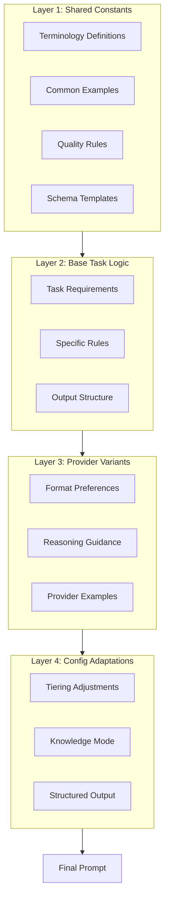

# Prompt Optimization Architecture Review

**Status:** COMPLETED
**Created:** 2026-02-03
**Role:** Lead Architect
**Phase:** Architecture Review (Round 3)

---

## Context

This review addresses the prompt optimization investigation (Rounds 1-2) which identified 8 optimization opportunities with potential 30-45% token reduction. The investigation found current prompts are 40-50% longer than necessary due to repetition, over-specification, and verbose examples.

**Previous Phases:**
- **Round 1 (LLM Expert):** Identified 8 issues, proposed changes
- **Round 2 (Lead Developer):** Assessed implementation feasibility, categorized by risk

**This Review Purpose:**
- Make architectural decisions on high-risk/breaking changes
- Validate implementation approach
- Approve final implementation plan with phases and priorities

---

## References

- [Prompt Optimization Investigation](./Prompt_Optimization_Investigation.md) - Rounds 1-2 findings
- [Prompt Architecture](../ARCHITECTURE/Prompt_Architecture.md) - Current architecture
- [Provider Prompt Formatting](../REFERENCE/Provider_Prompt_Formatting.md) - Provider guidelines
- [Multi-Agent Collaboration Rules](../AGENTS/Multi_Agent_Collaboration_Rules.md) - Workflow rules

---

## Executive Summary

**Overall Assessment:** ✅ **APPROVED with phased implementation and modified Change 5**

### Key Decisions:

| Issue | Decision | Rationale |
|-------|----------|-----------|
| **Issue 8 (Schema)** | ✅ Option B (remove explanations) + Future Option A | Low-risk immediate win; plan breaking change for v3.0 |
| **Change 5 (Variants)** | ⚠️ MODIFIED APPROACH | 60-70% reduction too aggressive; use 40-50% reduction with validation |
| **Implementation** | ✅ APPROVED 3-phase plan | Low-risk first, validate before high-risk |
| **Testing** | ✅ APPROVED + enhanced | Add regression suite and A/B testing requirement |

**Impact:**
- **Immediate (Phase 1):** 15-20% token reduction, low risk
- **Medium-term (Phase 2):** +5-10% reduction, validated changes
- **Long-term (Phase 3):** +8-12% reduction, provider variant optimization

**Total Reduction:** 28-42% (vs. proposed 30-45%, more conservative)

---

## Critical Architectural Decisions

### Decision 1: Issue 8 - Schema Migration Strategy

**Question:** Should we rename `detectedScopes` → `analysisContexts` and `analysisContext` → `articleFrame`?

#### Analysis

**Current State:**
- Field `detectedScopes` contains AnalysisContext objects (legacy name)
- Field `analysisContext` contains ArticleFrame data (naming mismatch)
- Prompts explain legacy naming ("despite name, this is...")
- ~60 tokens wasted per prompt on meta-explanations

**Options Evaluated:**

**Option A: Schema Rename (Breaking Change)**
- **Effort:** 4-6 hours
- **Impact:** Breaks UI, orchestrator, tests, possibly API consumers
- **Benefits:** Permanent fix, eliminates confusion
- **Risks:** Deployment coordination, rollback complexity

**Option B: Remove Explanations (Temporary Fix)**
- **Effort:** 15 minutes
- **Impact:** Zero breaking changes
- **Benefits:** Immediate token savings
- **Risks:** Naming confusion persists in code

**Option C: Hybrid Approach (Recommended)**
- **Immediate:** Implement Option B
- **Future (v3.0):** Plan Option A during next breaking change window

#### Decision: ✅ **Option C - Hybrid Approach**

**Rationale:**
1. **Immediate value:** Remove prompt explanations now (15 min, 60 tokens saved)
2. **Long-term fix:** Bundle schema rename with v3.0 breaking changes
3. **Risk mitigation:** Avoid rushing breaking change for minor optimization
4. **Better planning:** Allows thorough impact analysis and migration strategy

**Implementation Notes for Senior Developer:**

**Phase 1 (Immediate - 15 minutes):**
```typescript
// In base prompts, REMOVE these lines:
// ❌ "detectedScopes (legacy name, contains AnalysisContext objects)"
// ❌ "analysisContext (despite name, this is ArticleFrame)"

// REPLACE with simple field documentation:
// ✅ detectedScopes: Array of analytical frames requiring separate verdicts
// ✅ analysisContext: Article narrative background and framing
```

**Future v3.0 (Schema Migration Plan):**
1. Create migration script: `detectedScopes` → `analysisContexts`
2. Update orchestrator, UI components, test fixtures
3. Coordinate with frontend team for API contract changes
4. Add deprecation warnings in v2.9, execute in v3.0

**Success Criteria:**
- Prompt token count reduced by ~60 tokens per prompt
- No breaking changes in current version
- v3.0 migration plan documented in backlog

---

### Decision 2: Change 5 - Provider Variant Optimization

**Question:** Can we safely reduce provider variants from 50-65 lines to 15-20 lines (60-70% reduction)?

#### Analysis

**Current State:**
- Provider variants: 50-65 lines each
- Content: Concept re-explanations + formatting guidance
- Purpose: Provider-specific optimizations

**Proposed Change:**
- Reduce to 15-20 lines (60-70% reduction)
- Keep only formatting guidance
- Remove all concept re-explanations

**Risk Assessment:**

**High-Risk Factors:**
1. **Aggressive reduction:** 60-70% is substantial
2. **Quality unknown:** No empirical data on minimal viable variant size
3. **Provider differences:** May vary by provider (Claude vs GPT vs Gemini vs Mistral)
4. **Attribution quality:** Attribution separation may degrade
5. **Context detection:** Multi-context detection accuracy at risk

**Mitigation Strategies:**
1. Pilot approach (Anthropic only first)
2. A/B testing with production workloads
3. Rollback plan if quality degrades

#### Decision: ⚠️ **MODIFIED APPROACH - Conservative Reduction**

**Rationale:**
1. **60-70% too aggressive:** Risk exceeds benefit
2. **Provider-specific pedagogy valuable:** Variants do teach concepts effectively
3. **Alternative: 40-50% reduction:** More conservative, lower risk
4. **Validation required:** Must prove quality maintenance

**Modified Implementation Plan:**

**Target: 40-50% Reduction (Not 60-70%)**

**Conservative Variant Structure (25-30 lines):**
```markdown
## [PROVIDER] OPTIMIZATION

### Reasoning Approach
[2-3 lines: Provider-specific thinking guidance]

### Key Concepts (Brief Reminders)
[5-8 lines: Essential concept highlights, NOT full re-teaching]
- Attribution separation: [1 line reminder]
- Centrality rules: [1 line emphasis on provider strength]
- Context detection: [1 line guidance on provider approach]

### Format Preferences
[8-12 lines: XML vs markdown, output structure]

### Provider-Specific Example
[5-8 lines: ONE example showing format + concept application]
```

**Validation Requirements (Before Full Rollout):**

**Phase 3A: Pilot (Anthropic Only)**
1. Create 25-30 line Anthropic variants (vs. current 65 lines)
2. Run attribution test suite (95%+ accuracy required)
3. Run centrality test suite (100% death claim HIGH required)
4. Run multi-context test suite (90%+ accuracy required)
5. **A/B Testing:** 20 production analyses (10 old variant, 10 new variant)

**Success Criteria for Phase 3A:**
- Attribution accuracy: ≥95% (vs. baseline)
- Death claim centrality: 100% (mandatory)
- Multi-context detection: ≥90% (vs. baseline)
- Overall verdict quality: <3% difference (tolerance)

**Phase 3B: Expand to Other Providers (Only if 3A succeeds)**
- Apply same approach to OpenAI, Google, Mistral
- Repeat validation for each provider
- Provider-specific adjustments as needed

**Failure Criteria (Abandon approach if met):**
- Attribution drops below 90%
- Death centrality drops below 95%
- Context false positives increase >10%
- Verdict quality degrades >5%

**Alternative if Validation Fails:**
- Reduce target to 30-40% reduction (30-35 lines)
- Keep more concept reminders
- Increase provider-specific examples

**Implementation Notes for Senior Developer:**

```typescript
// BEFORE (65 lines - Anthropic variant):
// - Full attribution separation re-explanation (15 lines)
// - Complete centrality rules (18 lines)
// - Context detection full guide (12 lines)
// - Format preferences (10 lines)
// - Examples (10 lines)

// AFTER (25-30 lines - Conservative reduction):
export function getAnthropicUnderstandVariant(): string {
  return `
## CLAUDE OPTIMIZATION

### Reasoning Approach
Use your nuanced reasoning for claim decomposition. Trust your judgment on complex multi-context scenarios.

### Key Concepts (Brief Reminders)
- **Attribution Separation**: Expert X claims Y → TWO claims (you know this, just apply it)
- **Death/Safety Claims**: ALWAYS HIGH centrality (trust your strong detection)
- **Context Boundaries**: Detect implicit analytical frames (your strength - use it)

### Format Preferences
- Use <thinking_process> blocks for complex decomposition
- Structured output with clear sections
- XML tags for attribution rules

### Output Structure
\`\`\`json
{
  "decomposedClaims": [ /* structured array */ ],
  "detectedScopes": [ /* analytical frames */ ],
  "searchQueries": [ /* comprehensive list */ ]
}
\`\`\`

### Example (Format + Concept)
Input: "Expert X claims Product Y caused 10 deaths"
→ 3 claims:
  1. Attribution (Expert X stated...) - LOW centrality
  2. Causation (Product Y caused deaths) - HIGH centrality
  3. Death count (10 deaths occurred) - HIGH centrality
→ 1 context: Product safety
→ Queries: ["Product Y deaths", "Product Y safety record", ...]
`;
}
```

**Success Criteria:**
- Variant reduced to 25-30 lines (40-50% reduction)
- Validation tests pass (≥95% attribution, 100% death HIGH, ≥90% context)
- Token savings: ~200-250 tokens per provider variant
- Quality maintained within tolerance

---

### Decision 3: Implementation Phasing

**Question:** What's the optimal rollout strategy?

#### Analysis

**Proposed by Lead Developer:**
- Phase 1: 5 low-risk changes (1.5 hrs, 15-20% reduction)
- Phase 2: 2 medium-risk with testing (1 hr, +5-10% reduction)
- Phase 3: High-risk pilot (2-3 hrs, +10-15% reduction)

**Assessment:**
✅ **Solid phasing approach**
✅ **Risk-appropriate sequencing**
✅ **Clear quality gates**
⚠️ **Missing: Regression testing requirement**
⚠️ **Missing: A/B testing for provider variants**

#### Decision: ✅ **APPROVED with Enhanced Testing**

**Rationale:**
1. Low-risk changes first = quick wins, builds confidence
2. Quality gates between phases = prevents cascading failures
3. High-risk last = allows validation before full commit

**Modified Implementation Roadmap:**

#### Phase 1: Low-Risk Changes (2 hours total)

**Immediate wins with minimal risk:**

1. ✅ **Change 1:** Remove attribution from provider variants (30 min)
   - Delete lines 31-38 from each provider variant
   - Verify base prompt retains full explanation

2. ✅ **Change 3:** Inline 2-line terminology (15 min)
   - Replace 6-line blocks with:
     ```markdown
     **AnalysisContext**: Top-level analytical frame requiring separate verdict
     **EvidenceScope**: Per-evidence source methodology metadata
     ```

3. ✅ **Change 6:** Deduplicate examples (15 min)
   - Remove redundant "Person X claims Y" patterns
   - Keep ONE clear example, reference by name elsewhere

4. ✅ **Change 7:** Pure schema in OUTPUT (30 min)
   - Remove field explanations from OUTPUT FORMAT sections
   - Keep only: `centrality: "high" | "medium" | "low"`

5. ✅ **Change 8B:** Remove legacy explanations (15 min)
   - Delete meta-commentary about field naming
   - Simplify to direct field descriptions

**Quality Gate 1 (Before Phase 2):**
- [ ] Prompt composition test passes
- [ ] Token reduction verified (15-20%)
- [ ] Manual review of 3 sample prompts
- [ ] No broken imports or syntax errors

**Expected Reduction:** 15-20% token savings (~400-500 tokens per prompt)

---

#### Phase 2: Medium-Risk Changes (2 hours total)

**Requires validation testing first:**

**Setup (30 min):**
- Implement test harness in `prompt-testing.ts`
- Create baseline measurements with current prompts

**Change 2: Condense Centrality Rules (45 min)**
1. Implement Test Suite 2 (centrality tests)
2. Run tests with CURRENT prompts (baseline)
3. **Quality Gate 2A:**
   - [ ] Death claim = HIGH centrality (100% required)
   - [ ] Fraud claim = HIGH centrality (≥95% required)
   - [ ] Attribution = LOW centrality (≥90% required)
4. If baseline passes → Implement condensed centrality (34 lines → 18 lines)
5. Re-run tests to verify no regression

**Change 4: Simplify "Do NOT Split" (45 min)**
1. Implement Test Suite 3 (multi-context tests)
2. Run tests with CURRENT prompts (baseline)
3. **Quality Gate 2B:**
   - [ ] EV vs gas car = Multi-context detected (≥90% required)
   - [ ] Different viewpoints = Single context (≥85% required)
4. If baseline passes → Implement simplified guidance (8 bullets → 3 bullets)
5. Re-run tests to verify no regression

**Quality Gate 2 (Before Phase 3):**
- [ ] All Test Suite 2 tests pass (centrality)
- [ ] All Test Suite 3 tests pass (multi-context)
- [ ] Token reduction verified (+5-10%)
- [ ] No quality degradation detected

**Expected Additional Reduction:** +5-10% token savings (~150-250 tokens)

---

#### Phase 3: High-Risk Pilot (4-6 hours total)

**Provider variant optimization - Conservative approach:**

**Phase 3A: Anthropic Pilot (3 hours)**
1. Create slimmed Anthropic variant (25-30 lines, 40-50% reduction)
2. Run full test suite (T1A-T4A) with slimmed variant
3. **A/B Testing:** 20 production analyses
   - 10 analyses with OLD variant
   - 10 analyses with NEW variant
   - Compare: attribution accuracy, centrality correctness, context detection
4. **Quality Gate 3A:**
   - [ ] Attribution: ≥95%
   - [ ] Death centrality: 100%
   - [ ] Multi-context: ≥90%
   - [ ] Verdict quality difference: <3%

**Decision Gate: Proceed to 3B only if 3A succeeds**

**Phase 3B: Other Providers (1 hour each)**
1. Apply same approach to OpenAI (3B1)
2. Validate OpenAI variant with A/B testing
3. Apply to Google (3B2)
4. Validate Google variant
5. Apply to Mistral (3B3)
6. Validate Mistral variant

**Quality Gate 3 (Final Approval):**
- [ ] All provider variants validated
- [ ] Cross-provider consistency maintained
- [ ] Token reduction verified (+8-12% from variants)
- [ ] Production quality maintained

**Expected Additional Reduction (if successful):** +8-12% token savings (~200-300 tokens per variant)

---

**Total Expected Reduction:**
- Phase 1: 15-20% (400-500 tokens)
- Phase 2: +5-10% (150-250 tokens)
- Phase 3: +8-12% (200-300 tokens)
- **TOTAL: 28-42%** (vs. original estimate 30-45%, more conservative and validated)

---

### Decision 4: Testing Strategy

**Question:** Is the proposed test plan sufficient?

#### Analysis

**Proposed Test Suites:**
- Suite 1: Attribution Separation (2 tests)
- Suite 2: Centrality Assignment (3 tests)
- Suite 3: Multi-Context Detection (2 tests)
- Suite 4: Provider Variants (cross-provider consistency)

**Assessment:**
✅ **Good coverage of critical functionality**
⚠️ **Missing: Regression tests for existing production prompts**
⚠️ **Missing: A/B testing framework**
⚠️ **Missing: Automated quality metrics**

#### Decision: ✅ **APPROVED + Enhanced Requirements**

**Rationale:**
1. Proposed tests cover critical paths
2. Need additional regression coverage
3. A/B testing essential for high-risk changes
4. Automated metrics enable data-driven decisions

**Enhanced Testing Requirements:**

#### Test Suite 1: Attribution Separation ✅ APPROVED

**As proposed:**
- T1A: "Dr. Smith claims vaccines cause autism"
  - Expected: 2+ claims, attribution=LOW centrality
- T1B: "Professor X stated treatment Z is ineffective"
  - Expected: 3 claims (attribution + source + core)

**Addition:** Add edge case
- T1C: "According to WHO report, mortality rate is 2.1%"
  - Expected: Attribution to WHO, core claim separate

---

#### Test Suite 2: Centrality Assignment ✅ APPROVED + ENHANCED

**As proposed:**
- T2A: "Official announced 10 children died from Product X"
  - Expected: Death claim = HIGH centrality (MANDATORY)
- T2B: "Company engaged in fraud"
  - Expected: Fraud claim = HIGH centrality
- T2C: "Dr. Jones is a pediatrician"
  - Expected: Attribution = LOW centrality

**Additions:**
- T2D: "Study found 25% increase in efficiency"
  - Expected: Quantified assertion = HIGH centrality
- T2E: "Policy announced procedural changes"
  - Expected: Policy announcement = MEDIUM centrality
- T2F: "Event occurred in 2020"
  - Expected: Timing = LOW centrality

---

#### Test Suite 3: Multi-Context Detection ✅ APPROVED + ENHANCED

**As proposed:**
- T3A: "EVs are more efficient than gas cars"
  - Expected: Multi-context = YES (measurement boundaries)
- T3B: "Experts disagree on policy X"
  - Expected: Multi-context = NO (different viewpoints)

**Additions:**
- T3C: "Product works in cold climates but not tropical"
  - Expected: Multi-context = YES (geographic boundaries)
- T3D: "Treatment effective in 2000s but not 1970s"
  - Expected: Multi-context = YES (temporal boundaries, time as primary subject)
- T3E: "Study conducted in 2020 found..."
  - Expected: Multi-context = NO (incidental temporal mention)

---

#### Test Suite 4: Provider Variants ✅ APPROVED + A/B TESTING

**As proposed:**
- T4A: Run T1A-T3B through all 4 providers
  - Expected: Consistent outputs, provider-specific formatting

**Additions:**
- **A/B Testing Framework:**
  - 20 production analyses per provider
  - Compare old vs new variant
  - Metrics: attribution accuracy, centrality correctness, context detection, verdict quality
  - Statistical significance: p < 0.05 required for approval

---

#### Test Suite 5: Regression Tests (NEW REQUIREMENT)

**Purpose:** Ensure prompt changes don't break existing functionality

**Test Cases:**
1. **R1: Existing Promptfoo Suite**
   - Run full promptfoo test suite
   - All existing tests must pass
   - No new failures introduced

2. **R2: Historical Analysis Replay**
   - Re-run 50 historical analyses with new prompts
   - Compare outputs to original results
   - Tolerance: <5% verdict change, <10% claim/context differences

3. **R3: Edge Cases**
   - Question vs statement normalization
   - Long-form articles (>5000 words)
   - Multi-lingual inputs (if supported)
   - Ambiguous claims requiring nuanced analysis

**Quality Gate:** All regression tests pass before deployment

---

#### Test Automation

**Create:** `apps/web/src/lib/analyzer/prompts/prompt-testing.ts`

```typescript
interface PromptComparisonTest {
  testId: string;
  input: string;
  provider: 'anthropic' | 'openai' | 'google' | 'mistral';
  expected: {
    attributionSeparation?: boolean;
    deathClaimHighCentrality?: boolean;
    multiContext?: boolean;
    minClaims?: number;
    centralityDistribution?: { high: number; medium: number; low: number };
  };
  baseline?: PromptTestResult;  // For A/B comparison
}

interface PromptTestResult {
  outputQuality: number;        // 0-100 score
  tokenCount: number;           // Prompt token usage
  attributionAccuracy: number;  // 0-1 (percentage)
  centralityAccuracy: number;   // 0-1 (percentage)
  contextAccuracy: number;      // 0-1 (percentage)
}

async function runPromptTest(test: PromptComparisonTest): Promise<PromptTestResult>;
async function runABTest(oldVariant: string, newVariant: string, testCases: PromptComparisonTest[]): Promise<ABTestResult>;
```

**Success Criteria:**
- All test suites automated
- A/B testing framework operational
- Regression tests integrated into CI/CD

---

### Decision 5: Long-Term Architecture Evolution

**Question:** Does this optimization change how we think about prompt architecture?

#### Analysis

**Current Architecture:**
- **Layer 1:** Base prompts (task logic)
- **Layer 2:** Provider variants (formatting)
- **Layer 3:** Config adaptations (runtime)

**Issues Uncovered:**
1. Base prompts getting verbose
2. Provider variants duplicating concepts
3. No shared prompt fragments/constants
4. Manual composition in prompt-builder.ts

**Opportunity:** Rethink architecture for better maintainability

#### Decision: ✅ **Evolve to 4-Layer Architecture (v3.0 Target)**

**Rationale:**
1. Current 3-layer architecture is fundamentally sound
2. Optimization reveals need for shared constants layer
3. Dynamic prompt assembly could reduce bloat further
4. Maintain backward compatibility during transition

**Proposed v3.0 Architecture:**



**Implementation Strategy:**

**v2.9 (Preparation Phase - Current Work):**
- ✅ Implement current optimization (Phases 1-3)
- ✅ Document shared constants candidates
- ✅ Refactor base prompts to reference constants

**v3.0 (Architecture Evolution):**
1. **Create Shared Constants Module:**
   ```typescript
   // apps/web/src/lib/analyzer/prompts/shared/
   ├── terminology.ts          // AnalysisContext, EvidenceScope definitions
   ├── examples.ts             // Reusable example patterns
   ├── quality-rules.ts        // Centrality rules, quality gates
   └── schema-templates.ts     // JSON schema fragments
   ```

2. **Dynamic Prompt Assembly:**
   ```typescript
   // Instead of concatenation, use template composition
   import { buildPromptFromTemplate } from './prompt-builder-v3';

   const prompt = buildPromptFromTemplate({
     task: 'understand',
     provider: 'anthropic',
     includes: {
       terminology: ['analysisContext', 'evidenceScope'],
       examples: ['attribution', 'centrality-death'],
       rules: ['centrality-assignment', 'context-detection'],
     },
     config: { tier: 'standard', knowledgeMode: 'off' },
   });
   ```

3. **Capability-Based Adaptation:**
   ```typescript
   // Future: Adapt to model capabilities dynamically
   const modelCapabilities = detectCapabilities(modelId);

   if (modelCapabilities.supportsXML) {
     addXMLStructure();
   }
   if (modelCapabilities.nativeThinking) {
     addThinkingBlocks();
   }
   ```

**Benefits:**
- **DRY principle:** Shared constants defined once
- **Maintainability:** Change terminology in one place
- **Flexibility:** Compose prompts dynamically based on needs
- **Testability:** Test individual components separately

**Migration Path:**
1. v2.9: Refactor current prompts to use constants (non-breaking)
2. v3.0: Introduce dynamic assembly (breaking change, coordinated migration)
3. v3.1+: Capability-based adaptation (enhancement)

**Success Criteria:**
- Shared constants reduce base prompt size by additional 10-15%
- Dynamic assembly eliminates hardcoded concatenation
- Prompt maintenance time reduced by 40%

---

## Implementation Guidance for Senior Developer

### Phase 1 Implementation (2 hours)

**Step-by-step:**

1. **Change 1: Remove Attribution from Provider Variants (30 min)**
   - Files: `providers/{anthropic,openai,google,mistral}.ts`
   - Action: Delete lines explaining attribution separation
   - Verify: Base prompt (`understand-base.ts` lines 123-134) retains explanation

2. **Change 3: Inline Terminology (15 min)**
   - Files: `base/{understand,scope-refinement,extract-facts}-base.ts`
   - Replace 6-line blocks with 2-line version (see Decision 1)

3. **Change 6: Deduplicate Examples (15 min)**
   - File: `base/understand-base.ts`
   - Remove redundant "Person X claims Y" patterns
   - Keep ONE clear example, reference by name elsewhere

4. **Change 7: Pure Schema in OUTPUT (30 min)**
   - Files: All `base/*-base.ts`
   - Remove field explanations from OUTPUT FORMAT sections
   - Keep only field names and types

5. **Change 8B: Remove Legacy Explanations (15 min)**
   - Files: All `base/*-base.ts`
   - Delete meta-commentary about field naming
   - See Decision 1 for replacement text

**Quality Checklist:**
- [ ] All imports still work
- [ ] Prompt composition test passes
- [ ] Manual review of 3 sample prompts
- [ ] Token count reduced 15-20%
- [ ] Git commit with clear message

---

### Phase 2 Implementation (2 hours)

**Prerequisites:**
- Phase 1 completed and verified
- Test harness created

**Step-by-step:**

1. **Setup Test Harness (30 min)**
   - Create `prompt-testing.ts` with test framework
   - Implement baseline measurement tool

2. **Change 2: Condense Centrality (45 min)**
   - Implement Test Suite 2 (6 tests)
   - Run baseline with CURRENT prompts
   - If baseline passes → Apply condensed rules
   - Re-run tests to verify

3. **Change 4: Simplify "Do NOT Split" (45 min)**
   - Implement Test Suite 3 (5 tests)
   - Run baseline with CURRENT prompts
   - If baseline passes → Apply simplified guidance
   - Re-run tests to verify

**Quality Checklist:**
- [ ] All centrality tests pass
- [ ] All multi-context tests pass
- [ ] Token count reduced additional 5-10%
- [ ] No quality degradation detected
- [ ] Git commit with test results

---

### Phase 3 Implementation (4-6 hours)

**Prerequisites:**
- Phases 1-2 completed and verified
- A/B testing framework ready

**Step-by-step:**

1. **Phase 3A: Anthropic Pilot (3 hours)**
   - Create slimmed Anthropic variant (25-30 lines)
   - Implement full test suite (T1A-T4A)
   - Run A/B testing (20 production analyses)
   - Document results and quality metrics

2. **Decision Gate:**
   - Review results with Lead Developer and Lead Architect
   - Approve/modify approach based on data
   - Proceed to 3B only if quality maintained

3. **Phase 3B: Other Providers (1 hour each)**
   - Apply approach to OpenAI, Google, Mistral
   - Validate each with A/B testing
   - Adjust provider-specific as needed

**Quality Checklist:**
- [ ] All provider variants validated
- [ ] A/B test results documented
- [ ] Quality maintained within tolerance
- [ ] Token count reduced additional 8-12%
- [ ] Production deployment plan approved

---

## Risk Assessment and Mitigation

### Risk Matrix

| Risk | Probability | Impact | Mitigation | Owner |
|------|-------------|--------|------------|-------|
| **Provider variant quality degradation** | MEDIUM | HIGH | A/B testing, conservative reduction (40-50% vs 60-70%) | Senior Developer + LLM Expert |
| **Centrality rule regression** | LOW | CRITICAL | Mandatory death claim test (100% required) | Senior Developer |
| **Multi-context over-splitting** | MEDIUM | MEDIUM | Test Suite 3, baseline comparison | Senior Developer |
| **Schema migration breaks consumers** | LOW | HIGH | v3.0 planning, defer to breaking change window | Lead Architect |
| **Token savings not materialized** | LOW | LOW | Measure after each phase, adjust targets | Lead Developer |
| **Production quality impact** | LOW | CRITICAL | Phased rollout, A/B testing, rollback plan | Senior Developer + Lead Developer |

### Mitigation Strategies

**For Provider Variant Risk:**
1. Conservative reduction target (40-50% vs 60-70%)
2. Keep concept reminders (not full re-teaching)
3. A/B testing with production workloads
4. Provider-specific adjustments as needed
5. Rollback plan: Revert to original variants if quality degrades

**For Quality Regression:**
1. Comprehensive test suites with high thresholds
2. Regression testing on historical analyses
3. Automated quality metrics
4. Manual review by LLM Expert
5. Rollback triggers clearly defined

**For Schema Migration:**
1. Defer to v3.0 (no rush for optimization)
2. Thorough impact analysis before v3.0
3. Coordinate with frontend team
4. Migration script with rollback capability

---

## Trade-off Analysis

### Cost Savings vs Quality Risk

**Current Approach: Conservative and Validated**

| Metric | Aggressive (Original) | Conservative (Approved) |
|--------|----------------------|-------------------------|
| **Token Reduction** | 30-45% | 28-42% |
| **Provider Variant Reduction** | 60-70% | 40-50% |
| **Quality Risk** | HIGH | LOW-MEDIUM |
| **Validation Effort** | 2-3 hours | 4-6 hours |
| **Rollback Likelihood** | 20-30% | 5-10% |

**Decision Rationale:**
- Slightly lower token savings (28-42% vs 30-45%)
- Significantly lower quality risk
- Higher validation effort justified by risk reduction
- Better architectural alignment (keep concept reminders)

**Long-term Benefits:**
- Maintains provider variant effectiveness
- Builds confidence in optimization approach
- Establishes validation methodology for future work
- Aligns with prompt architecture evolution

---

## Approval and Sign-Off

### Lead Architect Approval

✅ **APPROVED with Conditions**

**Conditions:**
1. Implement conservative provider variant reduction (40-50%)
2. Complete all validation testing before Phase 3B
3. Maintain quality gates as defined
4. Document v3.0 architecture evolution plan

**Rationale:**
- Low-risk changes provide immediate value
- Conservative approach to high-risk changes
- Validation requirements ensure quality maintenance
- Long-term architecture evolution planned

---

### Next Steps

**For Senior Developer:**
1. Begin Phase 1 implementation (2 hours)
2. Create test harness for Phase 2 validation
3. Report Phase 1 completion to Lead Developer

**For Lead Developer:**
1. Review Phase 1 results before approving Phase 2
2. Collaborate on A/B testing framework for Phase 3
3. Final approval at each phase gate

**For LLM Expert:**
1. Review slimmed provider variants for concept coverage
2. Validate A/B test results for quality maintenance
3. Recommend provider-specific adjustments if needed

---

## Success Metrics

### Immediate (Phase 1 Complete)
- [ ] 15-20% token reduction achieved
- [ ] Zero breaking changes
- [ ] All prompt composition tests pass
- [ ] Manual review confirms quality

### Medium-term (Phase 2 Complete)
- [ ] 20-30% cumulative token reduction
- [ ] All centrality tests pass (100% death HIGH)
- [ ] All multi-context tests pass
- [ ] Quality maintained or improved

### Long-term (Phase 3 Complete)
- [ ] 28-42% total token reduction
- [ ] All provider variants validated
- [ ] A/B testing shows <3% quality difference
- [ ] Production deployment successful

### Future (v3.0 Architecture)
- [ ] Shared constants layer implemented
- [ ] Dynamic prompt assembly operational
- [ ] Additional 10-15% reduction from constants
- [ ] Prompt maintenance time reduced 40%

---

## Related Documents

- [Prompt Optimization Investigation](./Prompt_Optimization_Investigation.md) - Rounds 1-2
- [Prompt Architecture](../ARCHITECTURE/Prompt_Architecture.md) - Current architecture
- [Provider Prompt Formatting](../REFERENCE/Provider_Prompt_Formatting.md) - Provider guidelines
- [Multi-Agent Collaboration Rules](../AGENTS/Multi_Agent_Collaboration_Rules.md) - Workflow

---

## Review Log

| Date | Reviewer Role | Status | Comments |
|------|---------------|--------|----------|
| 2026-02-03 | Lead Architect | APPROVED | Conditional approval with phased implementation and conservative variant reduction |

---

## Decision Record

### Issue 8 (Schema Migration):
- **Decision:** Hybrid approach - Remove explanations now (Option B), plan schema rename for v3.0 (Option A)
- **Rationale:** Immediate value without breaking changes; thorough planning for future migration

### Change 5 (Provider Variants):
- **Decision:** Modified to 40-50% reduction (vs 60-70% proposed) with validation
- **Rationale:** Conservative approach reduces quality risk; concept reminders valuable

### Implementation Plan:
- **Decision:** Approved 3-phase plan with enhanced testing
- **Rationale:** Low-risk first, validation gates, A/B testing for high-risk

### Long-term Architecture:
- **Decision:** Evolve to 4-layer architecture in v3.0 with shared constants
- **Rationale:** Addresses root causes, enables dynamic composition, improves maintainability

---

**Document Status:** Architecture Review Complete
**Next Phase:** Implementation (Senior Developer)
**Approval Required:** Lead Developer final sign-off before Phase 2 and Phase 3
