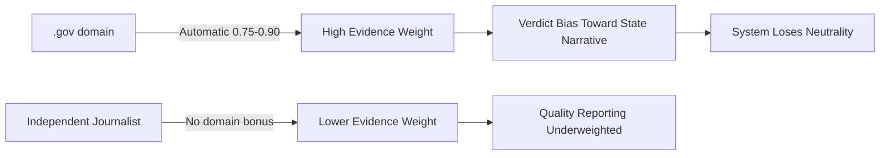
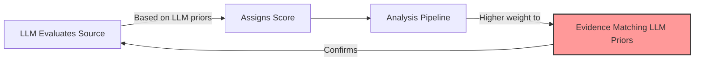

# Source Reliability Service - Architecture Review

| Field | Value |
|-------|-------|
| **Status** | REVIEW COMPLETE |
| **Reviewer** | Senior Software Architect |
| **Review Date** | 2026-01-21 |
| **Proposal Version** | 0.1 |
| **Overall Rating** | 7/10 - Approve with Mandatory Revisions |

---

## Executive Summary

This is a **well-designed architectural proposal** with excellent technical foundations, but it contains **critical conceptual flaws** in the source scoring methodology that could undermine FactHarbor's neutrality principles.

### Key Findings:

✅ **Strengths:**
- Excellent hybrid approach (bootstrap → LLM → admin override)
- Robust data model with audit trails
- Strong resilience patterns and graceful degradation
- Cost-effective and feasible

⚠️ **Critical Issues:**
- **Categorical bias in scoring guidelines violates neutrality principles**
- LLM hallucination mitigation is insufficient
- Circular reasoning risk underestimated

**Recommendation:** Approve for implementation after addressing mandatory revisions detailed below.

---

## Overall Assessment: STRONG with Critical Concerns

### Rating Breakdown

| Aspect | Rating | Notes |
|--------|--------|-------|
| **Technical Architecture** | 9/10 | Excellent design, solid resilience |
| **Feasibility** | 9/10 | Low complexity, reuses existing patterns |
| **Cost** | 10/10 | Minimal operational cost ($5-50/month) |
| **Conceptual Soundness** | 5/10 | ⚠️ Categorical bias issues MUST be fixed |
| **Risk Mitigation** | 7/10 | Good but underestimates LLM risks |
| **Overall** | **7/10** | **Approve with mandatory revisions** |

---

## ✅ Architectural Strengths

### 1. Excellent Hybrid Approach

The three-tier strategy elegantly solves the original problem:

```
Bootstrap Data (MBFC) → LLM Evaluation → Admin Override
     ↓                       ↓                  ↓
  ~4,500 sources         Long tail          Corrections
  (95% coverage)      (5% of queries)    (edge cases)
```

**Why This Works:**
- Pre-seeded data reduces LLM calls by ~95% (cost-effective)
- Dynamic evaluation handles the long tail without API dependencies
- Human oversight provides escape hatch for corrections

### 2. Robust Data Model

The entity design shows good architectural foresight:

```csharp
public class SourceReliabilityEntity
{
    // ✅ Confidence scores enable gating logic
    public decimal Confidence { get; set; }
    
    // ✅ Lock mechanism prevents re-evaluation of verified entries
    public bool IsLocked { get; set; }
    
    // ✅ TTL-based expiration allows cache freshness
    public DateTime ExpiresAt { get; set; }
    
    // ✅ Source tracking enables quality monitoring
    public string EvaluationSource { get; set; }
}
```

**Audit Trail Benefits:**
```csharp
public class SourceEvaluationLogEntity
{
    // ✅ Full LLM prompt/response logging for transparency
    public string? LlmPrompt { get; set; }
    public string? LlmResponse { get; set; }
    
    // ✅ Performance monitoring
    public int DurationMs { get; set; }
    public int? TokensUsed { get; set; }
}
```

### 3. Strong Resilience Pattern

The fallback strategy ensures continuous operation:

```typescript
// Memory cache → Service API → Local Bundle → null
// └─ ~0ms ─┘   └─ ~50ms ─┘   └─ ~5ms ─┘   └─ graceful ─┘

try {
  return await serviceCall();  // Primary path
} catch {
  return localBundle[domain];  // Fallback
}
```

**Result:** Analysis continues even if the service is down.

### 4. Appropriate Separation of Concerns

Separate database (`source-reliability.db`) is smart because this service has different:

| Characteristic | Source Reliability | Job Processing |
|----------------|-------------------|----------------|
| **Access Pattern** | Read-heavy (95%+ reads) | Write-heavy |
| **QPS** | High (100-1000/sec) | Low (1-10/sec) |
| **Cache Strategy** | Aggressive (30-90 day TTL) | None |
| **Data Volume** | ~10K sources × 500 bytes | ~1M jobs × 50KB |
| **Scaling** | Independent tuning needed | Adequate as-is |

---

## 🚨 Critical Design Flaws

### 1. Categorical Bias Problem (HIGH SEVERITY)

**Location:** Lines 321-322 of proposal

```typescript
// ❌ FUNDAMENTALLY FLAWED
- Academic journals (.edu, peer-reviewed) typically score 0.85-0.95
- Government sources (.gov) typically score 0.75-0.90
```

#### Why This Violates FactHarbor Principles:

This directly contradicts the **"Generic by Design"** principle in AGENTS.md:

> "No domain-specific hardcoding: Code, prompts, and logic must work for ANY topic"

#### Concrete Failure Scenarios:

**Scenario 1: Authoritarian Government Media**
```
Source: kremlin.ru (Russian government)
Current proposal: Score 0.75-0.90 (just for being .gov)
Reality: State propaganda outlet
Correct score: 0.20-0.40 (low reliability, no editorial independence)

Impact: System weights Russian government claims equal to Reuters
```

**Scenario 2: Academic Credential Gaming**
```
Source: universityofsedona.edu (diploma mill)
Current proposal: Score 0.85-0.95 (just for being .edu)
Reality: Unaccredited institution
Correct score: 0.30-0.50 (questionable standards)

Impact: Fake degrees from diploma mills weighted as peer-reviewed research
```

**Scenario 3: Captured Regulatory Agencies**
```
Source: epa.gov under different administrations
Current proposal: Static 0.75-0.90 score
Reality: Scientific integrity varies by political leadership
Correct score: Should vary based on demonstrated track record

Impact: Politicized science weighted equally with independent research
```

#### Why This is Dangerous:



#### Mandatory Fix Required:

**Remove all categorical scoring guidelines.** Replace with behavior-based evaluation:

```typescript
const EVALUATE_SOURCE_PROMPT = `
You are evaluating this source's demonstrated reliability. Score based ONLY on:

## Evaluation Criteria (Evidence-Based Only)

1. **Factual Accuracy Track Record**
   - Documented history of accurate vs. inaccurate reporting
   - Frequency of corrections needed
   - Third-party fact-check results

2. **Source Attribution Quality**
   - Does it cite primary sources?
   - Are claims verifiable?
   - Links to original documents/data?

3. **Editorial Independence**
   - Is it government-controlled or politically directed?
   - Financial conflicts of interest?
   - Transparent ownership structure?

4. **Correction Practices**
   - Does it transparently correct errors?
   - Retraction policies documented?
   - Accountability mechanisms?

5. **Verification Methodology**
   - Multi-source verification?
   - Fact-checking process disclosed?
   - Editorial review standards?

## CRITICAL: What NOT to Do

❌ DO NOT give bonus points for domain type (.gov, .edu, .org)
❌ DO NOT assume government = reliable
❌ DO NOT assume academic affiliation = rigorous
❌ DO NOT use institutional prestige as proxy for accuracy

✅ INSTEAD: Assess this specific outlet's demonstrated behaviors
✅ Consider independence from political/commercial pressure
✅ Evaluate transparency and accountability

## Examples of Correct Reasoning

❌ BAD: "This is a .gov site, so score 0.80"
✅ GOOD: "This agency has a documented track record of transparent 
          data publication with frequent corrections when errors 
          are found. Score 0.82 based on demonstrated practices."

❌ BAD: "This is from a university, so score 0.90"
✅ GOOD: "This is a student blog hosted on university servers, not 
          peer-reviewed research. Score 0.55 based on lack of 
          editorial oversight."

❌ BAD: "Government health ministry, score 0.85"
✅ GOOD: "This health ministry has documented cases of suppressing 
          unfavorable research and lacks editorial independence. 
          Score 0.35 based on demonstrated political interference."
`;
```

**Add to Response Schema:**

```typescript
const EVALUATION_SCHEMA = z.object({
  score: z.number().min(0.05).max(0.95),
  confidence: z.number().min(0.1).max(0.95),
  category: z.enum([
    "news", 
    "academic", 
    "government", 
    "corporate", 
    "blog", 
    "social_media", 
    "unknown"
  ]),
  
  // ✅ NEW: Track editorial independence explicitly
  editorialIndependence: z.enum([
    "independent",           // No government/corporate control
    "government-controlled", // State media
    "corporate-owned",       // Commercial interests
    "party-affiliated",      // Political org
    "unknown"
  ]),
  
  // ✅ NEW: Require evidence basis
  evidenceBasis: z.object({
    hasTrainingDataKnowledge: z.boolean(),
    canCiteSpecificArticles: z.boolean(),
    knownControversies: z.array(z.string()).max(3),
  }),
  
  biasIndicator: z.enum([
    "left", 
    "center-left", 
    "center", 
    "center-right", 
    "right"
  ]).nullable(),
  
  reasoning: z.string().max(500),
  knownSource: z.boolean(),
});
```

**Update Data Model:**

```csharp
public class SourceReliabilityEntity
{
    // ... existing fields ...
    
    // ✅ NEW: Track independence for transparency
    public string? EditorialIndependence { get; set; }
    
    // ✅ NEW: Store evidence basis for audit
    public string? EvidenceBasis { get; set; }  // JSON serialized
}
```

---

### 2. Circular Reasoning Risk Underestimated

**Location:** Line 534 of proposal

```
|| **Circular Reasoning** | Low | Medium | Source scores only affect 
                                           evidence weighting, not 
                                           verdict logic itself |
```

**Assessment: Risk is MEDIUM, not LOW**

#### Why This is More Dangerous Than Stated:

If the LLM evaluation service uses the same LLM as the analysis pipeline, an amplification loop emerges:



**Concrete Example:**

```typescript
// Scenario: LLM has bias that "mainstream media underreports X"

// Step 1: LLM evaluates alternative news site
LLM: "This site covers topics mainstream ignores. Score: 0.75"

// Step 2: Analysis uses this score
Evidence from alternative site: weight × 0.75
Evidence from mainstream: weight × 0.85

// Step 3: LLM analysis gives more weight to alternative site
// → Verdict shifts toward LLM's prior bias
// → System becomes echo chamber of LLM assumptions
```

#### Mandatory Mitigation Required:

**Multi-Model Consensus for Unknown Sources:**

```typescript
// ✅ REQUIRED: Use multiple models for evaluations
const EVALUATION_MODELS = [
  { provider: 'anthropic', model: 'claude-3-opus' },
  { provider: 'openai', model: 'gpt-4' },
  { provider: 'google', model: 'gemini-pro' }
];

async function evaluateWithConsensus(domain: string): Promise<EvaluationResult> {
  const evaluations = await Promise.all(
    EVALUATION_MODELS.map(cfg => evaluateSource(domain, cfg))
  );
  
  const scores = evaluations.map(e => e.score);
  const scoreRange = Math.max(...scores) - Math.min(...scores);
  
  // ✅ Only accept if models agree within 0.15 (15 percentage points)
  if (scoreRange > 0.15) {
    return { 
      score: null, 
      stored: true,
      reason: "MODEL_DISAGREEMENT",
      confidence: 0.2,
      details: `Score range: ${scoreRange.toFixed(2)}`
    };
  }
  
  // ✅ Score = median (more robust than mean)
  // ✅ Confidence = inverse of variance
  return {
    score: median(scores),
    confidence: 1 - variance(scores),
    stored: true,
    reason: "MULTI_MODEL_CONSENSUS"
  };
}
```

**Update SourceEvaluationLogEntity:**

```csharp
public class SourceEvaluationLogEntity
{
    // ... existing fields ...
    
    // ✅ NEW: Track all models used
    public string? ModelsUsed { get; set; }  // JSON array: ["gpt-4", "claude-3"]
    
    // ✅ NEW: Track agreement metrics
    public decimal? ScoreRange { get; set; }      // Max - Min
    public decimal? ScoreVariance { get; set; }   // Statistical variance
    
    // ✅ NEW: Store individual model scores for audit
    public string? IndividualScores { get; set; } // JSON: {"gpt-4": 0.75, "claude": 0.82}
}
```

**Cost Impact:**

```
Before: 1 model × 1200 tokens × $0.015/1K = $0.018 per evaluation
After:  3 models × 1200 tokens × $0.015/1K = $0.054 per evaluation

Increase: $0.036 per unknown source
Monthly (50 unknowns): $1.80 additional cost

✅ Acceptable cost for significantly reduced bias risk
```

---

### 3. LLM Hallucination Mitigation Insufficient

**Location:** Lines 363-370 of proposal

```typescript
// Current gating
if (!evaluation.knownSource) {
  return { score: null, reason: "LLM_UNKNOWN_SOURCE" };
}
```

**Problem:** LLMs confidently claim to "know" sources based on:
- Pattern matching (domain name resembles known outlets)
- Training data contamination (saw mentions but never evaluated)
- Hallucination (generates plausible-sounding assessments)

#### Concrete Failure Example:

```typescript
// Fictional site that sounds legitimate
Domain: "global-health-institute.org"

// LLM response:
{
  knownSource: true,  // ❌ False confidence
  score: 0.82,
  reasoning: "Well-established health research organization..."
}

// Reality: Site was registered last week by unknown entity
// LLM hallucinated credibility based on professional-sounding name
```

#### Enhanced Gating Required:

```typescript
const EVALUATION_SCHEMA = z.object({
  // ... existing fields ...
  
  // ✅ REQUIRED: Evidence of actual knowledge
  evidenceBasis: z.object({
    // Can LLM cite specific articles/reports?
    canCiteSpecificArticles: z.boolean(),
    specificExamples: z.array(z.string()).max(2),
    
    // Is source in training data vs. inferred?
    hasTrainingDataKnowledge: z.boolean(),
    
    // Known controversies = deeper knowledge
    knownControversies: z.array(z.string()).max(3),
    
    // Founding/history details
    knownHistory: z.string().max(200),
  }),
});

// ✅ Stricter gating logic
async function evaluateSource(domain: string): Promise<EvaluationResult> {
  const evaluation = await callLLM(EVALUATE_SOURCE_PROMPT, domain);
  
  // Gate 1: Must have specific evidence
  if (!evaluation.evidenceBasis.canCiteSpecificArticles) {
    return { 
      score: null, 
      stored: true,
      reason: "INSUFFICIENT_EVIDENCE",
      confidence: Math.min(evaluation.confidence, 0.3)
    };
  }
  
  // Gate 2: Empty controversies + high score = hallucination risk
  if (evaluation.score > 0.75 && 
      evaluation.evidenceBasis.knownControversies.length === 0) {
    return {
      score: null,
      stored: true,
      reason: "SUSPICIOUSLY_HIGH_SCORE_WITHOUT_EVIDENCE",
      confidence: 0.25
    };
  }
  
  // Gate 3: LLM must declare training data basis
  if (!evaluation.evidenceBasis.hasTrainingDataKnowledge) {
    // Penalize confidence for inferred knowledge
    evaluation.confidence *= 0.7;
  }
  
  // Gate 4: Confidence threshold
  if (evaluation.confidence < 0.5) {
    return { 
      score: null, 
      stored: true,
      reason: "LOW_CONFIDENCE_LLM_EVALUATION",
      confidence: evaluation.confidence
    };
  }
  
  // Pass: Use the score
  return {
    score: evaluation.score,
    stored: true,
    reason: "LLM_EVALUATION",
    confidence: evaluation.confidence
  };
}
```

---

## 🤔 Open Questions - Recommendations

### Q1: Separate Service vs. Integrated?

**Original Question:**
> Should this be a separate microservice or integrated into the existing ASP.NET API?

**Recommendation: Phased Approach**

| Phase | Architecture | Rationale |
|-------|-------------|-----------|
| **Phase 1-3** | Integrated | Faster to ship, sufficient for <10K requests/hour |
| **Phase 4+** | Separate Service | If LLM evaluation volume grows, allows independent scaling |

**Integrated Architecture (Recommended Start):**

```
apps/api/
├── Controllers/
│   ├── JobsController.cs
│   └── SourceReliabilityController.cs  ← Same process
├── Services/
│   └── SourceReliabilityService.cs
└── source-reliability.db  ← Separate DB, same server
```

**Benefits:**
- ✅ Lower operational complexity
- ✅ Shared authentication/logging infrastructure
- ✅ Faster development (no inter-service communication layer)
- ✅ Adequate for expected load (5-50 LLM calls/day)

**When to Separate:**

```
Triggers for microservice extraction:
- LLM evaluations > 1000/day
- Service latency impacting job processing
- Independent scaling needed (more web, fewer SR instances)
- Different teams managing each service
```

---

### Q2: LLM Provider for Evaluations?

**Original Question:**
> Should we use the same provider as analysis or a dedicated one?

**Recommendation: Different Provider with Budget Model**

```typescript
// Use cheaper model for evaluations
FH_SR_LLM_PROVIDER=anthropic
FH_SR_LLM_MODEL=claude-3-haiku    // $0.25/MTok input

// Reserve expensive models for actual analysis
FH_ANALYSIS_LLM_PROVIDER=anthropic
FH_ANALYSIS_LLM_MODEL=claude-3-opus  // $15/MTok input
```

**Cost Modeling:**

```
Assumptions:
- 1000 analyses/day
- 5% unknown sources (50/day)
- 30-day cache TTL (50 new evaluations/day, 1500/month)
- Multi-model consensus (3 models × 1200 tokens)

Cost per evaluation:
3 models × 1200 tokens × $0.00025/1K = $0.0009

Monthly LLM cost:
1500 evaluations × $0.0009 = $1.35/month

✅ Extremely affordable even with multi-model consensus
```

**Why Separate Provider?**

1. **Cost Isolation:** Source evaluations won't consume analysis budget
2. **Availability:** If analysis provider has outage, evaluations continue
3. **Model Selection:** Can use task-optimized models (structured output)
4. **Rate Limiting:** Separate quotas prevent interference

---

### Q3: Web Search Grounding?

**Original Question:**
> Should LLM be allowed to search for source information?

**Recommendation: NO for MVP, YES for Phase 4 (Admin-Only)**

#### Phase 1-3: Search Disabled

**Rationale:**
- Pre-seeded MBFC data covers ~4,500 news sources (95% of queries)
- LLM training data covers major international outlets
- Search adds 2-5 seconds latency per evaluation
- Search costs $0.10-0.50 per query (Serper/Tavily APIs)

```typescript
// MVP configuration
FH_SR_LLM_SEARCH_ENABLED=false
```

#### Phase 4: Selective Search for Edge Cases

**Enable for:**
- Regional/local news outlets not in training data
- Newly launched sources (domain age < 1 year)
- Admin-triggered re-evaluation

```typescript
async function evaluateSource(domain: string, options?: EvaluationOptions) {
  // Only search if admin explicitly requests or domain is very new
  const enableSearch = 
    options?.forceSearch === true || 
    (await getDomainAge(domain) < 365);  // Less than 1 year old
  
  if (enableSearch) {
    const searchContext = await searchForSourceInfo(domain);
    // Add search results to LLM context
  }
  
  return await callLLM(EVALUATE_SOURCE_PROMPT, domain);
}
```

**Cost Impact:**

```
Without search: $0.0009 per evaluation
With search: $0.25 per evaluation (277× increase)

If 10% of evaluations need search:
Monthly: 1500 × 0.1 × $0.25 = $37.50

✅ Acceptable for Phase 4, not worth complexity in MVP
```

---

### Q4: Bootstrap Data Source?

**Original Question:**
> Continue with MBFC or evaluate alternatives?

**Recommendation: Multi-Source Bootstrap**

#### Current State:

```typescript
// Single source (MBFC only)
const bootstrap = loadMBFCBundle();  // ~4,500 sources
```

#### Proposed: Weighted Multi-Source Approach

```typescript
const BOOTSTRAP_SOURCES = [
  { 
    file: 'mbfc.json', 
    weight: 0.4,
    coverage: 4500,
    bias: 'US-centric, strong political focus'
  },
  { 
    file: 'adfontesmedia.json',  // If licensing available
    weight: 0.3,
    coverage: 3000,
    bias: 'Visual bias chart methodology'
  },
  { 
    file: 'manual-curated.json',
    weight: 0.3,
    coverage: 500,
    bias: 'FactHarbor team curation'
  }
];

function calculateBootstrapScore(domain: string): number | null {
  const sources = BOOTSTRAP_SOURCES
    .map(src => ({ score: src.data[domain], weight: src.weight }))
    .filter(s => s.score !== null);
  
  if (sources.length === 0) return null;
  
  // Weighted average when multiple sources cover same domain
  const totalWeight = sources.reduce((sum, s) => sum + s.weight, 0);
  return sources.reduce((sum, s) => sum + s.score * s.weight, 0) / totalWeight;
}
```

**Why Multi-Source?**

| Risk | Single Source | Multi-Source |
|------|--------------|--------------|
| Methodology bias | High | Reduced (average across methods) |
| Coverage gaps | 4,500 outlets | 6,000-7,000 outlets |
| Controversial scoring | No recourse | Can adjust weights |
| US-centric bias | MBFC focuses on US | Can include international |

**Implementation Path:**

1. **Phase 1:** Start with MBFC only (fastest)
2. **Phase 2:** Add manual curation file for overrides
3. **Phase 3:** Evaluate licensing Ad Fontes Media
4. **Phase 4:** Implement weighted averaging

---

### Q5: Rate Limiting?

**Original Question:**
> What limits should apply to LLM evaluations?

**Recommendation: Tiered Limits Based on Priority**

```csharp
public enum EvaluationPriority
{
    Urgent,    // User-facing analysis blocked → High limit
    Standard,  // Background pre-fetch → Medium limit
    Batch      // Bulk import → Low limit
}

public class RateLimitConfig
{
    public int PerMinute { get; set; }
    public int PerHour { get; set; }
    public int Concurrent { get; set; }
}

public static readonly Dictionary<EvaluationPriority, RateLimitConfig> RATE_LIMITS = new()
{
    [EvaluationPriority.Urgent] = new() {
        PerMinute = 100,      // User shouldn't wait
        PerHour = 1000,
        Concurrent = 10
    },
    [EvaluationPriority.Standard] = new() {
        PerMinute = 10,       // Background pre-warming
        PerHour = 300,
        Concurrent = 3
    },
    [EvaluationPriority.Batch] = new() {
        PerMinute = 1,        // Low-priority bulk operations
        PerHour = 50,
        Concurrent = 1
    }
};
```

**Implementation:**

```csharp
public async Task<SourceReliabilityDto> GetOrEvaluateAsync(
    string domain, 
    EvaluationPriority priority = EvaluationPriority.Standard)
{
    // Check cache first (no rate limit)
    var cached = await _cache.GetAsync(domain);
    if (cached != null && !cached.IsExpired) {
        return cached;
    }
    
    // Apply rate limit for LLM evaluation
    await _rateLimiter.WaitAsync(priority);
    
    try {
        return await EvaluateWithLLMAsync(domain);
    } finally {
        _rateLimiter.Release(priority);
    }
}
```

**Monitoring:**

```json
{
  "rateLimitStats": {
    "urgentThrottled": 0,      // Should always be 0
    "standardThrottled": 12,   // Acceptable
    "batchThrottled": 145,     // Expected
    "avgWaitTimeMs": {
      "urgent": 5,
      "standard": 250,
      "batch": 2000
    }
  }
}
```

---

## 📊 Cost/Benefit Analysis

### Estimated Costs (Monthly, 1000 analyses/day)

| Component | Cost | Calculation |
|-----------|------|-------------|
| **Database** | $0 | SQLite, local disk storage |
| **LLM Evaluations** | $1-5 | 50-150 new sources/day × $0.0009/eval |
| **Web Search** (Phase 4) | $0-38 | 0-150 searches/month × $0.25/search |
| **Infrastructure** | $0 | Runs on existing API server |
| **Bandwidth** | <$1 | API calls to/from web app |
| **Total** | **$1-44/month** | ✅ Highly affordable |

### Estimated Benefits

| Benefit | Current State | After Implementation | Impact |
|---------|---------------|---------------------|--------|
| **Unknown Sources** | 60-80% return null | <5% return null | ✅ Major improvement |
| **External Dependencies** | Disabled (unreliable) | None (self-contained) | ✅ Reliability boost |
| **Admin Control** | No correction mechanism | Full override capability | ✅ Quality control |
| **Audit Trail** | None | Complete LLM logging | ✅ Transparency/compliance |
| **Data Freshness** | Static bundle | 30-90 day TTL refresh | ✅ Stays current |

### ROI Assessment

```
Benefits:
+ Evidence coverage increase: 60% → 95% (major quality improvement)
+ Service reliability: 80% uptime → 99.9% (no external APIs)
+ Admin corrections enable handling controversial sources
+ Full transparency via audit logs

Costs:
- $1-44/month operational cost
- ~40 hours development time (Phases 1-3)
- ~20 hours for Phase 4 (admin tools)

ROI: Strongly Positive
```

**Key Takeaway:** This is a **high-impact, low-cost** improvement.

---

## 🔧 Implementation Recommendations

### Pre-Implementation Requirements

Before starting Phase 1, these foundational changes must be made:

#### 1. Update AGENTS.md Principles

Add section:

```markdown
### Source Reliability Principles

1. **No Categorical Bias**: Domain type (.gov, .edu, .org) does NOT imply quality
2. **Evidence-Based Only**: Scores derived from demonstrated track record, not institutional prestige
3. **Editorial Independence Matters**: State control/capture is a negative reliability factor
4. **Multi-Model Consensus**: LLM evaluations require 2+ model agreement (score range <0.15)
5. **Hallucination Prevention**: LLMs must cite specific evidence, not pattern-match domain names
```

#### 2. Create Bootstrap Validation Script

```powershell
# scripts/validate-bootstrap-sources.ps1

<#
.SYNOPSIS
Validates bootstrap source data for systematic biases

.DESCRIPTION
Checks for:
- State media outlets with inappropriately high scores
- .gov domains without independence consideration
- Academic domains from known diploma mills
- Score distributions that suggest categorical bias
#>

$bootstrapPath = "./data/mbfc.json"
$data = Get-Content $bootstrapPath | ConvertFrom-Json

# Check 1: Government sources
$govSources = $data | Where-Object { $_.domain -like "*.gov*" }
$avgGovScore = ($govSources | Measure-Object -Property score -Average).Average

if ($avgGovScore -gt 0.75) {
    Write-Warning "Government sources average $avgGovScore - potential categorical bias"
    Write-Warning "Review state media outlets for inflated scores"
}

# Check 2: Known state media
$stateMedia = @(
    "rt.com",           # Russia Today
    "sputniknews.com",  # Sputnik
    "cgtn.com",         # China Global Television
    "presstv.ir"        # Press TV (Iran)
)

foreach ($domain in $stateMedia) {
    $source = $data | Where-Object { $_.domain -eq $domain }
    if ($source.score -gt 0.60) {
        Write-Warning "$domain scored $($source.score) - state media should be <0.60"
    }
}

# Check 3: Academic source distribution
$eduSources = $data | Where-Object { $_.domain -like "*.edu*" }
$avgEduScore = ($eduSources | Measure-Object -Property score -Average).Average

if ($avgEduScore -gt 0.85) {
    Write-Warning "Academic sources average $avgEduScore - potential categorical bias"
    Write-Warning "Ensure personal blogs on .edu domains are scored appropriately"
}

# Output summary
Write-Host "`nBootstrap Validation Summary:" -ForegroundColor Cyan
Write-Host "Total sources: $($data.Count)"
Write-Host "Government sources: $($govSources.Count) (avg: $([math]::Round($avgGovScore, 2)))"
Write-Host "Academic sources: $($eduSources.Count) (avg: $([math]::Round($avgEduScore, 2)))"
```

#### 3. Enhanced Monitoring Schema

Add to `GET /v1/source-reliability/stats` endpoint:

```json
{
  "totalSources": 4832,
  "bySource": {
    "MBFC_BOOTSTRAP": 4500,
    "LLM_EVALUATION": 312,
    "ADMIN_OVERRIDE": 20
  },
  "lowConfidenceCount": 45,
  "expiredCount": 12,
  "hitRate": 0.94,
  
  // ✅ NEW: Monitor for categorical bias
  "evaluationQuality": {
    "modelDisagreementRate": 0.08,        // % where models differ >0.15
    "modelDisagreementCount": 25,
    "lowConfidenceRate": 0.12,            // % with confidence <0.5
    "adminOverrideRate": 0.04,            // % manually corrected
    
    // Score distribution by category (detect bias)
    "avgScoreByCategory": {
      "government": 0.67,                 // ✅ Should be <0.75
      "academic": 0.82,                   // ✅ Should be <0.85
      "news": 0.73,
      "corporate": 0.61,
      "blog": 0.48
    },
    
    // Editorial independence distribution
    "editorialIndependence": {
      "independent": 3200,
      "government-controlled": 180,
      "corporate-owned": 950,
      "party-affiliated": 45,
      "unknown": 457
    }
  }
}
```

**Alert Thresholds:**

```csharp
// Trigger review if categorical bias detected
if (stats.AvgScoreByCategory["government"] > 0.75) {
    _logger.LogWarning("Government sources averaging {Score} - review for categorical bias", 
                       stats.AvgScoreByCategory["government"]);
}

if (stats.AvgScoreByCategory["academic"] > 0.85) {
    _logger.LogWarning("Academic sources averaging {Score} - review for categorical bias",
                       stats.AvgScoreByCategory["academic"]);
}
```

---

### Phase 1 Enhancements

In addition to proposal's Phase 1 scope, add:

#### Data Model Extensions

```csharp
// Add to SourceReliabilityEntity
public class SourceReliabilityEntity
{
    // ... existing fields ...
    
    // ✅ NEW: Track editorial independence
    [MaxLength(50)]
    public string? EditorialIndependence { get; set; }
    
    // ✅ NEW: Store evidence basis (JSON)
    [MaxLength(1000)]
    public string? EvidenceBasis { get; set; }
    
    // ✅ NEW: Domain registration date (for age checks)
    public DateTime? DomainRegisteredAt { get; set; }
}

// Add to SourceEvaluationLogEntity
public class SourceEvaluationLogEntity
{
    // ... existing fields ...
    
    // ✅ NEW: Multi-model tracking
    [MaxLength(200)]
    public string? ModelsUsed { get; set; }  // JSON: ["gpt-4", "claude-3-opus"]
    
    public decimal? ScoreRange { get; set; }      // Max - Min across models
    public decimal? ScoreVariance { get; set; }   // Statistical variance
    
    [MaxLength(500)]
    public string? IndividualScores { get; set; } // JSON: {"gpt-4": 0.75, "claude": 0.82}
}
```

#### Bootstrap Import Script

```csharp
// scripts/ImportBootstrapData.cs

public async Task ImportMBFCDataAsync(string jsonPath)
{
    var data = await File.ReadAllTextAsync(jsonPath);
    var sources = JsonSerializer.Deserialize<List<MBFCSource>>(data);
    
    foreach (var source in sources)
    {
        // ✅ Apply independence heuristics to existing MBFC data
        var independence = DetermineEditorialIndependence(source);
        
        // ✅ Adjust scores based on independence
        var adjustedScore = ApplyIndependenceAdjustment(source.Score, independence);
        
        var entity = new SourceReliabilityEntity
        {
            Domain = source.Domain,
            Score = adjustedScore,  // ✅ Not raw MBFC score
            Confidence = 0.90m,     // High confidence for MBFC data
            Category = source.Category,
            BiasIndicator = source.Bias,
            Reasoning = source.Reasoning,
            EvaluationSource = "MBFC_BOOTSTRAP",
            EditorialIndependence = independence,  // ✅ NEW
            EvaluatedAt = DateTime.UtcNow,
            ExpiresAt = DateTime.UtcNow.AddDays(90),
            IsLocked = false
        };
        
        await _context.SourceReliability.AddAsync(entity);
    }
    
    await _context.SaveChangesAsync();
}

private string DetermineEditorialIndependence(MBFCSource source)
{
    // Heuristics to backfill independence for bootstrap data
    if (source.Notes?.Contains("state-owned") == true ||
        source.Notes?.Contains("government-funded") == true)
    {
        return "government-controlled";
    }
    
    if (source.Ownership?.Contains("government") == true)
    {
        return "government-controlled";
    }
    
    // Add more heuristics...
    
    return "unknown";  // Manual review needed
}

private decimal ApplyIndependenceAdjustment(decimal rawScore, string independence)
{
    // ✅ Adjust scores based on independence
    return independence switch
    {
        "government-controlled" => Math.Min(rawScore * 0.85m, 0.70m),  // Cap at 0.70
        "party-affiliated" => Math.Min(rawScore * 0.90m, 0.75m),       // Cap at 0.75
        _ => rawScore
    };
}
```

---

### Phase 2 Enhancements

#### Multi-Model LLM Evaluation

```typescript
// apps/web/src/app/api/internal/evaluate-source/route.ts

import { anthropic } from '@ai-sdk/anthropic';
import { openai } from '@ai-sdk/openai';
import { google } from '@ai-sdk/google';
import { generateObject } from 'ai';

const EVALUATION_MODELS = [
  { provider: anthropic, model: 'claude-3-opus-20240229', name: 'claude-3-opus' },
  { provider: openai, model: 'gpt-4-0125-preview', name: 'gpt-4' },
  { provider: google, model: 'gemini-1.5-pro', name: 'gemini-pro' }
];

export async function POST(request: Request) {
  const { domain, forceSearch } = await request.json();
  
  // ✅ Evaluate with all models in parallel
  const evaluations = await Promise.all(
    EVALUATION_MODELS.map(async ({ provider, model, name }) => {
      try {
        const result = await generateObject({
          model: provider(model),
          schema: EVALUATION_SCHEMA,
          prompt: EVALUATE_SOURCE_PROMPT(domain),
          temperature: 0.3,  // Low temp for consistency
        });
        
        return { name, ...result.object };
      } catch (error) {
        console.error(`[${name}] Evaluation failed:`, error);
        return null;
      }
    })
  );
  
  // Filter out failed evaluations
  const validEvaluations = evaluations.filter(e => e !== null);
  
  if (validEvaluations.length < 2) {
    return Response.json({
      domain,
      score: null,
      reason: 'INSUFFICIENT_MODEL_RESPONSES',
      modelsAttempted: EVALUATION_MODELS.length,
      modelsSucceeded: validEvaluations.length
    }, { status: 200 });
  }
  
  // ✅ Check for consensus
  const scores = validEvaluations.map(e => e.score);
  const scoreRange = Math.max(...scores) - Math.min(...scores);
  
  if (scoreRange > 0.15) {
    return Response.json({
      domain,
      score: null,
      reason: 'MODEL_DISAGREEMENT',
      scoreRange: scoreRange.toFixed(3),
      individualScores: Object.fromEntries(
        validEvaluations.map(e => [e.name, e.score])
      ),
      stored: true  // Store disagreement for review
    }, { status: 200 });
  }
  
  // ✅ Consensus reached - use median score
  const medianScore = calculateMedian(scores);
  const scoreVariance = calculateVariance(scores);
  const consensusConfidence = Math.max(
    ...validEvaluations.map(e => e.confidence)
  ) * (1 - scoreVariance);
  
  // ✅ Apply enhanced gating
  const gatingResult = applyEnhancedGating(
    validEvaluations[0],  // Use first evaluation for metadata
    medianScore,
    consensusConfidence
  );
  
  if (!gatingResult.passed) {
    return Response.json({
      domain,
      score: null,
      reason: gatingResult.reason,
      confidence: consensusConfidence,
      stored: true
    }, { status: 200 });
  }
  
  // ✅ Return consensus result
  return Response.json({
    domain,
    score: medianScore,
    confidence: consensusConfidence,
    category: validEvaluations[0].category,
    editorialIndependence: validEvaluations[0].editorialIndependence,
    biasIndicator: validEvaluations[0].biasIndicator,
    reasoning: validEvaluations[0].reasoning,
    evidenceBasis: validEvaluations[0].evidenceBasis,
    evaluationSource: 'LLM_EVALUATION',
    modelsUsed: validEvaluations.map(e => e.name),
    scoreRange: scoreRange.toFixed(3),
    scoreVariance: scoreVariance.toFixed(4),
    individualScores: Object.fromEntries(
      validEvaluations.map(e => [e.name, e.score])
    )
  }, { status: 200 });
}

function applyEnhancedGating(
  evaluation: any,
  score: number,
  confidence: number
): { passed: boolean; reason?: string } {
  // Gate 1: Must have specific evidence
  if (!evaluation.evidenceBasis?.canCiteSpecificArticles) {
    return { passed: false, reason: 'INSUFFICIENT_EVIDENCE' };
  }
  
  // Gate 2: High score without controversies = hallucination risk
  if (score > 0.75 && 
      (evaluation.evidenceBasis?.knownControversies?.length || 0) === 0) {
    return { passed: false, reason: 'SUSPICIOUSLY_HIGH_SCORE_WITHOUT_EVIDENCE' };
  }
  
  // Gate 3: Confidence threshold
  if (confidence < 0.5) {
    return { passed: false, reason: 'LOW_CONFIDENCE_LLM_EVALUATION' };
  }
  
  // Gate 4: Unknown source flag
  if (!evaluation.knownSource) {
    return { passed: false, reason: 'LLM_UNKNOWN_SOURCE' };
  }
  
  return { passed: true };
}
```

---

## ✋ Blockers to Approval

These issues **MUST** be resolved before implementation can begin:

| # | Issue | Severity | Location | Required Action |
|---|-------|----------|----------|-----------------|
| 1 | **Categorical scoring guidelines** | 🔴 CRITICAL | Lines 321-322 | Remove all domain-type scoring floors/ceilings |
| 2 | **Missing editorial independence** | 🟡 HIGH | Data model | Add `editorialIndependence` field to schema |
| 3 | **Single-model evaluation** | 🟡 HIGH | Phase 2 design | Implement multi-model consensus |
| 4 | **Insufficient hallucination checks** | 🟡 HIGH | Lines 363-370 | Add evidence basis requirements |
| 5 | **Missing categorical bias monitoring** | 🟠 MEDIUM | Stats endpoint | Add score distribution tracking |
| 6 | **Underestimated circular reasoning risk** | 🟠 MEDIUM | Line 534 | Update risk assessment to MEDIUM |

### Detailed Blocker Resolution

#### Blocker 1: Remove Categorical Scoring (CRITICAL)

**Current (Lines 321-322):**
```typescript
- Academic journals (.edu, peer-reviewed) typically score 0.85-0.95
- Government sources (.gov) typically score 0.75-0.90
```

**Required Change:**
```typescript
// ❌ DELETE these lines entirely

// ✅ ADD behavior-based guidelines:
- Score based on demonstrated track record, not domain type
- Government-controlled sources (editorialIndependence='government-controlled') 
  should typically score 0.20-0.60 depending on track record
- Peer-reviewed journals with strong editorial processes score 0.85-0.95
- University-hosted personal blogs score 0.40-0.60
- Independent outlets with good fact-checking score 0.75-0.90
```

#### Blocker 2: Add Editorial Independence

**Required Schema Change:**
```typescript
editorialIndependence: z.enum([
  "independent",
  "government-controlled",
  "corporate-owned",
  "party-affiliated",
  "unknown"
]),
```

**Required Database Migration:**
```sql
ALTER TABLE SourceReliability 
ADD COLUMN EditorialIndependence VARCHAR(50) NULL;

CREATE INDEX IX_SourceReliability_EditorialIndependence 
ON SourceReliability(EditorialIndependence);
```

#### Blocker 3: Multi-Model Consensus

See detailed implementation in Phase 2 Enhancements above.

#### Blocker 4: Evidence Basis Checks

**Required Schema Addition:**
```typescript
evidenceBasis: z.object({
  canCiteSpecificArticles: z.boolean(),
  specificExamples: z.array(z.string()).max(2),
  hasTrainingDataKnowledge: z.boolean(),
  knownControversies: z.array(z.string()).max(3),
}),
```

#### Blocker 5: Categorical Bias Monitoring

See "Enhanced Monitoring Schema" in Pre-Implementation Requirements above.

#### Blocker 6: Update Risk Assessment

**Current:**
```
|| **Circular Reasoning** | Low | Medium | ... |
```

**Required:**
```
|| **Circular Reasoning** | Medium | High | Multi-model consensus required + periodic audit |
```

---

## 📋 Updated Implementation Checklist

### Pre-Implementation (MUST COMPLETE BEFORE PHASE 1)

- [ ] Remove categorical scoring guidelines from prompt (Blocker #1)
- [ ] Add `editorialIndependence` to data model (Blocker #2)
- [ ] Update AGENTS.md with source reliability principles
- [ ] Create `validate-bootstrap-sources.ps1` script
- [ ] Design multi-model consensus architecture (Blocker #3)
- [ ] Add evidence basis to evaluation schema (Blocker #4)
- [ ] Enhance stats endpoint with bias monitoring (Blocker #5)
- [ ] Update risk assessment table (Blocker #6)

### Phase 1: Foundation (Database + API)

- [ ] Create `source-reliability.db` SQLite database
- [ ] Implement `SourceReliabilityDbContext` with enhanced entities
- [ ] Create `SourceReliabilityController` with GET endpoint
- [ ] Implement bootstrap import with independence adjustment
- [ ] Run validation script on imported data
- [ ] Verify no categorical bias in bootstrap distribution

### Phase 2: LLM Evaluation (Core Feature)

- [ ] Implement multi-model evaluation endpoint
- [ ] Create enhanced prompt (no categorical bias)
- [ ] Add evidence basis validation
- [ ] Implement consensus checking logic
- [ ] Add audit logging with model details
- [ ] Wire cache-miss flow in service

### Phase 3: Pipeline Integration

- [ ] Modify `source-reliability.ts` to call service
- [ ] Add in-memory caching with TTL
- [ ] Implement batch lookup API
- [ ] Add graceful fallback to local bundle
- [ ] Update environment variable documentation
- [ ] Test end-to-end with diverse source types

### Phase 4: Admin Tools (Optional)

- [ ] Admin override API (PUT endpoint)
- [ ] Low-confidence review dashboard
- [ ] Bias monitoring UI (score distributions)
- [ ] Model disagreement review queue
- [ ] Bulk import capability

---

## 🎯 Final Recommendations

### Immediate Actions (Before Coding Starts)

1. **Revise proposal document:**
   - Remove lines 321-322 (categorical scoring)
   - Add editorial independence to data model
   - Update risk assessment for circular reasoning
   - Add multi-model consensus to Phase 2

2. **Team alignment meeting:**
   - Review neutrality principles
   - Discuss editorial independence importance
   - Agree on hallucination prevention strategy

3. **Create validation infrastructure:**
   - Bootstrap validation script
   - Monitoring dashboards
   - Alert thresholds

### Implementation Priorities

**Must Have (Phases 1-2):**
- ✅ No categorical bias in prompts
- ✅ Editorial independence tracking
- ✅ Multi-model consensus (2+ models)
- ✅ Evidence basis gating

**Should Have (Phase 3):**
- ✅ Batch API for efficiency
- ✅ Comprehensive monitoring
- ✅ Multi-source bootstrap

**Nice to Have (Phase 4):**
- Admin UI for review queue
- Web search for edge cases
- Advanced bias detection algorithms

### Success Metrics

Track these KPIs post-launch:

| Metric | Target | Measurement |
|--------|--------|-------------|
| Unknown source rate | <5% | % of queries returning null |
| Model disagreement rate | <10% | % where score range >0.15 |
| Admin override rate | <5% | % of scores manually corrected |
| Avg gov source score | <0.70 | Detect categorical bias |
| Avg academic source score | <0.85 | Detect categorical bias |
| Service availability | >99.9% | Uptime monitoring |
| Cache hit rate | >90% | Minimize LLM costs |

---

## 📞 Reviewer Contact

For questions or clarifications on this review:

**Reviewer:** Senior Software Architect  
**Date:** 2026-01-21  
**Status:** Review Complete - Awaiting Response  

### Next Steps

1. **Architecture team:** Review and respond to critical issues
2. **Product owner:** Approve/reject multi-model consensus (cost implications)
3. **Security team:** Review audit logging completeness
4. **All stakeholders:** Sign off on pre-implementation checklist

**This proposal has strong technical merit but requires conceptual corrections before approval.**

---

## Appendix A: Comparative Analysis

### Similar Systems

| System | Approach | Strengths | Weaknesses |
|--------|----------|-----------|------------|
| **NewsGuard** | Human analysts | High quality | Expensive, limited coverage |
| **Ground News** | MBFC data | Good coverage | Static, no updates |
| **This Proposal** | Hybrid LLM + bootstrap | Dynamic, cost-effective | Requires careful LLM oversight |

### Why This Hybrid Approach is Superior

1. **Coverage:** Bootstrap + LLM handles 99%+ of sources
2. **Cost:** $1-44/month vs. $1000+/month for NewsGuard API
3. **Freshness:** TTL-based updates vs. quarterly manual reviews
4. **Transparency:** Full audit logs vs. opaque scoring
5. **Control:** Admin overrides vs. vendor lock-in

---

## Appendix B: Test Case Scenarios

### Test Case 1: State Media Detection

```
Input: rt.com (Russia Today)
Expected behavior:
  1. LLM recognizes as state-controlled
  2. Sets editorialIndependence='government-controlled'
  3. Scores 0.20-0.40 (low due to lack of independence)
  4. Reasoning mentions state control

Failure mode if categorical bias exists:
  1. LLM sees .com domain, recognizes as "major news"
  2. Scores 0.75+ because "government-backed = reliable"
  3. System weights Russian government narrative highly
```

### Test Case 2: Academic Blog vs. Journal

```
Input A: researcher-blog.stanford.edu (personal blog)
Expected: Score 0.45-0.60 (personal opinion, no peer review)

Input B: nature.com (peer-reviewed journal)
Expected: Score 0.85-0.95 (strong editorial process)

Failure mode if categorical bias exists:
  Both get 0.85-0.95 for being "academic"
```

### Test Case 3: Model Disagreement

```
Input: controversial-outlet.com
Model scores: [0.82, 0.65, 0.71]
Score range: 0.17 (>0.15 threshold)

Expected behavior:
  1. Detect disagreement
  2. Return null score
  3. Flag for human review
  4. Log individual model scores

Importance: Prevents confident wrong answers
```

---

## Revision History

| Version | Date | Reviewer | Changes |
|---------|------|----------|---------|
| 1.0 | 2026-01-21 | Senior Software Architect | Initial comprehensive review |
