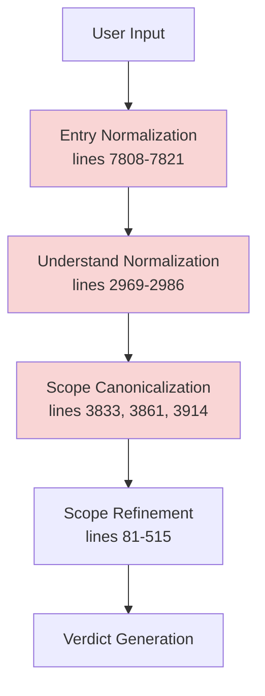
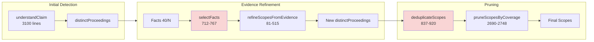
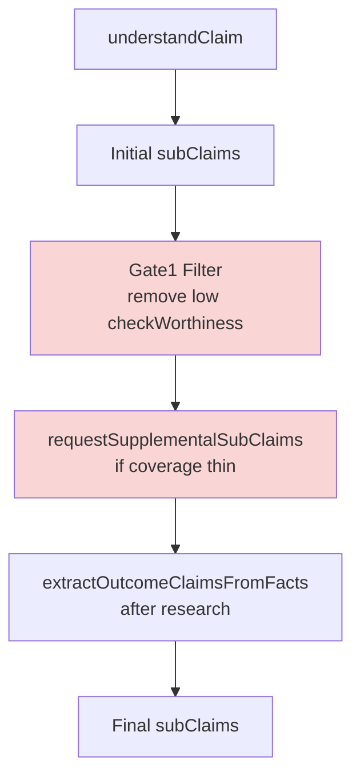
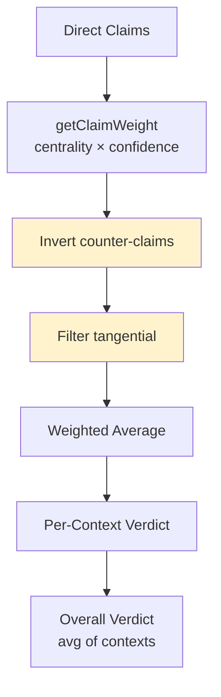
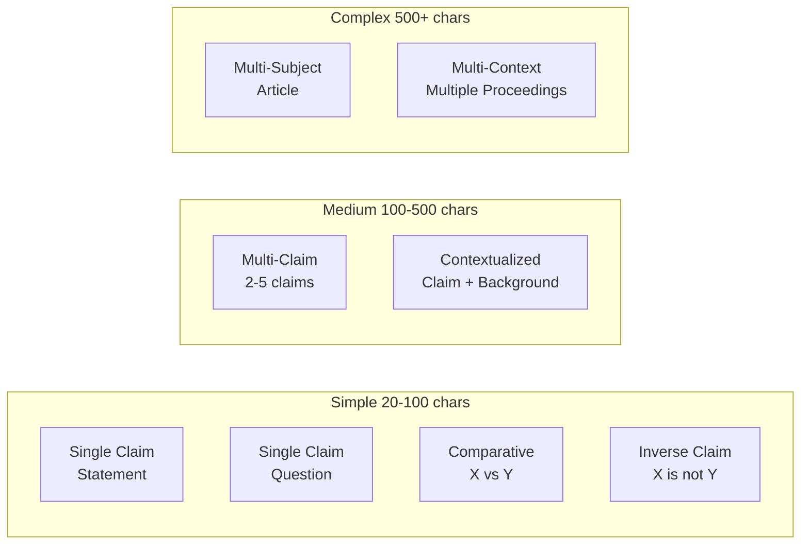
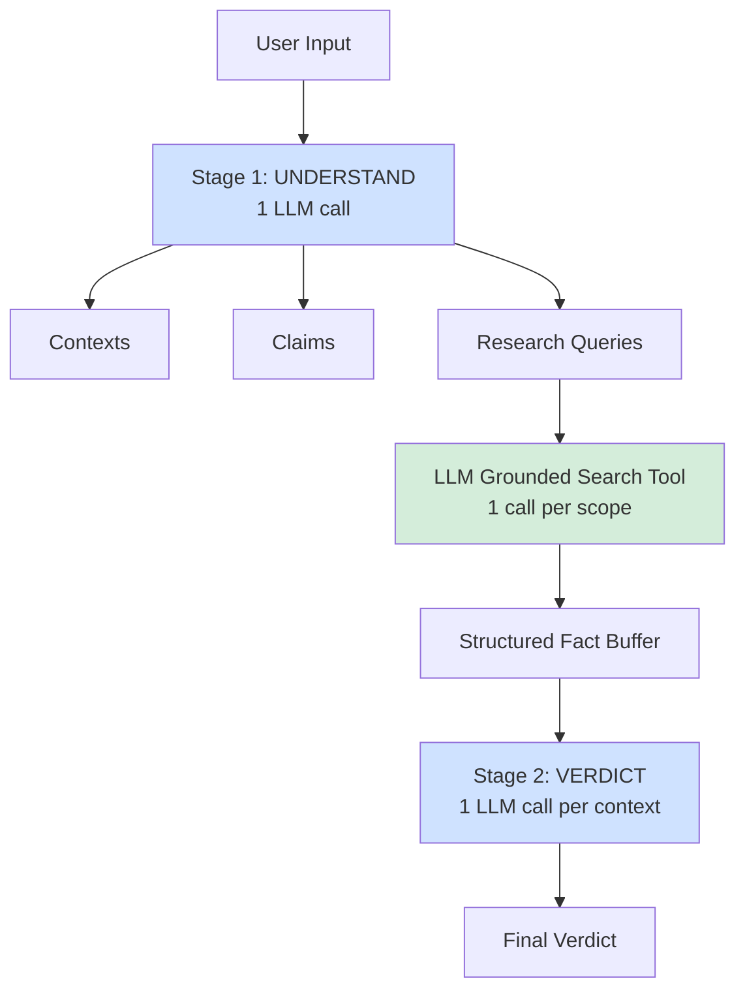

# Pipeline Redesign — History, Alternatives, and Decisions

**Last Updated**: 2026-01-17  
**Purpose**: Consolidated historical record of the FactHarbor Pipeline Redesign: what changed, what alternatives were considered (with diagrams), and what decisions were made.  
**Companion (current state)**: `Docs/ARCHITECTURE/Pipeline_Redesign_Current_Architecture.md`

---

## Summary (what this redesign is)

FactHarbor’s analysis pipeline was redesigned to address:
- **Input neutrality failures** (question vs statement causing materially different scopes/claims/verdicts)
- **Scope loss / scope contamination** in multi-scope workloads
- **Evidence provenance** (blocking synthetic “evidence”)
- **p95 safety** (bounded research budgets, predictable tail latency)

The architectural end state is **Option D: Code-Orchestrated Native Research** (TypeScript orchestrator keeps stage boundaries; research is provenance-safe and fails closed).

---

## Timeline (chronology)

- **2026-01-16**: Root-cause analysis and redesign plan authored (Option D chosen; Option A deferred).  
  Prior artifacts (now consolidated into this history doc): `Pipeline_Redesign_Plan_2026-01-16.md`, `Pipeline_Redesign_Deep_Review_Report_2026-01-16.md`, `Implementation_Feasibility_Audit_Report.md`, `Plan_Review_Guide_2026-01-16.md`.

- **2026-01-16**: Implementation PRs 0–6 executed (tests, normalization cleanup, deterministic scope IDs, Gate1-lite, provenance validation, budgets).  
  Prior artifacts (now consolidated into this history doc): `Pipeline_Redesign_Implementation_Report.md`, `Pipeline_Redesign_PR0-PR2_Implementation_Summary.md`, `PR3_Deterministic_Scope_IDs_Summary.md`, `PR5_Grounded_Research_Provenance_Summary.md`, `PR6_p95_Hardening_Implementation_Summary.md`.

- **2026-01-17**: Principal Architect blockers A–F resolved via targeted fixes (ground realism hardening, score normalization + clamping, global budget fix, Gate1-lite ordering, CTX_UNSCOPED aggregation exclusion).  
  Prior artifact (now consolidated into this history doc): `Blocker_Resolution_Implementation_Report_2026-01-17.md`.

---

## Root causes (as diagnosed)

### 1) Input normalization cascade failures (diagram)



### 2) Scope detection fragility (diagram)



### 3) Claim generation inconsistency (diagram)



### 4) Verdict calculation complexity (diagram)



### 5) Input taxonomy (diagram)



---

## Alternatives considered (and why)

### Option A — Monolithic LLM-driven orchestration (deferred)
**Idea**: collapse multiple stages into a single long-running model interaction with tool calls.

**Why deferred** (from adversarial audit / deep review):
- token trap (quadratic history reinjection risk)
- scope contamination in multi-scope inputs (attention sink)
- “black box” UX (weak progress telemetry)

### Option B — Hybrid pipeline (considered)
**Idea**: simplified 3-stage pipeline with optional LLM-native search behind strict guardrails + fallback.

### Option C — Minimal changes (considered)
**Idea**: patch specific bugs while keeping architecture largely intact.

### Option D — Code-orchestrated native research (selected)



**Reason for selection**: preserve stage boundaries and deterministic control in code while still benefiting from provider-native search capabilities when (and only when) they are provenance-safe.

---

## Major decisions (what we chose)

- **D0: Governance / invariants**: preserve Understand → Research → Verdict; multi-scope detection; Gate 1 + Gate 4; input neutrality **≤ 4 points** avg absolute; generic-by-design.
- **D1: Ground Realism**: evidence must come from fetched sources (real HTTP(S) URLs + excerpts); fail closed (fallback to standard search if grounding metadata/citations absent).
- **D2: Gate 1 timing**: do **not** move full Gate1 post-research until supplemental coverage logic is safe; implement **Gate1-lite** pre-filter + full Gate1 post-research.
- **D3: Deterministic scope IDs**: hash-based IDs to stabilize regression testing.
- **D4: p95 hardening**: enforce global iteration budgets; token tracking is desirable but secondary to iteration caps.
- **D5: `CTX_UNSCOPED` governance**: display-only; must not influence overall verdict aggregation.
- **D6: trackRecordScore scale**: normalize to 0–1; clamp truthPercentage to [0,100] defensively.

---

## What changed (implementation summary)

### PR 0–2 (tests + normalization contract + scope preservation tests)
Key outcomes:
- neutrality regression harness
- scope preservation and adversarial scope-leak tests
- contract that normalization happens once at entry

### PR 3 (deterministic scope IDs)
Key outcomes:
- stable IDs for regression comparisons under deterministic mode

### PR 4-lite (Gate1-lite)
Key outcomes:
- minimal pre-filter to avoid breaking supplemental coverage accounting

### PR 5 (provenance validation)
Key outcomes:
- filter facts by provenance (real URL + non-trivial excerpt)

### PR 6 (budgets / p95 hardening)
Key outcomes:
- iteration-based budgeting with early termination to prevent runaway costs

### 2026-01-17 blocker fixes (A–F)
Key outcomes:
- grounded mode fetches URL candidates; no synthetic response evidence
- trackRecordScore normalization + truth clamping
- global budget cap fix (no accidental 3-iteration total limit)
- Gate1-lite ordering before supplemental claims
- explicit exclusion of `CTX_UNSCOPED` from verdict calculations

---

## Implementation ledger (PRs, commits, and what changed)

This ledger is the consolidated replacement for the prior PR summaries and implementation reports.

| Area | What changed | Commit(s) |
|---|---|---|
| **PR 0** | Regression harness: neutrality, scope preservation, adversarial scope leak tests | `28a94cd` |
| **PR 1** | Single normalization point + contract tests | `354d86e` |
| **PR 3** | Deterministic scope IDs | `c1b18b9` |
| **PR 4-lite** | Gate1-lite (minimal pre-filter) | `14ac9bd` |
| **PR 5** | Provenance validation + integration | `e5e668b`, `2743a76` |
| **PR 6** | Budgets + p95 hardening foundation | `1b0327d`, `578e77b`, `403f3f7` |
| **Blocker D** | Fix global iteration semantics (avoid accidental 3-iteration total cap) | `ec695ec` |
| **Blocker C** | Normalize `trackRecordScore` (0–1) + clamp truthPercentage defensively | `9864911` |
| **Blocker A/B** | Ground realism hardening: grounded results treated as URL candidates and fetched | `a0a1960` |
| **Blocker E** | Gate1-lite ordering before supplemental claims | `d365b1e` |
| **Blocker F** | Exclude `CTX_UNSCOPED` from verdict calculations | `691a6ba` |

---

## Architecture before/after (historical diagrams)

### Before (high-level)

```
┌─────────────────────────────────────────────────────────────┐
│                    INPUT (Claim/Question)                   │
└────────────────────┬────────────────────────────────────────┘
                     ▼
┌─────────────────────────────────────────────────────────────┐
│              Normalization (DUPLICATED)                     │
│  - Entry normalization                                      │
│  - understandClaim normalization (redundant)                │
└────────────────────┬────────────────────────────────────────┘
                     ▼
┌─────────────────────────────────────────────────────────────┐
│              Research loop (no hard budgets)                │
└────────────────────┬────────────────────────────────────────┘
                     ▼
┌─────────────────────────────────────────────────────────────┐
│              Fact extraction (no provenance gate)           │
└────────────────────┬────────────────────────────────────────┘
                     ▼
┌─────────────────────────────────────────────────────────────┐
│              Verdict generation                             │
└─────────────────────────────────────────────────────────────┘
```

### After (high-level)

```
┌─────────────────────────────────────────────────────────────┐
│                    INPUT (Claim/Question)                   │
└────────────────────┬────────────────────────────────────────┘
                     ▼
┌─────────────────────────────────────────────────────────────┐
│         Normalization (SINGLE POINT)                        │
└────────────────────┬────────────────────────────────────────┘
                     ▼
┌─────────────────────────────────────────────────────────────┐
│         Budget initialization + enforcement                 │
└────────────────────┬────────────────────────────────────────┘
                     ▼
┌─────────────────────────────────────────────────────────────┐
│         Gate1-lite (minimal pre-filter)                     │
└────────────────────┬────────────────────────────────────────┘
                     ▼
┌─────────────────────────────────────────────────────────────┐
│         Research loop (budgeted)                            │
│         - standard search OR grounded URL candidates         │
│         - fetch sources → extract facts                      │
└────────────────────┬────────────────────────────────────────┘
                     ▼
┌─────────────────────────────────────────────────────────────┐
│         Provenance validation (fail closed)                 │
└────────────────────┬────────────────────────────────────────┘
                     ▼
┌─────────────────────────────────────────────────────────────┐
│         Verdict generation (excludes CTX_UNSCOPED)           │
└─────────────────────────────────────────────────────────────┘
```

---

## Obsolete files removed by this consolidation

The following doc set was consolidated into this history doc and the current-architecture doc, then deleted to prevent future contradictions:
- `Docs/DEVELOPMENT/Pipeline_Redesign_Plan_2026-01-16.md`
- `Docs/DEVELOPMENT/Pipeline_Redesign_Deep_Review_Report_2026-01-16.md`
- `Docs/DEVELOPMENT/Implementation_Feasibility_Audit_Report.md`
- `Docs/DEVELOPMENT/Plan_Review_Guide_2026-01-16.md`
- `Docs/DEVELOPMENT/Analysis_Session_Summary_2026-01-16.md`
- `Docs/DEVELOPMENT/Day_0_Scope_ID_Audit_Report.md`
- `Docs/DEVELOPMENT/Pipeline_Redesign_Implementation_Report.md`
- `Docs/DEVELOPMENT/Pipeline_Redesign_Implementation_Plan.md`
- `Docs/DEVELOPMENT/Pipeline_Redesign_Review_Guide.md`
- `Docs/DEVELOPMENT/Start_Pipeline_Redesign_Implementation.md`
- `Docs/DEVELOPMENT/Handover_Pipeline_Redesign_Implementation.md`
- `Docs/DEVELOPMENT/Pipeline_Redesign_Principal_Architect_Review_2026-01-16.md`
- `Docs/DEVELOPMENT/Pipeline_Redesign_PR0-PR2_Implementation_Summary.md`
- `Docs/DEVELOPMENT/PR3_Deterministic_Scope_IDs_Summary.md`
- `Docs/DEVELOPMENT/PR5_Grounded_Research_Provenance_Summary.md`
- `Docs/DEVELOPMENT/PR6_p95_Hardening_Plan.md`
- `Docs/DEVELOPMENT/PR6_p95_Hardening_Implementation_Summary.md`
- `Docs/DEVELOPMENT/Blocker_Resolution_Implementation_Report_2026-01-17.md`

This is an intentional “single source” move: future edits should happen in only:
- `Docs/DEVELOPMENT/Pipeline_Redesign_History.md`
- `Docs/ARCHITECTURE/Pipeline_Redesign_Current_Architecture.md`

---

## Current “known limits” (historical record)

- Provider “true grounding” depends on SDK/provider metadata availability; fallback is required.
- Token tracking is partial; iteration budgeting is the primary enforced safety mechanism.
- Some operational flags discussed in planning docs were proposed but not implemented everywhere (treat flags as code-defined, not doc-defined).

