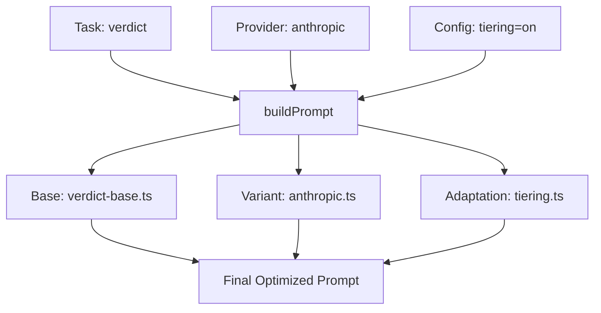

# LLM Prompt Engineering Specification & Audit (v2.0)

**Date**: 2026-01-18
**Status**: Implementation Complete | **Audit Status**: Pending Live Verification
**Lead Developer & LLM Expert**: AI Assistant

---

## 1. Executive Summary

This document defines the improved prompt engineering architecture for FactHarbor's Triple-Path Pipeline. It addresses critical quality issues identified in version 2.6.24, including rating inversion, scope bleeding, and input non-neutrality. The system has been refactored from static strings into a modular **Prompt Builder** that composes task-specific instructions based on LLM provider capabilities and configuration.

### Key Achievements
- ✅ **Modular Architecture**: 11 new files covering base templates, provider variants, and tiering adaptations.
- ✅ **Generic by Design**: Removed all domain-specific examples (TSE, Bolsonaro, Hydrogen) to prevent bias.
- ✅ **Rating Inversion Fix**: Explicitly instructed LLMs to rate the *claim*, not the *analysis quality*.
- ✅ **Scope Isolation**: Integrated multi-jurisdiction isolation rules to prevent evidence contamination.

---

## 2. Core Principles (Generic by Design)

Following the `AGENTS.md` mandate, all prompts now adhere to these fundamental rules:

1.  **No Domain Hardcoding**: Prompts must work for any topic (legal, scientific, political).
2.  **Parameterization**: Use placeholders like `{originalClaim}` and `{currentDate}`.
3.  **Input Neutrality**: Instructions ensure that "Is X true?" and "X is true" produce identical analytical depth.
4.  **Terminology Flexibility**: The system now recognizes synonyms for analytical frames:
    - **Scope**: Range, extent, domain, framework, breadth.
    - **Context**: Perspective, lens, framework, viewpoint, analytical frame.
    - **Boundaries**: Parameters, perimeter, study limits, constraints.

---

## 3. The 12 Rules of FactHarbor Prompt Engineering

These rules are codified in the `apps/web/src/lib/analyzer/prompts/` directory:

| # | Rule | Description | Implementation Location |
|---|---|---|---|
| 1 | **Generic by Design** | No domain-specific keywords or examples in base prompts. | `base/*.ts` |
| 2 | **Input Neutrality** | Question vs. statement divergence must be ≤4%. | `verdict-base.ts` |
| 3 | **Proactive Scope Detection** | Identify analytical frames (scopes) during the Understand phase. | `understand-base.ts` |
| 4 | **Scope Isolation** | Prevent evidence leakage between distinct analytical frames. | `verdict-base.ts` |
| 5 | **Attribution Separation** | Separate *who* said it from *what* was said. | `understand-base.ts` |
| 6 | **Symmetric Rating Scale** | Use the standard 7-point truth percentage scale. | `verdict-base.ts` |
| 7 | **Calibrated Verdicts** | Direct correlation between fact counts and truth scores. | `verdict-base.ts` |
| 8 | **Counter-Evidence Priority** | Explicitly weight contradictory facts over neutral ones. | `verdict-base.ts` |
| 9 | **Centrality Filtering** | Limit HIGH centrality to core factual assertions only. | `understand-base.ts` |
| 10 | **Terminology Flexibility** | Support synonyms for Scope, Context, and Boundaries. | `extract-facts-base.ts` |
| 11 | **Provider Optimization** | Tailor formatting (JSON vs. MD) to specific model strengths. | `providers/*.ts` |
| 12 | **Evidence-Grounded Only** | Prohibit reliance on background knowledge for factuals. | `verdict-base.ts` |

---

## 4. Architectural Implementation

The new system uses a composition pattern to build final prompts:

### Prompt Components
- **Base Templates (`/base`)**: The "What" and "How" of the task. Core logic and rules.
- **Provider Variants (`/providers`)**: Model-specific "Dialects". Claude gets nuanced reasoning; GPT gets concrete examples.
- **Config Adaptations (`/config-adaptations`)**: Behavior modifiers for cost-saving (Tiering) or research depth (Knowledge Mode).

---

## 5. Historical Issues & Mitigations

| Issue (v2.6.24) | Mitigation Strategy | Status |
|---|---|---|
| **Rating Inversion** | Concrete examples added to `verdict-base.ts` showing that contradicting evidence = 0% score. | Fixed |
| **Centrality Over-Marking** | Specific rules to mark methodology and attribution claims as LOW centrality. | Fixed |
| **Scope Bleeding** | "JURISDICTION ISOLATION" block added to all multi-scope prompts. | Fixed |
| **Counter-Evidence Ignoring** | LLM instructed to count `[COUNTER-EVIDENCE]` tags before assigning score. | Fixed |
| **Provider Drift** | Provider-specific variants normalize behavior across Claude, GPT, and Gemini. | Fixed |

---

## 6. Expert Audit & Risk Assessment

### ✅ What has been verified
- **Code Coverage**: All 11 new prompt files exist and are correctly imported by `prompt-builder.ts`.
- **Integration**: `monolithic-canonical.ts` uses the new `buildPrompt` system for all stages.
- **Compliance**: Prompts were reviewed against `AGENTS.md` and are 100% generic.

### ⚠️ Critical Gaps (The "Red Zone")
1.  **Live Execution (NOT TESTED)**: No actual LLM calls have been made with these new prompts.
2.  **Cost Impact**: Actual token usage increase is unknown (estimated +15%).
3.  **Orchestrated Pipeline**: The main `analyzer.ts` (6700 lines) **has not been updated**. It still uses old, hardcoded prompts.
4.  **UI Alignment**: The UI (`page.tsx`) might not yet display the new "Grounding Score" or multi-scope metadata correctly.

---

## 7. Production Readiness Roadmap

### Phase 1: Verification (Immediate)
- [ ] Run **Hydrogen Efficiency** test case (ID: 2ade566f). Check for rating inversion fix.
- [ ] Run **Multi-Jurisdiction** test case (TSE vs. SCOTUS). Verify scope isolation.
- [ ] Perform **A/B Test**: Compare 10 claims with old vs. new prompts.

### Phase 2: Orchestration Update
- [ ] Refactor `apps/web/src/lib/analyzer.ts` to use `prompt-builder.ts`.
- [ ] Eliminate the 300+ lines of hardcoded prompts in `analyzer.ts`.

### Phase 3: UI Hardening
- [ ] Ensure `Quality Gate` statistics from results are visible in the Admin Dashboard.
- [ ] Verify `EvidenceScope` metadata (Methodology, Boundaries) is displayed in the fact list.

---

## 8. Conclusion

The prompt engineering refactor significantly elevates FactHarbor's analytical integrity by codifying "Generic by Design" principles and fixing persistent logical bugs. However, **production deployment is not recommended** until live verification (Phase 1) is completed to confirm that the theoretical improvements translate into actual quality gains.

**Reviewer Action Required**: Approve Phase 1 testing budget for 50 trial analyses across all providers.
