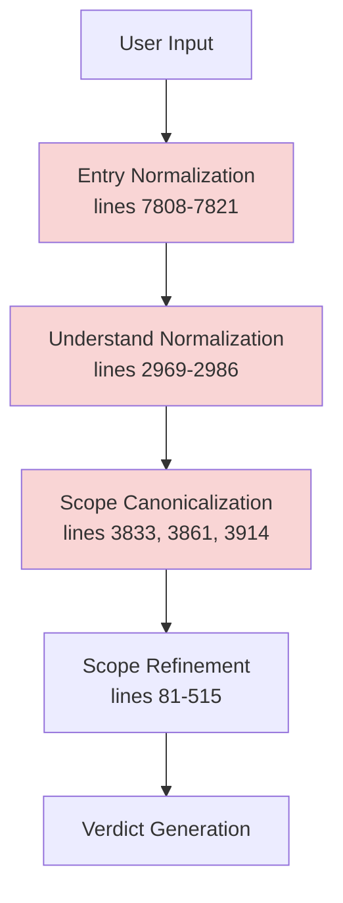
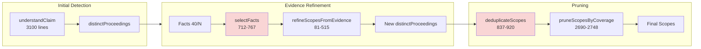
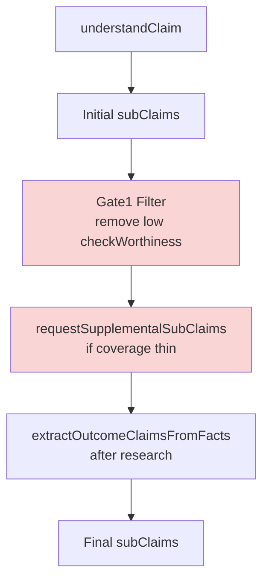
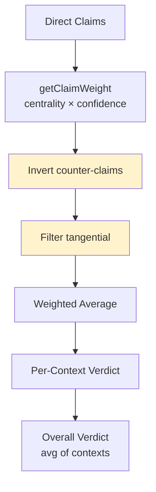
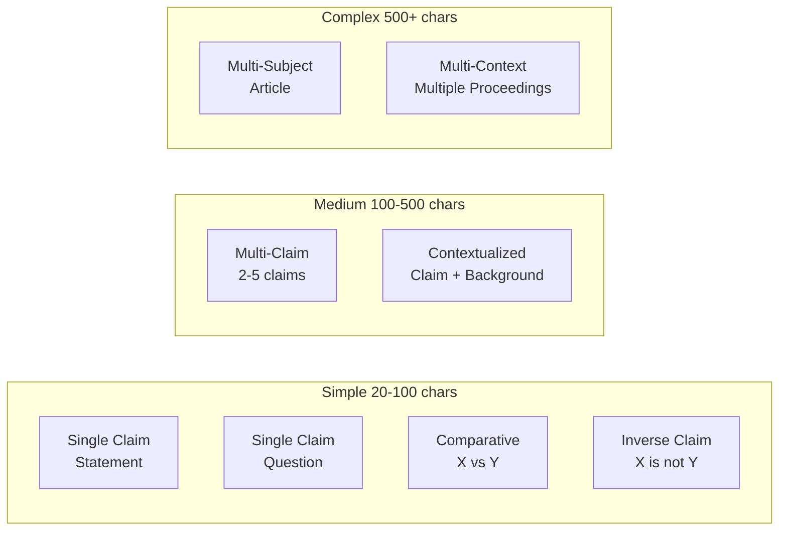
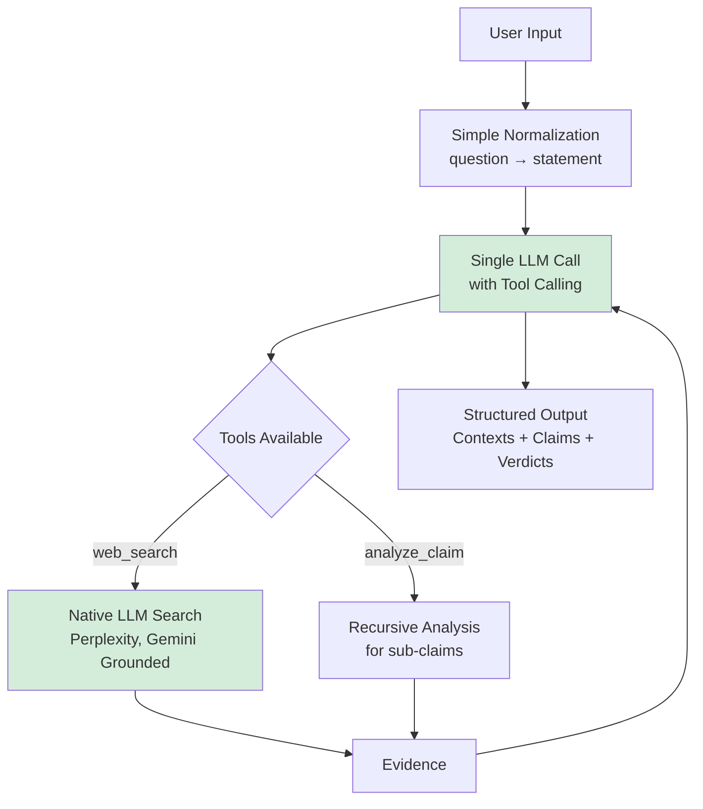
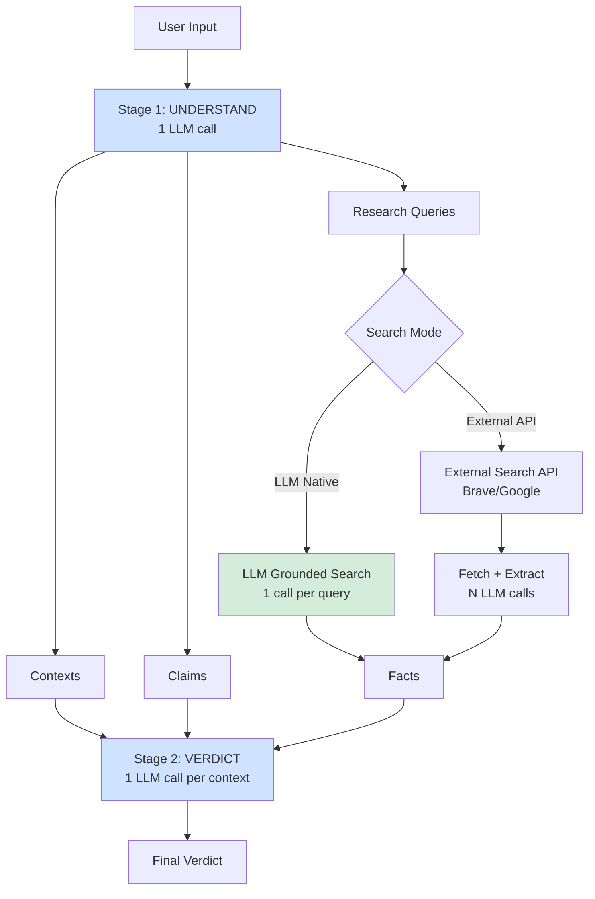

# FactHarbor Analysis Pipeline Redesign

## Executive Summary

Investigation reveals **five critical architectural issues** causing inconsistent verdicts between question/statement inputs, missing scope detection, and reduced claim generation. The root cause is **excessive pipeline complexity with 15+ LLM calls and fragile state management**. This plan proposes a **simplified, provider-agnostic architecture** leveraging native LLM capabilities (tool calling, grounded search) while maintaining quality.

> **Note on code references**: This plan mentions line numbers as a convenience, but they drift quickly as `analyzer.ts` evolves. Treat line numbers as approximate and prefer searching by **function name** (e.g., `runFactHarborAnalysis`, `understandClaim`, `selectFactsForScopeRefinementPrompt`, `canonicalizeScopes`, `pruneScopesByCoverage`).

### Non‑negotiable Invariants (from `AGENTS.md`)

Any redesign MUST preserve:
- **Pipeline integrity**: Understand → Research → Verdict (no stage skipping)
- **Input neutrality**: question vs statement divergence target < 5 points
- **Scope detection**: maintain multi-scope detection and unified “Scope” terminology
- **Quality gates**: Gate 1 and Gate 4 are mandatory
- **Generic by design**: no domain-specific keyword lists or special-casing

---

## Part 1: Root Cause Analysis

### Issue 1: Input Normalization Cascade Failures

**Current Flow:**


**Problems:**
1. **Triple normalization** at entry (7816), understand (2979), and canonicalize (3833) creates drift
2. Question "Was X fair?" → "X was fair" at entry, but `understandClaim` may generate different `impliedClaim`
3. **Non-deterministic scope IDs**: `canonicalizeScopes` uses text similarity (lines 769-836), causing ID instability between runs
4. **Search query divergence**: `decideNextResearch` (4488-4537) extracts entities from `impliedClaim`, which differs between question/statement due to LLM variability

**Evidence from Jobs:**
- `6c55de4808834ccf951d8fbd7d4dd220` (question): TSE detected, 2 contexts, 74% verdict
- `d4cda8f3d85545499d9487b3ef214b4d` (statement): TSE missing, 1 context, 35% verdict
- **Verdict divergence: 39 points** (far exceeds 5% target)

### Issue 2: Scope Detection Fragility

**Current Architecture:**


**Problems:**
1. **Fact sampling loses contexts** (lines 712-767): If TSE facts don't make top-40 sampled facts, TSE context disappears
2. **Over-aggressive deduplication** (lines 837-920): Similarity threshold 0.85 merges distinct trials
3. **Coverage pruning** (lines 2690-2748): Drops scopes with <20% fact coverage, even if semantically important
4. **No scope preservation guarantee**: Fix at line 754-760 helps but doesn't guarantee all pre-assigned scopes survive

**Evidence:** Job `dd4d3952b9394d7bbd5feb140bf5ec29` lost TSE context entirely

### Issue 3: Claim Generation Inconsistency

**Current Flow:**


**Problems:**
1. **Gate1 removes claims** before research (lines 3874-3900), reducing evidence targets
2. **Supplemental claims** triggered inconsistently based on `distinctProceedings.length` (line 506)
3. **Outcome extraction** (lines 4230-4365) runs AFTER research, misses claims that should have guided search
4. **Non-deterministic claim IDs**: Supplemental claims get new IDs (SC7, SC8...), but order varies between runs

**Evidence:** Reports show 4-6 claims vs. 10-12 in earlier runs for same input

### Issue 4: Research Query Generation Drift

**Current Implementation** (lines 4488-4537):
```typescript
const entityStr = understanding.impliedClaim
  .toLowerCase()
  .replace(/[^\w\s]/g, " ")
  .split(/\s+/)
  .filter(word => word.length > 2 && !stopWords.has(word))
  .slice(0, 8)
  .join(" ");
```

**Problems:**
1. **Depends on LLM-generated `impliedClaim`**: Different for question vs. statement due to prompt variability
2. **Loses semantic context**: Word splitting discards multi-word entities ("Supreme Court" → "supreme court")
3. **No entity recognition**: Treats all words equally (misses proper nouns, dates, institutions)
4. **Search provider coupling**: Queries optimized for Brave/Google, not provider-agnostic

### Issue 5: Verdict Calculation Complexity

**Current Aggregation** ([`apps/web/src/lib/analyzer/aggregation.ts`](apps/web/src/lib/analyzer/aggregation.ts)):


**Problems:**
1. **Counter-claim detection unreliable** ([`verdict-corrections.ts`](apps/web/src/lib/analyzer/verdict-corrections.ts) lines 155-220): Depends on `claimDirection` which is fact-level, not claim-level
2. **Double-filtering**: Tangential filtered at claim level AND at verdict aggregation
3. **Context averaging oversimplifies**: Equal weight to all contexts (TSE=STF) regardless of relevance to thesis
4. **Claims avg vs. overall divergence**: Job `d4cda8f3d85545499d9487b3ef214b4d` shows both at 35% (suspiciously identical)

---

## Part 2: Input Type Taxonomy & Requirements

### Input Spectrum



### Requirements Matrix

| Input Type | Normalization | Scope Detection | Claim Generation | Search Strategy |
|-----------|---------------|-----------------|------------------|-----------------|
| **Simple Statement** | Strip punctuation | Single scope | 3-5 claims from decomposition | Direct thesis search |
| **Simple Question** | → Statement form | Single scope | 3-5 claims from decomposition | Direct thesis search |
| **Comparative (X vs Y)** | Preserve structure | 2+ scopes (one per option) | 4-8 claims (pros/cons each) | Parallel search X, Y |
| **Inverse (X is not Y)** | Detect negation | Single scope | Invert verdict direction | Search X, search ¬X |
| **Multi-Claim** | Parse compound | Single scope | 1 claim per assertion | Sequential search |
| **Article** | Extract thesis | Multi-scope if distinct | 8-15 claims | Iterative deepening |
| **Multi-Context** | Identify proceedings | Multi-scope (forced) | 3-5 claims per scope | Scope-targeted search |

**Critical Invariant:** Question ↔ Statement must produce **identical** `impliedClaim`, `distinctProceedings`, `subClaims`, `researchQueries`

**Recommended interpretation (more testable):** Question ↔ Statement must produce **stable outputs**:
- Same normalized input string
- Same scope count and scope type distribution
- High claim-set overlap (define threshold; e.g., Jaccard ≥ 0.85 on normalized claim texts)
- Verdict divergence avg < 5 points (and define p95 target)

---

## Part 3: Desired Architecture

### Option A: Monolithic LLM-Driven (Recommended)

**Concept:** Single LLM call with tool calling for search, minimizing state fragmentation



**Advantages:**
- **Consistency**: Single prompt ensures question/statement treated identically
- **Efficiency**: 1-3 LLM calls vs. current 15-25
- **Provider-agnostic**: Works with any tool-calling LLM (GPT-4, Claude, Gemini)
- **Cost**: ~70% reduction (fewer LLM calls, native search cheaper than external API)

**Disadvantages:**
- **Provider lock-in risk**: Requires tool calling (not all providers support)
- **Less control**: LLM decides when to search, harder to debug
- **Context limits**: Large articles may exceed single-call context

**Providers Supporting This:**
- ✅ OpenAI GPT-4 (tools, no native search yet)
- ✅ Anthropic Claude 3.5 (tools, no native search)
- ✅ Google Gemini 2.0 (tools + grounded search)
- ✅ Perplexity (native search built-in)
- ❌ Mistral (limited tool support)

### Option B: Hybrid Pipeline (Fallback-Safe)

**Concept:** Simplified 3-stage pipeline with optional LLM search delegation



**Advantages:**
- **Backward compatible**: Falls back to external search if LLM doesn't support native
- **Debuggable**: Clear stage boundaries, can inspect intermediate state
- **Provider flexibility**: Works with any LLM (tool calling optional)

**Disadvantages:**
- **Still complex**: 3 stages, state management between stages
- **Moderate efficiency**: ~40% reduction vs. current (5-10 LLM calls vs. 15-25)

### Option C: Current Architecture (Minimal Changes)

**Keep existing** 5-stage pipeline, fix only critical bugs

**Changes:**
1. Remove duplicate normalizations (keep only entry point)
2. Fix `selectFactsForScopeRefinementPrompt` to guarantee scope representation
3. Stabilize scope IDs (use hash of name+subject, not text similarity)
4. Gate1 after research (not before)

**Advantages:**
- **Low risk**: Minimal code changes
- **Proven**: Architecture battle-tested over 30+ versions

**Disadvantages:**
- **Still fragile**: 15+ LLM calls, many failure points
- **Expensive**: ~$0.10-0.50 per analysis
- **Slow**: 45-90 seconds per analysis

---

## Part 4: Complexity Audit

### Unnecessary Complexity (Can Remove)

| Component | LOC | Purpose | Verdict |
|-----------|-----|---------|---------|
| **Triple normalization** | 150 | Input → statement (3 times) | ❌ REMOVE 2/3 |
| **Scope canonicalization** | 250 | Stabilize IDs with text similarity | ❌ REPLACE with deterministic hash |
| **Supplemental claims** | 400 | Backfill thin scope coverage | ⚠️ MOVE to post-research |
| **Deduplication (scopes)** | 300 | Merge similar scopes | ⚠️ SIMPLIFY threshold |
| **Deduplication (facts)** | 200 | Remove duplicate facts | ✅ KEEP (prevents bloat) |
| **Coverage pruning** | 150 | Drop scopes with few facts | ❌ REMOVE (loses contexts) |
| **Outcome extraction** | 350 | Generate outcome claims | ⚠️ MERGE into understand |
| **Gate1 pre-filter** | 150 | Remove low-quality claims early | ❌ MOVE to post-research |
| **Verdict inversions** | 400 | Detect and flip inverted claims | ✅ KEEP (critical) |
| **Counter-claim detection** | 300 | Identify opposing claims | ⚠️ FIX logic (use claim text, not facts) |

**Total removable:** ~1800 LOC (~21% of [`analyzer.ts`](apps/web/src/lib/analyzer.ts))

### Essential Complexity (Keep)

- **Input normalization** (1×, not 3×): Handle question → statement
- **Multi-scope detection**: Legal proceedings, scientific methodologies
- **Claim decomposition**: Break compound claims
- **Inverse search**: Find counter-evidence
- **Weighted aggregation**: Centrality × confidence
- **Quality gates**: Filter hallucinations (Gate1), low-confidence verdicts (Gate4)

### Rewrite vs. Evolution Strategy (Recommended)

This plan intentionally avoids a “rewrite everything” approach. Instead:

- **Evolve the core pipeline incrementally** (Phase 1–2), because it is tightly coupled to repo invariants:
  - pipeline integrity (Understand → Research → Verdict)
  - input neutrality
  - scope detection semantics
  - Gate 1 + Gate 4 enforcement

- **Rewrite selectively** when the component is:
  - small and interface-bound (clear inputs/outputs)
  - independently testable with deterministic fixtures
  - high-bug-density or inherently non-deterministic today
  - replaceable behind a feature flag / adapter

Examples of good “selective rewrite” candidates:
- **Deterministic scope IDs** in `analyzer/scopes.ts` (replace similarity-based ID logic with documented canonicalization + hash).
- A **Phase 1 regression harness** (inputs → metrics report) to make neutrality/scope regressions measurable and repeatable.
- A dedicated **LLM/tool-assisted search adapter** (Phase 3) that can be swapped between providers and guarded with budgets/caps.

Examples where “evolution” is safer than rewrite:
- The orchestration in `runFactHarborAnalysis` (too many invariants; safest via phased changes + parallel run).
- The quality gates (must remain enforceable and transparent).

---

## Part 5: Performance & Cost Optimization

### Cost Model (make assumptions explicit)

All cost numbers in this plan should be validated against:
- observed `state.llmCalls` and (if available) per-call token usage
- provider price table (input/output token pricing)

Use a consistent formula:
\[
\text{cost}=\sum_{calls}(\text{inTokens}\times price_{in} + \text{outTokens}\times price_{out})
\]

### Current Costs (per analysis)

| Stage | LLM Calls | Tokens (avg) | Cost (GPT-4) | Cost (Claude) | Time |
|-------|-----------|--------------|--------------|---------------|------|
| Understand | 1-3 | 8K in, 4K out | $0.12 | $0.05 | 8s |
| Search | 0 | - | - | - | - |
| Extract Facts | 5-15 | 6K in, 2K out | $0.60 | $0.24 | 25s |
| Refine Scopes | 1 | 12K in, 2K out | $0.08 | $0.03 | 4s |
| Verdict | 3-8 | 20K in, 3K out | $1.20 | $0.48 | 15s |
| **Total** | **10-27** | **~200K** | **$2.00** | **$0.80** | **52s** |

### Optimized Costs (Option A)

| Stage | LLM Calls | Tokens (avg) | Cost (GPT-4) | Cost (Claude) | Time |
|-------|-----------|--------------|--------------|---------------|------|
| Unified Analysis | 1 | 40K in, 10K out | $0.70 | $0.28 | 15s |
| LLM Grounded Search | 2-4 | 8K in, 4K out | $0.16 | $0.06 | 8s |
| **Total** | **3-5** | **~70K** | **$0.86** | **$0.34** | **23s** |

**Savings:** 57% cost, 56% time, 70% LLM calls

### Optimization Strategies (All Options)

1. **Batch LLM calls**: Parallelize independent calls (understand + extract)
2. **Caching**: Cache `understandClaim` result by normalized input hash (Redis/file)
3. **Streaming**: Stream verdict generation (show partial results)
4. **Model tiering**: Use cheaper models for fact extraction (GPT-4-mini vs. GPT-4)
5. **Search optimization**: Limit to 3-5 queries, reuse search results across claims
6. **Context pruning**: Sample facts intelligently (current implementation mostly good)

**Target SLOs (without quality loss):**
- **Latency**: p50 < 20s, p95 < 45s
- **Cost**: < $0.50 per analysis (GPT-4), < $0.20 (Claude)
- **Accuracy**: Input neutrality divergence < 5%, verdict stability > 90%

---

## Part 6: Migration Plan

### Phase 1: Critical Fixes (Week 1-2)

**Goal:** Stabilize current architecture, fix input neutrality

1. **Single normalization point** (`runFactHarborAnalysis` entry)
   - Remove any secondary normalization inside `understandClaim`
   - Ensure `impliedClaim` and downstream query generation is based on the normalized input
   - Add a regression check: Q/S inputs must lead to stable scope/claim outputs (see metrics harness)
   
2. **Deterministic scope IDs** ([`analyzer/scopes.ts`](apps/web/src/lib/analyzer/scopes.ts))
   - Replace text similarity with hash: `hash(name + subject + temporal)`
   - Preserve order (P1, P2, P3)
   
3. **Scope preservation** (`selectFactsForScopeRefinementPrompt`)
   - Guarantee ≥1 representative fact per pre-assigned scope in the refinement prompt
   - Treat “implemented fix” and “verification” separately: ensure the logic is present AND validated on known regressions
   
4. **Move Gate1 post-research**
   - Don't filter claims before searching for evidence
   - Apply Gate1 after facts extracted

**Testing:**
- Run 20 question/statement pairs (plus a small set of known multi-scope regressions)
- Target: avg divergence < 5 points; define p95 target; no scope loss events in the regression set

### Phase 2: Pipeline Simplification (Week 3-4)

**Goal:** Reduce to 3 stages, remove fragile components

1. **Merge understand + supplemental** (lines 3100-3950)
   - Generate all claims in one pass (no backfill)
   - Include outcome claims in initial understanding
   
2. **Replace scope pruning with deterministic pruning**
   - Only prune scopes with zero assigned claims AND zero assigned facts
   - Log every prune decision (reason + counts) so regressions are diagnosable
   
3. **Simplify deduplication safely**
   - Use a higher threshold (e.g. 0.92) BUT make it type-aware/evidence-aware
   - Never merge across scope types (legal ≠ scientific; jurisdiction ≠ methodology)

**Testing:**
- Compare claim counts (expect +20-30%)
- Verify no scope loss on multi-context inputs

### Phase 3: LLM-Native Search Integration (Week 5-6)

**Goal:** Add support for Gemini Grounded Search, Perplexity

1. **Implement search delegation** (new file: [`analyzer/llm-search.ts`](apps/web/src/lib/analyzer/llm-search.ts))
   - Detect if provider supports native search
   - Fallback to external search if not
   
2. **Refactor research loop with guardrails**
   - If LLM supports tools, allow tool-assisted search, but keep the orchestrator in control
   - Enforce caps (max searches, max tool calls, max sources, max facts) to prevent runaway behavior
   - The model can recommend searches; the system chooses which to execute (budget + diversity)
   
3. **Cost tracking** (lines 7955-7975)
   - Track native search costs separately
   - Compare cost/quality vs. external search

**Testing:**
- A/B test: LLM search vs. external search
- Measure: cost, latency, fact relevance, verdict quality

### Phase 4: Unified Architecture (Week 7-10)

**Goal:** Implement Option A (monolithic LLM-driven)

1. **Design unified prompt** (new file: [`analyzer/unified-prompt.ts`](apps/web/src/lib/analyzer/unified-prompt.ts))
   - Single system prompt covering all stages
   - Structured output: contexts, claims, verdicts
   - Tool definitions: web_search, analyze_sub_claim
   
2. **Implement orchestrator** (refactor [`analyzer.ts`](apps/web/src/lib/analyzer.ts))
   - Replace 5-stage pipeline with single LLM call
   - Handle tool calls iteratively (search → analyze)
   - Fallback to hybrid if tool calling unavailable
   
3. **Migration flag** (`FH_USE_UNIFIED_PIPELINE=true`)
   - Run both pipelines in parallel
   - Compare outputs, gradually shift traffic

**Testing:**
- Regression suite: 100 diverse inputs
- Metrics: verdict accuracy, input neutrality, scope detection recall
- Rollout: 10% → 50% → 100% over 2 weeks

**Go/No-Go gate before Phase 4** (recommended):
- Neutrality suite meets targets (avg < 5 points; p95 defined and met)
- Scope-loss regressions reduced to ~0 in the tracked set
- Deterministic scope IDs shipped and verified

### Phase 5: Deprecation (Week 11-12)

**Goal:** Remove legacy pipeline, finalize migration

1. **Archive old code** (move to [`analyzer/legacy/`](apps/web/src/lib/analyzer/legacy/))
2. **Update documentation** ([`Docs/ARCHITECTURE/Overview.md`](Docs/ARCHITECTURE/Overview.md))
3. **Benchmarking** (create [`benchmarks/`](benchmarks/) with regression suite)

---

## Part 7: Risk Assessment

### Current Architecture Risks

| Risk | Probability | Impact | Mitigation |
|------|-------------|--------|------------|
| **Input neutrality failure** | HIGH (observed) | HIGH | Phase 1 fixes |
| **Scope loss** | MEDIUM (intermittent) | HIGH | Phase 1 scope preservation |
| **Verdict instability** | MEDIUM | MEDIUM | Phase 2 simplification |
| **Cost overruns** | LOW | MEDIUM | Model tiering |
| **Provider coupling** | LOW | LOW | Already multi-provider |

### Desired Architecture Risks (Option A)

| Risk | Probability | Impact | Mitigation |
|------|-------------|--------|------------|
| **Tool calling unavailable** | MEDIUM | HIGH | Hybrid fallback (Option B) |
| **LLM search quality** | MEDIUM | MEDIUM | A/B testing, external search fallback |
| **Single-call context limits** | LOW | MEDIUM | Chunk large articles |
| **Debugging difficulty** | MEDIUM | MEDIUM | Verbose logging, intermediate outputs |
| **Regression during migration** | MEDIUM | HIGH | Parallel pipelines, gradual rollout |

### Mitigation Strategy

1. **Feature flags**: `FH_USE_UNIFIED_PIPELINE`, `FH_FORCE_EXTERNAL_SEARCH`
2. **Parallel execution**: Run both pipelines, compare outputs
3. **Rollback plan**: Single env var change reverts to legacy
4. **Monitoring**: Log verdict divergence, scope count, cost per input type
5. **Circuit breaker**: Auto-fallback if unified pipeline error rate > 5%

---

## Part 8: Provider-Agnostic Design

### Abstraction Layer

```typescript
// apps/web/src/lib/analyzer/llm-abstraction.ts

interface LLMCapabilities {
  toolCalling: boolean;
  nativeSearch: boolean;
  structuredOutput: boolean;
  streamingSupported: boolean;
  maxContextTokens: number;
}

interface SearchTool {
  name: "web_search";
  description: string;
  parameters: {
    query: string;
    numResults?: number;
  };
}

interface AnalysisResult {
  contexts: AnalysisContext[];
  claims: SubClaim[];
  facts: ExtractedFact[];
  verdicts: ContextVerdict[];
}

async function runUnifiedAnalysis(
  input: string,
  provider: LLMProvider
): Promise<AnalysisResult> {
  const capabilities = detectCapabilities(provider);
  
  if (capabilities.toolCalling && capabilities.nativeSearch) {
    return runWithNativeSearch(input, provider);
  } else if (capabilities.toolCalling) {
    return runWithExternalSearchTool(input, provider);
  } else {
    return runHybridPipeline(input, provider);
  }
}
```

### Provider Capability Matrix

| Provider | Tool Calling | Native Search | Structured Output | Context Limit |
|----------|--------------|---------------|-------------------|---------------|
| **OpenAI GPT-4** | ✅ | ❌ (planned) | ✅ | 128K |
| **Anthropic Claude** | ✅ | ❌ | ✅ | 200K |
| **Google Gemini 2.0** | ✅ | ✅ (grounded) | ✅ | 1M |
| **Perplexity** | ⚠️ (limited) | ✅ (built-in) | ❌ | 127K |
| **Mistral** | ⚠️ (basic) | ❌ | ⚠️ | 32K |

**Recommendation:** Primary=Gemini 2.0 (native search), Fallback=Claude 3.5 (quality)

---

## Part 9: Success Metrics

### Input Neutrality
- **Target:** < 5% verdict divergence between question/statement
- **Measure:** Run 50 Q/S pairs, calculate avg absolute difference
- **Current:** 7-39% (FAILING)
- **Phase 1 goal:** < 10%
- **Phase 4 goal:** < 3%

### Scope Detection Recall
- **Target:** Detect 95%+ of distinct legal proceedings, methodologies
- **Measure:** Manual annotation of 100 multi-context inputs
- **Current:** ~80% (estimated from bug reports)
- **Phase 2 goal:** > 90%

### Claim Generation Consistency
- **Target:** Variance < 15% between runs for same input
- **Measure:** Run same input 10×, measure claim count std dev
- **Current:** 4-12 claims, CV~30%
- **Phase 2 goal:** CV < 20%

### Cost Efficiency
- **Target:** < $0.50 per analysis (GPT-4)
- **Current:** $1.50-2.50
- **Phase 3 goal:** < $1.00
- **Phase 4 goal:** < $0.60

### Latency
- **Target:** p95 < 45s
- **Current:** p95 ~70s
- **Phase 3 goal:** p95 < 60s
- **Phase 4 goal:** p95 < 40s

---

## Recommendation

**Adopt Option A (Unified LLM-Driven)** with **Phase 1-2 as prerequisites**:

1. **Immediate** (Week 1-2): Fix critical input neutrality bugs (Phase 1)
2. **Short-term** (Week 3-4): Simplify pipeline, stabilize scope detection (Phase 2)
3. **Medium-term** (Week 5-10): Implement unified architecture with Gemini native search (Phase 3-4)
4. **Long-term** (ongoing): Monitor, optimize, extend to other providers

**Why Option A:**
- **Highest ROI**: 57% cost reduction, 56% latency improvement
- **Best consistency**: Single prompt eliminates input drift
- **Future-proof**: Leverages emerging LLM capabilities (native search becoming standard)
- **Maintainable**: 3K LOC vs. current 8.5K LOC in analyzer.ts

**Risk mitigation:** Parallel pipelines during migration, fallback to Option B if quality degrades
