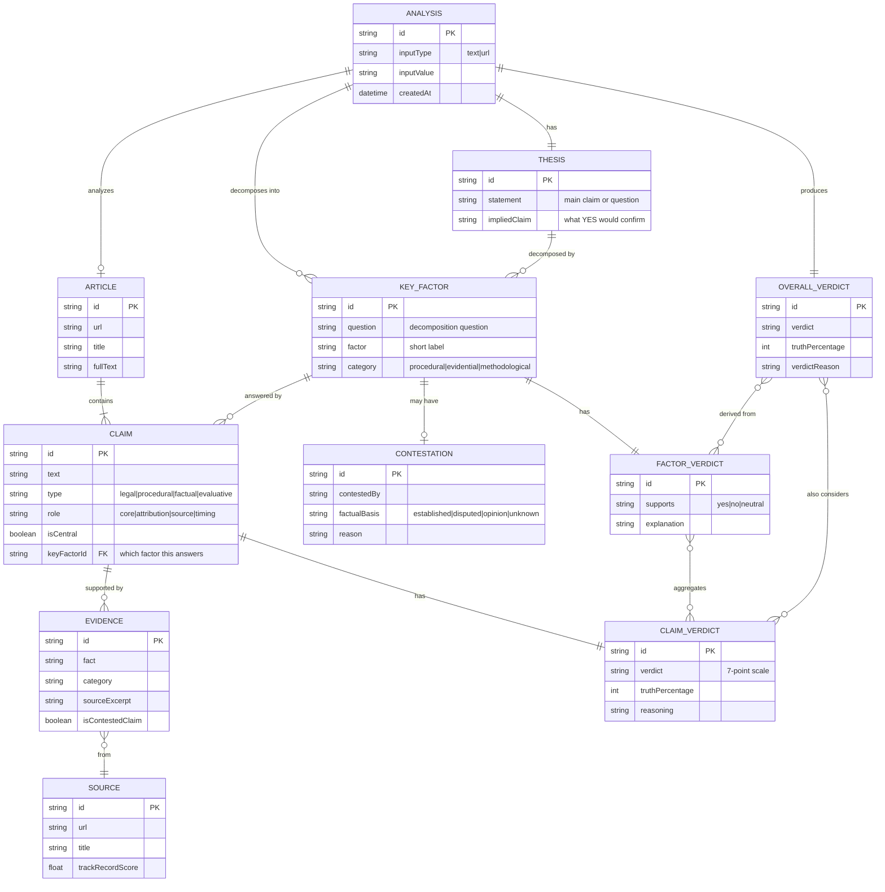
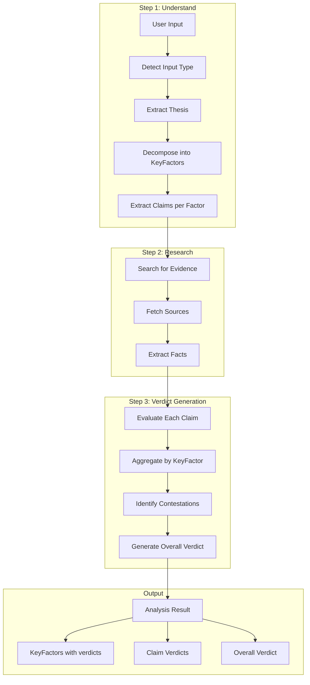
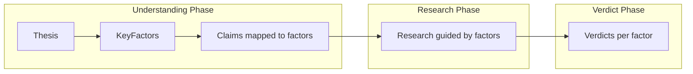
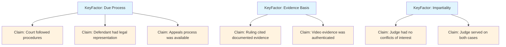

# KeyFactors Design Decision

**Date**: January 2026
**Version**: 2.6.18
**Status**: Design Decision Document

## Executive Summary

This document captures the design decisions around **KeyFactors** in FactHarbor's fact-checking architecture. After analysis, we concluded that:

1. **KeyFactors are decomposition questions** that break down a thesis into verifiable dimensions
2. **KeyFactors should be optional and emergent**, not forced templates
3. **KeyFactors are discovered during understanding**, not verdict generation
4. **Scenario was rejected** as a first-class entity (derivable from existing data)

---

## 1. What is a KeyFactor?

### Definition

A **KeyFactor** is an **evaluation dimension** - a question that must be answered to verify a thesis. It represents a structured decomposition of "what must be true for the thesis to be true?"

### Examples

| Thesis | KeyFactors (Decomposition Questions) |
|--------|--------------------------------------|
| "The Bolsonaro trial was fair" | Was due process followed? Was evidence properly considered? Was the judge impartial? Was the outcome proportionate? |
| "Vaccine X causes autism" | Is there a documented causal mechanism? Do controlled studies support this? What does scientific consensus say? |
| "Company Y committed fraud" | Were financial statements misrepresented? Was there intent to deceive? Were stakeholders harmed? |

### KeyFactor vs Claim

```
┌─────────────────────────────────────────────────────────────────┐
│                         THESIS                                   │
│              "The Bolsonaro trial was fair"                     │
└─────────────────────────────────────────────────────────────────┘
                              │
            ┌─────────────────┼─────────────────┐
            ▼                 ▼                 ▼
┌───────────────────┐ ┌───────────────────┐ ┌───────────────────┐
│    KEY FACTOR     │ │    KEY FACTOR     │ │    KEY FACTOR     │
│  "Due process     │ │  "Evidence basis" │ │  "Impartiality"   │
│   followed?"      │ │                   │ │                   │
└───────────────────┘ └───────────────────┘ └───────────────────┘
         │                    │                      │
    ┌────┴────┐          ┌────┴────┐           ┌────┴────┐
    ▼         ▼          ▼         ▼           ▼         ▼
┌───────┐ ┌───────┐ ┌───────┐ ┌───────┐  ┌───────┐ ┌───────┐
│ Claim │ │ Claim │ │ Claim │ │ Claim │  │ Claim │ │ Claim │
│  SC1  │ │  SC2  │ │  SC3  │ │  SC4  │  │  SC5  │ │  SC6  │
└───────┘ └───────┘ └───────┘ └───────┘  └───────┘ └───────┘
```

| Entity | Level | What it represents |
|--------|-------|-------------------|
| **Thesis** | Highest | The main assertion to verify |
| **KeyFactor** | Middle | Evaluation dimension / decomposition question |
| **Claim** | Lowest | Atomic verifiable assertion |

---

## 2. Entity Relationship Model



---

## 3. Data Flow



---

## 4. Design Decisions

### Decision 1: KeyFactors are Optional and Emergent

**Rejected Approach**: Force a fixed template of 5 factors for every analysis.

**Adopted Approach**: KeyFactors emerge from thesis decomposition. The number and type depend on the specific claim being analyzed.

```typescript
// BAD: Forced template
const FACTORS = ["Process", "Evidence", "Impartiality", "Proportionality", "Compliance"];

// GOOD: Emergent from thesis
const factors = await decomposeThesis(thesis);
// Could return 2 factors, 5 factors, or none
```

**Rationale**:
- Different claims require different evaluation dimensions
- Forcing irrelevant factors creates noise
- LLM can identify what dimensions actually matter

### Decision 2: KeyFactors are Discovered During Understanding

**Rejected Approach**: Generate KeyFactors during verdict generation.

**Adopted Approach**: Discover KeyFactors in Step 1 (Understand), so research can be directed toward answering them.



**Rationale**:
- KeyFactors guide what evidence to search for
- Claims should be organized by the factor they address
- Verdict is aggregation, not discovery

### Decision 3: Scenario Rejected as First-Class Entity

**Rejected**: Creating a `Scenario` entity to represent competing narratives.

**Rationale**:
- Scenarios are derivable from existing data (contestation metadata)
- Adding Scenario increases schema complexity
- Risk of creating false equivalence between well-supported and poorly-supported interpretations
- Contestation already captures "who disputes what"

**Alternative**: Display "Competing Interpretations" as a derived view when relevant.

### Decision 4: KeyFactor Contestation Structure

Contestation attaches to KeyFactors (not Claims) because:
- Political disputes are usually about evaluation dimensions ("was it fair?")
- Not about atomic facts ("court met on date X")

```typescript
interface KeyFactor {
  factor: string;
  question: string;
  supports: "yes" | "no" | "neutral";
  explanation: string;

  // Contestation
  isContested: boolean;
  contestedBy: string;           // "Bolsonaro supporters", "Trump administration"
  factualBasis: "established" | "disputed" | "opinion" | "unknown";
}
```

**factualBasis Rules**:
| Value | Meaning | Example |
|-------|---------|---------|
| `established` | Opposition has documented counter-evidence | Court transcripts showing bias |
| `disputed` | Some factual counter-evidence, debatable | Conflicting expert opinions |
| `opinion` | No factual counter-evidence, just rhetoric | "Critics say it was unfair" |
| `unknown` | Cannot determine | Insufficient information |

---

## 5. Relationship to Claims

KeyFactors and Claims have a **parent-child relationship**:



**KeyFactor verdict** = Aggregation of claim verdicts that address that factor.

---

## 6. Implementation Notes

### Current State (v2.6.18)

- KeyFactors generated for procedural/legal topics via `detectProceduralTopic()`
- Fixed set of 5 factors in prompt template
- KeyFactors stored in `ArticleAnalysis.keyFactors` and `QuestionAnswer.keyFactors`

### Future Improvements

1. **Move KeyFactor discovery to Understanding phase**
   - Add `keyFactors` to `ClaimUnderstanding` interface
   - Map claims to factors via `claim.keyFactorId`

2. **Make factors emergent**
   - Remove fixed factor templates
   - Let LLM decompose thesis into relevant dimensions

3. **Add factor-claim mapping**
   - Each claim knows which factor(s) it addresses
   - Factor verdict computed from mapped claim verdicts

4. **Simplify schema**
   - Remove `isProceduralTopic` check
   - All analyses can have 0-N factors based on content

---

## 7. Summary

| Aspect | Decision |
|--------|----------|
| **What is KeyFactor?** | Evaluation dimension / decomposition question |
| **When discovered?** | During Understanding phase |
| **Required?** | No - optional, 0-N per analysis |
| **Fixed template?** | No - emergent from thesis |
| **Contestation?** | Attaches to KeyFactors |
| **Scenario entity?** | Rejected - derivable from contestation |
| **Relationship to Claims** | Parent-child (factor answered by claims) |

---

## References

- [FactHarbor POC1 Architecture](./FactHarbor%20POC1%20Architecture%20Analysis.md)
- [Source Reliability Bundle](./Source%20Reliability%20Bundle.md)
