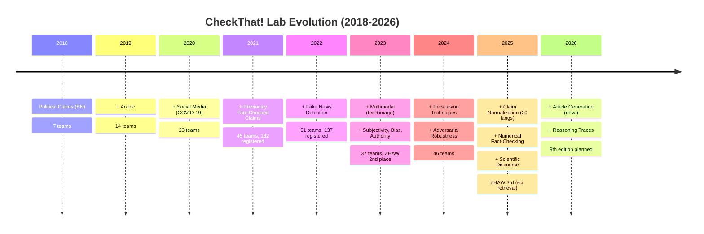
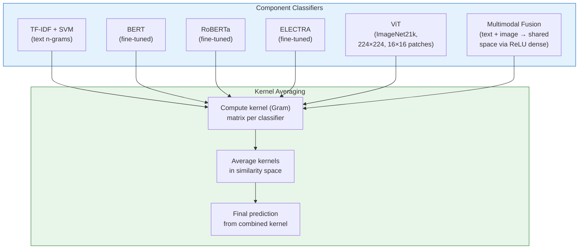
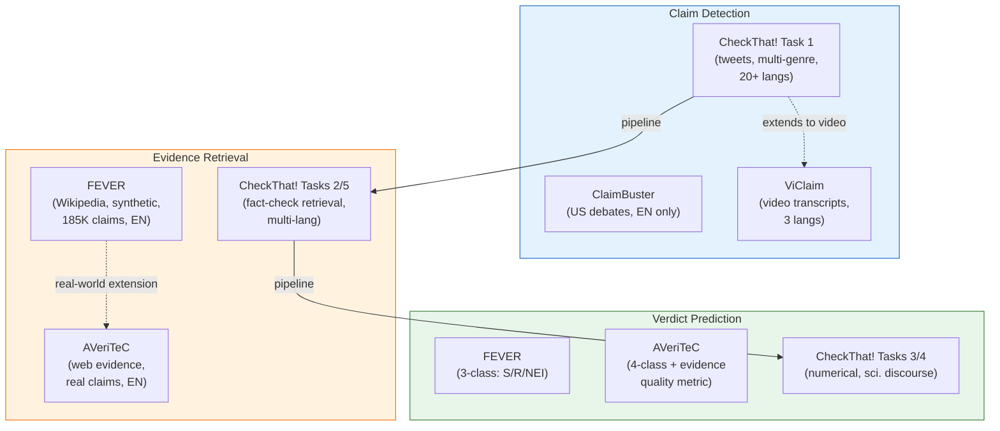

# CLEF CheckThat! Lab — Lessons for FactHarbor

**Shared Task Series:** Barron-Cedeno, Nakov, Alam, Elsayed et al. (2018-2026). *CLEF CheckThat! Lab on Automatic Identification and Verification of Claims.* Annual at CLEF.
**Links:** [CheckThat! 2025](https://checkthat.gitlab.io/clef2025/) | [CheckThat! 2024](https://checkthat.gitlab.io/clef2024/) | [CheckThat! 2023](https://checkthat.gitlab.io/clef2023/) | [GitLab (datasets)](https://gitlab.com/checkthat_lab/) | [2026 Preview (arXiv)](https://arxiv.org/abs/2602.09516)
**Reviewed by:** Claude Opus 4.6 (2026-03-24)

> **Related docs:** [HAMiSoN Analysis](HAMiSoN_Lessons_for_FactHarbor.md) for the research project behind ZHAW's participation. [ViClaim (EMNLP 2025)](ViClaim_EMNLP2025_Lessons_for_FactHarbor.md) for the claim detection dataset extending CheckThat! to video. [Factiverse Analysis](Factiverse_Lessons_for_FactHarbor.md) for another finding that fine-tuned encoders beat LLMs. [Global Landscape](Global_FactChecking_Landscape_2026.md) for how CheckThat! fits the broader ecosystem. [Executive Summary](EXECUTIVE_SUMMARY.md) for the consolidated priority table.

---

## 1. CheckThat! in Brief

The longest-running and most popular shared task series in automated fact-checking. Running annually since 2018 at CLEF (Conference and Labs of the Evaluation Forum), CheckThat! is the **only shared task that systematically addresses all stages** of the fact-checking pipeline — from claim detection through evidence retrieval to verdict prediction — plus auxiliary tasks like subjectivity, political bias, persuasion, and claim normalization.

**Scale:** 130+ registered teams per year (2021-2024), 37-51 active submissions, 20+ languages. Has been **consistently the most popular lab at CLEF.**

**Key organizers:** Alberto Barron-Cedeno (Bologna), Preslav Nakov (MBZUAI), Firoj Alam (QCRI), Tamer Elsayed (Qatar Univ.), Julia Maria Struss (FH Potsdam), Giovanni Da San Martino (Padova), Tanmoy Chakraborty (IIT Delhi).

### Evolution Timeline

---

## 2. The Fact-Checking Pipeline — CheckThat!'s Task Taxonomy

CheckThat! maps to the standard fact-checking pipeline (Guo et al., TACL 2022) with extensions:

```mermaid
flowchart LR
    subgraph Stage1["Stage 1: Detection"]
        direction TB
        CW["Check-Worthiness<br>(Task 1)"]
        SUB["Subjectivity<br>(Task 2)"]
        CN["Claim<br>Normalization<br>(Task 2, 2025)"]
    end

    subgraph Stage2["Stage 2: Retrieval"]
        direction TB
        PCR["Previously Fact-<br>Checked Retrieval"]
        ER["Evidence<br>Retrieval"]
        SR["Scientific Source<br>Retrieval (2025)"]
    end

    subgraph Stage3["Stage 3: Verification"]
        direction TB
        VER["Verdict<br>Prediction"]
        NFC["Numerical Fact-<br>Checking (2025)"]
        ART["Article<br>Generation (2026)"]
    end

    subgraph Auxiliary["Auxiliary Tasks"]
        direction TB
        PB["Political Bias"]
        PT["Persuasion<br>Techniques"]
        RL["Roles (hero/<br>villain/victim)"]
        ADV["Adversarial<br>Robustness"]
    end

    Stage1 --> Stage2 --> Stage3
    Auxiliary -.-> Stage1 & Stage2 & Stage3

    style Stage1 fill:#e3f2fd,stroke:#1565c0
    style Stage2 fill:#fff3e0,stroke:#ef6c00
    style Stage3 fill:#e8f5e9,stroke:#2e7d32
    style Auxiliary fill:#f3e5f5,stroke:#7b1fa2
```

*CheckThat!'s task taxonomy maps to a full verification pipeline. FactHarbor's Stages 1-5 cover the same pipeline — claim extraction (detection), evidence gathering (retrieval), and verdict debate + aggregation (verification). The auxiliary tasks (bias, persuasion, adversarial robustness) are not yet addressed by FactHarbor.*

### FactHarbor Pipeline Mapping

| CheckThat! Stage | CheckThat! Tasks | FactHarbor Equivalent |
|------------------|------------------|----------------------|
| **Detection** | Check-worthiness, Subjectivity, Claim Normalization | Stage 1: AtomicClaim extraction + Gate 1 |
| **Retrieval** | Previously fact-checked retrieval, Evidence retrieval, Scientific source retrieval | Stage 2: Research (query generation → acquisition → extraction) |
| **Verification** | Verdict prediction, Numerical fact-checking, Article generation | Stage 4: Verdict debate + Stage 5: Aggregation |
| **Auxiliary** | Political bias, Persuasion, Roles, Adversarial robustness | Not yet addressed |

---

## 3. ZHAW's Participation and Results

### CheckThat! 2023 — Task 1A: Multimodal Check-Worthiness — **2nd Place**

**Task:** Classify tweets containing text + image as check-worthy or not. Binary classification. English.

**Full Leaderboard:**

| Rank | Team | F1 Score | Gap to ZHAW |
|------|------|----------|-------------|
| 1 | Fraunhofer SIT | 0.7297 | +0.022 |
| **2** | **ZHAW-CAI** | **0.708** | — |
| 3 | marvinpeng | 0.697 | -0.011 |
| 4 | CSECU-DSG | 0.628 | -0.080 |
| 5-7 | Others | < 0.628 | — |

**ZHAW's Method: Kernel Ensemble Averaging**

*ZHAW-CAI's approach: 6 diverse classifiers spanning TF-IDF, transformers, vision, and multimodal fusion — combined via kernel averaging rather than prediction averaging. This principled combination of heterogeneous feature spaces was key to their strong result.*

**Paper:** "ZHAW-CAI at CheckThat! 2023: Ensembling using Kernel Averaging" — [CEUR Vol. 3497, pp. 534-545](https://ceur-ws.org/Vol-3497/paper-048.pdf)

**Authors:** Pius von Daniken, Jan Milan Deriu, Mark Cieliebak

**Why it worked:**
1. **Diversity of representations:** TF-IDF (bag-of-words), transformer embeddings, vision features — each captures different signals
2. **Kernel-space fusion:** Principled combination of fundamentally different feature spaces (not just prediction averaging)
3. **Both unimodal and multimodal:** Dedicated text-only, image-only, and combined models provide robustness
4. **Practical simplicity:** Modular and interpretable vs. complex end-to-end architectures

### CheckThat! 2025 — Task 4b: Scientific Source Retrieval — **3rd Place**

**Task:** Match tweets to the scientific papers they reference. Evaluate with MRR@5.

**Team:** Deep Retrieval (Pascal Sager [UZH], Ashwini Kamaraj [UZH], Benjamin Grewe [ETH/UZH], **Thilo Stadelmann [ZHAW]**)

**Method:** Three-stage hybrid retrieval: BM25 lexical → fine-tuned INF-Retriever-v1 semantic → BAAI/bge-reranker-v2-gemma cross-encoder re-ranking

**Results:** MRR@5 = 76.46% (dev, 1st) → 66.43% (test, 3rd/31 teams)

**Paper:** [arXiv:2505.23250](https://arxiv.org/html/2505.23250)

---

## 4. Top Competitors and Their Methods

### Fraunhofer SIT — 1st Place (2023 Task 1A, F1 = 0.7297)

**Key insight:** OCR on images (extracting embedded text from screenshots/memes/infographics) outperformed direct image classification. Combined with BERT text classifier.

**Also:** 2nd place in Task 1B using **Model Souping** — training multiple BERT models with different random seeds, then creating a weighted average of their parameters based on dev set performance.

**Paper:** [arXiv:2307.00610](https://arxiv.org/abs/2307.00610)

### OpenFact — 1st Place (2023 Task 1B English, F1 = 0.898)

**Method:** Fine-tuned GPT-3 Curie (13B) on 7K+ annotated sentences. Also trained DeBERTa that performed comparably.

**Key finding:** Fine-tuned BERT-class models match GPT-3 for check-worthiness detection.

### AVeriTeC 2024 Winners — TUDA_MAI (AVeriTeC Score = 63%)

**Method:** LLM-based question generation + retrieval. The metric requires evidence quality — a correct verdict with poor evidence scores zero.

**Constraint (2025 edition):** < 10B parameters, < 1 minute per claim, open-weights only.

---

## 5. CheckThat! Datasets

### Key Dataset Characteristics

| Edition | Task | Languages | Training Size | Test Size |
|---------|------|-----------|--------------|-----------|
| 2023 Task 1A | Multimodal check-worthiness | AR, EN | Tweets + images | Binary labels |
| 2023 Task 1B | Multigenre check-worthiness | AR, EN, ES | 16,876 (heavily imbalanced: 24% positive) | 318 |
| 2024 Task 1 | Check-worthiness | AR, NL, EN | Tweets | 37 teams, 236 runs |
| 2025 Task 1 | Subjectivity | AR, BG, EN, DE, IT (+FR, ES zero-shot) | ~10,000 sentences | ~300/lang |
| 2025 Task 2 | Claim normalization | 20 languages | 19,599 (from Google Fact-check Explorer) | METEOR metric |
| 2025 Task 3 | Numerical fact-checking | EN, ES, AR | EN: 15,514 / ES: 2,000 / AR: 1,536 | 3-class (T/F/C) |

**Data availability:** All datasets released via [GitLab](https://gitlab.com/checkthat_lab/), CodaLab for evaluation.

---

## 6. Relationship to Other Benchmarks

| Benchmark | Pipeline Stage | Evidence Source | Languages | Scale | Real-World Claims? |
|-----------|---------------|----------------|-----------|-------|-------------------|
| **FEVER** | Retrieval + Verification | Wikipedia (closed) | EN | 185K claims | No (synthetic) |
| **AVeriTeC** | Full pipeline | Web (open) | EN | 5,783 claims | Yes |
| **CheckThat!** | Full pipeline + auxiliary | Provided + web | 20+ | Varies by year | Yes |
| **ClaimBuster** | Detection only | N/A | EN | 23,533 sentences | Yes (debates) |
| **SciFact** | Retrieval + Verification | Scientific abstracts | EN | 1,409 claims | Yes |
| **MultiFC** | Verification | Web | EN | 34,918 claims | Yes |

**CheckThat! is unique in:** (a) covering the full pipeline, (b) 20+ languages, (c) evolving annually with new tasks tracking real misinformation challenges, (d) largest participation numbers.

---

## 7. Key Lessons for FactHarbor

### L1: Ensemble Methods Consistently Win

Both ZHAW (kernel averaging) and Fraunhofer (model souping) achieved top results through ensembles. OpenFact's fine-tuned GPT-3 matched by DeBERTa. No single model dominates across all subtasks — combining diverse approaches is the pattern.

**FactHarbor action:** FactHarbor's Stage 4 debate (3 advocates at different temperatures + challenger + reconciler) is already an ensemble approach for verdict generation. This pattern could extend to Stage 2 evidence extraction: multiple extraction strategies (different prompts, different models) whose outputs are merged.

### L2: OCR is More Valuable Than Image Understanding for Fact-Checking

Fraunhofer's key 2023 insight: extracting text from images via OCR outperformed direct image classification for check-worthiness. Most "multimodal misinformation" is actually text-in-image (screenshots, memes, infographics).

**FactHarbor action:** When FactHarbor encounters image-based evidence (screenshots of articles, infographic claims), OCR text extraction should be the primary signal — not image understanding. This is simpler and more effective.

### L3: The Full Pipeline is Essential — No Single Stage Suffices

CheckThat!'s 8-year evolution demonstrates that claim detection alone (ClaimBuster), or verification alone (FEVER), or retrieval alone are insufficient. Production systems need all stages. The 2025 addition of claim normalization as a dedicated task confirms that claim preprocessing is its own challenge.

**FactHarbor action:** FactHarbor's 5-stage pipeline already covers the full stack. The validation is that this comprehensive approach is architecturally correct — confirmed by the community's leading shared task series expanding to cover exactly the same stages.

### L4: Multilingual Performance Degrades Significantly

CheckThat! results consistently show cross-lingual gaps: Arabic check-worthiness F1 < 0.40 vs English > 0.70 in 2023. ViClaim shows similar patterns. The gap is not just about model capability — it reflects data scarcity, linguistic structure differences, and cultural context variation.

**FactHarbor action:** FactHarbor's AGENTS.md mandate for multilingual robustness is well-founded but needs empirical validation. The pipeline should track per-language performance metrics. Testing in German and French (the other official Swiss languages) is essential for an Innosuisse context.

### L5: Class Imbalance is Persistent and Dangerous

CheckThat! 2023 Task 1B: 24% positive (check-worthy) vs 76% negative. This mirrors reality — most text is NOT a verifiable claim. Top teams use sampling strategies, weighted losses, and ensemble approaches.

**FactHarbor action:** In Stage 2 evidence extraction, most text in retrieved web pages is irrelevant. The evidence extraction prompt and any future fine-tuned models must account for severe class imbalance — most sentences in a source document are not evidence for or against the claim.

### L6: Hybrid Retrieval (Lexical + Semantic + Reranking) is State-of-the-Art

Deep Retrieval (ZHAW, 2025) and AVeriTeC winners demonstrate the three-stage pattern: BM25 lexical → dense semantic → cross-encoder reranking. Neither lexical nor semantic search alone is sufficient.

**FactHarbor action:** FactHarbor's Stage 2 currently relies on web search (lexical) + LLM extraction (semantic understanding). Adding a dedicated reranking step for evidence sources — scoring retrieved documents by relevance before extraction — could improve evidence quality. This aligns with the DIRAS paper's relevance scoring approach.

### L7: Claim Normalization is a Distinct Pipeline Stage

CheckThat! 2025 introduced claim normalization (cleaning noisy social media text, standardizing claim phrasing) as a dedicated task. Real-world claims are messy — incomplete sentences, slang, implicit references. Normalizing before verification improves downstream accuracy.

**FactHarbor action:** Stage 1's AtomicClaim extraction serves a similar function — transforming user input into clean, verifiable assertions. But the normalization step could be made more explicit: ensuring each AtomicClaim is self-contained, linguistically complete, and unambiguous before Stage 2 research begins.

### L8: Subjectivity Detection as a Pre-Filter

CheckThat! has made subjectivity detection a recurring task (2023-2025) because subjective claims require fundamentally different handling than factual assertions. You can verify "the temperature rose 2°C" but not "the policy was unfair."

**FactHarbor action:** FactHarbor's input neutrality requirement ("Was X fair?" yields same analysis as "X was fair") already handles some of this. But an explicit subjectivity score on each AtomicClaim could help the pipeline route: factual claims → full research pipeline, opinion claims → different handling (e.g., present as opinion, not as verifiable assertion).

### L9: Adversarial Robustness is an Emerging Requirement

CheckThat! 2024 introduced an adversarial robustness task — testing whether systems can be fooled by deliberate manipulation. This reflects the real-world threat: bad actors will try to game fact-checking systems.

**FactHarbor action:** Not immediate priority, but worth noting: the Stage 4 adversarial challenger already provides some robustness by stress-testing verdicts. Future work could include adversarial testing of Stage 1 (can input phrasing trick claim extraction?) and Stage 2 (can SEO-manipulated sources fool evidence extraction?).

### L10: Evidence Quality Gating is Validated by Benchmark Design

AVeriTeC's metric requires evidence to meet quality thresholds before verdicts count — correct verdict with poor evidence scores zero. This directly validates FactHarbor's evidence quality architecture.

**FactHarbor action:** FactHarbor's `probativeValue` assessment and `evidence-filter.ts` implement exactly this principle. The AVeriTeC metric design confirms this is the right approach — evidence quality is not optional, it's mandatory for trustworthy verdicts. The existing architecture is validated.

---

## 8. Implications for Innosuisse Partnership

CheckThat! provides the established evaluation framework for any fact-checking research:

1. **Benchmark credibility:** Any Innosuisse proposal claiming to advance fact-checking can reference CheckThat! tasks for evaluation — reviewers will recognize it
2. **ZHAW's track record:** 2nd place (2023) and 3rd place (2025) demonstrates competitive research capability — not just participation, but top results
3. **Dataset availability:** CheckThat! datasets (20+ languages, multiple tasks, multiple years) are freely available for research
4. **Community engagement:** Participating in CheckThat! 2026 (claim normalization, article generation, reasoning traces) during an Innosuisse project would produce both publications and visibility
5. **Pipeline validation:** CheckThat!'s task taxonomy validates FactHarbor's pipeline architecture — both cover the same stages, confirming the approach is sound

---

## Sources

- [CheckThat! 2025 Lab](https://checkthat.gitlab.io/clef2025/)
- [CheckThat! 2024 Lab](https://checkthat.gitlab.io/clef2024/)
- [CheckThat! 2023 Lab](https://checkthat.gitlab.io/clef2023/)
- [CheckThat! 2026 Preview (arXiv)](https://arxiv.org/abs/2602.09516)
- [CheckThat! 2025 Overview (arXiv)](https://arxiv.org/abs/2503.14828)
- [ZHAW-CAI at CheckThat! 2023 (CEUR)](https://ceur-ws.org/Vol-3497/paper-048.pdf)
- [Fraunhofer SIT at CheckThat! 2023 (arXiv)](https://arxiv.org/abs/2307.00610)
- [Deep Retrieval at CheckThat! 2025 (arXiv)](https://arxiv.org/html/2505.23250)
- [Overview CLEF-2023 CheckThat! (Springer)](https://link.springer.com/chapter/10.1007/978-3-031-42448-9_20)
- [Overview CLEF-2024 CheckThat! (Springer)](https://link.springer.com/chapter/10.1007/978-3-031-71908-0_2)
- [FEVER (NAACL 2018)](https://aclanthology.org/N18-1074/)
- [AVeriTeC (NeurIPS 2023)](https://arxiv.org/abs/2305.13117)
- [Survey on Automated Fact-Checking (Guo et al., TACL 2022)](https://aclanthology.org/2022.tacl-1.11/)
- [ViClaim (EMNLP 2025)](https://aclanthology.org/2025.emnlp-main.21/)
- [CheckThat! GitLab (datasets)](https://gitlab.com/checkthat_lab/)
- [Preslav Nakov (DBLP)](https://dblp.org/pid/19/1947.html)
