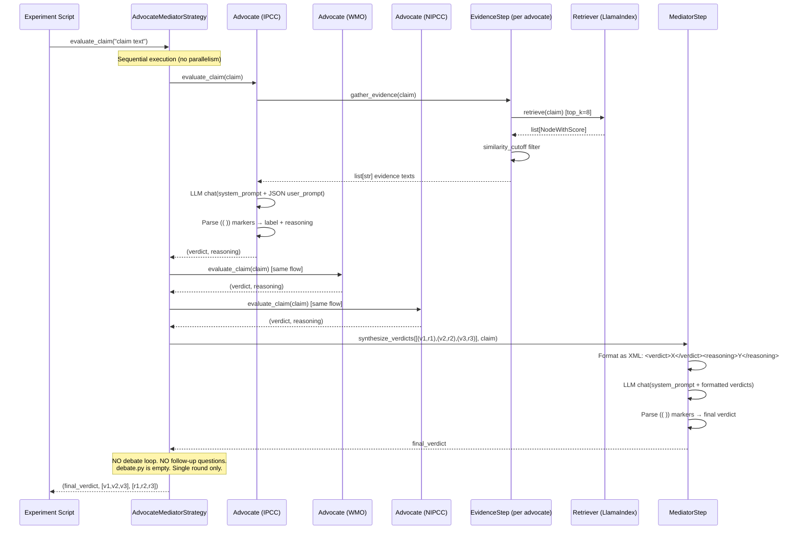

# What FactHarbor Can Learn from Climinator

**Paper:** Leippold, Vaghefi, Stammbach et al. (2025). *Automated fact-checking of climate claims with large language models.* npj Climate Action.
**Links:** [Nature](https://www.nature.com/articles/s44168-025-00215-8) | [arXiv](https://arxiv.org/abs/2401.12566) | [Code](https://github.com/climateandtech/factchecker)
**Reviewed by:** Claude Opus 4.6 (2026-02-21)

> **Related docs:** [Research Ecosystem](Stammbach_Research_Ecosystem_and_FactHarbor_Opportunities.md) for the Leippold/Climate+Tech ecosystem, people profiles, and the broader debate landscape. [Executive Summary](EXECUTIVE_SUMMARY.md) for the consolidated priority table across all research.

---

## 1. Climinator in Brief

**CLImate Mediator for INformed Analysis and Transparent Objective Reasoning.**

A Mediator-Advocate debate framework for automated climate claim fact-checking. Multiple LLM advocates — each grounded in a distinct knowledge corpus via RAG — independently evaluate claims. A mediator LLM synthesizes verdicts, and when advocates disagree, it drives iterative debate via follow-up questions until convergence.

### Paper Architecture

```
Claim
  ├─ Advocate 1 (IPCC AR6 corpus via RAG + GPT-4o)
  ├─ Advocate 2 (WMO reports via RAG + GPT-4o)
  ├─ Advocate 3 (290K climate abstracts via RAG + GPT-4o)
  ├─ Advocate 4 (190K top-scientist abstracts via RAG + GPT-4o)
  ├─ Advocate 5 (GPT-4o general, no RAG) — Climinator+ variant
  └─ [Optional] Advocate 6 (NIPCC denial corpus via RAG + GPT-4o)
         │
         ▼
     Mediator (GPT-4o)
       ├─ Consensus? → Final verdict
       └─ Disagreement? → Follow-up questions → Advocates reassess → Loop
```

### Reported Performance

| Task | Accuracy |
|------|----------|
| Binary (correct/incorrect) | >96% (Climate Feedback), >99% (Skeptical Science) |
| 5-class | 72.7% (vs GPT-4o zero-shot 56.5%) |
| 7-class | 62.9% |
| NIPCC adversary → reconvergence | 95.3% after 2 debate rounds |

### Verdict Taxonomy

- **7 classes:** incorrect, mostly inaccurate, unsupported, lacks context, imprecise, mostly accurate, correct
- **5 classes:** incorrect, misleading, mostly accurate, correct, context-dependent
- **2 classes:** correct / incorrect
- **NEI:** "Not Enough Information" — explicit first-class verdict

---

## 2. Architecture: Paper vs Code vs FactHarbor

| Dimension | Climinator (paper) | Climinator (code, 2025-05) | FactHarbor |
|-----------|-----------|-----------|------------|
| **Debate structure** | Dynamic rounds until convergence | **Single-round only** (`debate.py` is empty, 0 bytes) | 5-step: advocate(3×) → challenge → reconcile → validate; ~7 verdict LLM calls |
| **Advocate count** | 5-6 (IPCC, WMO, AbsCC, S1000, GPT-4o, [NIPCC]) | **3 only** (IPCC, WMO, NIPCC) — AbsCC/S1000/GPT-4o not implemented | 1 advocate role, 3 temperature-varied runs + 1 challenger |
| **Advocate diversity source** | Knowledge-base separation (5 corpora) | Knowledge-base separation (3 corpora) | Model/provider separation (4 debate profiles) |
| **Adversarial role** | Corpus-backed contrarian (NIPCC) | Same — NIPCC advocate uses same prompt, just different corpus | Prompt-directed challenger (same evidence pool) |
| **Mediator behavior** | Asks follow-up questions, drives iterative reassessment | **Single-pass synthesis** — prompt describes iteration but code doesn't implement it | Single-pass reconciliation decision |
| **Evidence source** | Curated RAG corpora (IPCC, WMO, abstracts) | In-memory LlamaIndex VectorStoreIndex, rebuilt each run | Live web search (iterative, up to 10 rounds) |
| **Verdict format** | 7/5/2-class categorical | 3-class: correct / incorrect / not_enough_information | Continuous truthPercentage (0-100) |
| **Response parsing** | Not described | Fragile `(( ))` marker extraction, retry up to 3× | Structured JSON output via AI SDK |
| **Convergence signal** | All advocates agree → stop | None — no iteration exists | Temperature-spread consistency (σ across 3 runs) |
| **Models** | GPT-4o (all roles, different corpora) | `gpt-3.5-turbo-1106` default (configurable via env) | Sonnet/Haiku (configurable per role + provider) |
| **Embeddings** | Not detailed | `text-embedding-ada-002` default, HuggingFace/Ollama alternatives | N/A (web search, no RAG) |
| **RAG chunking** | Not detailed | SentenceSplitter: chunk_size=150, chunk_overlap=20, top_k=8 | N/A |
| **Claim decomposition** | Decomposes complex claims into subclaims | **Not implemented** in code — claims passed as-is | AtomicClaim extraction in Stage 1 |
| **NEI handling** | Explicit first-class verdict | Label option in prompts, mapped in evaluation | UNVERIFIED (triggered by low confidence or pipeline failure) |
| **Parallel execution** | Implied | **Sequential** — advocates evaluated in list comprehension | Parallel LLM calls via AI SDK |
| **Persistence** | Not described | In-memory only — `save_index()` raises NotImplementedError | SQLite (jobs, config, source reliability) |
| **Evaluation dataset** | Climate Feedback + Skeptical Science (hundreds) | 39 claims CSV, 10 sampled per run | 10 mirror-claim calibration pairs |
| **Deployment** | Not described | **Script-only** — no API, no web service, `app/` dir is empty | Next.js web app + ASP.NET Core API |

---

## 3. Codebase Deep-Dive (2025-05)

**Repository:** [github.com/climateandtech/factchecker](https://github.com/climateandtech/factchecker)
**License:** AGPL-3.0 (commercial licensing available)
**Language:** Python 3.10, LlamaIndex-based
**Version:** 0.1.0 | **Stars:** 11 | **Contributors:** 3
**Last commit:** 2025-05-03 | **Activity:** Low (no commits in 9+ months)

### 3.1. Repository Structure

```
climateandtech/factchecker/
├── factchecker/
│   ├── core/           # llm.py (OpenAI/Ollama), embeddings.py (4 providers)
│   ├── steps/          # advocate.py, mediator.py, evidence.py, evaluate.py
│   │                   # debate.py → EMPTY (0 bytes)
│   ├── strategies/     # advocate_mediator.py, evidence_evaluation.py
│   ├── prompts/        # advocate_prompts.py (default + experiment-specific)
│   ├── indexing/       # LlamaVectorStore, LlamaColBERT, RagatouilleColBERT
│   ├── retrieval/      # LlamaBase, RagatouilleColBERT
│   ├── experiments/    # advocate_mediator_climatefeedback/ (main experiment)
│   ├── tools/          # PDF downloader, transformer
│   ├── config/         # Pydantic schemas (defined but not enforced)
│   └── app/            # EMPTY (web app placeholder)
├── datasets/           # 39 labeled Climate Feedback claims
└── tests/              # pytest with mock embeddings
```

### 3.2. The Paper-vs-Code Gap (Critical Finding)

| Feature | Paper Claims | Code Reality | Gap Severity |
|---------|-------------|-------------|-------------|
| **Iterative debate** | "Mediator generates follow-up questions... loop until convergence" | `debate.py` is empty (0 bytes). `evaluate_claim()` is single-round. | **HIGH** — Core innovation not implemented |
| **5-6 advocates** | IPCC, WMO, AbsCC (290K), S1000 (190K), GPT-4o, [NIPCC] | Only 3 corpora configured: IPCC, WMO, NIPCC | **MEDIUM** — 60% of knowledge diversity missing |
| **Claim decomposition** | "Decomposes complex claims into subclaims" | Claims passed as-is to retrieval (no decomposition code) | **MEDIUM** — Described feature absent |
| **96%+ binary accuracy** | ">96% (Climate Feedback), >99% (Skeptical Science)" | Experiment samples 10 of 39 claims per run (30% correct ratio) | **LOW** — Paper results likely from larger/different evaluation |
| **Convergence detection** | "All advocates agree → stop" | No convergence logic exists. No loop. | **HIGH** — Follows from empty debate.py |
| **Trust hierarchy** | Mediator prompt: "Treat IPCC, WMO with higher regard" | Prompt-only instruction — not enforced algorithmically | **LOW** — Matches LLM-instruction approach |
| **5/7-class verdicts** | 7 and 5 class taxonomy in paper | Code uses 3 classes: correct/incorrect/not_enough_information | **LOW** — Mapping functions exist for evaluation |

**What this means:** The paper's most compelling features are NOT implemented. The code is a minimal prototype: 3 advocates, single round, no iteration. The reported accuracy figures may come from a different (private) implementation or evaluation methodology. FactHarbor can implement and test these ideas independently, with our calibration harness providing validation that Climinator's 39-claim CSV cannot.

### 3.3. Advocate-Mediator Flow (Actual Code)



### 3.4. RAG Implementation

| Component | Implementation | Details |
|-----------|---------------|---------|
| **Vector store** | LlamaIndex `VectorStoreIndex` | In-memory only — `save_index()` raises NotImplementedError |
| **Chunking** | `SentenceSplitter` | chunk_size=150 tokens, chunk_overlap=20 |
| **Embeddings** | `text-embedding-ada-002` (default) | Also supports HuggingFace (`BAAI/bge-small-en-v1.5`), Ollama |
| **Retrieval** | `similarity_top_k=8` | Plus optional `SimilarityPostprocessor(similarity_cutoff)` |
| **Default LLM** | `gpt-3.5-turbo-1106` | Note: NOT GPT-4o as paper states. Configurable via env. |
| **Temperature** | 0.1 | Low temperature for deterministic outputs |
| **Index rebuild** | Every run | No persistence — all documents re-indexed from PDFs each execution |

### 3.5. NIPCC Adversary: No Special Treatment

The NIPCC advocate receives identical configuration to IPCC and WMO advocates:
- **Same prompt** (`advocate_primer` — "scientific fact-checker")
- **Same label options** (correct/incorrect/not_enough_information)
- **Same LLM** (whatever `load_llm()` returns)

The ONLY difference is the document corpus: 2 NIPCC PDF reports vs. ~57 IPCC PDFs and 5 WMO PDFs.

The advocate is NOT instructed to be contrarian. It simply retrieves from contrarian source material and evaluates claims using the same neutral prompt as other advocates. This is an elegant design choice: the adversarial behavior emerges from the evidence, not from prompt engineering.

### 3.6. Pro/Con Evidence Evaluation

The codebase also implements `EvidenceEvaluationStrategy` — a simpler alternative approach:
- Single corpus, single retriever
- Generates TWO queries per claim: `"evidence supporting: {claim}"` and `"evidence refuting: {claim}"`
- Passes both evidence sets to an `EvaluateStep` that uses JSON-structured output
- This is closer to FactHarbor's contrarian search pass idea (Lesson 3)

### 3.7. What FactHarbor Already Does Better

| Area | Climinator (code) | FactHarbor | Advantage |
|------|-------------------|-----------|-----------|
| **Debate depth** | Single round, no iteration | 7 LLM calls: advocate(3×) + challenger + reconciler + 2 validation | FactHarbor |
| **Response parsing** | Fragile `(( ))` string search, retry 3× | Structured JSON via AI SDK | FactHarbor |
| **Evidence persistence** | In-memory, rebuild every run | SQLite storage, source reliability cache | FactHarbor |
| **Parallel execution** | Sequential list comprehension | Parallel LLM calls via AI SDK | FactHarbor |
| **Deployment** | Script-only, no API | Full web app + REST API + job queue | FactHarbor |
| **Claim decomposition** | Not implemented (despite paper claim) | AtomicClaim extraction in Stage 1 | FactHarbor |
| **Evidence sourcing** | Static curated corpora (3 corpus sets) | Live web search, iterative (up to 10 rounds) | FactHarbor |
| **Multi-model** | Single model (configurable) | Multi-model (Sonnet/Haiku) + multi-provider | FactHarbor |
| **Evaluation framework** | 39-claim CSV, 10 sampled per run | 10-pair calibration harness, 5-stage bias detection | FactHarbor |
| **Configuration** | Env vars + hardcoded experiment params | UCM (runtime-configurable, admin UI) | FactHarbor |

### 3.8. Patterns Worth Studying

Despite the implementation gaps, several code patterns are worth studying:

1. **Pro/Con query separation** (`EvidenceEvaluationStrategy`): Generating separate search queries for supporting and refuting evidence is a simple, powerful pattern that directly maps to FactHarbor's contrarian search pass idea.

2. **Corpus-emergent adversarialism**: The NIPCC advocate's behavior emerges from evidence, not prompts. This is more robust than prompt-directed challenge because the LLM can't "fake" adversarialism — it must work with actual counter-evidence.

3. **Similarity cutoff filtering**: The `SimilarityPostprocessor` with configurable `min_score` is a simple quality gate that could complement FactHarbor's `probativeValue` assessment — though FactHarbor's LLM-based assessment is more sophisticated.

4. **ColBERT retrieval option**: The codebase includes both dense vector and ColBERT-based retrieval, suggesting the team found dense embeddings insufficient for some retrieval tasks. Worth noting if FactHarbor ever adds RAG capabilities.

---

## 4. Lessons for FactHarbor

Eleven lessons organized by theme. For the consolidated priority ranking across all research, see [Executive Summary](EXECUTIVE_SUMMARY.md).

### Evidence and Search Strategy

#### Lesson 1: Knowledge Diversity > Model Diversity

**Climinator's key insight:** Power comes from advocates drawing on *different knowledge bases*, not different models. All five advocates use GPT-4o — what differs is the corpus each retrieves from (IPCC, WMO, scientific abstracts, top-scientist papers, general knowledge).

**FactHarbor's current approach:** Diversity comes from model/provider separation (`cross-provider`, `max-diversity` profiles). The challenger uses the same evidence pool as the advocate — it's prompted to argue differently, not equipped with different knowledge.

**Actionable:** After web search (Stage 2), partition the evidence pool by source type and assign different evidence subsets to different debate roles:
- Advocate A: peer-reviewed + institutional sources only
- Advocate B: news/media + general sources only
- Reconciler: sees everything

This is cheaper than adding RAG corpora and achieves the structural independence that makes Climinator effective. The `sourceType` field on `EvidenceItem` already enables this partitioning.

**Effort:** Medium. No new infrastructure — route existing filtered evidence differently into debate prompts.

#### Lesson 3: The Adversarial Corpus Test (NIPCC Pattern)

**Climinator's most striking finding:** Adding a climate-denial advocate (backed by NIPCC reports) shifted initial verdicts dramatically (57→155 incorrect classifications). But after iterative debate, the system reconverged to >95% accuracy. Even more telling: the NIPCC advocate couldn't validate its own source material — it classified 58 of 81 NIPCC executive-summary claims as "not enough information," exposing internal incoherence in denial literature.

**What this means for FactHarbor:** The current challenger is prompt-directed but draws from the same evidence pool. For politically charged claims (C10 baseline: 27.6pp mean skew), a structurally independent contrarian that searches for counter-evidence using different search queries would surface genuine vs. manufactured controversy.

**Actionable:** In Stage 2 (research), add an optional "contrarian search pass":
- After main evidence search, generate inverted search queries (if claim is "X is good", search for "X problems", "X criticism", "X failure")
- Tag results with `searchStrategy: "contrarian"` marker
- Feed them to the challenger role specifically
- Track whether contrarian evidence survives the evidence filter (probativeValue assessment)

This directly addresses C13 (evidence pool bias, 8/10 pairs in baseline). The Climinator finding suggests that weak contrarian evidence self-destructs through debate — no risk of false balance because low-quality counter-evidence gets filtered or loses in reconciliation.

**Effort:** Medium. Extends existing search infrastructure with query inversion and tagging.

#### Lesson 5: "Not Enough Information" as a First-Class Verdict

**Climinator treats NEI explicitly.** When advocates can't find sufficient evidence, they say so. The WMO advocate returns NEI for 46% of Skeptical Science claims — this is informative, not a failure.

**FactHarbor has UNVERIFIED** but it's triggered by low confidence (C8 high-harm floor) or pipeline failure, not by deliberate evidence sufficiency assessment. The pipeline always produces a truthPercentage, even when evidence is thin.

**Actionable:** Add an explicit evidence-sufficiency gate before verdicts:
- Count evidence items per claim after filtering
- If below a minimum threshold (e.g., <3 items, or <2 directional items), classify as INSUFFICIENT_EVIDENCE rather than producing a potentially unreliable percentage
- Prevents the "confident answer from thin evidence" failure mode

**Effort:** Low. Deterministic check on evidence count per claim, fits naturally into evidence-filter.ts or as a pre-verdict gate.

#### Lesson 10: Pro/Con Query Separation

**Finding:** The alternative `EvidenceEvaluationStrategy` in the codebase generates separate "evidence supporting: {claim}" and "evidence refuting: {claim}" queries against the same corpus.

**FactHarbor opportunity:** This is a lightweight version of the contrarian search pass (Lesson 3) that doesn't require separate corpora. Simply generate supporting and refuting search queries from the same claim and tag the results by direction. Quick-win addition to Stage 2 (research).

**Effort:** Low. Two query templates instead of one per claim.

### Debate Architecture

#### Lesson 2: Iterative Debate with Convergence Detection

**Climinator (paper):** Debates run dynamically. When advocates disagree, the mediator generates follow-up questions and advocates reassess. This repeats until convergence or a maximum. For straightforward claims, zero rounds needed. For contested claims with NIPCC adversary, 2 rounds typically suffice — but cases needing up to 18 rounds were observed.

**Note:** This is paper-only — not implemented in the code (`debate.py` is empty).

**FactHarbor:** Fixed single-pass: one challenge, one reconciliation. The reconciler decides in one shot. No ability to say "I need more information" or "advocates, reconsider this point."

**Actionable:** Add an optional iterative loop in Step 4 (reconciliation):
```
while (!converged && round < maxRounds) {
  reconcile → check if challenger's points were adequately addressed
  if unresolved challenges remain → re-prompt advocate with specific questions
  round++
}
```

Trigger extended debate only when spread > `unstableThreshold` or when the challenger raises evidence-backed challenges. On uncontested claims, skip additional rounds. Add `debateDepthMode: "fixed" | "adaptive"` as a UCM config.

**Effort:** Medium-High. Loop logic in verdict-stage, new prompts for mediator follow-up questions, convergence detection heuristic.

#### Lesson 4: Mediator as Question-Asker, Not Just Decision-Maker

**Climinator's mediator (paper) doesn't decide — it interrogates.** When advocates disagree, the mediator generates specific follow-up questions ("Advocate A cited IPCC AR6 Chapter 4 saying X, but Advocate B found WMO data showing Y — can you reconcile?"). This forces advocates to re-examine their reasoning with targeted prompts.

**Note:** Paper-only — the code implements single-pass synthesis.

**FactHarbor's reconciler decides.** It receives advocate verdicts + consistency data + challenges and produces final verdicts in a single LLM call. It never asks the advocate to reconsider specific points.

**Actionable:** Before reconciliation, add a "mediator question" step:
1. Identify specific disagreements (challenger point vs. advocate position)
2. Generate targeted questions about those disagreements
3. Re-prompt the advocate with those specific questions + the challenged evidence
4. Feed the refined advocate response into reconciliation

This is particularly valuable for claims with high spread (>20pp). The current approach applies a 0.4x confidence multiplier for instability — punishing uncertainty rather than resolving it.

**Effort:** Medium. One additional LLM call (Haiku-class) between Steps 3 and 4.

#### Lesson 7: Convergence Speed as Quality Signal

**Climinator uses convergence speed as diagnostic metadata.** Claims converging in 0 rounds are unambiguous. Claims needing 2+ rounds are genuinely contested. Claims needing 18 rounds reveal real scientific controversy.

**Actionable (dependent on Lesson 2):** If iterative debate is implemented, track `debateRoundsToConvergence` per claim:
- 0 rounds: clear-cut, high confidence warranted
- 1-2 rounds: normal contestation, evidence resolves it
- 3+ rounds: genuinely ambiguous, flag for user attention
- Max rounds without convergence: explicitly contested, report as such

Maps directly to `truthPercentageRange` width — claims needing more rounds should have wider ranges.

**Effort:** Low (incremental on top of Lesson 2).

#### Lesson 11: Corpus-Emergent vs Prompt-Directed Adversarialism

**Finding:** The NIPCC advocate receives the SAME neutral prompt as IPCC/WMO advocates. Its contrarian behavior emerges entirely from the evidence it retrieves. This is more robust than prompt engineering because:
- The LLM cannot "fake" adversarialism — it must work with actual counter-evidence
- The quality of challenge is bounded by the quality of counter-evidence
- Weak counter-evidence produces weak challenges (the NIPCC finding: 58/81 claims → "not enough information")

**FactHarbor's challenger** is prompt-directed: same evidence, different instructions ("find weaknesses in this verdict"). This means the challenger can generate plausible-sounding challenges from thin air, not grounded in actual counter-evidence.

**Actionable:** When implementing the contrarian search pass (Lesson 3), feed the counter-evidence to the challenger with a neutral prompt (not "argue against this") and let the adversarialism emerge from the evidence. If the counter-evidence is weak, the challenge will be weak — which is the correct behavior.

### Prompt and Methodology

#### Lesson 8: Prompt Neutrality Engineering

**Climinator explicitly modifies the mediator prompt to "avoid potential biases in favor of climate science"** — even though all corpora are scientific. The team recognized that framing the mediator as a domain expert biases verdicts.

They also found that small prompt modifications (prepending "This claim is made in a climate-change context") dramatically reduced NEI misclassifications.

**FactHarbor's prompt rules already address this** (AGENTS.md: no hardcoded keywords, no test-case terms, generic prompts). But the calibration baseline shows language-dependent skew (English 47pp, French 2pp), suggesting prompts may carry English-specific framing biases.

**Actionable:** Audit verdict-stage prompts (`apps/web/prompts/`) for:
- English-centric framing assumptions
- Implicit cultural context that works differently in French/German
- Whether the reconciler prompt is neutral between advocate and challenger (or subtly favors the advocate)

**Effort:** Low-Medium. Prompt review + A/B calibration testing.

### Strategic

#### Lesson 6: Claim Decomposition (Already Done)

**Climinator decomposes complex claims into subclaims** and evaluates each independently. Example: "Amazon tipping point will destroy 60% of the forest" → (1) "Is there an Amazon tipping point?" and (2) "Will it affect 60% of the forest?"

**FactHarbor already does this** via AtomicClaim extraction in Stage 1. No action needed — validates the architecture.

#### Lesson 9: Paper-vs-Code Gap as Opportunity

**Finding:** Climinator's paper architecture is NOT implemented in the open-source code. FactHarbor's existing debate is already more sophisticated.

**Implications:**
1. Treat the paper as a well-reasoned design proposal, not proven-in-code
2. The reported accuracy figures (>96%) may come from a different (private) implementation or evaluation methodology
3. There is an opportunity to be the **first open-source implementation** of the full iterative debate protocol — applied to general claims, not just climate
4. FactHarbor's calibration harness provides rigorous validation that Climinator's 39-claim CSV cannot

---

## 5. References

### Primary

- Leippold et al. (2025). Automated fact-checking of climate claims with large language models. npj Climate Action. [Nature](https://www.nature.com/articles/s44168-025-00215-8) | [arXiv](https://arxiv.org/abs/2401.12566)
- [Climate+Tech FactChecker repository](https://github.com/climateandtech/factchecker) (AGPL-3.0)

### Cross-References

| Document | Relationship |
|----------|-------------|
| [EXECUTIVE_SUMMARY.md](EXECUTIVE_SUMMARY.md) | Consolidated priority table ranking all lessons |
| [Stammbach_Research_Ecosystem_and_FactHarbor_Opportunities.md](Stammbach_Research_Ecosystem_and_FactHarbor_Opportunities.md) | Leippold/Climate+Tech ecosystem, people profiles, debate landscape, additional learnings (L-A through L-J) |
| [Stammbach_Ash_LLM_Political_Alignment_EMNLP2024.md](Stammbach_Ash_LLM_Political_Alignment_EMNLP2024.md) | Meeting prep, calibration baseline, Ash collaboration |
| [Truth_Seeking.md](Truth_Seeking.md) | Epistemic asymmetry, evidence pool bias context |
