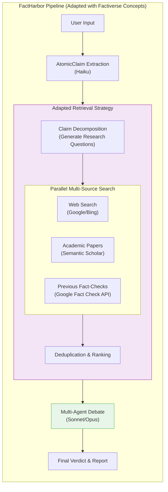

# Factiverse Deep Dive & FactHarbor Strategy

**Date:** 2026-02-23
**Scope:** Deep investigation into Factiverse, extracting actionable insights, boundaries, and cooperation strategies for FactHarbor.
**Context:** Based on `Factiverse_Lessons_for_FactHarbor.md`, `Global_FactChecking_Landscape_2026.md`, and `EXECUTIVE_SUMMARY.md`.

---

## 1. Factiverse Overview: Motivation, Financing, and Cooperations

### Motivation & Goals
Factiverse aims to provide **fully automated, real-time fact-checking** for live broadcasts and newsrooms. Their flagship architecture, LiveFC, is designed to process live audio/video streams with sub-30-second latency, automatically detecting claims, retrieving evidence, and rendering a verdict (Supported, Refuted, Mixed, Not Enough Info).

### Financing & Sponsors
- **Total Funding:** ~EUR 2.5M (pre-seed + subsequent rounds).
- **Key Backers:** NATO DIANA (EUR 100K grant), Norwegian Research Council, Innovation Norway.
- **Nature:** Commercial B2B SaaS startup.

### Cooperations & Customers
- **Media & Broadcasting:** NRK (Norwegian Broadcasting), Faktisk (Norwegian fact-checking org), Viestimedia (Finland).
- **Workflow Integrations:** AVID and Wolftech (integrating fact-checking directly into journalistic broadcast workflows).

---

## 2. Difficulties & Problematic Aspects of Their Approach

While Factiverse is highly ambitious, their goal of fully automated live fact-checking faces significant hurdles:
1. **Editorial-Quality Autonomy:** Live AI fact-checking cannot yet operate autonomously at the quality standards required by major newsrooms. The industry consensus still heavily favors human-in-the-loop for final editorial verdicts.
2. **Latency vs. Depth:** Processing audio 30 seconds ahead of video forces them to use faster, discriminative models (like XLM-RoBERTa) rather than deep generative reasoning. This sacrifices nuance for speed.
3. **Context Loss:** Transcribing live audio (via Whisper) and segmenting it often loses the broader context of a conversation, leading to inaccurate claim detection.
4. **Political Flagging Asymmetry:** Automated systems struggle with input neutrality and can exhibit bias in *which* claims they choose to flag in a live debate, a problem that remains largely unsolved in real-time environments.

---

## 3. What FactHarbor Could Learn & Adapt

FactHarbor's primary weakness is its reliance on a single evidence source (web search). Factiverse excels here. FactHarbor should adapt their retrieval strategy.

### Key Adaptations
1. **Claim Decomposition:** Before searching, break down an `AtomicClaim` into specific research questions. This yields much higher quality search results than querying the raw claim.
2. **Multi-Source Evidence Retrieval:** Query multiple distinct databases in parallel to ensure evidence diversity and combat evidence pool asymmetry (FactHarbor's C13 issue).

### Adapted Architecture Diagram

---

## 4. What FactHarbor Should NOT Do Now

1. **Do NOT build Live Broadcast / Audio Processing:** FactHarbor is text-focused and asynchronous. Real-time audio/video processing introduces massive complexity (transcription, diarization, latency budgets) that distracts from FactHarbor's core value: deep reasoning.
2. **Do NOT pivot to Discriminative Models for Verdicts:** Factiverse uses fine-tuned XLM-RoBERTa (NLI classification) for verdicts. While faster and cheaper, it lacks the ability to handle nuance, explain its reasoning, or weigh conflicting evidence. FactHarbor's Multi-Agent Debate using generative LLMs is its unique competitive advantage.
3. **Do NOT invest in Local Model Quantization (ONNX):** Factiverse optimizes models for local production deployment. FactHarbor relies on API-based frontier models (Anthropic/OpenAI) and should continue to do so to maintain reasoning quality.

---

## 5. What FactHarbor Could Re-Use

Instead of building proprietary databases like Factiverse's "FactiSearch", FactHarbor can re-use existing free APIs to achieve the same multi-source architecture:
1. **Semantic Scholar API:** Free access to 216M+ academic papers. Crucial for scientific and health claims where web search is unreliable.
2. **Google Fact Check Tools API:** Indexes ClaimReview markup globally. Can be used as a first-pass filter to see if a claim has already been debunked by IFCN-certified organizations.
3. **Open Benchmarks:** Re-use Factiverse's published benchmarks (`QuanTemp` for numerical claims, `FactIR` for retrieval) to evaluate FactHarbor's pipeline.

---

## 6. Cooperation Strategy & Contacts

### The Challenge
Factiverse is a commercial B2B SaaS company. Because FactHarbor also aims to automate verdicts, they are technically competitors. A standard "let's share technology" pitch will likely fail.

### The Angle: Academic Benchmarking
Factiverse has strong academic roots (University of Stavanger). The best cooperation angle is **joint research and benchmarking**. 
Factiverse uses **NLI Classification** for verdicts. FactHarbor uses **Multi-Agent Debate**. 
Proposing a joint study to run both systems against a standard dataset (like AVeriTeC) to compare the trade-offs between speed/cost (Factiverse) and depth/nuance (FactHarbor) is mutually beneficial. It gives Factiverse academic exposure and gives FactHarbor access to their evaluation frameworks.

### Contacts
- **Maria Amelie** (CEO) - Former journalist, handles business and media.
- **Dr. Vinay Setty** (CTO) - Associate Professor at University of Stavanger. He is the technical architect and the best target for a research-based collaboration.
- **Espen Egil Hansen** (Chairman) - Media veteran.

### Possible Ways to Contact
1. **Academic Email:** Reach out to Dr. Vinay Setty via his University of Stavanger email address. This bypasses the commercial sales filters and appeals directly to his researcher persona.
2. **LinkedIn:** Direct message to Dr. Vinay Setty or Maria Amelie.

### Focused Topics for 1st Contact (Draft Outline)
* **Subject:** Research Collaboration: NLI Classification vs. Multi-Agent Debate for Automated Verdicts
* **Hook:** Acknowledge their impressive work on LiveFC and their SIGIR/WSDM papers.
* **The Proposition:** Introduce FactHarbor's Multi-Agent Debate architecture. Note that while Factiverse has proven the efficacy of fine-tuned discriminative models, FactHarbor is exploring generative debate.
* **The Ask:** Propose a lightweight collaboration to benchmark both approaches on a shared dataset (e.g., AVeriTeC or their own QuanTemp) to co-author a paper or technical report on the future of automated verdicts.
