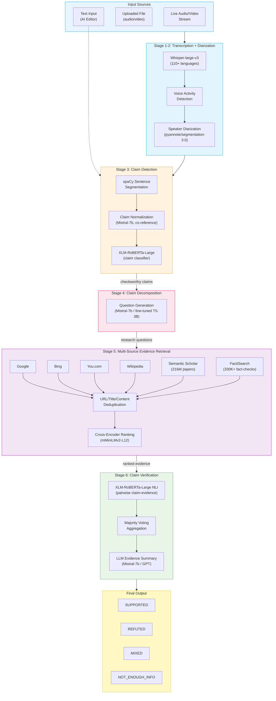

# What FactHarbor Can Learn from Factiverse

**Company:** Factiverse AS (Norway, founded 2019-2020)
**Links:** [factiverse.ai](https://www.factiverse.ai) | [GitHub](https://github.com/factiverse) | [HuggingFace](https://huggingface.co/Factiverse) | [API Docs](https://api.factiverse.ai/v1/redoc)
**Key paper:** [LiveFC: Live Fact-Checking of Audio Streams (WSDM 2025)](https://arxiv.org/abs/2408.07448)
**Reviewed by:** Claude Opus 4.6 (2026-02-22)

> **Related docs:** [Full Fact AI](FullFact_AI_Lessons_for_FactHarbor.md) for the complementary monitoring-focused approach, [Global Landscape](Global_FactChecking_Landscape_2026.md) for competitive positioning, [Executive Summary](EXECUTIVE_SUMMARY.md) for prioritized action items, [Multi-Source Evidence Retrieval Spec](../Specification/Multi_Source_Evidence_Retrieval.md) for the implementation plan derived from these lessons.

---

## 1. Factiverse in Brief

**The most technically documented automated fact-checking startup.** Factiverse is a Norwegian B2B SaaS company that provides end-to-end automated fact-checking — including automated verdicts — across 110-140 languages. Unlike Full Fact (which assists human fact-checkers), Factiverse fully automates the verdict pipeline: claim detection → decomposition → multi-source evidence retrieval → stance detection → verdict.

Built on academic research from the University of Stavanger (CTO Vinay Setty's research group), with peer-reviewed publications at SIGIR 2024, WSDM 2025, CIKM 2024, and ACM Web 2025. They also participate in CLEF CheckThat! shared tasks.

**CEO:** Maria Amelie (award-winning journalist, "Norwegian of the Year 2010")
**CTO:** Dr. Vinay Setty (Associate Professor, University of Stavanger; PhD from University of Oslo)
**Chairman:** Espen Egil Hansen (former editor of VG and Aftenposten for 30 years)
**Team size:** ~12 people
**Funding:** ~EUR 2.5M total (pre-seed + subsequent rounds, including NATO DIANA EUR 100K)
**Customers:** NRK (Norwegian Broadcasting), Faktisk, Viestimedia (Finland), broadcasting integrations via AVID + Wolftech

---

## 2. Factiverse Architecture

### 2.1 LiveFC Pipeline (6-Stage Architecture)

From the [WSDM 2025 paper](https://arxiv.org/abs/2408.07448), this is Factiverse's most detailed published architecture:

### 2.2 Key Architectural Decision: Discriminative over Generative

Factiverse's most counter-intuitive technical finding (proven at SIGIR 2024):

> **Fine-tuned XLM-RoBERTa-Large (355M params) outperforms GPT-4 for both claim detection and veracity prediction.**

| Task | XLM-RoBERTa-Large (fine-tuned) | GPT-4 | Delta |
|------|-------------------------------|-------|-------|
| Claim detection (macro F1) | 0.743 | 0.624 | +19% |
| Veracity prediction (macro F1) | 0.575 | 0.460 | +25% |

Their approach: use fine-tuned discriminative models for classification decisions (claim detection, stance detection), generative models only for text generation tasks (question decomposition, evidence summarization, corrections).

**FactHarbor comparison:** FactHarbor uses generative LLMs (Sonnet/Haiku) for all analytical decisions. Factiverse's result suggests that for specific classification tasks (claim detection, stance detection), fine-tuned smaller models may be both cheaper and more accurate. However, FactHarbor's debate architecture requires the generative reasoning capabilities that discriminative models lack.

---

## 3. Models Used

| Stage | Model | Params | Source |
|-------|-------|--------|--------|
| Transcription | Whisper-large-v3 | ~1.5B | OpenAI |
| Speaker diarization | pyannote/segmentation-3.0 | — | pyannote |
| Claim normalization | Mistral-7b (quantized) | 7B | Mistral AI |
| Claim detection | XLM-RoBERTa-Large (fine-tuned) | 355M | Meta → Factiverse |
| Question generation | Mistral-7b / T5-3B (fine-tuned) | 7B / 3B | Various |
| Evidence ranking | mmarco-mMiniLMv2-L12-H384-v1 | ~33M | Sentence-Transformers |
| Stance detection (NLI) | XLM-RoBERTa-Large (fine-tuned) | 355M | Meta → Factiverse |
| Factual consistency | AlignScore (RoBERTa-large) | 355M | RoBERTa |
| Evidence summary | Mistral-7b / GPT | Varies | Various |
| Multi-task (latest) | Qwen3-4B-Instruct (LoRA) | 4B | Alibaba → Factiverse |

**HuggingFace published models:** [huggingface.co/Factiverse](https://huggingface.co/Factiverse)
- `claim_detection_unquantized` — XLM-RoBERTa for claim detection
- `factiverse_stance_detection_ort_quantized` — ONNX-quantized stance detection
- `bart-large-claimdecomp` — BART-Large for claim decomposition
- `T5-3B-ClaimDecomp` — T5-3B for claim decomposition
- `finqa-roberta` — Numerical reasoning for quantitative claims
- `mtl_qwen3_4b` — Most recent (Nov 2025), LoRA adapter for multi-task

---

## 4. Evidence Retrieval: Multi-Source Meta-Search

Factiverse's evidence retrieval is the most sophisticated among deployed fact-checking systems:

### 4.1 Evidence Sources

| Source | Content | Scale | Purpose |
|--------|---------|-------|---------|
| Google | Web search | Trillions of pages | Broad coverage |
| Bing | Web search | Trillions of pages | Diversity from Google |
| You.com | AI-powered search | — | Alternative perspectives |
| Wikipedia | Encyclopedia | ~60M articles | Reference facts |
| Semantic Scholar | Academic papers | 216M+ papers | Scientific evidence |
| FactiSearch (proprietary) | Previous fact-checks | 330K+ in 40 languages | Known misinformation |

### 4.2 Retrieval Pipeline

```mermaid
flowchart LR
    CLAIM["Claim"] --> QG["Question<br>Generation<br>(Mistral-7b)"]
    QG -->|"multiple research<br>questions"| SEARCH["Parallel<br>Meta-Search"]

    subgraph Sources["6 Search Engines"]
        G["Google"]
        B["Bing"]
        Y["You.com"]
        W["Wikipedia"]
        S["Semantic Scholar"]
        F["FactiSearch<br>(330K+ fact-checks)"]
    end

    SEARCH --> Sources
    Sources --> DEDUP["Deduplication<br>(URL + title + content)"]
    DEDUP --> RANK["Cross-Encoder<br>Ranking<br>(mMiniLMv2)"]
    RANK --> SNIP["Snippet Extraction<br>(top 3 paragraphs<br>per source)"]
    SNIP --> CRED["Source Credibility<br>Scoring"]
    CRED --> EVIDENCE["Ranked Evidence<br>Pool"]

    style Sources fill:#f3e5f5,stroke:#9C27B0
```

**Key innovations:**
1. **Claim decomposition before search** — Claims are broken into research questions, improving retrieval diversity
2. **6 parallel sources** — Far more diverse than FactHarbor's web-search-only approach
3. **FactiSearch** — 330K+ previous fact-checks as a first-pass filter (if a claim was already checked, surface it immediately)
4. **Academic evidence** — Semantic Scholar (216M papers) provides peer-reviewed evidence that web search misses
5. **Cross-encoder ranking** — Multilingual `mMiniLMv2` ranks by semantic relevance, not keyword match
6. **Snippet extraction** — Top 3 most similar paragraphs per source, not full documents

**FactHarbor comparison:** FactHarbor uses web search only (C13 = 8/10 pairs show evidence pool asymmetry). Factiverse's multi-source approach with academic evidence and previous fact-checks directly addresses the evidence diversity problem that is FactHarbor's #1 quality bottleneck.

---

## 5. Multilingual Handling (110-140 Languages)

Factiverse's multilingual capability is built on XLM-RoBERTa-Large (pre-trained on 2.5TB of CommonCrawl in 100 languages):

1. **No translation-as-preprocessing** — Claims processed in original language
2. **Training data augmentation** — English training data translated to 114 languages via Google Translate API
3. **Whisper-large-v3** handles multilingual transcription (110+ languages)
4. **Cross-lingual evidence retrieval** — Multilingual cross-encoder enables matching claims in one language against evidence in another

**Evaluation coverage:**
- Claim detection: tested in 114 languages
- Veracity prediction: tested in 46 languages
- CLEF CheckThat! 2024: 1st in Arabic, 3rd in Dutch, 9th in English

**FactHarbor comparison:** FactHarbor's multilingual support relies on the LLM's inherent multilingual capabilities. Factiverse's approach of fine-tuning XLM-RoBERTa with translated training data provides more consistent cross-lingual performance for classification tasks.

---

## 6. Automated Verdicts: Factiverse vs. Full Fact vs. FactHarbor

This is the sharpest strategic comparison across the three systems:

| Dimension | Full Fact AI | Factiverse | FactHarbor |
|-----------|-------------|------------|------------|
| **Verdicts** | Human only | Fully automated | Fully automated |
| **Verdict method** | N/A | NLI classifier + majority voting | Multi-agent LLM debate |
| **Verdict labels** | N/A | SUPPORTED / REFUTED / MIXED / NOT_ENOUGH_INFO | Truth percentage (0-100%) + confidence |
| **Verdict model** | N/A | XLM-RoBERTa-Large (355M) | Sonnet 4.5 / Opus (generative) |
| **Evidence retrieval** | N/A (pre-verdict) | 6 sources, question decomposition | Web search only |
| **Debate/reasoning** | None | None (single-pass NLI) | 5-step debate (3 advocates + challenger + reconciler) |
| **Calibration** | None published | None published | C18/C13 methodology |

**Key insight:** Factiverse automates verdicts via **classification** (NLI: does evidence support or refute?). FactHarbor automates verdicts via **reasoning** (multi-agent debate with adversarial challenge). Classification is faster and cheaper; reasoning is deeper and can handle nuance. They represent fundamentally different approaches to the same problem.

---

## 7. Lessons for FactHarbor

### Lesson 1: Multi-Source Evidence Retrieval Is Achievable

Factiverse proves that querying 6+ sources in parallel with deduplication and cross-encoder ranking is technically feasible in a startup-sized team. Their approach directly addresses FactHarbor's C13 evidence pool asymmetry.

**For FactHarbor:** Adopt the pattern: claim → research questions → parallel multi-source search → deduplicate → cross-encoder rank. Priority sources: web search (existing), academic papers (Semantic Scholar API — free), Wikipedia (free), FactiSearch equivalent (ClaimReview database or Google Fact Check Tools API). This maps to Priority #8 (debate-triggered re-search) and #10 (tool-diverse advocates). **Specification written:** [Multi-Source Evidence Retrieval](../Specification/Multi_Source_Evidence_Retrieval.md) — full API analysis, cost assessment, implementation plan (~8 hours, $0 cost).

### Lesson 2: Claim Decomposition Before Search

Factiverse decomposes claims into research questions before searching. This produces more diverse and relevant evidence than searching with the original claim text.

**For FactHarbor:** Already partially implemented via AtomicClaim extraction. But Factiverse goes further: each atomic claim is decomposed into multiple *research questions* that drive separate searches. This is a lightweight enhancement to the existing search stage.

### Lesson 3: FactiSearch — Previous Fact-Checks as First-Pass Filter

Factiverse maintains 330K+ previous fact-checks in 40 languages. When a claim matches a previously-checked claim, they surface the existing verdict immediately.

**For FactHarbor:** The [Google Fact Check Tools API](https://developers.google.com/fact-check/tools/api) indexes ClaimReview markup from hundreds of fact-checking organizations. Querying this API before running the full debate pipeline could: (a) save compute when a claim is already fact-checked, (b) provide reference verdicts for calibration, (c) surface existing fact-checks as evidence during the debate.

### Lesson 4: Fine-Tuned Small Models for Classification Tasks

Factiverse's SIGIR 2024 result — fine-tuned XLM-RoBERTa outperforms GPT-4 for claim detection and veracity prediction — challenges the assumption that bigger LLMs are always better.

**For FactHarbor:** For specific, well-defined classification tasks (is this claim checkworthy? does this evidence support or refute?), fine-tuned smaller models may be both cheaper and more accurate. However, FactHarbor's debate requires generative reasoning that fine-tuned classifiers cannot provide. The lesson is to use the right tool for each task: classifiers for classification, LLMs for reasoning.

### Lesson 5: ONNX Quantization for Production Efficiency

Factiverse publishes ONNX-quantized models for production deployment. This enables faster inference and lower compute costs.

**For FactHarbor:** Not immediately relevant (FactHarbor uses API-based LLMs), but if FactHarbor ever introduces local models for classification tasks (claim detection, stance pre-filtering), ONNX quantization is the proven deployment pattern.

### Lesson 6: Academic Evidence via Semantic Scholar

Factiverse integrates Semantic Scholar (216M+ papers) as an evidence source. For scientific and health claims, peer-reviewed evidence is dramatically more reliable than web search results.

**For FactHarbor:** The [Semantic Scholar API](https://api.semanticscholar.org/) is free and provides access to 216M+ papers with full-text search, citation counts, and abstracts. Adding this as an evidence source for scientific/health claims would improve evidence quality for those domains with minimal implementation effort.

### Lesson 7: MCP Server for AI Agent Integration

Factiverse published an [MCP server](https://github.com/factiverse/factiverse_fact_check_mcp) that exposes fact-checking via the Model Context Protocol. This allows any AI agent (Claude, ChatGPT, etc.) to call Factiverse's fact-checking as a tool.

**For FactHarbor:** Building an MCP server for FactHarbor's verdict engine would enable integration with any MCP-compatible AI assistant. This is a distribution channel: AI agents could automatically fact-check claims during conversations.

### Lesson 8: Live Broadcast Architecture

Factiverse's LiveFC processes audio 30 seconds ahead of video, enabling pre-emptive fact-checking during live broadcasts. The architecture uses WebSocket streaming, rolling buffers, and parallel processing.

**For FactHarbor:** Not immediately relevant (FactHarbor processes user-submitted claims), but the real-time architecture is a reference if FactHarbor ever builds monitoring capabilities.

---

## 8. Open Source and Published Resources

### 8.1 GitHub Repositories (Key)

| Repository | Purpose | Stars |
|-----------|---------|-------|
| [factcheck-editor](https://github.com/factiverse/factcheck-editor) | Multilingual end-to-end fact-checking | 3 |
| [QuanTemp](https://github.com/factiverse/QuanTemp) | Benchmark for quantitative/temporal claims (SIGIR 2024) | 6 |
| [questgen](https://github.com/factiverse/questgen) | Question generation for fact-checking (CIKM 2024) | 4 |
| [factIR](https://github.com/factiverse/factIR) | Retrieval benchmark from production logs | 0 |
| [factcheck-podcasts](https://github.com/factiverse/factcheck-podcasts) | Podcast fact-checking annotation tool (ACM Web 2025) | 2 |
| [factiverse_fact_check_mcp](https://github.com/factiverse/factiverse_fact_check_mcp) | MCP server for AI agent integration | 0 |
| [alignscore](https://github.com/factiverse/alignscore) | Factual consistency metric (RoBERTa-based) | 0 |
| [factiverse_api_examples](https://github.com/factiverse/factiverse_api_examples) | API usage examples (Python + JS) | 1 |

### 8.2 Academic Publications

| Paper | Venue | Year | Key Finding |
|-------|-------|------|-------------|
| LiveFC: Live Fact-Checking of Audio Streams | WSDM 2025 | 2025 | 6-stage live pipeline; 83.92% F1 on 2024 US debate |
| FactIR: Zero-shot Open-Domain Retrieval Benchmark | WWW 2025 | 2025 | Real-world retrieval benchmark from production logs |
| Surprising Efficacy of Fine-Tuned Transformers | SIGIR 2024 | 2024 | Fine-tuned XLM-RoBERTa beats GPT-4 |
| FactCheck Editor: Multilingual Text Editor | SIGIR 2024 (demo) | 2024 | End-to-end editor in 90+ languages |
| QuanTemp: Quantitative and Temporal Claims | SIGIR 2024 | 2024 | First benchmark for numerical claims |
| QuestGen: Question Generation for Fact-Checking | CIKM 2024 | 2024 | Fine-tuned BART/T5 outperform GPT-4 by up to 8% |
| Annotation Tool for Fact-Checking Podcasts | ACM Web 2025 | 2025 | Crowdsourced podcast annotation methodology |
| IAI Group at CheckThat! 2024 | CLEF 2024 | 2024 | 1st Arabic, 3rd Dutch claim detection |

### 8.3 API Endpoints (Key)

**Base URL:** `https://api.factiverse.ai/v1/`
**Auth:** OAuth 2.0 client credentials via `auth.factiverse.ai`

| Endpoint | Purpose |
|----------|---------|
| `POST /v1/claim_detection` | Extract checkworthy claims from text |
| `POST /v1/fact_check` | Full pipeline (detection → search → verdict) |
| `POST /v1/stance_detection` | Evidence supports/refutes classification |
| `POST /v1/claim_search` | Search FactiSearch database |
| `POST /v1/search` | Multi-source web search |
| `POST /v1/media_fact_checking/invoke` | Start live fact-checking session |
| `GET /v1/utils` | List available search engines |

---

## 9. Cooperation Opportunity

Factiverse is not currently on FactHarbor's cooperation priority list, but there are potential angles:

| What Factiverse Offers | What FactHarbor Offers |
|------------------------|----------------------|
| Multi-source evidence retrieval (6 engines) | Multi-agent debate (deeper reasoning) |
| FactiSearch database (330K+ fact-checks) | Calibration methodology (C18/C13) |
| Published benchmarks (QuanTemp, FactIR) | Cross-provider LLM comparison |
| CLEF CheckThat! participation data | Evidence-weighted contestation logic |
| Discriminative model expertise | Generative reasoning approach |

**Competitive tension:** Unlike Full Fact (which is complementary), Factiverse is more directly competitive with FactHarbor — both automate verdicts. However, they use fundamentally different approaches (NLI classification vs. multi-agent debate), which makes benchmarking interesting.

**Benchmark opportunity:** Running both systems on the same claims (e.g., AVeriTeC dataset) and comparing verdicts would be valuable research. Factiverse's NLI-based verdicts vs. FactHarbor's debate-based verdicts could reveal when each approach excels.

---

## 10. Summary: Factiverse vs. FactHarbor

| Dimension | Factiverse | FactHarbor |
|-----------|-----------|------------|
| **Verdict method** | NLI classification + majority voting | Multi-agent LLM debate |
| **Evidence sources** | 6 (web + academic + fact-check DB) | 1 (web search only) |
| **Languages** | 110-140 | Depends on LLM (100+) |
| **Models** | Fine-tuned XLM-RoBERTa + Mistral-7b | Sonnet/Haiku/Opus via API |
| **Claim decomposition** | Research question generation | AtomicClaim extraction |
| **Calibration** | None published | C18/C13 methodology |
| **Live streaming** | Yes (sub-30s latency) | No |
| **Open source** | Partial (benchmarks, editor, models) | Full pipeline (pre-release) |
| **Funding** | ~EUR 2.5M (VC + grants + NATO DIANA) | Self-funded |
| **Academic output** | 8+ papers at top venues (SIGIR, WSDM, CIKM) | None yet |
| **Maturity** | Deployed (NRK, Faktisk, enterprise) | Pre-release |

**The bottom line:** Factiverse is the most technically rigorous automated fact-checking startup. Their multi-source evidence retrieval, claim decomposition into research questions, and academic benchmarks are directly actionable for FactHarbor. Their NLI-based verdict approach is simpler but less deep than FactHarbor's debate — each has strengths. The biggest takeaway: Factiverse proves that multi-source evidence retrieval is achievable and dramatically improves verdict quality. This validates FactHarbor's Priority #8-10 evidence improvements as the highest-leverage work.
