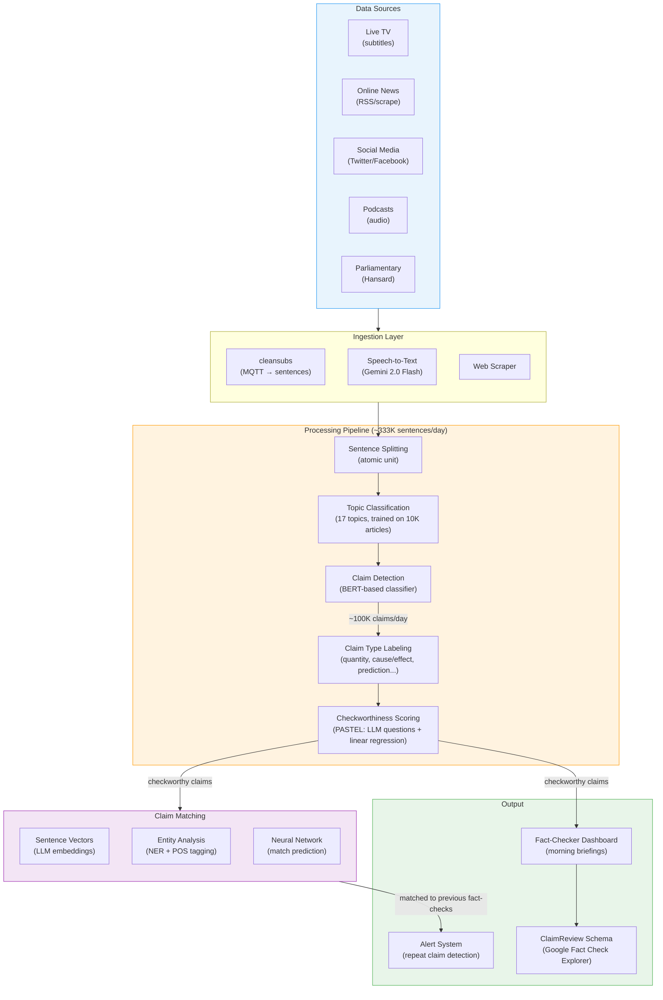

# What FactHarbor Can Learn from Full Fact AI

**Organization:** Full Fact (UK independent fact-checking charity, founded 2009)
**Links:** [fullfact.org](https://fullfact.org) | [fullfact.ai](https://fullfact.ai) | [GitHub](https://github.com/FullFact) | [PASTEL paper (arXiv:2309.07601)](https://arxiv.org/abs/2309.07601)
**Reviewed by:** Claude Opus 4.6 (2026-02-22)

> **Related docs:** [Global Landscape](Global_FactChecking_Landscape_2026.md) for competitive positioning, [Executive Summary](EXECUTIVE_SUMMARY.md) for prioritized action items, [Research Ecosystem](Stammbach_Research_Ecosystem_and_FactHarbor_Opportunities.md) for the broader debate landscape.

---

## 1. Full Fact AI in Brief

**The world's #1 deployed AI-assisted fact-checking system.** Full Fact AI processes ~333,000 sentences daily, identifies ~100,000 potential claims, and is licensed to 45+ organizations in 30+ countries across 3 languages. Battle-tested in 12+ national elections including the UK 2024 election (136M words) and 7 African elections.

**Key philosophy:** AI assists, humans decide. Full Fact deliberately does NOT automate verdicts: *"We never ask it 'Is this claim true?' because no model can reliably answer that."* Their AI handles scale (detection, classification, matching); human fact-checkers handle judgment (verdicts, context, publication).

**CEO:** Chris Morris (former founder of BBC Reality Check, since Oct 2023)
**Head of AI:** Andrew Dudfield (since 2019, formerly Chief Publishing Officer at ONS)
**Lead Data Scientist:** David Corney (NLP specialist, since 2019)
**AI team size:** 8 people within ~35 total staff

---

## 2. Full Fact AI Architecture

### 2.1 High-Level Pipeline



### 2.2 The Funnel Architecture

Full Fact's key design insight: **reduce volume at every stage**.

```
Raw text        → ~333,000 sentences/day
Topic filter    → Relevant topics only
Claim detection → ~100,000 claims/day
Type filter     → Remove predictions, opinions
Checkworthiness → Tens of thousands prioritized
Claim matching  → Previously-checked claims flagged
Human review    → Fact-checkers see only the highest-priority claims
```

This is fundamentally different from FactHarbor's approach: Full Fact processes millions of sentences to find the few worth checking; FactHarbor receives a single user-submitted claim and analyzes it deeply. **Full Fact solves breadth; FactHarbor solves depth.**

---

## 3. Key Technical Components

### 3.1 PASTEL — Checkworthiness Scoring (Open Source)

**Repo:** [github.com/FullFact/pastel](https://github.com/FullFact/pastel)
**Paper:** [arXiv:2309.07601](https://arxiv.org/abs/2309.07601) (Sheffield University concept)

PASTEL uses a series of yes/no questions posed to a generative AI model about each sentence. Answers are combined into a checkworthiness score via linear regression.

**How it works:**
1. A set of yes/no questions (features) is defined — e.g., *"Could believing this claim harm someone's health?"*
2. All questions are sent to Gemini in a single prompt per sentence
3. Answers map to: yes=1.0, no=0.0, unsure=0.5
4. Final score = dot product of answer vector × learned weight vector
5. Weights learned via `scipy.optimize.least_squares` (linear regression)
6. Feature selection via beam search — explores combinations of questions to find optimal model

**Key files:**
- `src/pastel/pastel.py` — Core `Pastel` class: `make_prompt()`, `get_scores_from_answers()`
- `src/pastel/optimise_weights.py` — Weight learning via `least_squares`
- `src/pastel/pastel_functions.py` — 11 deterministic features: `is_short`, `has_number`, `is_claim_type_*`
- `src/training/beam_search.py` — Feature selection across millions of question combinations
- `src/training/cached_pastel.py` — SQLite-cached Gemini responses for efficient experimentation

**Model:** Google Gemini (configurable, default: `gemini-2.5-flash-lite`)

**FactHarbor relevance:** PASTEL's approach — LLM-scored yes/no questions combined via linear regression — is an elegant way to create checkworthiness scoring without expensive fine-tuning. Could inform FactHarbor's claim verifiability scoring (Priority #4).

### 3.2 genai-utils — Gemini Wrapper Library (Open Source)

**Repo:** [github.com/FullFact/genai-utils](https://github.com/FullFact/genai-utils)

Full Fact's standardized interface to Google Gemini. Key design decisions:
- **Temperature always 0** for deterministic outputs
- **Structured output** via Pydantic schemas
- **Multimodal support** (video processing via GCS URIs)
- **Grounding** with Google Search (inline citations)
- **Safety settings:** All categories set to `BLOCK_NONE`
- **Fuzzy matching** via `rapidfuzz` for linking quotes to source sentences
- **JSON repair** via `json_repair` library for malformed LLM output

**FactHarbor relevance:** The `json_repair` pattern for handling malformed LLM JSON and `rapidfuzz` for fuzzy quote matching are practical utilities worth adopting.

### 3.3 Project Raphael — Health Misinformation Detection (Open Source)

**Repo:** [github.com/FullFact/health-misinfo-shared](https://github.com/FullFact/health-misinfo-shared)
**Collaboration:** Full Fact + Google

The most comprehensive open-source repository. Implements a full pipeline for detecting harmful health misinformation in YouTube/TikTok videos.

**Pipeline:**
```
Video → Download (yt-dlp) → Transcript Extraction → Chunking →
Claim Extraction (Gemini) → Multi-Label Classification (5 dimensions) →
Harm Scoring (weighted categories) → Flask Web UI
```

**5-dimension classification per claim:**

| Dimension | Values |
|-----------|--------|
| **Understandability** | understandable, vague, not understandable |
| **Type of Claim** | opinion, personal, citation, hedged, statement of fact, advice, promotion, not a claim |
| **Medical Claim Type** | symptom, cause/effect, correlation, prevention, treatment, outcome, statistics, not medical |
| **Support** | uncontroversial, disputed, widely discredited, novel, can't tell |
| **Harm** | high harm, some harm, low harm, indirect, harmless, can't tell |

**Harm scoring formula:**
```python
CATEGORY_WEIGHTS = {
    "understandability": 15, "type_of_claim": 10,
    "type_of_medical_claim": 5, "support": 7, "harm": 10
}
# Score = sum(label_score × category_weight)
# Worth checking: score > 200 (max: 310)
# May be worth checking: 100 < score ≤ 200
# Not worth checking: score ≤ 100 (min: -435)
```

**FactHarbor relevance:** The multi-dimensional claim classification and weighted harm scoring could inform FactHarbor's claim verifiability scoring and evidence sufficiency gate.

### 3.4 cleansubs — Live TV Subtitle Processing (Open Source)

**Repo:** [github.com/FullFact/cleansubs](https://github.com/FullFact/cleansubs) (since 2017)

Consumes MQTT subtitle streams and transforms raw text into clean sentences. Handles abbreviations, decimal numbers, URLs, additive subtitles, and quotation marks. This is the ingestion layer for broadcast monitoring.

### 3.5 Claim Matching System (Proprietary)

Not open-sourced. Evolution:
1. **Phase 1 (2019-2022):** Fine-tuned BERT for sentence-pair match/no-match + entity analysis + POS tagging → neural network match prediction
2. **Phase 2 (2023+):** Generative AI models (likely Gemini), fewer training examples needed, easier cross-lingual adaptation
3. **Phase 3 (current):** PASTEL + GenAI + fuzzy matching via `rapidfuzz`

**Training data:** Internal annotations + "Claim Challenge" crowdsourcing (4,000+ volunteers matched 250,000 claims)

### 3.6 Statistical Fact Checking

Automated pipeline that:
1. Identifies topic, trend, values, dates, and location of statistical claims
2. Cross-references with UK Office for National Statistics data
3. Supported by `nso-stats-fetcher` (fetches CPI/inflation from 8+ countries' statistical offices)

**FactHarbor relevance:** Statistical claims are a category where automated verification is most tractable. This could inform a future statistical verification module.

---

## 4. Models Used

| Component | Model | Purpose |
|-----------|-------|---------|
| Claim matching (historical) | Fine-tuned BERT | Sentence-pair match prediction |
| Checkworthiness (PASTEL) | Gemini 2.5 Flash Lite | Yes/no question answering |
| Health claim extraction | Gemini 2.0 Flash Lite | Claim extraction from transcripts |
| Multimodal analysis | Gemini 2.0 Flash Lite | Video claim extraction |
| Fine-tuning (historical) | text-bison@002 (PaLM) | Health claim classification |
| Transcription | Gemini 2.0 Flash | English/French ASR |
| Topic classification | Conventional ML | 17-topic categorization |

**Infrastructure:** Exclusively Google/GCP — Gemini, Vertex AI, GCS, Chirp ASR. No Anthropic, OpenAI, or open-weight models in evidence.

---

## 5. What Full Fact Does NOT Do (and Why It Matters)

Full Fact deliberately avoids automated verdicts:

> *"We will always keep human experts in the loop, partly to minimise the risks around bias and hallucinations that come with fully-automated systems but mostly because even the most advanced AI does not come close to human reasoning."*

**Why this matters for FactHarbor:** Full Fact's position creates a clear market gap. They have solved the **detection problem** (finding claims worth checking at massive scale) but deliberately leave the **verdict problem** unsolved. FactHarbor's multi-agent debate is designed precisely for the verdict problem. This makes the two systems **complementary rather than competitive**: Full Fact's monitoring frontend + FactHarbor's verdict engine.

---

## 6. Lessons for FactHarbor

### Lesson 1: The Funnel Architecture for Monitoring Mode

Full Fact's most important architectural insight is the funnel: raw text → sentences → claims → checkworthy claims → matched claims → human review. Each stage reduces volume by an order of magnitude.

**For FactHarbor (Priority #18 — monitoring mode):** If FactHarbor ever builds a monitoring capability, the funnel pattern is the proven architecture. But this is a fundamentally different product from the current deep-analysis pipeline. Don't try to bolt monitoring onto the existing architecture — it would need a separate ingestion/classification layer feeding into the existing verdict engine.

### Lesson 2: PASTEL's LLM-as-Feature-Extractor Pattern

PASTEL's innovation: use an LLM to answer simple yes/no questions, then combine answers via conventional ML (linear regression). This is cheaper and more interpretable than using the LLM for the final decision.

**For FactHarbor:** This pattern could power the claim verifiability scoring (Priority #4). Instead of a single expensive LLM call to score verifiability, pose 5-10 yes/no questions via a cheap model (Haiku), then combine via learned weights. Benefits: cheaper, more interpretable, tunable without prompt engineering.

### Lesson 3: Harm Scoring Framework

Raphael's 5-dimension classification with weighted scoring is a systematic way to prioritize claims by real-world impact. The dimensions (understandability, claim type, support status, harm potential) are domain-adaptable.

**For FactHarbor:** Could inform the evidence sufficiency gate (Priority #1). A claim's "worthiness" for deep analysis could be scored on multiple dimensions — verifiability, specificity, public interest, potential harm — each weighted and combined. This is richer than a binary "proceed/don't proceed" gate.

### Lesson 4: Crowdsourced Training Data at Scale

Full Fact's "Claim Challenge" engaged 4,000+ volunteers to match 250,000 claims. This crowdsourcing model produced training data that would have been prohibitively expensive to create with paid annotators.

**For FactHarbor:** Not immediately actionable (FactHarbor is pre-release), but worth noting for future benchmark creation. Crowdsourced annotation could help build a FactHarbor-specific claim verification dataset.

### Lesson 5: Statistical Verification as Low-Hanging Fruit

Full Fact's `nso-stats-fetcher` automates the simplest form of fact-checking: comparing numerical claims against authoritative statistical databases. This is deterministic, high-confidence, and requires no LLM for the verification step.

**For FactHarbor:** Statistical claims (inflation rates, population numbers, election results) are the easiest category to verify automatically with high confidence. A "statistical verification module" that checks claims against government databases could handle a meaningful subset of claims without the full debate pipeline.

### Lesson 6: Google-Centric vs. Multi-Provider Strategy

Full Fact is entirely Google/GCP-dependent (Gemini models, Vertex AI, GCS). This creates a single point of failure — as demonstrated when Google cut all funding in October 2025 (>GBP 1M/year lost).

**For FactHarbor:** FactHarbor's multi-provider strategy (Anthropic, OpenAI, Google, Mistral) is a genuine differentiator. It provides resilience against any single provider's decisions and enables cross-provider quality comparison. Full Fact's Google dependency is a cautionary tale.

### Lesson 7: ClaimReview Schema for Output Distribution

Full Fact publishes fact-checks using [ClaimReview](https://schema.org/ClaimReview) structured data, which Google, Facebook, Bing, and YouTube index. Their WordPress plugin makes this easy for any fact-checking organization.

**For FactHarbor:** When FactHarbor publishes reports, emitting ClaimReview schema would make results indexable by search engines and social media platforms — instant distribution without building a separate platform.

---

## 7. Cooperation Opportunity

Full Fact is the **#1 cooperation priority** identified in the [Global Landscape investigation](Global_FactChecking_Landscape_2026.md#5-cooperation-strategy).

| What Full Fact Offers | What FactHarbor Offers |
|----------------------|----------------------|
| Monitoring at scale (333K sentences/day) | Automated verdict engine (the step Full Fact won't build) |
| 45+ org network in 30+ countries | Multi-agent debate with calibration methodology |
| Election monitoring expertise | Cross-provider LLM comparison |
| IFCN/EFCSN credibility | Open-source implementation |
| Crowdsourced training data pipeline | Evidence-weighted contestation logic |

**The complementarity is structural:** Full Fact finds claims but won't automate verdicts. FactHarbor automates verdicts but doesn't find claims. Together: Full Fact's monitoring frontend → FactHarbor's verdict engine → Full Fact's distribution network.

**Contact path:** Andrew Dudfield (Head of AI) is the right person. The PASTEL open-source work suggests openness to technical collaboration. Full Fact's funding crisis (Google exit in Oct 2025) may increase interest in partnership models that don't depend on Big Tech grants.

---

## 8. Funding and Sustainability Context

Full Fact faces an existential funding challenge:

| Year | Income (GBP) | Key Events |
|------|-------------|------------|
| 2016 | 627K | Google Digital News Initiative grant |
| 2019 | — | Won Google.org AI Impact Challenge ($2M + 7 Fellows) |
| 2021 | 2.45M | Meta TPFC revenue growing |
| 2024 | 2.92M | Peak funding year |
| 2025 | — | **Google ends all support** (>GBP 1M/year); Meta ends US TPFC |

**Top funders (2024):** Google.org (GBP 443K), individual donors (403K), Meta (353K), Mohn Westlake Foundation (250K), Health Foundation (173K).

**Implications:** Full Fact is "urgently refocusing fundraising." The simultaneous loss of Google and Meta US support creates both crisis and opportunity — they may be more open to partnership models that demonstrate value without Big Tech dependency. FactHarbor's open-source, multi-provider approach could be attractive.

---

## 9. Academic Papers and Key Publications

| Paper | Venue | Year | Relevance |
|-------|-------|------|-----------|
| Konstantinovskiy et al., "Toward Automated Factchecking" | ACM DTRAP | 2021 | Claim detection annotation schema + BERT classifier (F1=0.83) |
| Babakar & Moy, "The State of Automated Factchecking" | Full Fact report | 2016 | Seminal whitepaper on the field |
| Nakov, Corney et al., "Automated Fact-Checking for Assisting Human Fact-Checkers" | IJCAI 2021 | 2021 | Survey of human-in-the-loop approaches |
| Dudfield & Dodds, "Enriching Claim Reviews" | Schema.org blog | 2021 | ClaimReview extensions |
| Warren et al., "Show Me the Work: Fact-Checkers' Requirements for Explainable AFC" | CHI 2025 | 2025 | Explanation needs in automated fact-checking |

**Note:** Full Fact's core claim matching system is NOT published — only the PASTEL checkworthiness scorer and Raphael health misinfo pipeline are open-source.

---

## 10. Summary: Full Fact vs. FactHarbor

| Dimension | Full Fact AI | FactHarbor |
|-----------|-------------|------------|
| **Focus** | Claim detection at scale (breadth) | Claim verification in depth (depth) |
| **Verdict approach** | Human only — AI assists | Automated — multi-agent debate |
| **Scale** | 333K sentences/day, 45+ orgs | Single claims, user-submitted |
| **LLM provider** | Google only (Gemini) | Multi-provider (Anthropic, OpenAI, Google, Mistral) |
| **Open source** | PASTEL + Raphael + cleansubs | Full pipeline (pre-release) |
| **Calibration** | None published | C18/C13 methodology |
| **Funding** | GBP 2.9M/year (non-profit, in crisis) | Self-funded (pre-release) |
| **Maturity** | 7 years of production deployment | Pre-release |
| **Election coverage** | 12+ national elections | None yet |

**The bottom line:** Full Fact is the benchmark for AI-assisted fact-checking at scale. FactHarbor should learn from their funnel architecture, PASTEL methodology, and harm scoring framework — but FactHarbor's unique value is the verdict automation that Full Fact deliberately avoids. They are natural complements, not competitors.
