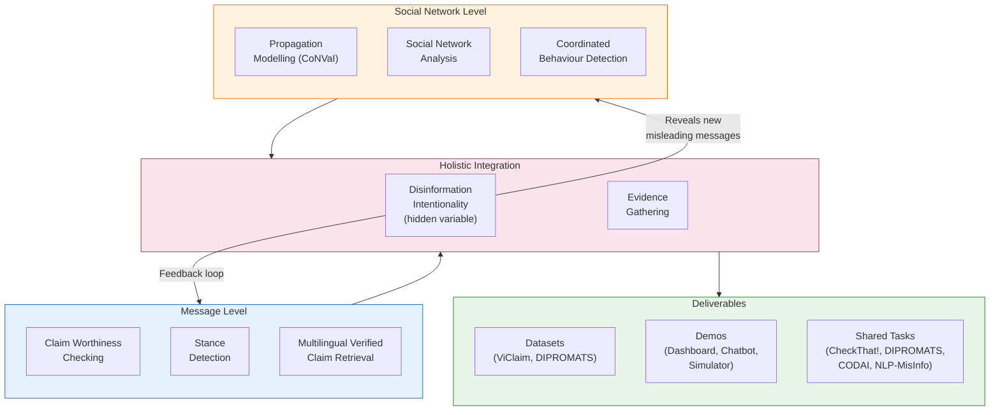
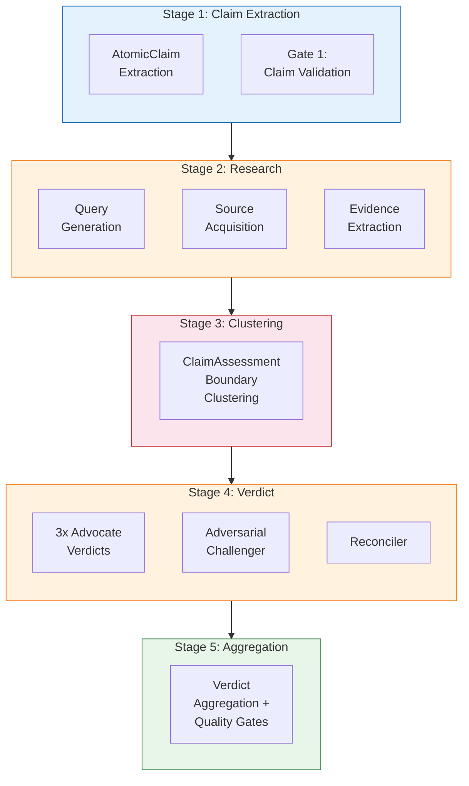

# What FactHarbor Can Learn from HAMiSoN

**Project:** Penas, Deriu, Sharma, Valentin et al. (2023-2025). *Holistic Analysis of Organised Misinformation Activity in Social Networks (HAMiSoN).* CHIST-ERA ERA-NET, Call 2021.
**Links:** [Project Website (UNED)](https://nlp.uned.es/hamison-project/) | [ZHAW Project Page](https://www.zhaw.ch/en/research/project/74234) | [CHIST-ERA](https://www.chistera.eu/projects/hamison) | [Zenodo Community](https://zenodo.org/communities/hamison-project/records)
**Reviewed by:** Claude Opus 4.6 (2026-03-24)

> **Related docs:** [ViClaim (EMNLP 2025)](ViClaim_EMNLP2025_Lessons_for_FactHarbor.md) for the flagship claim detection dataset produced by HAMiSoN. [CheckThat! Lab Analysis](CheckThat_Lab_Lessons_for_FactHarbor.md) for the shared task where ZHAW placed 2nd using HAMiSoN research. [Innosuisse Partnership Briefing](../WIP/2026-03-24_Innosuisse_Partnership_Research_Briefing.md) for the ZHAW collaboration strategy. [Executive Summary](EXECUTIVE_SUMMARY.md) for the consolidated priority table.

---

## 1. HAMiSoN in Brief

**Holistic Analysis of Organised Misinformation Activity in Social Networks.**

A 36-month, EUR 1.1M multi-national research project (Jan 2023 — Dec 2025) that tackles organised disinformation campaigns holistically — combining message-level analysis (claim detection, stance detection, verified claim retrieval) with social network-level analysis (propagation modelling, source identification, coordinated behaviour detection). The key innovation is treating **disinformation intentionality** as the hidden variable connecting both levels.

### Project Consortium

| Institution | Country | Role | Key Researchers |
|-------------|---------|------|-----------------|
| **UNED** (Universidad Nacional de Educacion a Distancia) | Spain | **Coordinator** | Prof. Anselmo Penas (PI), Prof. Alvaro Rodrigo, Roberto Centeno |
| **ZHAW** Centre for AI (CAI) | Switzerland | Partner | Dr. Jan Milan Deriu (co-PI), Prof. Mark Cieliebak, Pius von Daniken, Patrick Giedemann |
| **University of Tartu** | Estonia | Partner | Prof. Rajesh Sharma |
| **Synapse Developpement** (private company) | France | Partner | Guilhem Valentin (CTO) |

**Funding:** CHIST-ERA (ANR-22-CHR4-0004), with national agencies: SNSF (Switzerland), AEI (Spain), ETAg (Estonia), ANR (France).

### Project Architecture

*HAMiSoN's two-level architecture. Message-level tasks (claim detection, stance, retrieval) feed into network-level analysis (propagation, coordination). Disinformation intentionality acts as the hidden variable connecting both — refined evidence cycles back to both levels in a virtuous loop. The project produced datasets, demos, and organized shared tasks as key deliverables.*

### FactHarbor's Equivalent Pipeline (Current — 2026-03)

*FactHarbor operates as a single-user pipeline (input → verdict), while HAMiSoN targets organised campaign detection at scale. The overlap is strongest at the message level — HAMiSoN's claim worthiness maps to Stage 1, stance detection parallels Stage 4's adversarial debate, and verified claim retrieval relates to Stage 2's evidence acquisition.*

---

## 2. Publication Output — 30+ Papers

HAMiSoN produced an exceptional publication record across top venues:

| Venue | Year | Paper | FactHarbor Relevance |
|-------|------|-------|---------------------|
| **EMNLP 2025** (main) | 2025 | ViClaim: Multilingual claim detection in videos | **HIGH** — claim detection dataset + benchmark |
| **IJCAI 2025** | 2025 | CoNVaI: Misinformation diffusion simulation | LOW — network-level, not pipeline |
| **ICWSM 2024** | 2024 | Quantification with minimal in-domain annotations (CPCC/BCC) | **MEDIUM** — domain adaptation with N=100 samples |
| **CASE 2024** (×4) | 2024 | ClimateActivism stance detection (4 system papers) | **MEDIUM** — stance detection methods |
| **IEEE Access** | 2024 | Automatic narrative identification | LOW — narrative focus |
| **Internet Research** | 2024 | Propaganda technique roadmap | LOW — propaganda focus |
| **IEEE TCSS** | 2024 | AMIR: Automated Misinformation Rebuttal System | **MEDIUM** — rebuttal generation |
| **SNAM** | 2024 | GAME-ON: Multimodal fake news detection | LOW — graph networks for images |
| **MISDOOM 2023** | 2023 | HAMiSoN project overview | REFERENCE — project architecture |
| **CLEF 2023** | 2023 | ZHAW-CAI CheckThat! kernel ensemble (2nd place) | **HIGH** — claim detection method |
| **ASONAM 2023** | 2023 | RL over knowledge graphs for explainable fact-checking | **MEDIUM** — explainable verdicts |
| **CIKM 2023** | 2023 | Misinformation Concierge | LOW — chatbot interface |

Full publication list with 30+ papers: [HAMiSoN Results](https://nlp.uned.es/hamison-project/results.html)

---

## 3. Datasets Created

| Dataset | Size | Languages | Description | Access |
|---------|------|-----------|-------------|--------|
| **ViClaim** | 1,798 videos / 17,116 sentences | EN, DE, ES | Multi-label claim detection in video transcripts (FCW/FNC/OPN) | [Zenodo](https://zenodo.org/doi/10.5281/zenodo.14677820) |
| **HAMiSoN Social Media** | 239 KB CSV | — | Social media claim annotation dump | [Zenodo](https://zenodo.org/records/10815057) |
| **DIPROMATS 2024** | 12K EN + 9.5K ES tweets | EN, ES | Propaganda detection in diplomatic tweets | [Zenodo](https://zenodo.org/records/12663310) |

---

## 4. Demos and Tools

1. **Interactive Dashboard** — OpenSearch-based visual analysis with network displays, emotion/sentiment/stance overlays. Demo: COP27 tweets. URL: https://pegaso.lsi.uned.es/opensearch-dashboards
2. **Information Diffusion Simulator** — Agent-based modelling (CoNVaI) for simulating misinformation propagation. URL: https://pegaso.lsi.uned.es/repast-server/
3. **Fact-Checking Chatbot** — Sources: Snopes, Maldita, GoogleFacts. Languages: FR, EN, ES. Built by Synapse Developpement.
4. **Kaggle Challenge** — ViClaim-based claim detection competition. URL: https://www.kaggle.com/competitions/hamison-claim-annotation-challenge

---

## 5. Key Methods and Models

| Task | Model | Performance | Notes |
|------|-------|-------------|-------|
| **Claim Detection** (ViClaim) | XLM-RoBERTa-Large (550M) | F1 0.90 (FCW), 0.78 (FNC), 0.84 (OPN) | Best overall — outperforms 3B-7B decoder models |
| **Claim Detection** (ViClaim) | LLama3.2-3B (QLoRA) | F1 0.90 (FCW), 0.77 (FNC), 0.83 (OPN) | Nearly matches XLM-R at 5.5x size |
| **Claim Detection** (ViClaim) | o3-mini (zero-shot) | F1 0.78 (FCW), 0.54 (FNC), 0.78 (OPN) | Substantially worse than fine-tuned models |
| **Check-Worthiness** (CheckThat!) | Kernel ensemble (TF-IDF+SVM, BERT, RoBERTa, ViT) | F1 0.708 (2nd/7 teams) | Multimodal tweets |
| **Stance Detection** | RoBERTa + Llama 2 ensemble | 4th place (ClimateActivism 2024) | Would have been 1st with best config |
| **Quantification** | CPCC/BCC (novel methods) | Outperforms classify-and-count | Adapts with only N=100 domain samples |
| **Explainable Fact-Checking** | RL over knowledge graphs | — | Human-readable explanation paths |
| **Fake News Detection** | GAME-ON (Graph Attention Network) | +11% over baselines, 65% fewer params | Multimodal fusion |

---

## 6. Key Lessons for FactHarbor

### L1: Fine-Tuned Encoders Beat Zero-Shot LLMs for Classification

HAMiSoN's most consistent finding across ViClaim and CheckThat!: **XLM-RoBERTa-Large (550M params) outperforms or matches models 5-14x larger** for binary/multi-label classification tasks. Zero-shot o3-mini is 12 points behind on FCW detection. This aligns with Factiverse's finding (fine-tuned XLM-R beats GPT-4 on NLI).

**FactHarbor implication:** Stage 1 claim extraction and evidence relevance filtering could benefit from a fine-tuned encoder model rather than relying solely on LLM calls. This is especially relevant for the "low-resource fact-checking" Innosuisse angle — a distilled claim detection model could replace expensive LLM calls for the classification subtask.

### L2: Domain Transfer is the Hard Problem

ViClaim's leave-topic-out experiments show F1 drops from 0.80 to 0.69 when the test topic is unseen (League of Legends). Written → spoken text transfer is even worse (F1 0.69 → 0.32). Cross-domain generalization remains fragile.

**FactHarbor implication:** FactHarbor's topic-agnostic design is correct but challenging. The pipeline should not assume that methods tuned on political claims generalize to scientific, medical, or entertainment domains without validation. The Stage 2 research loop (iterative evidence gathering) partially compensates by grounding verdicts in retrieved evidence rather than model priors.

### L3: Holistic > Isolated Pipeline Stages

HAMiSoN's central thesis is that message-level analysis (what's being said) and network-level analysis (who's saying it and how it spreads) should feed each other. Currently, FactHarbor only operates at the message level.

**FactHarbor implication:** Future consideration: source credibility signals (who published this, how it propagated, coordination patterns) could strengthen evidence quality assessment. This isn't immediate — but HAMiSoN's propagation modelling (CoNVaI) shows that *context of dissemination* carries veracity signal.

### L4: Minimal Domain Adaptation Works (N=100)

The ICWSM 2024 paper on CPCC/BCC shows that novel quantification methods can adapt to new domains with as few as **100 labelled samples** — outperforming standard classify-and-count. This is highly relevant for any system that needs to work across domains.

**FactHarbor implication:** If FactHarbor ever fine-tunes models for specific domains (e.g., health claims, climate claims), HAMiSoN's CPCC/BCC methods show this can be done with minimal labelled data — 100 examples per domain, not thousands.

### L5: Multi-Label Claim Taxonomy is More Realistic

ViClaim uses three labels (FCW/FNC/OPN) instead of binary check-worthy/not. This captures the reality that sentences often contain both factual claims and opinions simultaneously. The multi-label approach with soft labels (MACE Bayesian model) handles annotator disagreement gracefully.

**FactHarbor implication:** FactHarbor's AtomicClaim extraction currently treats claims as binary (verifiable or not). A more nuanced taxonomy — distinguishing check-worthy facts from non-check-worthy facts from opinions — could improve claim prioritization and prevent wasted research cycles on unverifiable statements.

### L6: Kernel Ensemble for Heterogeneous Classifiers

ZHAW's CheckThat! 2023 approach combined fundamentally different feature spaces (TF-IDF, transformer embeddings, vision features) using kernel averaging rather than naive prediction averaging. This principled combination outperformed systems using single complex multimodal architectures.

**FactHarbor implication:** FactHarbor's Stage 4 debate already uses temperature variation for diversity. The kernel ensemble concept could extend to combining evidence from structurally different sources (web search results, academic papers, fact-check databases) in a more principled way than simple concatenation.

### L7: Organised Campaign Detection as a Future Layer

HAMiSoN's network-level tools (propagation simulators, coordination detectors) address a threat model FactHarbor currently ignores: coordinated inauthentic behaviour. When multiple sources making the same claim are actually part of the same campaign, counting them as independent evidence is wrong.

**FactHarbor implication:** Long-term consideration for evidence quality assessment: detecting when multiple "independent" sources trace back to a coordinated campaign. Not immediate priority, but architecturally worth noting — source independence is currently assumed, not verified.

---

## 7. CHIST-ERA Call Context

HAMiSoN was one of **4 projects funded** under the OSNEM topic (Online Social Networks and Media) in CHIST-ERA's 2021 call:

| Project | Focus | Countries |
|---------|-------|-----------|
| **HAMiSoN** | Organised misinformation, holistic analysis | CH, ES, EE, FR |
| **CON-NET** | Content + network structure for misbehaviour | BE, FI, IE, LU, TR |
| **iTRUST** | Polarisation interventions for trustworthy social media | BE, CH, ES, PL |
| **MARTINI** | Malicious actor profiling in social networks | EE, ES, FR, LT, TR |

The OSNEM call focused on: identifying malicious entities, detecting low-credibility information and fake news, and user awareness of misbehaviours.

---

## 8. Relevance for Innosuisse Partnership

HAMiSoN demonstrates that ZHAW's NLP group can:
- **Lead research in a large consortium** (not just participate — Deriu was co-PI)
- **Produce top-venue publications** (EMNLP main, IJCAI, ICWSM, CLEF)
- **Create reusable research artifacts** (datasets, shared tasks, demos)
- **Deliver on time** (36-month project completed on schedule, 30+ publications)
- **Work across languages** (EN, DE, ES + FR, EE through consortium partners)

For an Innosuisse proposal, HAMiSoN is proof that ZHAW can execute a multi-year research collaboration with an industry-relevant output. The research questions that HAMiSoN didn't address — automated verdict generation, evidence-weighted multi-agent debate, resource-efficient pipeline deployment — are exactly what FactHarbor brings.

---

## Sources

- [HAMiSoN Project Website](https://nlp.uned.es/hamison-project/)
- [HAMiSoN Results & Publications](https://nlp.uned.es/hamison-project/results.html)
- [ZHAW Project Page](https://www.zhaw.ch/en/research/project/74234)
- [CHIST-ERA Project Page](https://www.chistera.eu/projects/hamison)
- [ANR Reference](https://anr.fr/Project-ANR-22-CHR4-0004)
- [ViClaim (EMNLP 2025)](https://aclanthology.org/2025.emnlp-main.21/)
- [ZHAW-CAI CheckThat! 2023 (CEUR)](https://ceur-ws.org/Vol-3497/paper-048.pdf)
- [CoNVaI (IJCAI 2025)](https://www.ijcai.org/proceedings/2025/0029.pdf)
- [CPCC/BCC Quantification (ICWSM 2024)](https://ojs.aaai.org/index.php/ICWSM/article/view/31411)
- [HAMiSoN Zenodo Community](https://zenodo.org/communities/hamison-project/records)
- [HAMiSoN Kaggle Challenge](https://www.kaggle.com/competitions/hamison-claim-annotation-challenge)
- [MISDOOM 2023 Paper](https://link.springer.com/chapter/10.1007/978-3-031-47896-3_10)
