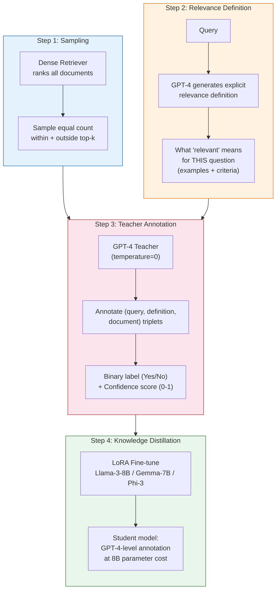
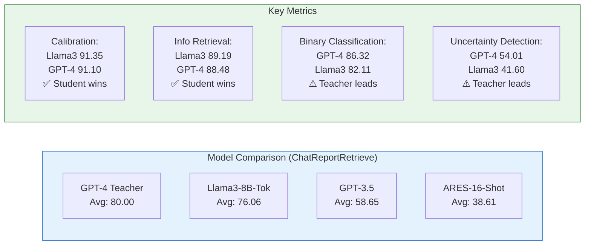
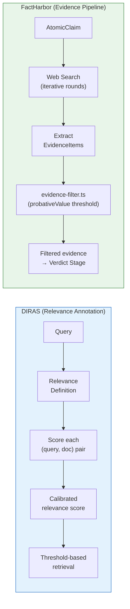
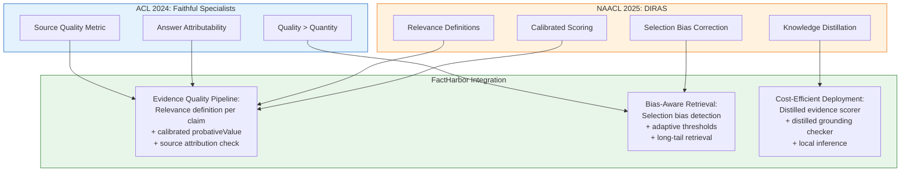

# DIRAS: Efficient LLM Annotation of Document Relevance for RAG — Lessons for FactHarbor

**Paper:** Ni, Schimanski, Lin, Sachan, Ash, Leippold (2025). *DIRAS: Efficient LLM Annotation of Document Relevance in Retrieval Augmented Generation.* NAACL 2025.
**Links:** [ACL Anthology](https://aclanthology.org/2025.naacl-long.271/) | [arXiv](https://arxiv.org/abs/2406.14162)
**Reviewed by:** Claude Opus 4.6 (2026-03-10)

> **Related docs:** [Faithful LLM Specialists (ACL 2024)](Schimanski_Faithful_LLM_Specialists_ACL2024.md) for the source attribution companion paper. [Climinator Analysis](Climinator_Lessons_for_FactHarbor.md) for the Mediator-Advocate debate deep-dive. [Executive Summary](EXECUTIVE_SUMMARY.md) for the consolidated priority table.

---

## 1. The Paper in Brief

RAG systems retrieve documents to ground LLM answers — but how do you know whether the retriever is finding the *right* documents? Manual annotation is expensive and suffers from **selection bias** (annotators only label a subset, so unlabeled documents are falsely assumed irrelevant). GPT-4 annotation is costly at scale.

**Solution:** DIRAS (Domain-specific Information Retrieval Annotation with Scalability) — a 3-step pipeline that:
1. Generates explicit **relevance definitions** per query (what "relevant" means for this specific question)
2. Uses GPT-4 as a **teacher** to annotate a sample of query-document pairs
3. **Distills** into a fine-tuned 8B model (Llama-3) that matches GPT-4 quality at a fraction of the cost

**Core insight:** An 8B student model matches or exceeds GPT-4 on relevance scoring after distillation — and when it disagrees with human labels at high confidence (>0.95), it is correct 85-96% of the time, effectively *correcting* human annotation errors.

### Paper Architecture

*DIRAS pipeline: balanced sampling avoids selection bias, explicit relevance definitions capture domain-specific nuance, GPT-4 teacher provides high-quality annotations, and knowledge distillation produces a cost-efficient student model for broad-scale annotation.*

### Calibration Methods

The paper tests multiple approaches to extract confidence scores from LLMs:

| Method | How It Works | Best For |
|--------|-------------|----------|
| **Ask** | LLM verbalizes a confidence score (0-1) in output | Ranking (ClimRetrieve nDCG: 77.23) |
| **Tok** | Confidence from token-level probability of Yes/No | Calibration quality (91.35 vs GPT-4's 91.10) |
| **Point-Ask-D** | Pointwise + Ask + relevance Definition | Overall best on ChatReportRetrieve (80.00) |

### Key Results

| Benchmark | Llama3-8B (DIRAS) | GPT-4 | Gap |
|-----------|-------------------|-------|-----|
| ChatReportRetrieve (avg) | 76.06 | 80.00 | -4.94 (close) |
| ClimRetrieve ranking (nDCG) | 77.23 | 75.55 | **+1.68 (student wins)** |
| ELI5 (nDCG) | 48.73 | 48.43 | +0.30 |
| ASQA (nDCG) | 64.90 | 64.62 | +0.28 |
| QAMPARI (nDCG) | 56.58 | 56.21 | +0.37 |
| RAG-Bench (nDCG) | **48.27** | 42.91 | **+5.36 (student wins)** |

**High-confidence disagreement accuracy** (when DIRAS contradicts human labels at >0.95 confidence):

| Dataset | Accuracy | Interpretation |
|---------|----------|---------------|
| ChatReportRetrieve | 85.48% | DIRAS corrects human bias |
| ELI5 | 85.05% | Generalizes to QA |
| ASQA | 90.09% | Strong on complex QA |
| RAG-Bench | 96.36% | Near-perfect correction |

### Counter-Intuitive Findings

1. **Chain-of-thought hurts.** CoT reasoning degraded performance across all architectures — removed from final method.
2. **Few-shot ICL fails.** ARES-16-Shot (38.61) dramatically underperformed zero-shot DIRAS (80.00) — examples biased GPT-4.
3. **Pointwise beats listwise** when combined with explicit relevance definitions.
4. **Relevance definitions help pointwise but hurt listwise** — different annotation paradigms need different prompting strategies.

---

## 2. Architecture Comparison: DIRAS vs FactHarbor Evidence Pipeline

| Dimension | DIRAS | FactHarbor | Implication |
|-----------|-------|------------|-------------|
| **What's scored** | (query, document) relevance | EvidenceItem probativeValue | Similar goal, different granularity |
| **Relevance definition** | Explicit, per-query, LLM-generated | Implicit in extraction prompt | DIRAS approach could improve FH evidence quality |
| **Scoring method** | Fine-tuned 8B model, calibrated confidence | LLM-assigned probativeValue (high/medium/low) | FH uses coarser scale; DIRAS is more principled |
| **Selection bias** | Explicitly addressed (balanced sampling) | Not addressed — web search results are what they are | FH inherits search engine selection bias |
| **Threshold strategy** | Adaptive per-query (recommended) | Fixed probativeValue cutoff | DIRAS suggests adaptive thresholds per claim |
| **Cost** | One-time distillation, then cheap inference | Per-analysis LLM calls | DIRAS model could run locally |
| **Domain** | Climate disclosures, QA benchmarks | Any domain (live web) | FH needs domain-agnostic relevance scoring |
| **Calibration** | Formal calibration metrics (ECE, Brier) | No formal calibration of probativeValue | Gap — FH has no measure of how well-calibrated quality scores are |

---

## 3. What FactHarbor Can Learn

### Lesson 1: Explicit Relevance Definitions Per Claim

**Paper insight:** Generating an explicit definition of "what counts as relevant evidence for this specific query" before scoring documents significantly improves annotation quality. The definition includes meaning explanation, concrete examples, and edge cases.

**FactHarbor implication:** Our evidence extraction prompt asks the LLM to extract evidence and assign probativeValue — but never explicitly defines what "relevant evidence" means for each specific AtomicClaim. Adding a per-claim relevance definition step (between claim extraction and evidence extraction) could sharpen what the LLM considers probative.

**Action:** Add a relevance definition generation step to the research stage — for each AtomicClaim, generate an explicit definition of what evidence would support, oppose, or be irrelevant to the claim. Pass this definition to evidence extraction and filtering prompts.

### Lesson 2: Threshold-Based Retrieval Over Fixed Top-K

**Paper insight:** Different queries need different amounts of relevant documents. A fixed top-k (or fixed probativeValue cutoff) is suboptimal — threshold-based retrieval adapts to the actual relevance distribution per query.

**FactHarbor implication:** Our evidence filter uses a fixed `probativeValueThreshold` (UCM-configurable). But some claims have abundant high-quality evidence while others have sparse, marginal evidence. An adaptive threshold per AtomicClaim — perhaps based on the distribution of probativeValue scores — could improve both precision (fewer marginal items for well-evidenced claims) and recall (lower bar for evidence-sparse claims).

**Action:** Evaluate adaptive probativeValue thresholds — e.g., if a claim has 8+ high-probative items, raise the threshold; if it has <3, lower it. Compare verdict quality vs. current fixed threshold.

### Lesson 3: High-Confidence Disagreements Are Diagnostic

**Paper insight:** When DIRAS disagrees with existing labels at >0.95 confidence, it is correct 85-96% of the time. This means high-confidence disagreements are a reliable signal for identifying annotation errors.

**FactHarbor implication:** Our grounding check (Haiku × 2) sometimes disagrees with the reconciler's evidence citations. Currently these disagreements are logged as advisory `info`-level warnings. The paper suggests that **high-confidence disagreements from validation should be treated as strong signals**, not just logged. A grounding check that confidently says "this evidence doesn't support this verdict" is probably right.

**Action:** Track grounding check confidence. When the validator confidently disagrees with the reconciler's evidence usage, consider escalating from `info` to `warning` or blocking.

### Lesson 4: Chain-of-Thought Can Hurt

**Paper insight:** CoT reasoning degraded relevance annotation performance across all architectures. The authors removed it from the final method.

**FactHarbor implication:** We use structured reasoning in multiple pipeline stages. This finding doesn't mean CoT is always bad — it specifically hurt *annotation* tasks where the model needs calibrated confidence scores. For FactHarbor, this is relevant to the **evidence quality assessment** step: if we ask the LLM to "explain why this evidence is relevant before scoring it," the explanation might anchor the score rather than improve it.

**Action:** A/B test evidence quality scoring with and without CoT reasoning. If CoT anchors probativeValue scores rather than improving them, remove it from that specific step.

### Lesson 5: Knowledge Distillation for Cost Reduction

**Paper insight:** A fine-tuned 8B model matches GPT-4 on relevance scoring. The distillation cost is one-time; inference is dramatically cheaper.

**FactHarbor implication:** FactHarbor runs ~40-50 LLM calls per analysis, many of which are evidence quality assessments. If a fine-tuned small model can do relevance scoring at GPT-4 quality, this could reduce per-analysis cost significantly — especially for the evidence extraction and filtering stages that currently use Haiku.

**Action (medium-term):** Explore distilling a relevance-scoring model fine-tuned on FactHarbor's evidence quality judgments. Requires: (1) collecting a training set of (claim, evidence, probativeValue) triplets from production analyses, (2) distilling from Sonnet/Opus teacher labels, (3) deploying locally. This is a collaboration research direction, not an immediate action.

### Lesson 6: Selection Bias in Evidence Retrieval

**Paper insight:** Annotating only top-k retrieved documents creates selection bias — important documents outside the initial retrieval window are never evaluated. DIRAS fixes this by sampling from the full distribution.

**FactHarbor implication:** Our web search returns whatever the search provider ranks highest. We never look beyond the first pages of results. Evidence that exists but isn't highly ranked by the search engine is invisible. This compounds with C13 (evidence pool asymmetry) — search engine ranking bias directly shapes our evidence pool.

**Action:** Consider adding a "long-tail retrieval" pass — after standard search, explicitly search with reformulated queries designed to find evidence the initial search may have missed. This aligns with existing Tier 2 action #9 (contrarian search pass) and #8 (debate-triggered re-search).

### Lesson 7: Calibrated Confidence > Binary Labels

**Paper insight:** Calibrated confidence scores (0-1) are more useful than binary relevant/irrelevant labels. The calibration quality of DIRAS (91.35) exceeds even GPT-4 (91.10).

**FactHarbor implication:** Our probativeValue is a coarse 3-level scale (high/medium/low). The paper demonstrates that continuous, calibrated scores are both achievable and more useful for downstream ranking. Moving probativeValue from categorical to a calibrated 0-1 score could enable more nuanced evidence weighting in verdict aggregation.

**Action:** Evaluate switching probativeValue from categorical (high/medium/low) to a continuous 0-1 scale with calibration validation. This would allow smoother evidence weighting in `aggregation.ts` rather than threshold-based filtering.

---

## 4. Collaboration Potential

### 4.1 What DIRAS Expertise Adds to Schimanski Partnership

The DIRAS paper adds three capabilities beyond the ACL 2024 Faithful Specialists paper:

| Capability | From ACL 2024 | Added by DIRAS |
|-----------|--------------|----------------|
| **What's measured** | Source citation quality + answer attributability | Document relevance scoring + calibration |
| **Bias correction** | Quality filtering of training data | Selection bias detection + correction |
| **Cost reduction** | Fine-tuned specialists match GPT-4 | Knowledge distillation: 8B model at GPT-4 quality |
| **Evaluation** | NLI-based entailment checking | Calibrated confidence with formal metrics |

### 4.2 Combined Research Directions

### 4.3 Strengthened Funding Case

With both papers, the collaboration covers:
- **Evidence quality** (ACL 2024: attribution) + **Evidence retrieval** (DIRAS: relevance scoring) = full evidence pipeline research
- **Cost reduction** through distillation — directly addresses Innosuisse's "innovation" requirement (from expensive API calls to local inference)
- **Bias correction** — DIRAS's selection bias work connects to FactHarbor's C13 evidence asymmetry challenge
- **Domain generalization** — both papers work on climate/sustainability; FactHarbor provides the domain-agnostic testbed

---

## 5. Risks and Caveats

1. **Domain gap.** DIRAS is validated on climate disclosures and scientific QA. FactHarbor's web evidence is noisier, more diverse, and includes opinion, news, and informal sources that corporate reports don't have.
2. **Relevance ≠ probative value.** A document can be highly relevant to a claim but have low probative value (e.g., an opinion piece about a scientific topic). DIRAS measures relevance; FactHarbor needs probative value — these are related but distinct concepts.
3. **Distillation requires training data.** Building a FactHarbor-specific relevance scorer requires collecting (claim, evidence, quality) triplets from production runs — which means running the expensive pipeline first to generate training data.
4. **CoT finding may not transfer.** CoT hurt *relevance annotation* specifically. It may still help verdict reasoning, evidence extraction, and other FactHarbor pipeline stages. Don't over-generalize this finding.
5. **Calibration infrastructure.** Switching to continuous probativeValue scores requires changes to evidence-filter.ts, aggregation.ts, and potentially the verdict prompts. Non-trivial refactor.

---

## 6. Prioritized Actions for FactHarbor

| Priority | Action | Effort | Impact | Depends on |
|----------|--------|--------|--------|------------|
| **P1** | Add per-claim relevance definition to research stage prompts | Low | High | None |
| **P2** | Evaluate adaptive probativeValue thresholds per claim | Medium | High | None |
| **P3** | Track grounding check confidence; escalate high-confidence disagreements | Low | Medium | None |
| **P4** | A/B test CoT vs. no-CoT in evidence quality scoring | Medium | Medium | None |
| **P5** | Evaluate continuous (0-1) probativeValue scale | Medium | Medium | Collaboration discussion |
| **P6** | Long-tail retrieval pass (reformulated queries) | Medium | High | Aligns with existing #8/#9 |
| **P7** | Explore knowledge distillation for evidence scoring (research direction) | High | High | Partnership + training data |

---

## 7. Connection to Existing Knowledge Base

### How DIRAS Relates to Other Analyses

| Existing Analysis | Connection |
|-------------------|------------|
| [Faithful LLM Specialists (ACL 2024)](Schimanski_Faithful_LLM_Specialists_ACL2024.md) | Companion paper — ACL 2024 measures answer faithfulness, DIRAS measures retrieval relevance. Together they cover the full evidence-to-verdict chain. |
| [Climinator](Climinator_Lessons_for_FactHarbor.md) | DIRAS could improve Climinator's RAG retrieval (Climinator uses top-8 similarity cutoff). FactHarbor's evidence filter is more sophisticated but lacks DIRAS's calibration rigor. |
| [Factiverse](Factiverse_Lessons_for_FactHarbor.md) | Factiverse uses fine-tuned XLM-RoBERTa for evidence classification. DIRAS uses fine-tuned Llama-3 for relevance scoring. Same principle: distilled specialist > general-purpose LLM for quality assessment. |
| [Global Landscape](Global_FactChecking_Landscape_2026.md) | DIRAS's selection bias finding reinforces C13 (evidence pool asymmetry) as the #1 gap. Search engine ranking bias = selection bias by another name. |
| [Epistemic Asymmetry](Truth_Seeking.md) | DIRAS shows that annotation selection bias systematically distorts quality assessment. Applies to evidence pool bias: what the search engine doesn't return is invisible, creating systematic asymmetry. |

### Updates to Priority Actions

DIRAS reinforces several existing priorities:

| Existing Priority | DIRAS Reinforcement |
|-------------------|-------------------|
| **#2** Pro/Con query separation (C13) | + Add relevance definitions per query direction |
| **#8** Debate-triggered re-search | + Frame as selection bias correction |
| **#9** Contrarian search pass | + DIRAS's balanced sampling principle applies |
| **#13** Benchmark against AVeriTeC | + DIRAS's calibration metrics as additional evaluation dimension |

---

## 8. References

### This Paper
- Ni, J., Schimanski, T., Lin, M., Sachan, M., Ash, E. & Leippold, M. (2025). DIRAS: Efficient LLM Annotation of Document Relevance in Retrieval Augmented Generation. *NAACL 2025*, pp. 5238-5258. [ACL Anthology](https://aclanthology.org/2025.naacl-long.271/) | [arXiv](https://arxiv.org/abs/2406.14162)

### Related Work by Same Authors
- Schimanski, T., Ni, J., Kraus, M., Ash, E. & Leippold, M. (2024). Towards Faithful and Robust LLM Specialists for Evidence-Based Question-Answering. *ACL 2024*. [Analysis](Schimanski_Faithful_LLM_Specialists_ACL2024.md)
- Schimanski, T. et al. (2024). ClimRetrieve: Benchmarking Dataset for Information Retrieval from Corporate Climate Disclosures. *EMNLP 2024*. [ACL Anthology](https://aclanthology.org/2024.emnlp-main.969/)
- Leippold, M., Vaghefi, S.A., Schimanski, T. et al. (2025). Automated fact-checking of climate claims with LLMs. *npj Climate Action*. [Analysis](Climinator_Lessons_for_FactHarbor.md)

### FactHarbor Context
- [Faithful LLM Specialists (ACL 2024)](Schimanski_Faithful_LLM_Specialists_ACL2024.md) — Source attribution companion paper
- [Climinator Analysis](Climinator_Lessons_for_FactHarbor.md) — Mediator-Advocate debate deep-dive
- [Executive Summary](EXECUTIVE_SUMMARY.md) — Consolidated priorities
