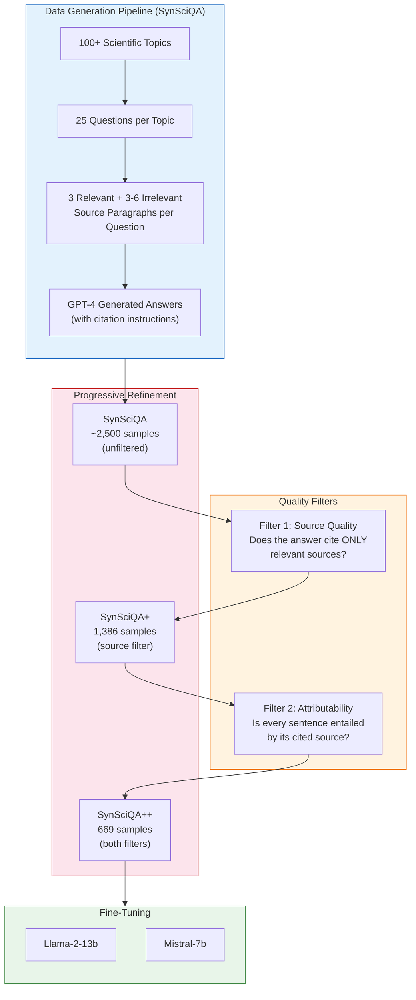
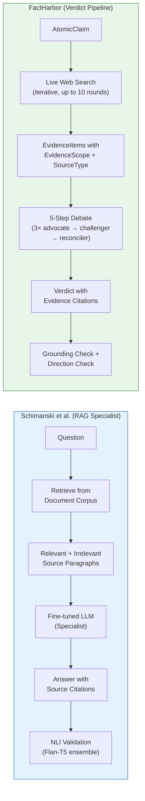
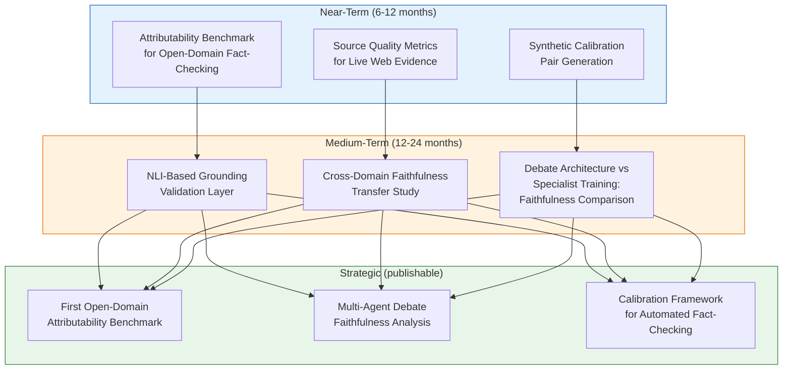

# Faithful & Robust LLM Specialists for Evidence-Based QA — Lessons for FactHarbor

**Paper:** Schimanski, Ni, Kraus, Ash, Leippold (2024). *Towards Faithful and Robust LLM Specialists for Evidence-Based Question-Answering.* ACL 2024.
**Links:** [ACL Anthology](https://aclanthology.org/2024.acl-long.105/) | [arXiv](https://arxiv.org/abs/2402.08277)
**Reviewed by:** Claude Opus 4.6 (2026-03-09)

> **Related docs:** [Executive Summary](EXECUTIVE_SUMMARY.md) for the consolidated priority table. [Climinator Analysis](Climinator_Lessons_for_FactHarbor.md) for the Mediator-Advocate debate deep-dive. [Meeting Prep: Ash](Stammbach_Ash_LLM_Political_Alignment_EMNLP2024.md) for broader Ash portfolio and calibration status.

---

## 1. The Paper in Brief

LLMs used for evidence-based question-answering have two failure modes: they cite irrelevant or nonexistent sources (**hallucinated citations**), and they produce answers that don't faithfully represent what the cited sources actually say (**unfaithful attribution**). Even GPT-4 scores only 62.7% on source quality in the authors' benchmark.

**Solution:** Generate synthetic training data with automated quality filters, then fine-tune smaller open-source LLMs into "specialists" that are measurably more faithful to their evidence sources than both zero-shot GPT-4 and models trained on unfiltered data.

**Core insight:** Data quality matters more than data quantity — 669 high-quality samples (SynSciQA++) outperform larger unfiltered datasets.

### Paper Architecture

*The SynSciQA pipeline: synthetic data generation → progressive quality filtering → specialist fine-tuning. The key innovation is the two-stage filtering: first removing samples with wrong source citations, then removing samples where answer sentences aren't entailed by their cited sources.*

### Quality Dimensions

The paper defines three evaluation dimensions:

| Dimension | Definition | How Measured |
|-----------|-----------|-------------|
| **Source Quality** | Answer cites ONLY relevant sources (no hallucinated citations) | Binary: all citations relevant, or zero citations when none relevant |
| **Format Quality** | Citations are properly placed and traceable | Structural check: (author, year, page) format |
| **Answer Attributability** | Every answer sentence is logically entailed by its cited source | NLI-based: ratio of entailed sentences to total sentences (Flan-T5 XL+XXL ensemble) |

### Key Results

| Model | Source Quality | Attributability | Notes |
|-------|--------------|-----------------|-------|
| GPT-4 (zero-shot) | 62.7% | 86.3% | Best closed-source baseline |
| Llama-2-13b (zero-shot) | 49.9% | 25.0% | Open-source baseline — dramatically worse |
| Llama-2-13b + SynSciQA (unfiltered) | ~55% | ~60% | Quantity alone helps some |
| Llama-2-13b + SynSciQA++ (filtered) | **~70%** | **~80%** | Quality filtering closes GPT-4 gap |
| Mistral-7b + SynSciQA++ (filtered) | **~72%** | **~82%** | Smaller model, better data → competitive |

**Out-of-distribution generalization:** Tested on 4 benchmarks ranging from in-domain to fully real-world (ChatReport, ClimateQA). Synthetic validation performance correlates >0.91 with real-world performance — meaning synthetic benchmarks predict real-world faithfulness.

**Overfitting risk:** Performance degrades after 2-3 epochs on most OOD benchmarks, even as in-domain improves. Training should be brief.

---

## 2. Architecture Comparison: Paper vs FactHarbor

| Dimension | Schimanski et al. | FactHarbor | Implication |
|-----------|-------------------|------------|-------------|
| **Evidence source** | Curated document corpus (RAG) | Live web search (dynamic) | FH has harder attribution problem — sources not pre-curated |
| **Citation fidelity** | Trained via quality filters on synthetic data | Prompt-instructed + post-hoc grounding check | Paper's approach could improve FH's grounding |
| **Verdict process** | Single LLM pass (specialist) | 5-step debate (~7 LLM calls per claim) | FH uses structure to compensate for lack of specialist training |
| **Faithfulness metric** | NLI-based attributability score (automated) | Grounding check (Haiku × 2, advisory) | FH's grounding check is similar in spirit, different in method |
| **Domain scope** | Scientific QA (synthetic), climate, sustainability | Any domain (domain-agnostic) | Paper's synthetic data approach could be adapted for FH domains |
| **Source quality metric** | Binary: all-relevant or zero-citation | probativeValue (high/medium/low) + evidence filter | FH uses richer quality taxonomy but lacks binary precision metric |
| **Hallucination control** | Training-time (specialist learns NOT to hallucinate) | Runtime (grounding check catches confabulation) | Complementary: training-time prevention + runtime detection |
| **Scale** | Single QA pair | Full analysis (multiple claims × multiple sources) | FH's multi-claim structure amplifies both attribution risks and opportunities |

---

## 3. What FactHarbor Can Learn

### Lesson 1: Source Quality as a Binary Gate

**Paper insight:** Source quality is binary — either the answer cites only relevant sources, or it doesn't. No partial credit.

**FactHarbor implication:** Our `probativeValue` (high/medium/low) and evidence filter apply quality gradients. But we lack a hard binary check: "Does this verdict cite ONLY evidence that actually supports/opposes the claim, or does it reference irrelevant material?" The grounding check (`validator` in verdict-stage) is advisory; converting it to a hard gate (analogous to the paper's source quality filter) would catch cases where the reconciler synthesizes a verdict referencing evidence that doesn't actually bear on the claim.

**Action:** Evaluate upgrading grounding check from advisory to gate for verdict sentences that cite evidence. If a verdict sentence cites evidence that doesn't entail the verdict's claim, flag or block.

### Lesson 2: Attributability > Correctness

**Paper insight:** The authors deliberately separate **faithfulness** (does the answer reflect what sources say?) from **helpfulness** (is the answer correct?). They optimize for faithfulness first.

**FactHarbor implication:** Our pipeline optimizes for verdict correctness (truthPercentage, confidence). But a verdict can be "correct" while misrepresenting its evidence — the LLM fills gaps with parametric knowledge. The paper's attributability metric (ratio of entailed sentences to total sentences) could be adapted as a post-verdict quality score: what fraction of the verdict's reasoning is actually traceable to cited EvidenceItems?

**Action:** Consider adding an **attributability score** per verdict — automated check of how much of the reconciler's reasoning is entailed by the cited evidence vs. generated from LLM parametric knowledge.

### Lesson 3: Quality Filtering > Quantity

**Paper insight:** 669 quality-filtered samples beat thousands of unfiltered samples. Training on noisy data teaches the model to be noisy.

**FactHarbor implication:** Directly applicable to our evidence pipeline. More search results ≠ better verdicts. The existing evidence filter (`evidence-filter.ts`) applies quality thresholds — but the paper suggests the filtering should be aggressive. Better to verdict on 3 high-attributability evidence items than 15 mixed-quality ones. This validates the `probativeValue` filtering approach and suggests the thresholds should err toward strictness.

**Action:** Validate that current evidence-filter thresholds are strict enough. Consider A/B testing: fewer high-probativeValue items vs. current volume.

### Lesson 4: Synthetic Benchmarks Predict Real-World Performance

**Paper insight:** Pearson correlation >0.91 between synthetic validation performance and real-world (OOD) performance. You don't need massive real-world test sets — well-designed synthetic benchmarks transfer.

**FactHarbor implication:** Our calibration harness uses 10 mirrored claim pairs — a small, curated set. The paper validates this approach: a well-designed small benchmark can predict real-world behavior. But the key is "well-designed" — the synthetic data must span the relevant variation (domains, languages, claim types). Currently our calibration pairs are hand-crafted. We could systematically generate calibration pairs using the paper's synthetic data methodology.

**Action:** Consider systematic generation of calibration claim pairs using LLM + quality filters (analogous to SynSciQA pipeline) to expand coverage without manual effort.

### Lesson 5: NLI-Based Automated Evaluation

**Paper insight:** Using an NLI model ensemble (Flan-T5 XL + XXL) to automatically measure whether answer sentences are entailed by cited sources. Correlates >80% with human judgment.

**FactHarbor implication:** Our grounding check uses a lightweight LLM (Haiku × 2) to verify verdict grounding. The paper's approach is more principled — dedicated NLI models trained specifically for textual entailment, with calibrated thresholds. This could replace or supplement the current grounding check with a more rigorous, reproducible metric.

**Action:** Evaluate NLI-based grounding validation as an alternative or complement to the current LLM-based grounding check. Key advantage: deterministic, reproducible, cheaper (inference-only, no prompt engineering).

### Lesson 6: Overfitting Window is Narrow

**Paper insight:** Fine-tuned specialists start overfitting after 2-3 epochs — in-domain performance improves while OOD performance degrades.

**FactHarbor implication:** Not directly applicable (we don't fine-tune). But the principle transfers to prompt engineering: over-optimizing prompts for known test cases risks degrading performance on novel claims. Our calibration harness should always include out-of-distribution claim types to detect prompt-level overfitting.

**Action:** Ensure calibration harness includes OOD claim types (not just the 10 mirrored pairs). Flag any prompt change that improves known-pair performance but degrades on novel claims.

---

## 4. Collaboration Potential

### 4.1 What Schimanski/Ash Bring

1. **Rigorous faithfulness metrics** — Source quality + attributability scoring, validated against human judgment. FactHarbor lacks formal metrics for citation fidelity.
2. **Synthetic data methodology** — Generating high-quality training/evaluation data with automated quality filters. Applicable to calibration pair generation.
3. **NLI-based evaluation** — Automated entailment checking that's cheaper and more reproducible than LLM-based grounding checks.
4. **Academic benchmarking expertise** — ClimRetrieve (EMNLP 2024), DIRAS (ACL 2025) — they know how to build evaluation frameworks.
5. **Publication track record** — ACL, EMNLP, npj Climate Action. A collaboration could produce publishable results.

### 4.2 What FactHarbor Brings

1. **Production platform** — Working multi-agent debate pipeline, not a research prototype. Real-world testbed for their methods.
2. **Domain-agnostic architecture** — Tests whether faithfulness methods generalize beyond scientific/climate QA to arbitrary claims.
3. **Live web evidence** — Harder attribution problem than curated corpora. Stress-tests their metrics on noisy, dynamic sources.
4. **Calibration infrastructure** — C10/C13/C18 framework, mirrored pairs, skew measurement. No published equivalent exists.
5. **Multi-provider debate** — Cross-provider comparison capabilities (Anthropic, OpenAI, Google, Mistral).

### 4.3 Research Directions

**Strongest research angle:** The paper trains specialists to be faithful within curated corpora. FactHarbor debates across live web evidence. The open question: **does structured debate (FactHarbor) or specialist training (Schimanski) produce more faithful verdicts, and can they be combined?** This is publishable, novel, and directly serves both parties.

### 4.4 Funding Fit

| Scheme | Fit | Rationale |
|--------|-----|-----------|
| **Innosuisse Innovation Project** | Strong | Research partner (ETH/UZH) develops faithfulness metrics + evaluation framework. Implementation partner (FactHarbor) integrates into production pipeline. Postdoc funded via grant. |
| **BRIDGE Discovery** | Moderate | More research-focused. Suits Tobias as PI if the project is framed as "open-domain attributability" research with FactHarbor as application domain. |
| **SNSF** | Weak | Pure research funding. Less suited for implementation partnership. |

**Recommended framing for Innosuisse:** "Measuring and improving citation faithfulness in automated fact-checking systems" — combines Tobias's attributability expertise with FactHarbor's production pipeline as the validation testbed.

---

## 5. Risks and Caveats

1. **Domain gap.** The paper works on scientific QA with curated paragraphs. FactHarbor's live web evidence is messier — source quality metrics may not transfer directly without adaptation.
2. **Scale mismatch.** The paper evaluates single QA pairs. FactHarbor runs multi-claim analyses with 40-50 LLM calls. Adding NLI-based checks per verdict sentence could be expensive at scale.
3. **Synthetic data limits.** SynSciQA is generated by GPT-4 — it inherits GPT-4's biases and blind spots. Synthetic calibration pairs for FactHarbor would have the same limitation.
4. **Fine-tuning vs. prompting.** The paper's core method is fine-tuning, which FactHarbor doesn't do. The transferable insights are the metrics and filtering methodology, not the training approach itself.
5. **Attributability ≠ correctness.** A perfectly attributable verdict that faithfully represents wrong sources is still wrong. Attributability is necessary but not sufficient.

---

## 6. Prioritized Actions for FactHarbor

| Priority | Action | Effort | Impact | Depends on |
|----------|--------|--------|--------|------------|
| **P1** | Add binary source-quality check to grounding validation | Low | High | None |
| **P2** | Define attributability score metric for verdicts | Medium | High | Collaboration discussion |
| **P3** | A/B test strict vs. current evidence-filter thresholds | Medium | Medium | None |
| **P4** | Evaluate NLI-based grounding as alternative to LLM check | Medium | Medium | Research partnership |
| **P5** | Systematic calibration pair generation (synthetic + filtered) | Medium | Medium | P2 |
| **P6** | Include OOD claim types in calibration harness | Low | Medium | None |

---

## 7. Code Repository

**Repo:** [EdisonNi-hku/Robust_Evidence_Based_QA](https://github.com/EdisonNi-hku/Robust_Evidence_Based_QA) — Public, MIT license, 8 stars, 0 forks. Python 98.8%.

**What's included:**
- Full data pipeline for synthetic QA generation across 100+ scientific topics
- Quality filtering scripts (source quality + attributability filters described in the paper)
- QLoRA fine-tuning scripts for Zephyr-7B and Llama-2
- Three dataset versions: SynSciQA, SynSciQA+, SynSciQA++
- Test sets including ChatReport and ClimateQA
- Human evaluation data

**Primary implementer:** Edison Ni ([EdisonNi-hku](https://github.com/EdisonNi-hku) on GitHub), second author on the paper. Ni is also the author of the [DIRAS](https://github.com/EdisonNi-hku/DIRAS), [ChatReport](https://github.com/EdisonNi-hku/ChatReport), and [AFaCTA](https://github.com/EdisonNi-hku/AFaCTA) repositories — indicating he is the primary code implementer across the Schimanski/Leippold research group's LLM projects.

**Last activity:** February 2024 (12 commits total). The repo appears complete but not actively maintained — consistent with a paper-accompanying release rather than an ongoing project.

---

## 8. References

### This Paper
- Schimanski, T., Ni, J., Kraus, M., Ash, E. & Leippold, M. (2024). Towards Faithful and Robust LLM Specialists for Evidence-Based Question-Answering. *ACL 2024*. [ACL Anthology](https://aclanthology.org/2024.acl-long.105/) | [arXiv](https://arxiv.org/abs/2402.08277) | [GitHub](https://github.com/EdisonNi-hku/Robust_Evidence_Based_QA)

### Related Work by Same Authors
- Schimanski et al. (2024). ClimRetrieve: Benchmarking Dataset for Information Retrieval from Corporate Climate Disclosures. *EMNLP 2024*. [ACL Anthology](https://aclanthology.org/2024.emnlp-main.969/)
- Ni, Schimanski et al. (2025). DIRAS: Efficient LLM Annotation of Document Relevance for RAG. *ACL 2025*.
- Leippold, Vaghefi, Schimanski et al. (2025). Automated fact-checking of climate claims with LLMs. *npj Climate Action*. [arXiv](https://arxiv.org/abs/2401.12566)

### FactHarbor Context
- [Climinator Analysis](Climinator_Lessons_for_FactHarbor.md) — Paper-vs-code deep-dive, 11 lessons
- [Research Ecosystem](Stammbach_Research_Ecosystem_and_FactHarbor_Opportunities.md) — Broader research network
- [Meeting Prep: Ash](Stammbach_Ash_LLM_Political_Alignment_EMNLP2024.md) — Elliott Ash portfolio, calibration status
- [Executive Summary](EXECUTIVE_SUMMARY.md) — Consolidated priorities
