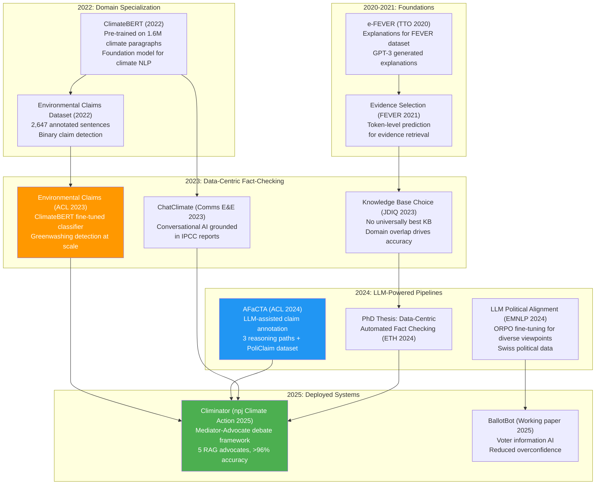
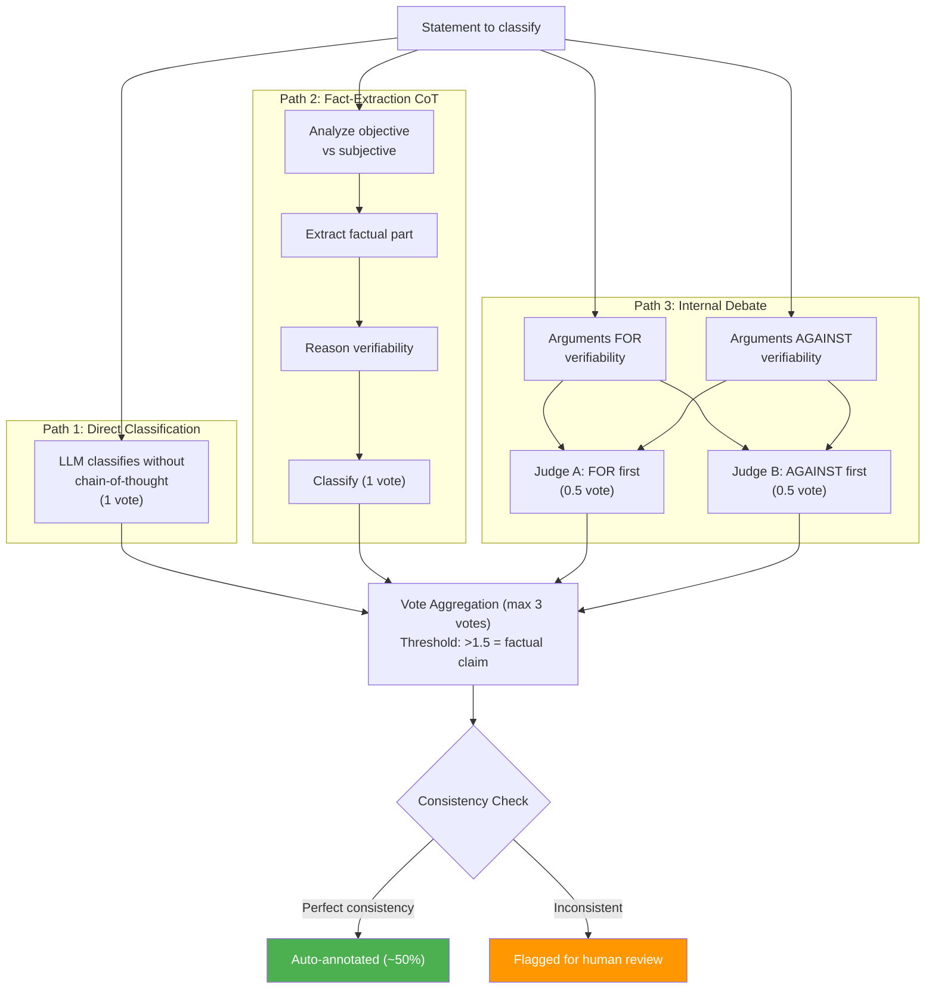
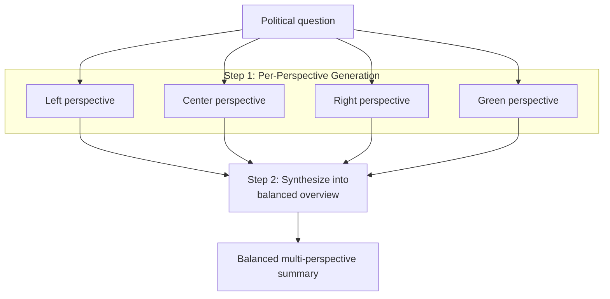
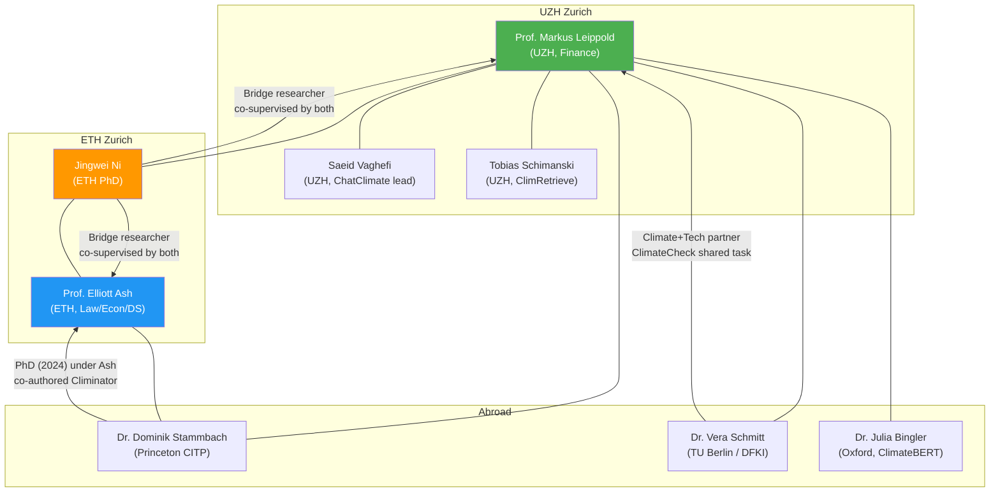
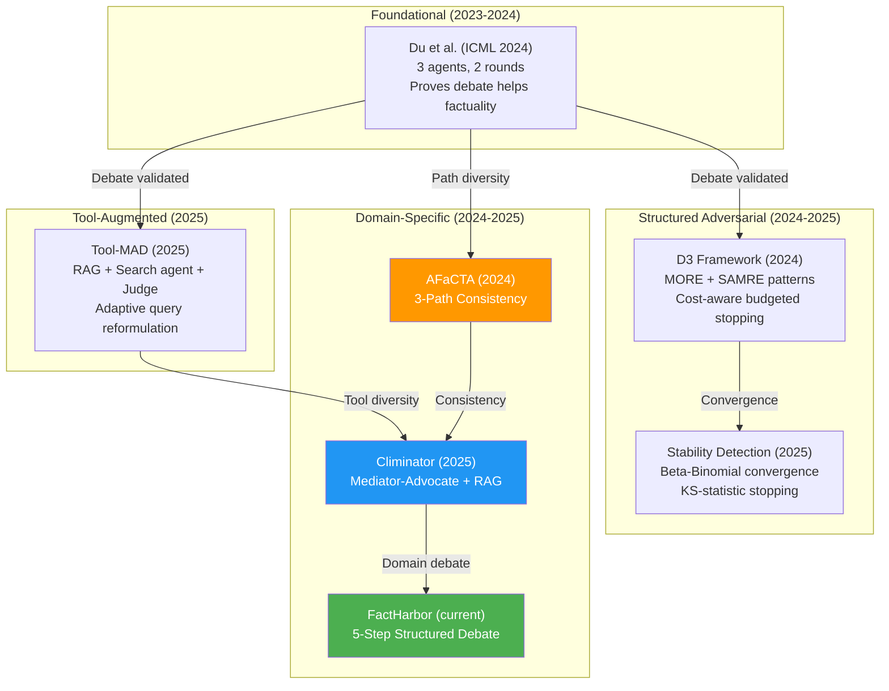

# Research Ecosystem: Stammbach, Ash, Leippold — and FactHarbor Opportunities

**Source:** Academic papers, GitHub repositories, institutional profiles
**Cross-references:** [Climinator Analysis](Climinator_Lessons_for_FactHarbor.md) | [Meeting Prep: Ash](Stammbach_Ash_LLM_Political_Alignment_EMNLP2024.md) | [Executive Summary](EXECUTIVE_SUMMARY.md)
**Reviewed by:** Claude Opus 4.6 (2026-02-21)

> **How to use this document:** Start with §1 (People) to know who's who, then §2 (Pipeline) to see how their projects fit together. §3 has individual project summaries. §4 covers the Climate+Tech ecosystem. §5 surveys the broader debate literature. §6 lists learnings for FactHarbor. §7-8 cover collaboration and outreach.

---

## 1. Key People

| Person | Affiliation | Focus | FactHarbor Relevance |
|--------|------------|-------|---------------------|
| **Elliott Ash** | ETH Zurich | Bias detection, alignment, legal NLP; Scientific Lead, Human-AI Alignment, Swiss AI Initiative | Calibration methodology, cross-provider debate design. [Meeting Prep](Stammbach_Ash_LLM_Political_Alignment_EMNLP2024.md) |
| **Dominik Stammbach** | Princeton CITP (postdoc) | Legal NLP, misinformation detection; PhD ETH 2024 under Ash | Data-centric fact-checking, KB selection theory. [Profile](#72-dominik-stammbach) |
| **Markus Leippold** | UZH (Finance) | Climate finance, ClimateBERT, ChatClimate; **finance professor, not CS** — application-driven AI | Mediator-Advocate debate; Climate+Tech initiative; funded through 2027. [Profile](#41-markus-leippold) |
| **Jingwei Ni** | ETH Zurich (PhD) | AI trustworthiness, ClimateNLP; co-supervised by Ash + Leippold | **Bridge researcher** between Ash (ETH) and Leippold (UZH); key contact for cross-group collaboration |
| **Saeid Vaghefi** | UZH Geography | ML/NLP for climate; ChatClimate + Climinator lead implementer | Primary technical contact for Climinator code |
| **Tobias Schimanski** | UZH | NLP for sustainable finance, ClimRetrieve | Evidence retrieval expertise |
| **Julia Bingler** | University of Oxford | Corporate climate disclosures, ClimateBERT co-creator | Climate+finance NLP |
| **Vera Schmitt** | TU Berlin / DFKI | XplaiNLP, disinformation detection | Climate+Tech partner, ClimateCheck shared task |

**Outreach status:** Email sent to Ash (2026-02-19). Email to Stammbach drafted ([§8](#8-proposed-email-to-stammbach)), not yet sent. Leippold not yet contacted.

---

## 2. The Research Pipeline

### 2.1. Evolution Timeline



### 2.2. How the Projects Connect

| Project | Role in Pipeline | Feeds Into |
|---------|-----------------|------------|
| **ClimateBERT** | Foundation language model for climate text | Environmental Claims, ChatClimate |
| **Environmental Claims** | Step 1: **Claim Detection** — finds verifiable claims in text | Climinator (input filtering) |
| **AFaCTA** | Step 1 (alt): **Claim Annotation** — classifies claim types with LLM paths | Climinator (claim quality), PoliClaim dataset |
| **Knowledge Base Choice** | Step 2: **Evidence Strategy** — which KB works best for which claims | Climinator (multi-corpus design rationale) |
| **e-FEVER** | Step 3: **Explanation Generation** — adds human-readable explanations | Climinator (transparency layer) |
| **ChatClimate** | **Conversational interface** — IPCC-grounded Q&A ([chatclimate.ai](https://www.chatclimate.ai/)) | Climinator (IPCC RAG advocate) |
| **Climinator** | **Full Pipeline** — claim → multi-advocate debate → verdict | End-to-end system. [Paper-vs-code gap is significant.](Climinator_Lessons_for_FactHarbor.md) |
| **LLM Political Alignment** | **Bias awareness** — measuring and mitigating LLM political bias | FactHarbor calibration methodology |
| **BallotBot** | **Deployment validation** — AI informing without steering | FactHarbor "advisory-only" validation |

### 2.3. Shared Authors

| Person | Environmental Claims | AFaCTA | Climinator | Role |
|--------|---------------------|--------|------------|------|
| **Dominik Stammbach** | Lead author | Co-author | Co-author | PhD student → postdoc (Princeton) |
| **Markus Leippold** | Co-author | Co-author | Senior author | PI (UZH), Climate+Tech lead |
| **Elliott Ash** | — | Co-author | — | Supervisor (ETH), bias/alignment expert |
| **Jingwei Ni** | — | Lead author | Co-author | PhD student (ETH), bridge researcher |
| **Julia Bingler** | Co-author | — | Co-author | Climate finance / ClimateBERT team |
| **Nicolas Webersinke** | Co-author | — | — | ClimateBERT team |
| **Mrinmaya Sachan** | — | Co-author | — | NLP group (ETH) |

### 2.4. Methodological Inheritance

| Technique | Origin | Used In | How It Evolved |
|-----------|--------|---------|---------------|
| **Claim detection** | Environmental Claims (2023) | Climinator input stage | Binary classifier → subclaim decomposition by LLM |
| **Path-based consistency** | AFaCTA (2024) | Climinator debate protocol | 3 reasoning paths for annotation → multi-advocate convergence |
| **Knowledge base selection** | KB Choice (JDIQ 2023) | Climinator multi-corpus design | "No universal best KB" → use 5 specialized corpora in parallel |
| **Explanation generation** | e-FEVER (2020) | Climinator transparency layer | Post-hoc GPT-3 explanations → built-in advocate rationales |
| **Domain pre-training** | ClimateBERT (2022) | Environmental Claims classifier | General → climate-specific language model |
| **Viewpoint diversity** | LLM Alignment (EMNLP 2024) | Climinator mediator neutrality | ORPO fine-tuning → prompt-based neutral mediation |

---

## 3. Project Summaries

### 3.1. Environmental Claims (ACL 2023)

**Paper:** Stammbach, Webersinke, Bingler, Kraus, Leippold. [ACL Anthology](https://aclanthology.org/2023.acl-short.91/) | [GitHub](https://github.com/dominiksinsaarland/environmental_claims)

A binary **claim detection** classifier: given a sentence, determine whether it constitutes an environmental claim. Built on ClimateBERT (DistilRoBERTa pre-trained on 1.6M climate paragraphs), fine-tuned on 2,647 expert-annotated sentences from corporate reports and earnings calls.

| Artifact | Location |
|----------|----------|
| **Model** | [HuggingFace: climatebert/environmental-claims](https://huggingface.co/climatebert/environmental-claims) (82.3M params, Apache 2.0) |
| **Dataset** | [HuggingFace: climatebert/environmental_claims](https://huggingface.co/datasets/climatebert/environmental_claims) (2,647 sentences, CC-BY-NC-SA-4.0) |
| **Code** | [GitHub repo](https://github.com/dominiksinsaarland/environmental_claims) |

**Does:** Binary classification ("Is this sentence an environmental claim?"). Detects greenwashing at scale.
**Does NOT:** Verify or fact-check claims. No multi-hop reasoning, no verdicts.

**FactHarbor lesson (L-A):** Before analyzing claims, verify they ARE claims. Add a claim-verifiability field to AtomicClaim extraction.

### 3.2. AFaCTA (ACL 2024)

**Paper:** Ni, Shi, Stammbach, Sachan, Ash, Leippold. [ACL Anthology](https://aclanthology.org/2024.acl-long.104/) | [GitHub](https://github.com/EdisonNi-hku/AFaCTA)

LLM-assisted factual claim detection using **3 predefined reasoning paths** with consistency as a reliability signal. Produces the PoliClaim dataset.

**Key design:** Not a debate between agents, but 3 different reasoning strategies applied to the same claim. Path disagreement flags items for human review — paths never see each other's output.



**FactHarbor lesson (L-C):** Path-based consistency could supplement temperature-based self-consistency. Design 3 distinct reasoning paths for the verdict step — agreement = high confidence, disagreement = lower confidence.

### 3.3. Climinator (npj Climate Action 2025)

**Paper:** Leippold, Vaghefi, Stammbach et al. [Nature](https://www.nature.com/articles/s44168-025-00215-8) | [Code](https://github.com/climateandtech/factchecker)

Mediator-Advocate debate framework for climate claim fact-checking. Paper describes 5-6 RAG advocates with iterative debate until convergence, reporting >96% accuracy.

> **Critical finding:** The open-source code significantly diverges from the paper. `debate.py` is empty (0 bytes), only 3/6 corpora exist, claim decomposition is absent, and advocates execute sequentially. See [Climinator Analysis](Climinator_Lessons_for_FactHarbor.md) for the full paper-vs-code gap analysis, codebase deep-dive, and 11 lessons for FactHarbor.

### 3.4. EMNLP 2024: Balanced Overviews Pattern

**Paper:** Stammbach, Widmer, Cho, Gulcehre, Ash. [ACL Anthology](https://aclanthology.org/2024.emnlp-main.412/) | [GitHub](https://github.com/dominiksinsaarland/swiss_alignment)

LLMs exhibit measurable political bias (ChatGPT aligns with Swiss Green Liberal Party at 58%). Solution: ORPO fine-tuning on 100K real comments from Swiss parliamentary candidates. Full analysis in [Meeting Prep](Stammbach_Ash_LLM_Political_Alignment_EMNLP2024.md).

The most architecturally relevant contribution is the **balanced overviews** pattern:



**Key insight:** Generating per-perspective stances FIRST, then synthesizing, eliminates the "false consensus" pattern where a single LLM call produces artificially balanced-sounding but actually homogeneous text.

**FactHarbor lesson (L-G):** For evaluative claims, generate 2-3 parallel advocate verdicts with different analytical instructions, then pass all to reconciliation. Cheaper than iterative debate and addresses anchoring bias directly.

### 3.5. Other Projects

| Project | What It Does | FactHarbor Relevance |
|---------|-------------|---------------------|
| **ClimateBERT** | Domain-adapted DistilRoBERTa (82.3M params), 1.6M climate paragraphs. 16 HuggingFace models, 840K+ downloads. | Shows how domain-adapted small models complement LLM pipelines. Not directly applicable to domain-agnostic design. |
| **ChatClimate** | Conversational AI grounded in IPCC AR6 via RAG + GPT-4 ([chatclimate.ai](https://www.chatclimate.ai/)). Only live product from the group. | IPCC RAG infrastructure was precursor to Climinator's multi-corpus advocates. Not endorsed by IPCC; can hallucinate. |
| **BallotBot** | Voter information AI. Randomized experiment (California 2024): improved answers, reduced overconfidence, no effect on voting direction. [SSRN](https://papers.ssrn.com/sol3/papers.cfm?abstract_id=5168217) | Validates that balanced AI information informs without steering — aligned with FactHarbor's advisory-only design. |
| **e-FEVER** | Explanations for automated fact-checking (FEVER dataset). GPT-3 generated explanations. | Precedent for user-facing explanation layer (L-E). |
| **KB Choice** | "No universally best KB" — domain overlap drives accuracy. [ACM](https://dl.acm.org/doi/10.1145/3561389) | Web search = choosing a KB at runtime. Search strategy should be claim-domain-aware (L-B). |

---

## 4. The Climate+Tech Ecosystem

### 4.1. Markus Leippold

| | |
|---|---|
| **Position** | Professor of Financial Engineering, Department of Finance, University of Zurich |
| **Other roles** | SFI Senior Chair (Swiss Finance Institute), CEPR Research Fellow, Director MAS Finance (UZH) |
| **Background** | PhD from University of St. Gallen — **finance/mathematics, not CS** |
| **Focus** | Climate finance, sustainable finance, NLP for corporate disclosures, AI fact-checking |
| **Profiles** | [UZH](https://www.df.uzh.ch/en/people/professor/leippold.html) | [SFI](https://www.sfi.ch/en/people/markus-leippold) | [Google Scholar](https://scholar.google.com/citations?user=-Ta9boQAAAAJ) |

**Key insight:** Leippold approaches NLP/AI as an **applied tool for financial analysis**, not as fundamental ML research. His group develops tools to detect greenwashing, assess corporate climate disclosures, and verify climate claims — always in service of financial transparency. This means: approach through applied impact lens, not pure CS.

### 4.2. Research Group

| Person | Role | Focus |
|--------|------|-------|
| Markus Leippold | PI | Climate Finance, NLP, AI |
| Christian Huggel | Climate Change Advisor (UZH Geography) | Climate impacts, adaptation |
| Veruska Muccione | Climate Scientist | IPCC AR6 Lead Author (Europe, Mountains) |
| Saeid Vaghefi | Lead implementer | ChatClimate + Climinator |
| Tobias Schimanski | Researcher | ClimRetrieve, NLP for sustainable finance |
| Philip Berntsen | CEO | Sustainable infrastructure finance |
| Francesco Leonetti | CTO | Full-stack IT architect |
| Qian Wang | Researcher + CIO | AI + Asset Pricing |

### 4.3. Initiative and Partners

**[Climate+Tech](https://climateandtech.com)** is an AI-driven "think-and-do-tank" focused on climate, risk, and adaptation. Funded by Prototype Fund / BMBF (German Federal Ministry of Education and Research).

| Partner | Type |
|---------|------|
| University of Zurich (UZH) | Academic (Leippold) |
| ETH Zurich | Academic |
| TU Berlin (Vera Schmitt / XplaiNLP) | Academic |
| DFKI (German AI Research Center) | Research |
| LMU Munich | Academic |
| Universitat Pompeu Fabra / SIRIS Lab | Academic |
| Leuphana University | Academic |
| sureal.ai Lab | Research |
| Open Knowledge Foundation Deutschland | NGO |
| Score4More Labs | Research |

### 4.4. Active Projects (2025-2026)

| Project | Description |
|---------|------------|
| **Climate Fact-Checking Collaboration** | Flagship: Climinator + open-source toolkit |
| **AI Benchmark for Sustainability Reports** | Evaluates AI in greenwashing detection |
| **Carbonara: Carbon Tracker** | Open-source software carbon footprint tracking |
| **AI for Climate-Resilient Farming** | Climate adaptation in agriculture |
| **Carbon Compliance AI Study** | AI for carbon compliance monitoring |
| **Climate Risk Intel** | Open climate risk data discovery |

### 4.5. Fact-Checker Roadmap

| Date | Milestone | Status |
|------|-----------|--------|
| Feb 2024 | Literature review; configurable architecture design | Done |
| Mar 2024 | UZH/ETH partnership established | Done |
| Jun 2024 | Advocate-Mediator pattern implementation | Done |
| Nov 2024 | Community launch with media analysis use cases | Done |
| Feb 2025 | Open-source architecture improvements, web frontend | Done |
| Q2 2025 | External knowledge integration (Wikipedia, authoritative sources) | Unknown |
| Q3 2025 | Large fine-tuned dataset for standardized evaluation | Unknown |
| Q4 2025 | Knowledge graph integration | Unknown |
| 2026 | Production deployment with expert fact-checkers | Planned |

**Assessment:** Last GitHub commit is 2025-05-03 (9+ months ago). Q2-Q4 2025 milestones may have been delayed or pursued privately. The public codebase remains at v0.1.0.

### 4.6. Funding

| Funder | Grant | Amount | Duration |
|--------|-------|--------|----------|
| **SERI** (Swiss State Secretariat for Education, Research and Innovation) | Nature-3B: NLP tools for sustainability disclosures | CHF 748,125 | Jan 2025 – Dec 2027 |
| **Climate Arc Inc.** | AI tools for corporate analysis (with Oxford + InfluenceMap) | CHF 318,984 | Jun 2024 – Apr 2025 |
| **SNSF** | Sustainable finance impact + greenwashing detection | Grant No. 100018207800 | Ongoing |
| **Prototype Fund / BMBF** | Climate+Tech initiative | Not specified | Ongoing |
| **Swiss Finance Institute** | SFI Senior Chair endowment | Ongoing | Ongoing |

The group is well-funded with a 3-year runway (Nature-3B through 2027). Funding is primarily for **corporate sustainability disclosure analysis**, but NLP tools developed are directly applicable to general fact-checking.

### 4.7. Collaboration Network



### 4.8. Current State and Mutual Benefit

| Dimension | Assessment |
|-----------|-----------|
| **Academic output** | Strong — npj Climate Action (2025), multiple supporting papers |
| **Open-source code** | Early prototype — v0.1.0, 3 contributors, last commit 2025-05 |
| **Live deployment** | ChatClimate only — no Climinator web service exists |
| **Funding** | Secured through 2027 (CHF 748K SERI + additional grants) |
| **Community** | Small but growing — ClimateNLP workshops at ACL 2024/2025 |
| **Direction** | Moving from climate-specific → general political fact-checking (2026 roadmap) |

**What Climate+Tech offers FactHarbor:** Curated knowledge corpora, domain-specific evaluation datasets, academic network (IPCC authors, WMO scientists), ClimateNLP workshop community, institutional credibility (UZH, ETH, DFKI).

**What FactHarbor offers Climate+Tech:** Production-grade infrastructure, general-purpose design, sophisticated debate implementation, calibration methodology, multilingual support, live web search evidence.

---

## 5. The Broader Debate Landscape (2024-2025)

### 5.1. Framework Comparison

| Framework | Agents | Tools | Rounds | Convergence | Key Innovation |
|-----------|--------|-------|--------|-------------|----------------|
| **Du et al.** (ICML 2024) | 3 (same model) | None | 2 fixed | None | Proves multi-agent debate reduces hallucinations |
| **AFaCTA** (ACL 2024) | 3 paths (same model) | None | 1 (parallel) | Vote aggregation | Disagreement = reliability signal, not resolved |
| **Tool-MAD** (2025) | 2 debaters + judge | RAG + Search | 1-3 adaptive | Consensus + stability | Agents refine search queries each round |
| **D3** (2024) | Advocates + judge + jury | None | Budgeted | Token budget | Cost-aware budgeted stopping; MORE + SAMRE patterns |
| **Stability Detection** (2025) | 7 optimal | None | 4-8 adaptive | KS-statistic < 0.05 | Formal convergence model; 7 agents optimal |
| **Climinator** (paper) | 5-6 + mediator | RAG (5 corpora) | 1-18 | Full consensus | Knowledge diversity; iterative until convergence |
| **Climinator** (code) | 3 + mediator | RAG (3 corpora) | 1 (single) | None | [Paper-vs-code gap is significant](Climinator_Lessons_for_FactHarbor.md) |
| **FactHarbor** | 5 roles + multi-model | Web search | 7 LLM calls | Temperature-spread | Multi-model multi-provider; iterative web search |



### 5.2. Key Findings from the Debate Literature

#### "Can LLM Agents Really Debate?" (Nov 2025) — [arXiv:2511.07784](https://arxiv.org/abs/2511.07784)

**Agent quality dominates debate structure.** Structural factors (round count, debate order, confidence visibility) have minimal impact. The dominant predictor is initial reasoning quality. Weak agents cannot correct each other — they succumb to majority pressure (3.6% correction rate vs 30-34% for strong agents).

**FactHarbor implication:** Upgrading the challenger model to Opus may matter more than adding debate rounds. Validates evidence-weighted contestation rule (AGENTS.md).

#### Adaptive Stability Detection (Oct 2025) — [arXiv:2510.12697](https://arxiv.org/abs/2510.12697)

Debates converge to **bimodal distributions** — agents either collectively align on the correct answer or collectively fail. Convergence happens fast (by round 2). Optimal ensemble: **7 agents**. KS-statistic threshold **0.05 for 2 consecutive rounds** detects stability.

**FactHarbor implication:** High-spread claims may be in the "collectively fail" mode rather than "genuine uncertainty" — different reasoning paths (AFaCTA L-C) may help more than additional runs.

#### Tool-MAD: Adaptive Query Reformulation (Jan 2025) — [arXiv:2601.04742](https://arxiv.org/abs/2601.04742)

Assigns different tools to debaters (RAG vs. live web search). Agents **refine search queries based on opponent's previous argument**. Up to 35.5% accuracy improvement over static debate.

**FactHarbor implication:** Strongest validation of the contrarian search pass idea. Debate-informed re-search (L-H) would fill evidence gaps identified during challenge.

#### D3: Cost-Aware Budgeted Stopping (2024) — [arXiv:2410.04663](https://arxiv.org/abs/2410.04663)

Two complementary protocols: **MORE** (k parallel defenses per answer — amplifies via diverse advocacy) and **SAMRE** (iterative refinement under explicit token budget with convergence checks). FactHarbor is currently "SAMRE-like" (single advocate, single round). Combining both would be the most complete architecture.

#### Additional Ash Group Work

- **Faithful LLM Specialists** (ACL 2024): Data quality outweighs data quantity for Evidence-Based QA. Validates FactHarbor's evidence-filter.ts approach.
- **Variational Best-of-N** (ICLR 2025): vBoN approximates Best-of-N sampling at 1/N cost. Relevant to self-consistency — could score N verdicts by evidence faithfulness instead of averaging.

---

## 6. Additional Learnings for FactHarbor

Beyond the 11 Climinator-specific lessons in [Climinator Analysis](Climinator_Lessons_for_FactHarbor.md), these projects surface additional opportunities. For the consolidated priority ranking, see [Executive Summary](EXECUTIVE_SUMMARY.md).

### L-A: Claim Detection as a Quality Gate

**From Environmental Claims.** Not every submitted sentence is a verifiable claim. Stage 1 extracts AtomicClaims but doesn't explicitly filter non-verifiable assertions. Add a `verifiable: boolean` field to the extraction step. Prevents spurious truth percentages for opinions, aspirations, or value judgments.

**Effort:** Low. One additional field in the extraction prompt.

### L-B: Data-Centric Approach to Search Strategy

**From KB Choice / PhD Thesis.** The single most impactful variable in claim checking is the knowledge base, not the model or pipeline. Domain overlap between claim and KB predicts accuracy better than model quality. Web search is FactHarbor's "knowledge base" — search strategy improvement may matter more than debate architecture changes.

**Actionable:** Generate multiple search queries per claim targeting different source types; use claim-domain detection for search verticals; make search strategy an A/B testable parameter.

**Effort:** Medium.

### L-C: Path-Based Consistency for Annotation Quality

**From AFaCTA.** 3 predefined reasoning paths catch cases where the LLM produces the right answer for the wrong reason. FactHarbor's temperature variation detects model uncertainty but cannot detect consistent bias — if the reasoning path is biased, all 3 runs will be biased.

**Actionable (extends C9 backlog):** Design 3 distinct reasoning paths:
- Path A (evidence-first): "Review evidence, then form verdict"
- Path B (claim-first): "Assess plausibility, then check against evidence"
- Path C (adversarial): "Assume false, what evidence would be needed? Does the pool contain it?"

**Effort:** Medium.

### L-D: Greenwashing Detection Pattern

**From Environmental Claims + Climinator.** Highlights a specific failure mode: claims that are *technically true but misleading*. FactHarbor's continuous truthPercentage doesn't capture this nuance. Consider adding a `misleadingnessFlag` or `contextCompleteness` score alongside `truthPercentage`.

**Effort:** Low-Medium. Additional field in verdict prompt.

### L-E: Explanation and Transparency Layer

**From e-FEVER.** FactHarbor has `reasoning` fields in internal structures but no user-facing explanation. Add a final "explain" step that synthesizes verdict reasoning, key evidence, and challenges into a user-friendly paragraph. Distinct from internal reasoning — written for the reader, not the pipeline.

**Effort:** Low. One Haiku-class LLM call at pipeline end.

### L-F: Temporal Tracking of Claim Patterns

**From Environmental Claims.** If FactHarbor accumulates results over time, it could detect patterns: shifting claim frequency, changing evidence pools, verdict instability across time. Not immediate, but worth architecting for — the existing `JobService` event log already creates a longitudinal dataset.

**Effort:** Low (awareness) → Medium (implementation later).

### L-G: Balanced Overviews / Multi-Advocate One-Round Pattern

**From EMNLP 2024 + D3.** Generating k parallel analyses from different angles, then synthesizing, outperforms single-path-then-challenge. FactHarbor's single advocate verdict becomes the anchor that challenger and reconciler react to — anchoring bias is structural.

**Actionable:** For high-impact claims, generate 2-3 parallel advocate verdicts with different analytical instructions, then pass all to reconciliation. Cheaper than iterative debate (3 parallel calls vs. sequential rounds).

**Effort:** Medium.

### L-H: Debate-Informed Re-Search

**From Tool-MAD.** Evidence search happens before debate. The challenger identifies evidence gaps but cannot trigger additional searches. After the challenge step, if specific gaps are identified, trigger targeted re-search and merge new evidence into reconciliation.

**Effort:** Medium.

### L-I: Strong Agent Quality Over Debate Structure

**From "Can LLM Agents Really Debate?"** The dominant predictor of debate success is initial reasoning quality, not structural factors. Create a `strong-challenger` debate profile where the challenger uses Opus or equivalent. The current `tier-split` profile uses Haiku for challenger — the opposite of what this research recommends.

**Effort:** Low. Config change + calibration run.

### L-J: Stability Detection for Adaptive Debate Depth

**From Adaptive Stability Detection.** If adaptive debate (Climinator L2) is implemented, use KS-statistic to detect convergence: after each round, compute divergence between current and previous verdict distributions. If below threshold for 2 checks, stop. Prevents wasting tokens on already-converged debates.

**Effort:** Low (on top of adaptive debate implementation).

---

## 7. Collaboration Opportunities

### 7.1. Elliott Ash (ETH Zurich) — contacted 2026-02-19

- Calibration harness methodology review
- Cross-provider debate impact assessment
- Evidence-pool correction strategy (C13)
- Path-consistency benchmark design (C9 via AFaCTA)

### 7.2. Dominik Stammbach

**Current role:** Postdoctoral Research Associate, Princeton CITP & Polaris Lab (PI: Prof. Peter Henderson)
**PhD:** ETH Zurich, Spring 2024. Thesis: *Towards Data-Centric Automated Fact Checking*
**Contact:** dominsta@princeton.edu | [dominik-stammbach.github.io](https://dominik-stammbach.github.io/)

**Current research (2025-2026):**
1. Legal NLP for public defenders — retrieval tool for internal briefs
2. Misinformation detection — keynote at DMAIL@ICDM 2025
3. Climate NLP — organizing ClimateNLP workshops (2024-2025)
4. Corporate greenwashing detection — Oil & Gas advertising framing (NeurIPS 2025)

**Relevance:** Stammbach's trajectory has shifted from building fact-checking systems (PhD) to applying NLP in high-stakes public-interest domains (legal aid, voter information). His current work aligns with FactHarbor's mission of accessible verifiable information.

**Collaboration focus:**
- Data-centric principles for general-purpose (not just climate) fact-checking
- KB Choice theory applied to web search strategy
- AFaCTA path-consistency as complement to temperature-based self-consistency

### 7.3. Climate+Tech / Markus Leippold (UZH) — not yet contacted

- Climinator moving toward general political fact-checking (2026 roadmap)
- Natural overlap with FactHarbor's domain-agnostic pipeline
- Potential collaboration on evaluation benchmarks
- **Approach:** Through applied impact lens, not pure CS. Jingwei Ni bridges both Ash and Leippold groups.
- **Mutual benefit:** FactHarbor has production infrastructure + general-purpose design; Climate+Tech has curated corpora + academic network + IPCC/WMO connections

---

## 8. Proposed Email to Stammbach

```
Subject: Automated fact-checking pipeline — data-centric approach (from FactHarbor / you know Elliott)

Dear Dominik,

I'm Robert Schaub, founder of FactHarbor, a Swiss nonprofit developing an open-source
platform for automated claim verification. I've just contacted Prof. Ash about a
potential collaboration — he may mention it.

Your PhD work on data-centric fact-checking is directly relevant to what we're building.
FactHarbor autonomously extracts verifiable claims, searches for evidence across multiple
sources, groups findings into analytical perspectives, and generates verdicts through an
adversarial LLM debate — producing fully sourced, transparent reports.

Two of your contributions particularly resonate:
- Your KB Choice finding (domain overlap > model quality) matches our calibration data:
  evidence-pool composition drives verdict skew more than model selection (8 of 10 test
  pairs show evidence-pool asymmetry as the dominant bias source).
- AFaCTA's path-based consistency is a promising complement to our current
  temperature-based self-consistency — we're evaluating it for our contested-claim
  handling.

I'd welcome the chance to discuss how data-centric principles apply to general-purpose
(not just climate) fact-checking, and whether our calibration harness could benefit from
your measurement methodology.

Would you have 20 minutes for a call in the coming weeks?

Best regards,
Robert Schaub
Founder, FactHarbor

https://factharbor.ch
https://www.linkedin.com/in/robertschaub
Office: +41 76 449 14 39
```

**Email strategy:** Lead with KB Choice (Stammbach's own research identity), not Climinator (Leippold's project). Mention Ash to create social proof. Keep short — Stammbach is a postdoc at Princeton. Frame as peer exchange, not sales.

---

## 9. References

### Primary Projects

- **Environmental Claims:** Stammbach et al. (2023). ACL 2023 Short Papers. [ACL Anthology](https://aclanthology.org/2023.acl-short.91/) | [arXiv](https://arxiv.org/abs/2209.00507) | [GitHub](https://github.com/dominiksinsaarland/environmental_claims) | [Model](https://huggingface.co/climatebert/environmental-claims) | [Dataset](https://huggingface.co/datasets/climatebert/environmental_claims)
- **AFaCTA:** Ni et al. (2024). ACL 2024. [ACL Anthology](https://aclanthology.org/2024.acl-long.104/) | [GitHub](https://github.com/EdisonNi-hku/AFaCTA)
- **Climinator:** Leippold et al. (2025). npj Climate Action. [Nature](https://www.nature.com/articles/s44168-025-00215-8) | [arXiv](https://arxiv.org/abs/2401.12566) | [Code](https://github.com/climateandtech/factchecker)

### Supporting Work

- **ClimateBERT:** Webersinke et al. (2022). [SSRN](https://papers.ssrn.com/sol3/papers.cfm?abstract_id=4229146) | [HuggingFace](https://huggingface.co/climatebert/distilroberta-base-climate-f)
- **KB Choice:** Stammbach et al. (2023). JDIQ. [ACM](https://dl.acm.org/doi/10.1145/3561389) | [arXiv](https://arxiv.org/abs/2111.07795)
- **e-FEVER:** Stammbach, Ash (2020). TTO 2020. [Semantic Scholar](https://www.semanticscholar.org/paper/e-FEVER-Stammbach-Ash/e71259d59df8d27bbc28ea2cb0b9f835c256562a)
- **LLM Political Alignment:** Stammbach et al. (2024). EMNLP 2024. [ACL Anthology](https://aclanthology.org/2024.emnlp-main.412/)
- **PhD Thesis:** Stammbach (2024). ETH Zurich. [ETH Research Collection](https://www.research-collection.ethz.ch/handle/20.500.11850/674960)

### Leippold Group

- **DIRAS:** Ni et al. (2025). NAACL 2025.
- **ClimRetrieve:** Schimanski et al. (2024). EMNLP 2024. [ACL Anthology](https://aclanthology.org/2024.emnlp-main.969/)
- **Agentic RAG for Climate Finance:** Vaghefi et al. (2025). [arXiv](https://arxiv.org/abs/2504.05104)
- **ChatClimate:** Vaghefi et al. (2023). Communications Earth & Environment. [chatclimate.ai](https://www.chatclimate.ai/)
- **Faithful LLM Specialists:** Schimanski et al. (2024). ACL 2024. [ACL Anthology](https://aclanthology.org/2024.acl-long.105/)
- **vBoN:** Amini et al. (2025). ICLR 2025. [arXiv](https://arxiv.org/abs/2407.06057)

### Multi-Agent Debate Literature

- **Du et al.** (2024). ICML 2024. [arXiv](https://arxiv.org/abs/2305.14325)
- **Tool-MAD** (2025). [arXiv](https://arxiv.org/abs/2601.04742)
- **D3:** Bandi, Harrasse (2024). [arXiv](https://arxiv.org/abs/2410.04663)
- **Stability Detection:** Hu et al. (2025). [arXiv](https://arxiv.org/abs/2510.12697)
- **"Can LLM Agents Really Debate?"** (2025). [arXiv](https://arxiv.org/abs/2511.07784)

### Climate+Tech Ecosystem

- [Climate+Tech homepage](https://climateandtech.com)
- [Climate Fact Checker Collaboration](https://climateandtech.com/en/research-projects/climate-fact-checker-collaboration)
- [Building Climinator (Springer Nature blog)](https://communities.springernature.com/posts/building-climinator-to-combat-misinformation-in-a-changing-climate)

### People

- Dominik Stammbach: [Personal site](https://dominik-stammbach.github.io/) | [Princeton CITP](https://citp.princeton.edu/people/dominik-stammbach/)
- Markus Leippold: [UZH](https://www.df.uzh.ch/en/people/professor/leippold.html) | [SFI](https://www.sfi.ch/en/people/markus-leippold) | [Google Scholar](https://scholar.google.com/citations?user=-Ta9boQAAAAJ)
- Elliott Ash: [ETH Zurich](https://lawecon.ethz.ch/group/professors/ash.html)
- Jingwei Ni: [ETH](https://lawecon.ethz.ch/group/scientific-team/ni.html) | [Personal](https://edisonni-hku.github.io/)
- Vera Schmitt: [TU Berlin](https://www.tu.berlin/en/qu/ueber-uns/team-personen/senior-researchers/dr-vera-schmitt)
- ChatClimate team: [chatclimate.ai/team](https://www.chatclimate.ai/team)
