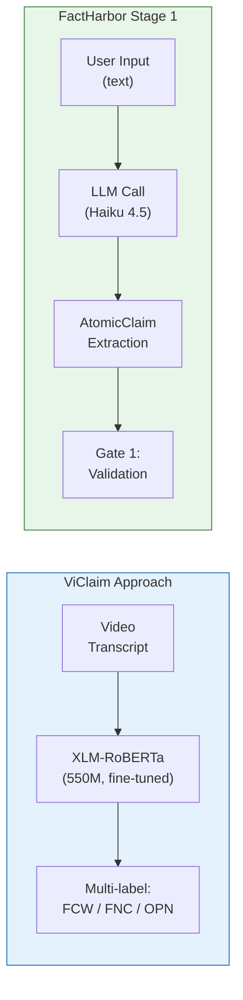

# ViClaim: Multilingual Claim Detection in Videos — Lessons for FactHarbor

**Paper:** Giedemann, von Daniken, Deriu, Rodrigo, Penas, Cieliebak (2025). *ViClaim: A Multilingual Multilabel Dataset for Automatic Claim Detection in Videos.* EMNLP 2025 (main conference), pp. 397-413.
**Links:** [ACL Anthology](https://aclanthology.org/2025.emnlp-main.21/) | [arXiv](https://arxiv.org/abs/2504.12882) | [Dataset (Zenodo)](https://zenodo.org/doi/10.5281/zenodo.14677820) | [Code: STT Pipeline](https://github.com/pgied/viclaim_stt) | [Code: Training](https://github.com/pgied/viclaim_training)
**Reviewed by:** Claude Opus 4.6 (2026-03-24)

> **Related docs:** [HAMiSoN Analysis](HAMiSoN_Lessons_for_FactHarbor.md) for the parent project. [CheckThat! Lab Analysis](CheckThat_Lab_Lessons_for_FactHarbor.md) for the shared task context. [Factiverse Analysis](Factiverse_Lessons_for_FactHarbor.md) for the finding that fine-tuned XLM-R beats GPT-4 on NLI (confirmed here). [Executive Summary](EXECUTIVE_SUMMARY.md) for the consolidated priority table.

---

## 1. The Paper in Brief

Existing claim detection datasets overwhelmingly focus on written text (tweets, news, debates). ViClaim fills the gap for **spoken text in video content** — specifically YouTube Shorts (up to 90 seconds), across 3 languages and 6 topics. It's a dataset, a benchmark, and a validation that transcript-based claim detection requires purpose-built training data.

**Core finding:** Models trained on written text (tweets from CheckThat! 2023) achieve only **F1 = 0.32** when applied to video transcripts, proving that spoken and written claim detection are fundamentally different tasks. Fine-tuned XLM-RoBERTa-Large (550M) outperforms zero-shot o3-mini, 4o-mini, and Grok-2 by 12+ points.

---

## 2. Dataset Architecture

```mermaid
flowchart LR
    subgraph Collection["Video Collection"]
        direction TB
        YT["YouTube Shorts<br>(≤90 sec)"]
        MS["Manual Selection<br>by 2 researchers"]
    end

    subgraph Processing["Transcript Processing"]
        direction TB
        STT["AssemblyAI<br>Speech-to-Text<br>+ Diarization"]
        SEG["SpaCy<br>Sentence<br>Segmentation"]
    end

    subgraph Annotation["Human Annotation"]
        direction TB
        AN["12 Annotators<br>(4 per sentence)"]
        MACE["MACE Bayesian<br>Trust Scoring"]
        SOFT["Soft Labels:<br>y = Σ(w_i × a_i)"]
    end

    subgraph Classification["Model Evaluation"]
        direction TB
        FT["Fine-tuned:<br>XLM-R, Falcon-7B,<br>Mistral-7B, LLama3.2-3B"]
        ZS["Zero-shot:<br>o3-mini, 4o-mini,<br>Grok-2"]
    end

    Collection --> Processing --> Annotation --> Classification

    style Collection fill:#e3f2fd,stroke:#1565c0
    style Processing fill:#fff3e0,stroke:#ef6c00
    style Annotation fill:#fce4ec,stroke:#c62828
    style Classification fill:#e8f5e9,stroke:#2e7d32
```

*ViClaim pipeline: manually curated YouTube Shorts are transcribed, segmented, annotated by 4 humans per sentence with MACE-based trust scoring to produce soft labels, then evaluated against both fine-tuned and zero-shot models.*

### Dataset Statistics

| Dimension | Count |
|-----------|-------|
| Videos | 1,798 (YouTube Shorts, ≤90 sec) |
| Annotated sentences | 17,116 |
| Languages | 3 (English: 6,599 / German: 6,128 / Spanish: 4,389 sentences) |
| Topics | 6 (US Elections, US Society, Ukraine War, Migration, EU, League of Legends) |
| Annotators | 12 (4 per sentence) |
| Annotation cost | ~500 EUR/annotator (~25 EUR/hour) |

### Annotation Taxonomy (Multi-Label)

Derived from Panchendrarajan & Zubiaga (2024), "Claim Detection for Automated Fact-checking: A Survey":

| Label | Code | Definition | FactHarbor Parallel |
|-------|------|------------|-------------------|
| **Fact Check-Worthy** | FCW | Verifiable factual claims of public interest | AtomicClaim (verifiable assertion) |
| **Fact Non-Check-Worthy** | FNC | Factual but unverifiable or not of public interest (personal experiences, jokes) | Filtered out by Gate 1 |
| **Opinion** | OPN | Subjective: opinions, beliefs, accusations, speculations, predictions | Not currently distinguished from claims |
| **None** | — | Commands, insults, casual expressions | Filtered out by Gate 1 |

**Critical design choice:** Multi-label, because sentences can simultaneously contain facts and opinions. Earlier attempts with custom annotation spans (annotators define their own boundaries) resulted in Krippendorff's alpha below 0.2.

### Inter-Annotator Agreement

| Label | Cohen's kappa range (3 groups) | Interpretation |
|-------|-------------------------------|---------------|
| FCW | 0.51 — 0.76 | Moderate to substantial |
| FNC | 0.35 — 0.69 | Fair to substantial (most variable) |
| OPN | 0.47 — 0.68 | Moderate to substantial |
| None | 0.57 — 0.85 | Moderate to almost perfect |
| **Krippendorff's alpha** | **0.415 — 0.522** | Moderate — reflects inherent task subjectivity |

---

## 3. Model Evaluation

### Fine-Tuned Models — Cross-Validation (5-fold, stratified by language + topic)

| Model | Params | FCW F1 | FNC F1 | OPN F1 |
|-------|--------|--------|--------|--------|
| **XLM-RoBERTa-Large** | **550M** | **0.899 ± 0.002** | **0.776 ± 0.007** | **0.836 ± 0.004** |
| LLama3.2-3B (QLoRA) | 3B | 0.898 ± 0.002 | 0.772 ± 0.008 | 0.833 ± 0.004 |
| Mistral-7B (QLoRA) | 7B | 0.891 ± 0.006 | 0.765 ± 0.005 | 0.829 ± 0.008 |
| Falcon-7B (QLoRA) | 7B | 0.889 ± 0.003 | 0.757 ± 0.008 | 0.823 ± 0.007 |

**XLM-RoBERTa-Large wins or ties across all labels at 1/5th to 1/13th the parameter count.** Decoder models fine-tuned with QLoRA do not outperform the encoder despite being 5-13x larger.

### Zero-Shot LLMs — Substantially Worse

| Model | FCW F1 | FNC F1 | OPN F1 |
|-------|--------|--------|--------|
| o3-mini | 0.780 | 0.541 | 0.779 |
| 4o-mini | 0.650 | 0.556 | 0.751 |
| Grok 2 | 0.665 | 0.549 | 0.630 |

**Gap:** Best zero-shot (o3-mini) is 12 points behind best fine-tuned on FCW, 24 points behind on FNC. FNC detection is particularly poor zero-shot — LLMs struggle to distinguish "factual but not check-worthy" from "check-worthy."

### Leave-Topic-Out Transfer

| Topic Left Out | Best F1 (avg across labels) | Worst F1 |
|---------------|---------------------------|----------|
| US Society | 0.798 (XLM-R) | 0.784 |
| European Union | 0.793 (XLM-R) | 0.765 |
| Ukraine War | 0.770 (Mistral) | 0.752 |
| US Elections | 0.768 (XLM-R) | 0.738 |
| Migration | 0.768 (LLama) | 0.726 |
| **League of Legends** | **0.721 (XLM-R / Mistral)** | **0.690** |

**Domain gap is real:** The only non-political topic (LoL) consistently scores lowest across all models. Political topics generalize to each other reasonably well; domain shift to entertainment is the hard case.

### Written → Spoken Transfer (Critical Finding)

| Training Data → Test Data | F1 |
|---------------------------|-----|
| CheckThat! 2023 tweets → CheckThat! tweets | 0.693 |
| CheckThat! 2023 tweets → **ViClaim** | **0.32** |
| ModernBERT → ViClaim | 0.46 |

**Models trained on written text collapse on spoken text.** Recall drops from reasonable to 0.20 — the model predicts almost nothing as check-worthy in transcripts. This validates the need for spoken-text-specific training data.

---

## 4. FactHarbor's Stage 1 Comparison

| Dimension | ViClaim | FactHarbor Stage 1 |
|-----------|---------|-------------------|
| **Input** | Spoken text (video transcripts) | Written text (user input) |
| **Method** | Fine-tuned encoder (550M) | LLM prompt (Haiku 4.5) |
| **Taxonomy** | 3 classes (FCW/FNC/OPN) | Binary (verifiable claim or not) |
| **Multi-label** | Yes (sentence can be FCW + OPN) | No |
| **Languages** | EN, DE, ES | Any (LLM-dependent) |
| **Cost per call** | ~$0.001 (local model) | ~$0.01-0.05 (API call) |
| **Latency** | ~10ms | ~500-2000ms |

---

## 5. Key Lessons for FactHarbor

### L1: The 550M-Parameter Sweet Spot for Classification

XLM-RoBERTa-Large (550M) matches or outperforms 3B-7B decoder models and crushes zero-shot frontier LLMs on claim detection. This is now confirmed across three independent sources: ViClaim (EMNLP 2025), Factiverse's LiveFC pipeline (fine-tuned XLM-R beats GPT-4 on NLI), and the SIGIR 2024 study (XLM-R at 0.743 F1 vs GPT-4 at 0.624 across 114 languages).

**FactHarbor action:** For any classification subtask in the pipeline (claim detection, relevance filtering, stance classification), a fine-tuned 550M encoder is likely cheaper, faster, and more accurate than an LLM API call. This is the strongest data point for the "low-resource fact-checking" Innosuisse angle.

### L2: Distinguish FCW from FNC from OPN

ViClaim's three-way taxonomy is more realistic than binary check-worthiness. "Factual but not check-worthy" (FNC) — personal experiences, trivially true statements, jokes with factual content — is the hardest category (lowest inter-annotator agreement and model performance). Confusing FNC with FCW wastes research budget on unverifiable claims.

**FactHarbor action:** Consider adding an explicit subjectivity/check-worthiness filter before or within Gate 1. Currently, AtomicClaim extraction extracts all verifiable assertions — but some are not worth the research cost. A quick FCW vs FNC vs OPN triage could prevent Stage 2 from researching claims that will never produce useful verdicts.

### L3: Written ≠ Spoken Text for Claim Detection

The F1 = 0.32 collapse when applying tweet-trained models to video transcripts is a cautionary finding. If FactHarbor ever processes audio/video input (the LiveCheck direction), it cannot reuse text-trained claim detection — purpose-built models or prompts are needed.

**FactHarbor action:** If the LiveCheck direction (real-time audio fact-checking) advances, ViClaim is the training dataset to use for claim detection in spoken content. The STT reconstruction pipeline (GitHub) and annotation taxonomy are directly reusable.

### L4: Soft Labels Handle Annotator Disagreement Gracefully

ViClaim uses MACE Bayesian trust scoring to produce soft labels (continuous 0-1 values) rather than forcing binary majority-vote labels. Training against soft labels with cross-entropy loss captures the inherent ambiguity of claim detection — some statements genuinely are both factual and opinion.

**FactHarbor action:** FactHarbor's verdict debate already handles ambiguity through multi-advocate disagreement. The soft label concept could extend to evidence classification — when evidence partially supports and partially contradicts, the system should represent this as a spectrum rather than forcing binary support/oppose.

### L5: Context Window Matters for Claim Detection

ViClaim concatenates the full clip transcript with the target sentence as model input. This context helps disambiguate — a sentence like "that's completely false" only makes sense with preceding context. The annotation tool (Figure 1) shows video alongside transcript for the same reason.

**FactHarbor action:** Stage 1's AtomicClaim extraction already receives the full user input. But for future claim detection on external content (articles, transcripts), preserving surrounding context in the extraction prompt is essential — isolated sentences lose meaning.

### L6: QLoRA Fine-Tuning is Practical for Decoder Models

Falcon-7B, Mistral-7B, and LLama3.2-3B were all fine-tuned via QLoRA (4-bit quantization + low-rank adapters) on 8 NVIDIA H200 GPUs in ~100 GPU hours total. While they didn't beat XLM-RoBERTa, they came close — and QLoRA makes 7B model fine-tuning accessible without massive compute.

**FactHarbor action:** If the Innosuisse research project explores knowledge distillation from FactHarbor's pipeline into smaller models, QLoRA fine-tuning of 3B-7B models is the practical training method — validated here with exact hyperparameters (rank, alpha, dropout, batch size).

### L7: Entertainment Domain is the Hardest Transfer Target

Political topics generalize well to each other (all 0.73-0.80 F1 in leave-topic-out). League of Legends drops to 0.69-0.72 — the only non-political topic with different vocabulary, claim distribution (high FNC, low FCW), and communication style.

**FactHarbor action:** FactHarbor's topic-agnostic design will face this challenge. Testing should include non-political topics (science, health, entertainment, sports) to validate that the pipeline doesn't have a political-topic bias in claim extraction quality.

---

## 6. Connection to FactHarbor's Innosuisse Strategy

ViClaim directly supports the "low-resource fact-checking" research angle:

1. **Benchmark for Stage 1 distillation:** ViClaim can serve as the evaluation dataset for distilling FactHarbor's LLM-based claim extraction into a fine-tuned 550M encoder
2. **Multilingual validation:** 3 languages with balanced data — tests whether a distilled model maintains quality across languages
3. **Cross-domain generalization:** 6 topics with leave-topic-out evaluation — measures whether a distilled model handles unseen domains
4. **Research credibility:** Published at EMNLP 2025 main conference — citing and building on this work strengthens the Innosuisse proposal
5. **Dataset availability:** Code for reconstruction is open-source (MIT license) — can be used directly in research collaboration

The proposed Innosuisse research question — "What is the minimum model capacity to reliably detect and verify claims across a multi-stage pipeline?" — can use ViClaim as the Stage 1 benchmark, with FactHarbor's existing pipeline as the baseline to beat.

---

## Sources

- [ACL Anthology](https://aclanthology.org/2025.emnlp-main.21/)
- [arXiv (v3)](https://arxiv.org/html/2504.12882v3)
- [Zenodo Dataset](https://zenodo.org/doi/10.5281/zenodo.14677820)
- [GitHub: viclaim_stt](https://github.com/pgied/viclaim_stt)
- [GitHub: viclaim_training](https://github.com/pgied/viclaim_training)
- [HAMiSoN Project](https://nlp.uned.es/hamison-project/)
- [Kaggle Challenge](https://www.kaggle.com/competitions/hamison-claim-annotation-challenge)
- [Semantic Scholar](https://www.semanticscholar.org/paper/ViClaim/85039a24a50687d8f30bffbf33045ed9ae0dbbc2)
