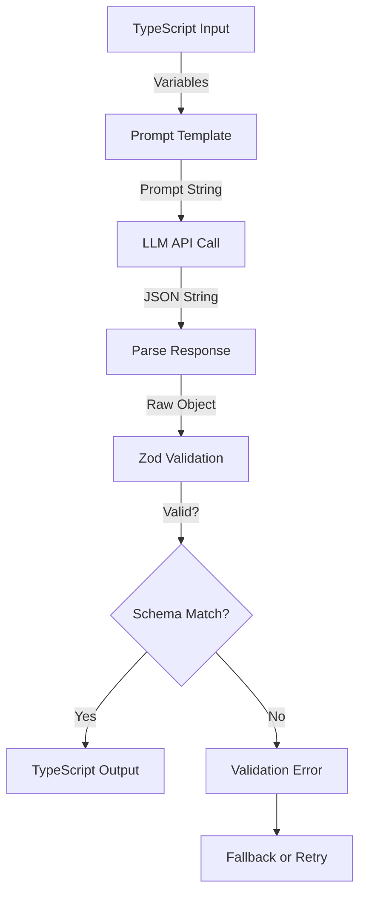

# LLM Schema Mapping Reference

**Version**: 2.8.0  
**Date**: 2026-01-20  
**Purpose**: Complete mapping of TypeScript → LLM Prompts → JSON Schemas  
**Audience**: Prompt Engineers, LLM System Developers  

---

## Overview

This document maps how FactHarbor's TypeScript objects are presented to LLMs (via prompts) and how LLM outputs are validated (via Zod schemas). Use this as the authoritative reference when writing or updating prompts.

---

## Master Mapping Table

| TypeScript Type | Prompt Term | LLM Output Field (v2.7) | LLM Output Field (Legacy) | Zod Schema |
|----------------|-------------|---------------------------|--------------------------|------------|
| `AnalysisContext` | "AnalysisContext" or "Scope" | `analysisContexts` | `distinctProceedings` | `AnalysisContextSchema` |
| `EvidenceScope` | "EvidenceScope" | `evidenceScope` | `evidenceScope` | `EvidenceScopeSchema` |
| `ExtractedFact` | "Fact" | `facts` | `facts` | `ExtractedFactSchema` |
| `ContextAnswer` | "Verdict" | (embedded in result) | (embedded in result) | `ContextAnswerSchema` |

---

## Phase-by-Phase Mappings

### UNDERSTAND Phase

**Purpose**: Extract claims and detect preliminary scopes

**Input to LLM**:
```typescript
// Variables passed to prompt
{
  currentDate: string;  // e.g., "2026-01-18"
  isRecent: boolean;    // Temporal relevance flag
}
```

**Prompt Terms Used**:
- "AnalysisContext" or "Scope" for top-level frames
- "Multi-Scope Detection" for identifying distinct frames
- "Claim Extraction" for factual assertions

**LLM Output Schema (v2.7)**:
```json
{
  "impliedClaim": "string",
  "articleThesis": "string",
  "subClaims": [
    {
      "id": "string",
      "text": "string",
      "claimRole": "attribution" | "source" | "timing" | "core",
      "centrality": "HIGH" | "MEDIUM" | "LOW",
      "isCentral": boolean
    }
  ],
  "researchQueries": ["string"],
  "analysisContexts": [
    {
      "id": "string",
      "name": "string",
      "type": "legal" | "scientific" | "methodological" | "general"
    }
  ],
  "requiresSeparateAnalysis": boolean
}
```

**Zod Validation**: `UnderstandingSchema` (in `analyzer.ts`)

**Key Mappings**:
- Prompt: "AnalysisContext" → Output: `analysisContexts` array
- Prompt: "requiresSeparateAnalysis" → Output: `requiresSeparateAnalysis` boolean

---

### EXTRACT_FACTS Phase

**Purpose**: Extract verifiable facts from fetched sources

**Input to LLM**:
```typescript
{
  currentDate: string;
  originalClaim: string;      // User's input
  scopesList: string;         // Stringified list of detected scopes
}
```

**Prompt Terms Used**:
- "EvidenceScope" for per-fact methodology metadata
- "contextId" for scope assignment
- "claimDirection" for support/contradict/neutral assessment

**LLM Output Schema (v2.7)**:
```json
{
  "facts": [
    {
      "id": "string",
      "fact": "string",
      "category": "evidence" | "expert_quote" | "statistic" | "event" | "legal_provision" | "criticism",
      "specificity": "high" | "medium",
      "sourceExcerpt": "string (50-200 chars)",
      "claimDirection": "supports" | "contradicts" | "neutral",
      "contextId": "string (e.g., CTX_TSE)",
      "evidenceScope": {
        "name": "string",
        "methodology": "string?",
        "boundaries": "string?",
        "geographic": "string?",
        "temporal": "string?"
      } | null
    }
  ]
}
```

**Legacy Compatibility**:
- Legacy field `relatedProceedingId` is still accepted when reading older jobs.

**Zod Validation**: `ExtractedFactSchema` (in `types.ts`)

**Key Mappings**:
- Prompt: "EvidenceScope" → Output: `evidenceScope` object (nullable)
- Prompt: "contextId" → Output: `contextId` (legacy: `relatedProceedingId`)

---

### SCOPE_REFINEMENT Phase

**Purpose**: Identify final AnalysisContexts from evidence

**Input to LLM**:
```typescript
{
  facts: ExtractedFact[];       // All extracted facts
  preliminaryScopes: Scope[];   // From UNDERSTAND phase
}
```

**Prompt Terms Used**:
- "AnalysisContext" (primary term)
- "ArticleFrame" (what NOT to split on)
- "EvidenceScope" (distinguished from AnalysisContext)
- "analysisContexts" (output field name)

**LLM Output Schema (v2.7)**:
```json
{
  "requiresSeparateAnalysis": boolean,
  "analysisContexts": [
    {
      "id": "string",
      "name": "string",
      "shortName": "string",
      "subject": "string",
      "temporal": "string",
      "status": "concluded" | "ongoing" | "pending" | "unknown",
      "outcome": "string",
      "metadata": {
        "institution": "string?",
        "jurisdiction": "string?",
        "methodology": "string?",
        "boundaries": "string?",
        "geographic": "string?",
        "dataSource": "string?"
      }
    }
  ],
  "factScopeAssignments": [
    {
      "factId": "string",
      "contextId": "string"
    }
  ]
}
```

**Legacy Compatibility**:
- Legacy fields `distinctProceedings` and `proceedingId` are still accepted when reading older jobs.

**Zod Validation**: `ScopeRefinementSchema` (in `analyzer.ts`)

**Key Mappings**:
- Prompt: "AnalysisContext" → Output: `analysisContexts` (legacy: `distinctProceedings`)
- Prompt: "ArticleFrame" → (explicitly NOT included in output)
- Prompt: "EvidenceScope" → (per-fact metadata, not top-level context)

---

### VERDICT Phase

**Purpose**: Generate truth verdicts per context per claim

**Input to LLM**:
```typescript
{
  currentDate: string;
  originalClaim: string;
  claimsList: string;          // Stringified claims
  scopesList: string;          // Stringified contexts
  factsList: string;           // Stringified facts
}
```

**Prompt Terms Used**:
- "contextId" for verdict assignment
- "answer" for truth percentage (0-100)
- "keyFactors" for evidence summary

**LLM Output Schema (v2.7)**:
```json
{
  "verdicts": [
    {
      "contextId": "string",
      "contextName": "string",
      "claimId": "string",
      "answer": number (0-100),
      "confidence": number (0-100),
      "truthPercentage": number (0-100),
      "shortAnswer": "string",
      "keyFactors": [
        {
          "factor": "string",
          "explanation": "string",
          "supports": "strongly_supports" | "supports" | "neutral" | "contradicts" | "strongly_contradicts",
          "weight": "high" | "medium" | "low",
          "isContested": boolean,
          "contestedBy": "string?",
          "factualBasis": "established" | "disputed" | "opinion" | "alleged" | "unknown"
        }
      ]
    }
  ]
}
```

**Contestation Fields (v2.8):**
- `isContested`: Whether there is opposition to this factor
- `contestedBy`: Who opposes (e.g., "opposition party", "industry group")
- `factualBasis`: Type of opposition evidence
  - `established` = Strong documented counter-evidence (weight: 0.3x)
  - `disputed` = Some factual counter-evidence (weight: 0.5x)
  - `opinion`/`alleged`/`unknown` = DOUBTED, no evidence (weight: 1.0x)

See `Docs/REFERENCE/TERMINOLOGY.md` for "Doubted vs Contested" distinction.

**Legacy Compatibility**:
- Legacy fields `proceedingId`/`proceedingName` are still accepted when reading older jobs.

**Zod Validation**: `VerdictSchema` (in `analyzer.ts`)

---

## Terminology Bridges (Prompt ↔ Code)

### AnalysisContext Bridges

| Layer | Term | Notes |
|-------|------|-------|
| Prompt | "AnalysisContext" or "Scope" | Primary prompt term |
| LLM Output (v2.7) | `analysisContexts` | JSON field name |
| LLM Output (Legacy) | `distinctProceedings` | Backward compatibility |
| TypeScript | `AnalysisContext` | Interface name |
| Database | (embedded in ResultJson) | Stored as JSON blob |

### EvidenceScope Bridges

| Layer | Term | Notes |
|-------|------|-------|
| Prompt | "EvidenceScope" | Explicit terminology |
| LLM Output | `evidenceScope` | Consistent across versions |
| TypeScript | `EvidenceScope` | Interface name |
| Database | (embedded in fact objects) | Part of ResultJson |

---

## Validation Flow



### Schema Validation Checkpoints

1. **Pre-LLM**: Variables validated (type-safe TypeScript)
2. **Post-LLM**: JSON parsed and Zod-validated
3. **Post-Validation**: TypeScript types enforced
4. **Runtime**: Additional business logic validation (e.g., `contextId` exists in context list)

---

## Common Pitfalls

### Pitfall 1: Field Name Mismatch

❌ **Wrong** (Prompt says one thing, schema expects another):
```typescript
// Prompt says: "Output as 'analysisContexts'"
// But Zod schema expects: distinctProceedings

// Result: Validation fails
```

✅ **Correct** (Prompt and schema aligned):
```typescript
// Prompt says: "Output as 'distinctProceedings'" (CURRENT)
// Zod schema expects: distinctProceedings
// Result: Validation succeeds
```

### Pitfall 2: Terminology Confusion in Prompts

❌ **Wrong** (Mixing terms for same concept):
```
"Identify the distinct proceedings or scopes or contexts..."
```

✅ **Correct** (Single term with alias):
```
"Identify AnalysisContexts (also called Scopes)..."
```

### Pitfall 3: Missing Glossary

❌ **Wrong** (No term definitions in prompt):
```
"Extract the scopes from evidence."
// LLM doesn't know what "scope" means in FactHarbor context
```

✅ **Correct** (Explicit glossary):
```
## TERMINOLOGY
- **AnalysisContext**: Bounded analytical frame requiring separate verdict
- **EvidenceScope**: Per-fact source methodology metadata
```

---

## Migration Notes (v2.6 → v2.7)

### Phase 1: Update Prompts
- Search for all instances of "distinctProceedings" in prompts
- Replace with "analysisContexts"
- Update prompt glossaries to use new terminology

### Phase 2: Update Zod Schemas
```typescript
// Before (v2.6)
const ScopeSchema = z.object({
  distinctProceedings: z.array(AnalysisContextSchema),
  // ...
});

// After (v2.7)
const ScopeSchema = z.object({
  analysisContexts: z.array(AnalysisContextSchema),
  // ...
});
```

### Phase 3: Update LLM Output Parsing
```typescript
// Before
const contexts = llmOutput.distinctProceedings;

// After
const contexts = llmOutput.analysisContexts;
```

---

## Testing Checklist

When updating prompts or schemas:

- [ ] Prompt terminology matches Zod field names exactly
- [ ] Glossary section present in all base prompts
- [ ] Provider-specific variants use same core terms
- [ ] Example outputs in prompts match schema structure
- [ ] Validation errors are descriptive (mention expected vs actual field names)
- [ ] Documentation updated (this file, TERMINOLOGY.md)

---

## References

- [TERMINOLOGY.md](./TERMINOLOGY.md) - Core definitions
- [Prompt_Engineering_Standards.md](./Prompt_Engineering_Standards.md) - How to write prompts
- [types.ts](../../apps/web/src/lib/analyzer/types.ts) - TypeScript interfaces
- [ADR_001](../ARCHITECTURE/ADR_001_Scope_Context_Terminology_Refactoring.md) - Migration decision

---

**Maintainer**: LLM Expert, Prompt Engineering Team  
**Last Updated**: 2026-01-20  
**Next Review**: After v2.8.0 stabilization
