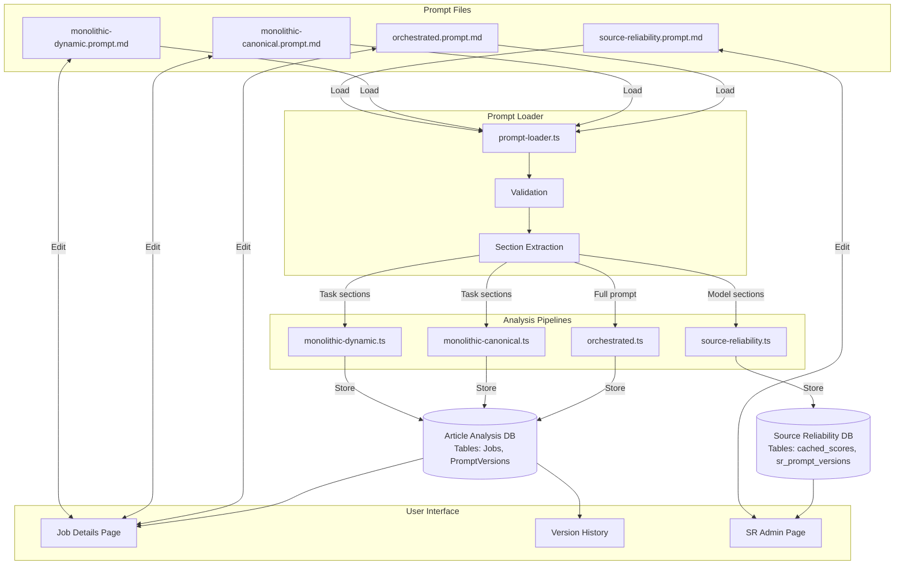

# External Prompt File System - Implementation Plan

> **Status**: Pending Review  
> **Version**: 2.6.41  
> **Date**: 2026-01-27  
> **Author**: AI Assistant  

> **FOR AI REVIEWER**: This plan implements external prompt file management for the FactHarbor fact-checking application. Please review for completeness, consistency with the codebase architecture, and potential issues.

---

## Overview

Create a prompt management system that:

1. Loads prompts from external files (hot-reloadable)
2. Stores used prompts in database per analysis
3. Provides UI to view used prompts and edit future prompts

**Goals:**

- Enable prompt editing without code deployment
- Ensure reproducibility by storing exact prompts used
- Support editing by humans, AI assistants, and test cases
- Provide warnings for prompt file errors

---

## Implementation Tasks

| ID | Task | Description |
|----|------|-------------|
| prompt-files | Create prompt files | Create external prompt files structure (`apps/web/prompts/*.prompt.md`) with YAML frontmatter and section markers |
| prompt-loader | Create loader utility | Create `prompt-loader.ts` with file reading, validation, variable substitution, and model-section extraction |
| db-schema | Database changes | Add merged `PromptVersions` table (content + history + usage), add `PromptContentHash` reference to Jobs and SR cache |
| api-routes | API endpoints | Create `/api/prompts/{pipeline}` GET/PUT, `/api/prompts/{pipeline}/history`, `/api/prompts/{pipeline}/rollback` |
| version-auto | Version management | Implement auto-increment on save, lastModified update |
| integrate-orchestrated | Orchestrated integration | Integrate prompt loader into `orchestrated.ts` pipeline |
| integrate-monolithic | Monolithic integration | Integrate prompt loader into monolithic pipelines via `buildPrompt()` |
| integrate-sr | Source Reliability integration | Integrate prompt loader with multi-model section support |
| ui-viewer | Job prompt viewer | Create `PromptViewer` component for job details page with used/edit tabs |
| ui-history | Version history UI | Create version history panel with rollback functionality |
| ui-sr-prompt | SR prompt editor | Create `PromptEditor` component for Source Reliability admin page with view/edit capabilities |

---

## Data Flow Diagram



---

## Architecture

### Prompt Files Structure

```
apps/web/prompts/
├── orchestrated.prompt.md          # Full orchestrated pipeline prompt (~650 lines)
├── monolithic-canonical.prompt.md  # Monolithic canonical base templates
│                                   # Contains: understand + extract_facts + verdict + scope_refinement
├── monolithic-dynamic.prompt.md    # Monolithic dynamic base templates
│                                   # Contains: dynamic_plan + dynamic_analysis
└── source-reliability.prompt.md    # Source reliability evaluation prompt
```

**Note on Monolithic Pipelines:**

The monolithic pipelines use a composition architecture where prompts are built from:
1. **Base template** (from external file) - Core task instructions
2. **Provider variants** (in code) - LLM-specific tweaks (Anthropic, OpenAI, Google, Mistral)
3. **Config adaptations** (in code) - Runtime adjustments (tiering, knowledge mode)

The external prompt files contain only the base templates. Provider variants and config adaptations remain in code because:
- They contain model-specific optimizations that require code logic
- They are relatively stable compared to core prompts
- Extracting them would create many small files with high coupling

### Prompt File Format

Each prompt file uses Markdown with YAML frontmatter:

```markdown
---
version: "2.6.41"
pipeline: "orchestrated"
description: "Main orchestrated analysis pipeline prompt"
lastModified: "2026-01-26T12:00:00Z"
variables:
  - currentDate
  - currentDateReadable
  - originalClaim
  - contextsList
requiredSections:
  - "TERMINOLOGY"
  - "YOUR TASK"
---

# System Prompt

You are a fact-checking analyst...

## TERMINOLOGY (CRITICAL)
...

## YOUR TASK
...
```

**Frontmatter Fields:**

- `version`: Semantic version string (follows app version)
- `pipeline`: Pipeline identifier (`orchestrated`, `monolithic-canonical`, `monolithic-dynamic`, `source-reliability`)
- `description`: Human-readable description
- `lastModified`: ISO timestamp (auto-updated on save)
- `variables`: List of allowed template variables
- `requiredSections`: Section headers that must exist

---

## Detailed Implementation

### 1. Prompt Loader (`apps/web/src/lib/prompt-loader.ts`)

```typescript
// ============================================================
// TYPES
// ============================================================

interface PromptFrontmatter {
  version: string;
  pipeline: string;
  description?: string;
  lastModified?: string;
  variables: string[];
  requiredSections?: string[];
}

interface PromptFile {
  frontmatter: PromptFrontmatter;
  content: string;           // Raw content without frontmatter
  loadedAt: Date;
  filePath: string;
  rawContent: string;        // Full file content including frontmatter
}

interface ValidationWarning {
  type: 'unused_variable' | 'undeclared_variable' | 'missing_section' | 'size_warning';
  message: string;
  line?: number;
}

interface ValidationError {
  type: 'invalid_yaml' | 'missing_required_field' | 'file_not_found' | 'parse_error';
  message: string;
}

interface LoadResult {
  success: boolean;
  prompt?: PromptFile;
  warnings: ValidationWarning[];
  errors: ValidationError[];
}

interface RenderResult {
  rendered: string;
  missingVariables: string[];
}

// ============================================================
// FUNCTIONS
// ============================================================

/**
 * Load a prompt file by pipeline name.
 * Reads from disk each time (no caching) for hot-reload support.
 */
export async function loadPromptFile(pipeline: string): Promise<LoadResult>;

/**
 * Validate prompt content against declared variables and required sections.
 */
export function validatePrompt(
  content: string, 
  frontmatter: PromptFrontmatter
): { warnings: ValidationWarning[]; errors: ValidationError[] };

/**
 * Substitute template variables in prompt content.
 * Variables use ${variableName} syntax.
 */
export function renderPrompt(
  template: string, 
  variables: Record<string, string>
): RenderResult;

/**
 * Parse YAML frontmatter from markdown content.
 */
export function parseFrontmatter(content: string): {
  frontmatter: PromptFrontmatter | null;
  content: string;
  error?: string;
};

/**
 * Estimate token count for prompt content.
 */
export function estimateTokens(content: string): number;

/**
 * Get file path for a pipeline prompt.
 */
export function getPromptFilePath(pipeline: string): string;
```

**Implementation Notes:**

- Uses Node.js `fs.promises` for file operations
- YAML parsing via `yaml` package (already in dependencies)
- Token estimation: `Math.ceil(content.length / 4)` (rough approximation)
- File path: `path.join(process.cwd(), 'prompts', `${pipeline}.prompt.md`)`

---

### 2. Database Schema Changes

**Design Principle:** Single merged table per database for prompt content + version history + usage tracking. No orphan references.

#### 2.1 Article Analysis DB - PromptVersions Table

**New table:** `PromptVersions` - unified prompt storage, history, and usage

```sql
CREATE TABLE PromptVersions (
    ContentHash TEXT PRIMARY KEY,      -- SHA-256 hash of content (64 hex chars)
    Pipeline TEXT NOT NULL,            -- orchestrated, monolithic-canonical, etc.
    PromptVersion TEXT NOT NULL,       -- Version from frontmatter
    Content TEXT NOT NULL,             -- Full rendered prompt content
    SavedUtc TEXT NOT NULL,            -- When this version was saved
    SavedBy TEXT,                      -- Optional: user/system identifier
    UsageCount INTEGER DEFAULT 0,      -- How many jobs used this (0 = saved but never used)
    IsActive INTEGER DEFAULT 0,        -- 1 = current active version for this pipeline
    PreviousHash TEXT                  -- Hash of version this replaced (for rollback)
);
```

**File:** `apps/api/Data/Entities.cs`

**Add new entity:**

```csharp
public class PromptVersionEntity
{
    /// <summary>SHA-256 hash of the prompt content (primary key)</summary>
    public string ContentHash { get; set; } = string.Empty;
    
    /// <summary>Pipeline identifier (orchestrated, monolithic-canonical, etc.)</summary>
    public string Pipeline { get; set; } = string.Empty;
    
    /// <summary>Version from prompt file frontmatter</summary>
    public string PromptVersion { get; set; } = string.Empty;
    
    /// <summary>Full rendered prompt content</summary>
    public string Content { get; set; } = string.Empty;
    
    /// <summary>UTC timestamp when this version was saved</summary>
    public string SavedUtc { get; set; } = string.Empty;
    
    /// <summary>Who saved this version (user/system)</summary>
    public string? SavedBy { get; set; }
    
    /// <summary>Number of jobs that used this prompt (0 = never used)</summary>
    public int UsageCount { get; set; } = 0;
    
    /// <summary>Whether this is the current active version</summary>
    public bool IsActive { get; set; } = false;
    
    /// <summary>Hash of the version this replaced (for rollback)</summary>
    public string? PreviousHash { get; set; }
}
```

**Modify JobEntity - add reference to prompt:**

```csharp
/// <summary>
/// Hash reference to the prompt content in PromptVersions table.
/// </summary>
public string? PromptContentHash { get; set; }

/// <summary>
/// UTC timestamp when the prompt file was loaded.
/// </summary>
public string? PromptLoadedUtc { get; set; }
```

**Migration:** `apps/api/migrations/002_add_prompt_storage.sql`

```sql
-- Migration: Add unified PromptVersions table
-- Version: 2.6.41
-- Date: 2026-01-27

CREATE TABLE IF NOT EXISTS PromptVersions (
    ContentHash TEXT PRIMARY KEY,
    Pipeline TEXT NOT NULL,
    PromptVersion TEXT NOT NULL,
    Content TEXT NOT NULL,
    SavedUtc TEXT NOT NULL,
    SavedBy TEXT,
    UsageCount INTEGER DEFAULT 0,
    IsActive INTEGER DEFAULT 0,
    PreviousHash TEXT
);

-- Add reference column to Jobs table
ALTER TABLE Jobs ADD COLUMN PromptContentHash TEXT;
ALTER TABLE Jobs ADD COLUMN PromptLoadedUtc TEXT;

-- Create indexes
CREATE INDEX IF NOT EXISTS IX_PromptVersions_Pipeline ON PromptVersions(Pipeline);
CREATE INDEX IF NOT EXISTS IX_PromptVersions_IsActive ON PromptVersions(Pipeline, IsActive);
CREATE INDEX IF NOT EXISTS IX_PromptVersions_SavedUtc ON PromptVersions(SavedUtc DESC);
CREATE INDEX IF NOT EXISTS IX_Jobs_PromptContentHash ON Jobs(PromptContentHash);
```

**Storage logic:**

```typescript
// When saving a prompt (via UI or on first use):
async function savePromptVersion(
  pipeline: string,
  version: string,
  content: string,
  savedBy?: string
): Promise<string> {
  const contentHash = sha256(content);
  
  // Get current active version's hash
  const currentActive = await db.get(
    'SELECT ContentHash FROM PromptVersions WHERE Pipeline = ? AND IsActive = 1',
    [pipeline]
  );
  
  // Deactivate current version
  await db.run(
    'UPDATE PromptVersions SET IsActive = 0 WHERE Pipeline = ? AND IsActive = 1',
    [pipeline]
  );
  
  // Insert new version (or reactivate if same hash exists)
  await db.run(`
    INSERT INTO PromptVersions (ContentHash, Pipeline, PromptVersion, Content, SavedUtc, SavedBy, UsageCount, IsActive, PreviousHash)
    VALUES (?, ?, ?, ?, ?, ?, 0, 1, ?)
    ON CONFLICT(ContentHash) DO UPDATE SET IsActive = 1, PreviousHash = ?
  `, [contentHash, pipeline, version, content, new Date().toISOString(), savedBy, currentActive?.ContentHash, currentActive?.ContentHash]);
  
  return contentHash;
}

// When a job uses a prompt:
async function recordPromptUsage(contentHash: string): Promise<void> {
  await db.run(
    'UPDATE PromptVersions SET UsageCount = UsageCount + 1 WHERE ContentHash = ?',
    [contentHash]
  );
}
```

**Benefits of merged table:**
- Single source of truth
- No orphan references (saved-but-never-used prompts work)
- `UsageCount = 0` clearly shows "saved but never used"
- `IsActive = 1` marks current version per pipeline
- `PreviousHash` enables rollback chain traversal
- Deduplication still works (same content = same hash)

#### 2.2 Source Reliability DB - sr_prompt_versions Table

**File:** `apps/web/src/lib/source-reliability-cache.ts`

**New table:** `sr_prompt_versions` - same unified design

```sql
CREATE TABLE IF NOT EXISTS sr_prompt_versions (
    content_hash TEXT PRIMARY KEY,
    prompt_version TEXT NOT NULL,
    content TEXT NOT NULL,
    saved_utc TEXT NOT NULL,
    saved_by TEXT,
    usage_count INTEGER DEFAULT 0,
    is_active INTEGER DEFAULT 0,
    previous_hash TEXT
);

CREATE INDEX IF NOT EXISTS IX_sr_prompt_versions_is_active ON sr_prompt_versions(is_active);
CREATE INDEX IF NOT EXISTS IX_sr_prompt_versions_saved_utc ON sr_prompt_versions(saved_utc DESC);
```

**Add reference column to cached_scores:**

```sql
ALTER TABLE cached_scores ADD COLUMN prompt_content_hash TEXT;
```

**Update in `initDatabase()` function:**

```typescript
// Create SR prompt versions table
await db.run(`
  CREATE TABLE IF NOT EXISTS sr_prompt_versions (
    content_hash TEXT PRIMARY KEY,
    prompt_version TEXT NOT NULL,
    content TEXT NOT NULL,
    saved_utc TEXT NOT NULL,
    saved_by TEXT,
    usage_count INTEGER DEFAULT 0,
    is_active INTEGER DEFAULT 0,
    previous_hash TEXT
  )
`);

// Add reference column to cached_scores if missing
const columns = await db.all(`PRAGMA table_info(cached_scores)`);
const columnNames = columns.map(c => c.name);

if (!columnNames.includes('prompt_content_hash')) {
  await db.run('ALTER TABLE cached_scores ADD COLUMN prompt_content_hash TEXT');
}
```

**Storage helper:** Same pattern as Article Analysis DB.

---

### 3. API Endpoints

**File:** `apps/web/src/app/api/prompts/[pipeline]/route.ts`

#### GET /api/prompts/{pipeline}

Returns current prompt file content with metadata.

```typescript
// Response type
interface PromptDTO {
  pipeline: string;
  version: string;
  description: string;
  lastModified: string;
  variables: string[];
  requiredSections: string[];
  content: string;
  warnings: ValidationWarning[];
  estimatedTokens: number;
}
```

**Example response:**

```json
{
  "pipeline": "orchestrated",
  "version": "2.6.41",
  "description": "Main orchestrated analysis pipeline prompt",
  "lastModified": "2026-01-26T12:00:00Z",
  "variables": ["currentDate", "originalClaim"],
  "requiredSections": ["TERMINOLOGY", "YOUR TASK"],
  "content": "# System Prompt\n\nYou are a fact-checking analyst...",
  "warnings": [],
  "estimatedTokens": 4250
}
```

#### PUT /api/prompts/{pipeline}

Updates prompt file content. **Requires admin authentication.**

```typescript
// Request body
interface UpdatePromptRequest {
  content: string;           // Full file content including frontmatter
  expectedVersion?: string;  // Optimistic concurrency check (optional)
}

// Response
interface UpdatePromptResponse {
  success: boolean;
  newVersion: string;
  warnings: ValidationWarning[];
  errors?: ValidationError[];
}
```

#### GET /api/jobs/{id}/prompt

Returns the prompt that was used for a specific job (retrieved via hash lookup).

```typescript
// Response type
interface JobPromptDTO {
  jobId: string;
  pipeline: string;
  promptContentHash: string;       // Hash reference
  promptVersion: string;           // From UsedPrompts table
  promptLoadedUtc: string;
  usedPromptContent: string;       // Content from UsedPrompts table (joined)
  // For comparison
  currentPromptVersion?: string;
  hasChangedSinceRun: boolean;
}
```

**Query (joins Jobs with UsedPrompts):**

```sql
SELECT 
  j.Id as jobId,
  j.PromptContentHash as promptContentHash,
  j.PromptLoadedUtc as promptLoadedUtc,
  p.Pipeline as pipeline,
  p.PromptVersion as promptVersion,
  p.Content as usedPromptContent
FROM Jobs j
LEFT JOIN UsedPrompts p ON j.PromptContentHash = p.ContentHash
WHERE j.Id = ?
```

---

### 4. UI Components - Detailed Design

#### 4.1 Job Details Page - Prompt Viewer

**File:** `apps/web/src/app/jobs/[id]/components/PromptViewer.tsx`

**Visual Layout:**

```
┌─────────────────────────────────────────────────────────────────┐
│  Job Details: FH-ABC123                                         │
├─────────────────────────────────────────────────────────────────┤
│  [Overview] [Evidence] [Claims] [Prompt]  ← New tab             │
├─────────────────────────────────────────────────────────────────┤
│                                                                 │
│  ┌─────────────────────────────────────────────────────────┐   │
│  │ [Used Prompt] [Edit Prompt]  ← Toggle/tabs              │   │
│  └─────────────────────────────────────────────────────────┘   │
│                                                                 │
│  ┌─────────────────────────────────────────────────────────┐   │
│  │ Prompt Version: 2.6.41                                   │   │
│  │ Loaded: 2026-01-26 12:34:56 UTC                         │   │
│  │ Pipeline: orchestrated                                   │   │
│  │ ⚠ Current version differs (2.6.42)  ← If changed        │   │
│  └─────────────────────────────────────────────────────────┘   │
│                                                                 │
│  ┌─────────────────────────────────────────────────────────┐   │
│  │ # System Prompt                                          │   │
│  │                                                          │   │
│  │ You are a fact-checking analyst evaluating the          │   │
│  │ claim: "${originalClaim}"  ← Variables highlighted      │   │
│  │                                                          │   │
│  │ ## TERMINOLOGY (CRITICAL)                                │   │
│  │ ...                                                      │   │
│  │                                         [Syntax: MD]     │   │
│  └─────────────────────────────────────────────────────────┘   │
│                                                                 │
│  [Show Diff] [Copy to Clipboard]  ← Action buttons              │
│                                                                 │
└─────────────────────────────────────────────────────────────────┘
```

**Edit Mode Layout:**

```
┌─────────────────────────────────────────────────────────────────┐
│  [Used Prompt] [Edit Prompt]  ← "Edit Prompt" selected          │
├─────────────────────────────────────────────────────────────────┤
│                                                                 │
│  ┌─────────────────────────────────────────────────────────┐   │
│  │ Editing: orchestrated.prompt.md                          │   │
│  │ Current Version: 2.6.42                                  │   │
│  └─────────────────────────────────────────────────────────┘   │
│                                                                 │
│  ┌─────────────────────────────────────────────────────────┐   │
│  │ ⚠ Validation Warnings:                                   │   │
│  │   - Unused variable: ${contextsList}                     │   │
│  │   - Section "YOUR TASK" not found                        │   │
│  └─────────────────────────────────────────────────────────┘   │
│                                                                 │
│  ┌─────────────────────────────────────────────────────────┐   │
│  │ ---                                         [Line: 1]    │   │
│  │ version: "2.6.42"                                        │   │
│  │ pipeline: "orchestrated"                    [Editable]   │   │
│  │ variables:                                               │   │
│  │   - currentDate                                          │   │
│  │ ---                                                      │   │
│  │                                                          │   │
│  │ # System Prompt                                          │   │
│  │ ...                                                      │   │
│  └─────────────────────────────────────────────────────────┘   │
│                                                                 │
│  Tokens: ~4,250 / 8,000 recommended max                         │
│                                                                 │
│  [Cancel] [Save Changes]  ← Admin only                          │
│                                                                 │
└─────────────────────────────────────────────────────────────────┘
```

**Component Props:**

```typescript
interface PromptViewerProps {
  jobId: string;
  pipeline: string;
  usedPromptContent: string | null;
  usedPromptVersion: string | null;
  usedPromptLoadedUtc: string | null;
  isAdmin: boolean;
}
```

**Features:**

- Syntax highlighting for Markdown (use existing or `react-syntax-highlighter`)
- Variable highlighting: `${varName}` shown in distinct color
- Diff view: Side-by-side comparison of used vs current prompt
- Copy button: Copy prompt to clipboard
- Token counter: Estimated token count with warning at >8000
- Validation panel: Real-time validation warnings while editing
- Save confirmation: Modal confirming changes before saving

---

#### 4.2 Source Reliability Admin Page - Prompt Editor

**File:** `apps/web/src/app/admin/source-reliability/components/PromptEditor.tsx`

**Context:** The Source Reliability admin page (`/admin/source-reliability`) currently shows:

- Cached evaluations list
- Evaluation details modal
- Cache management controls

**Add new "Prompt" tab to the page:**

**Visual Layout - Tab View:**

```
┌─────────────────────────────────────────────────────────────────┐
│  Source Reliability Admin                                       │
├─────────────────────────────────────────────────────────────────┤
│  [Cached Scores] [Prompt]  ← New tab                            │
├─────────────────────────────────────────────────────────────────┤
│                                                                 │
│  Source Reliability Evaluation Prompt                           │
│  ─────────────────────────────────────                          │
│                                                                 │
│  ┌─────────────────────────────────────────────────────────┐   │
│  │ Version: 2.6.41                                          │   │
│  │ Last Modified: 2026-01-26 12:00:00 UTC                   │   │
│  │ Estimated Tokens: 1,850                                  │   │
│  └─────────────────────────────────────────────────────────┘   │
│                                                                 │
│  ┌─────────────────────────────────────────────────────────┐   │
│  │ ---                                                      │   │
│  │ version: "2.6.41"                                        │   │
│  │ pipeline: "source-reliability"                           │   │
│  │ variables:                                               │   │
│  │   - domain                                               │   │
│  │   - sourceType                                           │   │
│  │ ---                                                      │   │
│  │                                                          │   │
│  │ # Source Reliability Evaluation                          │   │
│  │                                                          │   │
│  │ Evaluate the reliability of: ${domain}                   │   │
│  │ Source type: ${sourceType}                               │   │
│  │ ...                                                      │   │
│  └─────────────────────────────────────────────────────────┘   │
│                                                                 │
│  [Cancel] [Save Changes]                                        │
│                                                                 │
└─────────────────────────────────────────────────────────────────┘
```

**Evaluation Details Modal Enhancement:**

When viewing details of a cached evaluation, show the prompt that was used:

```
┌─────────────────────────────────────────────────────────────────┐
│  Evaluation Details: reuters.com                         [X]    │
├─────────────────────────────────────────────────────────────────┤
│                                                                 │
│  Score: 0.92  |  Confidence: 0.88  |  Evaluated: 2026-01-25    │
│                                                                 │
│  ┌─────────────────────────────────────────────────────────┐   │
│  │ [Details] [Used Prompt]  ← New tab                       │   │
│  └─────────────────────────────────────────────────────────┘   │
│                                                                 │
│  When "Used Prompt" selected:                                   │
│  ┌─────────────────────────────────────────────────────────┐   │
│  │ Prompt Version: 2.6.40                                   │   │
│  │ ⚠ Current version differs (2.6.41)                       │   │
│  └─────────────────────────────────────────────────────────┘   │
│                                                                 │
│  ┌─────────────────────────────────────────────────────────┐   │
│  │ # Source Reliability Evaluation                          │   │
│  │                                                          │   │
│  │ Evaluate the reliability of: reuters.com                 │   │
│  │ ...                                                      │   │
│  └─────────────────────────────────────────────────────────┘   │
│                                                                 │
│  [Re-evaluate with Current Prompt]  ← Triggers new eval         │
│                                                                 │
└─────────────────────────────────────────────────────────────────┘
```

**Component Props:**

```typescript
interface SourceReliabilityPromptEditorProps {
  isAdmin: boolean;
}

interface EvaluationPromptViewerProps {
  domain: string;
  usedPromptContent: string | null;
  usedPromptVersion: string | null;
  onReEvaluate: () => void;
}
```

---

## Integration Points

### Orchestrated Pipeline (`apps/web/src/lib/analyzer/orchestrated.ts`)

**Current state:** Inline prompt strings scattered throughout (~9500 lines total file)

**Key integration points:**

- Line ~1200: Main system prompt construction
- Line ~3500: Extract facts prompt
- Line ~5800: Scope refinement prompt
- Line ~7200: Verdict generation prompt

**Integration approach:**

```typescript
// At start of analyzeOrchestrated() function:
const promptResult = await loadPromptFile('orchestrated');
if (!promptResult.success) {
  throw new Error(`Failed to load orchestrated prompt: ${promptResult.errors.map(e => e.message).join(', ')}`);
}
if (promptResult.warnings.length > 0) {
  promptResult.warnings.forEach(w => 
    debugLog(`⚠️ Prompt warning: ${w.message}`)
  );
}

// When using prompt:
const renderedPrompt = renderPrompt(promptResult.prompt!.content, {
  currentDate: config.currentDate,
  currentDateReadable: config.currentDateReadable,
  originalClaim: normalizedStatement,
  contextsList: JSON.stringify(contexts),
});

// Store in result for database persistence:
analysisResult.usedPromptContent = renderedPrompt;
analysisResult.promptVersion = promptResult.prompt!.frontmatter.version;
analysisResult.promptLoadedUtc = promptResult.prompt!.loadedAt.toISOString();
```

### Monolithic Canonical Pipeline (`apps/web/src/lib/analyzer/monolithic-canonical.ts`)

**Current state:** Uses `buildPrompt()` from `prompt-builder.ts` which composes prompts from multiple sources:

```
prompt-builder.ts
├── Base templates (task-specific)
│   ├── understand-base.ts
│   ├── extract-facts-base.ts
│   ├── verdict-base.ts
│   └── scope-refinement-base.ts
├── Provider variants (LLM-specific tweaks)
│   ├── anthropic.ts
│   ├── openai.ts
│   ├── google.ts
│   └── mistral.ts
└── Config adaptations
    ├── tiering.ts (budget model optimizations)
    ├── knowledge-mode.ts
    └── structured-output.ts
```

**Key LLM calls in monolithic-canonical.ts:**

| Line | Task | Purpose |
|------|------|---------|
| ~239 | `understand` | Extract claims and search queries from input |
| ~294 | `extract_facts` | Extract Evidence from search results |
| ~352 | `verdict` | Generate verdicts for claims |

**Integration approach - Option A (Single file per pipeline):**

Create `monolithic-canonical.prompt.md` containing concatenated base templates. The `buildPrompt()` function would:
1. Load external file as the base
2. Continue applying provider variants and config adaptations in code
3. Store final composed prompt in result

```typescript
// In monolithic-canonical.ts
const baseResult = await loadPromptFile('monolithic-canonical');
// buildPrompt() modified to accept external base
const understandPrompt = buildPrompt({
  task: 'understand',
  externalBase: baseResult.prompt?.content,
  // ... other params
});
```

**Integration approach - Option B (Multiple files per task):**

Create separate files for each task type:
```
apps/web/prompts/
├── monolithic/
│   ├── understand.prompt.md
│   ├── extract-facts.prompt.md
│   ├── verdict.prompt.md
│   └── scope-refinement.prompt.md
```

This provides more granular control but increases file management complexity.

**Recommendation:** Option A (single file) for initial implementation, with Option B as future enhancement.

### Monolithic Dynamic Pipeline (`apps/web/src/lib/analyzer/monolithic-dynamic.ts`)

**Current state:** Experimental pipeline with flexible output structure. Uses `buildPrompt()` with two task types:

```
prompt-builder.ts
├── Base templates (dynamic-specific)
│   ├── dynamic-plan-base.ts      # Research planning prompt (~25 lines)
│   └── dynamic-analysis-base.ts  # Analysis generation prompt (~32 lines)
├── Provider variants (same as canonical)
│   ├── anthropic.ts, openai.ts, google.ts, mistral.ts
└── Config adaptations (same as canonical)
    ├── tiering.ts, knowledge-mode.ts, structured-output.ts
```

**Key LLM calls in monolithic-dynamic.ts:**

| Line | Task | Purpose |
|------|------|---------|
| ~219 | `dynamic_plan` | Generate search queries and analysis approach |
| ~352 | `dynamic_analysis` | Generate flexible analysis with findings |

**Current base prompts content:**

- `dynamic-plan-base.ts`: Instructs LLM to identify claims, generate 3-5 search queries, determine analysis approach
- `dynamic-analysis-base.ts`: Instructs LLM to provide summary, verdict, key findings with support levels, methodology notes

**Integration approach:**

Create `monolithic-dynamic.prompt.md` containing both base templates with clear section markers:

```markdown
---
version: "2.6.41"
pipeline: "monolithic-dynamic"
variables:
  - currentDate
---

## DYNAMIC_PLAN

You are an experimental fact-checking assistant...
[content from dynamic-plan-base.ts]

## DYNAMIC_ANALYSIS

You are an experimental fact-checking assistant...
[content from dynamic-analysis-base.ts]
```

The `buildPrompt()` function extracts the relevant section based on task type.

**Note:** Dynamic pipeline is marked "Experimental" - prompts are shorter and more flexible than canonical.

### Source Reliability

**File:** `apps/web/src/app/api/fh/evaluate-source/route.ts` (or similar)

```typescript
// Load SR prompt
const promptResult = await loadPromptFile('source-reliability');
// ... validation ...

// Render with domain-specific variables
const rendered = renderPrompt(promptResult.prompt!.content, {
  domain: sourceDomain,
  sourceType: detectedSourceType,
  // ... other vars
});

// Store in cache entry
cacheEntry.used_prompt_content = rendered;
cacheEntry.prompt_version = promptResult.prompt!.frontmatter.version;
```

---

## Validation Rules

### Required Validations

| Rule | Type | Description |
|------|------|-------------|
| Valid YAML | Error | Frontmatter must parse as valid YAML |
| Required fields | Error | `version`, `pipeline`, `variables` must exist |
| Pipeline match | Error | `pipeline` in frontmatter must match filename |
| File exists | Error | Prompt file must exist at expected path |
| Unused variables | Warning | Variables declared but not used in content |
| Undeclared variables | Warning | `${var}` used but not in variables list |
| Missing sections | Warning | Required sections not found in content |
| Size limit | Warning | Content >100KB or >8000 estimated tokens |

### Example Validation Output

```typescript
{
  success: true,
  warnings: [
    { type: 'unused_variable', message: 'Variable "contextsList" declared but not used' },
    { type: 'size_warning', message: 'Estimated 8,500 tokens exceeds 8,000 recommended max' }
  ],
  errors: []
}
```

---

## File Structure Summary

```
apps/web/
├── prompts/                              # NEW: External prompt files
│   ├── orchestrated.prompt.md            # ~650 lines, full pipeline prompt
│   ├── monolithic-canonical.prompt.md    # ~400 lines, base templates for 4 tasks
│   ├── monolithic-dynamic.prompt.md      # ~200 lines, base templates for 2 tasks
│   └── source-reliability.prompt.md      # ~150 lines, SR evaluation prompt
├── src/lib/
│   ├── prompt-loader.ts                  # NEW: File loading utilities
│   ├── source-reliability-cache.ts       # MODIFY: Add prompt columns
│   └── analyzer/
│       ├── orchestrated.ts               # MODIFY: Use loader (inline prompts → external)
│       ├── monolithic-canonical.ts       # MODIFY: Use loader via buildPrompt()
│       ├── monolithic-dynamic.ts         # MODIFY: Use loader via buildPrompt()
│       └── prompts/
│           ├── prompt-builder.ts         # MODIFY: Accept external base templates
│           ├── base/                     # KEEP: May be deprecated after migration
│           │   ├── understand-base.ts
│           │   ├── extract-facts-base.ts
│           │   ├── verdict-base.ts
│           │   ├── scope-refinement-base.ts
│           │   ├── dynamic-plan-base.ts
│           │   └── dynamic-analysis-base.ts
│           ├── providers/                # KEEP: Provider-specific variants
│           │   ├── anthropic.ts
│           │   ├── openai.ts
│           │   ├── google.ts
│           │   └── mistral.ts
│           └── config-adaptations/       # KEEP: Runtime adaptations
│               ├── tiering.ts
│               ├── knowledge-mode.ts
│               └── structured-output.ts
└── src/app/
    ├── api/
    │   ├── prompts/                      # NEW: Prompt API routes
    │   │   └── [pipeline]/route.ts
    │   └── fh/
    │       └── evaluate-source/route.ts  # MODIFY: Use loader for SR
    ├── jobs/[id]/
    │   ├── page.tsx                      # MODIFY: Add Prompt tab
    │   └── components/
    │       └── PromptViewer.tsx          # NEW: UI component
    └── admin/source-reliability/
        ├── page.tsx                      # MODIFY: Add Prompt tab
        └── components/
            ├── PromptEditor.tsx          # NEW: SR prompt editor
            └── EvaluationPromptViewer.tsx # NEW: Used prompt in modal

apps/api/
├── Data/
│   └── Entities.cs                       # MODIFY: Add prompt fields
├── Controllers/
│   └── JobsController.cs                 # MODIFY: Return prompt fields
└── migrations/
    └── 002_add_prompt_storage.sql        # NEW: Migration
```

**Migration Note:** After external prompt files are stable, the `prompts/base/*.ts` files can be deprecated. During transition, both systems work in parallel with external files taking precedence when present.

---

## Security Considerations

- **Authentication**: Prompt editing (PUT) requires admin authentication via `FH_ADMIN_KEY`
- **Path traversal**: Pipeline names validated against allowlist, no path characters allowed
- **Content sanitization**: Prompt content sanitized before database storage (no script injection)
- **Rate limiting**: Prompt API endpoints rate-limited (10 req/min for GET, 5 req/min for PUT)
- **Audit logging**: All prompt edits logged with timestamp and editor identity (if available)

---

## Benefits

1. **Hot-reloadable**: Edit prompts without code deployment or server restart
2. **Reproducible**: Every analysis stores its exact prompt for debugging
3. **Debuggable**: Compare prompts between runs to identify regression causes
4. **Testable**: Test cases can verify specific prompt versions
5. **Collaborative**: Users and AI assistants can iterate on prompts
6. **Version tracked**: Prompt files in git for history and review

---

## Testing Considerations

- **Unit tests** for prompt-loader.ts (parsing, validation, rendering)
- **Integration tests** for API endpoints (authentication, CRUD)
- **E2E tests** for UI components (view/edit flow)
- **Regression tests**: Ensure prompt changes don't break existing analyses

---

## Design Decisions (Resolved)

1. **Prompt granularity**: One file per pipeline (phases are sections within the file)
2. **Version auto-increment**: Yes - system auto-increments version on save
3. **Rollback mechanism**: Yes - UI supports reverting to previous prompt versions
4. **Multi-model prompts**: One file with model-specific sections (e.g., `## ANTHROPIC`, `## OPENAI`)

---

## Version Auto-Increment

When saving a prompt file via the API:

```typescript
// In PUT /api/prompts/{pipeline}
function autoIncrementVersion(currentVersion: string): string {
  // Parse semantic version: "2.6.41" -> [2, 6, 41]
  const parts = currentVersion.split('.').map(Number);
  // Increment patch version
  parts[2] = (parts[2] || 0) + 1;
  return parts.join('.');
}

// On save:
// 1. Parse frontmatter
// 2. Auto-increment version
// 3. Update lastModified timestamp
// 4. Write file with new frontmatter
```

**Frontmatter auto-updated fields:**
- `version`: Auto-incremented (e.g., "2.6.41" → "2.6.42")
- `lastModified`: Set to current UTC timestamp

---

## Rollback Mechanism

### How Rollback Works with Merged Table

The `PromptVersions` table (and `sr_prompt_versions` for SR) already contains everything needed for rollback:

- `IsActive = 1` marks the current version
- `PreviousHash` creates a chain of versions
- All saved versions are retained (nothing deleted)

### API Endpoints for Rollback

```
GET  /api/prompts/{pipeline}/history     # List version history
POST /api/prompts/{pipeline}/rollback    # Rollback to specific version
```

**GET /api/prompts/{pipeline}/history response:**

```typescript
interface PromptHistoryDTO {
  entries: Array<{
    id: number;
    contentHash: string;
    version: string;
    savedUtc: string;
    savedBy: string | null;
    isRollback: boolean;
    isCurrent: boolean;          // Is this the active version?
  }>;
}
```

**POST /api/prompts/{pipeline}/rollback request:**

```typescript
interface RollbackRequest {
  targetContentHash: string;     // Hash of version to restore
}
```

### UI - Version History Panel

Add to the Prompt Editor UI:

```
┌─────────────────────────────────────────────────────────────────┐
│  [Edit Prompt] [Version History]  ← New tab                     │
├─────────────────────────────────────────────────────────────────┤
│                                                                 │
│  Version History for: orchestrated                              │
│  ─────────────────────────────────                              │
│                                                                 │
│  ┌─────────────────────────────────────────────────────────┐   │
│  │ ● v2.6.43 (current)        2026-01-27 14:30:00          │   │
│  │   Used by: 0 jobs                                        │   │
│  │                                                          │   │
│  │ ○ v2.6.42                  2026-01-27 12:15:00          │   │
│  │   Used by: 15 jobs                    [View] [Rollback]  │   │
│  │                                                          │   │
│  │ ○ v2.6.41                  2026-01-26 10:00:00          │   │
│  │   Used by: 42 jobs                    [View] [Rollback]  │   │
│  │                                                          │   │
│  │ ○ v2.6.40 (rollback)       2026-01-25 16:45:00          │   │
│  │   Used by: 3 jobs                     [View] [Rollback]  │   │
│  └─────────────────────────────────────────────────────────┘   │
│                                                                 │
│  [Compare Selected] [Export History]                            │
│                                                                 │
└─────────────────────────────────────────────────────────────────┘
```

**Features:**
- List all saved versions with timestamps
- Show job count using each version (from UsageCount)
- View any historical version content
- Rollback to any previous version (creates new version entry)
- Compare two versions side-by-side
- Mark rollback entries distinctly

---

## Multi-Model Prompt Format (Source Reliability)

The `source-reliability.prompt.md` file supports model-specific sections:

```markdown
---
version: "2.6.41"
pipeline: "source-reliability"
variables:
  - domain
  - sourceType
  - additionalContext
models:
  - anthropic
  - openai
defaultModel: anthropic
---

## COMMON

Shared instructions that apply to all models...

## ANTHROPIC

Claude-specific instructions and optimizations...

## OPENAI

GPT-specific instructions and optimizations...

## FALLBACK

Used when model not in list above...
```

**Loader behavior:**

```typescript
function getModelSection(content: string, model: string): string {
  // 1. Extract COMMON section (always included)
  const common = extractSection(content, 'COMMON');
  
  // 2. Try to find model-specific section
  const modelSection = extractSection(content, model.toUpperCase());
  
  // 3. Fall back to FALLBACK section if model not found
  const specific = modelSection || extractSection(content, 'FALLBACK');
  
  return common + '\n\n' + specific;
}
```

**Benefits:**
- Single file to manage
- Shared content in COMMON section (DRY)
- Model-specific optimizations where needed
- Easy to add new models (just add section)

---

## Implementation Order

1. **prompt-files**: Create directory structure and initial prompt files (extract from inline code)
2. **prompt-loader**: Implement loader with validation and model-section extraction
3. **db-schema**: Add UsedPrompts, PromptHistory tables with migrations
4. **api-routes**: Create GET/PUT endpoints
5. **version-auto**: Implement version auto-increment logic
6. **integrate-orchestrated**: First pipeline integration (largest, most complex)
7. **integrate-monolithic**: Extend to monolithic pipelines via buildPrompt()
8. **integrate-sr**: Source reliability integration with multi-model support
9. **ui-viewer**: Job details prompt viewer
10. **ui-history**: Version history panel with rollback
11. **ui-sr-prompt**: Source reliability prompt editor

---

## Future Considerations

**Web Search Configuration Editor** (separate future feature):
- External configuration file for search settings
- Track `SearchConfigHash` per analysis for reproducibility
- UI to view/edit search configuration (providers, limits, date restrictions, domain filters)
- Similar pattern to prompt management but for settings-based config
- Note: Search query generation prompts are already covered by this plan (in pipeline prompts)

---

## Related Documentation

- [TERMINOLOGY.md](../REFERENCE/TERMINOLOGY.md) - FactHarbor entity definitions
- [Calculations.md](../ARCHITECTURE/Calculations.md) - Verdict calculation documentation
- [Source_Reliability.md](../ARCHITECTURE/Source_Reliability.md) - Source reliability documentation
- [Context_Detection_via_EvidenceScope.md](../ARCHITECTURE/Context_Detection_via_EvidenceScope.md) - Context detection implementation

---

**END OF PLAN - Ready for AI Assistant Review**
