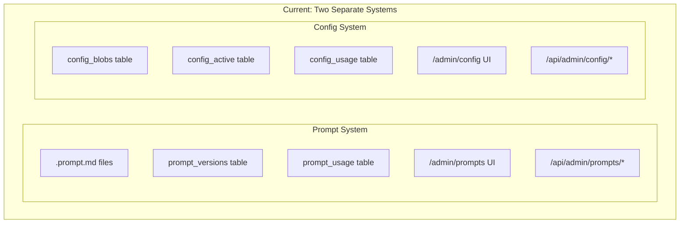
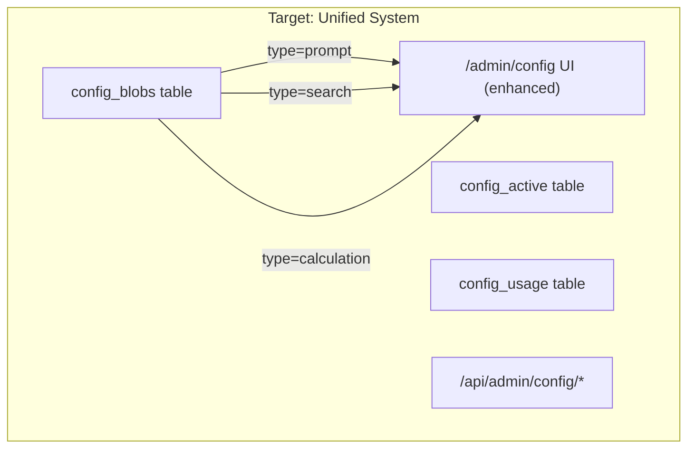
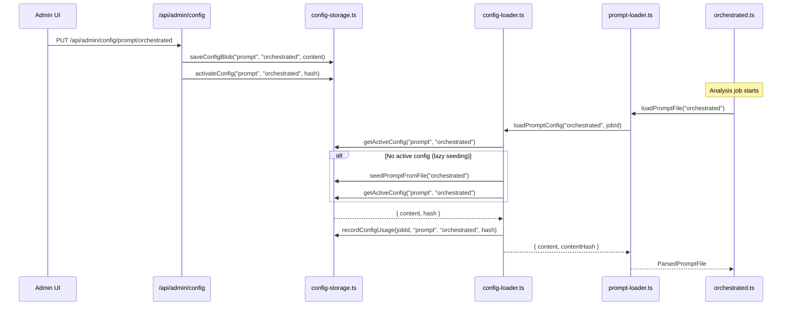

# Full Prompt Unification Plan

**Status**: APPROVED - Ready for Implementation  
**Date**: 2026-01-28  
**Revision**: v3.1 (final tightening after GO)  
**Overview**: Migrate prompt management from the separate file-based system into the Unified Config Management system, consolidating storage in config_blobs and merging the admin UI.

---

## Tasks

| ID | Phase | Task | Status |
|----|-------|------|--------|
| runtime-inventory | 0 | Inventory all runtime prompt entrypoints and classify in-scope vs out-of-scope | pending |
| enhance-schemas | 1 | Enhance config-schemas.ts for structural prompt validation (rich validation in UI) | pending |
| add-prompt-loader | 1 | Add loadPromptConfig() to config-loader.ts | pending |
| add-seeding | 1 | Add seedPromptsFromFiles() with idempotency and concurrency safety | pending |
| add-export | 1 | Add prompt export API (download response, optional dev-only file write) | pending |
| refactor-prompt-loader | 2 | Refactor prompt-loader.ts to use config-loader (with lazy fallback seeding) | pending |
| migrate-job-prompts | 2 | Migrate /api/fh/jobs/[id]/prompts to use config_usage | pending |
| extract-prompt-editor | 3 | Extract PromptEditor component from admin/prompts | pending |
| integrate-editor | 3 | Integrate PromptEditor into admin/config page | pending |
| add-redirect | 3 | Add redirect /admin/prompts -> /admin/config?type=prompt | pending |
| verify-acceptance | 4 | Run acceptance checklist before deletion | pending |
| delete-old-system | 4 | Delete old prompt admin, API, and storage files | pending |
| update-admin-nav | 4 | Update admin page navigation | pending |

---

## Acceptance Checklist

Before Phase 4 deletions, all criteria must pass:

- [ ] **Tracking**: Changing active DB prompt changes the recorded/tracked prompt version and hash deterministically; job reports retrieve that content
- [ ] **Admin**: Can view/save/validate/activate/rollback prompt configs with same or better safety as old admin
- [ ] **Job reports**: Job shows exact prompt version hash used and content is retrievable via unified config system
- [ ] **Storage unification**: Exactly one **tracking** source of truth (DB `config_blobs`); `.prompt.md` files are seed/export only; old `prompt_versions`/`prompt_usage` tables removed
- [ ] **Export**: Admin can download prompt content as `.prompt.md` file for Git-based review

---

## History Migration Decision

**Decision**: Start fresh in `config_blobs`. Existing `prompt_versions` history will NOT be migrated.

**Rationale**:
- User explicitly stated backward compatibility with previous prompt data is not required
- Simplifies implementation (no migration script needed)
- Existing `.prompt.md` files serve as the canonical seed content
- Old history remains accessible in `prompt-versions.db` until Phase 4 deletion (for manual reference if needed)

---

## Current State





---

## Phase 0: Runtime Prompt Inventory

**Purpose**: Document what this unification actually affects. The `.prompt.md` / `loadPromptFile()` path is currently **tracking-only**, not runtime LLM invocation.

### Entrypoint Classification

| Entrypoint | File | Current Behavior | Classification |
|------------|------|------------------|----------------|
| `loadPromptFile("orchestrated")` | `apps/web/src/lib/analyzer/orchestrated.ts:8896` | Loads via prompt-loader.ts, used for tracking only | IN-SCOPE |
| `loadPromptFile("monolithic-canonical")` | `apps/web/src/lib/analyzer/monolithic-canonical.ts:415` | Loads via prompt-loader.ts, used for tracking only | IN-SCOPE |
| `loadPromptFile("monolithic-dynamic")` | `apps/web/src/lib/analyzer/monolithic-dynamic.ts:181` | Loads via prompt-loader.ts, used for tracking only | IN-SCOPE |
| `loadPromptFile("source-reliability")` | `apps/web/src/app/api/internal/evaluate-source/route.ts:2576` | Loads via prompt-loader.ts, used for tracking only | IN-SCOPE |
| Inline system prompts | Various LLM `generateText()` calls | Hardcoded strings in code | OUT-OF-SCOPE (future work) |

### Key Finding

Most LLM calls currently use **hardcoded inline prompts**, not external prompt files. The external `.prompt.md` files are loaded for **version tracking only**, not actual LLM invocation.

**Scope Decision**: This unification covers the prompt tracking/versioning/admin system. Migrating inline prompts to use external files is a separate, larger effort (out of scope for this plan).

### Acceptance Criteria for Phase 0

- [ ] All `loadPromptFile()` call sites documented with full file paths
- [ ] Each classified as IN-SCOPE or OUT-OF-SCOPE with rationale
- [ ] OUT-OF-SCOPE items logged as future work (not blockers)

---

## Key Changes

### 1. Storage Migration

- **Remove**: `prompt_versions`, `prompt_usage` tables (in `prompt-versions.db`)
- **Use**: `config_blobs`, `config_active`, `config_usage` tables (in `config.db`)
- **Profile keys for prompts**: `orchestrated`, `monolithic-canonical`, `monolithic-dynamic`, `source-reliability`
- **Schema version**: `prompt.v1` (already defined in `apps/web/src/lib/config-schemas.ts`)
- **History**: Start fresh (no migration from old tables)

### 2. Prompt Loader Update

Update `apps/web/src/lib/analyzer/prompt-loader.ts` to:

```typescript
// BEFORE: File-based loading
const rawContent = await readFile(filePath, "utf-8");

// AFTER: DB-based loading via config-storage with lazy fallback seeding
import { getActiveConfig } from "@/lib/config-storage";
let config = await getActiveConfig("prompt", pipeline);

if (!config) {
  // Lazy fallback: seed from file on first access, then load
  console.warn(`[Prompt-Loader] No DB prompt for ${pipeline}, seeding from file...`);
  await seedPromptFromFile(pipeline);
  config = await getActiveConfig("prompt", pipeline);
}

const rawContent = config?.content;
```

Keep existing functions (`getSection`, `renderSection`, `parsePromptContent`) but change the source from files to DB.

### 3. Admin UI Consolidation

**Approach**: Extract prompt editor as a reusable component, render it when `type === "prompt"` in config page.

The current `/admin/prompts` has features the config page lacks:
- Section navigation sidebar
- Markdown editor with line numbers
- Token estimation per section
- Section folding/collapse
- Search within editor
- Keyboard shortcuts
- Validation (YAML, sections, variables)

### 4. Job Prompt Usage Migration

Migrate `/api/fh/jobs/[id]/prompts` and `PromptViewer` component to read from unified config system:

```typescript
// BEFORE: Reads from prompt_usage table via prompt-storage.ts
const usage = await getPromptUsageForJob(jobId);

// AFTER: Reads from config_usage where config_type='prompt'
const usage = await getConfigUsageForJob(jobId);
const promptUsage = usage.filter(u => u.configType === 'prompt');
```

### 5. Export Story (CLARIFIED)

**Primary mechanism**: API returns content as download response (browser saves file).

```typescript
// GET /api/admin/config/prompt/[profile]/export
// Returns: Content-Disposition: attachment; filename="orchestrated.prompt.md"
export async function GET(req: Request, { params }: RouteParams) {
  // MUST enforce admin auth (x-admin-key)
  if (!isAuthorized(req)) {
    return NextResponse.json({ error: "Unauthorized" }, { status: 401 });
  }
  
  const { profile } = await params;
  
  // Validate profile against known pipelines to prevent header injection
  const VALID_PROFILES = ["orchestrated", "monolithic-canonical", "monolithic-dynamic", "source-reliability"];
  if (!VALID_PROFILES.includes(profile)) {
    return NextResponse.json({ error: "Invalid profile" }, { status: 400 });
  }
  
  const config = await getActiveConfig("prompt", profile);
  
  return new Response(config.content, {
    headers: {
      "Content-Type": "text/markdown",
      "Content-Disposition": `attachment; filename="${profile}.prompt.md"`,
    },
  });
}
```

**Optional dev-only server write** (disabled in production):
- Only enabled when `NODE_ENV !== "production"` AND `FH_ALLOW_PROMPT_EXPORT_WRITE=true`
- Path constrained to `apps/web/prompts/` directory (hardcoded allowlist)
- Input sanitized: `profileKey` validated against known pipelines, no path traversal

**Rationale**: Download-first approach works in all environments (serverless, containers, read-only filesystems). Dev-only write is convenience for local Git workflows.

### 6. Rollback Semantics

**Decision**: Use existing `config_blobs` content-addressable model. No strict "previous pointer" chain required.

- Any historical version can be activated via `activateConfig(type, profile, hash)`
- History is retrieved via `getConfigHistory()` ordered by `created_utc DESC`
- No `previous_hash` linkage needed (content-addressable deduplication handles it)

---

## Files to Modify

| File | Change |
|------|--------|
| `apps/web/src/lib/config-schemas.ts` | Structural prompt validation (rich validation stays in UI) |
| `apps/web/src/lib/config-storage.ts` | Add `seedPromptFromFile()`, `seedAllPromptsFromFiles()` |
| `apps/web/src/lib/config-loader.ts` | Add `loadPromptConfig()` with lazy fallback |
| `apps/web/src/lib/analyzer/prompt-loader.ts` | Change to load from DB via config-loader |
| `apps/web/src/app/api/fh/jobs/[id]/prompts/route.ts` | Migrate to read from config_usage |
| `apps/web/src/app/jobs/[id]/components/PromptViewer.tsx` | Update to use migrated API |
| `apps/web/src/app/api/admin/config/[type]/[profile]/export/route.ts` | New: download export endpoint |
| `apps/web/src/app/admin/config/page.tsx` | Add prompt editor component for `type="prompt"` |
| `apps/web/src/app/admin/prompts/` | Remove (redirect to `/admin/config?type=prompt`) |
| `apps/web/src/app/api/admin/prompts/` | Remove (use `/api/admin/config/prompt/[profile]/*`) |

## Files to Delete (Phase 4, after acceptance checklist passes)

- `apps/web/src/app/admin/prompts/` (entire directory)
- `apps/web/src/app/api/admin/prompts/` (entire directory)
- `apps/web/src/lib/prompt-storage.ts`

## Files to Keep

- `apps/web/prompts/*.prompt.md` - Keep as seed data and export target

---

## Implementation Tasks (Detailed)

### Phase 1: Enhance Config System for Prompts

1. **Update `config-schemas.ts`**:
   - Structural validation only (frontmatter exists, required fields present)
   - Rich validation (section parsing, token counts, variable checking) stays in UI component
   - Return basic parsed metadata (version, pipeline) for display

2. **Add prompt loader to `config-loader.ts`**:
   ```typescript
   export async function loadPromptConfig(
     profile: string,  // pipeline name
     jobId?: string
   ): Promise<{ content: string; contentHash: string; fromCache: boolean }>
   ```

3. **Add seeding functions to `config-storage.ts`**:
   ```typescript
   /**
    * Seed a single prompt from file if no active config exists.
    * Idempotent: no-op if active config already present.
    * Concurrency-safe: uses DB transaction with conflict handling.
    */
   export async function seedPromptFromFile(
     pipeline: string,
     force?: boolean
   ): Promise<{ seeded: boolean; contentHash: string | null }>
   
   /**
    * Seed all prompts from files (optional optimization).
    * Can be called on app startup, but lazy fallback in loader is the primary mechanism.
    */
   export async function seedAllPromptsFromFiles(): Promise<void>
   ```
   
   **Primary trigger**: Lazy fallback in `loadPromptConfig()` when no active config exists.
   
   **Optional optimization**: Call `seedAllPromptsFromFiles()` in app initialization to pre-warm.
   
   **Idempotency**: Check `getActiveConfigHash("prompt", pipeline)` before seeding. Skip if exists.
   
   **Concurrency**: Use SQLite transaction with `INSERT OR IGNORE` semantics.

4. **Add export endpoint**:
   ```typescript
   // GET /api/admin/config/prompt/[profile]/export
   // Returns download response with Content-Disposition header
   ```

### Phase 2: Update Prompt Loader and Job Tracking

1. **Refactor `prompt-loader.ts`**:
   - Remove file-reading code
   - Call `loadPromptConfig()` from config-loader
   - Lazy fallback: if no DB config, seed from file first (already in loader)
   - Keep parsing functions (`parsePromptContent`, `getSection`, `renderSection`)
   - Keep `PromptFile` interface

2. **Migrate job prompt tracking**:
   - Update `/api/fh/jobs/[id]/prompts/route.ts` to query `config_usage WHERE config_type='prompt'`
   - Update `PromptViewer.tsx` if needed (likely just API response shape change)

3. **Update usage in analyzers**:
   - No changes needed if `loadPromptFile()` signature stays the same

### Phase 3: Merge Admin UI

1. **Create `PromptEditor` component**:
   - Extract from `admin/prompts/page.tsx`
   - Props: `content`, `onChange`, `pipeline`, `readonly`
   - Features: section nav, line numbers, search, validation, token count

2. **Integrate into `admin/config/page.tsx`**:
   - Render `PromptEditor` when `selectedType === "prompt"`
   - Use JSON forms for search/calculation (existing)
   - Add "Download as File" button for prompts

3. **Add redirect from old URL**:
   - `/admin/prompts` -> `/admin/config?type=prompt&profile=orchestrated`

### Phase 4: Remove Old System (After Acceptance Checklist)

**Prerequisites** (all must pass):
- [ ] Acceptance checklist complete
- [ ] New prompt editor supports all workflows (history/compare/rollback)
- [ ] Job prompt usage endpoints migrated and verified
- [ ] Prompt tracking verified across all in-scope pipelines

**Actions**:
1. Delete `apps/web/src/app/admin/prompts/` directory
2. Delete `apps/web/src/app/api/admin/prompts/` directory  
3. Delete `apps/web/src/lib/prompt-storage.ts`
4. Update `apps/web/src/app/admin/page.tsx` to remove prompts link
5. Clean up imports in analyzer files
6. Delete `prompt-versions.db` (or leave orphaned - no runtime impact)
   - **Note**: Archive/copy `prompt-versions.db` before deletion if you want to preserve old history for audit/reference

---

## Data Flow After Unification



---

## Risk Mitigation

| Risk | Mitigation |
|------|------------|
| No DB prompt on first run | Lazy fallback seeds from file automatically |
| Concurrent workers racing to seed | SQLite transaction with `INSERT OR IGNORE` |
| Loss of Git-based prompt review | Download export via API; optional dev-only file write |
| Job reports break after migration | Migrate job prompt API before deleting old storage |
| Incomplete editor feature parity | Acceptance checklist gates Phase 4 deletion |
| Export path traversal attack | Hardcoded allowlist (`apps/web/prompts/`), dev-only, validated profileKey |

---

## Reviewer Notes (v1 - ADDRESSED)

The following feedback from the initial review has been incorporated:

- [x] **Runtime entrypoint inventory** - Added Phase 0 with classification table
- [x] **Job tracking migration** - Added task `migrate-job-prompts` in Phase 2
- [x] **Seeding specification** - Added idempotency, concurrency, and trigger details
- [x] **Export story** - Added `exportPromptToFile()` and "Export to File" button
- [x] **Rollback semantics** - Clarified: use content-addressable model, no previous pointer chain
- [x] **Acceptance checklist** - Added at top of document
- [x] **Phase 4 dependencies** - Added prerequisites before deletion

---

## Reviewer Notes (v2 - ADDRESSED)

The following feedback from the v2 review has been incorporated:

- [x] **Acceptance checklist contradicts scope** - Rewritten to reflect tracking-only scope:
  - "Runtime" -> "Tracking" (changing DB prompt changes tracked hash, not LLM behavior)
  - "No drift" -> "Storage unification" (single DB source of truth, files are seed/export only)
- [x] **Export-to-file clarification** - Primary mechanism is download response (browser saves); dev-only server write is optional with path safety
- [x] **History migration decision** - Explicitly stated: start fresh, no migration (per user requirement)
- [x] **Phase 0 paths explicit** - Full file paths now shown in entrypoint table
- [x] **Task naming alignment** - `enhance-schemas` now says "structural" to match implementation description
- [x] **Seeding trigger** - Lazy fallback is primary mechanism; app init seeding is optional optimization

---

## Reviewer Notes (v3) - APPROVED

**Status**: GO

v3 resolves the blocking issues cleanly:
- Acceptance checklist aligned with scope
- Export clarified and deploy-safe
- History migration decision explicit
- Nits fixed (paths, wording, seeding framing)

**Final tightening applied (v3.1)**:
- [x] Export endpoint: added admin auth check and profile validation (header injection prevention)
- [x] Old history retention: added archive note before deletion
- [x] Scope wording: added "tracking" emphasis in Storage unification criterion

