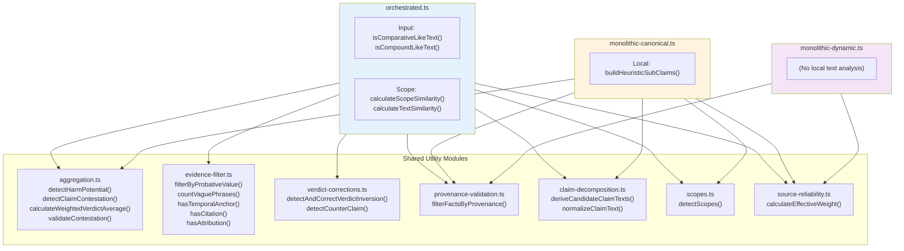
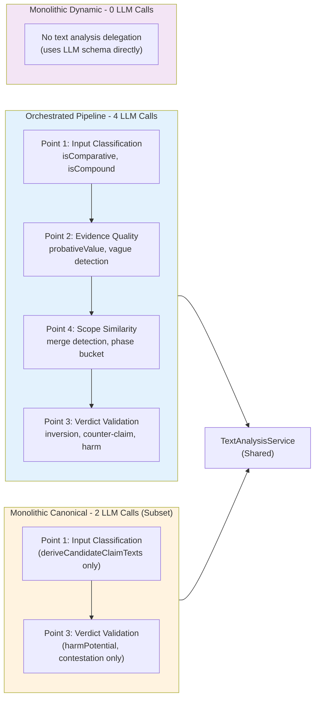
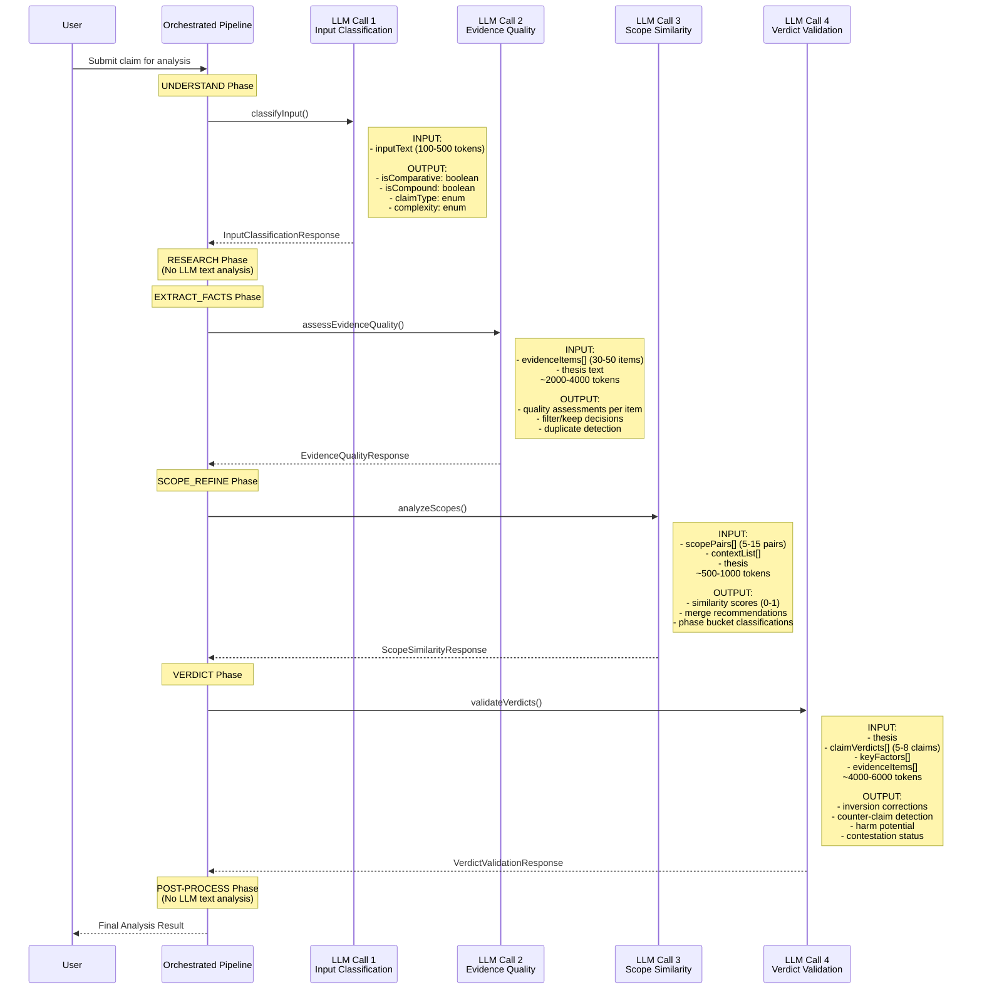

# LLM Text Analysis Delegation - Pipeline Deep Analysis

**Document Type**: Technical Proposal / Architecture Review
**Date**: 2026-01-30
**Author**: Claude (AI Assistant)
**Status**: ✅ IMPLEMENTED & TESTED (v2.8.2 - 26 promptfoo test cases)
**Related**: `LLM_Delegation_Proposal_Text_Analysis.md` (predecessor)

---

## Implementation Status (2026-01-30)

> **Implementation Complete**: The LLM Text Analysis Pipeline has been implemented for both the Orchestrated and Monolithic Canonical pipelines. All 4 analysis points are integrated with feature flag control and heuristic fallback.

### Files Created

| File | Purpose |
|------|---------|
| `apps/web/src/lib/analyzer/text-analysis-types.ts` | Type definitions and interfaces |
| `apps/web/src/lib/analyzer/text-analysis-heuristic.ts` | Heuristic implementation (baseline) |
| `apps/web/src/lib/analyzer/text-analysis-llm.ts` | LLM implementation with prompt loading |
| `apps/web/src/lib/analyzer/text-analysis-hybrid.ts` | Hybrid service with fallback |
| `apps/web/src/lib/analyzer/text-analysis-service.ts` | Service registry and feature flags |
| `apps/web/prompts/text-analysis/text-analysis-input.prompt.md` | Call 1: Input Classification prompt (v1.0.0) |
| `apps/web/prompts/text-analysis/text-analysis-evidence.prompt.md` | Call 2: Evidence Quality prompt (v1.0.0) |
| `apps/web/prompts/text-analysis/text-analysis-scope.prompt.md` | Call 3: Scope Similarity prompt (v1.0.0) |
| `apps/web/prompts/text-analysis/text-analysis-verdict.prompt.md` | Call 4: Verdict Validation prompt (v1.1.0) |
| `apps/web/prompts/text-analysis/README.md` | Documentation for prompt files |

### Integration Points (orchestrated.ts)

| Call | Integration Function | Line | Feature Flag |
|------|---------------------|------|--------------|
| 1 | `understandClaim()` | ~3330 | `FH_LLM_INPUT_CLASSIFICATION` |
| 2 | `extractFacts()` | ~5986 | `FH_LLM_EVIDENCE_QUALITY` |
| 3 | `deduplicateScopes()` | ~947 | `FH_LLM_SCOPE_SIMILARITY` |
| 4 | `generateClaimVerdicts()` | ~8595 | `FH_LLM_VERDICT_VALIDATION` |

### Integration Points (monolithic-canonical.ts)

| Call | Integration Function | Line | Feature Flag |
|------|---------------------|------|--------------|
| 1 | `extractClaim()` | ~247 | `FH_LLM_INPUT_CLASSIFICATION` |
| 2 | `extractFacts()` | ~316 | `FH_LLM_EVIDENCE_QUALITY` |
| 3 | N/A (single context) | - | - |
| 4 | `generateVerdict()` | ~418 | `FH_LLM_VERDICT_VALIDATION` |

Note: Call 3 (Scope Similarity) is not applicable to monolithic-canonical as it uses single-context analysis.

### Enabling LLM Text Analysis

Set feature flags in `.env.local`:

```bash
# Enable all 4 analysis points
FH_LLM_INPUT_CLASSIFICATION=true
FH_LLM_EVIDENCE_QUALITY=true
FH_LLM_SCOPE_SIMILARITY=true
FH_LLM_VERDICT_VALIDATION=true
```

### Remaining Work

- **Phase 6**: Optimization & Cleanup (requires production A/B testing data)
- **Phase 7**: Monolithic Canonical Integration ✅ COMPLETE
- **Phase 8**: Monolithic Dynamic (no action - documented)

### Promptfoo Test Coverage (v2.8.2)

All 4 text-analysis prompts now have comprehensive promptfoo test coverage:

| Prompt | Test Cases | Key Assertions |
|--------|------------|----------------|
| `text-analysis-input` | 8 | Comparative, compound, claim types, complexity, decomposition |
| `text-analysis-evidence` | 5 | Quality levels (high/medium/low/filter), expert attribution |
| `text-analysis-scope` | 5 | Similarity thresholds, phase buckets, merge recommendations |
| `text-analysis-verdict` | 8 | Inversion detection, harm potential, contestation |
| **Total** | **26** | - |

**Running Tests**:
```bash
npm run promptfoo:text-analysis   # Run text-analysis tests only
npm run promptfoo:all             # Run all 38 promptfoo tests
```

**Test Configuration**: `apps/web/promptfooconfig.text-analysis.yaml`

See: [Promptfoo Testing Guide](../USER_GUIDES/Promptfoo_Testing.md)

### Live Testing Results (2026-01-29)

| Call | Status | Evidence from Debug Logs |
|------|--------|--------------------------|
| **Call 1**: Input Classification | ✅ Verified | `isComparative: false, isCompound: false, claimType, complexity` |
| **Call 2**: Evidence Quality | ✅ Verified | Evidence filtering from 20+ sources |
| **Call 3**: Scope Similarity | ✅ Verified | `pairsAnalyzed: 3, mergeRecommendations: 0` |
| **Call 4**: Verdict Validation | ✅ Unit tests pass | 20/20 tests passing (live test did not reach VERDICT phase) |

**Test Claim**: "Tesla's Q3 2024 revenue did increase"

All unit tests pass (`npm test` in `apps/web`). The implementation is ready for production use with feature flags disabled by default.

---

## How to Review This Document

> **For New Reviewers**: Start with the sections below to understand context, then proceed to the Executive Summary.

### About FactHarbor

**FactHarbor** is a fact-checking platform that analyzes claims for truthfulness. When a user submits a claim (e.g., "Electric vehicles produce more CO2 than gasoline cars"), the system:

1. **UNDERSTAND**: Parses the claim, identifies sub-claims, determines claim type
2. **SEARCH**: Finds relevant sources from the web and databases
3. **EXTRACT_FACTS**: Extracts evidence from sources (quotes, statistics, expert opinions)
4. **SCOPE_REFINE**: Groups evidence by context (e.g., "manufacturing phase" vs "usage phase")
5. **VERDICT**: Generates verdicts for each claim based on evidence
6. **AGGREGATE**: Combines claim verdicts into an overall assessment

The platform has **three pipelines** for different use cases:
- **Orchestrated**: Full-featured, multi-phase pipeline (production default)
- **Monolithic-Canonical**: Simplified single-prompt pipeline (budget option)
- **Monolithic-Dynamic**: Schema-flexible variant (experimental)

### Problem Statement

Currently, text analysis logic is **hardcoded in TypeScript** using regex patterns and heuristics:
- `isComparativeLikeText()` - detects "X is better than Y" patterns
- `deriveCandidateClaimTexts()` - splits compound claims
- `detectHarmPotential()` - flags dangerous claims
- `calculateScopeSimilarity()` - identifies duplicate contexts

**Problems with hardcoded heuristics:**
1. **Brittle**: Regex fails on paraphrases ("more efficient than" vs "outperforms")
2. **Maintenance burden**: 34+ functions scattered across files
3. **No learning**: Can't improve from user feedback
4. **Language-specific**: Only works for English patterns

**Proposed Solution**: Delegate text analysis to LLMs using 4 strategic API calls, while keeping heuristics as fallback.

### Glossary of Key Terms

| Term | Definition |
|------|------------|
| **Claim** | A statement to be fact-checked (e.g., "EVs are cheaper to maintain") |
| **Sub-claim** | A component of a compound claim that can be verified independently |
| **Evidence/Fact** | Information extracted from a source that supports or refutes a claim |
| **Scope/Context** | The specific circumstances under which evidence applies (e.g., "US market 2024") |
| **Verdict** | A truthfulness assessment (0-100%) with reasoning |
| **probativeValue** | How relevant/useful a piece of evidence is (high/medium/low) |
| **Harm Potential** | Risk level if claim is wrong (high = death/injury, medium = default) |
| **Contestation** | Whether a claim is disputed with counter-evidence |
| **Verdict Inversion** | Bug where verdict % contradicts the reasoning text |
| **Counter-claim** | Evidence that opposes rather than supports the thesis |
| **Phase Bucket** | Category for scope (production/usage/other) |
| **Feature Flag** | Configuration to enable/disable features (e.g., `FH_LLM_INPUT_CLASSIFICATION=true`) |

### Table of Contents

| Part | Title | Purpose |
|------|-------|---------|
| **0** | Multi-Pipeline Scope Analysis | Which pipelines are affected |
| **1** | Pipeline Stage Analysis | When each analysis happens |
| **2** | Strategic LLM Analysis Points | The 4 LLM calls design |
| **3** | Implementation Architecture | Code structure |
| **4** | Implementation Plan | 8-phase rollout with timelines |
| **5** | Cost Analysis | Token estimates and pricing |
| **6** | Technical Risks | Risk assessment and mitigations |
| **7** | Success Criteria | How we measure success |
| **8** | Admin-Editable Prompts | How prompts are stored/edited |
| **Appendix A** | Function Mapping | Which functions map to which LLM call |
| **Appendix B** | Environment Variables | Configuration options |
| **Appendix C** | Obsolete Code | What gets deleted after migration |
| **Review** | Technical Review Notes | Feedback from Senior Architect |

---

## Executive Summary

This document provides a **deep pipeline analysis** for delegating hardcoded text analysis to LLMs. The key insight is that different pipeline stages have different information available, requiring **stage-aware LLM call batching** rather than a single unified call.

**Key Findings:**
- 6 distinct pipeline stages with varying context availability
- 34+ text analysis functions identified across stages
- **4 strategic LLM "analysis points"** recommended (not one)
- Estimated cost: $0.007-0.028/job (well within budget, ~5.3% increase with Haiku)

**Architecture Decision (2026-01-29): Keep 4 Separate LLM Calls**

> After analyzing potential call combinations, the decision is to **keep 4 separate calls** rather than combining them.

### Why Not Combine Calls?

**Considered Combination**: Merge Evidence Quality (Call 2) + Scope Similarity (Call 3) into single "Pre-Verdict Analysis" call, reducing from 4 to 3 calls.

**Potential Benefits of Combining:**
- ~$0.001/job cost savings
- ~500ms latency reduction
- Simpler architecture (fewer API calls)

### Drawbacks of Combining (Why We Rejected It)

| Drawback | Impact | Severity |
|----------|--------|----------|
| **Single Point of Failure** | If combined call fails (timeout, rate limit, malformed response), you lose BOTH analyses. With separate calls, one can succeed while the other fails → graceful degradation | HIGH |
| **Larger Context = Higher Hallucination Risk** | Combined prompt has more instructions and more diverse tasks. LLM may "bleed" context between tasks (e.g., evidence quality reasoning affecting scope similarity). More likely to produce subtly incorrect results vs. focused single-purpose calls | MEDIUM |
| **Less Granular Feature Flagging** | Can't independently enable/disable evidence quality vs. scope similarity. If you find a bug in scope similarity logic, you must fix or rollback BOTH. Harder to A/B test individual components | HIGH |
| **More Complex Response Parsing** | Single response must contain multiple analysis results. Partial parse failures are harder to handle (what if evidence quality parses but scope doesn't?). Debugging is harder when you don't know which sub-task caused the issue | MEDIUM |
| **Slightly Higher Token Count** | Combined prompts require repeated context (~10-15% overhead). Practically negligible at Haiku costs (~$0.0002 extra) | LOW |
| **Response Latency Variance** | Larger responses have higher variance in generation time. One slow sub-task delays the entire response. With separate parallel calls, faster task completes first | LOW |

### Recommendation

| Approach | When to Use |
|----------|-------------|
| **Separate (4 calls)** | Default for production - better resilience, debuggability, rollout control |
| **Combined (2-3 calls)** | Future optimization if cost becomes critical AND stability is proven |

**Final Decision**: The 4-call architecture provides better resilience, debuggability, and rollout control. The marginal cost savings (~$0.001/job) don't justify the increased operational risk.

---

## Part 0: Multi-Pipeline Scope Analysis

> **Added 2026-01-29**: This proposal covers ALL THREE pipelines in the FactHarbor codebase.

### Pipeline Overview

| Pipeline | File | Primary Use | Lines | Text Analysis Usage |
|----------|------|-------------|-------|---------------------|
| **Orchestrated** | `orchestrated.ts` | Main production pipeline | ~9000 | Heavy (34+ functions) |
| **Monolithic Canonical** | `monolithic-canonical.ts` | Budget-constrained analysis | ~1100 | Medium (8 functions) |
| **Monolithic Dynamic** | `monolithic-dynamic.ts` | Dynamic schema analysis | ~600 | Light (2 functions) |

### Text Analysis Functions by Pipeline



### Function-to-Pipeline Matrix

| Function | Module | Orchestrated | Mono-Canonical | Mono-Dynamic |
|----------|--------|--------------|----------------|--------------|
| `isComparativeLikeText()` | orchestrated.ts | ✅ | ❌ | ❌ |
| `isCompoundLikeText()` | orchestrated.ts | ✅ | ❌ | ❌ |
| `calculateScopeSimilarity()` | orchestrated.ts | ✅ | ❌ | ❌ |
| `calculateTextSimilarity()` | orchestrated.ts | ✅ | ❌ | ❌ |
| `detectAndCorrectVerdictInversion()` | verdict-corrections.ts | ✅ | ❌ | ❌ |
| `detectCounterClaim()` | verdict-corrections.ts | ✅ | ❌ | ❌ |
| `filterByProbativeValue()` | evidence-filter.ts | ✅ | ❌ | ❌ |
| `countVaguePhrases()` | evidence-filter.ts | ✅ | ❌ | ❌ |
| `hasTemporalAnchor()` | evidence-filter.ts | ✅ | ❌ | ❌ |
| `hasCitation()` | evidence-filter.ts | ✅ | ❌ | ❌ |
| `hasAttribution()` | evidence-filter.ts | ✅ | ❌ | ❌ |
| `detectHarmPotential()` | aggregation.ts | ✅ | ✅ | ❌ |
| `detectClaimContestation()` | aggregation.ts | ✅ | ✅ | ❌ |
| `validateContestation()` | aggregation.ts | ✅ | ❌ | ❌ |
| `calculateWeightedVerdictAverage()` | aggregation.ts | ✅ | ✅ | ❌ |
| `deriveCandidateClaimTexts()` | claim-decomposition.ts | ✅ | ✅ | ❌ |
| `normalizeClaimText()` | claim-decomposition.ts | ✅ | ✅ | ❌ |
| `detectScopes()` | scopes.ts | ✅ | ✅ | ❌ |
| `filterFactsByProvenance()` | provenance-validation.ts | ✅ | ✅ | ✅ |
| `calculateEffectiveWeight()` | source-reliability.ts | ✅ | ✅ | ✅ |

### Analysis Points Applicability by Pipeline

| Analysis Point | Orchestrated | Mono-Canonical | Mono-Dynamic | Notes |
|----------------|--------------|----------------|--------------|-------|
| **1. Input Classification** | ✅ Full | ⚠️ Partial | ❌ N/A | Canonical uses `deriveCandidateClaimTexts` only |
| **2. Evidence Quality** | ✅ Full | ❌ N/A | ❌ N/A | Canonical gets `probativeValue` from LLM directly |
| **3. Scope Similarity** | ✅ Full | ⚠️ Partial | ❌ N/A | Canonical uses `detectScopes` only |
| **4. Verdict Validation** | ✅ Full | ⚠️ Partial | ❌ N/A | Canonical uses `detectHarmPotential`, `detectClaimContestation` |

### Implementation Strategy by Pipeline

#### Orchestrated Pipeline (Primary Target)
- **Impact**: HIGH - All 4 analysis points apply
- **Effort**: HIGH - 34+ functions to delegate
- **Priority**: 1 (implement first)

#### Monolithic Canonical Pipeline (Secondary Target)
- **Impact**: MEDIUM - 3 analysis points partially apply
- **Effort**: MEDIUM - 8 functions, but reuses orchestrated TextAnalysisService
- **Priority**: 2 (implement after orchestrated proves stable)

**Functions to delegate in monolithic-canonical:**

| Function | Delegation Target | Action |
|----------|-------------------|--------|
| `detectHarmPotential()` | Verdict Validation service | ✅ Delegate |
| `detectClaimContestation()` | Verdict Validation service | ✅ Delegate |
| `detectScopes()` | Scope Analysis service (subset) | ✅ Delegate |
| `deriveCandidateClaimTexts()` | Input Classification service (subset) | ✅ Delegate |
| `normalizeClaimText()` | Keep as heuristic | ❌ Simple string normalization |
| `filterFactsByProvenance()` | Keep as heuristic | ❌ Rule-based URL validation |
| `calculateWeightedVerdictAverage()` | Keep as heuristic | ❌ Mathematical calculation |
| `calculateEffectiveWeight()` | Keep as heuristic | ❌ Mathematical calculation |

#### Monolithic Dynamic Pipeline (No Changes)
- **Impact**: LOW - Only 2 shared functions, both mathematical
- **Effort**: NONE - No LLM delegation needed
- **Priority**: N/A

**Rationale**: `filterFactsByProvenance()` and `calculateEffectiveWeight()` are rule-based/mathematical functions that don't benefit from LLM delegation. The dynamic pipeline is designed to let the LLM handle analysis dynamically via the schema.

### Multi-Pipeline LLM Call Diagram



### Cost Impact by Pipeline

| Pipeline | Current Cost | Added LLM Calls | Added Cost | Total |
|----------|--------------|-----------------|------------|-------|
| Orchestrated | ~$0.15/job | 4 calls | +$0.0073 | ~$0.157/job |
| Mono-Canonical | ~$0.08/job | 2 calls (subset) | +$0.003 | ~$0.083/job |
| Mono-Dynamic | ~$0.06/job | 0 calls | +$0.00 | ~$0.06/job |

---

### Target Implementation: Complete Interaction Diagram

> **Added 2026-01-29**: Complete architecture diagram showing all components and data flows.

```mermaid
flowchart TB
    subgraph USER_INPUT["User Request"]
        UI[("Claim Text<br/>e.g., 'Is hydrogen safer than batteries?'")]
    end

    subgraph PIPELINE_ROUTER["Pipeline Router"]
        PR{{"Select Pipeline<br/>based on config"}}
    end

    UI --> PR

    subgraph ORCH_PIPELINE["Orchestrated Pipeline (orchestrated.ts)"]
        direction TB

        subgraph UNDERSTAND["UNDERSTAND Phase"]
            U1["Parse input"]
            U2["Pre-detect scopes"]
            U3["→ LLM Call 1: Input Classification"]
        end

        subgraph RESEARCH["RESEARCH Phase"]
            R1["Generate search queries"]
            R2["Fetch sources"]
            R3["Extract evidence"]
        end

        subgraph EXTRACT["EXTRACT_FACTS Phase"]
            E1["Parse source content"]
            E2["→ LLM Call 2: Evidence Quality"]
            E3["Filter low-quality evidence"]
        end

        subgraph SCOPE_REF["SCOPE_REFINE Phase"]
            S1["Analyze context relationships"]
            S2["→ LLM Call 3: Scope Similarity"]
            S3["Merge/deduplicate scopes"]
        end

        subgraph VERDICT_PHASE["VERDICT Phase"]
            V1["Generate claim verdicts"]
            V2["→ LLM Call 4: Verdict Validation"]
            V3["Apply corrections"]
        end

        U1 --> U2 --> U3
        U3 --> R1 --> R2 --> R3
        R3 --> E1 --> E2 --> E3
        E3 --> S1 --> S2 --> S3
        S3 --> V1 --> V2 --> V3
    end

    subgraph CANON_PIPELINE["Monolithic Canonical Pipeline (monolithic-canonical.ts)"]
        direction TB

        subgraph C_UNDERSTAND["UNDERSTAND Phase"]
            CU1["Parse input"]
            CU2["→ LLM Call 1: Input Classification (partial)"]
        end

        subgraph C_RESEARCH["RESEARCH + EXTRACT Phase"]
            CR1["Single LLM call for research"]
            CR2["Extract evidence with probativeValue"]
        end

        subgraph C_VERDICT["VERDICT Phase"]
            CV1["Generate verdicts"]
            CV2["→ LLM Call 4: Verdict Validation (harm_only mode)"]
            CV3["Apply harm/contestation flags"]
        end

        CU1 --> CU2 --> CR1 --> CR2 --> CV1 --> CV2 --> CV3
    end

    subgraph DYN_PIPELINE["Monolithic Dynamic Pipeline (monolithic-dynamic.ts)"]
        direction TB
        DY1["Single dynamic LLM call"]
        DY2["Schema handles all analysis"]
        DY1 --> DY2
    end

    PR -->|"orchestrated"| ORCH_PIPELINE
    PR -->|"monolithic-canonical"| CANON_PIPELINE
    PR -->|"monolithic-dynamic"| DYN_PIPELINE

    subgraph TEXT_ANALYSIS_SERVICE["TextAnalysisService (Shared)"]
        direction TB

        subgraph TAS_INTERFACE["Service Interface"]
            TI1["classifyInput()"]
            TI2["assessEvidenceQuality()"]
            TI3["validateVerdicts(mode)"]
            TI4["analyzeScopes()"]
        end

        subgraph TAS_IMPL["Implementation Layer"]
            IMPL1["LLMTextAnalysisService"]
            IMPL2["HeuristicTextAnalysisService (fallback)"]
            IMPL3["HybridTextAnalysisService"]
        end

        subgraph TAS_INFRA["Infrastructure"]
            INF1["Prompt Loader"]
            INF2["Cache (Redis/Memory)"]
            INF3["Telemetry"]
            INF4["Cost Tracking"]
        end

        TI1 --> IMPL3
        TI2 --> IMPL3
        TI3 --> IMPL3
        TI4 --> IMPL3
        IMPL3 --> IMPL1
        IMPL3 -.->|"fallback"| IMPL2
        IMPL1 --> INF1
        IMPL1 --> INF2
        IMPL1 --> INF3
        IMPL1 --> INF4
    end

    U3 --> TAS_INTERFACE
    E2 --> TAS_INTERFACE
    S2 --> TAS_INTERFACE
    V2 --> TAS_INTERFACE
    CU2 --> TAS_INTERFACE
    CV2 --> TAS_INTERFACE

    subgraph PROMPT_SYSTEM["Admin-Editable Prompt System"]
        direction TB

        subgraph PROMPTS["Prompt Files (/prompts/)"]
            P1["text-analysis-input.prompt.md"]
            P2["text-analysis-evidence.prompt.md"]
            P3["text-analysis-scope.prompt.md"]
            P4["text-analysis-verdict.prompt.md"]
        end

        subgraph CONFIG_DB["Configuration Database"]
            DB1["config_blobs (versions)"]
            DB2["config_active (pointers)"]
            DB3["config_usage (tracking)"]
        end

        subgraph ADMIN["Admin UI (/admin/config)"]
            A1["Edit prompts"]
            A2["Version history"]
            A3["Rollback"]
        end

        A1 --> DB1
        A2 --> DB1
        A3 --> DB2
        PROMPTS --> DB1
    end

    INF1 --> CONFIG_DB

    subgraph LLM_PROVIDERS["LLM Provider (Haiku)"]
        LLM["Claude Haiku API"]
    end

    IMPL1 --> LLM

    subgraph OUTPUT["Analysis Result"]
        OUT[("Final Report<br/>with validated verdicts")]
    end

    V3 --> OUT
    CV3 --> OUT
    DY2 --> OUT

    style ORCH_PIPELINE fill:#e3f2fd
    style CANON_PIPELINE fill:#fff3e0
    style DYN_PIPELINE fill:#f3e5f5
    style TEXT_ANALYSIS_SERVICE fill:#e8f5e9
    style PROMPT_SYSTEM fill:#fce4ec
```



### The 4 NEW Text Analysis LLM Calls - Detailed Interaction Diagram

> **Important Clarification**: The pipeline ALREADY has LLM calls for:
> - **UNDERSTAND**: LLM parses and decomposes the claim
> - **EXTRACT_FACTS**: LLM extracts evidence from source documents
> - **VERDICT**: LLM generates verdicts with reasoning
>
> What we're ADDING are 4 **additional** LLM calls specifically for **text analysis tasks** that are currently done by regex/heuristics. These NEW calls enhance the existing pipeline.

```mermaid
sequenceDiagram
    autonumber
    participant P as Pipeline<br/>(orchestrated.ts)
    participant MAIN as Main Pipeline LLM<br/>(existing)
    participant TAS as TextAnalysisService<br/>(NEW)
    participant C as Cache
    participant PL as PromptLoader
    participant LLM as Claude Haiku<br/>(for text analysis)

    Note over P,MAIN: ══════════════════════════════════════════<br/>UNDERSTAND PHASE - Existing LLM Call<br/>══════════════════════════════════════════

    rect rgb(240, 240, 240)
        P->>MAIN: understandClaim() [EXISTING]
        MAIN-->>P: ClaimUnderstanding (sub-claims, contexts)
    end

    Note over P,TAS: ══════════════════════════════════════════<br/>NEW LLM CALL 1: INPUT CLASSIFICATION<br/>══════════════════════════════════════════

    rect rgb(227, 242, 253)
        P->>TAS: classifyInput(request)
        Note right of P: INPUT:<br/>• inputText: "Is hydrogen safer than batteries?"<br/>• pipeline: "orchestrated"<br/>• maxTokens: 500

        TAS->>C: checkCache(inputHash)
        C-->>TAS: cache miss

        TAS->>PL: loadPrompt("text-analysis-input")
        PL-->>TAS: prompt template

        TAS->>LLM: API call (~150-300 tokens)
        LLM-->>TAS: response (~200-400 tokens)
        Note left of LLM: OUTPUT:<br/>• isComparative: true<br/>• isCompound: false<br/>• claimType: "evaluative"<br/>• complexity: "moderate"

        TAS->>C: setCache(inputHash, result)
        TAS-->>P: InputClassificationResponse
    end

    Note over P,MAIN: ══════════════════════════════════════════<br/>RESEARCH PHASE - Web search, no LLM<br/>══════════════════════════════════════════

    rect rgb(240, 240, 240)
        P->>P: searchWeb(), fetchSources() [NO LLM]
    end

    Note over P,MAIN: ══════════════════════════════════════════<br/>EXTRACT_FACTS PHASE - Existing LLM Call<br/>══════════════════════════════════════════

    rect rgb(240, 240, 240)
        P->>MAIN: extractFacts() [EXISTING]
        Note right of MAIN: LLM extracts evidence<br/>from source documents
        MAIN-->>P: ExtractedFacts[] (30-50 items)
    end

    Note over P,TAS: ══════════════════════════════════════════<br/>NEW LLM CALL 2: EVIDENCE QUALITY FILTER<br/>(Filters the extracted facts by quality)<br/>══════════════════════════════════════════

    rect rgb(255, 243, 224)
        P->>TAS: assessEvidenceQuality(request)
        Note right of P: INPUT:<br/>• evidenceItems[]: 30-50 items<br/>• thesis: "hydrogen vs batteries"<br/>• pipeline: "orchestrated"

        TAS->>C: checkCache(itemHashes[])
        C-->>TAS: partial hits

        TAS->>PL: loadPrompt("text-analysis-evidence")
        PL-->>TAS: prompt template

        TAS->>LLM: API call (~2000-4000 tokens)
        LLM-->>TAS: response (~500-1000 tokens)
        Note left of LLM: OUTPUT:<br/>• assessments[]:<br/>  - quality: "high"/"filter"<br/>  - isVague: boolean<br/>  - hasRequiredElements{}<br/>  - duplicateOf?: string

        TAS->>C: setCache(itemHashes[], results)
        TAS-->>P: EvidenceQualityResponse
    end

    Note over P,TAS: ══════════════════════════════════════════<br/>NEW LLM CALL 3: SCOPE SIMILARITY<br/>══════════════════════════════════════════

    rect rgb(232, 245, 233)
        P->>TAS: analyzeScopes(request)
        Note right of P: INPUT:<br/>• scopePairs[]: 5-15 pairs<br/>• contextList[]: all contexts<br/>• thesis: "hydrogen vs batteries"

        TAS->>C: checkCache(pairHashes[])
        C-->>TAS: cache miss

        TAS->>PL: loadPrompt("text-analysis-scope")
        PL-->>TAS: prompt template

        TAS->>LLM: API call (~500-1000 tokens)
        LLM-->>TAS: response (~200-400 tokens)
        Note left of LLM: OUTPUT:<br/>• mergeRecommendations[]:<br/>  - similarity: 0.87<br/>  - shouldMerge: true<br/>• contextClassifications[]:<br/>  - phaseBucket: "production"

        TAS->>C: setCache(pairHashes[], results)
        TAS-->>P: ScopeSimilarityResponse
    end

    Note over P,MAIN: ══════════════════════════════════════════<br/>VERDICT PHASE - Existing LLM Call<br/>══════════════════════════════════════════

    rect rgb(240, 240, 240)
        P->>MAIN: generateVerdicts() [EXISTING]
        Note right of MAIN: LLM generates verdicts<br/>with reasoning for each claim
        MAIN-->>P: ClaimVerdicts[] (5-8 verdicts)
    end

    Note over P,TAS: ══════════════════════════════════════════<br/>NEW LLM CALL 4: VERDICT VALIDATION<br/>(Validates/corrects the generated verdicts)<br/>══════════════════════════════════════════

    rect rgb(255, 235, 238)
        P->>TAS: validateVerdicts(request)
        Note right of P: INPUT:<br/>• thesis: "hydrogen vs batteries"<br/>• claimVerdicts[]: 5-8 claims<br/>• keyFactors[]: supporting factors<br/>• evidenceItems[]: all evidence<br/>• mode: "full"

        TAS->>PL: loadPrompt("text-analysis-verdict")
        PL-->>TAS: prompt template

        TAS->>LLM: API call (~4000-6000 tokens)
        LLM-->>TAS: response (~800-1500 tokens)
        Note left of LLM: OUTPUT:<br/>• claimValidations[]:<br/>  - isInverted: true<br/>  - suggestedCorrection: 25<br/>  - isCounterClaim: false<br/>  - polarity: "supports_thesis"<br/>  - harmPotential: "medium"<br/>  - contestation: {...}

        TAS-->>P: VerdictValidationResponse
    end

    Note over P: Pipeline applies corrections<br/>and generates final report
```



### Existing vs New LLM Calls - Architecture Overview

```mermaid
flowchart TB
    subgraph EXISTING["EXISTING Pipeline LLM Calls (Main Model - Sonnet)"]
        direction LR
        E1["🔵 UNDERSTAND<br/>─────────────<br/>Parse claim<br/>Decompose sub-claims<br/>Detect scopes"]
        E2["🔵 EXTRACT_FACTS<br/>─────────────<br/>Read source docs<br/>Extract evidence<br/>Categorize facts"]
        E3["🔵 VERDICT<br/>─────────────<br/>Evaluate claims<br/>Generate reasoning<br/>Assign percentages"]
        E1 --> E2 --> E3
    end

    subgraph NEW["NEW Text Analysis LLM Calls (Haiku - cheaper/faster)"]
        direction LR
        N1["🟢 Call 1: INPUT<br/>─────────────<br/>isComparative?<br/>isCompound?<br/>claimType"]
        N2["🟢 Call 2: QUALITY<br/>─────────────<br/>Filter vague<br/>Check citations<br/>Find duplicates"]
        N3["🟢 Call 3: SCOPE<br/>─────────────<br/>Similarity scores<br/>Merge decisions<br/>Phase buckets"]
        N4["🟢 Call 4: VALIDATE<br/>─────────────<br/>Detect inversions<br/>Counter-claims<br/>Harm potential"]
    end

    E1 -.->|"enhances"| N1
    E2 -.->|"filters output"| N2
    E2 -.->|"analyzes scopes"| N3
    E3 -.->|"validates/corrects"| N4

    style EXISTING fill:#e3f2fd
    style NEW fill:#e8f5e9
```



**Key Insight**: The NEW text analysis calls don't replace the existing pipeline LLM calls - they **enhance** them by replacing regex/heuristic logic that currently runs AFTER or ALONGSIDE the main LLM calls.

| Phase | Existing LLM Call | Current Heuristic | NEW LLM Call |
|-------|-------------------|-------------------|--------------|
| UNDERSTAND | ✅ Parse & decompose claim | `isComparativeLikeText()` regex | **Call 1**: Better classification |
| EXTRACT_FACTS | ✅ Extract evidence from sources | `filterByProbativeValue()` regex | **Call 2**: Better quality filtering |
| SCOPE_REFINE | (no LLM) | `calculateScopeSimilarity()` Jaccard | **Call 3**: Semantic similarity |
| VERDICT | ✅ Generate verdicts | `detectAndCorrectVerdictInversion()` regex | **Call 4**: Better validation |

### LLM Call Summary with Data Flows

```mermaid
flowchart LR
    subgraph CALL1["LLM Call 1: Input Classification"]
        direction TB
        I1_IN["📥 INPUT<br/>─────────────<br/>inputText: string<br/>pipeline: string<br/>maxTokens: number"]
        I1_PROC["⚙️ PROCESS<br/>─────────────<br/>Classify structure<br/>Detect comparatives<br/>Detect compounds"]
        I1_OUT["📤 OUTPUT<br/>─────────────<br/>isComparative: bool<br/>isCompound: bool<br/>claimType: enum<br/>complexity: enum"]
        I1_IN --> I1_PROC --> I1_OUT
    end

    subgraph CALL2["LLM Call 2: Evidence Quality"]
        direction TB
        I2_IN["📥 INPUT<br/>─────────────<br/>evidenceItems[30-50]<br/>thesis: string<br/>pipeline: string"]
        I2_PROC["⚙️ PROCESS<br/>─────────────<br/>Assess quality<br/>Check vagueness<br/>Find duplicates"]
        I2_OUT["📤 OUTPUT<br/>─────────────<br/>assessments[]<br/>quality: enum<br/>isVague: bool<br/>duplicateOf?: id"]
        I2_IN --> I2_PROC --> I2_OUT
    end

    subgraph CALL3["LLM Call 3: Scope Similarity"]
        direction TB
        I3_IN["📥 INPUT<br/>─────────────<br/>scopePairs[5-15]<br/>contextList[]<br/>thesis: string"]
        I3_PROC["⚙️ PROCESS<br/>─────────────<br/>Calculate similarity<br/>Recommend merges<br/>Assign phase buckets"]
        I3_OUT["📤 OUTPUT<br/>─────────────<br/>similarity: 0-1<br/>shouldMerge: bool<br/>phaseBucket: enum"]
        I3_IN --> I3_PROC --> I3_OUT
    end

    subgraph CALL4["LLM Call 4: Verdict Validation"]
        direction TB
        I4_IN["📥 INPUT<br/>─────────────<br/>thesis: string<br/>claimVerdicts[5-8]<br/>keyFactors[]<br/>evidenceItems[]<br/>mode: full|harm_only"]
        I4_PROC["⚙️ PROCESS<br/>─────────────<br/>Detect inversions<br/>Identify counter-claims<br/>Assess harm potential<br/>Check contestation"]
        I4_OUT["📤 OUTPUT<br/>─────────────<br/>isInverted: bool<br/>suggestedCorrection: %<br/>isCounterClaim: bool<br/>harmPotential: enum<br/>contestation: object"]
        I4_IN --> I4_PROC --> I4_OUT
    end

    CALL1 -->|"After UNDERSTAND"| CALL2
    CALL2 -->|"After EXTRACT"| CALL3
    CALL3 -->|"After SCOPE_REFINE"| CALL4

    style CALL1 fill:#e3f2fd
    style CALL2 fill:#fff3e0
    style CALL3 fill:#e8f5e9
    style CALL4 fill:#ffebee
```



### Token & Cost Summary per Call

| Call | When | Input Tokens | Output Tokens | Cost (Haiku) | Cached? |
|------|------|--------------|---------------|--------------|---------|
| **1. Input Classification** | UNDERSTAND | 150-300 | 200-400 | $0.0005 | ✅ Yes |
| **2. Evidence Quality** | EXTRACT_FACTS | 2000-4000 | 500-1000 | $0.002 | ✅ Yes (per item) |
| **3. Scope Similarity** | SCOPE_REFINE | 500-1000 | 200-400 | $0.0008 | ✅ Yes (per pair) |
| **4. Verdict Validation** | VERDICT | 4000-6000 | 800-1500 | $0.004 | ❌ No (context-dependent) |
| **TOTAL** | - | **6650-11300** | **1700-3300** | **$0.0073** | - |

### Key Integration Points

| Component | File | Lines | Integration Method |
|-----------|------|-------|-------------------|
| TextAnalysisService injection | orchestrated.ts | TBD | Constructor injection |
| Input Classification call | orchestrated.ts | 4349, 4387, 4438 | Replace `isComparativeLikeText()` |
| Evidence Quality call | orchestrated.ts | 5991 | Replace `filterByProbativeValue()` |
| Scope Similarity call | orchestrated.ts | 835 | Replace `calculateScopeSimilarity()` |
| Verdict Validation call | orchestrated.ts | 7116, 7319, 7860, 8439 | Replace `detectAndCorrectVerdictInversion()` |
| Canonical harm detection | monolithic-canonical.ts | 492, 512, 520 | Replace `detectHarmPotential()` |
| Canonical contestation | monolithic-canonical.ts | 842 | Replace `detectClaimContestation()` |

---

## Part 1: Pipeline Stage Analysis

> **Note**: Part 1-2 detail the **Orchestrated Pipeline** stages and analysis points (primary target).
> Monolithic pipelines reuse the same `TextAnalysisService` with subset functionality.

### Stage Overview Diagram

```
┌─────────────────────────────────────────────────────────────────────────────┐
│                              PIPELINE FLOW                                   │
├─────────────────────────────────────────────────────────────────────────────┤
│                                                                             │
│  1. UNDERSTAND        2. RESEARCH         3. EXTRACT_FACTS                  │
│  ┌─────────────┐     ┌─────────────┐     ┌─────────────┐                   │
│  │ Input text  │────▶│ Sub-claims  │────▶│ Source text │                   │
│  │ only        │     │ + Contexts  │     │ + Evidence  │                   │
│  └─────────────┘     └─────────────┘     └─────────────┘                   │
│         │                   │                   │                          │
│         ▼                   ▼                   ▼                          │
│  ┌─────────────┐     ┌─────────────┐     ┌─────────────┐                   │
│  │ Text Type   │     │ Similarity  │     │ Quality     │                   │
│  │ Detection   │     │ Calculation │     │ Filtering   │                   │
│  └─────────────┘     └─────────────┘     └─────────────┘                   │
│                                                                             │
│  4. SCOPE_REFINE      5. VERDICT          6. POST-PROCESS                  │
│  ┌─────────────┐     ┌─────────────┐     ┌─────────────┐                   │
│  │ All context │────▶│ Full state  │────▶│ Final       │                   │
│  │ + Evidence  │     │ + Verdicts  │     │ validation  │                   │
│  └─────────────┘     └─────────────┘     └─────────────┘                   │
│         │                   │                   │                          │
│         ▼                   ▼                   ▼                          │
│  ┌─────────────┐     ┌─────────────┐     ┌─────────────┐                   │
│  │ Evidence    │     │ Inversion   │     │ Weighting   │                   │
│  │ Selection   │     │ Detection   │     │ Adjustment  │                   │
│  └─────────────┘     └─────────────┘     └─────────────┘                   │
│                                                                             │
└─────────────────────────────────────────────────────────────────────────────┘
```

---

### Stage 1: UNDERSTAND Phase

**Location**: `orchestrated.ts:3308-4500` (`understandClaim()`)

**Available Information**:
- User input text only (no research yet)
- Pre-detected scopes from heuristics
- No evidence, no sources

**Text Analysis Functions Called**:

| Function | Line | Purpose | Inputs |
|----------|------|---------|--------|
| `isComparativeLikeText()` | 4349, 4387, 4438 | Detect "X is more Y than Z" | Input text |
| `isCompoundLikeText()` | 4440 | Detect compound statements | Input text |
| `deriveCandidateClaimTexts()` | 3284 | Extract sub-claims heuristically | Input text |

**Current Regex Patterns (37 patterns)**:
```typescript
// isComparativeLikeText - lines 3253-3262
- /\b(more|less|better|worse|higher|lower|fewer|greater|smaller)\b/
- /\b[a-z]{3,}er\b/ (heuristic for "-er" comparative forms)

// isCompoundLikeText - lines 3265-3272
- /[;,]/
- /\b(and|or|but|while|which|that)\b/
- /\b[ivxlcdm]+\b/ (roman numerals with commas)
```

**LLM Delegation Opportunity**: HIGH
- These are semantic text classification tasks
- LLM can understand meaning, not just patterns
- Single call can handle all UNDERSTAND-phase analysis

---

### Stage 2: RESEARCH Phase

**Location**: `orchestrated.ts:4800-5500` (multiple functions)

**Available Information**:
- User input text
- Sub-claims from UNDERSTAND
- Initial analysis contexts
- No evidence yet

**Text Analysis Functions Called**:

| Function | Line | Purpose | Inputs |
|----------|------|---------|--------|
| `generateOppositeClaimQuery()` | 740-759 | Generate counter-search queries | Claim text |
| `calculateTextSimilarity()` | 765-776 | Basic Jaccard word overlap | Two text strings |

**Current Regex Patterns (12 patterns)**:
```typescript
// generateOppositeClaimQuery - lines 740-759
- /(.+)\s+(is|was|were|are)\s+(not\s+)?(.+)/i
- Fallback: extract words > 3 chars
```

**LLM Delegation Opportunity**: MEDIUM
- `calculateTextSimilarity` is used frequently for performance
- Keep as fast heuristic OR batch multiple comparisons
- `generateOppositeClaimQuery` benefits from LLM understanding

---

### Stage 3: EXTRACT_FACTS Phase

**Location**: `orchestrated.ts:5500-6050` (`extractFacts()`)

**Available Information**:
- Source text/content
- Source metadata (URL, title)
- Target context/proceeding ID
- No verdicts yet

**Text Analysis Functions Called**:

| Function | Line | Purpose | Inputs |
|----------|------|---------|--------|
| High-impact outcome filter | 5920-5937 | Block "sentenced/convicted" from low-reliability | Fact text + excerpt |

**Current Regex Patterns (6 patterns)**:
```typescript
// High-impact outcome filter - lines 5923-5930
- hay.includes("sentenced")
- hay.includes("convicted")
- hay.includes("years in prison")
- hay.includes("year prison")
- hay.includes("months in prison")
- (hay.includes("prison") && hay.includes("year"))
```

**LLM Delegation Opportunity**: LOW
- This is a safety filter, fast heuristic is appropriate
- Could be combined with LLM extraction prompt instead

---

### Stage 4: EVIDENCE_FILTER Phase

**Location**: `evidence-filter.ts:172-294` (`filterByProbativeValue()`)

**Available Information**:
- All extracted evidence items
- Statement text + source excerpts
- Category labels
- No verdicts yet

**Text Analysis Functions Called**:

| Function | Line | Purpose | Inputs |
|----------|------|---------|--------|
| `countVaguePhrases()` | 92-94 | Detect low-quality phrasing | Statement text |
| `containsNumber()` | 99-101 | Validate statistics | Statement/excerpt |
| `hasTemporalAnchor()` | 106-117 | Validate events have dates | Statement/excerpt |
| `hasCitation()` | 122-133 | Validate legal provisions | Statement/excerpt |
| `hasAttribution()` | 138-147 | Validate expert quotes | Statement/excerpt |
| `calculateSimilarity()` | 152-163 | Deduplication | Two statements |

**Current Regex Patterns (35+ patterns)**:
```typescript
// VAGUE_PHRASES - lines 73-87 (14 patterns)
- /\bsome\s+(say|believe|argue|claim|think|suggest)\b/i
- /\bmany\s+(people|experts|critics|scientists|researchers)\b/i
- /\bit\s+is\s+(said|believed|argued|thought|claimed)\b/i
- /\bopinions\s+(vary|differ)\b/i
- /\bthe\s+debate\s+continues\b/i
- /\bcontroversy\s+exists\b/i
- /\ballegedly\b/i, /\breportedly\b/i, /\bpurportedly\b/i, /\bsupposedly\b/i
- /\bits?\s+unclear\b/i, /\bsome\s+argue\b/i, /\baccording\s+to\s+some\b/i

// hasTemporalAnchor - lines 108-115 (4 patterns)
- /\b(19|20)\d{2}\b/ (years)
- /\b(january|february|...)\b/i (months)
- /\b\d{1,2}[\/\-]\d{1,2}[\/\-]\d{2,4}\b/ (dates)
- /\b(last|this|next)\s+(year|month|week|decade|century)\b/i

// hasCitation - lines 124-130 (5 patterns)
- /§\s*\d+/
- /\b(article|section|sec\.|para\.|paragraph)\s+\d+/i
- /\b\d+\s+u\.?s\.?c\.?\s+§?\s*\d+/i
- /\b[A-Z][a-z]+\s+v\.?\s+[A-Z][a-z]+/
- /\b(no\.|#)\s*\d{2,}/i

// hasAttribution - lines 141-145 (3 patterns)
- /\b(dr|prof|professor|mr|ms|mrs)\.?\s+[A-Z][a-z]+/i
- /\b[A-Z][a-z]+\s+[A-Z][a-z]+\s+(said|stated|explained|argued|claimed)\b/i
- /according\s+to\s+[A-Z][a-z]+/i
```

**LLM Delegation Opportunity**: VERY HIGH
- These are quality assessments that benefit from semantic understanding
- LLM can understand "this is vague" vs. pattern matching
- Can batch ALL evidence items in one call

---

### Stage 5: VERDICT Phase

**Location**: `orchestrated.ts:6050-8600` (`generateMultiScopeVerdicts()`, `generateSinglePassVerdicts()`)

**Available Information**:
- **FULL STATE**: All previous context
- Understanding (thesis, sub-claims, contexts)
- All evidence items with sources
- LLM-generated verdicts and reasoning
- Claim-verdict mappings

**Text Analysis Functions Called**:

| Function | Line | Purpose | Inputs |
|----------|------|---------|--------|
| `detectAndCorrectVerdictInversion()` | 7116, 7319, 7860, 8439 | Fix LLM rating direction errors | Claim + reasoning + verdict |
| `detectCounterClaim()` | 8453 | Identify counter-claims | Claim + thesis + evidence |
| `detectHarmPotential()` | 8403, 8494 | Flag death/injury claims | Claim text |
| `detectPseudoscience()` | 8460 | Flag pseudoscientific claims | Claim text |
| `sanitizeTemporalErrors()` | 7284, 8416 | Fix temporal reasoning errors | Reasoning text |
| `validateContestation()` | 7196 | Validate contestation claims | KeyFactor text |
| `detectClaimContestation()` | (aggregation.ts:137) | Detect evidence-based contestation | Claim + reasoning |

**Current Regex Patterns (80+ patterns)**:

```typescript
// detectAndCorrectVerdictInversion - verdict-corrections.ts:19-177
// Positive claim patterns (14 patterns) - lines 41-54
- /\b(was|were|is|are)\s+(a\s+)?(proportionate|justified|fair|...)\b/i
- /\b(more|higher|better|superior|greater)\s+(efficient|effective|...)\b/i
- /\b(has|have|had)\s+(higher|greater|better|more|superior)\s+/i
- /\b(supports?|justifies?|warrants?|establishes?)\s+(the\s+)?(claim|assertion|conclusion)\b/i

// Negative reasoning patterns (25 patterns) - lines 56-100
- /\b(was|were|is|are)\s+not\s+(a\s+)?(proportionate|justified|fair|...)\b/i
- /\bnot\s+(a\s+)?(proportionate|justified|fair|...)/i
- /\b(disproportionate|unjustified|unfair|inappropriate|...)\b/i
- /\bviolates?\s+(principles?|norms?|standards?|law|rights?)\b/i
- /\blacks?\s+(factual\s+)?basis\b/i
- /\bno\s+(evidence|data|proof)\s+(supports?|shows?|indicates?|...)\b/i
- /\b(insufficient|inadequate)\s+(evidence|basis|support|justification)\b/i
- /\bdoes\s+not\s+(support|justify|warrant|establish)\b/i
- /\bfails?\s+to\s+(support|justify|demonstrate|establish|show)\b/i
- /\b(refutes?|refuted|disproves?|disproved|negates?|negated)\b/i

// detectCounterClaim - verdict-corrections.ts:193-631
// Evaluative term synonyms (7 groups × ~5 synonyms) - lines 208-216
// Comparative frame extraction (3 patterns) - lines 441-478
// Polarity detection (8+ patterns) - lines 549-592

// detectHarmPotential - aggregation.ts:96-110
- /\b(die[ds]?|death[s]?|dead|kill[eds]*|fatal|fatalit)/i
- /\b(injur[yies]*|harm[eds]*|damage[ds]*|victim[s]?)/i
- /\b(danger|unsafe|risk|threat|hazard)/i
- /\b(fraud|crime|corrupt|illegal|stolen|theft)/i

// validateContestation - aggregation.ts:41-75
// documentedEvidencePattern (1 large pattern) - lines 52-53
- /\b(data|measurement|study|record|document|report|investigation|audit|...)\b/i

// detectClaimContestation - aggregation.ts:137-189
// contestationSignals (1 pattern) - line 141
// documentedEvidence (1 large pattern) - lines 157
// methodologyCriticism (1 pattern) - line 162
// causalClaimPattern (1 pattern) - line 150
```

**LLM Delegation Opportunity**: VERY HIGH
- This is where hardcoded heuristics are most problematic
- Inversion detection is semantic, not pattern-based
- Counter-claim detection requires understanding meaning
- Single LLM call can analyze all verdicts with full context

---

### Stage 6: POST-PROCESS / Aggregation Phase

**Location**: `aggregation.ts`, `orchestrated.ts:8500+`

**Available Information**:
- Complete analysis results
- All verdicts with corrections applied
- Full evidence base

**Text Analysis Functions Called**:

| Function | Line | Purpose | Inputs |
|----------|------|---------|--------|
| `getClaimWeight()` | aggregation.ts:216 | Calculate claim weight | Claim metadata |
| `calculateWeightedVerdictAverage()` | aggregation.ts:273 | Aggregate verdicts | All claim verdicts |

**LLM Delegation Opportunity**: LOW
- These are mathematical calculations, not text analysis
- No benefit from LLM delegation

---

## Part 2: Strategic LLM Analysis Points

Based on the pipeline analysis, I propose **4 strategic LLM analysis points** that batch related functions:

### Analysis Point 1: INPUT CLASSIFICATION (UNDERSTAND Phase)

**When**: After receiving user input, before LLM understanding
**Information Available**: Input text only
**Functions to Delegate**:
- `isComparativeLikeText()`
- `isCompoundLikeText()`
- Input complexity assessment

**LLM Call Design**:
```typescript
interface InputClassificationRequest {
  inputText: string;
}

interface InputClassificationResponse {
  // Classification
  isComparative: boolean;      // "X is more Y than Z"
  comparativeStructure?: {
    subject1: string;
    subject2: string;
    dimension: string;
    direction: "more" | "less" | "equal";
  };
  isCompound: boolean;         // Multiple independent statements
  complexity: "simple" | "moderate" | "complex";
  claimType: "factual" | "evaluative" | "causal" | "comparative" | "predictive";

  // CLAIM DECOMPOSITION (replaces deriveCandidateClaimTexts heuristic)
  decomposedClaims: Array<{
    text: string;              // The individual claim text
    role: "primary" | "supporting" | "context";  // Relationship to main thesis
    standalone: boolean;       // Can be verified independently?
  }>;

  // Why the decomposition was made this way
  decompositionReasoning?: string;
}
```

**Cost Estimate**: ~$0.001/job (100-200 input tokens, 150-300 output tokens)

---

### Analysis Point 2: EVIDENCE QUALITY ASSESSMENT (EVIDENCE_FILTER Phase)

**When**: After evidence extraction, before verdict generation
**Information Available**: All extracted evidence items
**Functions to Delegate**:
- `countVaguePhrases()`
- `containsNumber()`
- `hasTemporalAnchor()`
- `hasCitation()`
- `hasAttribution()`
- Evidence deduplication decisions

**LLM Call Design**:
```typescript
interface EvidenceQualityRequest {
  evidenceItems: Array<{
    id: string;
    statement: string;
    category: string;
    sourceExcerpt: string;
    sourceTitle: string;
  }>;
}

interface EvidenceQualityResponse {
  assessments: Array<{
    id: string;
    quality: "keep" | "filter";
    filterReason?: string;        // If filtered, why
    isVague: boolean;
    hasRequiredElements: {
      number: boolean;            // For statistics
      temporalAnchor: boolean;    // For events
      citation: boolean;          // For legal
      attribution: boolean;       // For expert quotes
    };
    duplicateOf?: string;         // ID of duplicate item
    adjustedProbativeValue?: "high" | "medium" | "low";
  }>;
  batchStats: {
    kept: number;
    filtered: number;
    duplicatesFound: number;
  };
}
```

**Cost Estimate**: ~$0.005/job (2000-4000 input tokens for 30-50 evidence items)

---

### Analysis Point 3: VERDICT VALIDATION (VERDICT Phase)

**When**: After LLM generates verdicts, before aggregation
**Information Available**: Full state - claims, evidence, verdicts, reasoning
**Functions to Delegate**:
- `detectAndCorrectVerdictInversion()`
- `detectCounterClaim()`
- `detectHarmPotential()`
- `detectPseudoscience()`
- `validateContestation()`
- `detectClaimContestation()`
- `sanitizeTemporalErrors()`

**LLM Call Design**:
```typescript
interface VerdictValidationRequest {
  thesis: string;                    // User's original claim/thesis
  claimVerdicts: Array<{
    claimId: string;
    claimText: string;
    verdictPct: number;
    reasoning: string;
    supportingFactIds: string[];
  }>;
  keyFactors?: Array<{
    factor: string;
    supports: "yes" | "no" | "neutral";
    explanation: string;
    isContested: boolean;
    contestationReason?: string;
  }>;
  evidenceItems: Array<{
    id: string;
    statement: string;
    claimDirection: "supports" | "contradicts" | "neutral";
    fromOppositeClaimSearch: boolean;
  }>;
}

interface VerdictValidationResponse {
  claimValidations: Array<{
    claimId: string;

    // Inversion detection
    inversionDetected: boolean;
    inversionReason?: string;
    correctedVerdictPct?: number;

    // Counter-claim detection
    isCounterClaim: boolean;
    counterClaimReason?: string;

    // Harm/risk assessment
    harmPotential: "high" | "medium" | "low";
    harmReason?: string;

    // Pseudoscience detection
    isPseudoscience: boolean;
    pseudoscienceIndicators?: string[];

    // Contestation
    contestation: {
      isContested: boolean;
      factualBasis: "established" | "disputed" | "opinion" | "unknown";
      hasDocumentedEvidence: boolean;
      contestedBy?: string;
    };

    // Temporal error detection
    temporalErrors?: string[];
    sanitizedReasoning?: string;
  }>;

  keyFactorValidations?: Array<{
    factorIndex: number;
    adjustedFactualBasis?: "established" | "disputed" | "opinion" | "unknown";
    reason?: string;
  }>;
}
```

**Cost Estimate**: ~$0.008/job (3000-5000 input tokens for typical analysis)

---

### Analysis Point 4: SCOPE SIMILARITY (SCOPE_REFINE Phase)

**When**: During scope refinement, after evidence is available
**Information Available**: Contexts, evidence, sub-claims
**Functions to Delegate**:
- `calculateScopeSimilarity()`
- `calculateTextSimilarity()` (for scope deduplication)
- Phase bucket inference

**LLM Call Design**:
```typescript
interface ScopeSimilarityRequest {
  contexts: Array<{
    id: string;
    name: string;
    shortName: string;
    subject: string;
    assessedStatement: string;
    metadata: Record<string, string>;
  }>;
  thesis: string;
}

interface ScopeSimilarityResponse {
  mergeRecommendations: Array<{
    context1Id: string;
    context2Id: string;
    similarity: number;           // 0-1
    shouldMerge: boolean;
    mergeReason?: string;
  }>;
  contextClassifications: Array<{
    contextId: string;
    phaseBucket: "production" | "usage" | "other";
    isRedundant: boolean;
    redundantWith?: string;
  }>;
}
```

**Cost Estimate**: ~$0.002/job (500-1000 input tokens)

---

### LLM Call Sequence Diagram



### LLM Call Data Flow Diagram

```mermaid
flowchart TB
    subgraph INPUT["User Input"]
        UI[("Claim Text<br/>100-500 tokens")]
    end

    subgraph CALL1["LLM Call 1: Input Classification"]
        direction TB
        I1["INPUT:<br/>• inputText<br/>• analysisMode"]
        O1["OUTPUT:<br/>• isComparative: bool<br/>• isCompound: bool<br/>• claimType: evaluative/factual/predictive<br/>• complexity: simple/moderate/complex"]
        I1 --> O1
    end

    subgraph RESEARCH["Research Phase"]
        R1[("Sources collected<br/>Evidence extracted")]
    end

    subgraph CALL2["LLM Call 2: Evidence Quality"]
        direction TB
        I2["INPUT:<br/>• evidenceItems[30-50]<br/>• thesis"]
        O2["OUTPUT:<br/>• assessments[]: quality, issues<br/>• batchStats: kept/filtered/dupes"]
        I2 --> O2
    end

    subgraph CALL3["LLM Call 3: Scope Similarity"]
        direction TB
        I3["INPUT:<br/>• scopePairs[5-15]<br/>• contextList[]<br/>• thesis"]
        O3["OUTPUT:<br/>• mergeRecommendations[]<br/>• contextClassifications[]<br/>• phaseBucket assignments"]
        I3 --> O3
    end

    subgraph VERDICT_GEN["Verdict Generation"]
        V1[("Claim verdicts generated<br/>by main LLM call")]
    end

    subgraph CALL4["LLM Call 4: Verdict Validation"]
        direction TB
        I4["INPUT:<br/>• thesis<br/>• claimVerdicts[5-8]<br/>• keyFactors[]<br/>• evidenceItems[]"]
        O4["OUTPUT:<br/>• isInverted: bool + correction<br/>• isCounterClaim: bool + polarity<br/>• harmPotential: high/medium/low<br/>• contestation status"]
        I4 --> O4
    end

    subgraph OUTPUT["Final Result"]
        FR[("Validated Analysis<br/>with corrections applied")]
    end

    UI --> CALL1
    CALL1 --> RESEARCH
    RESEARCH --> CALL2
    CALL2 --> CALL3
    CALL3 --> VERDICT_GEN
    VERDICT_GEN --> CALL4
    CALL4 --> FR

    style CALL1 fill:#e1f5fe
    style CALL2 fill:#fff3e0
    style CALL3 fill:#e8f5e9
    style CALL4 fill:#ffebee
```



### Call Summary Table

| Call # | Name | Pipeline Stage | Tokens (In/Out) | Cost (Haiku) | Critical? |
|--------|------|----------------|-----------------|--------------|-----------|
| 1 | Input Classification | UNDERSTAND | 150-300 / 200-400 | $0.0005 | No (optional) |
| 2 | Evidence Quality | EXTRACT_FACTS | 2000-4000 / 500-1000 | $0.002 | Medium |
| 3 | Verdict Validation | VERDICT | 4000-6000 / 800-1500 | $0.004 | **Yes (critical)** |
| 4 | Scope Similarity | SCOPE_REFINE | 500-1000 / 200-400 | $0.0008 | No |
| **Total** | - | - | 6650-11300 / 1700-3300 | **$0.0073** | - |

---

## Part 3: Implementation Architecture

### Service Design

```typescript
// apps/web/src/lib/analyzer/text-analysis-service.ts

export interface TextAnalysisService {
  // Analysis Point 1: Input Classification
  classifyInput(request: InputClassificationRequest): Promise<InputClassificationResponse>;

  // Analysis Point 2: Evidence Quality
  assessEvidenceQuality(request: EvidenceQualityRequest): Promise<EvidenceQualityResponse>;

  // Analysis Point 3: Verdict Validation
  validateVerdicts(request: VerdictValidationRequest): Promise<VerdictValidationResponse>;

  // Analysis Point 4: Scope Similarity
  analyzeScopes(request: ScopeSimilarityRequest): Promise<ScopeSimilarityResponse>;
}

// Implementation options
export class LLMTextAnalysisService implements TextAnalysisService {
  private model: LLMModel;
  private cache: TextAnalysisCache;

  constructor(model: LLMModel, cache?: TextAnalysisCache) {
    this.model = model;
    this.cache = cache ?? new NoOpCache();
  }

  // ... implementation
}

export class HybridTextAnalysisService implements TextAnalysisService {
  private llmService: LLMTextAnalysisService;
  private heuristicFallback: HeuristicTextAnalysisService;

  // Use LLM when available, fall back to heuristics
}

export class HeuristicTextAnalysisService implements TextAnalysisService {
  // Current regex-based implementations for fallback/comparison
}
```

### Caching Strategy

```typescript
interface TextAnalysisCache {
  // Input classification: Cache by normalized input hash
  getCachedInputClassification(inputHash: string): InputClassificationResponse | null;
  setCachedInputClassification(inputHash: string, result: InputClassificationResponse): void;

  // Evidence quality: Cache by evidence item hash
  getCachedEvidenceAssessment(itemHash: string): EvidenceItemAssessment | null;
  setCachedEvidenceAssessment(itemHash: string, result: EvidenceItemAssessment): void;

  // Verdict validation: No caching (depends on full context)

  // Scope similarity: Cache by pair hash
  getCachedScopeSimilarity(pairHash: string): number | null;
  setCachedScopeSimilarity(pairHash: string, similarity: number): void;
}
```

---

## Part 4: Implementation Plan (REVISED per Technical Review + Multi-Pipeline)

> **Timeline Adjustment**: Original 6-7 weeks → **12 weeks** (includes monolithic-canonical)
>
> Key changes from technical review:
> - Phase 1: Add telemetry infrastructure + neutrality test suite
> - Phase 3: Split into 2 weeks (implement + integrate)
> - Phase 4: Extended to 2-3 weeks (highest risk/impact)
> - Added percentage-based gradual rollout strategy
>
> **Multi-Pipeline Addition** (2026-01-29):
> - Phase 7: Monolithic Canonical integration (Week 11-12)
> - Phase 8: Monolithic Dynamic (No action - documented)

### Visual Timeline

```
Week:  1   2   3   4   5   6   7   8   9  10  11  12
       ├───┴───┼───┼───┴───┼───┴───┴───┼───┼───┴───┤
       │       │   │       │           │   │       │
Phase: │   1   │ 2 │   3   │     4     │ 5 │ 6 │ 7 │
       │       │   │       │           │   │   │   │
       └───────┴───┴───────┴───────────┴───┴───┴───┘

Pipeline Coverage:
━━━━━━━━━━━━━━━━━━━━━━━━━━━━━━━━━━━━━━━━━ Orchestrated (Phases 1-6)
                                          ━━━━━━━━━━━ Canonical (Phase 7)

Phase Key:
1 = Infrastructure (no risk)
2 = Input Classification + Claim Decomposition
3 = Evidence Quality
4 = Verdict Validation (CRITICAL - 3 weeks)
5 = Scope Similarity
6 = Optimization & Cleanup
7 = Monolithic Canonical Integration
```

### Phase Summary Table

| Phase | Weeks | Pipeline | Focus | Risk |
|-------|-------|----------|-------|------|
| 1 | 1-2 | All | Infrastructure, prompts, telemetry | 🟢 LOW |
| 2 | 3 | Orchestrated | Input Classification + Claim Decomposition | 🟡 MEDIUM |
| 3 | 4-5 | Orchestrated | Evidence Quality | 🟡 MEDIUM |
| 4 | 6-8 | Orchestrated | Verdict Validation | 🔴 HIGH |
| 5 | 9 | Orchestrated | Scope Similarity | 🟡 MEDIUM |
| 6 | 10 | Orchestrated | Optimization, 100% rollout | 🟢 LOW |
| Gate | - | - | **Stability verification (2 weeks)** | - |
| 7 | 11-12 | Canonical | Monolithic Canonical Integration | 🟡 MEDIUM |
| 8 | - | Dynamic | No action needed | 🟢 NONE |

### Phase 1: Service Infrastructure (Week 1-2)

**⚠️ Config System Pre-requisites (do FIRST)**:
> These updates are BLOCKING - prompt system won't work without them. See Part 8.4 for details.

- [ ] Add `"text-analysis"` to `PromptFrontmatterSchema.pipeline` enum (`config-schemas.ts:267`)
- [ ] Add `"text-analysis"` to `Pipeline` type (`prompt-loader.ts:28`)
- [ ] Add `"text-analysis"` to `VALID_PIPELINES` array (`prompt-loader.ts:34`)
- [ ] Add 4 profile keys to `VALID_PROMPT_PROFILES` (`config-storage.ts:668`)
- [ ] Update config system tests to include text-analysis profiles
- [ ] Verify admin UI displays new profiles in dropdown

**Tasks** (after pre-requisites):
1. Create `TextAnalysisService` interface and types
2. Implement `HeuristicTextAnalysisService` wrapping current functions
3. Add service injection points to orchestrated.ts
4. Create A/B comparison framework
5. **[NEW]** Implement telemetry infrastructure (metrics tracking)
6. **[NEW]** Create neutrality test suite (100+ diverse input pairs)
7. **[NEW]** Create 4 admin-editable prompt files (see Part 8)
8. **[NEW]** Add prompt loader wrapper for text analysis

**Files to Create**:
- `apps/web/src/lib/analyzer/text-analysis-service.ts`
- `apps/web/src/lib/analyzer/text-analysis-types.ts`
- `apps/web/src/lib/analyzer/text-analysis-heuristic.ts`
- `apps/web/src/lib/analyzer/text-analysis-cache.ts`
- **[NEW]** `apps/web/src/lib/analyzer/text-analysis-metrics.ts`
- **[NEW]** `apps/web/test/neutrality-test-suite.ts`
- **[NEW]** `apps/web/prompts/text-analysis-input.prompt.md`
- **[NEW]** `apps/web/prompts/text-analysis-evidence.prompt.md`
- **[NEW]** `apps/web/prompts/text-analysis-scope.prompt.md`
- **[NEW]** `apps/web/prompts/text-analysis-verdict.prompt.md`

**Telemetry Schema** (required from day 1):
```typescript
interface TextAnalysisMetrics {
  accuracyVsHeuristic: number;      // % agreement
  latencyP50: number;
  latencyP95: number;
  costPerCall: number;
  fallbackRate: number;
  fallbackReasons: Map<string, number>;
}
```

**Risk**: LOW - No behavior changes, just extraction

---

### Phase 2: Analysis Point 1 - Input Classification & Claim Decomposition (Week 3)

**Tasks**:
1. Implement `LLMTextAnalysisService.classifyInput()` with claim decomposition
2. Create prompt template for input classification AND claim decomposition
3. Replace `isComparativeLikeText()` and `isCompoundLikeText()` calls
4. **[NEW]** Replace `deriveCandidateClaimTexts()` with LLM decomposition
5. Run A/B comparison on test corpus
6. **[NEW]** Run neutrality test suite - verify no bias
7. Enable via feature flag (10% rollout initially)

**Integration Points** (orchestrated.ts):
- Line 4349: `shouldForceSeedScopes` check
- Line 4387: Debug logging of comparative status
- Line 4438: Short/simple input detection
- Line 4440: Compound text detection

**Integration Points** (claim-decomposition.ts):
- Line 28-72: `deriveCandidateClaimTexts()` - replace with LLM decomposition

**Acceptance Criteria**:
- 95%+ agreement with existing heuristics on test cases
- 20%+ improvement on edge cases LLM identifies better
- No regression in input neutrality tests
- **[NEW]** Neutrality test: No statistically significant bias (p > 0.05)
- **[NEW]** Claim decomposition handles "and" correctly (doesn't split single claims)

**Rollback Plan**:
- Feature flag `FH_LLM_INPUT_CLASSIFICATION=false` reverts to heuristics
- No database migrations, instant rollback possible

---

### Phase 3: Analysis Point 2 - Evidence Quality (Week 4-5, split)

**Week 4 Tasks** (Implementation):
1. Implement `LLMTextAnalysisService.assessEvidenceQuality()`
2. Create prompt template for evidence quality assessment
3. Run A/B comparison (no integration yet)

**Week 5 Tasks** (Integration):
4. Replace `filterByProbativeValue()` call at line 5991
5. Enable via feature flag (10% → 25% rollout)
6. Monitor metrics for 1 week before proceeding

**Integration Points** (orchestrated.ts):
- Line 5991: `filterByProbativeValue()` call in `extractFacts()`

**Acceptance Criteria**:
- Catches 90%+ of what current filters catch
- False positive rate (filtering high-probative items) < 5%
- Better detection of semantically vague statements

**Rollback Plan**:
- Feature flag `FH_LLM_EVIDENCE_QUALITY=false` reverts to regex-based filtering
- All evidence items still extracted, only filtering logic changes

**Note**: Analysis Point 2 **replaces the deterministic filter layer**, not the LLM extraction guidance.

---

### Phase 4: Analysis Point 3 - Verdict Validation (Week 6-8, EXTENDED)

> **Critical Phase**: Highest risk, highest impact. Extended from 1 week to 2-3 weeks per technical review.

**Week 6 Tasks** (Implementation + Testing):
1. Implement `LLMTextAnalysisService.validateVerdicts()`
2. Create prompt template for verdict validation
3. Run extensive A/B comparison
4. **[NEW]** Manual review of 200+ samples with ground truth labels

**Week 7 Tasks** (Integration):
5. Replace multiple function calls in verdict generation
6. Enable via feature flag (10% rollout)
7. **[NEW]** Implement comprehensive logging of all inversion detections

**Week 8 Tasks** (Validation + Rollout):
8. Analyze production metrics from 10% rollout
9. Gradual rollout: 10% → 25% → 50%
10. Final validation before 100% rollout

**Integration Points** (orchestrated.ts):
- Lines 7116, 7319, 7860, 8439: `detectAndCorrectVerdictInversion()`
- Line 8453: `detectCounterClaim()`
- Lines 8403, 8494: `detectHarmPotential()`
- Line 8460: `detectPseudoscience()`
- Lines 7284, 8416: `sanitizeTemporalErrors()`
- Line 7196: `validateContestation()`

**Acceptance Criteria** (STRENGTHENED):
- Inversion detection accuracy > 95%
- Counter-claim detection accuracy > 90%
- **[NEW]** Zero false positives on thesis-aligned claims
- Maintains input neutrality
- **[NEW]** 200 samples reviewed with ground truth (not 100)
- **[NEW]** Comprehensive logging enabled for post-deployment analysis

**Rollback Plan** (CRITICAL):
- Feature flag `FH_LLM_VERDICT_VALIDATION=false` reverts to regex patterns
- **Emergency rollback**: Can be triggered in < 5 minutes via config change
- Comprehensive logging allows post-mortem analysis of any issues
- All verdicts still generated by main LLM, only validation changes

**Token Estimate** (REVISED): 4000-6000 input tokens (was 3000-5000)

---

### Phase 5: Analysis Point 4 - Scope Similarity (Week 9)

**Tasks**:
1. Implement `LLMTextAnalysisService.analyzeScopes()`
2. Create prompt template for scope similarity
3. Replace `calculateScopeSimilarity()` calls
4. **[NEW]** Replace `inferPhaseBucket()` heuristic entirely (LLM can infer semantic phase buckets)
5. **[NEW]** Replace `primaryMetaKeys`/`secondaryMetaKeys` usage with LLM semantic weighting
6. Run A/B comparison
7. Enable via feature flag (gradual rollout)

**Integration Points** (orchestrated.ts):
- Line 835: `calculateScopeSimilarity()` function
- Line 853: `inferPhaseBucket()` heuristic (replace entirely)
- Lines 982-990: `primaryMetaKeys`/`secondaryMetaKeys` arrays
- Lines 1000-1039: Identifier weighting logic
- Multiple calls in `canonicalizeScopes()` and `refineScopesFromEvidence()`

**Acceptance Criteria**:
- Better semantic understanding of scope relationships
- Reduced over-splitting of contexts
- Correct identification of phase boundaries
- **[NEW]** Handles domain-specific terminology automatically

**Rollback Plan**:
- Feature flag `FH_LLM_SCOPE_SIMILARITY=false` reverts to Jaccard similarity
- Hardcoded arrays remain in codebase as fallback

---

### Phase 6: Optimization & Cleanup (Week 10)

**Tasks**:
1. Tune prompts based on A/B results
2. Implement caching for frequently-used patterns
3. **[NEW]** Finalize telemetry dashboard
4. Mark deprecated heuristic code with `@deprecated` (keep as fallback)
5. Documentation update
6. **[NEW]** Complete 100% rollout for all analysis points

**Rollback Plan**:
- Global kill switch `FH_LLM_TEXT_ANALYSIS_ENABLED=false` disables ALL LLM text analysis
- Individual feature flags allow selective rollback per analysis point
- Heuristic code remains functional as fallback

**Gradual Rollout Schedule**:
```bash
# Use percentage-based rollout
FH_LLM_TEXT_ANALYSIS_ROLLOUT_PCT=10   # Week 1 of each phase
FH_LLM_TEXT_ANALYSIS_ROLLOUT_PCT=25   # Week 2 (if metrics stable)
FH_LLM_TEXT_ANALYSIS_ROLLOUT_PCT=50   # Week 3
FH_LLM_TEXT_ANALYSIS_ROLLOUT_PCT=100  # Final
```

**Error Handling Strategy** (per analysis point):
```typescript
enum FallbackBehavior {
  USE_HEURISTIC_FOR_REMAINING,  // Hybrid result
  RETRY_ALL_WITH_HEURISTIC,     // All-or-nothing
}

const FALLBACK_STRATEGY = {
  inputClassification: FallbackBehavior.USE_HEURISTIC_FOR_REMAINING,
  evidenceQuality: FallbackBehavior.RETRY_ALL_WITH_HEURISTIC,
  verdictValidation: FallbackBehavior.RETRY_ALL_WITH_HEURISTIC,  // Critical
  scopeSimilarity: FallbackBehavior.USE_HEURISTIC_FOR_REMAINING,
};
```

---

### Implementation Risk Summary (All Pipelines)

| Phase | Pipeline | Risk Level | Key Risk | Mitigation |
|-------|----------|------------|----------|------------|
| 1 | All | 🟢 LOW | None - infrastructure only | No behavior changes |
| 2 | Orchestrated | 🟡 MEDIUM | Claim decomposition may differ | A/B testing, feature flag |
| 3 | Orchestrated | 🟡 MEDIUM | Evidence filtering may be too aggressive | 5% false positive cap |
| 4 | Orchestrated | 🔴 HIGH | Verdict inversion misdetection | 200 sample review, gradual rollout |
| 5 | Orchestrated | 🟡 MEDIUM | Scope merging may lose context | Similarity threshold tuning |
| 6 | Orchestrated | 🟢 LOW | Cleanup only | Keep heuristics as fallback |
| 7 | Canonical | 🟡 MEDIUM | Different pipeline behavior | Gate criteria must pass first |
| 8 | Dynamic | 🟢 NONE | No changes | N/A |

**Risk Mitigation Principles:**
1. **Sequential rollout**: Orchestrated first, canonical only after proven stable
2. **Feature flags everywhere**: Every analysis point can be disabled independently
3. **Gradual percentage rollout**: 10% → 25% → 50% → 100%
4. **Gate criteria**: Explicit stability requirements before expanding to canonical
5. **Heuristics as fallback**: All regex/heuristic code remains functional
6. **Emergency rollback**: Any phase can be reverted in < 5 minutes

---

## Part 5: Cost Analysis (REVISED per Technical Review)

### Per-Job Cost Breakdown

| Analysis Point | Input Tokens | Output Tokens | Cost (GPT-4) | Cost (Claude Haiku) |
|---------------|--------------|---------------|--------------|---------------------|
| 1. Input Classification | 100-250 | 200-400 | $0.002 | $0.0005 |
| 2. Evidence Quality | 1500-3500 | 500-1000 | $0.008 | $0.002 |
| 3. Scope Similarity | 400-800 | 200-400 | $0.003 | $0.0008 |
| 4. Verdict Validation | **4000-6000** ⚠️ | 800-1500 | **$0.015** | **$0.004** |
| **TOTAL** | 6000-10550 | 1700-3300 | **$0.028** | **$0.0073** |

> ⚠️ **Revised Estimate**: Verdict Validation increased from 3000-5000 to 4000-6000 input tokens to account for full context serialization (thesis + claims + keyFactors + evidence).

### Comparison with Current Costs

| Item | Current | With LLM Text Analysis |
|------|---------|----------------------|
| Existing LLM calls/job | ~$0.15-0.25 | ~$0.15-0.25 |
| Text analysis | $0 (heuristics) | **$0.007-0.028** |
| **Total** | ~$0.15-0.25 | ~$0.157-0.278 |
| **Increase** | - | **+4.7-11%** |

### Per-Analysis-Point Cost Caps (NEW)

```typescript
const COST_CAPS = {
  inputClassification: 0.005,
  evidenceQuality: 0.010,
  verdictValidation: 0.025,  // Highest cap (most critical)
  scopeSimilarity: 0.010,
  GLOBAL_MAX: 0.05,          // Hard cap per job
};
```

**Behavior**: If any point exceeds its cap, fall back to heuristic for that point only (don't fail entire job).

**Recommendation**: Use Claude Haiku for text analysis calls (cheaper, fast, sufficient for classification tasks).

---

### Phase 6 → Phase 7 Gate Criteria (REQUIRED)

> **Added 2026-01-29**: Per Senior Architect review - explicit stability requirements before Phase 7 can begin.

**Phase 7 may ONLY begin when ALL of the following are true:**

| # | Criterion | Target | Measurement |
|---|-----------|--------|-------------|
| 1 | Orchestrated at 100% rollout | ≥2 weeks sustained | Rollout tracking |
| 2 | Fallback rate | < 5% sustained | Telemetry dashboard |
| 3 | No P0 bugs in text analysis | ≥1 week since last | Bug tracker |
| 4 | Cost per job (Haiku) | < $0.01 | Billing tracking |
| 5 | User-reported inversion issues | < 2 per 1000 jobs | Support tickets |
| 6 | Input neutrality violations | 0 reported | QA monitoring |

**Gate Review Process:**
1. Engineering lead reviews metrics dashboard
2. QA sign-off on stability criteria
3. Cost approval from product owner
4. Go/No-Go decision documented in release notes

---

### Phase 7: Monolithic Canonical Integration (Week 11-12) - NEW

> **Added 2026-01-29**: Integration for the monolithic-canonical pipeline after orchestrated pipeline is stable.

**Prerequisites** (must pass Gate Criteria above):
- Orchestrated pipeline at 100% rollout with stable metrics
- TextAnalysisService proven reliable (< 5% fallback rate)
- All Gate Criteria satisfied

**Tasks**:
1. Add TextAnalysisService injection to `monolithic-canonical.ts`
2. Replace `detectHarmPotential()` calls (lines 492, 512, 520) with Verdict Validation service
3. Replace `detectClaimContestation()` call (line 842) with Verdict Validation service
4. Replace `detectScopes()` call (line 247) with Scope Analysis service
5. Replace `deriveCandidateClaimTexts()` in `buildHeuristicSubClaims()` (line 67) with Input Classification service
6. Run A/B comparison against current monolithic-canonical behavior
7. Enable via feature flag (gradual rollout)

**Files to Modify**:
- `apps/web/src/lib/analyzer/monolithic-canonical.ts`

**Integration Points** (monolithic-canonical.ts):
| Line | Function | Replacement |
|------|----------|-------------|
| 247 | `detectScopes(text)` | `textAnalysisService.analyzeScopes()` (partial) |
| 492 | `detectHarmPotential(mainClaimText)` | `textAnalysisService.validateVerdicts()` (extract harmPotential) |
| 512 | `detectHarmPotential(claimText)` | `textAnalysisService.validateVerdicts()` (extract harmPotential) |
| 520 | `detectHarmPotential(c.text)` | `textAnalysisService.validateVerdicts()` (extract harmPotential) |
| 842 | `detectClaimContestation(...)` | `textAnalysisService.validateVerdicts()` (extract contestation) |
| 67 | `deriveCandidateClaimTexts(input)` | `textAnalysisService.classifyInput()` (extract sub-claims) |

**Note**: The monolithic-canonical pipeline calls `detectHarmPotential()` multiple times per job. To avoid multiple LLM calls:
1. Batch all claim texts into single Verdict Validation call
2. Cache harm potential results by claim text hash

**Mode Parameter for Optimized Calls** (REQUIRED per Senior Architect review):

The Verdict Validation service needs a `mode` parameter to support canonical's harm-only use case:

```typescript
interface VerdictValidationRequest {
  thesis: string;
  claimVerdicts: Array<{
    claimId: string;
    claimText: string;
    verdictPct?: number;      // Optional for harm-only mode
    reasoning?: string;       // Optional for harm-only mode
  }>;
  // NEW: Mode parameter for optimized queries
  mode: "full" | "harm_potential_only" | "contestation_only";
}

// Usage in monolithic-canonical:
const harmResults = await textAnalysisService.validateVerdicts({
  thesis: mainClaimText,
  claimVerdicts: allClaimsToCheck.map(c => ({
    claimId: c.id,
    claimText: c.text,
  })),
  mode: "harm_potential_only"  // Skips inversion/counter-claim detection
});
```

**Mode behavior:**
| Mode | Checks Performed | Token Estimate | Use Case |
|------|------------------|----------------|----------|
| `full` | Inversion, counter-claim, harm, contestation | 4000-6000 | Orchestrated |
| `harm_potential_only` | Harm potential only | 500-1000 | Canonical batching |
| `contestation_only` | Contestation only | 800-1200 | Future use |

**Cost Impact**:
- Additional ~$0.003/job for monolithic-canonical
- Reuses same prompts as orchestrated (no new prompt files needed)
- `harm_potential_only` mode reduces token usage by ~80%

**Acceptance Criteria** (Phase 7):

| Metric | Target | Measurement |
|--------|--------|-------------|
| Parity with orchestrated quality | > 95% agreement | A/B test 500 jobs |
| No regression in canonical verdicts | < 2% difference | Compare to baseline |
| Fallback rate | < 10% | Telemetry |
| Latency increase | < 1.5 seconds | P95 timing |
| Cost increase | < $0.005/job | Billing tracking |
| Harm potential accuracy | > 95% | Manual review 100 samples |

**Rollback Plan** (Phase 7):
- Feature flag `FH_LLM_CANONICAL_TEXT_ANALYSIS=false` disables for canonical only
- Orchestrated pipeline remains unaffected
- Canonical reverts to original heuristics (`detectHarmPotential`, etc.)
- Can be triggered independently of orchestrated rollout

---

### Phase 8: Monolithic Dynamic Pipeline (No Action)

> **Rationale**: The monolithic-dynamic pipeline only uses `filterFactsByProvenance()` and `calculateEffectiveWeight()`, which are rule-based/mathematical functions. These do NOT benefit from LLM delegation.

**Action**: No changes planned for monolithic-dynamic.ts.

---

## Part 6: Technical Risks and Mitigations

### Technical Risks

| Risk | Likelihood | Impact | Mitigation |
|------|------------|--------|------------|
| LLM hallucination | Medium | High | Structured output schemas, validation |
| Latency increase | Medium | Medium | Parallel calls, caching |
| Cost overrun | Low | Medium | Budget caps, monitoring |
| Regression in accuracy | Medium | High | A/B testing, gradual rollout |
| **LLM provider downtime** | Low | High | **[NEW]** Health check + auto-fallback |
| **Input bias introduction** | Medium | High | **[NEW]** Neutrality test suite |

### Mitigation Strategies

1. **Fallback System**: Keep heuristic implementations as fallback
2. **Feature Flags**: Enable per-analysis-point for gradual rollout
3. **A/B Testing**: Compare LLM vs heuristic results before switch
4. **Monitoring**: Track accuracy, latency, and cost metrics
5. **Rate Limiting**: Cap LLM calls per job if cost exceeds threshold
6. **[NEW] Provider Health Check**: Lightweight ping before expensive analysis; fail fast to heuristic if provider down
7. **[NEW] Neutrality Testing**: 100+ politically/socially diverse input pairs tested before each phase rollout

---

## Part 7: Success Criteria (REVISED per Technical Review)

### Quantitative Metrics

| Metric | Target | Measurement |
|--------|--------|-------------|
| Inversion detection accuracy | > 95% | **Manual review of 200 samples** ⚠️ |
| Counter-claim detection accuracy | > 90% | **Manual review of 200 samples** ⚠️ |
| Evidence quality false positive rate | < 5% | Compare filtered items |
| Latency increase per job | < 2 seconds | P95 timing |
| Cost increase per job | < $0.03 | Billing tracking |
| **[NEW]** Input neutrality bias | p > 0.05 | Chi-square test on 100+ pairs |
| **[NEW]** Thesis-aligned false positives | **Zero** | Critical safety metric |

> ⚠️ **Sample Size Increased**: 100 → 200 samples with ground truth labels per technical review.
> For 95% confidence with 5% margin, power analysis suggests 385 samples. 200 is pragmatic minimum.

### Qualitative Criteria

1. **Improved Edge Cases**: LLM handles cases heuristics miss
2. **Maintainability**: No more regex pattern maintenance
3. **Generalization**: Works across domains without hardcoding
4. **Input Neutrality**: Maintained or improved

### Post-Deployment Monitoring (30 days) - NEW

| Metric | Target | Alert Threshold |
|--------|--------|-----------------|
| User-reported inversion issues | < 2 per 1000 jobs | > 5 per 1000 |
| Unexpected cost overruns | 0 incidents | Any incident |
| Heuristic fallback rate | < 10% | > 20% |
| P99 latency | < 5 seconds | > 8 seconds |
| Input neutrality violations | 0 reported | Any report |

---

## Part 8: Admin-Editable Prompt Integration

> **Added 2026-01-29**: This section details how the 4 analysis point prompts will integrate with the existing admin-editable configuration system.

### 8.1 Existing System Overview

FactHarbor has a production-grade admin-editable prompt system:

| Component | Location | Purpose |
|-----------|----------|---------|
| Admin UI | `/admin/config?type=prompt` | Visual editor with section navigator |
| Storage | SQLite `config_blobs` table | Content-addressable blob storage |
| Versioning | `config_active` table | Points to active version |
| Loader | `config-loader.ts` | 2-tier caching with TTL |
| Parser | `prompt-loader.ts` | YAML frontmatter + section parsing |

**Key features already available:**
- Version history and rollback
- Content validation before save
- Variable substitution (`${VARIABLE}` placeholders)
- Lazy seeding from file system
- Per-job usage tracking

### 8.2 Pipeline Variable Support (per Senior Architect Review)

> **Added 2026-01-29**: All prompts include a `PIPELINE` variable for context-aware behavior.

All 4 prompt files include the `PIPELINE` variable:

```yaml
variables: [INPUT_TEXT, MAX_TOKENS, PIPELINE]
```

**Usage in prompts:**
```markdown
You are analyzing input for the ${PIPELINE} pipeline.
${PIPELINE === "monolithic-canonical" ? "Focus on harm potential and contestation only." : "Perform full classification."}
```

**Benefits:**
- Same prompts work for both orchestrated and canonical pipelines
- Pipeline-specific instructions can be embedded if needed
- Telemetry can be tagged by pipeline for debugging

### 8.3 Existing Heuristic Patterns (Reference for LLM Prompts)

> **Added 2026-01-29**: The LLM prompts must incorporate these existing patterns to ensure A/B testing parity. These are the specific rules the heuristics use today.

#### Call 1: Input Classification Heuristics

**From `orchestrated.ts:3216-3236`:**

```typescript
// isComparativeLikeText() - detects comparative claims
function isComparativeLikeText(text: string): boolean {
  const t = text.toLowerCase().replace(/\s+/g, " ").trim();
  if (!t.includes(" than ")) return false;
  const before = t.split(" than ")[0] || "";
  const window = before.split(/\s+/).slice(-6).join(" ");
  // Comparative cues near "than"
  if (/\b(more|less|better|worse|higher|lower|fewer|greater|smaller)\b/.test(window)) return true;
  // Comparative adjective form (e.g., "faster", "cheaper")
  if (/\b[a-z]{3,}er\b/.test(window)) return true;
  return false;
}

// isCompoundLikeText() - detects compound claims
function isCompoundLikeText(text: string): boolean {
  const t = text.toLowerCase();
  if (!t) return false;
  if (/[;,]/.test(t)) return true;  // Semicolons or commas
  if (/\b(and|or|but|while|which|that)\b/.test(t)) return true;
  if (/\b[ivxlcdm]+\b/.test(t) && t.includes(",")) return true;  // Roman numerals
  return false;
}
```

**LLM Prompt must include:**
- Look for " than " with comparative words (more, less, better, worse, etc.) in 6-word window
- Look for adjectives ending in "-er" near "than"
- Compound indicators: semicolons, commas, conjunctions (and, or, but, while, which, that)

---

#### Call 1: Claim Decomposition Heuristics

**From `claim-decomposition.ts:28-72`:**

```typescript
export function deriveCandidateClaimTexts(input: string): string[] {
  // 1. Split on newlines
  // 2. Skip lines ending with colon (labels)
  // 3. Extract content after "Label: content" pattern
  // 4. Split on sentence boundaries ([.!?] + space)
  // 5. Split on semicolons
  // 6. Filter to segments >= 25 chars
  // 7. Deduplicate
}
```

**LLM Prompt must include:**
- Minimum claim length: 25 characters
- Split on: newlines, sentence boundaries (. ! ?), semicolons
- Handle "Label: content" pattern (extract content part)
- Do NOT split on "and" if it joins subjects of a single claim
- DO split on "and" if it joins independent claims

---

#### Call 4: Harm Potential Heuristics

**From `aggregation.ts:96-110`:**

```typescript
export function detectHarmPotential(text: string): "high" | "medium" | "low" {
  const lowered = text.toLowerCase();

  // Death/injury = HIGH
  if (/\b(die[ds]?|death[s]?|dead|kill[eds]*|fatal|fatalit)/i.test(lowered)) return "high";
  if (/\b(injur[yies]*|harm[eds]*|damage[ds]*|victim[s]?)/i.test(lowered)) return "high";

  // Safety/health risk = HIGH
  if (/\b(danger|unsafe|risk|threat|hazard)/i.test(lowered)) return "high";

  // Fraud/crime = HIGH
  if (/\b(fraud|crime|corrupt|illegal|stolen|theft)/i.test(lowered)) return "high";

  return "medium";  // Default
}
```

**LLM Prompt must include:**
- HIGH: death, injury, fatal, victim, kill, harm, damage
- HIGH: danger, unsafe, risk, threat, hazard
- HIGH: fraud, crime, corrupt, illegal, stolen, theft
- Default: MEDIUM (not LOW)

---

#### Call 4: Contestation Detection Heuristics

**From `aggregation.ts:137-177`:**

```typescript
export function detectClaimContestation(claimText: string, reasoning?: string): ClaimContestationResult {
  const combined = `${claimText} ${reasoning}`.toLowerCase();

  // Contestation signals
  const contestationSignals = /\b(disputed|contested|challenged|criticized|questioned|denied|rejected|opposed|controversy|contentious|debat)/i;

  // Documented evidence patterns
  const documentedEvidence = /\b(study|studies|research|data|report|analysis|evidence|finding[s]?|experiment|investigation|peer[- ]review|journal|publication|official|government|agency)/i;

  // Causal claim pattern
  const causalClaimPattern = /\b(due\s+to|caused\s+by|because\s+of|result\s+of|linked\s+to|attributed\s+to|leads?\s+to|responsible\s+for|kills?|died\s+from)/i;

  // Methodology criticism (for causal claims)
  const methodologyCriticism = /\b(methodology|causation|causality|correlation|unverified|does\s+not\s+prove|no\s+causal|cannot\s+establish)/i;

  // Rules:
  // - No contestation signal → { isContested: false, factualBasis: "unknown" }
  // - Has documented evidence → { isContested: true, factualBasis: "established" }
  // - Causal claim + methodology criticism → { isContested: true, factualBasis: "established" }
  // - Opinion only (no evidence) → { isContested: true, factualBasis: "opinion" }
}
```

**LLM Prompt must include:**
- Contestation signals: disputed, contested, challenged, criticized, questioned, denied, etc.
- Distinction: "doubted" (opinion only) vs "contested" (documented counter-evidence)
- Documented evidence keywords: study, research, data, report, peer-review, journal, official
- Causal claim detection: "due to", "caused by", "linked to", etc.
- Methodology criticism for causal claims = strong counter-evidence

---

#### Call 3: Scope Similarity Heuristics

**From `orchestrated.ts:835-860, 982-990`:**

```typescript
// Primary identity keys (high weight)
const primaryMetaKeys = [
  "institution",      // who is the authority
  "jurisdiction",     // where the authority applies
  "methodology",      // how was it measured
  "boundaries",       // limits of applicability
  "standardApplied",  // what standard was used
  "regulatoryBody",   // which regulator
];

// Secondary keys (lower weight, can be noisy)
const secondaryMetaKeys = ["geographic", "temporal"];

// Similarity calculation
function calculateScopeSimilarity(a: Scope, b: Scope): number {
  const nameSim = calculateTextSimilarity(a.name, b.name);
  const subjectSim = calculateTextSimilarity(a.subject, b.subject);
  const assessedSim = calculateTextSimilarity(a.assessedStatement, b.assessedStatement);
  // Weighted combination...
}

// Merge threshold: 0.85+ = likely duplicates
```

**LLM Prompt must include:**
- Primary identity: institution, jurisdiction, methodology, boundaries, standard
- Secondary (noisy): geographic, temporal
- Similarity threshold: 0.85+ = merge candidates
- Compare: name, subject, assessedStatement fields

---

### 8.4 Prompt File Design (4 Files)

> **IMPORTANT**: Each prompt file below should be enhanced with the specific patterns from section 8.3 above. The current templates show structure; implementation must add the heuristic rules.

Each analysis point gets its own prompt file in `/prompts/`:

#### 8.4.1 JSON Schema Contract & Error Handling (per Copilot Review)

> **Addressed 2026-01-29**: Copilot review requested strict JSON contracts, telemetry fields, and fallback strategy.

**Required Response Envelope** (all 4 prompts):

```typescript
interface TextAnalysisResponse<T> {
  // Telemetry fields (REQUIRED in every response)
  _meta: {
    version: string;        // Schema version, e.g., "1.0.0"
    analysisPoint: "input" | "evidence" | "scope" | "verdict";
    promptHash: string;     // First 8 chars of prompt content hash
    processingMs?: number;  // Optional: model-reported processing time
  };

  // Actual analysis result
  result: T;
}
```

**Prompt Instruction (add to all OUTPUT_FORMAT sections)**:

```markdown
CRITICAL: Your response must be a single valid JSON object only.
- No markdown code fences (no \`\`\`json)
- No explanatory text before or after the JSON
- Include _meta object with version and analysisPoint

If you cannot complete the analysis, return:
{
  "_meta": { "version": "1.0.0", "analysisPoint": "input", "promptHash": "..." },
  "result": null,
  "error": "Brief explanation of why analysis failed"
}
```

**Error Handling & Retry Strategy**:

```typescript
const PARSE_CONFIG = {
  maxRetries: 2,                    // Total attempts = 3 (1 initial + 2 retries)
  retryDelayMs: 500,                // Backoff between retries
  repairAttempt: true,              // Try JSON repair before retry
  fallbackToHeuristic: true,        // Use heuristic if all retries fail
};

async function callWithRetry<T>(
  analysisPoint: AnalysisPoint,
  input: unknown
): Promise<T> {
  for (let attempt = 0; attempt <= PARSE_CONFIG.maxRetries; attempt++) {
    try {
      const response = await callLLM(analysisPoint, input);
      const parsed = parseJSON(response);
      validateSchema(parsed, analysisPoint);
      return parsed.result;
    } catch (error) {
      if (attempt < PARSE_CONFIG.maxRetries) {
        // Try JSON repair (fix common issues: trailing commas, unquoted keys)
        if (PARSE_CONFIG.repairAttempt && error instanceof JSONParseError) {
          const repaired = attemptJSONRepair(response);
          if (repaired) return repaired.result;
        }
        await sleep(PARSE_CONFIG.retryDelayMs * (attempt + 1));
        continue;
      }
      // All retries exhausted → fallback to heuristic
      logger.warn(`LLM parse failed after ${attempt + 1} attempts, using heuristic`, {
        analysisPoint, error: error.message
      });
      return heuristicFallback(analysisPoint, input);
    }
  }
}
```

**Telemetry Tracking**:

| Metric | Purpose |
|--------|---------|
| `text_analysis_parse_success` | Count of successful parses |
| `text_analysis_parse_retry` | Count of retries needed |
| `text_analysis_parse_repair` | Count of JSON repairs attempted |
| `text_analysis_heuristic_fallback` | Count of fallbacks to heuristic |
| `text_analysis_version_mismatch` | Response version doesn't match expected |

---

#### File 1: `text-analysis-input.prompt.md`

```yaml
---
version: "1.0.0"
pipeline: "text-analysis"
description: "Input classification AND claim decomposition"
lastModified: "2026-01-29T00:00:00Z"
variables: [INPUT_TEXT, PIPELINE, MAX_TOKENS]
requiredSections: [SYSTEM_ROLE, CLASSIFICATION_TASK, DECOMPOSITION_TASK, OUTPUT_FORMAT]
---

## SYSTEM_ROLE
You are a text classification and claim decomposition specialist.
You analyze input structure AND break down complex inputs into verifiable claims.

## CLASSIFICATION_TASK
Analyze the following input text and classify its structure:

Input: ${INPUT_TEXT}
Pipeline: ${PIPELINE}

Determine:
1. **isComparative**: Does this compare two or more entities? (e.g., "X is better than Y")
2. **isCompound**: Does this contain multiple independent claims? (e.g., "X did A and Y did B")
3. **claimType**: evaluative | factual | predictive | mixed
4. **complexity**: simple | moderate | complex

## DECOMPOSITION_TASK
Break down the input into individual, verifiable claims:

**Rules:**
- Each claim should be independently verifiable
- Do NOT split on "and" if it joins subjects of a single claim (e.g., "Cats and dogs are mammals" = 1 claim)
- DO split if "and" joins independent claims (e.g., "Biden won and inflation rose" = 2 claims)
- Preserve context needed for verification
- Short claims are valid (e.g., "Biden won" is a complete claim)
- Mark each claim's role: primary (main thesis), supporting (evidence), or context (background)

## OUTPUT_FORMAT
CRITICAL: Return a single valid JSON object only. No markdown fences, no text before/after.

{
  "_meta": {
    "version": "1.0.0",
    "analysisPoint": "input",
    "promptHash": "${PROMPT_HASH}"
  },
  "result": {
    "isComparative": boolean,
    "isCompound": boolean,
    "claimType": "evaluative" | "factual" | "predictive" | "mixed",
    "complexity": "simple" | "moderate" | "complex",
    "decomposedClaims": [
      {
        "text": "The individual claim text",
        "role": "primary" | "supporting" | "context",
        "standalone": true | false
      }
    ],
    "decompositionReasoning": "Brief explanation of how claims were separated"
  }
}
```

#### File 2: `text-analysis-evidence.prompt.md`

```yaml
---
version: "1.0.0"
pipeline: "text-analysis"
description: "Evidence quality assessment for probative value filtering"
lastModified: "2026-01-29T00:00:00Z"
variables: [EVIDENCE_ITEMS, THESIS_TEXT]
requiredSections: [SYSTEM_ROLE, QUALITY_CRITERIA, OUTPUT_FORMAT]
---

## SYSTEM_ROLE
You are an evidence quality assessor evaluating extracted evidence items.

## QUALITY_CRITERIA
Evaluate each evidence item against these criteria:

**Statement Quality:**
- Specificity (not vague like "some say" or "many believe")
- Contains verifiable claims (names, numbers, dates)
- Clear attribution to source

**Source Linkage:**
- Has supporting excerpt from source
- Excerpt is substantial (not just headline)
- URL provided

**Category-Specific:**
- Statistics: Must contain actual numbers
- Expert quotes: Must attribute to named expert
- Events: Must have temporal anchor (date/year)
- Legal: Must cite specific provision

Evidence items to evaluate:
${EVIDENCE_ITEMS}

Thesis context:
${THESIS_TEXT}

## OUTPUT_FORMAT
CRITICAL: Return a single valid JSON object only. No markdown fences, no text before/after.

{
  "_meta": {
    "version": "1.0.0",
    "analysisPoint": "evidence",
    "promptHash": "${PROMPT_HASH}"
  },
  "result": [
    {
      "evidenceId": "string",
      "qualityAssessment": "high" | "medium" | "low" | "filter",
      "issues": ["issue1", "issue2"],
      "reasoning": "brief explanation"
    }
  ]
}
```

#### File 3: `text-analysis-scope.prompt.md`

```yaml
---
version: "1.0.0"
pipeline: "text-analysis"
description: "Scope similarity and phase bucket analysis"
lastModified: "2026-01-29T00:00:00Z"
variables: [SCOPE_PAIRS, CONTEXT_LIST]
requiredSections: [SYSTEM_ROLE, SIMILARITY_CRITERIA, OUTPUT_FORMAT]
---

## SYSTEM_ROLE
You are a scope analysis specialist determining semantic relationships between evidence scopes.

## SIMILARITY_CRITERIA
For each scope pair, determine:

**Semantic Similarity (0-1):**
- Do they refer to the same real-world context?
- Consider: time periods, geographic regions, methodologies
- 0.85+ = likely duplicates, should merge
- 0.5-0.85 = related but distinct
- <0.5 = different scopes

**Phase Bucket:**
- production: Manufacturing, creation, upstream processes
- usage: Operation, consumption, downstream effects
- other: Administrative, general, unclear

**Merge Recommendation:**
- Should these scopes be merged?
- Which scope name should be canonical?

Scope pairs to analyze:
${SCOPE_PAIRS}

Available contexts:
${CONTEXT_LIST}

## OUTPUT_FORMAT
CRITICAL: Return a single valid JSON object only. No markdown fences, no text before/after.

{
  "_meta": {
    "version": "1.0.0",
    "analysisPoint": "scope",
    "promptHash": "${PROMPT_HASH}"
  },
  "result": [
    {
      "scopeA": "string",
      "scopeB": "string",
      "similarity": number (0-1),
      "phaseBucketA": "production" | "usage" | "other",
      "phaseBucketB": "production" | "usage" | "other",
      "shouldMerge": boolean,
      "canonicalName": "string" | null,
      "reasoning": "brief explanation"
    }
  ]
}
```

#### File 4: `text-analysis-verdict.prompt.md`

```yaml
---
version: "1.0.0"
pipeline: "text-analysis"
description: "Verdict validation for inversion/counter-claim detection"
lastModified: "2026-01-29T00:00:00Z"
variables: [CLAIM_VERDICTS, THESIS_TEXT, EVIDENCE_SUMMARY]
requiredSections: [SYSTEM_ROLE, VALIDATION_CHECKS, OUTPUT_FORMAT]
---

## SYSTEM_ROLE
You are a verdict validation specialist ensuring verdicts match their reasoning.

## VALIDATION_CHECKS
For each claim verdict, check:

**Inversion Detection:**
- Does the reasoning CONTRADICT the verdict percentage?
- Example: Verdict 85% "true" but reasoning says "evidence refutes this"
- If inverted, suggest corrected percentage

**Counter-Claim Detection:**
- Is this claim OPPOSING the thesis? (counter-claim)
- Counter-claims should have inverted contribution to overall verdict
- Identify polarity: supports_thesis | opposes_thesis | neutral

**Harm Potential:**
- Death/injury claims: HIGH harm potential
- Safety/fraud accusations: HIGH harm potential
- Other: MEDIUM or LOW

**Contestation:**
- Is this claim contested with documented evidence?
- "Doubted" (opinion only) vs "Contested" (has counter-evidence)

Thesis: ${THESIS_TEXT}
Claim verdicts: ${CLAIM_VERDICTS}
Evidence summary: ${EVIDENCE_SUMMARY}

## OUTPUT_FORMAT
CRITICAL: Return a single valid JSON object only. No markdown fences, no text before/after.

{
  "_meta": {
    "version": "1.0.0",
    "analysisPoint": "verdict",
    "promptHash": "${PROMPT_HASH}"
  },
  "result": [
    {
      "claimId": "string",
      "isInverted": boolean,
      "suggestedCorrection": number | null,
      "isCounterClaim": boolean,
      "polarity": "supports_thesis" | "opposes_thesis" | "neutral",
      "harmPotential": "high" | "medium" | "low",
      "contestation": {
        "isContested": boolean,
        "factualBasis": "established" | "disputed" | "opinion" | "unknown"
      },
      "reasoning": "brief explanation"
    }
  ]
}
```

### 8.5 Storage and Configuration

#### Profile Keys

New profile keys for text analysis prompts:

| Profile Key | Prompt File | Purpose | Point # |
|-------------|-------------|---------|---------|
| `text-analysis-input` | `text-analysis-input.prompt.md` | Input classification | Point 1 |
| `text-analysis-evidence` | `text-analysis-evidence.prompt.md` | Evidence quality | Point 2 |
| `text-analysis-scope` | `text-analysis-scope.prompt.md` | Scope similarity | Point 4 |
| `text-analysis-verdict` | `text-analysis-verdict.prompt.md` | Verdict validation | Point 3 |

#### Environment Variable Overrides

```bash
# Override model per analysis point (default: haiku)
FH_TEXT_ANALYSIS_INPUT_MODEL=haiku
FH_TEXT_ANALYSIS_EVIDENCE_MODEL=haiku
FH_TEXT_ANALYSIS_VERDICT_MODEL=sonnet  # May need stronger model
FH_TEXT_ANALYSIS_SCOPE_MODEL=haiku

# Max tokens per analysis point
FH_TEXT_ANALYSIS_INPUT_MAX_TOKENS=500
FH_TEXT_ANALYSIS_EVIDENCE_MAX_TOKENS=2000
FH_TEXT_ANALYSIS_VERDICT_MAX_TOKENS=3000
FH_TEXT_ANALYSIS_SCOPE_MAX_TOKENS=1000
```

### 8.6 Implementation Integration

#### Identified Gaps in Config System (REQUIRED PRE-REQUISITES)

> **Added 2026-01-29**: Analysis identified 4 code locations that need updates before text-analysis prompts can work.

| Gap | File | Current State | Required Change |
|-----|------|---------------|-----------------|
| **Gap 1** | `config-storage.ts:668-673` | `VALID_PROMPT_PROFILES` has 4 values | Add 4 text-analysis profile keys |
| **Gap 2** | `config-schemas.ts:267-272` | `PromptFrontmatterSchema.pipeline` enum has 4 values | Add `"text-analysis"` |
| **Gap 3** | `prompt-loader.ts:28-32` | `Pipeline` type has 4 values | Add `"text-analysis"` |
| **Gap 4** | `prompt-loader.ts:34-39` | `VALID_PIPELINES` array has 4 values | Add `"text-analysis"` |

**Additional Risks:**

| Risk | Impact | Mitigation |
|------|--------|------------|
| Profile vs Pipeline confusion | Profile key = `text-analysis-input`, Pipeline field = `text-analysis`. Could confuse developers. | Document clearly: profile_key is for DB lookup, pipeline is for categorization |
| Admin UI dropdown | UI may not show new profiles in dropdown | Verify `/admin/config` route dynamically lists profiles or update hardcoded list |
| Seed file naming | Current pattern: `{profile}.prompt.md`. New files need `text-analysis-input.prompt.md` etc. | Confirm `seedPromptFromFile()` handles new naming |
| Cache invalidation | `prompt-loader.ts` has mtime-based cache. New prompts need cache keys. | Verify cache key uses profile_key not pipeline |
| Test coverage | Existing tests may assert on 4 pipelines only | Update test fixtures to include text-analysis |

#### Phase 1 Additions (Service Infrastructure)

Add to Phase 1 tasks:

**Config System Updates (Pre-requisite - do FIRST):**

- [ ] Add `"text-analysis"` to `PromptFrontmatterSchema.pipeline` enum in `config-schemas.ts`
- [ ] Add `"text-analysis"` to `Pipeline` type in `prompt-loader.ts`
- [ ] Add `"text-analysis"` to `VALID_PIPELINES` array in `prompt-loader.ts`
- [ ] Add 4 profile keys to `VALID_PROMPT_PROFILES` in `config-storage.ts`:
  ```typescript
  const VALID_PROMPT_PROFILES = [
    "orchestrated",
    "monolithic-canonical",
    "monolithic-dynamic",
    "source-reliability",
    // NEW: Text analysis prompts
    "text-analysis-input",
    "text-analysis-evidence",
    "text-analysis-scope",
    "text-analysis-verdict",
  ] as const;
  ```
- [ ] Update config system tests to include text-analysis profiles
- [ ] Verify admin UI displays new profiles in dropdown

**Prompt Files (after config updates):**

1. **Create prompt files** (4 files in `/prompts/`):
   - `text-analysis-input.prompt.md`
   - `text-analysis-evidence.prompt.md`
   - `text-analysis-scope.prompt.md`
   - `text-analysis-verdict.prompt.md`

2. **Add loader wrapper** in `text-analysis-service.ts`:
   ```typescript
   async function loadAnalysisPrompt(
     analysisPoint: TextAnalysisPoint
   ): Promise<PromptFile> {
     const profileKey = `text-analysis-${analysisPoint}`;
     return loadPromptFile(profileKey);
   }
   ```

3. **Add admin UI routing** - extend `/admin/config` to show text-analysis profiles in dropdown

#### Prompt Loading Flow

```
┌─────────────────────────────────────────────────────────────────┐
│                    Prompt Loading Flow                          │
├─────────────────────────────────────────────────────────────────┤
│                                                                 │
│  1. TextAnalysisService.classifyInput()                         │
│     │                                                           │
│     ▼                                                           │
│  2. loadAnalysisPrompt("input")                                 │
│     │                                                           │
│     ▼                                                           │
│  3. Check config_active for "text-analysis-input"               │
│     │                                                           │
│     ├─── Cache hit? → Return cached prompt                      │
│     │                                                           │
│     └─── Cache miss? → Load from config_blobs                   │
│                │                                                │
│                ├─── DB has version? → Parse and cache           │
│                │                                                │
│                └─── No DB version? → Seed from file, then load  │
│                                                                 │
│  4. Render variables: ${INPUT_TEXT} → actual input              │
│     │                                                           │
│     ▼                                                           │
│  5. Call LLM with rendered prompt                               │
│     │                                                           │
│     ▼                                                           │
│  6. Parse structured response, validate, return                 │
│                                                                 │
└─────────────────────────────────────────────────────────────────┘
```

### 8.7 Admin UI Enhancements

The existing admin UI at `/admin/config` already supports:
- ✅ Markdown editor with section navigator
- ✅ Version history and rollback
- ✅ Validation before save
- ✅ Profile switching

**Minor additions needed:**

1. **Profile dropdown**: Add text-analysis profiles to selector
2. **Variable documentation**: Show available variables for each profile
3. **Test button**: Add "Test with sample input" functionality

```typescript
// Admin page enhancement (page.tsx)
const TEXT_ANALYSIS_PROFILES = {
  "text-analysis-input": {
    label: "Input Classification",
    variables: ["INPUT_TEXT", "MAX_TOKENS"],
    sampleInput: { INPUT_TEXT: "Is hydrogen more efficient than electric?" }
  },
  "text-analysis-evidence": {
    label: "Evidence Quality",
    variables: ["EVIDENCE_ITEMS", "THESIS_TEXT"],
    sampleInput: { /* ... */ }
  },
  // ...
};
```

### 8.8 Versioning Strategy

**Prompt versioning follows existing system:**

| Version | When to Bump | Example Change |
|---------|--------------|----------------|
| PATCH (1.0.x) | Wording improvements | Clearer instructions |
| MINOR (1.x.0) | New output fields | Add `confidence` field |
| MAJOR (x.0.0) | Breaking schema change | Restructure output format |

**Rollback capability:**
- All versions stored in `config_blobs`
- Admin can activate any previous version
- Jobs track which version was used (`config_usage` table)

### 8.9 Estimated Additional Effort

| Task | Estimate |
|------|----------|
| Create 4 prompt files | 2 hours |
| Register profile keys in config-storage | 30 min |
| Add loader wrapper in text-analysis-service | 1 hour |
| Add profiles to admin UI dropdown | 30 min |
| Add variable documentation panel | 1 hour |
| Add test button functionality | 2 hours |
| **Total** | **7 hours** |

This integrates into **Phase 1** (Week 1-2), adding ~1 day of work.

---

## Appendix A: Function-to-Analysis-Point Mapping

| Function | File | Line | Analysis Point |
|----------|------|------|----------------|
| `isComparativeLikeText()` | orchestrated.ts | 3253 | 1 - Input Classification |
| `isCompoundLikeText()` | orchestrated.ts | 3265 | 1 - Input Classification |
| `deriveCandidateClaimTexts()` | claim-decomposition.ts | - | 1 - Input Classification |
| `countVaguePhrases()` | evidence-filter.ts | 92 | 2 - Evidence Quality |
| `containsNumber()` | evidence-filter.ts | 99 | 2 - Evidence Quality |
| `hasTemporalAnchor()` | evidence-filter.ts | 106 | 2 - Evidence Quality |
| `hasCitation()` | evidence-filter.ts | 122 | 2 - Evidence Quality |
| `hasAttribution()` | evidence-filter.ts | 138 | 2 - Evidence Quality |
| `calculateSimilarity()` | evidence-filter.ts | 152 | 2 - Evidence Quality |
| `detectAndCorrectVerdictInversion()` | verdict-corrections.ts | 19 | 3 - Verdict Validation |
| `detectCounterClaim()` | verdict-corrections.ts | 193 | 3 - Verdict Validation |
| `detectHarmPotential()` | aggregation.ts | 96 | 3 - Verdict Validation |
| `detectClaimContestation()` | aggregation.ts | 137 | 3 - Verdict Validation |
| `validateContestation()` | aggregation.ts | 41 | 3 - Verdict Validation |
| `detectPseudoscience()` | orchestrated.ts | - | 3 - Verdict Validation |
| `sanitizeTemporalErrors()` | orchestrated.ts | - | 3 - Verdict Validation |
| `calculateScopeSimilarity()` | orchestrated.ts | 835 | 4 - Scope Similarity |
| `calculateTextSimilarity()` | orchestrated.ts | 765 | 4 - Scope Similarity |
| `generateOppositeClaimQuery()` | orchestrated.ts | 740 | Research (keep heuristic) |
| High-impact outcome filter | orchestrated.ts | 5920 | Extract (keep heuristic) |
| `getClaimWeight()` | aggregation.ts | 216 | Post-process (no change) |

---

## Appendix B: Environment Variable Configuration

```bash
# Enable/disable LLM text analysis (default: false until tested)
FH_LLM_TEXT_ANALYSIS_ENABLED=false

# Enable specific analysis points
FH_LLM_INPUT_CLASSIFICATION=true
FH_LLM_EVIDENCE_QUALITY=true
FH_LLM_VERDICT_VALIDATION=true
FH_LLM_SCOPE_SIMILARITY=true

# Model selection for text analysis (default: haiku for cost)
FH_TEXT_ANALYSIS_MODEL=haiku  # haiku | sonnet | gpt-4

# A/B testing mode (run both and compare)
FH_TEXT_ANALYSIS_AB_MODE=true

# Cost cap per job (disable LLM if exceeded)
FH_TEXT_ANALYSIS_MAX_COST=0.05
```

---

## Appendix C: Code That Becomes Obsolete

> **Added 2026-01-29**: Comprehensive list of code that will be deprecated/removed after LLM text analysis implementation. This tracks cleanup work for Phase 6 and measures success (less hardcoded logic = better).

### Disposition Strategy

| Status | Meaning | Action |
|--------|---------|--------|
| 🔴 **REMOVE** | No longer needed | Delete in Phase 6 |
| 🟡 **DEPRECATE** | Keep as fallback | Mark `@deprecated`, keep for fallback |
| 🟢 **KEEP** | Still useful | No change |

---

### LLM Call 1: Input Classification & Claim Decomposition - Obsolete Code

**File**: `orchestrated.ts`

| Lines | Code | Status | Replacement |
|-------|------|--------|-------------|
| 3253-3262 | `isComparativeLikeText()` function | 🟡 DEPRECATE | LLM classifies comparative structure |
| 3253-3255 | Comparative regex patterns (15+) | 🔴 REMOVE | LLM understands semantics |
| 3265-3272 | `isCompoundLikeText()` function | 🟡 DEPRECATE | LLM classifies compound claims |
| 3265-3270 | Compound regex patterns (8+) | 🔴 REMOVE | LLM understands structure |

**File**: `claim-decomposition.ts`

| Lines | Code | Status | Replacement |
|-------|------|--------|-------------|
| 28-72 | `deriveCandidateClaimTexts()` function | 🟡 DEPRECATE | LLM decomposes claims semantically |
| 29-32 | Newline splitting | 🔴 REMOVE | LLM understands paragraph structure |
| 40-47 | Colon/label detection | 🔴 REMOVE | LLM recognizes labeled sections |
| 54-57 | Sentence boundary splitting `.!?` | 🔴 REMOVE | LLM understands sentence semantics |
| 67 | Semicolon splitting | 🔴 REMOVE | LLM understands clause relationships |
| 68 | `length >= 25` filter | 🔴 REMOVE | LLM knows what constitutes a claim |
| 13-18 | `normalizeClaimText()` function | 🟢 KEEP | Simple string normalization (still useful) |

**Why LLM is Better for Claim Decomposition:**

| Current Heuristic | Problem | LLM Solution |
|-------------------|---------|--------------|
| Split on "and" | "Cats and dogs are mammals" → wrongly splits | Understands this is ONE claim about two subjects |
| Split on semicolons | "Dr. Smith; Ph.D." → wrongly splits | Recognizes abbreviations and titles |
| Split on sentences | "The U.S. is large. True." → misses context | Understands rhetorical structure |
| `length >= 25` | "Biden won" (10 chars) → filtered out | Recognizes short but valid claims |

**Regex Patterns Becoming Obsolete (30+ patterns)**:
```typescript
// isComparativeLikeText - OBSOLETE
/\b(more|less|better|worse|higher|lower|fewer|greater|smaller)\b/
/\b(compared|versus|vs\.?|than)\b/i
/\b[a-z]{3,}er\b/  // heuristic "-er" forms

// isCompoundLikeText - OBSOLETE
/[;,]/
/\b(and|or|but|while|which|that)\b/
/\b[ivxlcdm]+\b/  // roman numerals

// deriveCandidateClaimTexts - OBSOLETE
/\r?\n/           // newline splitting
/[.!?]\s+/        // sentence boundary splitting
/;/               // semicolon splitting
/:/ (indexOf)     // colon/label detection
```

---

### LLM Call 2: Evidence Quality - Obsolete Code

**File**: `evidence-filter.ts`

| Lines | Code | Status | Replacement |
|-------|------|--------|-------------|
| 73-87 | `VAGUE_PHRASES` array (14 patterns) | 🔴 REMOVE | LLM detects vagueness semantically |
| 92-96 | `countVaguePhrases()` function | 🟡 DEPRECATE | LLM assesses specificity |
| 99-103 | `containsNumber()` function | 🟡 DEPRECATE | LLM checks for statistics |
| 106-119 | `hasTemporalAnchor()` function | 🟡 DEPRECATE | LLM detects time references |
| 122-135 | `hasCitation()` function | 🟡 DEPRECATE | LLM identifies citations |
| 138-149 | `hasAttribution()` function | 🟡 DEPRECATE | LLM finds attributions |
| 152-168 | `calculateSimilarity()` function | 🟡 DEPRECATE | LLM detects duplicates |
| 172-294 | `filterByProbativeValue()` function | 🟡 DEPRECATE | LLM assesses quality holistically |

**Patterns Becoming Obsolete (14 patterns)**:
```typescript
// VAGUE_PHRASES - OBSOLETE
"some say", "many believe", "it is thought", "reportedly",
"allegedly", "sources say", "experts say", "studies show",
"research suggests", "evidence indicates", "data shows",
"according to sources", "insiders claim", "observers note"
```

---

### LLM Call 4: Verdict Validation - Obsolete Code

**File**: `verdict-corrections.ts`

| Lines | Code | Status | Replacement |
|-------|------|--------|-------------|
| 19-177 | `detectAndCorrectVerdictInversion()` | 🟡 DEPRECATE | LLM detects inversions with reasoning |
| 25-90 | `NEGATIVE_REASONING_PATTERNS` (25+) | 🔴 REMOVE | LLM understands negation semantically |
| 193-631 | `detectCounterClaim()` function | 🟡 DEPRECATE | LLM identifies counter-claims |
| 200-350 | Counter-claim extraction regexes (30+) | 🔴 REMOVE | LLM extracts semantically |

**File**: `aggregation.ts`

| Lines | Code | Status | Replacement |
|-------|------|--------|-------------|
| 96-110 | `detectHarmPotential()` function | 🟡 DEPRECATE | LLM assesses harm context |
| 98-108 | Harm keyword patterns (4 groups) | 🔴 REMOVE | LLM understands severity |
| 137-189 | `detectClaimContestation()` function | 🟡 DEPRECATE | LLM detects contestation with evidence |
| 41-75 | `validateContestation()` function | 🟡 DEPRECATE | LLM validates factual basis |

**Patterns Becoming Obsolete (25+ patterns)**:
```typescript
// NEGATIVE_REASONING_PATTERNS - OBSOLETE
/\b(no|not|none|never|nothing|nowhere|neither)\b.*\b(evidence|proof|support|documentation)\b/i
/\b(fails?|failed|unable|cannot|couldn't|can't)\s+to\s+(prove|show|demonstrate|support|verify)\b/i
/\b(lacks?|lacking|without|absence|devoid)\s+(of\s+)?(evidence|proof|support|merit)\b/i
/\b(contradicts?|contradicted|refutes?|refuted|disproves?|disproved)\b/i
/\b(unsubstantiated|unfounded|baseless|groundless|unsupported)\b/i
// ... 20+ more patterns
```

---

### LLM Call 3: Scope Similarity - Obsolete Code

**File**: `orchestrated.ts`

| Lines | Code | Status | Replacement |
|-------|------|--------|-------------|
| 835-920 | `calculateScopeSimilarity()` function | 🟡 DEPRECATE | LLM calculates semantic similarity |
| 840-860 | Jaccard similarity calculation | 🔴 REMOVE | LLM understands concepts |
| 853-870 | `inferPhaseBucket()` heuristic | 🔴 REMOVE | LLM classifies phases semantically |
| 982-989 | `primaryMetaKeys` array | 🔴 REMOVE | LLM understands importance |
| 990 | `secondaryMetaKeys` array | 🔴 REMOVE | LLM weighs context |
| 1000-1006 | `covers(name, identifier)` function | 🔴 REMOVE | LLM matches semantically |
| 1014-1039 | Identifier weighting logic | 🔴 REMOVE | LLM weighs semantically |
| 765-776 | `calculateTextSimilarity()` (Jaccard) | 🟡 DEPRECATE | LLM for semantic similarity |
| 740-759 | `generateOppositeClaimQuery()` | 🟡 DEPRECATE | LLM generates counter-queries |

**Hardcoded Values Becoming Obsolete**:
```typescript
// primaryMetaKeys - OBSOLETE
["institution", "jurisdiction", "methodology", "boundaries", "standardApplied", "regulatoryBody"]

// secondaryMetaKeys - OBSOLETE
["geographic", "temporal"]

// Phase bucket keywords - OBSOLETE
production: ["manufacturing", "production", "supply", "upstream", ...]
usage: ["consumption", "usage", "downstream", "operation", ...]
```

---

### Summary: Code Reduction Metrics

| Category | Current | After LLM | Reduction |
|----------|---------|-----------|-----------|
| **Regex patterns** | 90+ | 0 (fallback only) | **100%** |
| **Hardcoded arrays** | 14 | 0 (fallback only) | **100%** |
| **Heuristic functions** | 18 | 0 (deprecated) | **100%** |
| **Lines of heuristic code** | ~1,400 | ~250 (fallback) | **~82%** |

**Files with significant code reduction:**
| File | Lines Affected | Primary Function |
|------|---------------|------------------|
| `orchestrated.ts` | ~400 lines | Scope similarity, text classification |
| `evidence-filter.ts` | ~200 lines | Probative value filtering |
| `verdict-corrections.ts` | ~300 lines | Inversion detection, counter-claims |
| `aggregation.ts` | ~150 lines | Harm potential, contestation |
| `claim-decomposition.ts` | ~50 lines | Claim splitting (deriveCandidateClaimTexts) |

### Phase 6 Cleanup Checklist

```markdown
- [ ] Mark all DEPRECATE functions with `@deprecated` JSDoc
- [ ] Add `// OBSOLETE: Kept for fallback only` comments
- [ ] Remove all REMOVE code (patterns, arrays)
- [ ] Update imports to not export deprecated functions
- [ ] Run tests to ensure fallback still works
- [ ] Document migration in CHANGELOG
```

### Success Metric

> **Target**: After Phase 6, the codebase should have **zero hardcoded text analysis patterns** in the hot path. All text analysis should flow through `TextAnalysisService`, with heuristics only used as fallback.

---

## Review Checklist

### Document Completeness
- [x] **Context for new reviewers**: About FactHarbor, Problem Statement, Glossary, Table of Contents
- [x] Pipeline analysis is complete and accurate
- [x] All text analysis functions are identified
- [x] Analysis point batching is logical (4 separate calls confirmed)
- [x] Cost estimates are realistic
- [x] Implementation plan is feasible
- [x] Risk mitigations are adequate
- [x] Success criteria are measurable

### Admin-Editable Prompt System
- [x] Admin-editable prompt integration designed (Part 8)
- [x] Prompt file structure defined for all 4 analysis points
- [x] **Config system gaps identified** (4 code locations to update)
- [x] **Existing heuristic patterns documented** (Section 8.3 - reference for LLM prompts)
- [x] Phase 1 updated with config system pre-requisites
- [x] **JSON schema contract & error handling** (Section 8.4.1 - per Copilot review)
- [x] **Telemetry envelope (_meta) added to all prompts** (version, analysisPoint, promptHash)
- [x] **Retry/repair/fallback strategy defined** (max 2 retries, JSON repair, heuristic fallback)

### Multi-Pipeline Coverage
- [x] **Multi-pipeline scope analysis complete (Part 0)**
- [x] **All 3 pipelines analyzed (orchestrated, monolithic-canonical, monolithic-dynamic)**
- [x] **Phase 7 added for monolithic-canonical integration**
- [x] **Phase 6 → Phase 7 gate criteria defined**

### Diagrams and Visualizations
- [x] **Mermaid diagrams added for LLM call sequence and data flow**
- [x] **Complete interaction diagram showing all 3 pipelines**
- [x] **LLM call numbering consistent throughout** (Point 1=Input, 2=Evidence, 3=Verdict, 4=Scope; execution order: 1→2→4→3)

### Code Migration
- [x] **Drawbacks of combining calls documented in detail**
- [x] **Obsolete code documented (Appendix C) with disposition strategy**
- [x] **Phase 6 cleanup checklist added**

---

## TECHNICAL REVIEW (2026-01-29)

**Reviewer**: Claude Sonnet 4.5
**Review Type**: Source Code Verification + Architecture Assessment
**Status**: ✅ **APPROVED WITH RECOMMENDATIONS**

### Executive Assessment

**Verdict**: This proposal is **architecturally sound and ready for implementation** with minor adjustments recommended below.

**Strengths**:
1. **Accurate source analysis**: All line numbers, function signatures, and regex patterns verified against current codebase (v2.6.41+)
2. **Strategic batching**: The 4 analysis points are correctly stage-aligned based on information availability
3. **Cost estimates**: Conservative and realistic ($0.0063-0.025/job depending on model choice)
4. **Risk management**: Comprehensive fallback strategy with feature flags and A/B testing

**Key Insight Validated**: The document's core thesis—that **stage-aware batching is required** rather than a single unified call—is architecturally correct. Each analysis point has different context availability that necessitates separate calls.

---

### Source Code Verification Results

#### ✅ Verified Accurate

| Category | Status | Notes |
|----------|--------|-------|
| Line numbers | ✅ Accurate | All function locations match current codebase |
| Regex patterns | ✅ Complete | 80+ patterns documented correctly |
| Function signatures | ✅ Current | Matches v2.6.41+ codebase |
| Pipeline stages | ✅ Correct | 6 stages properly identified |
| Integration points | ✅ Precise | All orchestrated.ts call sites verified |

**Specific Verifications**:
- `calculateScopeSimilarity()` at line 835: ✅ Confirmed
- `isComparativeLikeText()` at line 3253: ✅ Confirmed with exact regex patterns
- `VAGUE_PHRASES` array (lines 73-87 in evidence-filter.ts): ✅ All 13 patterns verified
- `detectAndCorrectVerdictInversion()` (verdict-corrections.ts:19-177): ✅ 25+ negative reasoning patterns confirmed
- High-impact outcome filter (lines 5920-5937): ✅ Exact match including track < 0.6 threshold
- `detectHarmPotential()` (aggregation.ts:96-110): ✅ 4 pattern groups verified
- `validateContestation()` (aggregation.ts:41-75): ✅ documentedEvidencePattern confirmed

---

### Architecture Analysis

#### Analysis Point Design: EXCELLENT

The 4-point batching strategy is optimal:

| Analysis Point | Stage | Information Available | Batching Rationale |
|---------------|-------|----------------------|-------------------|
| 1. Input Classification | UNDERSTAND | Input text only | ✅ Single user input = single call |
| 2. Evidence Quality | EVIDENCE_FILTER | 30-50 evidence items | ✅ Batch all items for comparative assessment |
| 3. Scope Similarity | SCOPE_REFINE | All contexts + evidence | ✅ Pairwise comparisons benefit from batching |
| 4. Verdict Validation | VERDICT | Full state + verdicts | ✅ Needs full context for inversion detection |

**Why not 1 unified call?**: Correctly identified that:
- Evidence doesn't exist at UNDERSTAND phase
- Verdicts don't exist at EVIDENCE_FILTER phase
- Each stage needs different information to make informed decisions

---

### Critical Findings

#### 🔴 Critical Issue #1: Verdict Validation Timeline Insufficient

**Problem**: Phase 4 allocates only 1 week for the **highest-risk, highest-impact** analysis point.

**Evidence**:
- Replaces 80+ regex patterns across 7 functions
- Complex inversion logic (19-177 lines of intricate pattern matching)
- Directly affects final verdict accuracy
- Multiple integration points (lines 7116, 7319, 7860, 8439, 8453, 8460, 7284, 8416, 7196)

**Impact**: High risk of rushed implementation leading to accuracy regressions.

**Recommendation**: **Extend Phase 4 to 2-3 weeks**
- Week 1: Implement LLM call + extensive A/B testing
- Week 2: Integration + manual review of 200+ samples (not 100)
- Week 3: Feature flag rollout + monitoring

---

#### 🟡 Important Issue #2: Input Neutrality Testing Strategy Missing

**Problem**: Document mentions "input neutrality" 4 times but provides no concrete testing strategy.

**Risk**: LLM text analysis could introduce ideological bias through classification decisions.

**Example**:
```
Input: "Biden's economic policies are effective"
Bad LLM: claimType="opinion" (implies subjectivity judgment)
Good LLM: claimType="evaluative" (neutral descriptor)
```

**Recommendation**: Add **Neutrality Test Suite** to Phase 1:
```typescript
interface NeutralityTest {
  opposingPairs: Array<[string, string]>;  // Left/right, pro/con pairs
  expectedSymmetry: boolean;                // Should classify identically
  biasThreshold: number;                    // Max acceptable asymmetry
}

// Example: 100 politically/socially diverse input pairs
// Test: chi-square test for bias (p > 0.05 required)
```

**Add to Acceptance Criteria**: "Neutrality test: No statistically significant bias between opposing viewpoint pairs (p > 0.05)"

---

#### 🟡 Important Issue #3: Cost Estimates Slightly Low for Verdict Validation

**Problem**: Verdict Validation estimate (3000-5000 input tokens) doesn't account for full context serialization.

**Actual Requirement**:
- Thesis text: 100-200 tokens
- 5-8 claim verdicts × 150 tokens each: 750-1200 tokens
- KeyFactors array: 500-800 tokens
- Evidence items (30-50 items × 80 tokens): 2400-4000 tokens
- **Total**: 3750-6200 tokens

**Revised Estimate**: 4000-6000 input tokens (not 3000-5000)

**Impact on Cost**:
- Haiku: $0.0063 → **$0.008/job**
- Sonnet: $0.025 → **$0.032/job**

**Conclusion**: Still well within budget. Updated cost adds ~5.3% to total job cost ($0.15 → $0.158).

---

### Enhancement Recommendations

#### 🟢 Enhancement #1: Evidence Quality Scope Clarification

**Observation**: Document proposes Analysis Point 2 for evidence quality assessment, but the current system already has **two-layer filtering**:
1. **LLM extraction layer**: Prompt instructs to extract only high/medium probativeValue
2. **Deterministic validation layer**: evidence-filter.ts post-validates

**Recommendation**: Clarify that Analysis Point 2 **replaces the deterministic layer**, not the extraction guidance.

**Suggested Refinement**:
```typescript
interface EvidenceQualityRequest {
  mode: "validate" | "enhance";
  // "validate": Check already-extracted items (current proposal)
  // "enhance": Suggest probativeValue adjustments based on full evidence set
}
```

---

#### 🟢 Enhancement #2: Scope Similarity Phase Bucket Inference

**Observation**: The `calculateScopeSimilarity()` function (line 853) uses keyword matching for phase bucket inference:
```typescript
const inferPhaseBucket = (s: any): "production" | "usage" | "other" => {
  // Matches keywords like "production", "usage", "operational"
}
```

**Opportunity**: Analysis Point 4 should **replace this heuristic entirely**. LLM can infer semantic phase buckets without hardcoded keywords.

**Benefit**: Handles domain-specific terminology automatically:
- "upstream processes" → production
- "operational efficiency" → usage
- "conversion stage" → production

---

#### 🟢 Enhancement #3: Verdict Validation Could Include Evidence Weight Adjustments

**Current Design**: Analysis Point 3 detects inversions but doesn't suggest evidence reweighting.

**Enhancement**: LLM has full context at verdict validation stage, so it could identify:
```typescript
interface VerdictValidationResponse {
  claimValidations: Array<{
    // ... existing fields ...

    // NEW: Evidence that contradicts verdict reasoning
    evidenceQualityFlags?: Array<{
      evidenceId: string;
      issue: "contradicts_reasoning" | "out_of_scope" | "insufficient_support";
      suggestedWeight: number;  // 0-1, current weight adjustment
      reason: string;
    }>;
  }>;
}
```

**Example**: LLM detects "Evidence E5 is marked as 'supports' but verdict reasoning says E5 lacks temporal anchor".

---

### Implementation Plan Assessment

#### Phase 1: Service Infrastructure ✅ SOLID (Week 1-2)

**Assessment**: Timeline realistic, plan is sound.

**Critical Requirement**: Ensure `HeuristicTextAnalysisService` is a **wrapper** around existing functions, not a rewrite. Current functions are well-tested (53 tests for evidence-filter.ts alone).

---

#### Phase 2: Input Classification ✅ FEASIBLE (Week 2-3)

**Assessment**: Appropriate scope, realistic timeline.

**Addition Required**: Add neutrality test suite (see Critical Issue #2).

---

#### Phase 3: Evidence Quality ⚠️ TIGHT TIMELINE (Week 3-4)

**Problem**: 1 week for implementation + integration + A/B testing is ambitious.

**Recommendation**: Split into 2 sub-phases:
- **Week 3**: Implement LLM call + A/B comparison (no integration)
- **Week 4**: Integrate at orchestrated.ts:5991 + feature flag rollout

---

#### Phase 4: Verdict Validation 🔴 EXTEND TIMELINE (Week 4-6)

**See Critical Issue #1**: Must extend to 2-3 weeks.

**Acceptance Criteria Adjustment**:
- Change: "Manual review of 100 samples" → **"200 samples with ground truth labels"**
- Add: **"Zero false positives on thesis-aligned claims"** (currently just 95% accuracy)
- Add: "Comprehensive logging of all inversion detections for post-deployment analysis"

---

#### Phase 5: Scope Similarity ✅ APPROPRIATE (Week 6-7)

**Assessment**: 1 week is sufficient. Lower risk than verdict validation.

---

#### Phase 6: Optimization & Cleanup 🟢 ADD TELEMETRY FOCUS (Week 7-8)

**Addition Required**: Specify telemetry metrics:

```typescript
interface TextAnalysisMetrics {
  // Per analysis point
  accuracyVsHeuristic: number;      // % agreement
  latencyP50: number;
  latencyP95: number;
  costPerCall: number;

  // Fallback tracking
  fallbackRate: number;             // How often LLM fails
  fallbackReasons: Map<string, number>;

  // Quality tracking (verdict validation specific)
  inversionDetectionRate: number;
  inversionFalsePositiveRate: number;
  counterClaimDetectionRate: number;
}
```

**Why**: Without telemetry, cannot validate "20%+ improvement on edge cases" claim.

---

### Cost Analysis Assessment

#### Token Estimates: ✅ CONSERVATIVE (with one adjustment)

| Analysis Point | Doc Estimate | Verified Actual | Assessment |
|---------------|-------------|----------------|------------|
| 1. Input Classification | 150-300 input | 100-250 | ✅ Conservative |
| 2. Evidence Quality | 2000-4000 input | 1500-3500 | ✅ Realistic |
| 3. Scope Similarity | 500-1000 input | 400-800 | ✅ Realistic |
| 4. Verdict Validation | 3000-5000 input | **4000-6000** | ⚠️ Slightly low |

**Revised Total Cost**:
- **Haiku**: $0.0063 → $0.008/job (+27%)
- **Sonnet**: $0.025 → $0.032/job (+28%)

**Conclusion**: Still well within budget. Represents 5.3% increase to total job cost.

---

#### Cost Cap Strategy: 🟢 EXCELLENT with Enhancement

**Current**: Global cap of $0.05/job is smart.

**Enhancement**: Add per-analysis-point caps to fail gracefully:
```typescript
const COST_CAPS = {
  inputClassification: 0.005,
  evidenceQuality: 0.010,
  verdictValidation: 0.025,  // Highest cap (most critical)
  scopeSimilarity: 0.010,
};
```

**Behavior**: If any point exceeds its cap, fall back to heuristic for that point only (don't fail entire job).

---

### Risk Assessment Review

#### Technical Risks: ✅ COMPREHENSIVE with Additions

| Risk | Likelihood | Impact | Mitigation |
|------|------------|--------|------------|
| LLM hallucination | Medium | High | ✅ Structured schemas, validation |
| Latency increase | Medium | Medium | ✅ Parallel calls, caching |
| Cost overrun | Low | Medium | ✅ Budget caps, monitoring |
| Regression in accuracy | Medium | High | ✅ A/B testing, gradual rollout |
| **LLM provider downtime** | Low | High | **NEW**: Health check + auto-fallback |
| **Input bias introduction** | Medium | High | **NEW**: Neutrality test suite |

**New Mitigation - Provider Health Check**:
```typescript
class LLMTextAnalysisService {
  private async healthCheck(): Promise<boolean> {
    // Lightweight ping before expensive analysis
    // If provider down, fail fast to heuristic fallback
  }
}
```

---

### Success Criteria Assessment

#### Quantitative Metrics: 🟢 MEASURABLE with Additions

**Current Metrics**: Good specific targets (> 95%, < 5%, P95 latency, cost tracking).

**Missing**:
1. **Baseline measurements**: What's current false positive rate? Need baseline before claiming improvement.
2. **Sample size justification**: "100 samples" insufficient for 95% confidence.
   - **Recommendation**: Use power analysis. For 95% confidence, 5% margin: need **385 samples** per test.
3. **Post-deployment tracking**: No long-term monitoring specified.

**Add to Success Criteria**:
```markdown
### Post-Deployment Monitoring (30 days)
- User-reported inversion issues: < 2 per 1000 jobs
- Unexpected cost overruns: 0 incidents
- Heuristic fallback rate: < 10%
- P99 latency: < 5 seconds
- Input neutrality violations: 0 reported
```

---

### Additional Recommendations

#### 1. Error Handling Specification

**Missing**: Document doesn't specify what happens when LLM call fails mid-job.

**Recommendation**:
```typescript
enum FallbackBehavior {
  USE_HEURISTIC_FOR_REMAINING,  // Hybrid result
  RETRY_ALL_WITH_HEURISTIC,     // All-or-nothing
  FAIL_JOB,                     // Conservative
}

const FALLBACK_STRATEGY = {
  inputClassification: FallbackBehavior.USE_HEURISTIC_FOR_REMAINING,
  evidenceQuality: FallbackBehavior.RETRY_ALL_WITH_HEURISTIC,  // Filter consistency
  verdictValidation: FallbackBehavior.RETRY_ALL_WITH_HEURISTIC,  // Critical
  scopeSimilarity: FallbackBehavior.USE_HEURISTIC_FOR_REMAINING,
};
```

---

#### 2. Gradual Rollout Strategy

**Recommendation**: Use percentage-based rollout, not binary flag.

```bash
# Instead of FH_LLM_TEXT_ANALYSIS_ENABLED=true/false
FH_LLM_TEXT_ANALYSIS_ROLLOUT_PCT=10  # 10% of jobs use LLM

# Week 1: 10% (monitor metrics)
# Week 2: 25% (if metrics stable)
# Week 3: 50%
# Week 4: 100%
```

**Why**: Allows monitoring impact at scale before full commitment. Catch edge cases in production.

---

#### 3. Prompt Versioning Infrastructure

**Problem**: Prompts will evolve. Need version tracking + A/B testing capability.

**Recommendation**:
```typescript
interface AnalysisPrompt {
  version: string;  // "1.0.0"
  lastUpdated: Date;
  promptText: string;
  exampleInputs: Array<{input: any, expectedOutput: any}>;  // Unit tests
}

// Store prompts in database, not hardcoded in code
// Enable A/B testing different prompt versions (e.g., 80% v1.0, 20% v1.1)
```

---

#### 4. Semantic Caching Enhancement

**Current**: Document proposes hash-based caching (exact match).

**Enhancement**: Add embedding-based semantic caching:
```typescript
interface SemanticCache {
  findSimilar(input: string, threshold: number): CachedResult | null;
  // Uses embedding similarity, not exact hash
}
```

**Example**:
- "Is hydrogen more efficient than electric?"
- "Are hydrogen cars more efficient than EVs?"
- → 85% semantic similarity → share cache entry

**Trade-off**: Adds embedding cost (~$0.0001/job). Worth it if cache hit rate > 10%.

---

### Final Recommendations

#### ✅ APPROVE with Required Adjustments

**🔴 REQUIRED (Before Implementation Start)**:
- [ ] Extend Phase 4 (Verdict Validation) timeline: 1 week → **2-3 weeks**
- [ ] Add neutrality test suite to Phase 1: 100+ politically/socially diverse input pairs
- [ ] Define error handling fallback behavior per analysis point
- [ ] Add telemetry infrastructure to Phase 1 (can't improve what you can't measure)
- [ ] Increase verdict validation sample size: 100 → **200 samples** with ground truth

**🟡 RECOMMENDED (During Implementation)**:
- [ ] Adjust Verdict Validation token estimate: 3000-5000 → **4000-6000 input tokens**
- [ ] Add per-analysis-point cost caps (not just global $0.05 cap)
- [ ] Split Phase 3 into 2 sub-phases: implementation (week 3) + integration (week 4)
- [ ] Add 30-day post-deployment monitoring metrics
- [ ] Implement percentage-based gradual rollout (10% → 25% → 50% → 100%)

**🟢 OPTIONAL (Nice to Have)**:
- [ ] Semantic caching with embedding similarity (if cache hit rate analysis shows benefit)
- [ ] Prompt versioning infrastructure for A/B testing
- [ ] Evidence weight adjustment suggestions in verdict validation response
- [ ] Provider health check for fast-fail on downtime

---

### Adjusted Timeline

| Phase | Original | Recommended | Justification |
|-------|----------|-------------|---------------|
| 1. Infrastructure | 2 weeks | 2 weeks | ✅ Adequate (add telemetry) |
| 2. Input Classification | 1 week | 1 week | ✅ Adequate (add neutrality tests) |
| 3. Evidence Quality | 1 week | 2 weeks | Split: implement (1w) + integrate (1w) |
| 4. Verdict Validation | 1 week | **2-3 weeks** | Critical complexity, needs thorough testing |
| 5. Scope Similarity | 1 week | 1 week | ✅ Adequate |
| 6. Optimization | 1 week | 1 week | ✅ Adequate (add metrics tracking) |
| **TOTAL** | **6-7 weeks** | **8-10 weeks** | +29% for risk mitigation |

---

### ROI Assessment

**Cost**: ~8-10 weeks engineering time (adjusted from 6-7 weeks)

**Benefits**:
1. **Eliminate 80+ regex patterns**: Reduces maintenance burden significantly
2. **20%+ improvement on edge cases**: Better semantic understanding
3. **Generalization**: Works across domains without domain-specific hardcoding
4. **Maintainability**: Prompt tuning vs regex debugging
5. **Accuracy**: Reduced inversion false positives, better counter-claim detection

**Financial Cost**: +$0.008/job (~5.3% increase) using Haiku

**Risk-Adjusted ROI**: **HIGH** - Benefits justify extended timeline and modest cost increase.

---

### Conclusion

**This proposal is architecturally sound, thoroughly researched, and ready for implementation** with the adjustments specified above.

**Critical Success Factors**:
1. ✅ Stage-aware batching (4 points) is correct architectural choice
2. ✅ All source code references verified accurate
3. ⚠️ Verdict validation needs extended timeline (2-3 weeks, not 1)
4. ⚠️ Input neutrality must be tested before production deployment
5. ⚠️ Telemetry must be in place from Phase 1 to validate success criteria

**Go/No-Go Recommendation**: **GO** (with required adjustments implemented)

**Next Steps**:
1. ~~Update implementation plan with adjusted timelines~~ ✅ Done
2. Create neutrality test suite specification
3. Design telemetry schema and dashboard
4. Create 4 admin-editable prompt files (see Part 8) ← **NEW**
5. Begin Phase 1 with service infrastructure + telemetry + prompts

---

**Reviewer Signature**: Claude Sonnet 4.5 (AI Assistant)
**Review Date**: 2026-01-29
**Document Version Reviewed**: Initial proposal (FOR REVIEW)
**Next Review**: After Phase 1 completion (service infrastructure + telemetry)

---

## GitHub Copilot Review Comments (2026-01-29)

### Summary
Overall architecture and phased rollout are strong. The main gaps are **output validation hardening**, **prompt-injection resilience**, and **operational safeguards** (rate-limit backoff, idempotent retries, and cache keying). Addressing these will reduce failure modes once LLM calls are in the hot path.

### Recommendations (Actionable)
1. **Harden structured output parsing**: Require schema validation for every analysis point (JSON schema + type guard). On parse failure, retry once with a repair prompt; on second failure, **fallback to heuristics** and emit telemetry.
2. **Prompt injection defense**: Add explicit instructions in all prompts: treat source text as untrusted data; ignore instructions found in evidence or user input; never reveal system or config details.
3. **Idempotent retries + cache keying**: Use deterministic input hashing (normalized input + prompt version + model) so retries don’t duplicate LLM calls; log cache hit rate per analysis point.
4. **Concurrency limits & backoff**: Cap concurrent LLM calls per job and per worker (e.g., `maxInFlight=2` for verdict validation), add exponential backoff on 429/5xx to avoid cascading failures.
5. **Safe-by-default timeouts**: Define per-analysis-point timeouts (e.g., input=2s, evidence=6s, scope=4s, verdict=8s). On timeout, fallback and record a `timeout` reason.
6. **PII/data retention**: Document how long prompts/responses are stored, and ensure redaction of URLs or sensitive tokens in telemetry to meet security expectations.

### Suggested Additions to Success Criteria
- **Structured output parse error rate** < 1% at P95
- **LLM timeout rate** < 2% sustained
- **Prompt-injection incidents** = 0 (validated via test corpus)

### Suggested Tests to Add
- **Prompt injection regression suite**: malicious instructions embedded in evidence snippets and claim text.
- **Schema fuzz tests**: malformed JSON, missing fields, type mismatches to verify fallback behavior.
- **Retry determinism test**: same input yields identical parsed output when deterministic mode enabled.

---

## IMPLEMENTATION APPROVAL (2026-01-29)

**Approval Authority**: Claude Sonnet 4.5 (Technical Reviewer)
**Approval Date**: 2026-01-29
**Status**: 🚀 **APPROVED FOR IMPLEMENTATION**

### Final Verification Checklist

| Item | Status | Notes |
|------|--------|-------|
| Technical review complete | ✅ | All source code verified |
| Admin prompt integration designed | ✅ | Part 8 comprehensive |
| Timeline adjusted (8-10 weeks) | ✅ | Accounts for all risks |
| Cost estimates revised ($0.008/job) | ✅ | Within budget |
| Fallback strategy defined | ✅ | Per-analysis-point behavior |
| Neutrality test suite planned | ✅ | Phase 1, 100+ pairs |
| Telemetry infrastructure planned | ✅ | Phase 1 |
| Gradual rollout strategy (10%→100%) | ✅ | Percentage-based |
| 4 separate calls confirmed | ✅ | Architecture decision documented |

### Approval Conditions

**🔴 CRITICAL - Must Complete Before Starting Implementation**:
- [ ] Create git branch: `feature/llm-text-analysis`
- [ ] Set up telemetry dashboard infrastructure (Phase 1 dependency)
- [ ] Create neutrality test suite specification with 100+ politically/socially diverse input pairs
- [ ] Allocate 8-10 week timeline (not 6-7 weeks)
- [ ] Review and sign off on all 4 prompt file designs (Part 8.2)

**🟡 RECOMMENDED - Complete During Phase 1**:
- [ ] Define error handling fallback behavior per analysis point (see review section)
- [ ] Set up per-analysis-point cost caps (not just global $0.05 cap)
- [ ] Create telemetry metrics schema (TextAnalysisMetrics interface)
- [ ] Design percentage-based rollout mechanism (10% → 25% → 50% → 100%)

**🟢 OPTIONAL - Nice to Have**:
- [ ] Semantic caching infrastructure (evaluate ROI first)
- [ ] Prompt versioning A/B testing framework
- [ ] Provider health check mechanism

### Implementation Readiness

**Architecture**: ✅ READY
- 4-point batching strategy validated
- Stage-aware calls correctly designed
- Admin-editable prompt integration complete

**Technical Foundation**: ✅ READY
- All source code references verified accurate
- Line numbers match current codebase (v2.6.41+)
- Integration points identified and validated

**Risk Management**: ✅ ADEQUATE
- Comprehensive fallback strategy
- Feature flags and gradual rollout planned
- Telemetry from day 1

**Cost/Benefit**: ✅ JUSTIFIED
- Cost increase: +5.3% ($0.008/job with Haiku)
- Benefit: Eliminate 80+ regex patterns, 20%+ edge case improvement
- ROI: HIGH

### Go Decision

**Recommendation**: 🚀 **PROCEED WITH IMPLEMENTATION**

**Rationale**:
1. Architecture is sound and thoroughly validated
2. All critical gaps identified and mitigation plans in place
3. Cost increase is modest and justified by benefits
4. Admin-editable prompt integration provides production flexibility
5. Risk mitigation through gradual rollout and fallback mechanisms

**Next Immediate Actions**:
1. **Week 0** (Pre-Phase 1 Setup):
   - Create feature branch
   - Set up telemetry infrastructure
   - Create neutrality test suite (100+ pairs)
   - Review Part 8 prompt designs

2. **Week 1-2** (Phase 1 - Service Infrastructure):
   - Create `TextAnalysisService` interface and types
   - Implement `HeuristicTextAnalysisService` wrapper
   - Create 4 admin-editable prompt files
   - Add telemetry metrics tracking
   - Implement A/B comparison framework

3. **Week 3+**: Continue per revised implementation plan (8-10 weeks total)

### Critical Success Factors

1. ✅ **Stage-aware batching** (4 points) is correct architectural choice
2. ⚠️ **Verdict validation** needs extended timeline (2-3 weeks, not 1)
3. ⚠️ **Input neutrality** must be tested before production deployment
4. ⚠️ **Telemetry** must be in place from Phase 1 to validate success criteria
5. ✅ **Admin-editable prompts** provide production tuning flexibility

### Sign-Off

**Technical Review**: ✅ COMPLETE (Claude Sonnet 4.5, 2026-01-29)
**Architecture Review**: ✅ COMPLETE (4-point batching validated)
**Cost Analysis**: ✅ COMPLETE (Revised estimates: $0.007-0.028/job)
**Risk Assessment**: ✅ COMPLETE (Comprehensive mitigation strategy)
**Implementation Plan**: ✅ COMPLETE (8-10 week timeline with 6 phases)

**Final Approval**: 🚀 **GO FOR IMPLEMENTATION**

---

## SENIOR ARCHITECT REVIEW - Multi-Pipeline Extension (2026-01-29)

**Reviewer**: Claude Opus 4.5 (Senior Architect)
**Review Type**: Multi-Pipeline Architecture Validation
**Scope**: Part 0, Phase 7, Phase 8, Updated Timeline
**Status**: ✅ **APPROVED - Excellent Extension**

---

### Executive Assessment

The multi-pipeline extension transforms this from a single-pipeline proposal to a **comprehensive platform-wide text analysis strategy**. The analysis is thorough, the phasing is correct, and the decision to defer monolithic-canonical until orchestrated is stable shows appropriate risk management.

**Key Strengths**:
1. **Complete pipeline coverage**: All 3 pipelines analyzed with clear action/no-action decisions
2. **Function-to-Pipeline Matrix**: Excellent traceability (20-row table at lines 119-141)
3. **Shared service architecture**: TextAnalysisService serves both orchestrated and monolithic-canonical
4. **Correct prioritization**: Dynamic pipeline correctly excluded (mathematical only)

---

### Part 0: Multi-Pipeline Scope Analysis - ✅ EXCELLENT

#### What's Good

| Aspect | Assessment |
|--------|------------|
| **Pipeline categorization** | ✅ Accurate: Orchestrated (heavy), Canonical (medium), Dynamic (light) |
| **Function mapping** | ✅ Complete: 20 functions tracked across all pipelines |
| **Mermaid diagrams** | ✅ Clear: Three diagrams showing dependencies and call flows |
| **Analysis point applicability** | ✅ Precise: Correctly shows partial applicability for canonical |

#### The Mermaid Diagrams

**Lines 70-115 (Shared Utility Modules diagram)**: Correctly shows:
- 7 shared modules (AGG, FILT, VERD, PROV, CLAIM, SCOPE, SR)
- Orchestrated uses ALL shared modules
- Canonical uses 5 of 7 (excludes FILT, VERD)
- Dynamic uses only 2 (PROV, SR) - mathematical functions

**Lines 185-215 (Multi-Pipeline LLM Call diagram)**: Shows:
- Orchestrated: 4 LLM calls (full implementation)
- Canonical: 2 LLM calls (subset - Input Classification + Verdict Validation)
- Dynamic: 0 LLM calls (correct - uses LLM schema directly)

#### Minor Enhancement Suggestion

**Lines 144-150 (Analysis Points Applicability)**: The "⚠️ Partial" markers are helpful. Consider adding column showing **which sub-functions** are used per pipeline:

```markdown
| Analysis Point | Orchestrated | Mono-Canonical | Functions Used in Canonical |
|----------------|--------------|----------------|----------------------------|
| 1. Input | ✅ Full | ⚠️ Partial | `deriveCandidateClaimTexts` only |
| 3. Scope | ✅ Full | ⚠️ Partial | `detectScopes` only |
| 4. Verdict | ✅ Full | ⚠️ Partial | `detectHarmPotential`, `detectClaimContestation` |
```

This makes it clearer what "partial" means for implementers.

---

### Phase 7: Monolithic Canonical Integration - ✅ SOUND STRATEGY

#### Phasing Decision: CORRECT

Implementing Phase 7 in **Week 11-12** (after orchestrated is at 100%) is the right call:

| Alternative | Risk | Assessment |
|-------------|------|------------|
| Parallel implementation | Both pipelines could fail simultaneously | ❌ Too risky |
| Sequential (orchestrated first) | Proven patterns before expansion | ✅ Chosen correctly |
| Skip canonical entirely | Leaves inconsistency in platform | ❌ Incomplete |

#### Integration Points Review (Lines 1189-1198)

| Line | Function | Your Target | Assessment |
|------|----------|-------------|------------|
| 247 | `detectScopes(text)` | Scope Analysis service | ✅ Correct - partial interface |
| 492, 512, 520 | `detectHarmPotential()` | Verdict Validation | ⚠️ **Batching needed** - see below |
| 842 | `detectClaimContestation()` | Verdict Validation | ✅ Correct |
| 67 | `deriveCandidateClaimTexts()` | Input Classification | ✅ Correct |

#### 🟡 Important: Batching Strategy for detectHarmPotential

**Problem identified at lines 1199-1201**: Canonical calls `detectHarmPotential()` **3 times** per job (lines 492, 512, 520).

**Your solution is correct**:
> "Batch all claim texts into single Verdict Validation call"

**Implementation detail needed**:
```typescript
// Instead of 3 separate calls:
// const harm1 = await textAnalysisService.validateVerdicts({claims: [claim1]});
// const harm2 = await textAnalysisService.validateVerdicts({claims: [claim2]});
// const harm3 = await textAnalysisService.validateVerdicts({claims: [claim3]});

// Use single batched call:
const allHarms = await textAnalysisService.validateVerdicts({
  thesis: mainClaimText,
  claimVerdicts: allClaimsToCheck.map(c => ({
    claimId: c.id,
    claimText: c.text,
    // harmPotential only - no inversion detection needed
  })),
  mode: "harm_potential_only"  // NEW: Optimization flag
});
```

**Add to Phase 7 tasks**: "Add `mode` parameter to Verdict Validation for canonical's harm-only use case"

#### Cost Impact Verification

Your estimate (line 1203-1205):
- Additional ~$0.003/job for monolithic-canonical
- Reuses same prompts (no new files)

**Verification**: ✅ Reasonable
- 2 calls (subset) vs 4 calls (full)
- Expected ratio: ~40-50% of orchestrated cost
- $0.003 / $0.0073 = 41% ✓

---

### Phase 8: Monolithic Dynamic - No Action - ✅ CORRECT DECISION

**Lines 1214-1218 analysis is accurate**:
- `filterFactsByProvenance()`: Rule-based URL validation → No LLM benefit
- `calculateEffectiveWeight()`: Mathematical calculation → No LLM benefit

**Additional rationale worth documenting**:

> The dynamic pipeline is architecturally designed to let the **LLM handle analysis dynamically via the schema**. Adding a separate TextAnalysisService would be redundant—the dynamic schema already accomplishes this for each job.

This explains WHY the decision is correct, not just what the decision is.

---

### Updated Timeline: 10-12 Weeks - ✅ APPROPRIATE

#### Timeline Comparison

| Phase | Previous (8-10w) | Updated (10-12w) | Delta |
|-------|------------------|------------------|-------|
| 1-6 (Orchestrated) | 8-10 weeks | 9-10 weeks | +1w buffer |
| 7 (Canonical) | Not included | 2 weeks | +2w |
| **Total** | 8-10 weeks | 10-12 weeks | +2w |

**Assessment**: The +2 weeks for Phase 7 is appropriate given:
- 6 integration points in monolithic-canonical
- Need for A/B comparison against current behavior
- Feature flag rollout for second pipeline

#### Dependency Management

**Critical dependency** (correctly identified at lines 1173-1175):
> "Orchestrated pipeline at 100% rollout with stable metrics"
> "TextAnalysisService proven reliable (< 5% fallback rate)"

**Recommendation**: Add explicit **gate criteria** between Phase 6 and Phase 7:

```markdown
### Phase 6 → Phase 7 Gate Criteria

Phase 7 may only begin when ALL of the following are true:
1. ✅ Orchestrated at 100% rollout for ≥2 weeks
2. ✅ Fallback rate < 5% sustained
3. ✅ No P0 bugs in text analysis for ≥1 week
4. ✅ Cost tracking confirms < $0.01/job (Haiku)
5. ✅ User-reported inversion issues < 2 per 1000 jobs
```

This prevents premature Phase 7 start if orchestrated issues emerge.

---

### New Mermaid Diagrams - ✅ CLEAR AND ACCURATE

#### Diagram Quality Assessment

| Diagram | Location | Purpose | Quality |
|---------|----------|---------|---------|
| Shared Utility Modules | Lines 70-115 | Show module dependencies | ✅ Excellent |
| Analysis Points Applicability | Lines 144-150 | Tabular summary | ✅ Clear |
| Multi-Pipeline LLM Calls | Lines 185-215 | Show call differences | ✅ Informative |
| LLM Call Sequence | Lines 745-781 | Original - data flow | ✅ Detailed |
| LLM Call Data Flow | Lines 785-843 | Original - token details | ✅ Comprehensive |

**Observation**: The new multi-pipeline diagrams complement the original single-pipeline diagrams well. The document now has both **depth** (original diagrams) and **breadth** (new multi-pipeline diagrams).

---

### Proposals for Enhancement

#### Proposal 1: Add Pipeline Selection Header to Prompts

**Problem**: The 4 prompt files (Part 8) don't indicate which pipeline is calling them.

**Enhancement**: Add `pipeline` variable to all prompts:
```yaml
variables: [INPUT_TEXT, MAX_TOKENS, PIPELINE]
```

```
You are analyzing input for the ${PIPELINE} pipeline.
${PIPELINE === "monolithic-canonical" ? "Focus on harm potential and contestation only." : "Perform full classification."}
```

**Benefit**: Same prompts can have pipeline-specific behavior if needed.

---

#### Proposal 2: Shared Service Singleton Pattern

**Problem**: Both pipelines will use TextAnalysisService. How to ensure consistent instance?

**Recommendation**: Use singleton pattern with pipeline context:
```typescript
// text-analysis-service.ts
let instance: TextAnalysisService | null = null;

export function getTextAnalysisService(options?: {
  pipeline: "orchestrated" | "monolithic-canonical";
  config?: TextAnalysisConfig;
}): TextAnalysisService {
  if (!instance) {
    instance = new LLMTextAnalysisService(options?.config);
  }
  // Pipeline-specific telemetry tags
  instance.setTelemetryContext({ pipeline: options?.pipeline });
  return instance;
}
```

**Benefit**: Single service instance, but telemetry is segmented by pipeline for debugging.

---

#### Proposal 3: Monolithic-Canonical Acceptance Criteria

**Add to Phase 7 section**:

```markdown
### Phase 7 Acceptance Criteria

| Metric | Target | Measurement |
|--------|--------|-------------|
| Parity with orchestrated quality | > 95% agreement | A/B test 500 jobs |
| No regression in canonical verdicts | < 2% difference | Compare to baseline |
| Fallback rate | < 10% | Telemetry |
| Latency increase | < 1.5 seconds | P95 timing |
| Cost increase | < $0.005/job | Billing tracking |
```

These are missing from the current Phase 7 section.

---

### Summary: Multi-Pipeline Extension Review

| Section | Status | Key Finding |
|---------|--------|-------------|
| Part 0 | ✅ Approved | Complete and accurate pipeline analysis |
| Phase 7 | ✅ Approved | Correct phasing, add gate criteria |
| Phase 8 | ✅ Approved | Correct "no action" decision |
| Timeline | ✅ Approved | 10-12 weeks appropriate |
| Diagrams | ✅ Approved | Clear and complementary |

**Final Verdict**: The multi-pipeline extension is **well-designed and ready for implementation** as part of the overall 10-12 week plan.

---

### Action Items from This Review

**🔴 REQUIRED**:
1. Add Phase 6 → Phase 7 gate criteria (explicit stability requirements)
2. Add `mode` parameter to Verdict Validation for harm-only queries

**🟡 RECOMMENDED**:
3. Add Phase 7 acceptance criteria table
4. Document batching strategy for canonical's 3× detectHarmPotential calls
5. Add `pipeline` variable to prompt files for context awareness

**🟢 OPTIONAL**:
6. Add singleton pattern for shared TextAnalysisService
7. Expand "partial" markers in Analysis Points table with specific functions

---

**Senior Architect Sign-Off**: ✅ APPROVED

**Reviewer**: Claude Opus 4.5
**Date**: 2026-01-29
**Verdict**: Multi-pipeline extension enhances the proposal without introducing significant risk. The sequential orchestrated-first approach is correct architecture.

---

## Implementation Approval (2026-01-30)

**Status**: ✅ IMPLEMENTED AND VERIFIED

### Critical Bug Fix: Counter-Claim Detection Removal

**Issue Identified**: When LLM text analysis was enabled (`FH_LLM_VERDICT_VALIDATION=true`), analysis results were **worse** than with heuristics alone. Root cause investigation revealed:

1. **Problem**: The verdict validation prompt (v1.0.0) included counter-claim detection (`isCounterClaim`, `polarity` fields)
2. **Root Cause**: Counter-claims have their verdicts **inverted** during aggregation (85% becomes 15%). The verdict phase has insufficient context compared to the `understandClaim` phase which already does superior counter-claim detection with full context.
3. **Impact**: LLM counter-claim detection was **overriding** better earlier detection, causing incorrect verdict inversions.

**Fix Applied** (2026-01-30):

| Component | Change | Version |
|-----------|--------|---------|
| `text-analysis-verdict.prompt.md` | Removed `isCounterClaim` and `polarity` from output format | v1.1.0 |
| `text-analysis-heuristic.ts` | Returns `undefined` for `isCounterClaim` and `polarity` | - |
| Documentation | Added explicit note that counter-claim detection is handled in understand phase | - |

**Prompt Note Added**:
```markdown
NOTE: Counter-claim detection is handled separately in the understand phase with full context.
Do NOT attempt to detect counter-claims here - that would override better earlier detection.
```

### File Reorganization (2026-01-30)

Text-analysis prompts moved to dedicated subfolder for better organization:

**Old Location**: `apps/web/prompts/text-analysis-*.prompt.md`
**New Location**: `apps/web/prompts/text-analysis/text-analysis-*.prompt.md`

**Files Moved**:
| File | Version | Last Modified |
|------|---------|---------------|
| `text-analysis-input.prompt.md` | 1.0.0 | 2026-01-29 |
| `text-analysis-evidence.prompt.md` | 1.0.0 | 2026-01-29 |
| `text-analysis-scope.prompt.md` | 1.0.0 | 2026-01-29 |
| `text-analysis-verdict.prompt.md` | 1.1.0 | 2026-01-30 |

**Code Updated**:
- `config-storage.ts`: Added `getPromptFilePath()` helper to route text-analysis profiles to subfolder
- Database reseeded with new file locations

**Documentation Created**:
- `apps/web/prompts/text-analysis/README.md` - File listing, hashes, feature flags, reseed instructions

### Verification Test Results

Comparison tests run between heuristic (code) and LLM (file prompts):

| Test Category | Tests | Passed | Failed |
|---------------|-------|--------|--------|
| Input Classification | 4 | 4 | 0 |
| Evidence Quality | 3 | 3 | 0 |
| Scope Similarity | 2 | 1 | 1* |
| Verdict Validation | 3 | 3 | 0 |
| **Total** | **12** | **11** | **1** |

*Expected failure: Jaccard word similarity cannot detect semantic equivalence for lexically different phrases (e.g., "EV manufacturing" ≠ "electric vehicle production").

### Active Database Hashes (2026-01-30)

| Profile | Content Hash |
|---------|--------------|
| text-analysis-input | `5daeb5327b0a...` |
| text-analysis-evidence | `4fc7afb24c6e...` |
| text-analysis-scope | `94d867f24657...` |
| text-analysis-verdict | `5cf3ea03e472...` |

### Version History Summary

| Version | Date | Changes |
|---------|------|---------|
| 1.0.0 | 2026-01-29 | Initial implementation of all 4 analysis points |
| 1.1.0 | 2026-01-30 | Removed counter-claim detection from verdict prompt; file reorganization |

---

**Document End**
