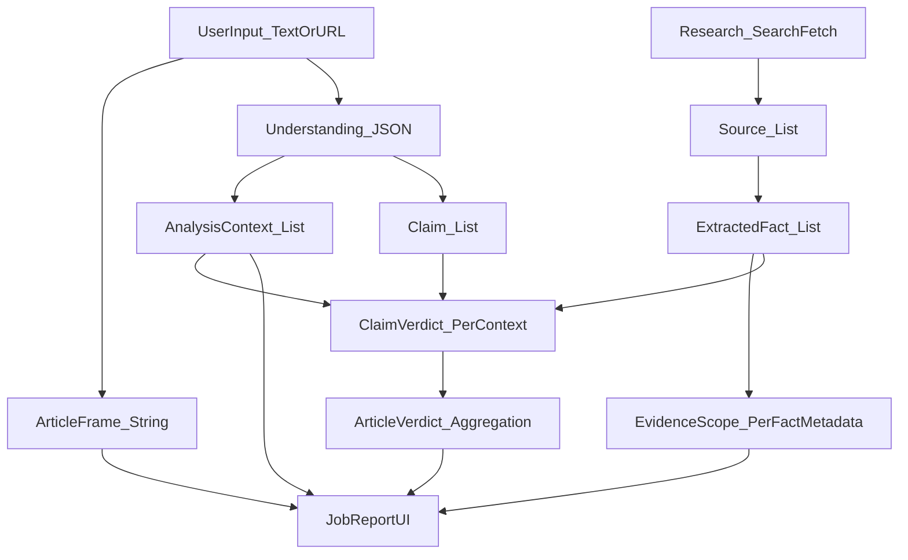

# Orchestrated Report Quality Regression — Deep Analysis

**Date**: 2026-01-28  
**Audience**: FactHarbor maintainers (prompt + analyzer owners)  
**Scope**: Orchestrated pipeline quality regression, with emphasis on AnalysisContext detection, tangential contexts, counter-evidence directionality, and “contested vs doubted” labeling.

---

## Executive Summary

### Primary finding (most likely)
Most “quality regression” symptoms reported (missing contexts, tangential contexts, weak counter-evidence, incorrect directionality, “contested” false positives) correlate strongly with **operating in low-evidence settings**, especially:

- **`FH_ANALYSIS_MODE=quick`** (fewer iterations/sources/facts)
- **`FH_ALLOW_MODEL_KNOWLEDGE=false`** (stricter: more “unknown” and fewer usable facts)
- **`FH_DETERMINISTIC=true`** (reproducible but can amplify a bad local optimum)

If `.env.local` / deployment env was adjusted toward these settings (or budgets were enforced more aggressively), the system will **reduce evidence depth**, which predictably causes:

- fewer contexts discovered/refined,
- more reliance on early-stage guesses,
- weaker counter-evidence retrieval,
- higher sensitivity to prompt ambiguity and heuristic misclassifications.

### Secondary finding (code-level contributor)
Even with “quick” mode, there are a few **structural gates and heuristics** that strongly amplify quality variance:

- **Scope refinement gate mismatch**: orchestrated context refinement is skipped unless at least 8 facts are present, but quick mode only requires 6 facts to proceed. This makes the system rely on early-stage context guesses more often than intended.
  - `apps/web/src/lib/analyzer/config.ts`: `quick.minFactsRequired = 6`
  - `apps/web/src/lib/analyzer/orchestrated.ts`: `refineScopesFromEvidence()` returns early if `facts.length < 8`

- **Seed-context forcing can create tangential contexts**: when heuristics “pre-detect scopes/contexts”, prompts that *require* preserving every seed can conflict with relevance rules and lead to “tangential contexts being used” (especially when evidence depth is low).

- **Directionality correction is partial**: inversion detection and counter-claim detection are heuristic and do not correct all “wrong-direction” failures (notably when the LLM outputs a low truth-percent but reasoning clearly negates/supports the claim).

- **“Contested vs doubted” is currently susceptible to false positives**: the current implementation can still surface “contested” labels even when the underlying “counter-evidence” is only rhetorical or baseless; it relies heavily on keyword patterns rather than explicit counter-evidence linkage.

---

## Summary of Recommendations (Condensed)

1) **A/B test config first (no code changes)**:
   - Compare a baseline “quality” run (`deep`, non-deterministic, budgets relaxed) vs current production-like settings.
   - If quality improves materially under the baseline, treat this as primarily a **config/budget** issue, not a prompt-only problem.

2) **Align the refinement gate with the active mode**:
   - Replace the hard-coded `facts.length < 8` skip with a threshold derived from the active analyzer mode/config.
   - Goal: ensure evidence-grounded context refinement runs reliably in quick-mode fact counts.

3) **Make pre-detected contexts “soft hints”, not mandatory**:
   - Require evidence support (≥1 fact) for a seed context to survive, otherwise allow it to be dropped.
   - This reduces tangential contexts.

4) **Make “contested” evidence-linked (and demote baseless disagreement to “doubted”)**:
   - Only label “contested” when there is explicit counter-evidence with referenced `factId`s.
   - Ensure UI only shows “Contested” when counter-evidence exists.

5) **Harden directionality**:
   - Expand inversion/directionality correction to catch “reasoning contradicts verdict” even for low percentages.
   - Prefer semantic counter-claim detection over keyword triggers.

6) **Remove domain-specific tokens/examples from heuristics and prompts** (AGENTS.md “Generic by Design”):
   - Replace topic-specific regex tokens and examples with abstract/generic phrasing.

---

## Observed Issues (Symptoms)

These are the recurring symptoms the system should optimize for:

1. **Missing contexts**: contexts that should exist (because the evidence implies distinct boundaries, authorities, or methodologies) are not detected.
2. **Tangential contexts**: contexts that should be dropped (not directly relevant to the user’s specific topic) are included and later used in verdicting.
3. **Counter-evidence directionality errors**: counter-claims/counter-evidence are not reliably discovered or are not properly “oriented” (claim scored in the wrong direction).
4. **“Contested” overuse**: “contested” appears where we only have doubt/opinion or even baseless contradiction, particularly in politically charged sources.

---

## Conceptual Model (Entities + Flow)

The core entities and how they relate:



### Prompt input/output touchpoints (Orchestrated)

```mermaid
flowchart TD
Input[Input] --> U[UNDERSTAND_Prompt]
U --> UO[Understanding_JSON: ArticleFrame + AnalysisContexts + Claims]

UO --> R[ResearchLoop_SearchFetch]
R --> EF[EXTRACT_FACTS_Prompt]
EF --> FO[Facts_JSON with EvidenceScope per fact]

FO --> SR[SCOPE_REFINEMENT_Prompt]
SR --> SRO[Updated AnalysisContexts + Fact/Claim assignments]

SRO --> V[VERDICT_Prompt per AnalysisContext]
V --> VO[Verdicts_JSON (ClaimVerdicts + KeyFactors + Flags)]
VO --> UI[Display]
```

---

## Symptom-by-Symptom Diagnosis (Most Likely Causes)

### A) Contexts not detected (missing contexts)

**Most likely cause**: insufficient evidence depth *at the moment contexts are finalized*.

1) **Quick mode reduces evidence depth** (fewer facts and/or fewer distinct evidence scopes), which makes the model conservative and/or noisy in context splitting.

2) **Refinement gate mismatch**:
If the run proceeds with ~6 facts (quick mode minimum), refinement will often **not run**, because `refineScopesFromEvidence()` requires ≥8 facts to even attempt refinement.

Effect: the system relies on `UNDERSTAND` to get contexts “right” up front, which is the least evidence-grounded stage.

**What this looks like in reports**:
- “should be detected contexts are missing”
- the remaining contexts collapse across boundaries that should be split (jurisdiction, authority, measurement boundary, methodology).

### B) Tangential contexts are used

This usually happens when:

1) **Early contexts are not re-validated** after evidence is collected (because refinement didn’t run or produced weak assignments).

2) **Seed-context forcing**: if heuristics provide seed contexts and the prompt forces them to be preserved, the model may keep “nearby but wrong” contexts to satisfy constraints, especially in low-fact runs.

**Key design tension**:
- “Never drop seed contexts” boosts recall in a small number of cases,
- but increases false positives and tangential contexts in many cases.

### C) Counter-evidence directionality is wrong

This is a combination of retrieval + scoring:

1) **Retrieval failure (most common)**:
If budgets/config reduce the number of searches/iterations, the pipeline may not fetch *strong opposing sources*.
The result is a one-sided evidence bundle; the LLM then “fills gaps” and can drift into wrong-direction scoring.

2) **Correction failure (second most common)**:
The system has heuristic directionality correction (inversion detection, counter-claim detection), but:
- Inversion detection mainly triggers on “high” truth percentages; it does not systematically repair all cases where reasoning contradicts the verdict.
- Counter-claim detection is heuristic and domain-dependent; it can misclassify aligned claims, or fail to detect true “opposite position” counter-claims.

### D) “Contested” is used when it should be “doubted” (or not mentioned)

There is good intent in the current design: baseless criticism should not reduce claim weight.

However, the current approach still allows false positives because it:

- uses broad keyword patterns (“report”, “investigation”, numbers, etc.) as a proxy for “documented counter-evidence”, and
- can still mark `isContested=true` while later classifying `factualBasis="opinion"`, which risks UI-level “contested” display even when weight reduction does not occur.

This is consistent with the symptom: “contested where it should only be doubted.”

**Important note**:
Some code/prompt content also violates the repo’s “Generic by Design / no test-case terms” rule (AGENTS.md). This can bias the model:
- `apps/web/src/lib/analyzer/aggregation.ts` includes domain-specific tokens like `VAERS` inside the contestation regex.
- `apps/web/src/lib/analyzer/orchestrated.ts` contains a domain-specific example string (“US sanctions…”).

Even if intended as “helpful”, these increase the chance of topic-specific overfitting.

---

## Is “Scope vs Context” Separation Counterproductive?

**No, the separation is conceptually correct**, but it can become counterproductive if:

- prompts spend too much effort policing terminology,
- the model becomes conservative (splits less) because the instructions feel high-stakes and ambiguous,
- or refinement is skipped, leaving early-stage context guesses uncorrected.

**Conclusion**: the issue is not the separation; it is **(1) evidence depth + (2) gating + (3) prompt cognitive load + (4) seed forcing**.

---

## Recommended Remediation Plan (Prioritized)

### Phase 1 — Prove/Disprove the config-root-cause hypothesis (no code changes)

Run a small set of known-problem inputs under two configurations and compare:

- **Baseline/quality config**:
  - `FH_ANALYSIS_MODE=deep`
  - `FH_DETERMINISTIC=false`
  - `FH_ENFORCE_BUDGETS=false`
  - keep `FH_SEARCH_ENABLED=true`

- **Current/default config**:
  - `FH_ANALYSIS_MODE=quick`
  - `FH_DETERMINISTIC=true`
  - `FH_ALLOW_MODEL_KNOWLEDGE=false`

If the regression mostly disappears under the baseline config, the root cause is operational configuration rather than prompt text.

### Phase 2 — Fix the refinement gate mismatch (small code change, high impact)

Align the `refineScopesFromEvidence()` entry gate with the active mode:

- Replace the fixed `facts.length < 8` threshold with a function of `getActiveConfig().minFactsRequired` (or lower it to match quick mode).

This directly addresses (A) and reduces (B) by allowing evidence-grounded refinement more often.

### Phase 3 — Make seed contexts “soft hints”, not mandatory

Change prompt guidance so heuristics are:
- **suggestions** the model should consider,
- not mandatory contexts that must be kept even if evidence/relevance is weak.

If you still want high recall for some specific patterns, require: “seed contexts must be supported by ≥1 factId OR be dropped.”

### Phase 4 — Redesign “Contested vs Doubted” to be evidence-linked

Goal: only show “contested” when there is explicit counter-evidence.

Practical options:

1) **Add structured fields**:
   - `contestationType: "none" | "doubted" | "contested"`
   - `counterEvidenceFactIds: string[]`
   - `counterEvidenceSummary: string`

2) **UI rule**:
   - only display “Contested” badge if `contestationType === "contested"` and `counterEvidenceFactIds.length > 0`.

3) **Remove topic-specific tokens** from heuristics (`VAERS` etc.). Keep patterns generic (e.g., “passive surveillance system”, “self-reported adverse event database”) if needed.

### Phase 5 — Directionality hardening (targeted)

1) Extend directionality correction to catch “reasoning contradicts verdict” even when verdict is <50.
2) Require counter-claim detection to be **semantic-first**, not keyword-first.
3) Ensure the pipeline explicitly records whether a claim is evaluating the thesis or the opposite hypothesis.

---

## Acceptance Criteria (What “fixed” looks like)

Across a small benchmark set of inputs:

- **Contexts**: required contexts appear consistently (and are evidence-grounded).
- **No tangential contexts**: contexts without direct relevance are absent or have no claims assigned.
- **Counter-evidence**: when strong opposing sources exist, the system finds them and directionality is correct.
- **Contestation**: “contested” appears only when there is explicit counter-evidence; otherwise it is “doubted” or absent.

---

## Notes / Process Recommendations

1) Treat `apps/web/.env.example` changes as quality-impacting “behavior changes”, even if code didn’t change.
2) Add a small “quality regression harness” that runs a handful of representative inputs under two configs and diffs:
   - contexts,
   - claim assignment,
   - contestation flags,
   - verdict directionality.

---

## Appendix: What to Look For in Recent Outputs (Practical Debug Checklist)

This checklist is meant to be used when inspecting a single job report and `apps/web/debug-analyzer.log`.

### 1) Did evidence-grounded refinement run?

- If the run is “quick” and fact count is low, verify whether `refineScopesFromEvidence()` ran or was skipped due to the `facts.length` gate.
- If refinement was skipped, treat “missing contexts” as primarily a **depth/gating** issue, not a prompt failure.

### 2) Are contexts evidence-backed and non-tangential?

For each `AnalysisContext`:
- confirm at least one fact is explicitly assigned to it (or cited as supporting it),
- confirm at least one “direct” core claim is assigned to it,
- confirm the assessed statement matches the user’s topic (avoid “nearby but different question” contexts).

### 3) Counter-evidence directionality sanity check

Pick one claim that looks wrong-direction and verify:
- were any “inverse claim” searches triggered,
- did the evidence bundle include at least one explicit counter-evidence fact,
- does the claim text itself represent the user’s thesis, or the opposite hypothesis.

If the pipeline did not fetch opposing evidence, directionality errors are expected and should be addressed by **research depth** before prompt tweaks.

### 4) “Contested vs doubted” sanity check (especially for politically charged criticism)

When a claim is marked “contested”:
- ensure the report can point to at least one fact that is *explicit* counter-evidence (not just “X criticized Y”).
- if the “contestedBy” label points only to actors or institutions (without concrete evidence), that should likely be “doubted”, not “contested”.

**Desired UX rule**:
- “Contested” should be reserved for evidence-backed counter-claims.
- “Doubted” should cover rhetorical disagreement without counter-evidence.

