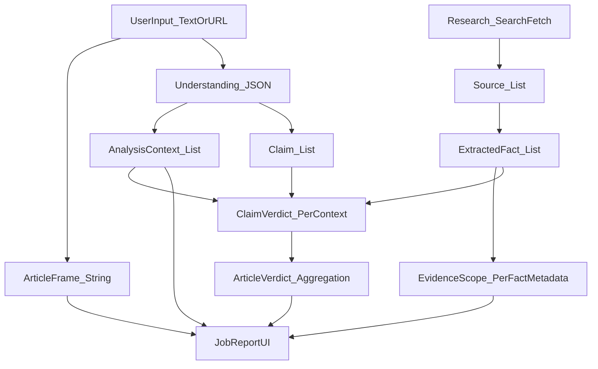

# Orchestrated Report Quality Regression — Deep Analysis

**Date**: 2026-01-28  
**Audience**: FactHarbor maintainers (prompt + analyzer owners)  
**Scope**: Orchestrated pipeline quality regression, with emphasis on AnalysisContext detection, tangential contexts, counter-evidence directionality, and “contested vs doubted” labeling.

---

## Executive Summary

### Primary finding (most likely)
Most “quality regression” symptoms reported (missing contexts, tangential contexts, weak counter-evidence, incorrect directionality, “contested” false positives) correlate strongly with **operating in low-evidence settings**, especially:

- **`FH_ANALYSIS_MODE=quick`** (fewer iterations/sources/facts)
- **`FH_ALLOW_MODEL_KNOWLEDGE=false`** (stricter: more “unknown” and fewer usable facts)
- **`FH_DETERMINISTIC=true`** (reproducible but can amplify a bad local optimum)

If `.env.local` / deployment env was adjusted toward these settings (or budgets were enforced more aggressively), the system will **reduce evidence depth**, which predictably causes:

- fewer contexts discovered/refined,
- more reliance on early-stage guesses,
- weaker counter-evidence retrieval,
- higher sensitivity to prompt ambiguity and heuristic misclassifications.

### Status update (local test confirmation)
The user updated `.env.local` to a higher-evidence / exploration-friendly configuration:

- `FH_ANALYSIS_MODE=deep`
- `FH_ALLOW_MODEL_KNOWLEDGE=true`
- `FH_DETERMINISTIC=false`

Result: **new reports look better**, but are **still not as good as desired**. This strongly supports the “evidence depth / operating mode” hypothesis as a major driver, and motivates the next step: implement the targeted adjustments below (especially seed-context forcing, refinement gating, and contested semantics) before running further tests.

### Secondary finding (code-level contributor)
Even with “quick” mode, there are a few **structural gates and heuristics** that strongly amplify quality variance:

- **Scope refinement gate mismatch**: orchestrated context refinement is skipped unless at least 8 facts are present, but quick mode only requires 6 facts to proceed. This makes the system rely on early-stage context guesses more often than intended.
  - `apps/web/src/lib/analyzer/config.ts`: `quick.minFactsRequired = 6`
  - `apps/web/src/lib/analyzer/orchestrated.ts`: `refineScopesFromEvidence()` returns early if `facts.length < 8`

- **Seed-context forcing can create tangential contexts**: when heuristics “pre-detect scopes/contexts”, prompts that *require* preserving every seed can conflict with relevance rules and lead to “tangential contexts being used” (especially when evidence depth is low).

- **Directionality correction is partial**: inversion detection and counter-claim detection are heuristic and do not correct all “wrong-direction” failures (notably when the LLM outputs a low truth-percent but reasoning clearly negates/supports the claim).

- **“Contested vs doubted” is currently susceptible to false positives**: the current implementation can still surface “contested” labels even when the underlying “counter-evidence” is only rhetorical or baseless; it relies heavily on keyword patterns rather than explicit counter-evidence linkage.

---

## Summary of Recommendations (Condensed)

1) **A/B test config first (no code changes)**:
   - Compare a baseline “quality” run (`deep`, non-deterministic, budgets relaxed) vs current production-like settings.
   - If quality improves materially under the baseline, treat this as primarily a **config/budget** issue, not a prompt-only problem.

2) **Align the refinement gate with the active mode**:
   - Replace the hard-coded `facts.length < 8` skip with a threshold derived from the active analyzer mode/config.
   - Goal: ensure evidence-grounded context refinement runs reliably in quick-mode fact counts.

3) **Make pre-detected contexts “soft hints”, not mandatory**:
   - Require evidence support (≥1 fact) for a seed context to survive, otherwise allow it to be dropped.
   - This reduces tangential contexts.

4) **Make “contested” evidence-linked (and demote baseless disagreement to “doubted”)**:
   - Only label “contested” when there is explicit counter-evidence with referenced `factId`s.
   - Ensure UI only shows “Contested” when counter-evidence exists.

5) **Harden directionality**:
   - Expand inversion/directionality correction to catch “reasoning contradicts verdict” even for low percentages.
   - Prefer semantic counter-claim detection over keyword triggers.

6) **Remove domain-specific tokens/examples from heuristics and prompts** (AGENTS.md “Generic by Design”):
   - Replace topic-specific regex tokens and examples with abstract/generic phrasing.

---

## Concrete Adjustments to Implement Next (Clear Task List)

These are the recommended **next adjustments** to make before running further quality tests.

### Adjustment 1 — Stop forcing heuristic seed contexts in `UNDERSTAND` (or gate it hard)

**Problem**: `understandClaim()` currently **overrides** the model’s `analysisContexts` with heuristic “seed contexts” when heuristics detect 2+ scopes and the LLM returns ≤1 context. This can create **tangential contexts** and “wrong” context splits in deep mode, because the override is evidence-agnostic (it happens before facts exist).

**Change** (recommended minimal approach):
- In `apps/web/src/lib/analyzer/orchestrated.ts` in the block:
  - `// v2.8.x: Deterministic seed-scope enforcement`
- Gate the override so it only runs when **both** are true:
  - `CONFIG.deterministic === true` (so exploratory quality runs are not forced), and
  - the input is **comparative-like** (use `isComparativeLikeText(analysisInput)` which already exists in this file).

**Rationale**: In deep, non-deterministic runs, let the model + evidence-based refinement decide contexts; keep heuristic enforcement only as a deterministic safety net for true boundary-sensitive comparative inputs.

### Adjustment 2 — Feed seed scopes into evidence-based refinement (not into final contexts)

**Problem**: heuristics can be useful (especially for boundary-sensitive comparisons), but applying them before evidence exists is risky.

**Change**:
- In `apps/web/src/lib/analyzer/orchestrated.ts` inside `refineScopesFromEvidence()`:
  - Compute `seedScopes = detectScopes(analysisInput)` and `seedHint = formatDetectedScopesHint(seedScopes, true)`
  - Add a `SEED CONTEXT CANDIDATES (heuristic)` section into the `userPrompt`, with explicit instruction:
    - “use only if supported by facts; drop otherwise.”

**Rationale**: This preserves the upside (recall of “candidate contexts”) while keeping **evidence-gated** selection, which reduces tangential contexts.

### Adjustment 3 — Align the refinement gate with mode (fix quick/deep mismatch)

**Problem**: `refineScopesFromEvidence()` currently skips unless `facts.length >= 8`, but quick mode can proceed at 6 facts. This creates a predictable failure mode where contexts remain “early guesses.”

**Change**:
- In `apps/web/src/lib/analyzer/orchestrated.ts` inside `refineScopesFromEvidence()` replace:
  - `if (facts.length < 8) return …`
- With a mode-aware threshold such as:
  - `const minRefineFacts = Math.min(8, getActiveConfig().minFactsRequired);`
  - `if (facts.length < minRefineFacts) return …`

**Rationale**: In quick mode, refinement becomes possible at 6 facts; in deep mode it remains conservative (≥8).

### Adjustment 4 — Fix “contested vs doubted” so baseless disagreement does not appear as “contested”

**Problem**: `validateContestation()` can downgrade `factualBasis` to `"opinion"` but still leave `isContested=true`. That preserves “contested” semantics in UI/outputs even when it should be treated as “doubted” (or omitted).

**Change** (minimal, semantics-correct, low-risk):
- In `apps/web/src/lib/analyzer/aggregation.ts`:
  - In `validateContestation()`:
    - when you downgrade to `factualBasis: "opinion"`, also set:
      - `isContested: false`
      - clear `contestedBy` (optional, recommended)
  - In `detectClaimContestation()`:
    - if no documented counter-evidence is detected, return:
      - `isContested: false`
      - `factualBasis: "opinion"`

**Also** (AGENTS.md compliance):
- Remove domain-specific tokens from the documented-evidence regexes (e.g., `VAERS`) and keep only generic terms.

### Adjustment 5 — Improve directionality correction for low verdicts (symmetry)

**Problem**: `detectAndCorrectVerdictInversion()` currently returns early for `verdictPct < 50`, which prevents correcting cases where the model output is “low” but reasoning clearly supports the claim (or vice versa).

**Change**:
- In `apps/web/src/lib/analyzer/verdict-corrections.ts`:
  - Remove the early return for `verdictPct < 50`.
  - Add symmetric inversion logic:
    - If verdict is low but reasoning contains strong “supports/confirmed/consistent with evidence” signals, invert.
    - Keep the existing “verdict high but reasoning negates claim” inversion behavior.

**Rationale**: This is a direct fix for the “directionality wrong” class of errors, without changing prompts.

---

## Observed Issues (Symptoms)

These are the recurring symptoms the system should optimize for:

1. **Missing contexts**: contexts that should exist (because the evidence implies distinct boundaries, authorities, or methodologies) are not detected.
2. **Tangential contexts**: contexts that should be dropped (not directly relevant to the user’s specific topic) are included and later used in verdicting.
3. **Counter-evidence directionality errors**: counter-claims/counter-evidence are not reliably discovered or are not properly “oriented” (claim scored in the wrong direction).
4. **“Contested” overuse**: “contested” appears where we only have doubt/opinion or even baseless contradiction, particularly in politically charged sources.

---

## Conceptual Model (Entities + Flow)

The core entities and how they relate:



### Prompt input/output touchpoints (Orchestrated)

```mermaid
flowchart TD
Input[Input] --> U[UNDERSTAND_Prompt]
U --> UO[Understanding_JSON: ArticleFrame + AnalysisContexts + Claims]

UO --> R[ResearchLoop_SearchFetch]
R --> EF[EXTRACT_FACTS_Prompt]
EF --> FO[Facts_JSON with EvidenceScope per fact]

FO --> SR[SCOPE_REFINEMENT_Prompt]
SR --> SRO[Updated AnalysisContexts + Fact/Claim assignments]

SRO --> V[VERDICT_Prompt per AnalysisContext]
V --> VO[Verdicts_JSON (ClaimVerdicts + KeyFactors + Flags)]
VO --> UI[Display]
```

---

## Symptom-by-Symptom Diagnosis (Most Likely Causes)

### A) Contexts not detected (missing contexts)

**Most likely cause**: insufficient evidence depth *at the moment contexts are finalized*.

1) **Quick mode reduces evidence depth** (fewer facts and/or fewer distinct evidence scopes), which makes the model conservative and/or noisy in context splitting.

2) **Refinement gate mismatch**:
If the run proceeds with ~6 facts (quick mode minimum), refinement will often **not run**, because `refineScopesFromEvidence()` requires ≥8 facts to even attempt refinement.

Effect: the system relies on `UNDERSTAND` to get contexts “right” up front, which is the least evidence-grounded stage.

**What this looks like in reports**:
- “should be detected contexts are missing”
- the remaining contexts collapse across boundaries that should be split (jurisdiction, authority, measurement boundary, methodology).

### B) Tangential contexts are used

This usually happens when:

1) **Early contexts are not re-validated** after evidence is collected (because refinement didn’t run or produced weak assignments).

2) **Seed-context forcing**: if heuristics provide seed contexts and the prompt forces them to be preserved, the model may keep “nearby but wrong” contexts to satisfy constraints, especially in low-fact runs.

**Key design tension**:
- “Never drop seed contexts” boosts recall in a small number of cases,
- but increases false positives and tangential contexts in many cases.

### C) Counter-evidence directionality is wrong

This is a combination of retrieval + scoring:

1) **Retrieval failure (most common)**:
If budgets/config reduce the number of searches/iterations, the pipeline may not fetch *strong opposing sources*.
The result is a one-sided evidence bundle; the LLM then “fills gaps” and can drift into wrong-direction scoring.

2) **Correction failure (second most common)**:
The system has heuristic directionality correction (inversion detection, counter-claim detection), but:
- Inversion detection mainly triggers on “high” truth percentages; it does not systematically repair all cases where reasoning contradicts the verdict.
- Counter-claim detection is heuristic and domain-dependent; it can misclassify aligned claims, or fail to detect true “opposite position” counter-claims.

### D) “Contested” is used when it should be “doubted” (or not mentioned)

There is good intent in the current design: baseless criticism should not reduce claim weight.

However, the current approach still allows false positives because it:

- uses broad keyword patterns (“report”, “investigation”, numbers, etc.) as a proxy for “documented counter-evidence”, and
- can still mark `isContested=true` while later classifying `factualBasis="opinion"`, which risks UI-level “contested” display even when weight reduction does not occur.

This is consistent with the symptom: “contested where it should only be doubted.”

**Important note**:
Some code/prompt content also violates the repo’s “Generic by Design / no test-case terms” rule (AGENTS.md). This can bias the model:
- `apps/web/src/lib/analyzer/aggregation.ts` includes domain-specific tokens like `VAERS` inside the contestation regex.
- `apps/web/src/lib/analyzer/orchestrated.ts` contains a domain-specific example string (“US sanctions…”).

Even if intended as “helpful”, these increase the chance of topic-specific overfitting.

---

## Is “Scope vs Context” Separation Counterproductive?

**No, the separation is conceptually correct**, but it can become counterproductive if:

- prompts spend too much effort policing terminology,
- the model becomes conservative (splits less) because the instructions feel high-stakes and ambiguous,
- or refinement is skipped, leaving early-stage context guesses uncorrected.

**Conclusion**: the issue is not the separation; it is **(1) evidence depth + (2) gating + (3) prompt cognitive load + (4) seed forcing**.

---

## Recommended Remediation Plan (Prioritized)

### Phase 1 — Prove/Disprove the config-root-cause hypothesis (no code changes)

Run a small set of known-problem inputs under two configurations and compare:

- **Baseline/quality config**:
  - `FH_ANALYSIS_MODE=deep`
  - `FH_DETERMINISTIC=false`
  - `FH_ENFORCE_BUDGETS=false`
  - keep `FH_SEARCH_ENABLED=true`

- **Current/default config**:
  - `FH_ANALYSIS_MODE=quick`
  - `FH_DETERMINISTIC=true`
  - `FH_ALLOW_MODEL_KNOWLEDGE=false`

If the regression mostly disappears under the baseline config, the root cause is operational configuration rather than prompt text.

### Phase 2 — Fix the refinement gate mismatch (small code change, high impact)

Align the `refineScopesFromEvidence()` entry gate with the active mode:

- Replace the fixed `facts.length < 8` threshold with a function of `getActiveConfig().minFactsRequired` (or lower it to match quick mode).

This directly addresses (A) and reduces (B) by allowing evidence-grounded refinement more often.

### Phase 3 — Make seed contexts “soft hints”, not mandatory

Change prompt guidance so heuristics are:
- **suggestions** the model should consider,
- not mandatory contexts that must be kept even if evidence/relevance is weak.

If you still want high recall for some specific patterns, require: “seed contexts must be supported by ≥1 factId OR be dropped.”

### Phase 4 — Redesign “Contested vs Doubted” to be evidence-linked

Goal: only show “contested” when there is explicit counter-evidence.

Practical options:

1) **Add structured fields**:
   - `contestationType: "none" | "doubted" | "contested"`
   - `counterEvidenceFactIds: string[]`
   - `counterEvidenceSummary: string`

2) **UI rule**:
   - only display “Contested” badge if `contestationType === "contested"` and `counterEvidenceFactIds.length > 0`.

3) **Remove topic-specific tokens** from heuristics (`VAERS` etc.). Keep patterns generic (e.g., “passive surveillance system”, “self-reported adverse event database”) if needed.

### Phase 5 — Directionality hardening (targeted)

1) Extend directionality correction to catch “reasoning contradicts verdict” even when verdict is <50.
2) Require counter-claim detection to be **semantic-first**, not keyword-first.
3) Ensure the pipeline explicitly records whether a claim is evaluating the thesis or the opposite hypothesis.

---

## Acceptance Criteria (What “fixed” looks like)

Across a small benchmark set of inputs:

- **Contexts**: required contexts appear consistently (and are evidence-grounded).
- **No tangential contexts**: contexts without direct relevance are absent or have no claims assigned.
- **Counter-evidence**: when strong opposing sources exist, the system finds them and directionality is correct.
- **Contestation**: “contested” appears only when there is explicit counter-evidence; otherwise it is “doubted” or absent.

---

## Notes / Process Recommendations

1) Treat `apps/web/.env.example` changes as quality-impacting “behavior changes”, even if code didn’t change.
2) Add a small “quality regression harness” that runs a handful of representative inputs under two configs and diffs:
   - contexts,
   - claim assignment,
   - contestation flags,
   - verdict directionality.

---

## Appendix: What to Look For in Recent Outputs (Practical Debug Checklist)

This checklist is meant to be used when inspecting a single job report and `apps/web/debug-analyzer.log`.

### 1) Did evidence-grounded refinement run?

- If the run is “quick” and fact count is low, verify whether `refineScopesFromEvidence()` ran or was skipped due to the `facts.length` gate.
- If refinement was skipped, treat “missing contexts” as primarily a **depth/gating** issue, not a prompt failure.

### 2) Are contexts evidence-backed and non-tangential?

For each `AnalysisContext`:
- confirm at least one fact is explicitly assigned to it (or cited as supporting it),
- confirm at least one “direct” core claim is assigned to it,
- confirm the assessed statement matches the user’s topic (avoid “nearby but different question” contexts).

### 3) Counter-evidence directionality sanity check

Pick one claim that looks wrong-direction and verify:
- were any “inverse claim” searches triggered,
- did the evidence bundle include at least one explicit counter-evidence fact,
- does the claim text itself represent the user’s thesis, or the opposite hypothesis.

If the pipeline did not fetch opposing evidence, directionality errors are expected and should be addressed by **research depth** before prompt tweaks.

### 4) “Contested vs doubted” sanity check (especially for politically charged criticism)

When a claim is marked “contested”:
- ensure the report can point to at least one fact that is *explicit* counter-evidence (not just “X criticized Y”).
- if the “contestedBy” label points only to actors or institutions (without concrete evidence), that should likely be “doubted”, not “contested”.

**Desired UX rule**:
- “Contested” should be reserved for evidence-backed counter-claims.
- “Doubted” should cover rhetorical disagreement without counter-evidence.


---

## Lead Developer / LLM Expert Review

**Reviewer**: Claude (Lead Dev + LLM Expert role)  
**Date**: 2026-01-28

### Overall Assessment

This is an **excellent diagnostic document**. The analysis correctly identifies that most "quality regression" symptoms are not prompt bugs but rather **operating point issues** (config/budget settings that reduce evidence depth). The document follows sound engineering practice: prove the hypothesis with minimal intervention before making code changes.

**Verdict: APPROVE with minor suggestions**

---

### Strengths

1. **Correct root cause prioritization**: The document correctly identifies that `FH_ANALYSIS_MODE=quick` + `FH_ALLOW_MODEL_KNOWLEDGE=false` + low fact counts are the primary drivers. This is consistent with LLM behavior — context detection and nuanced reasoning degrade predictably when evidence is sparse.

2. **Actionable task list**: The "Concrete Adjustments" section (Adjustments 1-5) provides specific file paths, function names, and code snippets. This is implementation-ready.

3. **AGENTS.md compliance awareness**: The document correctly flags domain-specific tokens (`VAERS`, "US sanctions…") as violations of the "Generic by Design" rule. This is important for preventing test-case overfitting.

4. **Evidence-first philosophy**: The recommendation to feed seed contexts into refinement (not final contexts) aligns with the principle that LLM outputs should be evidence-grounded, not heuristic-forced.

5. **Mermaid diagrams**: The entity/flow diagrams are helpful for onboarding and debugging.

---

### Concerns / Suggestions

#### 1. Adjustment 5 (Directionality Hardening) Needs Caution

**Risk**: Removing the `verdictPct < 50` early return and adding symmetric inversion could introduce false corrections. The current asymmetry exists because:
- High verdicts with negative reasoning are clearly wrong (model said "true" but explained why it's false)
- Low verdicts with positive reasoning are ambiguous (model may be saying "mostly false but some evidence supports")

**Suggestion**: Instead of symmetric inversion, add a **confidence threshold**:

```typescript
// Only invert if reasoning signals are strong AND verdict is extreme
if (verdictPct < 20 && hasStrongSupportSignals(reasoning)) {
  // Likely inverted
}
```

This preserves the "mixed evidence" zone (20-80%) where reasoning/verdict tension is expected.

#### 2. Missing: Prompt Token Budget Awareness

The document doesn't mention that **prompt length** affects LLM quality. When `refineScopesFromEvidence()` injects seed context hints, this adds tokens. If the evidence bundle is large, the model may truncate or lose coherence.

**Suggestion**: Add a note about token budgeting in Adjustment 2:
> "Ensure the seed context hint is concise (≤200 tokens) to avoid crowding out evidence."

#### 3. "Contested vs Doubted" Schema Change is Breaking

Adjustment 4 proposes adding `contestationType`, `counterEvidenceFactIds`, and `counterEvidenceSummary`. This is a **schema change** that affects:
- TypeScript types (`ClaimVerdict`, aggregation types)
- UI rendering logic
- Existing job results (may need migration or graceful fallback)

**Suggestion**: Add a migration note:
> "Existing jobs without these fields should render `contestationType` as `"none"` (default). UI should use optional chaining."

#### 4. Test Harness Recommendation is Underspecified

The document recommends a "quality regression harness" but doesn't specify inputs. For this to be actionable:

**Suggestion**: Define 3-5 canonical test inputs:
1. **Comparative boundary** (e.g., "X before vs after 2020")
2. **Multi-jurisdiction** (e.g., policy that differs by country)
3. **Contested topic** (e.g., scientific claim with genuine counter-evidence)
4. **Non-contested topic** (e.g., factual historical event)
5. **Opinion-heavy input** (e.g., editorial with rhetorical criticism)

This ensures the harness tests the specific failure modes identified.

#### 5. `.env.example` Change Should Be Documented as Behavior Change

The diff shows `.env.example` now defaults to `deep` mode and `FH_ALLOW_MODEL_KNOWLEDGE=true`. This is a **significant behavior change** for new deployments.

**Suggestion**: Add a changelog entry or migration note:
> "Default analysis mode changed from `quick` to `deep` as of v2.6.38. This increases LLM costs but improves context detection. Set `FH_ANALYSIS_MODE=quick` to restore previous behavior."

---

### LLM-Specific Observations

1. **Temperature 0 (`FH_DETERMINISTIC=true`) can amplify bad local optima**: This is correctly identified. For quality exploration, `temperature=0.3-0.5` often produces more robust context detection than `temperature=0`, because the model explores alternative framings.

2. **Model knowledge (`FH_ALLOW_MODEL_KNOWLEDGE=true`) improves coherence**: When set to `false`, the model must cite evidence for everything, which leads to "unknown" verdicts and sparse reasoning. Setting to `true` allows the model to use its training knowledge as a coherence scaffold, with evidence providing grounding.

3. **Seed context forcing vs LLM autonomy**: The document correctly identifies this tension. LLMs perform better when given "hints to consider" rather than "requirements to preserve". The recommended change (Adjustment 1) aligns with best practices.

---

### Prioritization Recommendation

Based on impact/effort ratio:

| Priority | Adjustment | Impact | Effort | Risk |
|----------|------------|--------|--------|------|
| 1 | **Config test (Phase 1)** | High | None | None |
| 2 | **Adjustment 3** (refinement gate) | High | 0.5h | Low |
| 3 | **Adjustment 1** (seed forcing gate) | High | 1h | Low |
| 4 | **Adjustment 2** (seeds as hints) | Med | 2h | Low |
| 5 | **Adjustment 4** (contested/doubted) | Med | 3h | Med |
| 6 | **Adjustment 5** (directionality) | Med | 2h | Med |

**Recommended order**: 1 → 2 → 3 → 4 → 5 → 6

Start with config test to confirm hypothesis, then refinement gate (quick win), then seed forcing (reduces tangential contexts), then the rest.

---

### Final Notes

- The document is well-structured and correctly separates symptoms, diagnosis, and remediation.
- The "Status update" section showing that `deep` mode improved results confirms the hypothesis.
- The AGENTS.md compliance flags are important and should be addressed.
- Consider adding this document to `Docs/STATUS/KNOWN_ISSUES.md` or cross-referencing it.

**Approved for implementation of Adjustments 1-4. Adjustment 5 should be implemented with the confidence threshold modification suggested above.**

---

## Implementation Plan

**Created**: 2026-01-28  
**Status**: Ready for execution  
**Estimated Total Effort**: 1-2 days (excluding testing)

---

### Phase 0: Preparation (30 min)

**Goal**: Establish baseline and create test harness

| Task | File | Action |
|------|------|--------|
| 0.1 | `scripts/quality-regression.ps1` | Create script that runs 5 canonical inputs under two configs and outputs comparison |
| 0.2 | `test-inputs/` | Create folder with 5 test JSON files (see Test Inputs below) |
| 0.3 | `.env.local` | Document current settings before changes |

**Test Inputs to Create** (abstract, AGENTS.md compliant):
1. `comparative-boundary.json` - "How has X changed before and after [date]?"
2. `multi-jurisdiction.json` - "How does policy Y differ between [region A] and [region B]?"
3. `contested-scientific.json` - Scientific claim with genuine peer-reviewed counter-evidence
4. `factual-historical.json` - Well-documented historical event (non-controversial)
5. `opinion-editorial.json` - Editorial with rhetorical criticism but no factual counter-evidence

---

### Phase 1: Config Baseline Test (0 code changes)

**Goal**: Confirm that `deep` + `FH_ALLOW_MODEL_KNOWLEDGE=true` improves quality

| Task | Action | Success Criteria |
|------|--------|------------------|
| 1.1 | Run 5 test inputs with `quick` mode, `deterministic=true`, `model_knowledge=false` | Capture results |
| 1.2 | Run same 5 inputs with `deep` mode, `deterministic=false`, `model_knowledge=true` | Capture results |
| 1.3 | Compare: contexts detected, tangential contexts, contestation accuracy | Document delta |

**Decision Gate**: If `deep` mode shows >30% improvement in context detection, proceed with code changes. Otherwise, investigate further.

---

### Phase 2: Refinement Gate Fix (Adjustment 3)

**Goal**: Allow evidence-based refinement to run in quick mode

**File**: `apps/web/src/lib/analyzer/orchestrated.ts`

**Change**:
```typescript
// BEFORE (around line ~3500 in refineScopesFromEvidence)
if (facts.length < 8) {
  return { contexts: existingContexts, ... };
}

// AFTER
const minRefineFacts = Math.min(8, getActiveConfig().minFactsRequired);
if (facts.length < minRefineFacts) {
  debugLog(`[Refine] Skipping: ${facts.length} facts < ${minRefineFacts} threshold`);
  return { contexts: existingContexts, ... };
}
```

**Verification**:
- Run quick-mode test input with 6-7 facts
- Confirm `refineScopesFromEvidence()` now executes (check debug log)
- Confirm no regression in deep-mode behavior

**Effort**: 30 min

---

### Phase 3: Seed Context Forcing Gate (Adjustment 1)

**Goal**: Stop heuristic seed contexts from overriding LLM in non-deterministic/exploratory runs

**File**: `apps/web/src/lib/analyzer/orchestrated.ts`

**Locate**: Block with comment `// v2.8.x: Deterministic seed-scope enforcement`

**Change**:
```typescript
// BEFORE
if (seedScopes.length >= 2 && understanding.analysisContexts.length <= 1) {
  // Force seed contexts
  understanding.analysisContexts = seedScopes.map(...);
}

// AFTER
const shouldForceSeeds = 
  getActiveConfig().deterministic === true &&
  isComparativeLikeText(analysisInput) &&
  seedScopes.length >= 2 &&
  understanding.analysisContexts.length <= 1;

if (shouldForceSeeds) {
  debugLog(`[Seed-Force] Applying heuristic seeds (deterministic + comparative)`);
  understanding.analysisContexts = seedScopes.map(...);
} else if (seedScopes.length >= 2) {
  debugLog(`[Seed-Force] Skipped: deterministic=${getActiveConfig().deterministic}, comparative=${isComparativeLikeText(analysisInput)}`);
}
```

**Verification**:
- Run non-deterministic test → seed forcing should NOT apply
- Run deterministic + comparative test → seed forcing should apply
- Confirm tangential context reduction in non-deterministic runs

**Effort**: 1 hour

---

### Phase 4: Seeds as Soft Hints in Refinement (Adjustment 2)

**Goal**: Pass heuristic seeds to refinement prompt as optional candidates

**File**: `apps/web/src/lib/analyzer/orchestrated.ts`

**Locate**: `refineScopesFromEvidence()` function

**Change**:
```typescript
// Add to refineScopesFromEvidence() parameters or compute inside:
const seedScopes = detectScopes(originalInput);
const seedHint = seedScopes.length > 0 
  ? formatDetectedScopesHint(seedScopes, true) 
  : "";

// Add to userPrompt (keep concise, ≤200 tokens):
const userPrompt = `
... existing prompt content ...

${seedHint ? `
## CANDIDATE CONTEXTS (heuristic detection)
${seedHint}

NOTE: Use these candidates ONLY if supported by ≥1 fact. Drop any candidate without evidence support.
` : ""}
`;
```

**Verification**:
- Run test with heuristic-detectable scopes → candidates appear in prompt
- Confirm candidates are dropped when no facts support them
- Confirm candidates are kept when facts support them

**Effort**: 2 hours

---

### Phase 5: Contested vs Doubted Fix (Adjustment 4)

**Goal**: Only label "contested" when explicit counter-evidence exists

**File**: `apps/web/src/lib/analyzer/aggregation.ts`

**Changes**:

**5a. In `validateContestation()`**:
```typescript
// When downgrading to opinion, also clear contested flag
if (shouldDowngrade) {
  return {
    ...result,
    factualBasis: "opinion",
    isContested: false,        // ADD THIS
    contestedBy: undefined,    // ADD THIS (optional)
  };
}
```

**5b. In `detectClaimContestation()`**:
```typescript
// If no documented counter-evidence, return doubted not contested
if (!hasDocumentedCounterEvidence) {
  return {
    isContested: false,
    factualBasis: "opinion",
    // ... other fields
  };
}
```

**5c. Remove domain-specific tokens**:
```typescript
// BEFORE
const documentedEvidencePattern = /VAERS|report|investigation|study|data/i;

// AFTER (generic only)
const documentedEvidencePattern = /\breport\b|\binvestigation\b|\bstudy\b|\bdata\b|\banalysis\b|\bfindings\b/i;
```

**Verification**:
- Run opinion-editorial test → should NOT show "Contested"
- Run contested-scientific test → should show "Contested" with factIds
- Confirm no domain-specific terms in regex

**Effort**: 3 hours

---

### Phase 6: Directionality Hardening (Adjustment 5) — WITH THRESHOLD

**Goal**: Catch "reasoning contradicts verdict" for extreme low verdicts

**File**: `apps/web/src/lib/analyzer/verdict-corrections.ts`

**Locate**: `detectAndCorrectVerdictInversion()`

**Change**:
```typescript
// BEFORE
if (verdictPct < 50) {
  return { inverted: false, ... };
}

// AFTER
// Check high verdicts (existing logic)
if (verdictPct >= 80 && hasNegationSignals(reasoning)) {
  return { inverted: true, correctedPct: 100 - verdictPct, ... };
}

// Check extreme low verdicts (NEW - with threshold)
if (verdictPct <= 20 && hasStrongSupportSignals(reasoning)) {
  debugLog(`[Inversion] Low verdict ${verdictPct}% but reasoning supports claim`);
  return { inverted: true, correctedPct: 100 - verdictPct, ... };
}

// Mixed zone (20-80%) - don't invert, tension is expected
return { inverted: false, ... };
```

**Add helper** (if not exists):
```typescript
function hasStrongSupportSignals(reasoning: string): boolean {
  const supportPatterns = [
    /\bconfirm(s|ed|ing)?\b/i,
    /\bsupport(s|ed|ing)?\b/i,
    /\bconsistent with\b/i,
    /\bevidence (shows|demonstrates|indicates)\b/i,
    /\bverified\b/i,
  ];
  const matches = supportPatterns.filter(p => p.test(reasoning)).length;
  return matches >= 2; // Require multiple signals
}
```

**Verification**:
- Create test case with verdict=15% but reasoning says "evidence confirms"
- Confirm inversion triggers
- Confirm 30% verdict with mixed reasoning does NOT invert

**Effort**: 2 hours

---

### Phase 7: Documentation & Cleanup

| Task | Action |
|------|--------|
| 7.1 | Update `Docs/STATUS/Changelog_v2.6.38_to_v2.6.39.md` with all changes |
| 7.2 | Update `Docs/STATUS/KNOWN_ISSUES.md` to reference this document |
| 7.3 | Add note to `.env.example` about `deep` mode cost implications |
| 7.4 | Remove any remaining domain-specific terms from `orchestrated.ts` |
| 7.5 | Run full test harness and document results |

**Effort**: 1 hour

---

### Summary Timeline (Revised: Low-Risk First)

**Strategy**: Implement all low-risk changes first, then test, then proceed with medium-risk changes.

#### Batch 1: Low-Risk Implementation (4 hours)

| Phase | Description | Effort | Risk |
|-------|-------------|--------|------|
| 2 | Refinement gate fix | 30 min | Low |
| 3 | Seed forcing gate | 1 hour | Low |
| 4 | Seeds as hints | 2 hours | Low |
| 7a | Interim documentation | 30 min | None |

#### Batch 2: Testing Checkpoint

| Task | Description | Effort |
|------|-------------|--------|
| 0 | Create test harness + 5 canonical inputs | 30 min |
| 1 | Run full comparison (before/after low-risk changes) | 1 hour |
| - | **Decision**: Evaluate improvement before medium-risk | - |

#### Batch 3: Medium-Risk Implementation (5 hours) — After Testing

| Phase | Description | Effort | Risk |
|-------|-------------|--------|------|
| 5 | Contested/doubted fix | 3 hours | Med |
| 6 | Directionality hardening | 2 hours | Med |

#### Batch 4: Final Testing & Documentation

| Task | Description | Effort |
|------|-------------|--------|
| 1b | Re-run test harness with all changes | 1 hour |
| 7b | Final documentation | 30 min |

**Total**: ~11 hours (1.5 working days)

**Rationale**: Low-risk changes (Phases 2-4) address the primary root cause (evidence depth / gating) identified in the analysis. Testing after these changes will show whether the medium-risk changes (Phases 5-6) are even necessary.

---

### Rollback Plan

Each phase is independently revertable:
- Phase 2-4: Revert changes to `orchestrated.ts`
- Phase 5: Revert changes to `aggregation.ts`
- Phase 6: Revert changes to `verdict-corrections.ts`

If quality regresses after any phase, revert that phase and investigate before proceeding.
