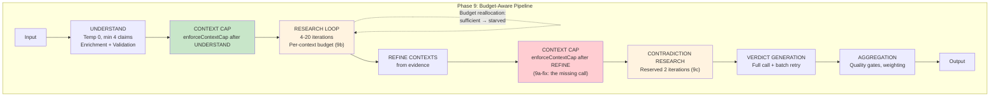

# Pipeline Quality — Status, Goals & Plan

**Date:** 2026-02-15
**Author:** Claude Opus 4.6 (Senior Architect)
**Status:** ON HOLD — Awaiting Lead Architect redesign: replace AnalysisContext with ClaimBoundary (derived from EvidenceScope)
**Supersedes:** All archived Phase 8 review/proposal documents and WIP pipeline quality investigations
**Previous status:** Phase 9a partially effective, 9a-fix identified, 9b/9c pending
**For Review:** Senior Developer (review of 9a results complete; further execution halted)

---

## 1. Where We Are — Phase 8 Results

### 1.1 Phase 8 Commits (Complete)

| Commit | Phase | Change |
|--------|-------|--------|
| `0b14d7e` | Instrumentation | 16 per-stage funnel counters + language-tagged logging |
| `b6752d7` | 8a | Open source selection funnel (maxResults 6->10, maxSources 4->8, STRICT->MODERATE) |
| `92d7706` | 8b | Batch verdict retry for high-claim jobs (batches of <=5) |
| `0d603b6` | 8c | Stabilize claim decomposition (temperature 0, enrichment pass, LLM validation) |
| `061bb23` | Bugfix | Accept `secondary_commentary` in MODERATE mode (fixed 0-17% LLM accept rate) |
| `c509978` | Bugfix | Enforce `contextDetectionMaxContexts` in reconciliation function |

### 1.2 Phase 8+fix Baseline Data

| Job | Verdict | Conf | Contexts | Evidence | Ev/Srch | LLM Accept |
|-----|---------|------|----------|----------|---------|------------|
| Bolsonaro | MX 54% | 75% | 4 | 15 | 0.79 | 33% |
| H2 vs EV | UV 47% | 58% | 11 | 50 | 2.17 | 41% |
| SRG DE | MX 50% | 62% | 1 | 17 | 0.65 | 12% |
| SRG EN | LT 69% | 64% | 7 | 49 | 3.06 | 29% |

### 1.3 Phase 8 Conclusions

**Solved:** Evidence famine (2-8.5x increases), language parity gap (5.3x -> 1.7x), LLM relevance classifier (0-17% -> 12-41%), blanket verdict fallback (batch retry), claim instability (temp 0 + enrichment).

**Not solved (Phase 9 targets):** Context explosion, research budget waste, contradiction search not guaranteed, 10+ interacting loop mechanisms.

---

## 2. Phase 9a Validation Results

### 2.1 Phase 9a Commit

| Commit | Change |
|--------|--------|
| `c1f6481` | `enforceContextCap()` at 3 call sites + MAX_CONTEXTS prompt hint in SUPPLEMENTAL_CONTEXTS |
| `42e0dbb` | Docs: Phase 9 Senior Dev review + Architect author response |

### 2.2 Full Comparison: Phase 8+fix vs Phase 9a

| Job | Metric | P8+fix | P9a | Change | Assessment |
|-----|--------|--------|-----|--------|------------|
| **Bolsonaro** | Verdict | MX 54% | LT 69% | +15pp | Instability (oscillates 54-69%) |
| | Confidence | 75% | 64% | -11pp | Regression |
| | Contexts | 4 | **2** | -2 | **IMPROVED** (cap working) |
| | Evidence | 15 | 10 | -33% | Regression |
| | Gate4 pub | — | 2/7 (0H/0M/7insuff) | | Poor: all claims insufficient |
| | Iterations | — | 4 | | |
| **H2 vs EV** | Verdict | UV 47% | 48% | +1pp | Stable |
| | Confidence | 58% | 53% | -5pp | Slight regression |
| | Contexts | 11 | **9** | -2 | **CAP FAILED** (target <=3) |
| | Evidence | 50 | 52 | +2 | Stable |
| | Gate4 pub | — | 8/26 (1H/7M/18insuff) | | 69% insufficient |
| | Iterations | — | 3 | | 0.33 iter/context |
| **SRG DE** | Verdict | MX 50% | LT 62% | +12pp | **IMPROVED** (off 50%) |
| | Confidence | 62% | 64% | +2pp | Stable |
| | Contexts | 1 | **1** | 0 | Correct |
| | Evidence | 17 | 15 | -2 | Stable |
| | Gate4 pub | — | 4/7 (1H/3M/3insuff) | | Good |
| **SRG EN** | Verdict | LT 69% | 59% | -10pp | Shifted |
| | Confidence | 64% | 61% | -3pp | Stable |
| | Contexts | 7 | **5** | -2 | **CAP FAILED** (target <=3) |
| | Evidence | 49 | 19 | -61% | Major regression |
| | Gate4 pub | — | 3/6 (2H/0M/4insuff) | | 67% insufficient |
| | Iterations | — | 4 | | 0.8 iter/context |

### 2.3 Phase 9a Assessment

**What worked:**
- Bolsonaro: 4 -> 2 contexts (cap enforced correctly via `understandClaim` path)
- SRG DE: Verdict improved MX 50% -> LT 62% (moved off 50% hedge); 1 context stable
- SRG DE: Gate4 quality is the best of all jobs (4/7 publishable, 1 high confidence)

**What failed:**
- **H2 vs EV: 9 contexts** — cap did NOT fire. Root cause identified (see §2.4)
- **SRG EN: 5 contexts** — cap partially effective but still above target of <=3
- **Bolsonaro: 7/7 claims insufficient** — evidence regression (15 -> 10) and thin per-claim coverage
- **SRG EN: evidence collapsed** 49 -> 19 items with 5 contexts and only 4 iterations

### 2.4 Root Cause: Missing Cap Enforcement in `refineContextsFromEvidence`

**The context cap has a critical gap.** The `enforceContextCap()` function was wired at 3 call sites in `understandClaim()` and the recovery path of `refineContextsFromEvidence()`. But the **main refinement output path** is uncapped.

**Execution flow of the bug:**

```
1. understandClaim() → enforceContextCap() ✓ (contexts ≤3 after UNDERSTAND)
2. Main research loop runs with ≤3 contexts
3. refineContextsFromEvidence() called at line 12722 (post-research)
4. LLM CONTEXT_REFINEMENT response at line 1302 → sets analysisContexts = [LLM output]
   ⚠ NO CAP ENFORCEMENT HERE — LLM returns 9 contexts for H2 vs EV
5. ensureContextsCoverAssignments() at line 1555 → can RESTORE additional contexts
   ⚠ NO CAP ENFORCEMENT HERE EITHER
6. Anchor recovery at line 1619 → can ADD contexts
   ⚠ NO CAP ENFORCEMENT
7. Only the recovery path (line 1700) has enforceContextCap — when contexts drop to ≤1
8. Pipeline continues with 9 uncapped contexts → verdict, aggregation
```

**The 3 uncapped sub-paths inside `refineContextsFromEvidence()`:**

| Path | Line | What it does | Cap after? |
|------|------|-------------|-----------|
| E: Main LLM refinement output | 1302 | `state.understanding.analysisContexts = next.analysisContexts` | **NO** |
| F: Orphan restoration | 1527-1555 | `contextsNow.push(prev)` for contexts referenced by evidence | **NO** |
| G: Anchor recovery | 1619-1624 | `kept = [anchor, ...ranked]` | **NO** |

**Why Bolsonaro worked:** The LLM returned only 2 contexts from refinement — no cap needed.
**Why SRG DE worked:** Single-context job — refinement doesn't increase beyond 1.
**Why H2 vs EV failed:** The CONTEXT_REFINEMENT LLM split evidence into 9 sub-domains (WTW analyses, lifecycle, FCEV tech, etc.) — the cap never fired.
**Why SRG EN partially failed:** The LLM returned 5 contexts (trust perception, political pressures, global trends, etc.) — reduced from 7 but still above cap.

### 2.5 Secondary Issue: Gate4 Insufficient Rates

| Job | Publishable | Insufficient | % Insufficient |
|-----|-------------|-------------|----------------|
| Bolsonaro | 2/7 | 7/7* | 100% |
| H2 vs EV | 8/26 | 18/26 | 69% |
| SRG DE | 4/7 | 3/7 | 43% |
| SRG EN | 3/6 | 4/6 | 67% |

*Bolsonaro: 0 high, 0 medium confidence — all claims marked insufficient even though 2 are "publishable" (likely low-bar pass).

High insufficient rates indicate thin evidence per claim. This is primarily caused by:
1. Too many contexts spreading the iteration budget too thin (H2, SRG EN)
2. Budget of 3-4 iterations regardless of context/claim count
3. No per-context budget discipline (Phase 9b target)

### 2.6 H2 vs EV Per-Context Verdict Analysis

The 9 contexts in H2 vs EV reveal a fragmentation problem:

| Context | Verdict | Conf | Assessment |
|---------|---------|------|------------|
| Fuel Production & Combustion Emissions (baseline) | 64% | 20% | Tangential: ICE comparison, not FCEV vs BEV |
| FCEV Technology Development & Deployment | 60% | 45% | Relevant but broad |
| **FCEV Energy-Flow Test Analysis** | **54%** | **70%** | **Core: direct TTW efficiency comparison** |
| Lifecycle Carbon Payback (BEV vs ICE, Europe/UK) | 58% | 40% | Tangential: BEV vs ICE, not vs FCEV |
| FCEV Operational Specs & Cost Barriers | 57% | 55% | Partially relevant (cost, not efficiency) |
| **WTW: Energy Source Dependency** | **49%** | **72%** | **Core: WTW efficiency** |
| **WTW: Operating Conditions Simulation** | **30%** | **60%** | **Core: operating conditions** |
| **WTW: Driving Range & Vehicle Mass** | **32%** | **68%** | **Core: range-dependent efficiency** |
| **WTW: Multi-Powertrain Primary Energy** | **30%** | **55%** | **Core: multi-powertrain comparison** |

Only 5 of 9 contexts are core to the claim. The 4 tangential contexts (ICE baseline, FCEV tech, BEV lifecycle, FCEV cost) dilute budget and verdict. With the cap at 3, the LLM would need to merge the 5 WTW analyses into 2-3 coherent frames + potentially 1 for FCEV-specific tech — a much better structure.

---

## 3. Phase 9 — Pipeline Architecture

### 3.1 Updated Architecture Diagram (Post-9a-fix Target)



**Legend:** Green = working. Red = fix needed (9a-fix). Orange = planned (9b/9c).

### 3.2 Key Architectural Differences

| Aspect | Current (Post-9a) | Phase 9 Target |
|--------|-------------------|----------------|
| Context cap in UNDERSTAND | Working (3 call sites) | Same |
| Context cap after REFINEMENT | **Missing** — the bug | **Add enforceContextCap after refineContextsFromEvidence** |
| CONTEXT_REFINEMENT prompt | No MAX_CONTEXTS hint | **Add hint to reduce LLM over-generation** |
| Research budget | Single global counter, 3-4 iters | Per-context budget, weighted by claims |
| Contradiction search | Competes with evidence | Reserved 2 iterations |

---

## 4. Updated Execution Plan

### 4.1 Phase 9a-fix: Complete Context Cap Coverage (NEXT — immediate)

**Problem:** `refineContextsFromEvidence()` applies the LLM's CONTEXT_REFINEMENT output (line 1302) without cap enforcement. Three sub-paths inside the function can increase context count beyond the cap.

**Fix (2 changes):**

**Change 1: Add `enforceContextCap` after frame signal check (~line 1942)**

Insert after the frame signal check passes and before `validateAndFixContextNameAlignment`:

```typescript
// After line 1942 (frame signal check passed):
// Enforce context cap — the CONTEXT_REFINEMENT LLM may return more contexts than allowed.
const refinementMaxCtx = state.pipelineConfig?.contextDetectionMaxContexts ?? 3;
if ((state.understanding!.analysisContexts?.length ?? 0) > refinementMaxCtx) {
  const capResult = await enforceContextCap(state.understanding!, refinementMaxCtx);
  state.understanding = capResult.understanding;
  if (capResult.contextIdRemap.size > 0) {
    applyContextIdRemapToEvidence(state.evidenceItems || [], capResult.contextIdRemap);
    // Also remap claim assignments
    for (const claim of state.understanding!.subClaims || []) {
      const cid = String((claim as any).contextId || "");
      if (cid && capResult.contextIdRemap.has(cid)) {
        (claim as any).contextId = capResult.contextIdRemap.get(cid)!;
      }
    }
  }
}
```

**Change 2: Add MAX_CONTEXTS hint to CONTEXT_REFINEMENT prompt**

In both `orchestrated.prompt.md` and `orchestrated-compact.prompt.md`, add to the CONTEXT_REFINEMENT section:

```markdown
- Return at most ${MAX_CONTEXTS} AnalysisContexts. If the evidence supports more, merge the most similar ones.
```

Pass the template variable in the `loadAndRenderSection` call at line 1226:

```typescript
// Change from:
const renderedSystem = await loadAndRenderSection("orchestrated", "CONTEXT_REFINEMENT", {});
// To:
const maxContexts = state.pipelineConfig?.contextDetectionMaxContexts ?? 3;
const renderedSystem = await loadAndRenderSection("orchestrated", "CONTEXT_REFINEMENT", {
  MAX_CONTEXTS: String(maxContexts),
});
```

**Files:** `orchestrated.ts` (~15 lines), `orchestrated.prompt.md` (1 line), `orchestrated-compact.prompt.md` (1 line)
**Risk:** Low — additive change, same pattern as existing call sites
**Expected impact:** H2 vs EV: 9 -> <=3. SRG EN: 5 -> <=3.

### 4.2 Phase 9b: Per-Context Budget with Reallocation (AFTER 9a-fix validated)

**Status:** Pending 9a-fix validation

**Design unchanged from original proposal:**
- Allocate per-context budgets weighted by claim count
- Reserve 2 iterations for contradiction
- Reallocation on sufficiency (>=3 items AND central claims covered)
- Gap research kept as post-loop phase

**New UCM parameter:** `researchEvidenceSufficiencyThreshold` (default: 3)

**Replaces:** `scaledMinEvidence`, Block 2 context budget, `exhaustedContextNames`, `centralClaimsSearched`

### 4.3 Phase 9c: Reserved Contradiction Budget (AFTER 9b)

**Status:** Pending 9b completion

**Design unchanged:** 2 reserved iterations after evidence phase. Instrumented.

**New UCM parameter:** `researchContradictionReservedIterations` (default: 2)

### 4.4 Execution Sequence

```
Phase 9a-fix: Complete context cap in refineContextsFromEvidence → Re-run 4 test jobs
    ↓
Phase 9b: Per-context budget allocation + reallocation          → Re-run 4 test jobs
    ↓
Phase 9c: Reserved contradiction budget                         → Re-run 4 test jobs + stability
```

---

## 5. Research Loop Mechanism Consolidation

### 5.1 Current: 11 Mechanisms -> Phase 9 Target: 6 Mechanisms

| # | Current Mechanism | Phase 9 Status |
|---|-------------------|---------------|
| 1 | `maxResearchIterations` | **Kept** (global cap) |
| 2 | `scaledMinEvidence` | Removed in 9b |
| 3 | `contradictionSearchPerformed` | Removed in 9c |
| 4 | `inverseClaimSearchPerformed` | Removed in 9c |
| 5 | Context budget (Block 2) | Removed in 9b |
| 6 | `exhaustedContextNames` | Removed in 9b |
| 7 | `gapResearch` | **Kept** (post-loop) |
| 8 | `adaptiveFallback` | **Kept** (independent) |
| 9 | `centralClaimEvidence` | Folded into 9b sufficiency |
| 10 | `legalFrameworkSearch` | **Kept** as query hint |
| 11 | `recencySensitiveClaims` | **Kept** as query hint |

---

## 6. Success Criteria

| Metric | P8+fix | P9a (actual) | Target | Phase |
|--------|--------|-------------|--------|-------|
| Contexts (H2 vs EV) | 11 | **9 (FAIL)** | **<=3** | 9a-fix |
| Contexts (SRG EN) | 7 | **5 (FAIL)** | **<=3** | 9a-fix |
| Contexts (Bolsonaro) | 4 | **2 (PASS)** | <=3 | 9a |
| Ev/Search ratio (avg) | 1.67 | — | >=1.5 | 9a (no regress) |
| SRG DE verdict off 50% | MX 50% | **LT 62% (PASS)** | off 50% | bonus |
| Bolsonaro stability | +-20pp | +-15pp | **+-8pp** | 9b |
| Gate4 insufficient rate | — | 60-100% | **<50%** | 9b |
| Contradiction fires | Unknown | Unknown | **100%** | 9c |
| Loop mechanisms | 10+ | 10+ | **6** | 9b+9c |

**Deferred:**
- SRG DE claims at 50% (verdict quality, not research structure)

---

## 7. UCM Parameters

| Parameter | Default | Phase | Description |
|-----------|---------|-------|-------------|
| `contextDetectionMaxContexts` | 3 | 9a/9a-fix | Hard ceiling on context count across all creation paths |
| `researchEvidenceSufficiencyThreshold` | 3 | 9b | Evidence items per context before budget reallocation |
| `researchContradictionReservedIterations` | 2 | 9c | Iterations reserved for contradiction search |

---

## 8. Files to Touch

| File | Changes | Phase |
|------|---------|-------|
| `apps/web/src/lib/analyzer/orchestrated.ts` | `enforceContextCap()` call after frame signal check (~line 1942), MAX_CONTEXTS template var in CONTEXT_REFINEMENT call (~line 1226) | 9a-fix |
| `apps/web/prompts/orchestrated.prompt.md` | MAX_CONTEXTS hint in CONTEXT_REFINEMENT section | 9a-fix |
| `apps/web/prompts/orchestrated-compact.prompt.md` | MAX_CONTEXTS hint in CONTEXT_REFINEMENT section | 9a-fix |
| `apps/web/src/lib/analyzer/orchestrated.ts` | Research loop budget refactor, sufficiency logic | 9b |
| `apps/web/src/lib/analyzer/config-schemas.ts` | 2 new UCM params | 9b, 9c |
| `apps/web/src/lib/analyzer/orchestrated.ts` | Contradiction reservation logic | 9c |

---

## 9. Risk and Mitigation

| Risk | Likelihood | Mitigation |
|------|-----------|------------|
| Context merging after refinement loses evidence-grounded splits | Medium | `enforceContextCap` uses LLM similarity, not arbitrary drop. Merging preserves all claims/evidence. |
| CONTEXT_REFINEMENT prompt hint ignored by LLM | Low | `enforceContextCap` is the hard enforcement; prompt hint is reduce-at-source optimization. |
| Per-context budget causes under-researched contexts (9b) | Low | Reallocation + gap research as safety net. Min 1 iter/context. |
| Research loop refactor introduces regressions (9b) | Medium | Full test suite + 4 integration jobs + stability runs. |

---

## 10. What NOT to Touch

- **Source selection funnel** — Phase 8a + relevance fix working well (12-41% LLM accept)
- **Verdict batch retry** — Phase 8b in place
- **Claim decomposition** — Phase 8c enrichment + validation working
- **Aggregation logic** — Sound; input quality is the issue
- **Evidence filter** — Working correctly
- **Source reliability service** — Operational, separate subsystem

---

## 11. Future Considerations (Post-Phase 9)

| Item | Priority | Notes |
|------|----------|-------|
| Gap research integration into budget system | P2 | Phase 10 candidate (Senior Dev recommendation) |
| SRG DE verdict quality (50% clustering) | P2 | Verdict-level issue, not research structure |
| Per-context `maxSourcesPerIteration` scaling | P3 | Wait for Phase 9 data |
| Dead code cleanup (budgets.ts, per-context tracking) | P3 | After 9b removes legacy mechanisms |
| Bolsonaro verdict instability | P2 | +-15pp across runs; may improve with per-context budget (9b) |

---

## 12. Reference Documents

| Document | Location | Status |
|----------|----------|--------|
| **ClaimBoundary Pipeline Architecture** | `Docs/WIP/ClaimBoundary_Pipeline_Architecture_2026-02-15.md` | **Reviewed — awaiting Lead Architect revision** |
| Phase 9 Proposal (full, with §12 author response) | `Docs/REVIEWS/Phase9_Research_Loop_Proposal_2026-02-15.md` | On hold (superseded by ClaimBoundary redesign) |
| Phase 8 Review + Phase 9 Senior Dev Review (§13) | `Docs/ARCHIVE/REVIEWS/Phase8_Senior_Developer_Review_2026-02-15.md` | Archived |
| Phase 8 Proposal | `Docs/ARCHIVE/REVIEWS/Phase8_Pipeline_Redesign_Proposal_2026-02-15.md` | Archived |
| Phase 8 Comparison Data | `Docs/ARCHIVE/REVIEWS/Phase8_Systematic_Analysis_2026-02-15.md` | Archived |
| Pipeline Quality Investigation (Phases 1-7) | `Docs/ARCHIVE/WIP/Pipeline_Quality_Investigation_2026-02-13.md` | Archived |
